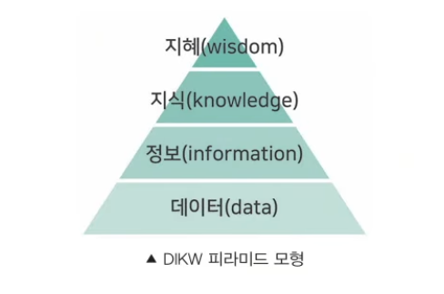

# 1장 데이터 이해 

## 01. 데이터와 정보 
### 데이터의 정의
#### 데이터(Data)
- 존재적 특성 : 추론과 추정의 근거를 이루는 객관적 사실을 뜻합니다.
- 당위적 특성 : 추론, 예측, 전망, 추정을 위한 근거를 의미합니다.

#### 데이터의 유형
1. 형태에 따른 구분
    - 정성 데이터 (Qualitative Data) : 언어, 문자로 표현한다.
    - 정량 데이터 (Quantitative Data) : 수치, 도형, 기호 등으로 표현합니다.

2. 구조에 따른 구분
    - 정형 데이터 (Structured Data) : 표형태 등 고정된 틀에 맞게 입력된 데이터를 의미합니다.
    - 비정형 데이터 (unstructured Data) : 이미지, 텍스트 등 고정된 틀을 적용하기 어려운 데이터를 의미합니다.

#### 지식 경영과 데이터
1. 암묵지 (Tactic Knowledge) : 개인에게 습득되어 있지만 밖으로는 드러나지 않는 지식을 의미한다.
2. 형식지 (Explicit Knowledge) : 문서, 영상 등으로 형상화되어 전달과 공유가 용이한 지식입니다.
3. 지식의 순환  
    지식 경영에서는 아래의 네 과정을 통해 암묵지와 형식지가 상호작용한다고 보면 됩니다.
    - 표출화 (Externalization) : 개인의 지식을 언어나 기호, 숫자 등의 형태를 가진 데이터로 표현
    - 연겨화 (Combination) : 상대의 표출화된 지식을 본인의 지식에 연결
    - 내면화 (Internalization) : 축적된 경험 및 데이터를 바탕으로 지식을 습득
    - 공동화 (Socialization) : 조직의 구성원이 동일한 지식을 공유


#### DIKW 피라미드

자주 혼용되는 데이터, 정보, 지식과 지혜를 계층적인 구조로 설명하는 모형입니다.

| 구분 | 내용 | 
| --- | ----------------------- | 
| 데이터 (Data) | 수치나 기호, 문자로 표현된 기록 그 자체를 의미 | 
| 정보 (Information) | 목적에 따라 데이터를 가공, 처리, 분석한 결과물 | 
| 지식 (Knowledge) | 정보를 연결하고 일반화한 체계적이고 가치 있는 사실 | 
| 지헤 (Wisdom) | 축적된 지식과 경험 및 아이디어를 결합한 창의적인 산물 | 



## 02. 데이터베이스
### 데이터베이스의 정의와 특징
#### 데이터베이스의 정의
- 데이터베이스 (Database DB)는 특정한 목적을 위한 수집한 데이터를 여러 사람이 공유하기 위해  
효율적으로 통합 관리되는 **정보의 집합**을 의미합니다.
- ADsP 가이드에서는 데이터베이스를 "문자, 기호, 음성, 화상, 영상 등 상호 관련된 다수의 콘텐츠를 정보 처리  
및 정보통신 기기에 의하여 체계적으로 수집 축적하여 다양한 용도와 방법으로 이용할 수 있도록 정리한 정보의 집합체"로 정의합니다.
- 데이터베이스를 구축하고 유지, 관리할 수 있는 소프트웨어를 데이터베이스 관리 시스템 (DBMS Datbase Mannagement System)

#### 데이터베이스의 특징

| 구분       | 핵심 의미                                    |
| -------- | ---------------------------------------- |
| 통합된 데이터  | 여러 곳에 흩어진 데이터를 하나로 모아 관리하며, 중복을 최소화한 데이터 |
| 저장된 데이터  | 컴퓨터가 접근할 수 있는 저장 매체에 저장된 데이터             |
| 공용 데이터   | 여러 사용자나 여러 프로그램이 공동으로 사용하는 데이터           |
| 변화되는 데이터 | 삽입, 수정, 삭제로 계속 변하지만 항상 정확성을 유지해야 하는 데이터  |
| 기계 가독성   | 사람이 아니라 컴퓨터가 읽고 처리할 수 있는 형태의 데이터         |
| 검색 가능성   | 조건에 맞는 데이터를 조회하고 찾아낼 수 있음                |
| 원격 조작성   | 네트워크를 통해 멀리서도 데이터에 접근하고 조작할 수 있음         |

> 핵심 키워드 정리
> | 문제 표현                     | 떠올릴 개념   |
> | ------------------------- | -------- |
> | 중복 최소화, 일관성 유지, 통합 관리     | 통합된 데이터  |
> | 디스크, SSD, 저장 매체에 저장       | 저장된 데이터  |
> | 여러 사용자, 공동 사용, 여러 응용 프로그램 | 공용 데이터   |
> | 추가, 수정, 삭제, 최신 상태 유지      | 변화되는 데이터 |
> | 컴퓨터가 읽고 처리 가능             | 기계 가독성   |
> | 조건 검색, 조회, 추출             | 검색 가능성   |
> | 네트워크 접근, 원격지 조작           | 원격 조작성   |


### 데이터베이스 활용
1. 기업 내부 데이터베이스
- 기업 경영 전반에 관한 인사, 조직, 생산, 영업 활동을 포함한 모든 데이터를 연계하여 일관된 체계로 구축, 운영되며 경영 활동의 기반이 되는 시스템입니다.
- 제조, 금융, 유통 등 다양한 부분에 걸쳐 기업 데이터베이스의 도입 및 시스템 확장이 이뤄져왔으며, 오늘날에도 빅데이터와 AI에 대응하기 위해 시스템 구축이 이뤄지고 있습니다.

2. 데이터베이스 관련 용어
    - OLTP (OnLine Transaction Processing) : 금융 거래, 주문 처리, 고객 관리, 생산 과정 등에서 발생한 이벤트 등 트랜잭션을 실시간으로 처리하는 시스템을 의미하며, 이 과정에서 생성된 데이터는 DW로 전송됩니다.
    - DW (Data Warehouse, 데이터 웨어하우스)
        - 다양한 출처에서 데이터를 통합하여 저장하는 중앙 저장소(창고)이며, 기업의 데이터를 전사적으로 통합한 DW를 EDW(Enterprise Data Warehouse)라고 부른다.
        - 모든 부서와 기능의 데이터를 포함하는 중앙 집중식 데이터 관리가 특징이며, OLTP에서 수집된 데이터를 통합하고 저장합니다.
    - DM (Data Mart, 데이터 마트)
        - 특정 부서나 기능에 맞춘 소규모 DW로 EDW의 하위 집합으로 볼 수 있습니다.
        - 월 마감 보고서 생성 등 반복적이고 조직적으로 이뤄지는 데이터 조회 및 활용작업을 효율적으로 처리하기 위해 생성하고 활용할 수 있습니다.
        - 데이터 마이닝 모델링 과정에서 필요한 데이터를 미리 DM을 생성할 수 있으며, DW의 데이터를 수집, 변형, 집계하여 생성한다.
    - OLAP (OnLine Analytical Processing)
        - DW, DM 등에 저장된 대용량 데이터를 다양한 방법으로 분석하여 의사결정에 도움을 주느 시스템입니다.
        - 대시보드 등을 생성하는 비즈니스 인텔리전스, 데이터 마이닝 등에 활용됩니다.

> 데이터베이스 관련 용어 핵심 정리 
쇼핑몰에서 다음과 같은 일이 발생한다고 하면,

- 고객이 상품을 주문한다.
- 결제가 발생한다.
- 배송 상태가 변경된다.
- 고객 문의가 등록된다.

이런 실제 업무 처리는 OLTP에서 일어납니다.  
그 후 이 데이터를 한 곳에 모아 분석용으로 저장하면 DW입니다.  
그리고 마케팅팀, 재무팀, 물류팀처럼 부서별로 필요한 데이터만 따로 뽑아두면 DM입니다.  
마지막으로 이 데이터를 가지고 매출 분석, 고객 분석, 상품 분석을 하면 OLAP입니다.

#### 데이터베이스 활용 전략 용어
1. ERP (Enterprise Resource Planning)
    - 기업의 모든 자원과 프로세스를 통합적으로 관리하는 시스템으로 데이터베이스 활용이 필수적입니다.
    - 전사적인 운영 효율성을 높이고, 데이터의 일관성을 유지하며, 실시간으로 비즈니스 인사이트를 제공하는 것을 목적으로 합니다.
2. 경영정보시스템 (Management Information System, MIS)  
    기업의 생산성과 수익성을 높이기 위해 기업의 경영관리에 필요한 정보를 신속히 수집, 가공, 축정하여 조직 내 구성원에게 제공, 공유하는 시스템을 의미합니다.
3. CRM (Customer Relationship Management, 고객 경험 관리)  
    고객 만족도와 충성도를 높이기 위해서 고객 데이터를 수집, 분석하여 맞춤형 서비스를 제공하고 마케팅 등에 활용합니다.
4. RM (Risk Management)  
    금융업을 중심으로 계약 및 거래의 연체를 관리하기 위해 데이터 마이닝 등을 활용하여 위험을 수치화하고 최소화하거나 제어하기 위한 일련의 과정을 의미합니다.
5. SCM (Supply Chain Management, 공급망 관리)  
    제조업 및 유통업에서 공급만 전체를 관리하는 시스템으로, 원재료의 수급부터 최종 제품의 고객 전달까지의 모든 과정을 효율적으로  관리하고 비용 절감과 서비스 수준 향상을 목표로 합니다.
6. BI (Business Intelligence, 비즈니스 인텔리전스)  
    기업의 데이터를 분석하여 유용한 정보를 도출하고, 이를 바탕으로 의사결정을 지원하는 시스템으로 KPI 등 지표와 데이터 마이닝의 결과 등을 데이터 시각화, 대시보드로 표현합니다.

> 기업 정보 시스템 핵심 정리

| 용어  | 핵심 의미                             | 키워드                 |
| --- | --------------------------------- | ------------------- |
| ERP | 기업의 자원과 업무 프로세스를 통합 관리하는 시스템      | 전사 자원 관리, 통합, 업무 효율 |
| MIS | 경영 의사결정에 필요한 정보를 수집·가공·제공하는 시스템   | 경영 정보, 의사결정 지원      |
| CRM | 고객 데이터를 분석해 고객 만족도와 충성도를 높이는 시스템  | 고객 관리, 맞춤형 마케팅      |
| RM  | 위험을 분석하고 수치화하여 최소화하거나 관리하는 과정     | 위험 관리, 리스크 분석       |
| SCM | 원재료 조달부터 고객 전달까지 공급망 전체를 관리하는 시스템 | 공급망 관리, 물류, 비용 절감   |
| BI  | 기업 데이터를 분석해 의사결정을 돕는 시스템          | 데이터 분석, 대시보드, KPI   |

**흐름으로 이해하기** 
- ERP = 회사 내부 자원과 업무를 통합 관리
- MIS = 경영진과 조직 구성원에게 필요한 정보를 제공
- CRM = 고객 데이터를 활용해 고객 관계를 관리
- RM = 위험 요소를 분석하고 관리
- SCM = 공급망 전체 흐름을 효율적으로 관리
- BI = 데이터를 분석해 의사결정을 지원

# 2장 데이터의 가치와 미래
## 01. 빅데이터의 이해 
### 빅데이터의 이해
#### 다양한 빅데이터 정의 및 특성
1. 규모 중심 정의 : 일반적인 데이터베이스 소프트웨어로 저장, 관리, 분석할 수 있는 범위를 초과하는 규모의 데이터입니다.
2. 분석 비용 및 기술 초점 정의 : 다양한 종류의 대규모 데이터로부터 저렴함 비용으로 가치를 추출하고 데이터의 초고속 수집, 발굴, 분석을 지원하도록 고안된 차세대 기술 및 아키텍쳐입니다.
3. 빅데이터의 특성 "3V"
    - Volumne(양, 크기) : 데이터의 용량, 물리적인 크기가 커지고 있습니다.
    - Variety(다양성) : 다양한 유형의 데이터가 생성, 저장되고 있습니다.
    - Velocity(속도) : 수집과 처리, 활용 과정에서 속도가 빨라지고 주기가 단축되고 있습니다.


- 기존 3V에 Veracity(정확성), Value(가치), Visualization(시각화) 등의 속성을 더하기도 합니다.

### 빅데이터의 출현 배경 및 영향
#### 빅데이터 출현 배경
1. **데이터 산업의 진화**
   거래를 정확하게 기록하고 거래 자동화를 지원하던 데이터 처리 중심의 비즈니스가 점차 확장되면서, 더 많은 데이터를 연결·활용·분석하는 비즈니스로 발전하였다.

2. **비즈니스 데이터의 축적**
   IT 기술의 발전과 다양한 IT 비즈니스의 성장으로 금융, 유통, 제조 등 여러 산업에서 데이터가 지속적으로 축적되었다.
   또한 스마트 디바이스, SNS, 이커머스 플랫폼의 확산으로 고객, 콘텐츠, 거래 관련 데이터가 대량으로 생성되었다.

3. **데이터 관련 기술의 발전**
   CPU, 메모리, 저장장치 등의 성능 향상으로 더 많은 데이터를 낮은 비용으로 처리·저장·활용할 수 있게 되었다.
   또한 인터넷, 센서, 스마트 디바이스, 클라우드, 분산처리 기술의 발전으로 대규모 데이터를 실시간으로 생성·이동·처리할 수 있는 환경이 조성되었다.

4. **데이터 및 알고리즘 기반 연구 활발**
   통계학, 수학, 컴퓨터공학 등 다양한 학문 분야에서 데이터 처리와 분석을 위한 알고리즘 연구가 활발해졌다.
   이를 통해 더 많은 데이터를 빠르게 처리하고, 복잡한 데이터에서 정보를 추출하며 가치를 창출하는 분석 방법이 발전하였다.

> 한 줄 정리
> 1. **데이터 산업의 진화**: 데이터가 단순 기록 대상에서 분석·활용 대상으로 발전하였다.
> 2. **비즈니스 데이터의 축적**: 산업과 플랫폼의 성장으로 대량의 데이터가 쌓이게 되었다.
> 3. **데이터 관련 기술의 발전**: 저장·처리·전송 기술의 발전으로 대규모 데이터 활용이 가능해졌다.
> 4. **데이터 및 알고리즘 기반 연구 활발**: 데이터 분석 알고리즘의 발전으로 복잡한 데이터에서 가치를 찾을 수 있게 되었다.

#### 빅데이터 영향

1. **빅데이터 관심 증가**
   첨단 기술, 연구, 렌즈 등에서 비유되는 빅데이터는 차세대 산업 혁신에 꼭 필요한 요소로 관심이 높아지고 있다.

2. **빅데이터 영향 증대**
   4차 산업혁명의 기반 기술인 데이터, 네트워크, 인공지능이 중요해지면서 데이터의 활용 가치가 커지고 있다.
   기업, 학계, 정부, 개인 등 다양한 주체가 빅데이터에 관심을 가지고 투자하고 있으며, 고도화된 분석을 통해 혁신, 경쟁력 제고, 생산성 향상 등 미래 대응에 활용하고 있다.

> 한 줄 정리
> 1. **빅데이터 관심 증가**: 빅데이터가 차세대 산업 혁신의 핵심 요소로 주목받고 있다.
> 2. **빅데이터 영향 증대**: 데이터, 네트워크, 인공지능 기반으로 빅데이터 활용 가치가 커지고 있다.

#### 데이터 분석 방향 변화

* 데이터 분석 영역에서도 빅데이터는 분석 전략 수립, 분석 방법, 분석 수행 절차 등에 큰 영향을 미칩니다.
* 특히 `주제 설정 → 실험 계획 → 실험 및 데이터 수집 → 데이터 처리 → 분석 → 결과 도출` 단계로 진행되는 데이터 기반 연구는 아래와 같이 4가지 방향으로 변화했습니다.

1. **사전 처리 → 사후 처리**
   기존에는 분석 목적에 맞는 데이터를 미리 수집하고, 불필요한 데이터를 제거하는 **사전 처리**가 중요했습니다.
   그러나 빅데이터 환경에서는 운영 과정에서 이미 대량의 데이터가 축적되는 경우가 많기 때문에, 축적된 데이터에서 분석 주제를 정하고 처리하는 **사후 처리**가 중요해졌습니다.

2. **표본조사 → 전수조사**
   기존에는 데이터 수집 비용과 시간의 한계로 일부 대상만 조사하는 **표본조사**가 일반적이었습니다.
   그러나 빅데이터 환경에서는 이미 축적된 대량의 데이터를 활용할 수 있기 때문에, 가능한 전체 데이터를 분석하는 **전수조사** 방식이 가능해졌습니다.
   다만 한 회사의 데이터베이스에 모든 비즈니스 데이터가 존재하는 것은 아니므로, 전수조사처럼 보이더라도 해석에 주의가 필요합니다.

3. **질 → 양**
   빅데이터 환경에서는 더 많은 데이터를 활용할수록 오류를 줄이고 분석 성능을 높일 수 있습니다.
   하지만 데이터가 많다고 항상 좋은 분석 결과가 나오는 것은 아니며, 분석에 적합하지 않은 데이터나 불필요한 데이터를 제거하여 **데이터의 질을 높이는 작업**이 중요합니다.

4. **인과관계 → 상관관계**
   기존의 분석에서는 실험 설계와 통제를 통해 원인과 결과를 밝히는 **인과관계** 분석이 중요했습니다.
   그러나 빅데이터 환경에서는 데이터가 계획적으로 수집되지 않고 다양한 상황에서 축적되는 경우가 많기 때문에, 원인을 명확히 밝히기보다 변수 간의 패턴이나 관계를 찾는 **상관관계** 분석이 중요해졌습니다.
   다만 상관관계가 있다고 해서 반드시 인과관계가 성립하는 것은 아니므로 해석에 주의해야 합니다.

#### 한 줄 정리

```text
사전 처리 → 사후 처리: 미리 정리하기보다 쌓인 데이터를 나중에 분석
표본조사 → 전수조사: 일부 표본보다 가능한 전체 데이터를 활용
양 → 질: 데이터가 많아도 분석에 적합한 데이터가 중요
인과관계 → 상관관계: 원인 규명보다 패턴과 관계 발견 중심
```


### 빅데이터 위기 요인과 통제 방안

빅데이터는 많은 데이터를 활용해 새로운 가치를 만들 수 있지만, 잘못 활용하면 **사생활 침해, 책임 회피, 데이터 오용** 같은 문제가 발생할 수 있습니다.
따라서 빅데이터 활용에서는 **위기 요인**과 이를 줄이기 위한 **통제 방안**을 함께 이해해야 합니다.

---

#### 위기 요인

1. **사생활 침해**
   빅데이터 분석 과정에서 개인의 금융 정보, 통신 정보, 주민등록 정보, 납세 정보 등 민감한 정보가 활용되거나 유출될 수 있습니다.
   이 경우 개인의 사생활이 침해될 위험이 있습니다.

2. **책임 원칙 훼손**
   알고리즘이 개인의 실제 행동이 아니라, 개인이 속한 집단의 특성을 바탕으로 판단할 수 있습니다.
   예를 들어 대출, 채용, 보험 심사 등에서 특정 집단에 속한다는 이유만으로 불리한 결과가 발생할 수 있습니다.
   이처럼 개인의 잘못이 아닌데도 불이익을 받는 문제가 생길 수 있습니다.

3. **데이터 오용**
   데이터나 알고리즘을 제대로 이해하지 못한 상태에서 분석 결과를 맹목적으로 믿으면 잘못된 의사결정으로 이어질 수 있습니다.
   특히 오류가 있거나 불완전한 데이터를 기반으로 분석하면 피해가 발생할 수 있습니다.

---

#### 통제 방안

1. **동의에서 책임으로 전환**
   기존에는 개인정보 제공자의 동의를 받는 것에 초점이 있었습니다.
   하지만 빅데이터 환경에서는 데이터가 다양한 방식으로 재활용되기 때문에, 단순한 동의보다 **데이터 사용자의 책임**을 강화해야 합니다.

2. **결과 기반 책임 원칙 고수**
   알고리즘의 예측만으로 책임을 묻는 것이 아니라, 실제 발생한 결과를 바탕으로 책임을 판단해야 합니다.
   즉, 특정 성향이나 집단에 속한다는 이유만으로 불이익을 주는 것을 방지해야 합니다.

3. **알고리즘 접근 허용**
   알고리즘의 무분별한 활용과 데이터 오용을 줄이기 위해 알고리즘에 대한 접근성과 검증 가능성을 높여야 합니다.
   이를 통해 알고리즘이 객관적이고 공정하게 작동하는지 확인할 수 있어야 합니다.

---

#### 위기 요인과 통제 방안 연결

| 위기 요인    | 문제 내용                              | 통제 방안          |
| -------- | ---------------------------------- | -------------- |
| 사생활 침해   | 개인정보가 과도하게 활용되거나 유출될 수 있음          | 동의에서 책임으로 전환   |
| 책임 원칙 훼손 | 개인의 실제 행동이 아닌 집단 특성으로 불이익을 받을 수 있음 | 결과 기반 책임 원칙 고수 |
| 데이터 오용   | 잘못된 데이터나 알고리즘을 맹신해 잘못된 판단을 할 수 있음  | 알고리즘 접근 허용     |

---

#### 한 줄 정리

```text
사생활 침해 → 동의보다 사용자 책임 강화
책임 원칙 훼손 → 예측이 아니라 실제 결과 기준으로 책임 판단
데이터 오용 → 알고리즘 검증과 접근 허용
```

---

#### 핵심 요약

```text
빅데이터의 위기 요인은 사생활 침해, 책임 원칙 훼손, 데이터 오용이다.

이를 통제하기 위해서는
개인정보 제공자의 동의에만 의존하지 않고,
데이터 사용자의 책임을 강화해야 하며,
알고리즘 예측이 아닌 실제 결과를 기준으로 책임을 판단하고,
알고리즘을 검증할 수 있도록 접근성을 보장해야 한다.
```

---

#### 시험용 압축 암기

| 구분           | 암기 키워드          |
| ------------ | --------------- |
| 사생활 침해       | 개인정보 유출·활용 문제   |
| 책임 원칙 훼손     | 집단 특성에 따른 불이익   |
| 데이터 오용       | 잘못된 데이터·알고리즘 맹신 |
| 동의에서 책임으로 전환 | 개인정보 사용자 책임 강화  |
| 결과 기반 책임 원칙  | 예측이 아닌 결과 기준 판단 |
| 알고리즘 접근 허용   | 알고리즘 검증과 객관성 확보 |

## 02. 데이터 사이언스
### 빅데이터 분석과 데이터 사이언스
#### 전략 수립의 중요성
1. 인프라 중심 투자 한계 및 회의론 등장
    - 빅데이터에 대한 기업의 관시이 높아지고 하드웨어 중심의 빅데이터 인프라를 도입하기 위한 투자가 활발하지만,  
    이후 데이터를 활용하고 가치를 창출하기 위한 전략의 부재로 인해 한계를 느끼기도 합니다.
    - 과거 CRM 도입 시기에도 비슷한 사례가 있으며, 이미 기존에 운영하고 있던 서비스와 방법론을 빅데이터 사례로  
    포장하는 경우들이 발생하고 있습니다.

2. 활용 가능성 및 가치 창출 중심의 빅데이터 전략 수립 필요
    - "큰 데이터를 잘 저장한다"는 단순한 전략에서 벗어나 빅데이터를 활용해서 정보와 인사이트를 얻고,  
    이를 바탕으로 기업과 사회에 영향을 미칠 수 있는 가치를 창출할 수 있는 전략이 필요합니다.
    - 예를 들어, 데이터 분석 과정에서 복잡한 알고리즘을 사용하는 것보다 분석 결과가 의미가 있어야 하며,  
    통찰력 있는 인력이 이를 올바르게 이해하고 비즈니스에 적용 가능한 전략을 수립하고 실행하며, 결과를 평가할  
    수 있는 체계가 마련되어야 한다.

### 빅데이터 분석의 3요소

빅데이터 분석이 제대로 이루어지기 위해서는 **데이터, 기술, 인력**이 함께 필요합니다.

| 요소  | 핵심 내용                      |
| --- | -------------------------- |
| 데이터 | 분석의 대상이 되는 원천 자료           |
| 기술  | 데이터를 처리·저장·분석·활용하는 도구와 방법  |
| 인력  | 데이터를 이해하고 비즈니스 가치로 연결하는 사람 |


### 산업별 주요 데이터 활용 및 분석 주제

| 산업        | 데이터 활용 및 분석 주제                                      |
| --------- | --------------------------------------------------- |
| 전 산업 공통   | 수요 예측 및 목표 설정, 지표 관리, 업무 자동화, BI 대시보드 생성            |
| B2C 공통    | 고객 세분화, 개인화 마케팅, 고객 이탈 예측, 챗봇 및 AI 기반 콜센터 운영        |
| 이커머스, 콘텐츠 | 상품 및 서비스 콘텐츠 추천, 트래픽 관리                             |
| 금융        | 리스크 관리, 마케팅 전략 수립, 신용 점수 관리, 투자 포트폴리오 최적화, 부정 거래 탐지 |
| 유통        | 판매 예측, 재고 최적화, 판촉 및 매대 관리, 가격 최적화                   |
| 제조        | 품질 관리, 불량 예측, 공급망 최적화, 공정 개발, 디지털 트윈, 실시간 모니터링      |
| 운송        | 일정 관리, 물류 관리, 교통량 예측 및 경로 최적화                       |
| 헬스케어      | 진단 예측, 환자 건강 데이터 모니터링, 신약 개발                        |
| 에너지       | 수요 예측, 설비 유지보수, 에너지 효율 분석, 사용 패턴 분석                 |

### 주요 알고리즘 예시

### 주요 알고리즘 예시

1. **연관 규칙(Association Rule)**
   함께 발생하거나 함께 구매되는 항목 간의 관계를 찾는 기법입니다.
   장바구니 분석이라고도 하며, 구매 데이터를 활용해 특정 상품과 함께 자주 구매되는 상품을 찾고 추천에 활용합니다.

   ```text
   예시: 장바구니 분석, 연관 상품 추천
   ```

2. **협업 필터링(Collaborative Filtering)**
   사용자 평점, 구매 이력, 행동 데이터 등을 바탕으로 사용자 간 유사도 또는 콘텐츠 간 유사도를 계산해 추천하는 기법입니다.
   비슷한 취향을 가진 사용자의 선택을 참고하여 상품이나 콘텐츠를 추천할 때 사용합니다.

   ```text
   예시: 영화 추천, 상품 추천, 콘텐츠 추천
   ```

3. **회귀(Regression)**
   관심 대상이 수치형 데이터일 때, 여러 변수 간의 관계를 활용해 값을 예측하는 기법입니다.
   금액, 수량, 점수처럼 숫자로 표현되는 값을 예측할 때 사용합니다.

   ```text
   예시: 카드 사용 금액 예측, 매출 예측, 불량 건수 예측
   ```

4. **분류(Classification)**
   관심 대상이 범주형 데이터일 때, 데이터를 정해진 그룹이나 범주로 나누는 기법입니다.
   결과가 `예/아니오`, `정상/불량`, `연체/정상`처럼 구분되는 문제에 활용됩니다.

   ```text
   예시: 연체 여부 예측, 불량 여부 예측, 이미지 객체 구분
   ```

5. **유전 알고리즘(Genetic Algorithm)**
   생물의 진화 원리를 모방하여 복잡한 조건에서 최적의 값을 찾는 최적화 기법입니다.
   가능한 여러 해답 중에서 더 나은 해답을 반복적으로 선택하며 최적값을 찾습니다.

   ```text
   예시: 경로 최적화, 생산 일정 최적화, 자원 배치 최적화
   ```

6. **네트워크 분석(Network Analysis)**
   여러 개체 간의 관계와 상호작용 정도를 수치화하고 시각적으로 표현하여 분석하는 기법입니다.
   사람, 문서, 웹페이지, 생물학적 요소 등 다양한 대상 간의 연결 관계를 분석할 때 사용합니다.

   ```text
   예시: 소셜 네트워크 분석, 정보 네트워크 분석, 생물학적 네트워크 분석
   ```

7. **감정 분석(Sentiment Analysis)**
   텍스트 데이터에 담긴 감정이나 의견을 분석하는 기법입니다.
   자연어 처리와 분류 알고리즘을 활용하여 긍정, 부정, 중립 등의 감정을 파악합니다.

   ```text
   예시: 고객 리뷰 분석, 설문조사 분석, SNS 반응 분석
   ```

#### 시험용 한 줄 정리

```text
연관 규칙 = 함께 발생하는 관계 분석
협업 필터링 = 유사한 사용자나 콘텐츠 기반 추천
회귀 = 숫자 값 예측
분류 = 범주 구분
유전 알고리즘 = 최적값 탐색
네트워크 분석 = 관계 구조 분석
감정 분석 = 텍스트의 감정과 의견 분석
```
### 데이터 사이언스의 의미와 역할

### 데이터 사이언스의 의미와 역할

#### 1. 데이터 사이언스

* 데이터 사이언스는 데이터에서 **유의미한 인사이트를 도출하기 위해 다양한 기법과 도구를 활용하는 학문**입니다.
* 통계학, 수학, 컴퓨터 과학, 머신러닝, 데이터 시각화 등을 포함합니다.
* 데이터 수집, 처리, 분석, 모델링, 예측, 시각화 과정을 통해 **데이터 기반 의사결정**을 지원합니다.

```text
데이터 사이언스 = 데이터를 분석하여 인사이트를 찾고 의사결정을 돕는 학문
```

---

#### 2. 데이터 사이언스의 구성 영역

1. **정보기술(IT) 영역**
   데이터 분석을 위한 기술적 기반을 제공하는 영역입니다.
   데이터베이스, 서버, 네트워크, 클라우드, 보안, 데이터 처리 기술 등이 포함됩니다.

   ```text
   IT 영역 = 데이터를 저장하고 처리할 수 있는 기술 기반
   ```

2. **분석(Analytics) 영역**
   데이터를 수집, 처리, 분석하여 의미 있는 결과를 도출하는 영역입니다.
   통계, 머신러닝, 데이터 마이닝, 예측 모델링, 데이터 시각화 등이 포함됩니다.

   ```text
   분석 영역 = 데이터에서 패턴과 인사이트를 찾는 영역
   ```

3. **비즈니스 분석(Business Analysis) 영역**
   비즈니스 문제를 정의하고, 데이터를 활용해 해결책을 제안하는 영역입니다.
   요구사항 분석, 프로세스 개선, 전략 수립, 의사결정 지원 등이 포함됩니다.

   ```text
   비즈니스 분석 영역 = 데이터를 실제 비즈니스 문제 해결에 연결하는 영역
   ```

---

#### 3. 데이터 사이언티스트

1. **정의와 역할**
   데이터 사이언티스트는 데이터 사이언스의 기법과 도구를 활용하여 데이터를 분석하고, 인사이트를 도출하는 전문가입니다.
   데이터 수집과 처리부터 분석, 모델링, 시각화, 비즈니스 문제 해결까지 폭넓은 역할을 수행합니다.

   ```text
   데이터 사이언티스트 = 데이터를 분석해 비즈니스 가치를 만드는 전문가
   ```

2. **요구 역량**

   | 역량 구분    | 핵심 내용                                |
   | -------- | ------------------------------------ |
   | 기술적 역량   | 빅데이터, 알고리즘, 통계, 분석 방법론에 대한 이해        |
   | 분석 설계 역량 | 경험과 분석 기술을 바탕으로 최적의 분석 방법을 설계하는 능력   |
   | 비기술적 역량  | 창의적 사고, 호기심, 논리적 비판 능력               |
   | 전달 역량    | 스토리텔링과 시각화를 통해 분석 결과를 설득력 있게 전달하는 능력 |
   | 협업 역량    | 원활한 소통을 통해 다른 분야와 협력하는 능력            |

---

#### 4. 시험용 핵심 정리

```text
데이터 사이언스 = 데이터에서 인사이트를 도출하는 학문

구성 영역
1. IT 영역 = 데이터 저장·처리 기반
2. 분석 영역 = 통계·머신러닝·데이터 마이닝
3. 비즈니스 분석 영역 = 문제 정의와 의사결정 지원

데이터 사이언티스트 = 데이터를 분석해 비즈니스 문제 해결에 활용하는 전문가
```

---

#### 5. 한 줄 암기

```text
데이터 사이언스는 IT 기술, 분석 역량, 비즈니스 이해를 결합해 데이터에서 가치를 찾는 분야이다.
```
