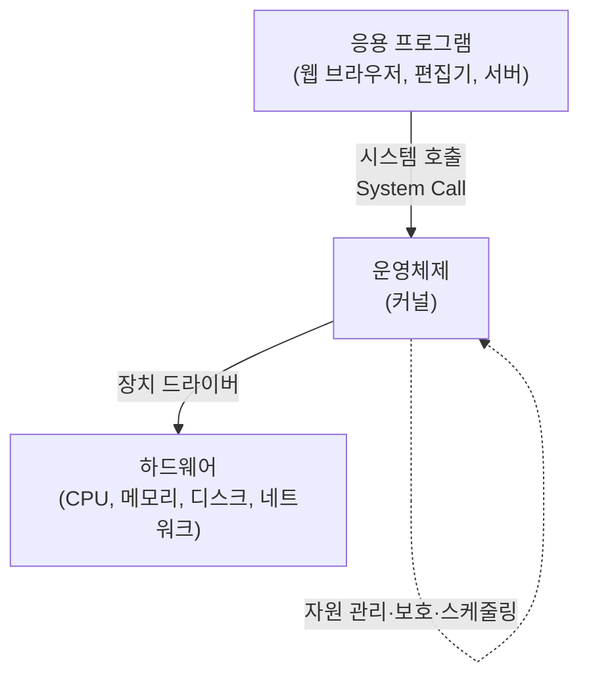
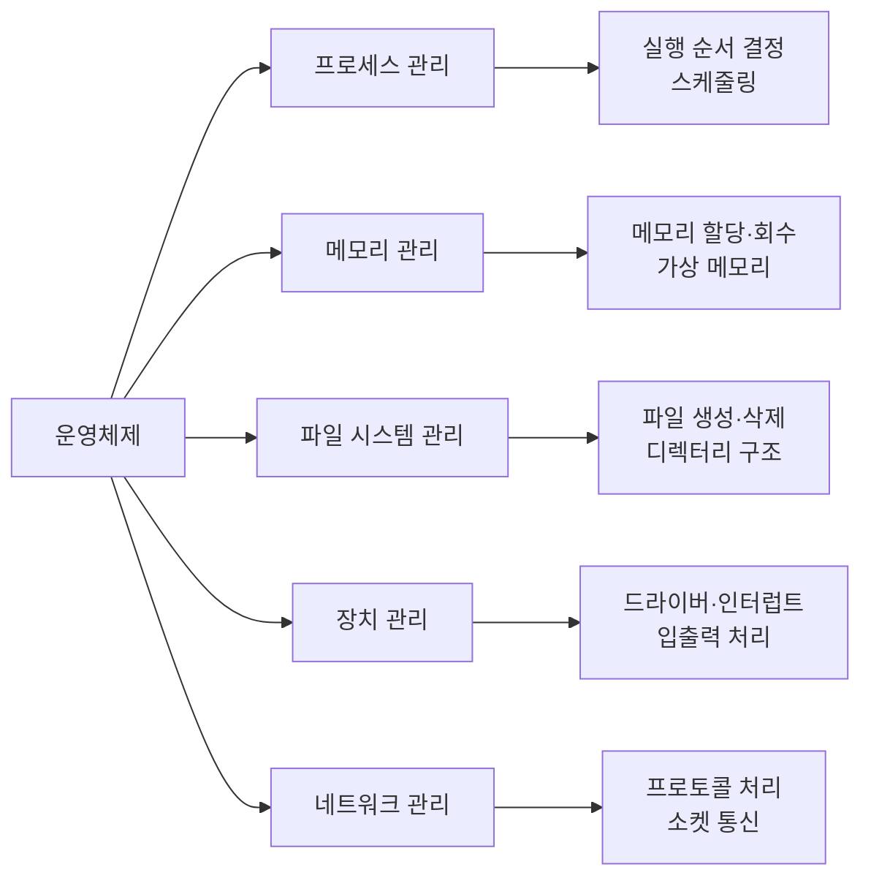
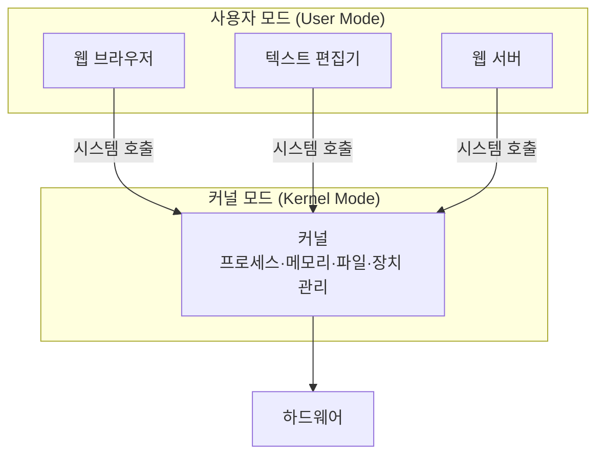
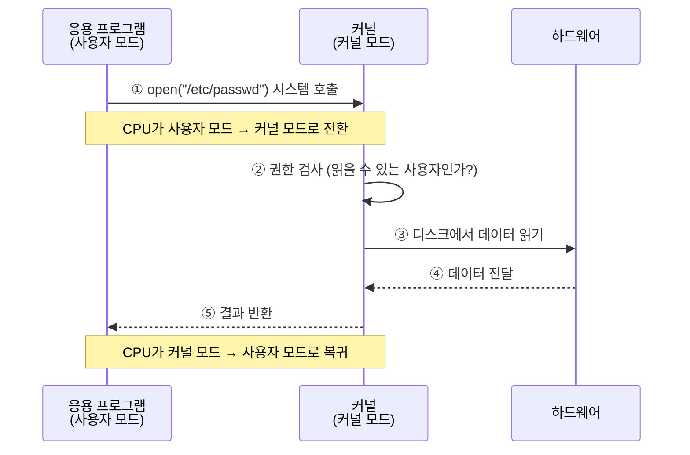
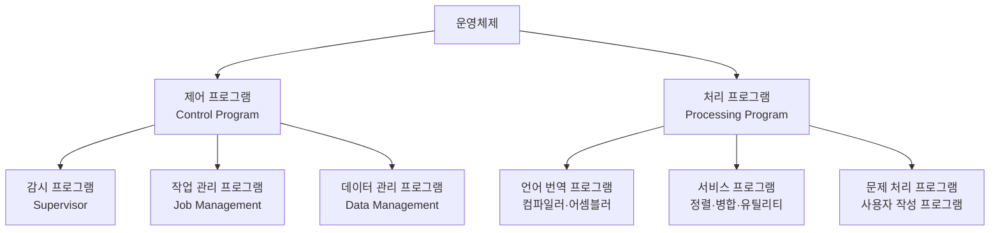
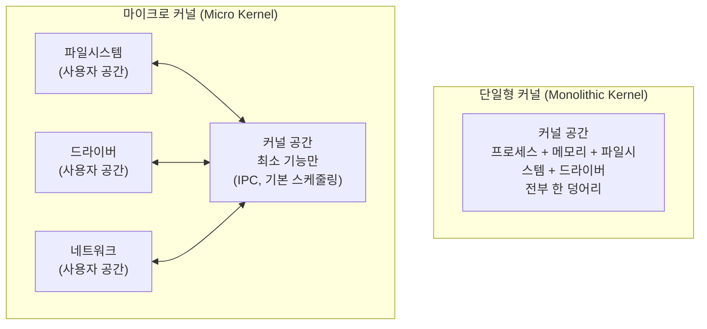

## 001. 운영체제의 개요

### 1. 운영체제란 무엇인가

운영체제(OS, Operating System)는 **하드웨어와 응용 프로그램 사이에서 자원을 관리하고 중계하는 소프트웨어**입니다.

컴퓨터를 처음 배울 때 "운영체제는 컴퓨터를 관리하는 프로그램"이라고 배우지만, 이 설명만으로는 감이 잘 오지 않습니다.  
조금 더 구체적으로 접근해 보겠습니다.

#### 운영체제가 없다면 어떤 일이 벌어질까?

여러분이 `printf("Hello")` 한 줄을 실행한다고 해 봅시다. 운영체제가 없다면 이 프로그램은 다음을 **직접** 해야 합니다.

- 지금 사용 중인 그래픽 카드가 어느 회사 제품인지 파악하고
- 그 제품이 이해하는 신호 형식으로 문자를 변환하고
- 화면의 어느 픽셀에 어떤 색을 칠할지 계산하고
- 다른 프로그램이 같은 화면 영역을 쓰고 있지는 않은지 확인해야 합니다

프로그램 하나를 만들 때마다 세상의 모든 그래픽 카드를 알아야 한다면, 소프트웨어는 만들어질 수 없습니다.

운영체제는 이 복잡함을 대신 떠맡고, 응용 프로그램에는 **"화면에 글자를 써 달라"는 단순한 요청 창구 하나**만 제공합니다.



즉, 운영체제의 본질은 두 가지입니다.

| 역할 | 의미 |
| --- | --- |
| **자원 관리자(Resource Manager)** | CPU·메모리·디스크·장치를 프로그램들에게 **공평하고 안전하게 나눠 줍니다.** |
| **확장된 기계(Extended Machine)** | 복잡한 하드웨어를 감추고 **다루기 쉬운 인터페이스**로 포장합니다. |

---

### 2. 운영체제의 목적 (성능 평가 기준)

운영체제가 얼마나 잘 동작하는지는 다음 네 가지로 평가합니다. **자격증 시험에 매우 자주 나오는 항목**입니다.

| 기준 | 의미 | 좋아지는 방향 |
| --- | --- | --- |
| **처리 능력 (Throughput)** | 일정 시간 동안 처리한 작업의 **양** | **향상 (증가)** |
| **반환 시간 (Turnaround Time)** | 작업을 요청하고 결과를 받기까지 걸린 **시간** | **단축 (감소)** |
| **사용 가능도 (Availability)** | 필요할 때 자원을 **즉시 쓸 수 있는 정도** | **향상 (증가)** |
| **신뢰도 (Reliability)** | 주어진 작업을 **정확하게** 처리하는 정도 | **향상 (증가)** |

#### 왜 반환 시간만 방향이 반대일까?

나머지 셋은 **"많을수록 좋은 것"** (양·가용성·정확성)이지만,  
반환 시간은 **"내가 기다린 시간"** 이기 때문입니다. 기다림은 짧을수록 좋습니다.

> **시험 포인트**  
> "운영체제의 목적으로 옳지 않은 것은?" 문제에서 **"반환 시간의 증가"** 같은 선택지가 자주 등장합니다.  
> **처리능력↑ 사용가능도↑ 신뢰도↑ 반환시간↓** 로 외우면 됩니다.

---

### 3. 운영체제의 주요 기능

운영체제가 실제로 관리하는 대상은 크게 다섯 가지입니다.



**① 프로세스 관리**

- 실행 중인 프로그램(프로세스)의 **생성·종료·상태 전환**을 담당합니다.
- CPU는 하나(또는 몇 개)인데 프로그램은 수십 개이므로, **누가 언제 CPU를 쓸지 결정**해야 합니다. 이를 **스케줄링**이라고 합니다.

**② 메모리 관리**

- 각 프로세스에 메모리 공간을 할당하고, 끝나면 회수합니다.
- **가상 메모리** 기법으로 실제 RAM보다 큰 프로그램도 실행할 수 있게 합니다.
- 프로세스끼리 **서로의 메모리를 침범하지 못하도록 보호**합니다.

**③ 파일 시스템 관리**

- 디스크라는 "그냥 큰 저장 공간"을 **파일과 디렉터리라는 개념으로 추상화**합니다.
- 권한을 검사하여 허가된 사용자만 접근하게 합니다.

**④ 장치 관리**

- 키보드·디스크·프린터 등 각 장치의 **드라이버**를 통해 입출력을 처리합니다.
- 속도가 느린 장치 때문에 CPU가 놀지 않도록 **인터럽트·버퍼·스풀**을 활용합니다.

**⑤ 네트워크 관리**

- TCP/IP 프로토콜 스택을 구현하고, 프로그램에는 **소켓**이라는 통일된 통신 창구를 제공합니다.

---

### 4. 커널 모드와 사용자 모드

운영체제를 이해할 때 가장 중요한 개념 중 하나입니다.

CPU는 **두 가지 실행 모드**를 가지고 있습니다.

| 모드 | 권한 | 실행 주체 |
| --- | --- | --- |
| **커널 모드 (Kernel Mode / 특권 모드)** | 모든 명령어 실행 가능, 하드웨어 직접 접근 가능 | 운영체제 커널 |
| **사용자 모드 (User Mode)** | 제한된 명령어만 실행 가능, 하드웨어 직접 접근 불가 | 일반 응용 프로그램 |



#### 왜 모드를 나눌까?

모든 프로그램이 하드웨어를 직접 건드릴 수 있다면,

- 잘못 만든 프로그램 하나가 **다른 프로그램의 메모리를 망가뜨리고**
- 악성 프로그램이 **디스크 전체를 지울 수 있으며**
- 어떤 프로그램이 CPU를 독점해도 **운영체제가 뺏을 방법이 없습니다**

모드를 나누면 응용 프로그램은 **위험한 작업을 직접 할 수 없고**,  
반드시 운영체제에 **"이 작업을 대신 해 주세요"라고 요청**해야 합니다.  
이 요청 창구가 **시스템 호출(System Call)** 입니다.

#### 시스템 호출이 일어나는 순서



리눅스에서 실제로 어떤 시스템 호출이 일어나는지는 `strace` 명령으로 볼 수 있습니다.

```bash
# ls 명령이 내부적으로 호출하는 시스템 호출을 추적
$ strace -c ls
% time     seconds  usecs/call     calls    errors syscall
------ ----------- ----------- --------- --------- ----------------
 23.15    0.000141           7        19           mmap
 15.44    0.000094           9        10           openat
 12.15    0.000074           7        10           close
  ...
```

> `openat`, `read`, `write`, `close` 같은 것들이 바로 시스템 호출입니다.  
> 우리가 쓰는 모든 명령어는 결국 이 호출들의 조합입니다.

---

### 5. 운영체제의 구성

운영체제는 **제어 프로그램**과 **처리 프로그램**으로 나뉩니다.



| 구분 | 종류 | 역할 |
| --- | --- | --- |
| **제어 프로그램** | 감시 프로그램 | 시스템 전체 동작을 감시하고 제어 프로그램을 총괄합니다. |
| | 작업 관리 프로그램 | 작업의 연속 처리와 작업 전환을 담당합니다. |
| | 데이터 관리 프로그램 | 데이터·파일의 입출력과 저장·검색을 관리합니다. |
| **처리 프로그램** | 언어 번역 프로그램 | 원시 코드를 기계어로 번역합니다. |
| | 서비스 프로그램 | 사용자 편의를 위한 정렬·병합 등을 제공합니다. |
| | 문제 처리 프로그램 | 사용자가 직접 작성한 프로그램입니다. |

---

### 6. 커널의 구조 — 단일형 vs 마이크로

리눅스를 이해하려면 **커널을 어떤 구조로 만들 것인가**라는 논쟁을 알아야 합니다.



| 구분 | 단일형 커널 (Monolithic) | 마이크로 커널 (Micro) |
| --- | --- | --- |
| 구조 | 모든 기능이 **커널 안에 하나로** | 핵심만 커널, 나머지는 **사용자 공간** |
| 속도 | **빠름** (함수 호출로 직접 통신) | 느림 (메시지 전달 오버헤드) |
| 안정성 | 낮음 (드라이버 오류 → 전체 다운) | **높음** (일부 죽어도 커널은 생존) |
| 크기 | 큼 | 작음 |
| 예 | **Linux**, UNIX | Minix, QNX, Mach |

#### 리눅스는 어느 쪽일까?

리눅스는 **단일형 커널**입니다. 하지만 순수한 단일형은 아닙니다.

**모듈(Module)** 이라는 방식을 통해, 필요한 기능을 **실행 중에 커널에 붙였다 뗐다** 할 수 있습니다.

```bash
# 현재 적재된 커널 모듈 확인
$ lsmod | head -5
Module                  Size  Used by
xfs                  1515520  1
nf_conntrack          172032  1
e1000                 155648  0

# 모듈 적재 / 제거
$ modprobe e1000        # 적재
$ modprobe -r e1000     # 제거
```

그래서 리눅스는 **모듈화된 단일형 커널(Modular Monolithic Kernel)** 이라고 부릅니다.  
단일형의 속도를 유지하면서, 마이크로 커널의 유연함을 일부 가져온 절충안입니다.

---

### 7. 운영체제의 운영 방식

| 방식 | 설명 | 예 |
| --- | --- | --- |
| **일괄 처리 (Batch)** | 작업을 모아 두었다가 한꺼번에 처리 | 급여 계산, 청구서 발행 |
| **실시간 처리 (Real Time)** | 발생 즉시 **정해진 시간 안에** 처리 | 항공 예약, 미사일 제어 |
| **시분할 (Time Sharing)** | CPU 시간을 잘게 쪼개 여러 사용자에게 번갈아 할당 | 대부분의 대화형 시스템 |
| **다중 프로그래밍 (Multi-Programming)** | **하나의 CPU**로 여러 프로그램을 번갈아 실행 | |
| **다중 처리 (Multi-Processing)** | **여러 CPU**로 여러 프로그램을 실제 동시 실행 | 멀티코어 서버 |
| **분산 처리 (Distributed)** | 여러 컴퓨터에 작업을 나누어 처리 | 클라우드, 하둡 |

#### 시분할 시스템이 리눅스의 기본입니다

리눅스는 **다중 사용자(Multi-user) · 다중 작업(Multi-tasking)** 운영체제입니다.

CPU 시간을 **타임 슬라이스(Time Slice)** 라는 아주 짧은 단위로 나누고, 프로세스들에게 돌아가며 할당합니다.  
전환이 사람의 인지 속도보다 훨씬 빠르기 때문에, 사용자는 **모든 프로그램이 동시에 도는 것처럼** 느낍니다.

```mermaid
gantt
    title 시분할 방식 — CPU를 잘게 나눠 번갈아 사용
    dateFormat X
    axisFormat %L ms
    section CPU
    프로세스 A :0, 10
    프로세스 B :10, 20
    프로세스 C :20, 30
    프로세스 A :30, 40
    프로세스 B :40, 50
```



> **다중 프로그래밍 vs 다중 처리**  
> **다중 프로그래밍** = CPU 하나로 **번갈아** (동시처럼 보일 뿐)  
> **다중 처리** = CPU 여러 개로 **실제 동시에**  
> 시험에서 두 개념을 바꿔서 출제하는 경우가 많습니다.

---

### 8. 주요 운영체제 비교

| 운영체제 | 계열 | 특징 |
| --- | --- | --- |
| **UNIX** | — | 1969년 벨 연구소에서 개발. 이식성이 높고 다중 사용자·다중 작업을 지원합니다. 상용 라이선스입니다. |
| **Linux** | UNIX 계열 | UNIX와 호환되면서 **소스가 공개**된 무료 운영체제입니다. |
| **Windows** | 독자 | GUI 중심의 개인용 운영체제로, 상용 라이선스입니다. |
| **macOS** | UNIX 계열 | BSD 기반의 Darwin 커널을 사용합니다. |
| **Android** | Linux 계열 | **리눅스 커널** 위에 모바일 환경을 얹은 운영체제입니다. |

#### UNIX와 Linux의 관계

리눅스는 UNIX의 코드를 가져다 쓴 것이 **아닙니다.**  
UNIX의 **설계 사상과 인터페이스(POSIX 표준)** 를 참고하여 **처음부터 새로 작성**된 운영체제입니다.

그래서

- UNIX용으로 작성된 프로그램이 리눅스에서도 대부분 동작하고 (호환성)
- 라이선스 문제 없이 자유롭게 쓸 수 있습니다 (독립적으로 개발)

이 부분은 다음 문서([002. 리눅스의 개요와 역사])에서 자세히 다룹니다.

---

### 시험 포인트 정리

| 항목 | 핵심 |
| --- | --- |
| 운영체제 목적 | 처리능력↑, 사용가능도↑, 신뢰도↑, **반환시간↓** |
| 커널/사용자 모드 | 사용자 모드는 하드웨어 직접 접근 **불가**, **시스템 호출**로 요청 |
| 리눅스 커널 구조 | **모듈화된 단일형(Monolithic)** — 마이크로 커널 아님 |
| 다중 프로그래밍 | CPU **1개**로 번갈아 |
| 다중 처리 | CPU **여러 개**로 실제 동시 |
| 제어 프로그램 | 감시 / 작업 관리 / 데이터 관리 |
| 처리 프로그램 | 언어 번역 / 서비스 / 문제 처리 |

---

### 한 줄 정리

운영체제는 **하드웨어의 복잡함을 감추고 자원을 공평하게 나눠 주는 관리자**이며,  
응용 프로그램은 **사용자 모드에서 시스템 호출을 통해서만** 커널에 작업을 요청할 수 있고,  
리눅스는 속도와 유연성을 절충한 **모듈화된 단일형 커널**을 사용합니다.
