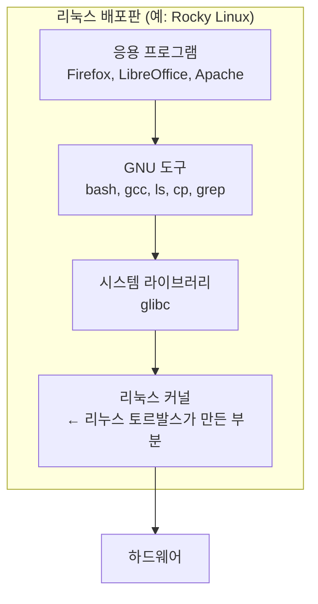
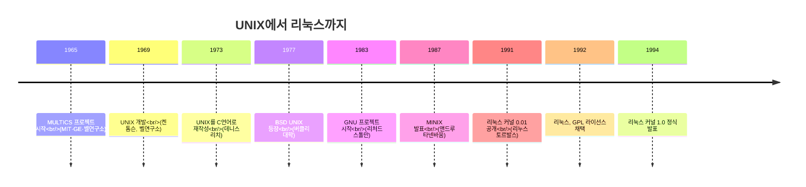
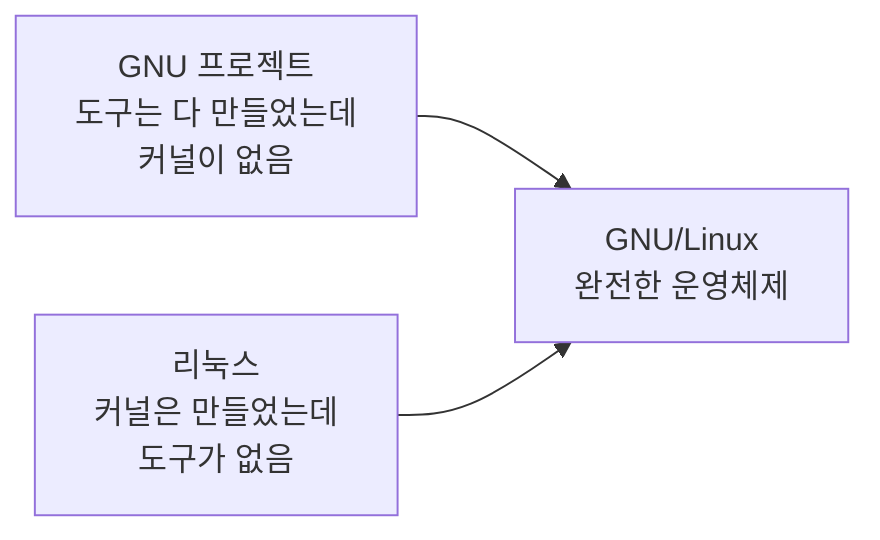

## 002. 리눅스의 개요와 역사

### 1. 리눅스란 무엇인가

리눅스(Linux)는 **1991년 리누스 토르발스(Linus Torvalds)가 개발한 UNIX 호환 운영체제**입니다.

여기서 반드시 구분해야 할 것이 있습니다.

| 용어 | 정확한 의미 |
| --- | --- |
| **리눅스 커널 (Linux Kernel)** | 리누스 토르발스가 만든 **운영체제의 핵심 부분**. 엄밀히 말해 "리눅스"는 이것만 가리킵니다. |
| **리눅스 배포판 (Distribution)** | 커널 + GNU 도구 + 응용 프로그램을 묶어 **바로 쓸 수 있게 만든 완성품**. (Ubuntu, Rocky Linux 등) |



> 그래서 자유 소프트웨어 진영에서는 **"GNU/Linux"** 라고 불러야 정확하다고 주장합니다.  
> 커널만 리눅스이고, 실제로 우리가 쓰는 명령어(`ls`, `cp`, `bash`, `gcc`)는 대부분 **GNU 프로젝트**의 결과물이기 때문입니다.

---

### 2. 리눅스의 뿌리 — UNIX의 역사

리눅스를 이해하려면 먼저 UNIX의 계보를 알아야 합니다.



#### ① MULTICS (1965)

MIT, GE, 벨 연구소가 함께 만든 **대형 시분할 운영체제 프로젝트**입니다.  
너무 크고 복잡해서 결국 실패했고, 벨 연구소는 1969년에 손을 뗍니다.

#### ② UNIX의 탄생 (1969)

MULTICS에서 빠져나온 **켄 톰슨(Ken Thompson)** 이  
남는 PDP-7 컴퓨터로 훨씬 **작고 단순한** 운영체제를 만듭니다.

이름도 MULTICS(Multiplexed)를 비꼬아 **UNICS → UNIX**로 지었습니다.  
"여러 개(Multi)가 아니라 하나(Uni)만 제대로 하자"는 의미였습니다.

#### ③ C언어로의 재작성 (1973) — 가장 중요한 사건

초기 UNIX는 어셈블리어로 작성되어 **특정 컴퓨터에서만** 동작했습니다.

**데니스 리치(Dennis Ritchie)** 가 C언어를 만들고, UNIX를 C로 다시 작성하면서  
**다른 기종에서도 컴파일만 하면 동작하는(이식성)** 운영체제가 되었습니다.

> 이것이 UNIX가 전 세계로 퍼진 결정적 이유이며,  
> 오늘날 리눅스가 스마트폰부터 슈퍼컴퓨터까지 동작할 수 있는 근본 원인이기도 합니다.

#### ④ GNU 프로젝트 (1983)

**리처드 스톨만(Richard Stallman)** 이 시작한 프로젝트입니다.

당시 UNIX는 상용화되어 소스 코드를 볼 수 없게 되었습니다.  
스톨만은 **"누구나 자유롭게 쓰고 고칠 수 있는 UNIX 호환 시스템"** 을 만들겠다고 선언합니다.

- 이름 **GNU** = **G**NU's **N**ot **U**nix (재귀적 약어)
- `gcc`(컴파일러), `bash`(셸), `emacs`(편집기), `coreutils`(기본 명령어) 등을 완성
- 하지만 **커널(GNU Hurd)만은 끝내 완성하지 못했습니다**

#### ⑤ MINIX (1987)

**앤드루 타넨바움(Andrew Tanenbaum)** 교수가 **교육용**으로 만든 소형 UNIX입니다.

소스가 공개되어 있었지만 **교육 목적으로만** 사용할 수 있었고, 기능도 제한적이었습니다.  
이 MINIX가 바로 리누스 토르발스가 참고한 출발점입니다.

---

### 3. 리눅스의 탄생 (1991)

핀란드 헬싱키 대학의 21살 학생 **리누스 토르발스**는 MINIX의 제약에 불만을 느끼고,  
자신의 386 PC를 위한 운영체제를 직접 만들기 시작합니다.

1991년 8월 25일, 그는 MINIX 뉴스그룹에 다음과 같은 글을 올립니다.

> 취미로 운영체제를 만들고 있으며, 크고 전문적인 것은 아니라는 취지의 글이었습니다.  
> — 리누스 토르발스, comp.os.minix 뉴스그룹 (1991)

그리고 1991년 9월, **커널 버전 0.01**을 공개합니다.

#### GNU와 리눅스의 만남

여기서 역사적인 결합이 일어납니다.



- GNU는 **커널만 없었고**
- 리눅스는 **커널만 있었습니다**

두 개가 합쳐지면서 **완전한 자유 운영체제**가 완성되었습니다.  
1992년 리누스가 리눅스를 **GPL 라이선스**로 전환하면서 이 결합은 공식화됩니다.

---

### 4. 리눅스의 특징

| 특징 | 설명 |
| --- | --- |
| **다중 사용자 (Multi-user)** | 여러 사용자가 **동시에** 하나의 시스템에 접속하여 작업할 수 있습니다. |
| **다중 작업 (Multi-tasking)** | 여러 프로그램을 **동시에** 실행할 수 있습니다. |
| **다중 처리기 (Multi-processor)** | 여러 개의 CPU를 지원합니다. (SMP) |
| **다중 플랫폼 (Multi-platform)** | x86, ARM, PowerPC 등 **다양한 하드웨어**에서 동작합니다. |
| **계층적 파일 시스템** | 최상위 `/`(루트)부터 시작하는 **트리 구조**를 가집니다. |
| **뛰어난 이식성 (Portability)** | 대부분 C언어로 작성되어 다른 기종으로 옮기기 쉽습니다. |
| **가상 메모리** | 실제 메모리보다 큰 프로그램도 실행할 수 있습니다. |
| **오픈 소스** | 소스 코드가 공개되어 누구나 보고 수정할 수 있습니다. |
| **강력한 네트워크 지원** | TCP/IP를 커널 수준에서 지원하여 서버 운영에 적합합니다. |
| **셸 프로그래밍** | 명령어를 묶어 스크립트로 자동화할 수 있습니다. |
| **파이프와 리다이렉션** | 프로그램의 출력을 다른 프로그램의 입력으로 연결할 수 있습니다. |

#### 왜 리눅스가 서버 시장을 장악했을까?

세 가지 이유로 정리할 수 있습니다.

**① 비용** — 라이선스 비용이 없습니다. 서버 수천 대를 운영하는 기업에게는 결정적입니다.

**② 안정성** — 다중 사용자·다중 작업을 전제로 설계되어, **수백 일 동안 재부팅 없이** 운영이 가능합니다.

**③ 투명성** — 소스가 공개되어 있어 문제가 생기면 **원인을 직접 추적**할 수 있고, 필요하면 고칠 수도 있습니다.

---

### 5. 리눅스 커널 버전 체계

```
    4  .  18  .  0
    │      │      │
    │      │      └── 패치 레벨 (Patch Level) : 버그 수정
    │      └───────── 주 버전 (Major Version)
    └──────────────── 메인 버전 (Main Version)
```

#### 2.6 이전의 홀짝 규칙 (자주 출제됩니다)

커널 **2.6 버전 이전**에는 주 버전 번호로 안정성을 구분했습니다.

| 구분 | 버전 예 | 의미 |
| --- | --- | --- |
| **짝수** | 2.**2**.x, 2.**4**.x | **안정 버전 (Stable)** — 실제 운영 환경용 |
| **홀수** | 2.**3**.x, 2.**5**.x | **개발 버전 (Development)** — 테스트용 |

> **시험 포인트**  
> "커널 2.4.18에서 4는 무엇을 의미하는가?" → **주 버전이며 짝수이므로 안정 버전**  
> 2.6 이후로는 이 규칙이 사라지고, 별도의 개발 브랜치를 두는 방식으로 바뀌었습니다.

#### 현재 커널 버전 확인하기

```bash
# 커널 버전 확인
$ uname -r
4.18.0-513.5.1.el8_9.x86_64

# 시스템 전체 정보
$ uname -a
Linux server01 4.18.0-513.5.1.el8_9.x86_64 #1 SMP Wed Nov 8 12:00:00 UTC 2023 x86_64 x86_64 x86_64 GNU/Linux
       │        │                          │                                  │
    호스트명   커널 릴리스                  빌드 일시                          아키텍처
```

| `uname` 옵션 | 출력 내용 |
| --- | --- |
| `-a` | 모든 정보 |
| `-s` | 커널 이름 (Linux) |
| `-r` | **커널 릴리스 (버전)** |
| `-v` | 커널 버전(빌드 정보) |
| `-m` | 하드웨어 아키텍처 (x86_64) |
| `-n` | 호스트명 |
| `-p` | 프로세서 종류 |
| `-o` | 운영체제 (GNU/Linux) |

```bash
# 배포판 정보 확인
$ cat /etc/os-release
NAME="Rocky Linux"
VERSION="8.9 (Green Obsidian)"
ID="rocky"
VERSION_ID="8.9"
PLATFORM_ID="platform:el8"

# 레드햇 계열 전용
$ cat /etc/redhat-release
Rocky Linux release 8.9 (Green Obsidian)
```

---

### 6. 리눅스의 활용 분야

| 분야 | 활용 예 |
| --- | --- |
| **서버** | 웹 서버(Apache/Nginx), DB 서버, 메일 서버, DNS 서버 |
| **클라우드** | AWS·GCP·Azure의 인스턴스 대부분이 리눅스 |
| **모바일** | 안드로이드(리눅스 커널 기반) |
| **임베디드** | 공유기, IPTV 셋톱박스, 스마트 TV, 자동차 |
| **슈퍼컴퓨터** | TOP500 슈퍼컴퓨터 **100%가 리눅스** |
| **컨테이너·가상화** | Docker, Kubernetes의 기반 |
| **데스크톱** | Ubuntu, Fedora 등 |

---

### 7. 리눅스의 장점과 단점

**장점**

- 무료이며 소스가 공개되어 있습니다.
- 안정성과 보안성이 높습니다.
- 하드웨어 요구 사양이 낮아 **오래된 장비도 서버로 활용**할 수 있습니다.
- 다양한 배포판 중에서 목적에 맞게 선택할 수 있습니다.
- 커뮤니티 지원이 활발합니다.

**단점**

- 데스크톱용 상용 소프트웨어(게임, 특정 업무용 프로그램)가 부족합니다.
- 문제 발생 시 **공식적인 책임 주체가 없어** 스스로 해결해야 하는 경우가 많습니다.
- 배포판마다 명령어와 설정 파일 위치가 조금씩 달라 혼란스러울 수 있습니다.
- GUI 중심 사용자에게는 초기 진입 장벽이 있습니다.

> 이 단점 중 "공식 지원이 없다"는 문제를 해결한 것이 **Red Hat Enterprise Linux(RHEL)** 같은 **상용 배포판**입니다.  
> 소프트웨어는 무료지만 **기술 지원을 유료로 판매**하는 모델입니다. ([004. 리눅스 배포판의 종류와 특징]에서 다룹니다)

---

### 시험 포인트 정리

| 항목 | 핵심 |
| --- | --- |
| UNIX 개발 | **1969년, 켄 톰슨, 벨 연구소** |
| C언어 재작성 | **1973년, 데니스 리치** → 이식성 확보 |
| GNU 프로젝트 | **1983년, 리처드 스톨만** — 커널만 미완성 |
| MINIX | **앤드루 타넨바움**, 교육용 |
| 리눅스 최초 공개 | **1991년, 리누스 토르발스**, 핀란드 헬싱키 대학 |
| GPL 채택 | 1992년 |
| 커널 홀짝 규칙 | 2.6 이전 — **짝수=안정, 홀수=개발** |
| 커널 버전 확인 | `uname -r` |
| 배포판 확인 | `cat /etc/os-release` |

---

### 한 줄 정리

리눅스는 **1991년 리누스 토르발스가 만든 UNIX 호환 커널**이며,  
**GNU 프로젝트의 도구들과 결합**하여 완전한 운영체제가 되었고,  
커널 2.6 이전에는 **주 버전이 짝수면 안정 버전, 홀수면 개발 버전**이었습니다.
