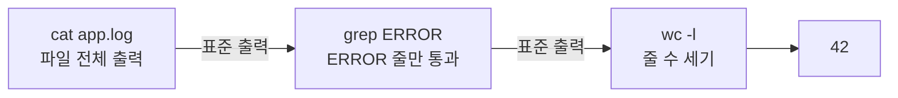
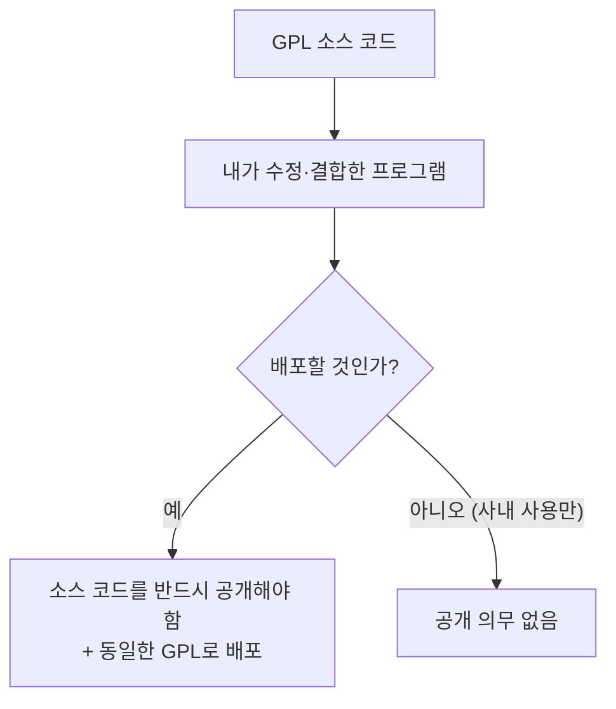
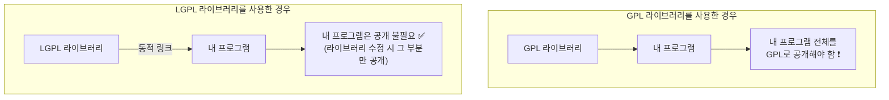

## 003. 리눅스의 철학과 라이선스

### 1. UNIX / 리눅스의 설계 철학

리눅스 명령어가 왜 이렇게 짧고, 왜 `|` 같은 기호로 명령어를 연결하는지 이해하려면  
**UNIX 철학**을 먼저 알아야 합니다.

| 원칙 | 의미 |
| --- | --- |
| **한 가지만 잘 하라** | 하나의 프로그램은 하나의 일만 하되, 그것을 아주 잘 합니다. |
| **프로그램은 조합하라** | 작은 프로그램들을 연결하여 복잡한 일을 처리합니다. |
| **텍스트를 인터페이스로** | 프로그램 간 데이터는 **텍스트**로 주고받습니다. 누구나 읽고 가공할 수 있기 때문입니다. |
| **모든 것은 파일이다** | 장치·프로세스·소켓까지 전부 파일처럼 다룹니다. |
| **침묵이 미덕** | 성공하면 아무 말도 하지 않고, 문제가 있을 때만 출력합니다. |

#### "한 가지만 잘 하라"가 실제로 어떤 의미일까?

Windows에서 "폴더에서 로그 파일 중 ERROR가 포함된 줄만 세기"를 하려면  
보통 전용 프로그램을 만들거나 GUI 도구를 찾아야 합니다.

리눅스에서는 **이미 있는 작은 도구들을 조합**합니다.

```bash
# 로그에서 ERROR가 포함된 줄만 세기
$ cat app.log | grep "ERROR" | wc -l
42
```

여기서 각 도구는 정말 한 가지 일만 합니다.

| 명령어 | 하는 일 (그것 하나만) |
| --- | --- |
| `cat` | 파일 내용을 출력한다 |
| `grep` | 패턴에 맞는 줄만 걸러낸다 |
| `wc -l` | 줄 수를 센다 |

#### 파이프(`|`) — 조합을 가능하게 하는 장치

파이프는 **앞 명령의 출력을 뒤 명령의 입력으로 연결**하는 기호입니다.



이 구조 덕분에 **도구 N개로 조합 가능한 작업의 수가 폭발적으로 늘어납니다.**  
새로운 기능이 필요할 때마다 거대한 프로그램을 만드는 대신, 작은 도구 하나만 추가하면 됩니다.

#### "모든 것은 파일이다 (Everything is a file)"

리눅스에서는 하드웨어 장치조차 파일로 취급합니다.

```bash
# 하드디스크도 파일
$ ls -l /dev/sda
brw-rw----. 1 root disk 8, 0 Jan 24 09:00 /dev/sda

# 키보드 입력, 화면 출력도 파일
$ ls -l /dev/stdin /dev/stdout
lrwxrwxrwx. 1 root root 15 Jan 24 09:00 /dev/stdin -> /proc/self/fd/0
lrwxrwxrwx. 1 root root 15 Jan 24 09:00 /dev/stdout -> /proc/self/fd/1

# 프로세스 정보도 파일
$ cat /proc/cpuinfo | head -3
processor       : 0
vendor_id       : GenuineIntel
cpu family      : 6

# 난수 생성기도 파일
$ head -c 8 /dev/urandom | xxd
00000000: 3f7a 9c21 0e55 b8d4                      ?z.!.U..
```

**왜 이렇게 만들었을까?**

모든 것이 파일이면, **파일을 다루는 도구 하나로 모든 것을 다룰 수 있습니다.**

- 디스크를 통째로 복사? → `cp /dev/sda /dev/sdb` 또는 `dd`
- CPU 정보 확인? → `cat /proc/cpuinfo`
- 장치에 데이터 전송? → `echo` 로 파일에 쓰기

새로운 장치가 나와도 **새로운 명령어를 배울 필요가 없습니다.** 파일 다루는 법만 알면 됩니다.

---

### 2. 자유 소프트웨어와 오픈 소스

리눅스 라이선스를 이해하려면 **자유 소프트웨어(Free Software)** 개념부터 알아야 합니다.

#### "Free"는 무료가 아니라 자유입니다

리처드 스톨만은 이를 이렇게 설명했습니다.

> **"free as in free speech, not as in free beer"**  
> (공짜 맥주의 free가 아니라, 언론의 자유의 free다)

즉, 자유 소프트웨어는 **가격이 아니라 권리**에 관한 개념입니다.  
자유 소프트웨어를 돈을 받고 판매하는 것도 **허용됩니다.**

#### 자유 소프트웨어의 4가지 자유 (매우 자주 출제됩니다)

| 번호 | 자유 | 내용 |
| --- | --- | --- |
| **자유 0** | **실행의 자유** | 목적을 불문하고 프로그램을 **실행**할 수 있는 자유 |
| **자유 1** | **연구·수정의 자유** | 소스 코드를 **연구하고 원하는 대로 수정**할 수 있는 자유 |
| **자유 2** | **재배포의 자유** | 이웃을 돕기 위해 프로그램을 **복제·배포**할 수 있는 자유 |
| **자유 3** | **개선·배포의 자유** | **개선한 버전을 배포**하여 커뮤니티에 기여할 수 있는 자유 |

> 번호가 **0부터 시작**하는 것도 시험에 나옵니다. (프로그래머식 번호 매기기)  
> 자유 1과 자유 3은 **소스 코드 접근이 전제 조건**입니다.

#### 자유 소프트웨어 vs 오픈 소스

| 구분 | 자유 소프트웨어 (FSF) | 오픈 소스 (OSI) |
| --- | --- | --- |
| 주창자 | 리처드 스톨만 | 에릭 레이먼드 등 |
| 단체 | **FSF** (Free Software Foundation, 1985) | **OSI** (Open Source Initiative, 1998) |
| 강조점 | **윤리·자유** — 소프트웨어는 자유로워야 한다 | **실용성** — 공개하면 품질이 좋아진다 |
| 태도 | 독점 소프트웨어에 비판적 | 기업 친화적, 협력 중시 |

대상이 되는 소프트웨어는 대부분 겹치지만, **왜 공개하는가**에 대한 철학이 다릅니다.

---

### 3. 주요 오픈 소스 라이선스

여기가 시험에서 가장 자주 나오는 부분입니다. **"카피레프트 여부"** 를 기준으로 이해하면 쉽습니다.

#### 카피레프트(Copyleft)란?

**Copyright(저작권)** 를 뒤집은 말장난으로,  
**"이 소프트웨어를 가져다 쓴 결과물도 반드시 같은 조건으로 공개하라"** 는 조건입니다.



> **핵심** : GPL의 공개 의무는 **"배포할 때"** 발생합니다.  
> 회사 내부에서만 쓰고 외부에 배포하지 않으면 공개 의무가 없습니다.

#### 라이선스 비교표

| 라이선스 | 카피레프트 | 소스 공개 의무 | 특징 | 대표 소프트웨어 |
| --- | --- | --- | --- | --- |
| **GPL** (GNU General Public License) | **강함** | **있음** — 결합한 전체를 공개 | 가장 대표적인 자유 소프트웨어 라이선스 | **리눅스 커널**, GCC, bash |
| **LGPL** (Lesser GPL) | **약함** | **라이브러리 부분만** | 라이브러리를 **링크만** 하면 내 프로그램은 공개 안 해도 됨 | glibc, LibreOffice |
| **AGPL** (Affero GPL) | **가장 강함** | 네트워크 서비스도 포함 | 서버로 서비스만 해도 공개 의무 발생 | MongoDB(구버전) |
| **BSD** | **없음** | **없음** | 저작권 표시만 하면 상용화 자유 | FreeBSD, OpenSSH |
| **MIT** | **없음** | **없음** | 가장 단순하고 제약이 적음 | jQuery, Node.js, React |
| **Apache 2.0** | **없음** | **없음** | BSD/MIT + **특허권 명시 조항** | Apache HTTP Server, Kubernetes |
| **MPL** (Mozilla Public License) | **중간** | **수정한 파일만** | 파일 단위 카피레프트 | Firefox |

#### GPL vs LGPL — 가장 헷갈리는 부분



**왜 LGPL이 필요했을까?**

`glibc`(C 표준 라이브러리)는 리눅스에서 **모든 프로그램이 사용**합니다.  
만약 glibc가 GPL이었다면, 리눅스에서 만든 **모든 상용 프로그램이 소스를 공개**해야 합니다.

그러면 아무도 리눅스용 상용 소프트웨어를 만들지 않게 되고, 리눅스 생태계 자체가 죽습니다.

그래서 **"라이브러리는 조금 느슨하게(Lesser) 가자"** 는 취지로 LGPL이 만들어졌습니다.

#### 리눅스 커널의 라이선스는 GPLv2입니다

여기서 중요한 의문이 생깁니다.

> "리눅스 커널이 GPL이면, 리눅스에서 도는 모든 프로그램도 GPL이어야 하는 것 아닌가?"

**아닙니다.** 리누스 토르발스가 커널에 **명시적 예외 조항**을 달았기 때문입니다.

> 시스템 호출을 사용하는 일반 응용 프로그램은 **커널의 파생 저작물로 보지 않는다**  
> — 리눅스 커널 COPYING 파일의 예외 조항 취지

덕분에 리눅스 위에서 **상용 소프트웨어(오라클 DB, MATLAB 등)** 를 만들어 팔 수 있습니다.

---

### 4. 라이선스 선택 기준

| 목적 | 추천 라이선스 | 이유 |
| --- | --- | --- |
| 내 코드가 항상 자유롭게 남기를 원함 | **GPL** | 파생 저작물도 공개를 강제합니다. |
| 상용 제품에도 널리 쓰이길 원함 | **MIT / BSD / Apache** | 제약이 거의 없어 채택률이 높습니다. |
| 라이브러리를 만드는데 상용 사용도 허용하고 싶음 | **LGPL** | 링크만 하면 상용 프로그램도 사용 가능합니다. |
| 특허 분쟁을 방지하고 싶음 | **Apache 2.0** | 특허권 라이선스 조항이 명시되어 있습니다. |

---

### 5. 오픈 소스 관련 주의 사항

실무에서 자주 문제가 되는 부분입니다.

- **GPL 코드를 상용 제품에 넣고 소스를 공개하지 않으면 라이선스 위반**입니다. (실제 소송 사례 다수)
- 오픈 소스는 **무보증(AS-IS)** 이 원칙입니다. 문제가 생겨도 개발자에게 책임을 물을 수 없습니다.
- 라이선스가 **서로 충돌**할 수 있습니다. (예: GPLv2와 Apache 2.0은 호환되지 않습니다)
- 소스를 공개하더라도 **저작권 표시와 라이선스 전문**을 함께 배포해야 합니다.

---

### 시험 포인트 정리

| 항목 | 핵심 |
| --- | --- |
| 자유 소프트웨어의 4가지 자유 | **0=실행, 1=연구·수정, 2=재배포, 3=개선·배포** (0부터 시작) |
| FSF | 1985년, **리처드 스톨만** 설립 |
| OSI | 1998년 설립, 실용주의 노선 |
| **GPL** | **강한 카피레프트** — 결합 시 전체 공개 의무 |
| **LGPL** | **약한 카피레프트** — 링크만 하면 내 코드 공개 불필요 |
| **BSD / MIT / Apache** | 카피레프트 **없음** — 상용화 자유 |
| Apache 2.0 특징 | **특허권 조항** 포함 |
| 리눅스 커널 라이선스 | **GPLv2** (시스템 호출 사용 프로그램은 예외) |
| 공개 의무 발생 시점 | **배포할 때** (사내 사용만 하면 의무 없음) |
| UNIX 철학 | 한 가지만 잘 하라 / 조합하라 / 모든 것은 파일이다 |

---

### 한 줄 정리

리눅스는 **"작은 도구를 조합한다"는 UNIX 철학**과 **"모든 것은 파일"이라는 추상화** 위에 서 있으며,  
라이선스는 **GPL(강한 카피레프트) → LGPL(약함) → BSD/MIT/Apache(제약 없음)** 순으로 자유도가 높아지고,  
**리눅스 커널은 GPLv2**이지만 예외 조항 덕분에 그 위에서 상용 프로그램을 만들 수 있습니다.
