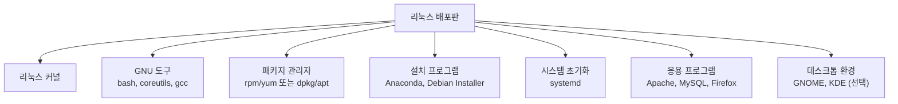
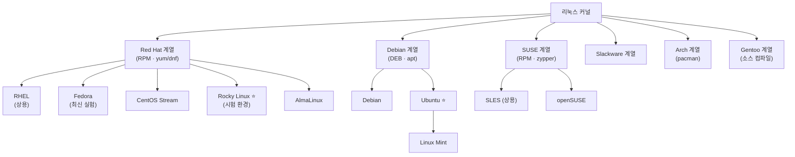
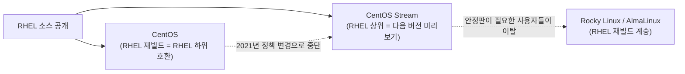
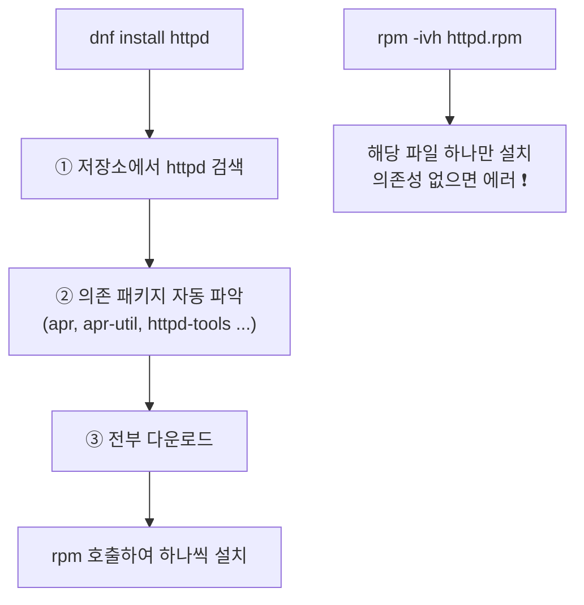

## 004. 리눅스 배포판의 종류와 특징

### 1. 배포판(Distribution)이란

리눅스 커널만으로는 컴퓨터를 쓸 수 없습니다.  
커널은 **하드웨어를 관리하는 엔진**일 뿐, 사용자가 명령을 내릴 도구가 없기 때문입니다.

**배포판**은 다음을 하나로 묶어 **바로 설치해서 쓸 수 있게 만든 완성품**입니다.



#### 배포판이 서로 다른 이유

같은 커널을 쓰는데도 배포판이 수백 개나 존재합니다. 차이는 다음에서 발생합니다.

| 구분 요소 | 설명 |
| --- | --- |
| **패키지 관리 방식** | RPM 계열이냐 DEB 계열이냐 — 가장 큰 차이입니다 |
| **릴리스 정책** | 안정성 우선(수년 주기) vs 최신 기능 우선(6개월 주기) |
| **기본 포함 소프트웨어** | 서버용 최소 구성 vs 데스크톱 풀 구성 |
| **지원 기간** | 커뮤니티 지원 9개월 vs 상용 지원 10년 |
| **목표 사용자** | 기업 서버 / 개인 데스크톱 / 임베디드 / 보안 전문가 |

---

### 2. 배포판 계보



> 리눅스마스터 1급 실기 시험 환경은 **Rocky Linux 8.8** 이므로,  
> **Red Hat 계열(RPM/dnf)** 을 중심으로 익히고 데비안 계열은 비교로 알아 두면 됩니다.

---

### 3. Red Hat 계열

**패키지 형식** : `.rpm` / **패키지 관리자** : `rpm`, `yum`, `dnf`

| 배포판 | 특징 |
| --- | --- |
| **RHEL** (Red Hat Enterprise Linux) | 상용 배포판. 소프트웨어는 무료지만 **기술 지원을 구독으로 판매**합니다. 금융·통신 등 기업 환경의 사실상 표준이며 **약 10년의 긴 지원 기간**을 제공합니다. |
| **Fedora** | Red Hat이 후원하는 **커뮤니티 배포판**. 최신 기술을 **먼저 실험**하는 무대이며, 여기서 검증된 기능이 RHEL로 넘어갑니다. 릴리스 주기가 약 6개월로 짧습니다. |
| **CentOS** | 과거 RHEL의 소스를 그대로 재빌드한 **무료 클론**이었습니다. 2021년부터 **CentOS Stream**으로 전환되어, RHEL의 **다음 버전 미리보기** 성격으로 바뀌었습니다. |
| **Rocky Linux** | CentOS의 정책 변경에 반발하여 **CentOS 창립자가 다시 만든** RHEL 호환 배포판입니다. **시험 실기 환경**입니다. |
| **AlmaLinux** | CloudLinux가 후원하는 또 다른 RHEL 호환 배포판입니다. |

#### CentOS 정책 변경 — 왜 Rocky Linux가 생겼나



기존 CentOS는 **RHEL과 100% 같은 버전**이라 "무료 RHEL"로 널리 쓰였습니다.  
CentOS Stream은 **RHEL보다 앞선 개발 버전**이라 안정성이 필요한 운영 서버에는 적합하지 않습니다.

이 공백을 메우기 위해 **Rocky Linux**와 **AlmaLinux**가 등장했습니다.

---

### 4. Debian 계열

**패키지 형식** : `.deb` / **패키지 관리자** : `dpkg`, `apt`

| 배포판 | 특징 |
| --- | --- |
| **Debian** | 커뮤니티가 운영하는 **가장 오래된 배포판** 중 하나입니다. 자유 소프트웨어 원칙을 엄격히 지키며 매우 안정적이지만, 그만큼 소프트웨어 버전이 보수적입니다. |
| **Ubuntu** | Canonical이 만든 배포판으로, Debian을 기반으로 **사용 편의성**을 크게 개선했습니다. 데스크톱과 클라우드 양쪽에서 점유율이 높습니다. |
| **Linux Mint** | Ubuntu 기반으로 Windows 사용자에게 친숙한 UI를 제공합니다. |

#### Ubuntu의 LTS 개념 (시험 출제 포인트)

Ubuntu는 버전 번호가 **`연도.월`** 형식입니다.

| 버전 | 의미 |
| --- | --- |
| `22.04` | 2022년 4월 출시 |
| `24.10` | 2024년 10월 출시 |

| 종류 | 지원 기간 | 릴리스 시점 |
| --- | --- | --- |
| **일반 릴리스** | **9개월** | 매년 4월·10월 |
| **LTS** (Long Term Support) | **5년** (서버는 확장 시 10년) | **짝수 해 4월** (20.04, 22.04, 24.04) |

> **왜 LTS를 쓸까?**  
> 서버는 한번 구축하면 수년간 운영합니다. 9개월마다 OS를 갈아엎을 수는 없습니다.  
> LTS는 **5년간 보안 패치를 보장**하므로 운영 환경에 적합합니다.

---

### 5. 그 밖의 계열

| 배포판 | 계열 | 특징 |
| --- | --- | --- |
| **openSUSE / SLES** | SUSE | RPM을 쓰지만 패키지 관리자는 **zypper**입니다. **YaST**라는 강력한 통합 관리 도구가 특징입니다. |
| **Slackware** | 독자 | **가장 오래된 배포판**(1993). 자동화를 최소화하여 리눅스 내부 구조 학습에 좋습니다. |
| **Arch Linux** | 독자 | **롤링 릴리스**(버전 구분 없이 계속 업데이트). 패키지 관리자는 **pacman**입니다. |
| **Gentoo** | 독자 | 모든 패키지를 **소스에서 직접 컴파일**합니다. 최적화 폭이 크지만 설치가 오래 걸립니다. |
| **Kali Linux** | Debian | **모의 해킹·보안 진단** 전용 도구를 모아 둔 배포판입니다. |
| **Alpine Linux** | 독자 | 매우 가벼워(약 5MB) **Docker 컨테이너 이미지**로 널리 쓰입니다. |
| **Android** | — | 리눅스 커널을 사용하지만 GNU 도구를 쓰지 않아 일반적인 배포판으로 분류하지 않습니다. |

---

### 6. RPM 계열 vs DEB 계열 비교

시험과 실무 모두에서 가장 중요한 비교입니다.

| 구분 | **Red Hat 계열** | **Debian 계열** |
| --- | --- | --- |
| 패키지 확장자 | `.rpm` | `.deb` |
| **저수준** 관리자 | `rpm` | `dpkg` |
| **고수준** 관리자 (의존성 자동 해결) | `yum` → `dnf` | `apt` (`apt-get`) |
| 저장소 설정 위치 | `/etc/yum.repos.d/` | `/etc/apt/sources.list`, `sources.list.d/` |
| 대표 배포판 | RHEL, Rocky, Fedora | Debian, Ubuntu |
| 네트워크 설정 (전통) | `/etc/sysconfig/network-scripts/` | `/etc/network/interfaces`, Netplan |

#### 저수준 vs 고수준 — 왜 두 개가 있을까?



- **`rpm` / `dpkg`** : 눈앞의 패키지 파일 **하나만** 설치합니다. 의존성이 없으면 그냥 실패합니다.
- **`dnf` / `apt`** : 인터넷 저장소에서 **필요한 패키지를 전부 찾아** 순서대로 설치합니다.

실무에서는 거의 항상 **고수준 도구(`dnf`, `apt`)** 를 사용하고,  
직접 받은 `.rpm` 파일 하나를 설치할 때만 `rpm`을 씁니다.

```bash
# Red Hat 계열
$ sudo dnf install -y httpd          # 저장소에서 설치 (의존성 자동)
$ sudo rpm -ivh custom-tool.rpm      # 로컬 파일 직접 설치

# Debian 계열
$ sudo apt update && sudo apt install -y apache2
$ sudo dpkg -i custom-tool.deb
```

---

### 7. 배포판 선택 기준

| 상황 | 추천 |
| --- | --- |
| **자격증 실기 준비** | **Rocky Linux 8.8** (시험 환경과 동일) |
| 기업 운영 서버 (지원 필요) | RHEL, SLES |
| 기업 운영 서버 (무료) | Rocky Linux, AlmaLinux, Ubuntu LTS |
| 클라우드 인스턴스 | Ubuntu LTS, Amazon Linux |
| 개인 데스크톱 | Ubuntu, Linux Mint, Fedora |
| 컨테이너 베이스 이미지 | Alpine, Debian slim |
| 최신 기술 실험 | Fedora, Arch |
| 보안 진단 | Kali Linux |

---

### 8. 설치된 배포판 확인 방법

```bash
# ① 모든 배포판 공통 (권장)
$ cat /etc/os-release
NAME="Rocky Linux"
VERSION="8.9 (Green Obsidian)"
ID="rocky"
ID_LIKE="rhel centos fedora"
VERSION_ID="8.9"
PRETTY_NAME="Rocky Linux 8.9 (Green Obsidian)"

# ② Red Hat 계열 전용
$ cat /etc/redhat-release
Rocky Linux release 8.9 (Green Obsidian)

# ③ Debian/Ubuntu 계열
$ lsb_release -a
Distributor ID: Ubuntu
Description:    Ubuntu 22.04.3 LTS
Release:        22.04
Codename:       jammy

# ④ 커널 버전 (배포판과 별개)
$ uname -r
4.18.0-513.5.1.el8_9.x86_64
```

> `/etc/os-release` 의 **`ID_LIKE`** 필드를 보면 계열을 알 수 있습니다.  
> `ID_LIKE="rhel centos fedora"` → Red Hat 계열이므로 `dnf`를 사용하면 됩니다.

---

### 시험 포인트 정리

| 항목 | 핵심 |
| --- | --- |
| 배포판 구성 | 커널 + GNU 도구 + 패키지 관리자 + 설치 프로그램 |
| Red Hat 계열 | `.rpm` / `rpm`·`yum`·`dnf` / RHEL, Fedora, **Rocky** |
| Debian 계열 | `.deb` / `dpkg`·`apt` / Debian, **Ubuntu** |
| SUSE 계열 | `.rpm`이지만 관리자는 **zypper**, 도구는 **YaST** |
| Fedora의 역할 | RHEL의 **선행 테스트** 배포판 |
| CentOS Stream | RHEL의 **다음 버전 미리보기** (기존 CentOS와 방향 반대) |
| Ubuntu LTS | **짝수 해 4월** 출시, **5년** 지원 |
| 일반 Ubuntu | **9개월** 지원 |
| 롤링 릴리스 | **Arch Linux** |
| 소스 컴파일 배포판 | **Gentoo** |
| 시험 실기 환경 | **Rocky Linux 8.8** |

---

### 한 줄 정리

배포판은 **커널에 GNU 도구·패키지 관리자·설치 프로그램을 묶은 완성품**이며,  
**Red Hat 계열(`rpm`/`dnf`)** 과 **Debian 계열(`dpkg`/`apt`)** 의 구분이 가장 중요하고,  
시험 실기 환경인 **Rocky Linux는 RHEL 호환 무료 배포판**입니다.
