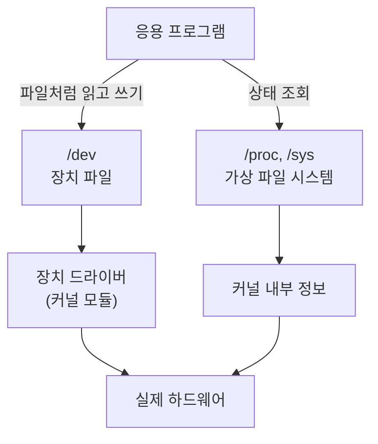
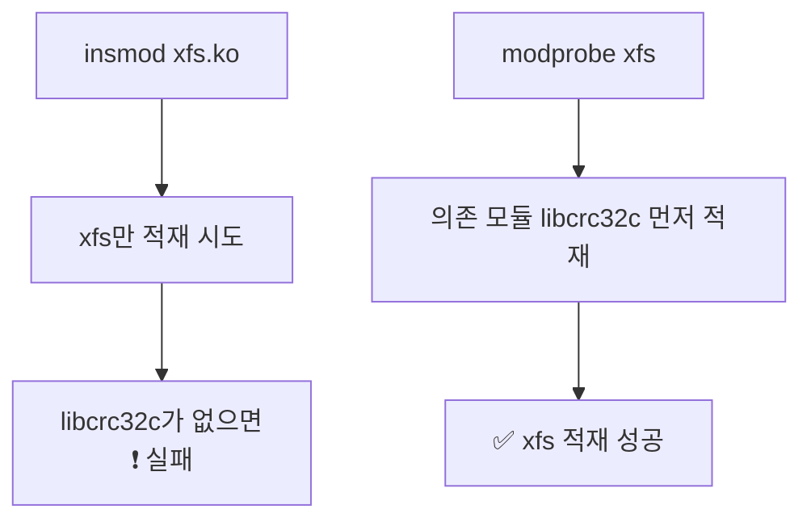

## 005. 리눅스와 하드웨어

### 1. 리눅스는 하드웨어를 어떻게 다루는가

운영체제의 핵심 임무 중 하나는 **하드웨어를 프로그램이 쓰기 좋은 형태로 포장하는 것**입니다.

리눅스는 이를 세 가지 장치로 해결합니다.



| 장치 | 역할 |
| --- | --- |
| **장치 파일 (`/dev`)** | 하드웨어를 **파일처럼** 읽고 쓸 수 있게 합니다. |
| **장치 드라이버** | 각 하드웨어의 고유한 통신 방식을 커널이 이해하는 형태로 **번역**합니다. |
| **가상 파일 시스템 (`/proc`, `/sys`)** | 하드웨어와 커널의 **현재 상태를 파일 형태로 노출**합니다. |

---

### 2. 장치 파일 (`/dev`)

`/dev` 디렉터리에는 하드웨어에 대응하는 **특수 파일**들이 들어 있습니다.

```bash
$ ls -l /dev/sda /dev/tty0 /dev/null
brw-rw----. 1 root disk    8, 0 Jan 24 09:00 /dev/sda
crw--w----. 1 root tty     4, 0 Jan 24 09:00 /dev/tty0
crw-rw-rw-. 1 root root    1, 3 Jan 24 09:00 /dev/null
│                          │  │
│                          │  └── 부 번호 (Minor) : 같은 종류 중 몇 번째 장치인가
│                          └───── 주 번호 (Major) : 어떤 드라이버가 담당하는가
└── 맨 앞 문자 = 장치 종류
```

#### 장치 파일의 종류 (시험 출제 포인트)

| 표시 | 종류 | 특징 | 예 |
| --- | --- | --- | --- |
| **`b`** | **블록 장치 (Block Device)** | 데이터를 **정해진 크기의 블록 단위**로 주고받습니다. **버퍼를 사용**하며 **랜덤 접근**이 가능합니다. | 하드디스크(`/dev/sda`), SSD, USB, CD-ROM |
| **`c`** | **문자 장치 (Character Device)** | 데이터를 **바이트 단위로 순차적**으로 주고받습니다. 버퍼 없이 즉시 처리됩니다. | 키보드, 마우스, 터미널(`/dev/tty`), 프린터, `/dev/null` |
| `l` | 심볼릭 링크 | 다른 장치 파일을 가리킵니다. | `/dev/cdrom → /dev/sr0` |
| `s` | 소켓 | 프로세스 간 통신에 사용합니다. | `/dev/log` |
| `p` | 파이프(FIFO) | 명명된 파이프입니다. | |

#### 왜 블록과 문자로 나눌까?

**하드디스크**는 "1000번째 블록만 읽어 줘"가 가능합니다. 원하는 위치로 바로 갈 수 있습니다 (**랜덤 접근**).  
그래서 미리 여러 블록을 읽어 두는 **버퍼링**이 성능에 큰 도움이 됩니다.

**키보드**는 "1000번째 글자만 미리 읽어 줘"가 불가능합니다. 사용자가 누르는 순서대로만 들어옵니다 (**순차 접근**).  
그리고 키를 눌렀는데 버퍼에 쌓아 두고 나중에 처리하면 안 됩니다. **즉시성**이 중요합니다.

이 성질 차이 때문에 커널이 두 종류를 **완전히 다른 방식으로 처리**합니다.

#### 알아두면 좋은 특수 장치 파일

| 장치 파일 | 역할 |
| --- | --- |
| **`/dev/null`** | 쓰면 **그냥 버려집니다.** 출력을 없앨 때 사용합니다. |
| **`/dev/zero`** | 읽으면 **0(NULL 바이트)이 무한히** 나옵니다. 파일을 0으로 채울 때 사용합니다. |
| **`/dev/random`** | 진짜 난수. 엔트로피가 부족하면 **대기**합니다. |
| **`/dev/urandom`** | 유사 난수. **대기하지 않습니다.** 일반적으로 이쪽을 씁니다. |
| `/dev/full` | 쓰면 항상 "디스크 가득 참" 오류가 납니다. (테스트용) |
| `/dev/tty` | 현재 터미널 |

```bash
# 에러 메시지를 화면에서 없애기 (버림)
$ find / -name "*.conf" 2>/dev/null

# 1GB짜리 빈 파일 만들기
$ dd if=/dev/zero of=testfile bs=1M count=1024
1024+0 records in
1024+0 records out
1073741824 bytes (1.1 GB, 1.0 GiB) copied, 0.9 s, 1.2 GB/s

# 임의의 비밀번호 생성
$ head -c 12 /dev/urandom | base64
kJ8xQ2mNvR4pLz==
```

---

### 3. 저장 장치의 이름 규칙

시험과 실무에서 반드시 알아야 하는 부분입니다.

```
/dev/sda1
     │││
     ││└── 파티션 번호 (1, 2, 3 ...)
     │└─── 장치 순서 (a=첫 번째, b=두 번째, c=세 번째 ...)
     └──── 장치 종류
```

| 접두사 | 대상 |
| --- | --- |
| **`sd`** | SCSI / SATA / USB 디스크 (현재 대부분) |
| `hd` | 예전 IDE(PATA) 디스크 |
| **`nvme`** | NVMe SSD — 형식이 다릅니다 (`/dev/nvme0n1p1`) |
| `vd` | 가상화 환경의 virtio 디스크 |
| `sr` | 광학 드라이브 (CD/DVD) |
| `loop` | 루프백 장치 (ISO 파일 마운트 등) |

**예시로 읽어 보기**

| 장치 파일 | 의미 |
| --- | --- |
| `/dev/sda` | 첫 번째 SATA 디스크 **전체** |
| `/dev/sda1` | 첫 번째 SATA 디스크의 **1번 파티션** |
| `/dev/sdb3` | 두 번째 SATA 디스크의 **3번 파티션** |
| `/dev/nvme0n1p2` | 첫 번째 NVMe 컨트롤러(0) → 첫 번째 네임스페이스(n1) → **2번 파티션(p2)** |

#### MBR 방식의 파티션 번호 규칙 (자주 출제)

| 번호 | 종류 |
| --- | --- |
| **1 ~ 4** | 주 파티션(Primary) 또는 확장 파티션(Extended) |
| **5 이상** | **논리 파티션(Logical)** — 확장 파티션 안에 생성 |

> 그래서 `/dev/sda5`가 있으면 그 디스크에는 **확장 파티션이 존재**한다는 뜻입니다.  
> GPT 방식에서는 이런 제약 없이 번호가 이어집니다.

---

### 4. 하드웨어 정보 확인 명령어

실기 시험과 실무 모두에서 자주 쓰는 명령어들입니다.

#### CPU 정보

```bash
# ① 상세 정보 (파일 읽기)
$ cat /proc/cpuinfo | grep -E "model name|cpu cores|processor" | head -6
processor       : 0
model name      : Intel(R) Xeon(R) CPU E5-2680 v4 @ 2.40GHz
cpu cores       : 4

# ② 요약 정보 (권장)
$ lscpu
Architecture:        x86_64
CPU op-mode(s):      32-bit, 64-bit
Byte Order:          Little Endian
CPU(s):              8
Thread(s) per core:  2
Core(s) per socket:  4
Socket(s):           1
Model name:          Intel(R) Xeon(R) CPU E5-2680 v4 @ 2.40GHz
```

> **CPU 개수 계산** : `Socket(s) × Core(s) per socket × Thread(s) per core = CPU(s)`  
> 위 예시는 `1 × 4 × 2 = 8` 입니다.

#### 메모리 정보

```bash
# ① 상세 정보
$ cat /proc/meminfo | head -4
MemTotal:       16266424 kB
MemFree:         8123456 kB
MemAvailable:   12345678 kB
Buffers:          123456 kB

# ② 사람이 읽기 쉬운 형태 (권장)
$ free -h
              total        used        free      shared  buff/cache   available
Mem:           15Gi       3.2Gi       7.7Gi       128Mi       4.6Gi        11Gi
Swap:         2.0Gi          0B       2.0Gi
```

| `free` 옵션 | 단위 |
| --- | --- |
| `-b` | 바이트 |
| `-k` | KB (기본값) |
| `-m` | MB |
| `-g` | GB |
| **`-h`** | **사람이 읽기 쉬운 자동 단위** |
| `-s N` | N초마다 반복 출력 |

> **`free`와 `available`의 차이**  
> `free`는 완전히 비어 있는 메모리, `available`은 **캐시를 비우면 쓸 수 있는 메모리**입니다.  
> 리눅스는 남는 메모리를 디스크 캐시로 적극 활용하므로, **`free`가 적어도 정상**입니다. `available`을 봐야 합니다.

#### 디스크 정보

```bash
# 블록 장치 목록 (트리 형태)
$ lsblk
NAME        MAJ:MIN RM  SIZE RO TYPE MOUNTPOINT
sda           8:0    0  100G  0 disk
├─sda1        8:1    0    1G  0 part /boot
└─sda2        8:2    0   99G  0 part
  ├─rl-root 253:0    0   70G  0 lvm  /
  └─rl-swap 253:1    0    2G  0 lvm  [SWAP]
sr0          11:0    1 1024M  0 rom

# 파일 시스템 사용량
$ df -hT
Filesystem          Type      Size  Used Avail Use% Mounted on
/dev/mapper/rl-root xfs        70G   12G   58G  18% /
/dev/sda1           xfs      1014M  245M  770M  25% /boot
tmpfs               tmpfs     1.6G     0  1.6G   0% /run/user/1000

# 파티션 정보
$ sudo fdisk -l /dev/sda
```

#### PCI / USB 장치

```bash
# PCI 장치 (그래픽카드, 랜카드, 사운드카드 등)
$ lspci | head -5
00:00.0 Host bridge: Intel Corporation 440BX/ZX/DX
00:02.0 VGA compatible controller: VMware SVGA II Adapter
02:00.0 Ethernet controller: Intel Corporation 82545EM Gigabit

$ lspci -v      # 상세 정보 (드라이버, IRQ, 메모리 주소)

# USB 장치
$ lsusb
Bus 001 Device 002: ID 0e0f:0003 VMware, Inc. Virtual Mouse
Bus 001 Device 001: ID 1d6b:0002 Linux Foundation 2.0 root hub

# 전체 하드웨어 요약 (설치 필요할 수 있음)
$ sudo lshw -short
$ sudo dmidecode -t system    # BIOS/메인보드 정보
```

#### 커널이 인식한 하드웨어 로그

```bash
# 부팅 시 커널 메시지 (하드웨어 인식 과정)
$ dmesg | head -20

# USB를 꽂은 직후 확인 — 어떤 장치로 인식됐는지 바로 보입니다
$ dmesg -T | tail -5
[Fri Jan 24 21:03:11 2026] usb 1-1: new high-speed USB device number 3
[Fri Jan 24 21:03:11 2026] sd 2:0:0:0: [sdb] 15728640 512-byte logical blocks
[Fri Jan 24 21:03:11 2026] sdb: sdb1
```

> **실무 팁**  
> USB나 디스크를 연결했는데 어느 장치로 잡혔는지 모를 때는 **`dmesg -T | tail`** 이 가장 빠릅니다.

---

### 5. `/proc` 와 `/sys` — 가상 파일 시스템

두 디렉터리는 **디스크에 존재하지 않습니다.** 커널이 메모리 위에 만들어 주는 **가상 파일 시스템**입니다.

| 디렉터리 | 담고 있는 것 |
| --- | --- |
| **`/proc`** | **프로세스 정보 + 커널·하드웨어 상태** |
| **`/sys`** | 커널이 인식한 **장치와 드라이버의 계층 구조** (sysfs) |

#### `/proc`의 주요 파일

| 경로 | 내용 |
| --- | --- |
| `/proc/cpuinfo` | CPU 정보 |
| `/proc/meminfo` | 메모리 정보 |
| `/proc/version` | 커널 버전 |
| `/proc/uptime` | 시스템 가동 시간 |
| `/proc/partitions` | 파티션 목록 |
| `/proc/mounts` | 마운트된 파일 시스템 |
| `/proc/interrupts` | **IRQ(인터럽트) 사용 현황** |
| `/proc/dma` | **DMA 채널 사용 현황** |
| `/proc/ioports` | I/O 포트 주소 |
| `/proc/modules` | 적재된 커널 모듈 |
| `/proc/[PID]/` | **해당 프로세스의 상세 정보** |

```bash
# 시스템 가동 시간 (초 단위: 총 가동시간, 유휴시간)
$ cat /proc/uptime
1234567.89 9876543.21

# IRQ 사용 현황
$ cat /proc/interrupts | head -4
           CPU0       CPU1
  0:         38          0   IO-APIC   2-edge      timer
  1:          9          0   IO-APIC   1-edge      i8042
  8:          1          0   IO-APIC   8-edge      rtc0

# 특정 프로세스(PID 1)의 정보
$ ls /proc/1/
cmdline  cwd  environ  exe  fd  limits  maps  status  ...
$ cat /proc/1/cmdline
/usr/lib/systemd/systemd
```

#### `/proc`로 커널 설정을 바꿀 수도 있습니다

`/proc/sys/` 아래의 파일은 **읽기뿐 아니라 쓰기도 가능**합니다.

```bash
# IP 포워딩 활성화 여부 확인 (0=꺼짐, 1=켜짐)
$ cat /proc/sys/net/ipv4/ip_forward
0

# 일시적으로 켜기 (재부팅하면 사라짐)
$ echo 1 | sudo tee /proc/sys/net/ipv4/ip_forward

# 같은 일을 sysctl 명령으로
$ sudo sysctl -w net.ipv4.ip_forward=1

# 영구 적용 (재부팅해도 유지)
$ echo "net.ipv4.ip_forward = 1" | sudo tee -a /etc/sysctl.conf
$ sudo sysctl -p
```

> **시험 포인트**  
> `/proc`에 직접 쓴 값은 **재부팅하면 초기화**됩니다.  
> 영구 적용하려면 **`/etc/sysctl.conf`** 에 기록해야 합니다.

---

### 6. 커널 모듈 관리

리눅스는 **모듈화된 단일형 커널**이므로, 드라이버를 실행 중에 붙였다 뗄 수 있습니다.

| 명령어 | 기능 |
| --- | --- |
| **`lsmod`** | 현재 적재된 모듈 목록 |
| **`modinfo <모듈>`** | 모듈의 상세 정보 (설명, 의존성, 파라미터) |
| **`insmod <파일>`** | 모듈 적재 (**의존성 처리 안 함**) |
| **`rmmod <모듈>`** | 모듈 제거 (**의존성 처리 안 함**) |
| **`modprobe <모듈>`** | 모듈 적재 (**의존성 자동 처리**) |
| **`modprobe -r <모듈>`** | 모듈 제거 (**의존성 자동 처리**) |
| `depmod` | 모듈 간 의존성 정보 갱신 |

```bash
$ lsmod | head -4
Module                  Size  Used by
xfs                  1515520  1
libcrc32c              16384  1 xfs
e1000                 155648  0

$ modinfo e1000 | head -5
filename:       /lib/modules/4.18.0/kernel/drivers/net/ethernet/intel/e1000/e1000.ko
version:        7.3.21-k8-NAPI
license:        GPL
description:    Intel(R) PRO/1000 Network Driver
```

#### `insmod` vs `modprobe` — 반드시 구분해야 합니다



- **`insmod`** : 지정한 파일 하나만 적재합니다. **전체 경로**를 써야 합니다.
- **`modprobe`** : `/lib/modules/$(uname -r)/` 에서 찾아 **의존 모듈까지 자동 적재**합니다. **모듈 이름만** 쓰면 됩니다.

실무에서는 거의 항상 **`modprobe`** 를 사용합니다.

---

### 7. 하드웨어 관련 개념 정리

| 개념 | 설명 |
| --- | --- |
| **IRQ (Interrupt ReQuest)** | 장치가 CPU에게 "처리해 달라"고 요청하는 신호 번호입니다. 겹치면 충돌이 발생합니다. |
| **DMA (Direct Memory Access)** | CPU를 거치지 않고 장치가 **메모리와 직접** 데이터를 주고받는 방식입니다. |
| **I/O 포트 주소** | CPU가 장치와 데이터를 주고받기 위한 주소 공간입니다. |
| **버스 (Bus)** | 장치 간 데이터 통로입니다. PCI, PCIe, USB, SATA 등이 있습니다. |
| **udev** | 장치가 연결/제거될 때 **`/dev` 아래 장치 파일을 자동으로 생성·삭제**하는 데몬입니다. |

#### udev — 장치 파일은 누가 만들까?

예전에는 `/dev` 아래에 **가능한 모든 장치 파일을 미리 만들어** 두었습니다. 수천 개나 되었습니다.

지금은 **udev**가 커널의 알림을 받아 **연결된 장치에 대해서만** 파일을 만듭니다.

```bash
# udev 규칙 위치
$ ls /etc/udev/rules.d/

# USB를 꽂으면 udev가 /dev/sdb를 자동 생성
$ sudo udevadm monitor        # 장치 이벤트 실시간 관찰
$ udevadm info /dev/sda       # 장치의 udev 속성 확인
```

---

### 시험 포인트 정리

| 항목 | 핵심 |
| --- | --- |
| 블록 장치 (`b`) | **블록 단위**, 버퍼 사용, **랜덤 접근** — 디스크, USB |
| 문자 장치 (`c`) | **바이트 단위**, 순차 접근 — 키보드, 터미널, 프린터 |
| `/dev/null` | 버리는 곳 / `/dev/zero` | 0을 무한 공급 |
| SATA 디스크 | `/dev/sda`, 파티션은 `/dev/sda1` |
| MBR 파티션 번호 | **1~4 = 주/확장**, **5 이상 = 논리** |
| CPU 정보 | `lscpu`, `/proc/cpuinfo` |
| 메모리 정보 | `free -h`, `/proc/meminfo` |
| 블록 장치 목록 | `lsblk` |
| PCI / USB | `lspci`, `lsusb` |
| 커널 메시지 | `dmesg` |
| 모듈 적재 (의존성 O) | **`modprobe`** |
| 모듈 적재 (의존성 X) | **`insmod`** |
| 커널 파라미터 영구 적용 | **`/etc/sysctl.conf`** + `sysctl -p` |
| 장치 파일 자동 생성 | **udev** |

---

### 한 줄 정리

리눅스는 하드웨어를 **`/dev`의 장치 파일**로 추상화하여 파일처럼 다루게 하고,  
**블록 장치(디스크)와 문자 장치(키보드)** 를 성질에 따라 구분하며,  
현재 상태는 **`/proc`·`/sys` 가상 파일 시스템**에서, 드라이버는 **`modprobe`로 의존성까지 자동 적재**하여 관리합니다.
