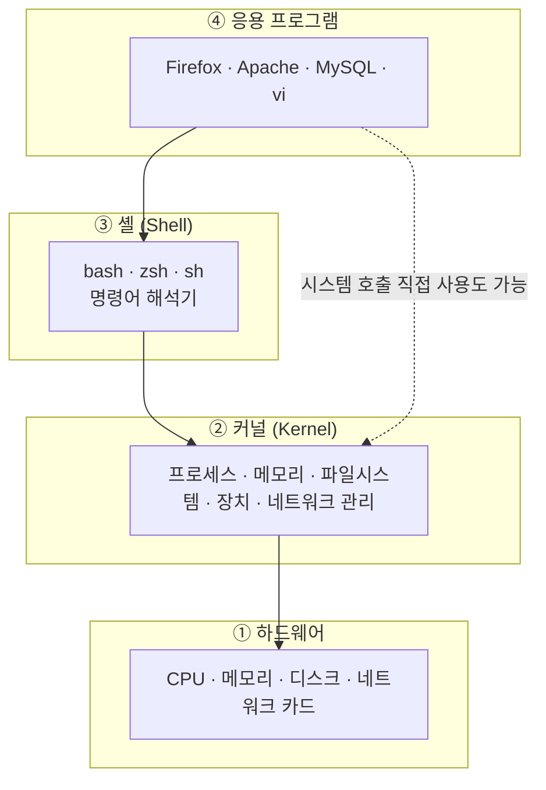
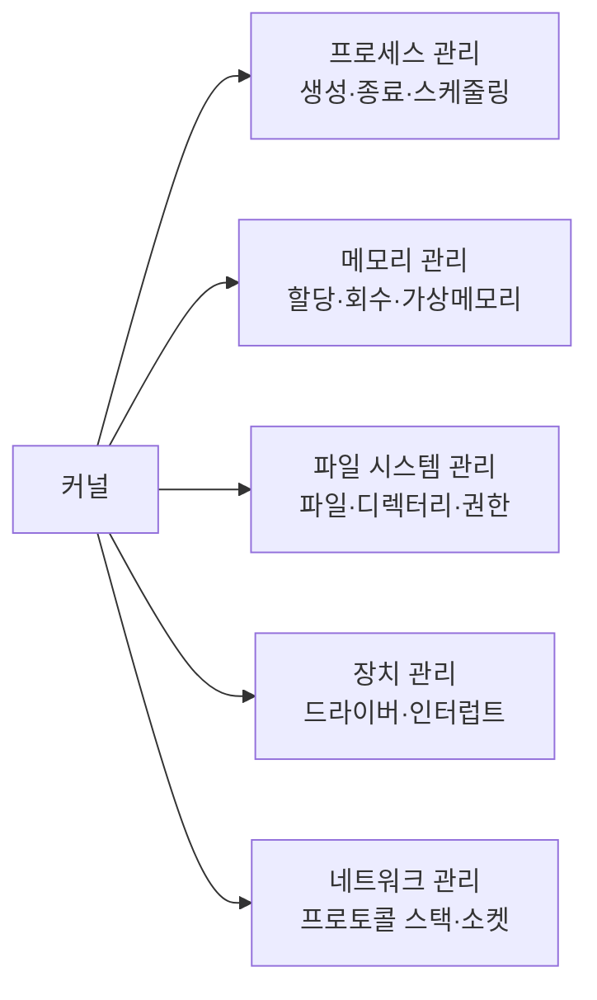
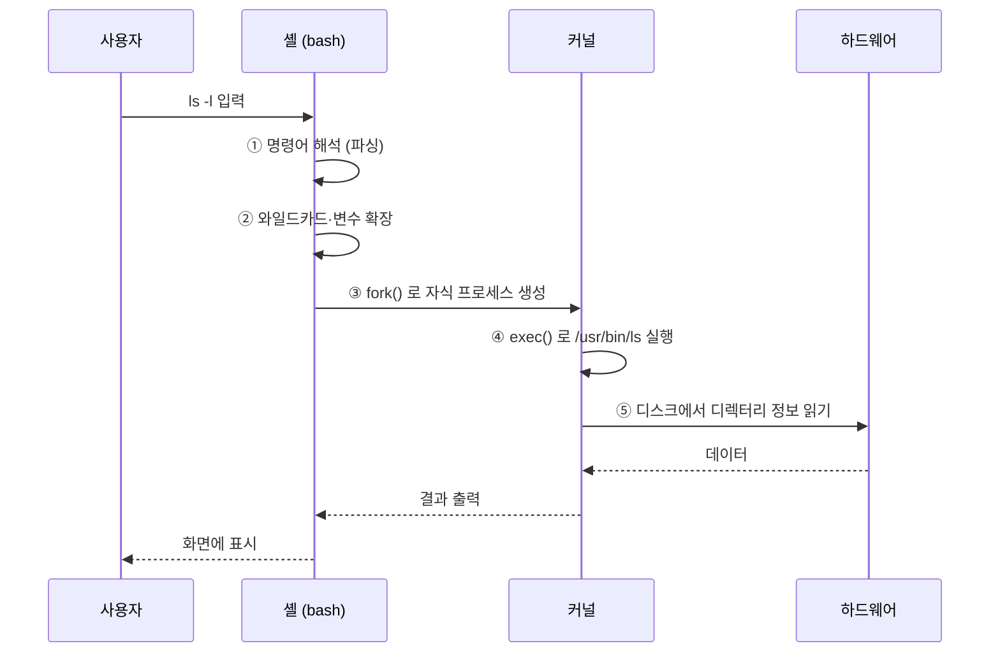
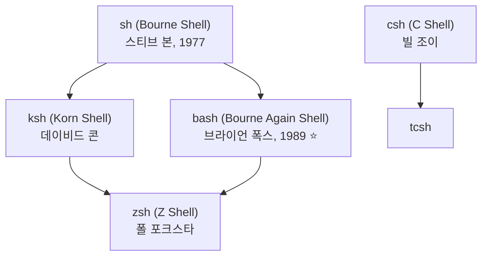
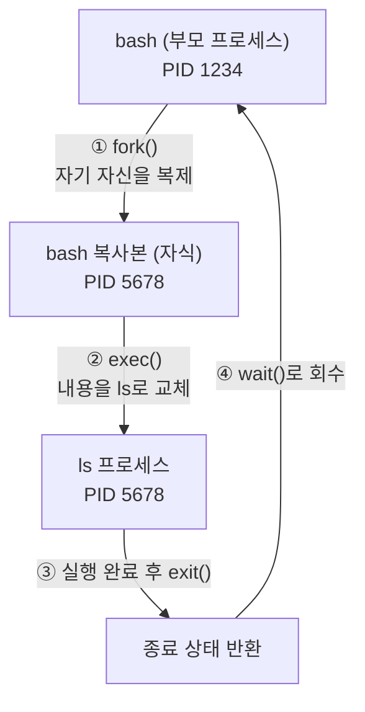
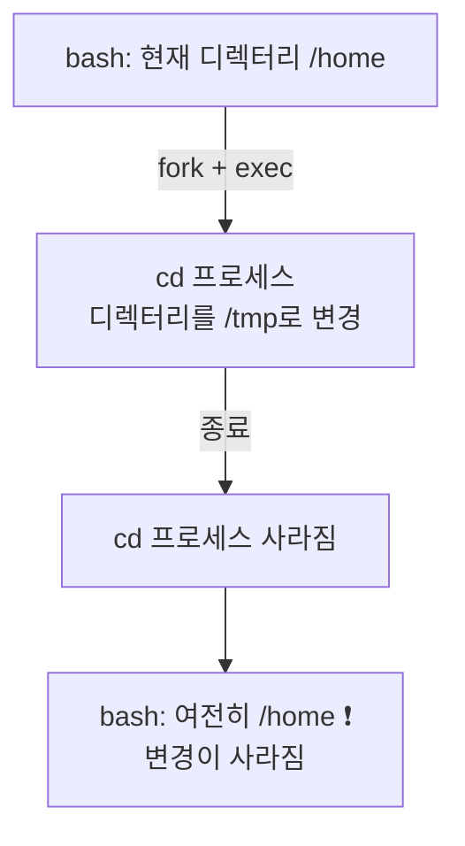
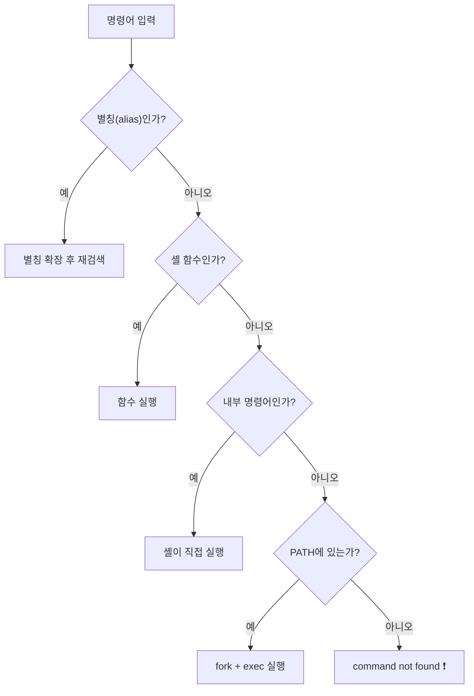

## 006. 리눅스의 구조 - 커널과 셸

### 1. 리눅스 시스템의 계층 구조

리눅스는 **양파처럼 겹겹이 쌓인 구조**로 이해하면 가장 명확합니다.



| 계층 | 역할 | 비유 |
| --- | --- | --- |
| **하드웨어** | 실제 물리 장치 | 공장 설비 |
| **커널** | 자원을 관리하고 하드웨어를 제어 | 공장을 통제하는 관리자 |
| **셸** | 사용자의 명령을 해석하여 커널에 전달 | 관리자에게 지시를 전달하는 통역사 |
| **응용 프로그램** | 사용자가 실제로 쓰는 프로그램 | 주문서 |

> **핵심** : 사용자는 커널을 **직접** 조작할 수 없습니다.  
> 반드시 **셸이나 응용 프로그램을 통해서만** 커널에 요청할 수 있습니다.

---

### 2. 커널 (Kernel)

**커널은 운영체제의 핵심**으로, 부팅 시 메모리에 올라와 **시스템이 꺼질 때까지 상주**합니다.

#### 커널이 하는 일 — 5대 관리



| 관리 대상 | 구체적인 일 |
| --- | --- |
| **프로세스** | 어떤 프로그램이 언제 CPU를 쓸지 결정(스케줄링), 프로세스 간 통신(IPC) 중계 |
| **메모리** | 프로세스별 메모리 공간 할당·보호, 부족하면 가상 메모리(스왑) 활용 |
| **파일 시스템** | 디스크를 파일·디렉터리로 추상화, 접근 권한 검사 |
| **장치** | 드라이버를 통해 입출력 처리, 인터럽트 처리 |
| **네트워크** | TCP/IP 프로토콜 처리, 패킷 송수신 |

#### 커널 이미지의 위치

```bash
$ ls -lh /boot/
-rw-------. 1 root root  47M Jan 24 09:00 initramfs-4.18.0-513.el8.x86_64.img
-rwxr-xr-x. 1 root root 9.9M Nov  8 12:00 vmlinuz-4.18.0-513.el8.x86_64
drwx------. 5 root root 4.0K Jan 24 09:00 grub2
```

| 파일 | 의미 |
| --- | --- |
| **`vmlinuz`** | **압축된 커널 이미지**. `vm`=Virtual Memory, `z`=압축(zip) |
| **`initramfs`** | 부팅 초기에 사용할 **임시 루트 파일 시스템**. 디스크 드라이버 등이 들어 있습니다. |
| `System.map` | 커널 심볼(함수·변수) 주소 테이블 |
| `grub2/` | 부트로더 설정 |

#### 커널 컴파일 — 왜 직접 빌드할까

배포판이 제공하는 커널을 그대로 써도 되지만, 다음 경우 직접 컴파일합니다.

- 특정 하드웨어 드라이버가 기본 커널에 없을 때
- 불필요한 기능을 빼서 **커널을 가볍게** 만들고 싶을 때 (임베디드)
- 최신 커널 기능을 먼저 써야 할 때

```bash
# 커널 컴파일 대략적인 순서 (개념만 파악)
$ tar xvf linux-6.6.tar.xz && cd linux-6.6
$ make menuconfig       # ① 설정 (어떤 기능을 넣을지 선택) → .config 생성
$ make                  # ② 커널과 모듈 컴파일
$ sudo make modules_install   # ③ 모듈 설치 → /lib/modules/
$ sudo make install     # ④ 커널 설치 → /boot/, 부트로더 갱신
$ sudo reboot
```

| 설정 명령 | 방식 |
| --- | --- |
| `make config` | 질문에 하나씩 답하는 텍스트 방식 (매우 불편) |
| **`make menuconfig`** | **텍스트 메뉴 방식 (가장 일반적)** |
| `make xconfig` | Qt 기반 GUI |
| `make gconfig` | GTK 기반 GUI |
| `make oldconfig` | 기존 `.config`를 재사용하고 새 항목만 질문 |
| `make defconfig` | 기본 설정 사용 |
| `make clean` | 빌드 결과물 삭제 (`.config`는 유지) |
| `make mrproper` | 빌드 결과물 + **`.config`까지 삭제** |

> **시험 포인트**  
> `make clean` 은 설정 파일을 남기고, **`make mrproper` 는 `.config`까지 지웁니다.**

---

### 3. 셸 (Shell)

셸은 **사용자가 입력한 명령을 해석하여 커널에 전달하는 명령어 해석기**입니다.

"셸(껍데기)"이라는 이름은 **커널(알맹이)을 감싸고 있다**는 의미에서 붙었습니다.



#### 셸의 주요 기능

| 기능 | 설명 | 예 |
| --- | --- | --- |
| **명령어 해석** | 입력을 분석하여 실행 | `ls -l` |
| **변수 관리** | 환경 변수·셸 변수 설정 | `PATH=/usr/bin` |
| **리다이렉션** | 입출력 방향 전환 | `ls > out.txt` |
| **파이프** | 명령 연결 | `ps aux \| grep nginx` |
| **와일드카드** | 파일명 패턴 매칭 | `rm *.log` |
| **잡 컨트롤** | 백그라운드 실행·작업 관리 | `sleep 100 &`, `jobs`, `fg` |
| **히스토리** | 이전 명령 재사용 | `history`, `!!` |
| **별칭(alias)** | 명령어 축약 | `alias ll='ls -l'` |
| **셸 스크립트** | 명령어를 묶어 프로그래밍 | `#!/bin/bash` |

#### 셸의 종류 (시험 출제 포인트)



| 셸 | 개발자 | 특징 |
| --- | --- | --- |
| **sh** (Bourne Shell) | **스티브 본 (Steve Bourne)** | 최초의 표준 UNIX 셸. 기능은 적지만 호환성이 가장 높습니다. |
| **csh** (C Shell) | **빌 조이 (Bill Joy)** | **C 언어와 유사한 문법**. 히스토리·별칭 기능을 처음 도입했습니다. |
| **tcsh** | Ken Greer | csh의 개선판. 명령어 자동 완성을 지원합니다. |
| **ksh** (Korn Shell) | **데이비드 콘 (David Korn)** | sh와 호환되면서 csh의 기능을 흡수했습니다. |
| **bash** (Bourne Again Shell) | **브라이언 폭스 (Brian Fox)** | **GNU 프로젝트의 셸. 대부분 리눅스 배포판의 기본 셸**입니다. |
| **zsh** (Z Shell) | 폴 포크스타 | 강력한 자동 완성과 커스터마이징. macOS의 기본 셸입니다. |
| **dash** | — | 매우 가볍고 빠른 POSIX 셸. Ubuntu의 `/bin/sh`가 이것입니다. |

> **시험 단골** : "bash를 개발한 사람은?" → **브라이언 폭스**  
> "C 셸을 개발한 사람은?" → **빌 조이**  
> "최초의 셸은?" → **본 셸(sh), 스티브 본**

#### 셸 확인과 변경

```bash
# 현재 사용 중인 셸
$ echo $SHELL
/bin/bash

# 시스템에 설치된 셸 목록
$ cat /etc/shells
/bin/sh
/bin/bash
/usr/bin/bash
/bin/zsh

# 로그인 셸 변경 (다음 로그인부터 적용)
$ chsh -s /bin/zsh
$ chsh -l              # 사용 가능한 셸 목록 (일부 배포판)

# 사용자별 로그인 셸은 /etc/passwd 마지막 필드에 기록됩니다
$ grep "^$(whoami)" /etc/passwd
masterway:x:1000:1000::/home/masterway:/bin/bash
                                       └── 로그인 셸
```

> **주의** : `/etc/shells` 에 등록되지 않은 셸은 `chsh`로 지정할 수 없습니다.  
> 로그인을 막고 싶을 때는 셸을 **`/sbin/nologin`** 또는 **`/bin/false`** 로 지정합니다.

---

### 4. 셸의 동작 원리 — fork와 exec

셸이 명령어를 실행하는 방식은 리눅스 프로세스 이해의 핵심입니다.



1. **fork()** — 셸이 자기 자신을 그대로 복제하여 자식 프로세스를 만듭니다.
2. **exec()** — 자식 프로세스의 내용을 실행할 프로그램(`ls`)으로 **덮어씁니다.**
3. **exit()** — 프로그램이 끝나면 종료 상태를 반환합니다.
4. **wait()** — 부모(셸)가 자식의 종료를 확인하고 자원을 회수한 뒤, 다시 프롬프트를 표시합니다.

#### 왜 이렇게 복잡하게 할까?

이 구조 덕분에

- 자식이 아무리 잘못되어도 **셸 자체는 죽지 않습니다.**
- 자식은 부모의 **환경 변수·열린 파일·작업 디렉터리를 그대로 물려받습니다.**
- `&`를 붙이면 부모가 `wait()`을 하지 않고 바로 프롬프트를 돌려줍니다 → **백그라운드 실행**

```bash
# 포그라운드 : 끝날 때까지 기다림
$ sleep 5
(5초 대기)

# 백그라운드 : 바로 프롬프트 복귀
$ sleep 100 &
[1] 5678          ← [작업번호] PID

$ jobs
[1]+  Running    sleep 100 &

$ fg %1           # 포그라운드로 전환
$ bg %1           # 백그라운드로 전환
```

---

### 5. 내부 명령어와 외부 명령어

셸 명령어는 두 종류로 나뉩니다. **시험에 자주 나옵니다.**

| 구분 | 내부 명령어 (Built-in) | 외부 명령어 (External) |
| --- | --- | --- |
| 위치 | **셸 자체에 내장** | `/bin`, `/usr/bin` 등에 **별도 실행 파일** |
| 실행 방식 | 셸이 **직접 수행** (fork 없음) | fork + exec 로 **새 프로세스 생성** |
| 속도 | **빠름** | 상대적으로 느림 |
| 예 | `cd`, `pwd`, `echo`, `export`, `alias`, `history`, `source`, `exit`, `set` | `ls`, `cp`, `mv`, `grep`, `find`, `cat` |

#### 구분하는 방법

```bash
$ type cd
cd is a shell builtin              ← 내부 명령어

$ type ls
ls is aliased to `ls --color=auto' ← 별칭

$ type -a grep
grep is /usr/bin/grep              ← 외부 명령어

$ which grep
/usr/bin/grep                      ← 외부 명령어만 경로가 나옵니다

$ which cd
/usr/bin/which: no cd in (...)     ← 내부 명령어라 파일이 없습니다
```

#### 왜 `cd`는 내부 명령어여야만 할까? (이해 포인트)

`cd`가 외부 명령어라고 가정해 봅시다.



자식 프로세스에서 디렉터리를 바꿔도, **자식이 끝나면 그 변경도 함께 사라집니다.**  
부모(셸)의 디렉터리는 그대로입니다.

그래서 `cd`처럼 **셸 자신의 상태를 바꿔야 하는 명령**은 반드시 **내부 명령어**여야 합니다.  
같은 이유로 `export`, `alias`, `set` 도 모두 내부 명령어입니다.

---

### 6. 명령어 실행 순서

셸에 명령을 입력하면 다음 순서로 찾습니다.



**순서** : 별칭 → 셸 함수 → 내부 명령어 → `PATH` 상의 외부 명령어

```bash
# PATH 확인 — 앞에서부터 순서대로 탐색합니다
$ echo $PATH
/usr/local/bin:/usr/bin:/usr/local/sbin:/usr/sbin:/home/masterway/.local/bin

# 별칭을 무시하고 원본 명령 실행 (앞에 역슬래시)
$ \ls

# 현재 디렉터리의 실행 파일은 ./ 를 붙여야 합니다
$ ./myscript.sh
```

> **왜 현재 디렉터리(`.`)는 PATH에 없을까?**  
> 만약 `.`이 PATH에 있다면, 공격자가 `/tmp`에 `ls`라는 악성 스크립트를 두고  
> 관리자가 `/tmp`에서 `ls`를 치기만 기다리면 됩니다.  
> **보안상 현재 디렉터리는 PATH에 넣지 않는 것이 원칙**입니다.

---

### 시험 포인트 정리

| 항목 | 핵심 |
| --- | --- |
| 리눅스 구조 | 하드웨어 → **커널** → **셸** → 응용 프로그램 |
| 커널 이미지 | **`/boot/vmlinuz`** (압축된 커널) |
| 초기 램디스크 | **`initramfs`** |
| 커널 설정 | **`make menuconfig`** |
| `make clean` vs `mrproper` | mrproper는 **`.config`까지 삭제** |
| 최초의 셸 | **sh (Bourne Shell), 스티브 본** |
| bash 개발자 | **브라이언 폭스** |
| csh 개발자 | **빌 조이** |
| ksh 개발자 | **데이비드 콘** |
| 셸 목록 파일 | **`/etc/shells`** |
| 로그인 셸 변경 | **`chsh -s`** |
| 로그인 차단 셸 | `/sbin/nologin`, `/bin/false` |
| 명령 실행 원리 | **fork() → exec() → exit() → wait()** |
| 내부 명령어 | `cd`, `pwd`, `echo`, `export`, `alias`, `history` |
| 명령어 탐색 순서 | 별칭 → 함수 → **내부** → PATH(외부) |
| 내부/외부 확인 | **`type`** |

---

### 한 줄 정리

리눅스는 **하드웨어 → 커널 → 셸 → 응용 프로그램**의 계층 구조이며,  
커널은 **프로세스·메모리·파일·장치·네트워크**를 관리하고,  
셸은 명령을 해석해 **fork()로 복제하고 exec()로 교체**하여 실행하는데,  
**`cd`처럼 셸 자신의 상태를 바꾸는 명령은 반드시 내부 명령어**여야 합니다.
