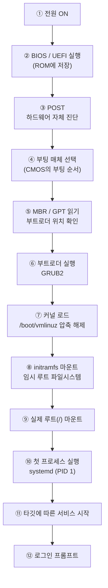
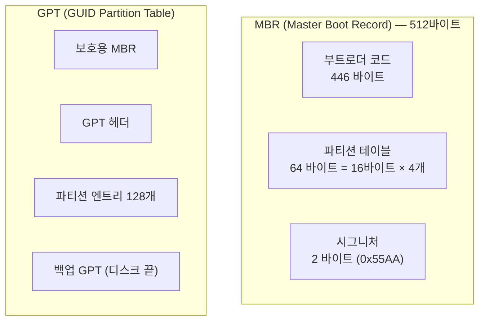
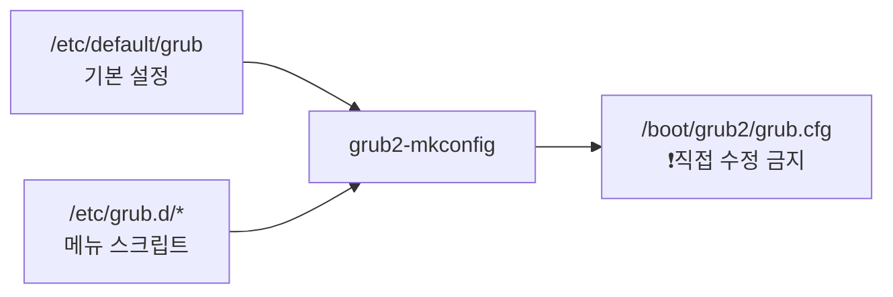
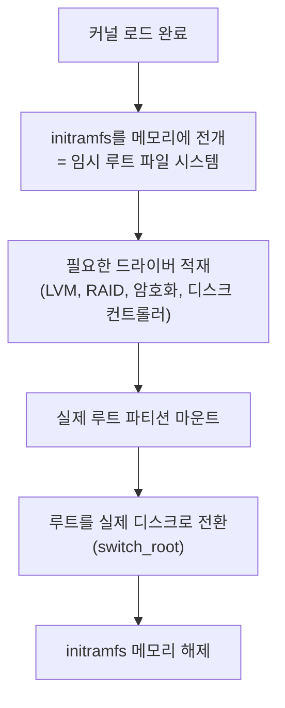

## 007. 부팅 과정과 부트 매니저

### 1. 부팅이란

**부팅(Booting)** 은 전원을 켠 뒤 운영체제가 메모리에 올라와 사용할 수 있는 상태가 되는 과정입니다.

어원은 **"bootstrap(신발 끈)"** 으로,  
*"자기 신발 끈을 잡아당겨 스스로 일어선다"* 는 표현에서 왔습니다.

#### 왜 그런 이름이 붙었을까?

전원을 켠 직후 컴퓨터에는 **아무 프로그램도 메모리에 없습니다.**

- 운영체제를 불러오려면 → **프로그램이 필요한데**
- 그 프로그램을 불러오려면 → **또 프로그램이 필요합니다**

이 순환을 끊기 위해, **전원이 꺼져도 지워지지 않는 ROM에 최초 실행 프로그램(BIOS/UEFI)** 을 넣어 둡니다.  
아주 작은 프로그램이 조금 더 큰 프로그램을 부르고, 그것이 다시 운영체제를 부르는 **단계적 부팅** 구조입니다.

---

### 2. 리눅스 부팅 전체 과정



각 단계를 하나씩 살펴보겠습니다.

---

### 3. ① ~ ④ 펌웨어 단계 (BIOS / UEFI)

#### BIOS (Basic Input Output System)

- **ROM에 저장**되어 있어 전원이 꺼져도 유지됩니다.
- **POST(Power On Self Test)** 로 CPU·메모리·그래픽카드 등 하드웨어를 점검합니다.
- 이상이 있으면 **비프음**으로 알립니다. (화면이 안 나올 수도 있으므로)
- CMOS에 저장된 **부팅 순서**에 따라 부팅할 장치를 선택합니다.

#### BIOS vs UEFI (시험 출제 포인트)

| 구분 | **BIOS** | **UEFI** |
| --- | --- | --- |
| 등장 | 1980년대 | 2000년대 이후 |
| 실행 모드 | 16비트 | 32/64비트 |
| 파티션 방식 | **MBR** | **GPT** |
| 최대 디스크 용량 | **2TB** | 사실상 무제한 (9.4ZB) |
| 최대 파티션 수 | 주 파티션 **4개** | **128개** |
| 부팅 속도 | 느림 | 빠름 |
| 인터페이스 | 텍스트, 키보드만 | 그래픽, 마우스 사용 가능 |
| 보안 | 없음 | **Secure Boot** 지원 |
| 부트로더 위치 | MBR의 첫 446바이트 | **EFI 시스템 파티션(ESP)** 의 `.efi` 파일 |

```bash
# 현재 시스템이 UEFI로 부팅했는지 확인
$ ls /sys/firmware/efi
# 디렉터리가 있으면 UEFI, "No such file"이면 BIOS(레거시)

$ [ -d /sys/firmware/efi ] && echo "UEFI" || echo "BIOS"
UEFI
```

#### MBR vs GPT



**MBR의 한계 — 왜 512바이트가 문제였나**

- 파티션 테이블이 **64바이트뿐**이고, 항목 하나가 16바이트이므로 **주 파티션 최대 4개**입니다.
- 파티션 크기를 32비트로 표현하므로 **2TB를 넘을 수 없습니다.**
- 파티션 테이블이 **한 곳에만** 있어 손상되면 복구가 어렵습니다.

**GPT의 개선**

- 파티션 **128개**, 용량 사실상 무제한
- 파티션 테이블을 **디스크 앞뒤에 이중 저장** → 손상 시 복구 가능
- **CRC 검사**로 무결성 확인

> **시험 포인트**  
> MBR = 512바이트 = **446(부트로더) + 64(파티션 테이블) + 2(시그니처)**  
> 이 숫자 조합이 그대로 출제됩니다.

---

### 4. ⑤ ~ ⑥ 부트로더 (GRUB2)

부트로더는 **커널을 찾아 메모리에 올려 주는 프로그램**입니다.

#### 부트로더의 종류

| 부트로더 | 특징 |
| --- | --- |
| **LILO** (LInux LOader) | 초기 부트로더. 설정 변경 시 **`lilo` 명령으로 다시 설치**해야 반영됩니다. 현재는 거의 쓰이지 않습니다. |
| **GRUB Legacy** (0.9x) | 설정 파일 `/boot/grub/menu.lst`. 파티션 번호가 **0부터** 시작합니다. |
| **GRUB2** (1.9x 이상) | **현재 표준**. 설정 파일 `/boot/grub2/grub.cfg`. 파티션 번호가 **1부터** 시작합니다. |

#### LILO vs GRUB (자주 출제)

| 구분 | LILO | GRUB |
| --- | --- | --- |
| 설정 변경 후 | **재설치 필요** (`lilo` 실행) | **재설치 불필요** (파일만 수정) |
| 파일 시스템 인식 | 못 함 (블록 위치를 직접 기억) | **인식함** (파일 경로로 접근) |
| 대화형 셸 | 없음 | **있음** (부팅 실패 시 직접 조작 가능) |
| 설정 파일 | `/etc/lilo.conf` | `/boot/grub2/grub.cfg` |

> **왜 GRUB이 이겼나**  
> LILO는 커널의 **물리적 디스크 위치**를 기억합니다. 커널을 새로 설치하면 위치가 바뀌므로 매번 `lilo`를 다시 실행해야 하고, 잊으면 **부팅 불가**가 됩니다.  
> GRUB은 파일 시스템을 이해하므로 **`/boot/vmlinuz` 라는 경로**로 찾습니다. 위치가 바뀌어도 문제없습니다.

#### GRUB2 디스크·파티션 표기법 (시험 단골)

```
(hd0,msdos1)
 │  │  │    │
 │  │  │    └── 파티션 번호 : GRUB2는 1부터, GRUB Legacy는 0부터
 │  │  └─────── 파티션 방식 : msdos(MBR) 또는 gpt
 │  └────────── 디스크 번호 : 0부터 시작 (첫 번째 디스크 = 0)
 └───────────── 하드디스크
```

| 표기 | 의미 |
| --- | --- |
| `(hd0,msdos1)` | **첫 번째 디스크의 1번 파티션** = `/dev/sda1` |
| `(hd0,gpt2)` | 첫 번째 디스크(GPT)의 2번 파티션 = `/dev/sda2` |
| `(hd1,msdos3)` | 두 번째 디스크의 3번 파티션 = `/dev/sdb3` |

> **주의** : **디스크는 0부터**, **파티션은 1부터**(GRUB2)입니다. 헷갈리기 쉬운 부분입니다.

#### GRUB2 설정

**`grub.cfg`는 직접 수정하지 않습니다.** 자동 생성되는 파일이기 때문입니다.



```bash
# ① 설정 파일 편집
$ sudo vi /etc/default/grub
GRUB_TIMEOUT=5                    # 메뉴 대기 시간(초)
GRUB_DEFAULT=saved                # 기본 선택 항목
GRUB_CMDLINE_LINUX="crashkernel=auto rhgb quiet"
GRUB_DISABLE_RECOVERY="true"

# ② 설정 반영 (grub.cfg 재생성)
# BIOS 환경
$ sudo grub2-mkconfig -o /boot/grub2/grub.cfg
# UEFI 환경 (Rocky/RHEL)
$ sudo grub2-mkconfig -o /boot/efi/EFI/rocky/grub.cfg

# ③ 부트로더 재설치가 필요한 경우
$ sudo grub2-install /dev/sda
```

> Debian/Ubuntu에서는 명령 이름이 다릅니다 : **`update-grub`**, **`grub-mkconfig`**, **`grub-install`**

#### GRUB 비밀번호 설정 (보안 문제로 출제됩니다)

GRUB 메뉴에서 커널 파라미터를 편집하면 **누구나 root 권한을 얻을 수 있습니다.**  
물리적 접근이 가능한 서버라면 반드시 잠가야 합니다.

```bash
# 암호화된 비밀번호 생성
$ grub2-mkpasswd-pbkdf2
Enter password:
PBKDF2 hash of your password is grub.pbkdf2.sha512.10000.XXXX...

# /etc/grub.d/40_custom 에 추가
set superusers="admin"
password_pbkdf2 admin grub.pbkdf2.sha512.10000.XXXX...

# 반영
$ sudo grub2-mkconfig -o /boot/grub2/grub.cfg
```

---

### 5. ⑦ ~ ⑨ 커널 로드와 initramfs

#### initramfs가 왜 필요할까? (핵심 개념)

부팅하려면 루트 파일 시스템(`/`)을 마운트해야 합니다.  
그런데 루트가 **LVM 위에 있거나, RAID 위에 있거나, 암호화되어 있다면?**

- 마운트하려면 → **LVM 드라이버가 필요**한데
- 그 드라이버는 → **루트 파일 시스템 안에 있습니다**

또다시 닭과 달걀 문제입니다.



**initramfs**는 **커널과 함께 메모리에 올라가는 최소한의 임시 파일 시스템**입니다.  
여기에 필요한 드라이버를 미리 담아 두어, 실제 루트를 마운트할 수 있게 해 줍니다.

```bash
# initramfs 내용 확인
$ lsinitrd /boot/initramfs-$(uname -r).img | head -20

# initramfs 재생성 (드라이버 추가 후 등)
$ sudo dracut -f                              # 현재 커널용
$ sudo dracut -f /boot/initramfs-$(uname -r).img $(uname -r)

# Debian 계열
$ sudo update-initramfs -u
```

> **실무 경고**  
> `/etc/fstab`을 잘못 수정하거나 initramfs가 깨지면 **부팅 불가**가 됩니다.  
> 이때는 GRUB 메뉴에서 **응급 모드로 진입**해 복구합니다. (아래 7절)

---

### 6. ⑩ ~ ⑫ init 프로세스 — SysV vs systemd

커널이 마지막으로 하는 일은 **최초의 사용자 프로세스(PID 1)** 를 실행하는 것입니다.  
이후 모든 프로세스는 이 PID 1의 자손입니다.

#### 전통적인 SysV init

| 개념 | 설명 |
| --- | --- |
| 실행 파일 | `/sbin/init` |
| 설정 파일 | **`/etc/inittab`** |
| 스크립트 위치 | `/etc/rc.d/rc[0-6].d/` |
| 동작 방식 | 스크립트를 **순차적으로** 실행 |

**런레벨(Runlevel)** — 시스템의 동작 모드

| 런레벨 | 의미 |
| --- | --- |
| **0** | **시스템 종료 (halt)** |
| 1 | 단일 사용자 모드 (복구용, `s`/`S`) |
| 2 | 다중 사용자 모드 (NFS 없음) |
| **3** | **다중 사용자 모드 + 네트워크 (텍스트, 서버 기본)** |
| 4 | 사용하지 않음 (예약) |
| **5** | **다중 사용자 + 네트워크 + X 윈도 (GUI)** |
| **6** | **재부팅 (reboot)** |

> **시험 단골** : **0=종료, 3=텍스트 다중사용자, 5=GUI, 6=재부팅**  
> 0과 6을 기본 런레벨로 설정하면 **켜자마자 꺼지거나 무한 재부팅**하므로 절대 지정하면 안 됩니다.

#### 현재 표준 — systemd

| 특징 | 설명 |
| --- | --- |
| **병렬 실행** | 의존성이 없는 서비스를 **동시에** 시작 → 부팅이 훨씬 빠릅니다. |
| **소켓 활성화** | 서비스를 미리 띄우지 않고, **요청이 올 때 시작**합니다. |
| **유닛(Unit)** | 서비스·마운트·타이머 등 모든 것을 유닛으로 관리합니다. |
| **타깃(Target)** | 런레벨을 대체하는 개념입니다. |
| **cgroup 기반** | 프로세스를 그룹으로 묶어 확실히 추적·종료합니다. |
| **통합 로그** | `journald`가 모든 로그를 수집합니다. |

**런레벨 ↔ 타깃 대응 (반드시 암기)**

| 런레벨 | systemd 타깃 |
| --- | --- |
| 0 | **`poweroff.target`** |
| 1 | **`rescue.target`** |
| 2, 3, 4 | **`multi-user.target`** |
| 5 | **`graphical.target`** |
| 6 | **`reboot.target`** |
| 응급 | `emergency.target` |

```bash
# 현재 타깃 확인
$ systemctl get-default
multi-user.target

# 기본 타깃 변경 (GUI ↔ 텍스트)
$ sudo systemctl set-default graphical.target
$ sudo systemctl set-default multi-user.target

# 지금 즉시 전환 (재부팅 없이)
$ sudo systemctl isolate graphical.target

# 예전 런레벨 명령도 여전히 동작합니다 (호환용)
$ runlevel
N 3
$ who -r
         run-level 3  2026-01-25 20:30
$ sudo init 6        # 재부팅
```

#### systemd 유닛 종류

| 확장자 | 유닛 종류 | 용도 |
| --- | --- | --- |
| **`.service`** | 서비스 | 데몬 프로세스 (httpd, sshd) |
| `.target` | 타깃 | 유닛들의 묶음 (런레벨 대체) |
| `.mount` | 마운트 | 파일 시스템 마운트 |
| `.timer` | 타이머 | cron을 대체하는 예약 실행 |
| `.socket` | 소켓 | 소켓 활성화 |
| `.device` | 장치 | 커널이 인식한 장치 |
| `.swap` | 스왑 | 스왑 영역 |

```bash
# 서비스 관리 (가장 많이 쓰는 명령)
$ sudo systemctl start httpd        # 시작
$ sudo systemctl stop httpd         # 중지
$ sudo systemctl restart httpd      # 재시작
$ sudo systemctl reload httpd       # 설정만 다시 읽기 (무중단)
$ sudo systemctl enable httpd       # 부팅 시 자동 시작 등록
$ sudo systemctl disable httpd      # 자동 시작 해제
$ systemctl status httpd            # 상태 확인
$ systemctl is-enabled httpd        # 자동 시작 여부만 확인

# 목록 조회
$ systemctl list-units --type=service
$ systemctl list-unit-files --state=enabled

# 부팅 시간 분석 (systemd의 강력한 기능)
$ systemd-analyze
Startup finished in 1.2s (kernel) + 3.4s (initrd) + 8.9s (userspace) = 13.6s

$ systemd-analyze blame | head -5     # 어떤 서비스가 오래 걸렸나
5.123s NetworkManager-wait-online.service
1.234s firewalld.service
```

---

### 7. 부팅 문제 해결 (실기 대비)

#### 단일 사용자 모드 / 응급 모드 진입

비밀번호를 잊었거나 `/etc/fstab` 오류로 부팅이 안 될 때 사용합니다.

```
① 부팅 시 GRUB 메뉴에서 커서를 부팅 항목에 두고 [e] 키
② linux 로 시작하는 줄 끝으로 이동
③ 다음 중 하나를 추가
      rd.break            ← initramfs 단계에서 멈춤 (root 비밀번호 초기화용)
      single  또는  1     ← 단일 사용자 모드
      systemd.unit=rescue.target
      systemd.unit=emergency.target
④ Ctrl + X 로 부팅
```

**root 비밀번호 초기화 절차 (실기 단골 문제)**

```bash
# ① GRUB에서 rd.break 추가 후 부팅 → switch_root 프롬프트 진입

# ② 실제 루트가 /sysroot 에 읽기 전용으로 마운트되어 있음 → 쓰기 가능하게 재마운트
switch_root:/# mount -o remount,rw /sysroot

# ③ 루트를 /sysroot 로 전환
switch_root:/# chroot /sysroot

# ④ 비밀번호 변경
sh-4.4# passwd root
New password:

# ⑤ SELinux 라벨 재설정 예약 (이 단계를 빠뜨리면 부팅 실패)
sh-4.4# touch /.autorelabel

# ⑥ 빠져나와 재부팅
sh-4.4# exit
switch_root:/# exit
```

> **시험 포인트** : `touch /.autorelabel` 을 빠뜨리면 SELinux 컨텍스트가 맞지 않아  
> **재부팅 후에도 로그인이 안 됩니다.** 반드시 포함해야 합니다.

#### 부팅 로그 확인

```bash
# 이번 부팅의 커널 메시지
$ dmesg -T | less

# systemd 저널
$ journalctl -b            # 이번 부팅
$ journalctl -b -1         # 직전 부팅
$ journalctl -p err -b     # 이번 부팅의 에러만
$ journalctl -xb           # 설명 포함
```

---

### 시험 포인트 정리

| 항목 | 핵심 |
| --- | --- |
| 부팅 순서 | BIOS/UEFI → POST → **부트로더(GRUB2)** → 커널 → **initramfs** → **systemd(PID 1)** |
| MBR 구조 | **512B = 446(부트로더) + 64(파티션테이블) + 2(시그니처)** |
| MBR 한계 | 주 파티션 **4개**, **2TB** |
| GPT | 파티션 **128개**, 이중 백업, UEFI와 짝 |
| LILO vs GRUB | LILO는 **설정 변경 시 재설치 필요** |
| GRUB2 표기 | **`(hd0,msdos1)`** = `/dev/sda1` (디스크 0부터, 파티션 1부터) |
| GRUB2 설정 반영 | **`grub2-mkconfig -o /boot/grub2/grub.cfg`** |
| initramfs 역할 | 루트 마운트에 필요한 **드라이버를 담은 임시 루트** |
| 런레벨 0 / 3 / 5 / 6 | 종료 / 텍스트 다중사용자 / GUI / 재부팅 |
| 타깃 대응 | 3=`multi-user.target`, 5=`graphical.target` |
| 기본 타깃 변경 | **`systemctl set-default`** |
| PID 1 | **systemd** |
| root 비번 초기화 | `rd.break` → remount rw → chroot → passwd → **`touch /.autorelabel`** |

---

### 한 줄 정리

부팅은 **BIOS/UEFI → POST → GRUB2 → 커널 → initramfs → systemd(PID 1)** 순으로 진행되며,  
**MBR은 512바이트(446+64+2)로 주 파티션 4개·2TB 한계**를 가져 GPT로 대체되었고,  
**initramfs는 루트를 마운트하기 위한 드라이버를 담은 임시 루트 파일 시스템**입니다.
