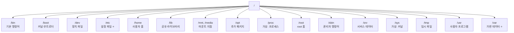
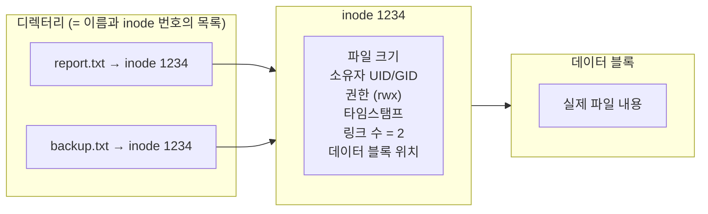
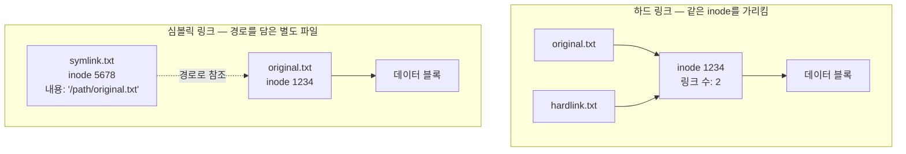
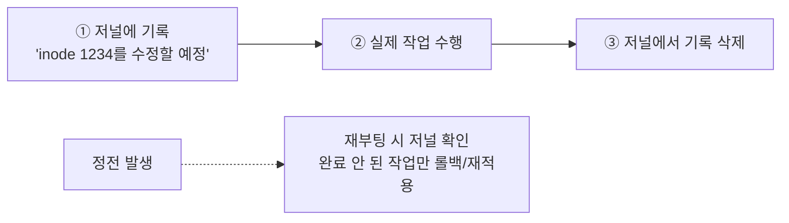
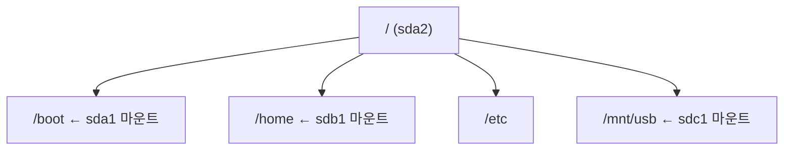

## 008. 파일 시스템의 이해

### 1. 파일 시스템이란

디스크는 그 자체로는 **번호가 매겨진 거대한 블록의 나열**일 뿐입니다.  
"이 파일이 어디에 있고, 크기가 얼마이며, 누가 읽을 수 있는지"를 관리하는 **규칙과 자료 구조**가 파일 시스템입니다.


파일 시스템이 없다면 사용자는 **"12345번 블록부터 3개 블록"** 처럼 물리적 위치를 직접 외워야 합니다.

---

### 2. 리눅스 디렉터리 구조 (FHS)

리눅스는 **최상위 루트(`/`)에서 시작하는 단일 트리 구조**를 가집니다.

> Windows는 드라이브마다 `C:`, `D:` 로 트리가 나뉘지만,  
> 리눅스는 **디스크가 몇 개든 하나의 트리** 안 어딘가에 붙습니다(마운트). 이 차이가 핵심입니다.



#### 주요 디렉터리 상세

| 디렉터리 | 용도 | 기억할 점 |
| --- | --- | --- |
| **`/bin`** | 모든 사용자가 쓰는 **기본 명령어** | `ls`, `cp`, `cat`, `bash` |
| **`/sbin`** | **관리자(root)용 명령어** | `fdisk`, `ifconfig`, `shutdown` — **s = system/super** |
| **`/etc`** | **시스템 설정 파일** | `passwd`, `fstab`, `hosts` — **바이너리 없음** |
| **`/home`** | 일반 사용자 홈 디렉터리 | `/home/masterway` |
| **`/root`** | **root 사용자의 홈** | `/`(루트)와 혼동 주의 |
| **`/var`** | **자주 변하는 데이터** | **로그(`/var/log`)**, 메일, 스풀, DB |
| **`/tmp`** | 임시 파일 | 누구나 쓸 수 있음, **재부팅 시 삭제**, Sticky Bit 설정됨 |
| **`/usr`** | 사용자 응용 프로그램 | `/usr/bin`, `/usr/lib`, `/usr/share` — **읽기 전용 공유 가능** |
| **`/opt`** | 별도 설치 상용 패키지 | 패키지별로 하위 디렉터리 |
| **`/boot`** | 커널·initramfs·GRUB | **별도 파티션으로 분리**하는 경우가 많음 |
| **`/dev`** | 장치 파일 | `sda`, `null`, `tty` |
| **`/proc`** | **가상** — 프로세스·커널 정보 | 디스크에 없음, 메모리상 |
| **`/sys`** | **가상** — 장치·드라이버 계층 | sysfs |
| **`/lib`, `/lib64`** | 공유 라이브러리·커널 모듈 | `/lib/modules/` |
| **`/mnt`** | 임시 수동 마운트 지점 | 관리자가 직접 마운트 |
| **`/media`** | **이동식 매체 자동 마운트** | USB, CD-ROM |
| `/srv` | 서비스가 제공하는 데이터 | |
| `/run` | 실행 중 상태 정보 (PID 파일 등) | 재부팅 시 초기화 |
| `/lost+found` | fsck가 복구한 파일 | ext 계열 파일 시스템에만 존재 |

#### 헷갈리기 쉬운 구분

| 비교 | 차이 |
| --- | --- |
| **`/bin` vs `/sbin`** | `/sbin`은 **관리자 전용** (일반 사용자는 실행해도 권한 부족) |
| **`/root` vs `/`** | `/root`는 **root의 홈 디렉터리**, `/`는 최상위 루트 |
| **`/mnt` vs `/media`** | `/mnt`는 **수동**, `/media`는 **자동(이동식 매체)** |
| **`/var` vs `/tmp`** | `/var`는 **보존되는 가변 데이터(로그)**, `/tmp`는 **삭제돼도 되는 임시 파일** |
| **`/proc` vs `/sys`** | `/proc`은 **프로세스·커널 정보**, `/sys`는 **장치 계층 구조** |

> **`/usr`의 의미**  
> 흔히 "user"로 오해하지만 현재 기준으로는 **Unix System Resources**로 해석합니다.  
> 시스템 부팅에 필수적이지 않은 프로그램들이 들어갑니다.

---

### 3. inode — 리눅스 파일의 실체

리눅스를 이해하는 데 가장 중요한 개념 중 하나입니다.

**파일 이름과 파일의 내용은 별개로 저장됩니다.**



#### inode가 담고 있는 정보

| 저장됨 | 저장 안 됨 |
| --- | --- |
| 파일 종류 (일반/디렉터리/링크) | **파일 이름** ❗ |
| 권한 (rwx) | |
| 소유자 UID / 그룹 GID | |
| 파일 크기 | |
| 타임스탬프 (atime, mtime, ctime) | |
| **하드 링크 수** | |
| 데이터 블록의 위치 | |

> **시험 단골** : **"inode에 저장되지 않는 것은?" → 파일 이름**  
> 파일 이름은 **디렉터리**에 "이름 ↔ inode 번호" 쌍으로 저장됩니다.

#### inode 확인하기

```bash
# inode 번호 보기
$ ls -i report.txt
1234567 report.txt

# 상세 정보
$ stat report.txt
  File: report.txt
  Size: 2048        Blocks: 8          IO Block: 4096   regular file
Device: fd00h/64768d    Inode: 1234567     Links: 2
Access: (0644/-rw-r--r--)  Uid: ( 1000/masterway)   Gid: ( 1000/masterway)
Access: 2026-01-26 09:00:00.000000000 +0900
Modify: 2026-01-25 18:30:00.000000000 +0900
Change: 2026-01-25 18:30:00.000000000 +0900

# inode 사용량 확인 (❗용량은 남았는데 파일이 안 만들어질 때)
$ df -i
Filesystem            Inodes   IUsed    IFree IUse% Mounted on
/dev/mapper/rl-root  36700160  123456 36576704    1% /
```

> **실무에서 겪는 함정**  
> `df -h`로 보면 용량이 남았는데 **"No space left on device"** 오류가 날 때가 있습니다.  
> 작은 파일이 너무 많아 **inode가 고갈**된 경우입니다. **`df -i`** 로 확인해야 합니다.

#### 타임스탬프 3종 (자주 출제)

| 이름 | 갱신 시점 |
| --- | --- |
| **atime** (Access) | 파일을 **읽었을 때** |
| **mtime** (Modify) | 파일 **내용이 바뀌었을 때** |
| **ctime** (Change) | **inode 정보가 바뀌었을 때** (권한·소유자 변경 포함) |

> **ctime은 Create(생성)가 아니라 Change(변경)입니다.** 자주 틀리는 부분입니다.  
> `chmod`만 해도 내용은 그대로지만 **ctime은 갱신**됩니다.

---

### 4. 하드 링크와 심볼릭 링크

inode를 이해했다면 링크는 쉽습니다.



| 구분 | **하드 링크 (Hard Link)** | **심볼릭 링크 (Symbolic Link)** |
| --- | --- | --- |
| 생성 | `ln 원본 링크` | **`ln -s 원본 링크`** |
| inode | **원본과 동일** | **별도 inode** |
| 원본 삭제 시 | **여전히 사용 가능** ✅ | **깨짐 (Broken Link)** ❌ |
| 파일 시스템 경계 | **넘을 수 없음** ❌ | **넘을 수 있음** ✅ |
| 디렉터리 대상 | **불가능** ❌ | **가능** ✅ |
| 크기 | 원본과 동일 표시 | **경로 문자열 길이** (수 바이트) |
| `ls -l` 표시 | 일반 파일과 동일 | `l` 로 시작, `→ 원본` 표시 |

```bash
$ echo "hello" > original.txt

$ ln original.txt hard.txt        # 하드 링크
$ ln -s original.txt soft.txt     # 심볼릭 링크

$ ls -li
1234567 -rw-r--r--. 2 user user  6 Jan 26 09:00 hard.txt
1234567 -rw-r--r--. 2 user user  6 Jan 26 09:00 original.txt   ← inode 같음, 링크 수 2
7654321 lrwxrwxrwx. 1 user user 12 Jan 26 09:00 soft.txt -> original.txt

$ rm original.txt

$ cat hard.txt
hello                              ← ✅ 정상

$ cat soft.txt
cat: soft.txt: No such file or directory   ← ❌ 깨짐
```

#### 왜 하드 링크는 파일 시스템을 넘지 못할까?

inode 번호는 **각 파일 시스템 안에서만 유일**합니다.  
`/`의 inode 1234와 `/home`의 inode 1234는 **서로 다른 파일**입니다.

하드 링크는 inode 번호만 가리키므로, 다른 파일 시스템의 inode를 가리킬 방법이 없습니다.  
반면 심볼릭 링크는 **경로 문자열**을 저장하므로 어디든 가리킬 수 있습니다.

#### 왜 디렉터리에는 하드 링크를 만들 수 없을까?

디렉터리에 하드 링크를 허용하면 **순환 구조**가 만들어질 수 있습니다.

```
/a/b/c → /a  (하드 링크)
→ /a/b/c/b/c/b/c/... 무한 반복
```

파일 시스템 탐색이 무한 루프에 빠지므로 **금지**되어 있습니다.  
(단, `.`과 `..`은 커널이 관리하는 예외입니다.)

---

### 5. 파일의 종류

`ls -l`의 **맨 앞 한 글자**로 구분합니다.

| 기호 | 종류 | 설명 |
| --- | --- | --- |
| **`-`** | 일반 파일 | 텍스트, 바이너리, 이미지 |
| **`d`** | 디렉터리 | |
| **`l`** | 심볼릭 링크 | |
| **`b`** | 블록 장치 | 디스크 |
| **`c`** | 문자 장치 | 키보드, 터미널 |
| **`s`** | 소켓 | 프로세스 간 통신 |
| **`p`** | 파이프(FIFO) | 명명된 파이프 |

```bash
$ ls -l /dev/sda /dev/tty0 /etc /etc/passwd
brw-rw----. 1 root disk 8, 0 Jan 26 09:00 /dev/sda      ← b: 블록 장치
crw--w----. 1 root tty  4, 0 Jan 26 09:00 /dev/tty0     ← c: 문자 장치
drwxr-xr-x. 1 root root 8192 Jan 26 09:00 /etc          ← d: 디렉터리
-rw-r--r--. 1 root root 2891 Jan 26 09:00 /etc/passwd   ← -: 일반 파일

# 파일 종류를 내용 기반으로 판별
$ file /etc/passwd /bin/ls /dev/sda
/etc/passwd: ASCII text
/bin/ls:     ELF 64-bit LSB pie executable, x86-64
/dev/sda:    block special (8/0)
```

---

### 6. 리눅스 파일 시스템의 종류

| 파일 시스템 | 특징 |
| --- | --- |
| **ext2** | 저널링 **없음**. 비정상 종료 시 복구가 오래 걸립니다. |
| **ext3** | ext2 + **저널링**. ext2와 호환됩니다. |
| **ext4** | ext3 개선. **최대 파일 16TB, 볼륨 1EB**, extent 방식으로 대용량에 강합니다. |
| **XFS** | SGI 개발. **대용량·고성능**에 강하며 **RHEL/Rocky의 기본 파일 시스템**입니다. 온라인 확장은 가능하지만 **축소는 불가**합니다. |
| **Btrfs** | 스냅샷, 압축, RAID 내장. openSUSE 기본. |
| **ZFS** | 강력한 무결성 검사. 라이선스 문제로 커널에 기본 포함되지 않습니다. |
| **swap** | 스왑 영역 전용 |
| **tmpfs** | 메모리 기반 임시 파일 시스템 (`/dev/shm`, `/run`) |
| **iso9660** | CD/DVD |
| **vfat / exFAT / NTFS** | Windows 호환용 |
| **NFS** | 네트워크 파일 시스템 (원격 마운트) |

#### 저널링(Journaling)이란 — 왜 중요한가

파일을 저장하는 도중 **정전이 발생하면** 어떻게 될까요?

- 데이터는 썼는데 **메타데이터(inode)를 갱신하기 전**에 꺼졌다면
- 파일 시스템은 **일관성이 깨진 상태**가 됩니다

저널링 파일 시스템은 **실제 작업 전에 "무엇을 할 것인지"를 저널 영역에 먼저 기록**합니다.



덕분에 **디스크 전체를 검사할 필요 없이 저널만 확인**하면 되므로,  
복구 시간이 **수 시간 → 수 초**로 줄어듭니다.

> **시험 포인트** : **ext2는 저널링 없음**, **ext3부터 저널링 지원**

---

### 7. 마운트 (Mount)

**마운트**는 파일 시스템을 **디렉터리 트리의 특정 지점에 연결**하는 작업입니다.



#### 마운트 관련 명령어

```bash
# 현재 마운트 상태 확인
$ mount | grep "^/dev"
/dev/mapper/rl-root on / type xfs (rw,relatime,attr2,inode64)
/dev/sda1 on /boot type xfs (rw,relatime)

$ findmnt              # 트리 형태로 (보기 편함)
$ df -hT               # 용량과 함께

# 마운트
$ sudo mkdir -p /mnt/usb
$ sudo mount /dev/sdb1 /mnt/usb
$ sudo mount -t xfs /dev/sdb1 /mnt/usb          # 타입 지정
$ sudo mount -o ro /dev/sdb1 /mnt/usb           # 읽기 전용
$ sudo mount -o remount,rw /                    # 재마운트

# 언마운트
$ sudo umount /mnt/usb
$ sudo umount /dev/sdb1                          # 장치명으로도 가능
```

#### 언마운트가 안 될 때 (실무 필수)

```bash
$ sudo umount /mnt/usb
umount: /mnt/usb: target is busy.

# 누가 쓰고 있는지 확인
$ sudo lsof +D /mnt/usb        # 해당 경로를 쓰는 프로세스
$ sudo fuser -vm /mnt/usb      # 사용 중인 프로세스 표시

# 강제로 종료시키고 언마운트
$ sudo fuser -km /mnt/usb      # 사용 중인 프로세스 종료 (주의!)
$ sudo umount /mnt/usb

# 지연 언마운트 (사용이 끝나면 자동 해제)
$ sudo umount -l /mnt/usb
```

> **가장 흔한 원인** : 본인이 `cd /mnt/usb` 상태로 그 안에 들어가 있는 경우입니다.  
> `cd /` 로 빠져나온 뒤 다시 시도하면 됩니다.

#### 주요 마운트 옵션

| 옵션 | 의미 |
| --- | --- |
| `rw` / `ro` | 읽기·쓰기 / 읽기 전용 |
| `noexec` | 실행 파일 실행 금지 (보안) |
| `nosuid` | SetUID 무시 (보안) |
| `nodev` | 장치 파일 무시 (보안) |
| `noatime` | 접근 시각 갱신 안 함 (**성능 향상**) |
| `defaults` | `rw,suid,dev,exec,auto,nouser,async` |
| `usrquota`, `grpquota` | 디스크 쿼터 사용 |

> **보안 팁** : `/tmp`처럼 누구나 쓸 수 있는 영역은  
> **`noexec,nosuid,nodev`** 로 마운트하면 악성 스크립트 실행을 막을 수 있습니다.

---

### 8. `/etc/fstab` — 부팅 시 자동 마운트

```bash
$ cat /etc/fstab
# <장치>              <마운트지점>  <타입>  <옵션>          <덤프> <fsck순서>
/dev/mapper/rl-root   /            xfs     defaults        0      0
UUID=a1b2c3d4-...     /boot        xfs     defaults        0      0
/dev/mapper/rl-swap   swap         swap    defaults        0      0
/dev/sdb1             /data        xfs     defaults        0      2
```

#### 6개 필드 (반드시 암기)

| 순서 | 필드 | 설명 |
| --- | --- | --- |
| 1 | **장치** | `/dev/sda1` 또는 **`UUID=`**, `LABEL=` |
| 2 | **마운트 지점** | `/`, `/boot`, `swap` |
| 3 | **파일 시스템 타입** | `xfs`, `ext4`, `swap`, `nfs` |
| 4 | **마운트 옵션** | `defaults`, `ro`, `noexec` |
| 5 | **덤프(dump)** | 백업 대상 여부 — **0=안 함**, 1=함 |
| 6 | **fsck 순서** | **0=검사 안 함**, **1=루트(`/`)**, **2=나머지** |

> **시험 단골** : 6번째 필드에서 **루트 파일 시스템은 반드시 1**, 나머지는 2, 검사 안 하려면 0

#### 왜 UUID를 쓸까? (중요)

`/dev/sdb1` 같은 장치명은 **디스크를 추가하거나 순서가 바뀌면 달라질 수 있습니다.**

- 원래 `/dev/sdb1`이 `/data`였는데
- 디스크를 하나 더 꽂았더니 그 디스크가 `sdb`가 되고 원래 것이 `sdc`로 밀리면
- **엉뚱한 디스크가 `/data`로 마운트**되거나 부팅이 실패합니다

**UUID는 파일 시스템을 만들 때 부여되는 고유 식별자**라 순서와 무관하게 항상 같은 장치를 가리킵니다.

```bash
# UUID 확인
$ sudo blkid
/dev/sda1: UUID="a1b2c3d4-e5f6-7890-abcd-ef1234567890" TYPE="xfs"
/dev/sdb1: UUID="11112222-3333-4444-5555-666677778888" TYPE="ext4"

$ lsblk -f
NAME   FSTYPE LABEL UUID                                 MOUNTPOINT
sda
├─sda1 xfs          a1b2c3d4-e5f6-7890-abcd-ef1234567890 /boot
```

#### fstab 수정 시 반드시 검증할 것 (실무 사고 방지)

```bash
$ sudo vi /etc/fstab
# ... 수정 ...

# ❗재부팅 전에 반드시 테스트
$ sudo mount -a          # fstab의 모든 항목을 지금 마운트해 봄
# 오류가 없으면 안전, 오류가 나면 수정 후 다시 테스트

$ findmnt --verify       # 문법 검증 (더 안전)
```

> **fstab을 잘못 쓰고 재부팅하면 시스템이 응급 모드로 빠져 부팅되지 않습니다.**  
> `mount -a`로 미리 확인하는 습관이 사고를 막습니다.

---

### 9. 파일 시스템 생성과 검사

```bash
# 파일 시스템 생성 (포맷)
$ sudo mkfs -t xfs /dev/sdb1
$ sudo mkfs.xfs /dev/sdb1
$ sudo mkfs.ext4 -L DATA /dev/sdb1      # 레이블 지정

# 파일 시스템 검사·복구
$ sudo fsck /dev/sdb1              # ❗반드시 언마운트 후 실행
$ sudo fsck -y /dev/sdb1           # 모든 질문에 yes
$ sudo xfs_repair /dev/sdb1        # XFS 전용

# 용량 확장
$ sudo xfs_growfs /data            # XFS (마운트된 상태에서)
$ sudo resize2fs /dev/sdb1         # ext4

# 파일 시스템 정보
$ sudo dumpe2fs -h /dev/sdb1       # ext 계열
$ sudo xfs_info /data              # XFS
```

> **경고** : `fsck`를 **마운트된 상태**에서 실행하면 파일 시스템이 손상될 수 있습니다.  
> 반드시 `umount` 후 실행하거나, 루트라면 응급 모드에서 수행해야 합니다.

#### XFS의 중요한 제약 (시험·실무 모두 출제)

| 작업 | ext4 | XFS |
| --- | --- | --- |
| 온라인 **확장** | ✅ | ✅ |
| **축소** | ✅ (언마운트 후) | ❌ **불가능** |

XFS는 설계상 **크기를 줄일 수 없습니다.**  
줄이려면 데이터를 백업하고 파일 시스템을 다시 만들어야 합니다.  
RHEL/Rocky의 기본이 XFS이므로 **파티션 계획을 세울 때 반드시 고려**해야 합니다.

---

### 시험 포인트 정리

| 항목 | 핵심 |
| --- | --- |
| `/bin` vs `/sbin` | `/sbin`은 **관리자용** |
| `/mnt` vs `/media` | 수동 / **이동식 자동** |
| `/var` | **로그 등 자주 변하는 데이터** |
| `/proc`, `/sys` | **가상 파일 시스템** (디스크에 없음) |
| inode에 **없는** 것 | **파일 이름** |
| ctime | Create가 아니라 **Change** (권한 변경도 갱신) |
| 하드 링크 | 같은 inode, 원본 삭제해도 OK, **파일시스템·디렉터리 불가** |
| 심볼릭 링크 | 별도 inode, **원본 삭제 시 깨짐**, 파일시스템 넘기 가능 |
| ext2 vs ext3 | **저널링 유무** |
| RHEL/Rocky 기본 FS | **XFS** (축소 불가) |
| `/etc/fstab` 5번 필드 | **dump** (0=백업 안 함) |
| `/etc/fstab` 6번 필드 | **fsck 순서** — 루트는 **1**, 나머지 2, 안 하면 0 |
| UUID를 쓰는 이유 | 장치명이 **바뀔 수 있어서** |
| fstab 수정 후 | **`mount -a`로 검증** |
| inode 고갈 확인 | **`df -i`** |

---

### 한 줄 정리

리눅스는 **`/`에서 시작하는 단일 트리**에 모든 장치를 마운트하며,  
파일의 실체는 **inode(이름은 디렉터리에 별도 저장)** 이고,  
**하드 링크는 같은 inode·심볼릭 링크는 경로 참조**이며,  
`/etc/fstab`은 **장치·마운트지점·타입·옵션·dump·fsck순서** 6개 필드로 구성됩니다.
