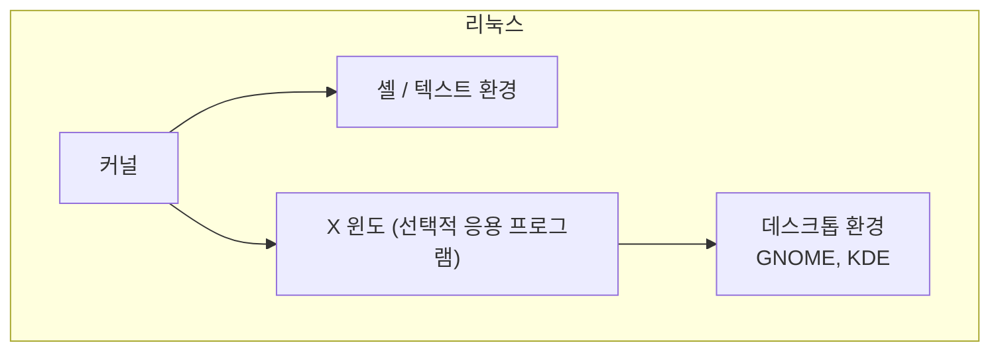
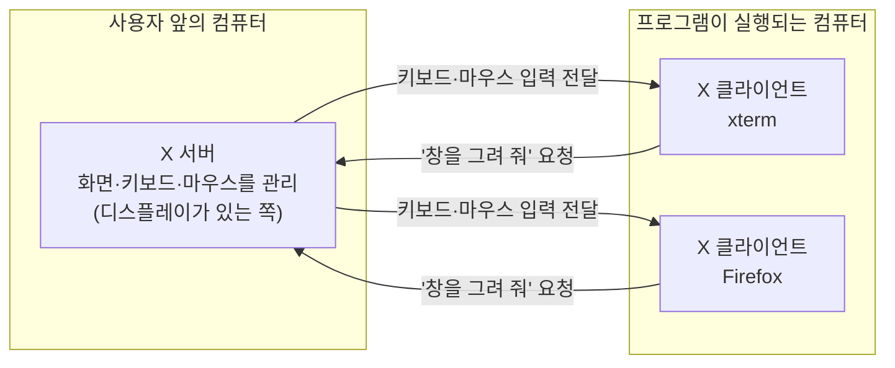
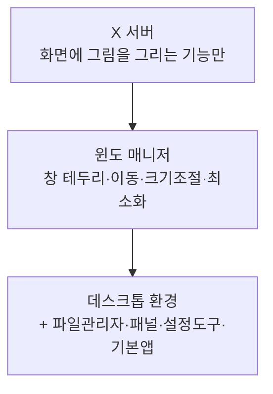

## 009. X 윈도

### 1. X 윈도란

**X 윈도(X Window System)** 는 UNIX/리눅스에서 **그래픽 사용자 인터페이스(GUI)를 제공하는 시스템**입니다.

1984년 MIT에서 개발되었으며, 현재 표준은 **X11(버전 11)** 입니다.  
그래서 흔히 **X11** 또는 그냥 **X**라고 부릅니다.

#### 리눅스의 GUI는 운영체제의 일부가 아닙니다

Windows는 GUI가 운영체제에 **깊이 통합**되어 있어 떼어낼 수 없습니다.  
리눅스는 다릅니다.



X 윈도는 **커널과 무관한 하나의 응용 프로그램**입니다.

**그래서 이런 일이 가능합니다.**

- 서버에는 **X를 아예 설치하지 않아** 자원을 절약합니다.
- X가 죽어도 **시스템은 멀쩡히 동작**합니다. (Windows에서 탐색기가 죽는 것과 차원이 다릅니다)
- GUI 없이 텍스트로만 운영하다가 **필요할 때만 설치**할 수 있습니다.

> **서버에 GUI를 설치하지 않는 이유**  
> 메모리·CPU를 소모하고, **공격 표면(취약점이 있을 수 있는 코드)이 늘어나기** 때문입니다.  
> 실무 서버는 대부분 `multi-user.target`(텍스트 모드)로 운영합니다.

---

### 2. X 윈도의 구조 — 클라이언트/서버 모델

X 윈도에서 가장 헷갈리는 부분이자 **시험 단골**입니다.



| 구분 | 역할 | 위치 |
| --- | --- | --- |
| **X 서버** | **화면·키보드·마우스 등 입출력 장치를 관리**하고 실제로 그림을 그립니다. | **사용자가 앉아 있는 컴퓨터** |
| **X 클라이언트** | 응용 프로그램. "이런 창을 그려 달라"고 **요청**합니다. | 프로그램이 실행되는 컴퓨터 (원격일 수도 있음) |

#### 왜 직관과 반대로 느껴질까?

보통 "서버"는 멀리 있는 강력한 컴퓨터, "클라이언트"는 내 앞의 PC라고 생각합니다.  
X 윈도는 **반대**입니다.

**기준이 "무엇을 제공하는가"** 이기 때문입니다.

- 화면·키보드·마우스라는 **자원을 제공**하는 쪽 → **서버**
- 그 자원을 **사용(요청)** 하는 쪽 → **클라이언트**

내 노트북이 화면을 제공하므로 **내 노트북이 X 서버**입니다.

> **시험 포인트**  
> "사용자가 직접 조작하는 컴퓨터에서 실행되는 것은?" → **X 서버**  
> 이 문제가 그대로 출제됩니다.

#### 이 구조의 장점 — 네트워크 투명성

X 프로토콜은 **네트워크를 통해 동작**하도록 설계되었습니다.

```bash
# 원격 서버에 X11 포워딩으로 접속
$ ssh -X user@remote-server

# 원격에서 GUI 프로그램 실행
[remote]$ xclock &
# → 프로그램은 remote-server에서 돌지만, 창은 내 컴퓨터 화면에 뜹니다
```

무거운 프로그램은 **성능 좋은 서버에서 실행**하고, 화면만 내 앞에서 보는 방식이 가능합니다.

---

### 3. DISPLAY 환경 변수

X 클라이언트가 **어느 X 서버로 화면을 보낼지** 지정하는 변수입니다.

```
DISPLAY=호스트:디스플레이번호.화면번호

예)  :0.0              → 로컬 컴퓨터의 0번 디스플레이, 0번 화면
     192.168.0.10:0    → 해당 IP의 X 서버로 출력
     localhost:10.0    → SSH X11 포워딩 시 사용되는 형태
```

```bash
# 현재 설정 확인
$ echo $DISPLAY
:0

# 다른 컴퓨터 화면으로 출력하도록 설정
$ export DISPLAY=192.168.0.10:0.0
$ xclock &          # 192.168.0.10의 화면에 시계가 뜸

# SSH X11 포워딩 시 자동 설정됨
$ ssh -X user@server
[server]$ echo $DISPLAY
localhost:10.0
```

#### 접근 제어 — xhost와 xauth

아무나 내 화면에 창을 띄울 수 있으면 위험합니다. 그래서 접근 제어가 있습니다.

| 명령어 | 방식 | 보안 |
| --- | --- | --- |
| **`xhost`** | **호스트(IP) 기반** 접근 제어 | 약함 |
| **`xauth`** | **매직 쿠키(인증 토큰) 기반** | **강함 (권장)** |

```bash
# xhost — 호스트 단위 허용/차단
$ xhost                       # 현재 설정 확인
$ xhost +192.168.0.20         # 특정 호스트 허용
$ xhost -192.168.0.20         # 특정 호스트 차단
$ xhost +                     # ❗모든 호스트 허용 (매우 위험)
$ xhost -                     # 모든 호스트 차단

# xauth — 쿠키 기반 (SSH -X 사용 시 자동 처리)
$ xauth list                  # 등록된 쿠키 목록
```

> **보안 주의** : `xhost +` 는 **누구나 내 화면을 캡처하고 키 입력을 가로챌 수 있게** 만듭니다.  
> 실무에서는 절대 사용하지 않고, **`ssh -X`(내부적으로 xauth 사용)** 를 씁니다.

---

### 4. 윈도 매니저와 데스크톱 환경

X 서버만 있으면 **창에 테두리도 없고, 최소화 버튼도 없고, 창을 옮길 수도 없습니다.**  
X는 "그림을 그리는 기능"만 제공하기 때문입니다.



| 계층 | 역할 | 예 |
| --- | --- | --- |
| **X 서버** | 화면 출력, 입력 장치 처리 | Xorg |
| **윈도 매니저 (WM)** | **창의 배치·이동·크기 조절·꾸미기** | Mutter, KWin, i3, Openbox, twm |
| **데스크톱 환경 (DE)** | 윈도 매니저 + 파일 관리자 + 패널 + 기본 앱 **일체형** | **GNOME**, **KDE**, XFCE, LXDE, MATE |

#### 주요 데스크톱 환경

| 데스크톱 | 특징 | 기본 윈도 매니저 |
| --- | --- | --- |
| **GNOME** | 단순하고 현대적. **RHEL/Rocky/Ubuntu 기본** | Mutter |
| **KDE Plasma** | 화려하고 **커스터마이징이 자유로움** | KWin |
| **XFCE** | **가볍고 빠름**. 오래된 PC에 적합 | Xfwm |
| **LXDE / LXQt** | **매우 가벼움** | Openbox |
| **MATE** | GNOME 2를 계승한 전통적 스타일 | Marco |

```bash
# 데스크톱 환경 설치 (Rocky/RHEL)
$ sudo dnf groupinstall "Server with GUI"
$ sudo systemctl set-default graphical.target
$ sudo reboot

# GUI 없이 텍스트 모드로 되돌리기
$ sudo systemctl set-default multi-user.target
```

---

### 5. 디스플레이 매니저

**그래픽 로그인 화면**을 제공하는 프로그램입니다.

| 디스플레이 매니저 | 함께 쓰이는 데스크톱 |
| --- | --- |
| **GDM** (GNOME Display Manager) | GNOME |
| **SDDM** | KDE Plasma |
| **LightDM** | XFCE, 다양한 환경 |
| KDM | KDE (구버전) |
| XDM | X 기본 (매우 단순) |

```bash
# 현재 디스플레이 매니저 확인
$ systemctl status display-manager
● gdm.service - GNOME Display Manager

# 변경
$ sudo systemctl disable gdm
$ sudo systemctl enable lightdm
```

---

### 6. X 윈도 관련 파일과 명령어

#### 주요 설정 파일

| 파일 | 역할 |
| --- | --- |
| **`/etc/X11/xorg.conf`** | X 서버 주 설정 파일 (**요즘은 자동 감지로 없는 경우가 많음**) |
| `/etc/X11/xorg.conf.d/` | 분할된 설정 파일 디렉터리 |
| **`~/.xinitrc`** | `startx` 실행 시 읽는 **사용자별** 초기화 스크립트 |
| **`~/.Xresources`** | X 애플리케이션의 글꼴·색상 등 리소스 설정 |
| `/var/log/Xorg.0.log` | **X 서버 로그** (문제 진단 시 확인) |

#### 주요 명령어

```bash
# X 윈도 수동 시작 (텍스트 모드에서)
$ startx

# xorg.conf 생성 (X 서버가 꺼진 상태에서)
$ sudo Xorg -configure

# 화면 해상도 확인·변경
$ xrandr
Screen 0: minimum 320 x 200, current 1920 x 1080, maximum 16384 x 16384
Virtual1 connected primary 1920x1080+0+0
   1920x1080     60.00*+
   1280x1024     60.00

$ xrandr --output Virtual1 --mode 1280x1024      # 해상도 변경

# 창 정보 확인
$ xwininfo                    # 클릭한 창의 정보
$ xdpyinfo | head -10         # 디스플레이 전체 정보

# X 서버 강제 종료 (응답 없을 때)
Ctrl + Alt + Backspace        # 설정에 따라 비활성화되어 있을 수 있음
```

#### 텍스트 콘솔과 GUI 전환

```
Ctrl + Alt + F1 ~ F6     → 텍스트 가상 콘솔로 전환
Ctrl + Alt + F2 (또는 F1) → GUI로 복귀 (배포판마다 다름)
```

> GUI가 멈췄을 때 `Ctrl+Alt+F3` 으로 텍스트 콘솔에 들어가  
> `sudo systemctl restart gdm` 으로 되살릴 수 있습니다. **실무에서 자주 씁니다.**

---

### 7. X11 vs Wayland

X11은 1987년 설계라 현대적 요구에 한계가 있어, **Wayland**라는 후속 프로토콜이 등장했습니다.

| 구분 | **X11** | **Wayland** |
| --- | --- | --- |
| 등장 | 1987 | 2008 |
| 구조 | X 서버 + 윈도 매니저 **분리** | **컴포지터가 통합** |
| 네트워크 투명성 | **있음** (원격 GUI 실행 가능) | 기본적으로 **없음** |
| 보안 | 다른 창의 내용·키 입력 **엿보기 가능** | **창 간 격리** (보안 강화) |
| 성능 | 중간 단계가 많아 상대적으로 느림 | **직접 렌더링으로 빠름** |
| 화면 공유·캡처 | 쉬움 | 별도 프로토콜 필요 (초기엔 불편했음) |

```bash
# 현재 세션이 X11인지 Wayland인지 확인
$ echo $XDG_SESSION_TYPE
wayland
```

> RHEL 8 / Ubuntu 22.04 이후로는 **Wayland가 기본**이지만,  
> **자격증 시험 범위는 X11 중심**이므로 X 윈도의 클라이언트/서버 개념을 정확히 익히면 됩니다.

---

### 시험 포인트 정리

| 항목 | 핵심 |
| --- | --- |
| X 윈도 개발 | **1984년 MIT**, 현재 표준 **X11** |
| X 윈도의 성격 | 커널이 아닌 **응용 프로그램** (없어도 시스템 동작) |
| **X 서버** | **화면·키보드·마우스를 제공** — **사용자 앞의 컴퓨터** |
| **X 클라이언트** | 화면을 요청하는 **응용 프로그램** |
| DISPLAY 형식 | **`호스트:디스플레이번호.화면번호`** (예: `:0.0`) |
| 접근 제어 | **`xhost`(호스트 기반)**, **`xauth`(쿠키 기반, 더 안전)** |
| `xhost +` | **모든 호스트 허용 — 매우 위험** |
| 윈도 매니저 | 창의 **테두리·이동·크기 조절** 담당 |
| 데스크톱 환경 | WM + 파일관리자 + 패널 **일체형** (GNOME, KDE) |
| 디스플레이 매니저 | **그래픽 로그인 화면** (GDM, SDDM, LightDM) |
| X 설정 파일 | **`/etc/X11/xorg.conf`** |
| X 로그 | `/var/log/Xorg.0.log` |
| 해상도 변경 | **`xrandr`** |
| X 수동 시작 | **`startx`** |
| GUI ↔ 텍스트 | `systemctl set-default graphical.target` / `multi-user.target` |

---

### 한 줄 정리

X 윈도는 **커널과 분리된 응용 프로그램**이라 서버에서는 설치하지 않아도 되며,  
**화면·입력장치를 제공하는 사용자 앞의 컴퓨터가 X 서버**, 프로그램이 X 클라이언트이고,  
**윈도 매니저(창 조작) → 데스크톱 환경(일체형) → 디스플레이 매니저(로그인 화면)** 순으로 계층이 쌓입니다.
