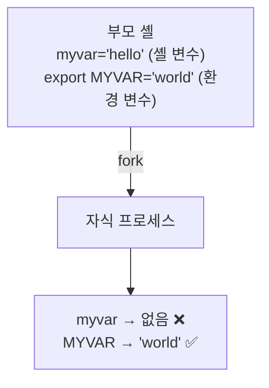
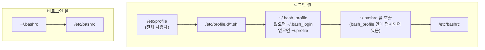
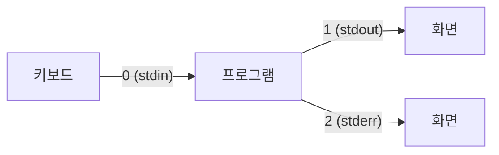

## 010. 셸의 이해와 환경 설정

### 1. 환경 변수와 셸 변수

셸에는 두 종류의 변수가 있습니다. **차이를 정확히 아는 것이 핵심**입니다.

| 구분 | **셸 변수 (Local)** | **환경 변수 (Environment)** |
| --- | --- | --- |
| 범위 | **현재 셸에서만** 유효 | **자식 프로세스에도 상속** |
| 선언 | `VAR=value` | **`export VAR=value`** |
| 확인 | `set` | **`env`**, `printenv` |
| 관례 | 소문자 사용 | **대문자** 사용 |



#### 직접 확인해 보기

```bash
$ myvar="hello"           # 셸 변수
$ export MYVAR="world"    # 환경 변수

$ echo $myvar $MYVAR
hello world               # 현재 셸에서는 둘 다 보임

$ bash                    # 자식 셸 실행
$ echo "[$myvar] [$MYVAR]"
[] [world]                # ❗셸 변수는 상속되지 않음
$ exit
```

> **왜 이런 구분이 필요할까?**  
> 셸에서 임시로 쓰는 변수까지 모든 자식 프로세스에 넘기면 **환경이 지저분해지고 메모리도 낭비**됩니다.  
> 자식이 알아야 할 것(`PATH`, `LANG` 등)만 `export`로 명시적으로 넘깁니다.

---

### 2. 주요 환경 변수

| 변수 | 의미 |
| --- | --- |
| **`PATH`** | **실행 파일을 찾을 디렉터리 목록** (콜론으로 구분) |
| **`HOME`** | 사용자의 홈 디렉터리 |
| **`SHELL`** | 로그인 셸 경로 |
| **`USER` / `LOGNAME`** | 로그인한 사용자 이름 |
| **`PWD`** | 현재 작업 디렉터리 |
| `OLDPWD` | 직전 작업 디렉터리 (`cd -` 로 이동) |
| **`PS1`** | **기본 프롬프트 문자열** |
| `PS2` | 명령이 이어질 때의 프롬프트 (기본 `>`) |
| **`HOSTNAME`** | 호스트 이름 |
| **`LANG`** | 언어·문자셋 설정 |
| **`TERM`** | 터미널 종류 (`xterm-256color`) |
| **`HISTSIZE`** | **메모리에 저장할 히스토리 개수** |
| **`HISTFILE`** | 히스토리 파일 경로 (`~/.bash_history`) |
| `HISTFILESIZE` | **파일에 저장할** 히스토리 개수 |
| **`UID` / `EUID`** | 사용자 ID / 유효 사용자 ID |
| `EDITOR` | 기본 편집기 |
| `TMOUT` | **자동 로그아웃 시간(초)** — 보안 설정에 사용 |

```bash
# 환경 변수 전체 보기
$ env | sort | head -8
HOME=/home/masterway
LANG=ko_KR.UTF-8
PATH=/usr/local/bin:/usr/bin:/usr/local/sbin:/usr/sbin
PWD=/home/masterway
SHELL=/bin/bash
TERM=xterm-256color
USER=masterway

# 셸 변수까지 전부 보기
$ set | head -5

# 특정 변수만
$ printenv PATH
$ echo $PATH
```

#### PATH 다루기 (자주 실수하는 부분)

```bash
# ❌ 잘못된 예 — 기존 PATH를 날려버림
$ export PATH=/opt/myapp/bin
$ ls
-bash: ls: command not found     # 기본 명령어를 못 찾게 됨 ❗

# ✅ 올바른 예 — 기존 PATH에 추가
$ export PATH=$PATH:/opt/myapp/bin      # 뒤에 추가 (기존 우선)
$ export PATH=/opt/myapp/bin:$PATH      # 앞에 추가 (새 경로 우선)
```

> **PATH는 앞에서부터 순서대로 탐색**합니다.  
> 같은 이름의 명령이 여러 곳에 있으면 **먼저 나오는 것이 실행**됩니다.

---

### 3. 셸 초기화 파일 — 언제 무엇이 읽히는가

**시험에서 가장 많이 나오는 부분**이며, 실무에서도 "설정이 왜 적용 안 되지?"의 원인이 됩니다.

#### 로그인 셸 vs 비로그인 셸

| 구분 | 언제 발생하나 |
| --- | --- |
| **로그인 셸 (Login Shell)** | 콘솔 로그인, **SSH 접속**, `su -`, `bash --login` |
| **비로그인 셸 (Non-login Shell)** | GUI에서 터미널 창 열기, `bash` 실행, 스크립트 실행 |



| 파일 | 적용 범위 | 읽히는 시점 |
| --- | --- | --- |
| **`/etc/profile`** | **전체 사용자** | **로그인 셸만** |
| `/etc/profile.d/*.sh` | 전체 사용자 | 로그인 셸 (profile이 호출) |
| **`~/.bash_profile`** | **개인** | **로그인 셸만** |
| `~/.bash_login`, `~/.profile` | 개인 | `.bash_profile`이 없을 때 대체 |
| **`~/.bashrc`** | **개인** | **비로그인 셸** (+ 로그인 셸에서도 간접 호출) |
| **`/etc/bashrc`** (Debian: `/etc/bash.bashrc`) | 전체 사용자 | `.bashrc`가 호출 |
| **`~/.bash_logout`** | 개인 | **로그아웃 시** |

#### 어디에 무엇을 써야 할까? (실무 기준)

| 설정할 것 | 파일 |
| --- | --- |
| **환경 변수** (`PATH`, `JAVA_HOME`) | **`~/.bash_profile`** (로그인 시 한 번만 필요) |
| **별칭(alias), 함수, 프롬프트** | **`~/.bashrc`** (셸을 열 때마다 필요) |
| 전체 사용자 공통 환경 변수 | `/etc/profile.d/` 아래에 `.sh` 파일 추가 |

> **왜 alias는 `.bashrc`에 써야 할까?**  
> alias는 **환경 변수가 아니라 셸 기능**이라 자식 프로세스에 상속되지 않습니다.  
> 새 셸을 열 때마다 다시 정의해야 하므로, **셸을 열 때마다 읽히는 `.bashrc`** 에 넣습니다.

#### 실무 팁 — 대부분의 배포판은 이렇게 연결되어 있습니다

```bash
$ cat ~/.bash_profile
# .bash_profile
if [ -f ~/.bashrc ]; then
    . ~/.bashrc              # ← 로그인 셸에서도 .bashrc를 읽도록 연결
fi
PATH=$PATH:$HOME/.local/bin:$HOME/bin
export PATH
```

이 연결 덕분에 **`.bashrc`에만 써도 대부분 잘 동작**합니다.

#### 수정 후 즉시 반영하기

```bash
# 다시 로그인하지 않고 적용
$ source ~/.bashrc
$ . ~/.bashrc                # source의 축약형 (점 하나)
```

> **`source`(`.`)와 그냥 실행의 차이**  
> `bash ~/.bashrc` 로 실행하면 **자식 셸에서 실행되고 끝나므로 현재 셸에 반영되지 않습니다.**  
> `source`는 **현재 셸에서 직접 읽어** 실행하므로 변수와 alias가 그대로 남습니다.

---

### 4. 별칭 (alias)

```bash
# 정의
$ alias ll='ls -alF'
$ alias rm='rm -i'           # 삭제 시 확인 (안전장치)
$ alias ..='cd ..'

# 확인
$ alias                      # 전체 목록
$ alias ll                   # 특정 별칭

# 해제
$ unalias ll
$ unalias -a                 # 전부 해제

# 별칭을 무시하고 원본 실행
$ \rm file.txt               # 앞에 역슬래시
$ command rm file.txt
$ /bin/rm file.txt           # 전체 경로
```

> **영구 적용하려면 `~/.bashrc`에 추가**해야 합니다. 터미널에서 정의한 alias는 창을 닫으면 사라집니다.

---

### 5. 프롬프트 설정 (PS1)

```bash
$ echo $PS1
[\u@\h \W]\$

# 결과: [masterway@server01 ~]$
```

| 이스케이프 | 의미 |
| --- | --- |
| **`\u`** | 사용자 이름 |
| **`\h`** | 호스트명 (첫 점까지) |
| `\H` | 전체 호스트명 |
| **`\w`** | **전체 경로** (`/home/user/docs`) |
| **`\W`** | **현재 디렉터리 이름만** (`docs`) |
| `\d` | 날짜 |
| `\t` | 시간 (24시간) |
| **`\$`** | **일반 사용자는 `$`, root는 `#`** |
| `\n` | 줄 바꿈 |
| `\!` | 히스토리 번호 |

```bash
# 색상 넣기 (초록색 사용자명)
$ export PS1='\[\e[32m\]\u@\h\[\e[0m\]:\[\e[34m\]\w\[\e[0m\]\$ '
```

> **`\$` 기호가 중요한 이유**  
> 프롬프트 끝이 **`#`이면 root**, **`$`이면 일반 사용자**입니다.  
> 실무에서 실수를 막는 가장 기본적인 시각적 안전장치입니다.

---

### 6. 히스토리 (History)

```bash
# 히스토리 보기
$ history
$ history 10                 # 최근 10개

# 재실행
$ !!                         # 직전 명령
$ !123                       # 123번 명령
$ !ls                        # ls로 시작하는 가장 최근 명령
$ !$                         # 직전 명령의 마지막 인자
$ !^                         # 직전 명령의 첫 인자

# 검색 (매우 유용)
Ctrl + R                     # 역방향 검색 시작 → 키워드 입력

# 삭제
$ history -d 123             # 특정 항목
$ history -c                 # 전부 삭제 (메모리)
$ > ~/.bash_history          # 파일까지 비우기
```

**활용 예 — `!$` 는 실무에서 정말 자주 씁니다.**

```bash
$ mkdir -p /opt/app/config
$ cd !$
cd /opt/app/config           # 방금 만든 경로로 바로 이동
```

**히스토리 관련 환경 변수**

| 변수 | 의미 |
| --- | --- |
| `HISTSIZE` | 메모리에 유지할 개수 |
| `HISTFILESIZE` | 파일에 저장할 개수 |
| `HISTFILE` | 저장 파일 경로 |
| `HISTCONTROL` | `ignoredups`(중복 제외), `ignorespace`(공백으로 시작하면 기록 안 함) |
| `HISTTIMEFORMAT` | 시각 표시 형식 |

```bash
# 보안: 비밀번호가 포함된 명령은 기록되지 않게
$ export HISTCONTROL=ignorespace
$  mysql -u root -pSecret123      # 앞에 공백 → 히스토리에 남지 않음

# 히스토리에 시각 표시
$ export HISTTIMEFORMAT="%F %T "
$ history | tail -2
 1023  2026-01-26 21:15:03 ls -l
 1024  2026-01-26 21:15:10 history | tail -2
```

---

### 7. 리다이렉션과 파이프

#### 표준 입출력 3종

| 이름 | 파일 디스크립터 | 기본 대상 |
| --- | --- | --- |
| **표준 입력 (stdin)** | **0** | 키보드 |
| **표준 출력 (stdout)** | **1** | 화면 |
| **표준 오류 (stderr)** | **2** | 화면 |



#### 리다이렉션 기호

| 기호 | 의미 |
| --- | --- |
| **`>`** | 표준 출력을 파일로 (**덮어쓰기**) |
| **`>>`** | 표준 출력을 파일로 (**추가**) |
| **`<`** | 파일을 표준 입력으로 |
| **`2>`** | **표준 오류**를 파일로 |
| **`2>>`** | 표준 오류를 파일로 추가 |
| **`&>`** 또는 **`> file 2>&1`** | **표준 출력 + 표준 오류를 함께** |
| `<<` | 히어 도큐먼트 |

```bash
# 출력만 저장 (에러는 화면에 남음)
$ ls /etc /없는경로 > out.txt
ls: cannot access '/없는경로': No such file or directory

# 에러만 버리기 (실무에서 매우 자주 사용)
$ find / -name "*.conf" 2>/dev/null

# 출력과 에러를 모두 파일로
$ ./script.sh > log.txt 2>&1
$ ./script.sh &> log.txt              # 위와 동일 (bash)

# 출력과 에러를 각각 다른 파일로
$ ./script.sh > out.txt 2> err.txt

# 전부 버리기
$ ./script.sh > /dev/null 2>&1
```

> **`2>&1`의 순서가 중요합니다**  
> `> log.txt 2>&1` → ✅ stdout을 파일로 보낸 뒤, stderr를 **그 파일로** 보냄  
> `2>&1 > log.txt` → ❌ stderr를 **화면(당시 stdout)** 으로 보낸 뒤, stdout만 파일로 감

#### 파이프와 tee

```bash
# 파이프 — 앞 명령의 출력을 뒤 명령의 입력으로
$ ps aux | grep nginx | wc -l

# tee — 화면에 보여주면서 동시에 파일로 저장
$ ls -l | tee list.txt
$ ls -l | tee -a list.txt         # 추가 모드

# 권한이 필요한 파일에 쓸 때 (sudo와 리다이렉션 조합 문제 해결)
$ echo "text" | sudo tee /etc/config.conf
# ❌ sudo echo "text" > /etc/config.conf  ← 리다이렉션은 sudo 권한이 아님
```

> **자주 겪는 함정**  
> `sudo echo "x" > /etc/file` 은 **실패**합니다.  
> `echo`는 sudo로 실행되지만, **리다이렉션(`>`)은 현재 셸이 처리**하기 때문입니다.  
> 이때 **`| sudo tee`** 를 씁니다.

---

### 8. 명령어 연결과 치환

| 기호 | 의미 |
| --- | --- |
| **`;`** | 앞 명령 결과와 **무관하게** 순차 실행 |
| **`&&`** | 앞 명령이 **성공(종료코드 0)** 하면 실행 |
| **`\|\|`** | 앞 명령이 **실패**하면 실행 |
| **`&`** | 백그라운드 실행 |
| `$( )` 또는 `` ` ` `` | **명령 치환** (명령 결과를 문자열로) |

```bash
$ mkdir /tmp/test && cd /tmp/test        # 성공해야 이동
$ ping -c1 8.8.8.8 || echo "네트워크 오류"  # 실패하면 메시지

# 명령 치환
$ echo "오늘은 $(date +%Y-%m-%d) 입니다"
오늘은 2026-01-26 입니다

$ files=$(ls | wc -l)
$ echo "파일 개수: $files"
```

#### 따옴표 3종 (시험 출제)

| 종류 | 변수 확장 | 명령 치환 |
| --- | --- | --- |
| **큰따옴표 `" "`** | **됨** ✅ | **됨** ✅ |
| **작은따옴표 `' '`** | **안 됨** ❌ | **안 됨** ❌ |
| **역따옴표 `` ` ` ``** | — | **명령 치환용** |

```bash
$ name="Linux"
$ echo "Hello $name"      → Hello Linux
$ echo 'Hello $name'      → Hello $name      ← 그대로 출력
```

---

### 9. 메타 문자 (와일드카드)

| 문자 | 의미 | 예 |
| --- | --- | --- |
| **`*`** | **0개 이상**의 모든 문자 | `*.log` → 모든 로그 파일 |
| **`?`** | **정확히 한 글자** | `file?.txt` → file1.txt, fileA.txt |
| **`[ ]`** | 괄호 안의 **한 글자** | `file[123].txt` |
| `[!...]` / `[^...]` | 괄호 안을 **제외한** 한 글자 | `file[!0-9].txt` |
| `{ }` | **문자열 목록 확장** | `file{1,2,3}.txt` |
| `~` | 홈 디렉터리 | `~/docs` |

```bash
$ ls *.log                    # 모든 .log 파일
$ ls report?.txt              # report1.txt, reportA.txt (report10.txt ❌)
$ ls log[0-9].txt             # log0.txt ~ log9.txt
$ cp file.txt{,.bak}          # file.txt → file.txt.bak 로 복사 (편리한 관용구)
$ mkdir -p project/{src,test,docs}   # 세 디렉터리 한 번에 생성
```

> **`*` 와 `?` 의 차이는 시험 단골입니다.**  
> `?`는 **반드시 한 글자**가 있어야 합니다. `file?.txt`는 `file.txt`와 매칭되지 않습니다.

---

### 시험 포인트 정리

| 항목 | 핵심 |
| --- | --- |
| 셸 변수 vs 환경 변수 | **`export` 해야 자식에게 상속** |
| 환경 변수 확인 | **`env`**, `printenv` / 전체는 `set` |
| 로그인 셸 파일 | **`/etc/profile` → `~/.bash_profile`** |
| 비로그인 셸 파일 | **`~/.bashrc` → `/etc/bashrc`** |
| alias는 어디에? | **`~/.bashrc`** (상속되지 않으므로) |
| 설정 즉시 반영 | **`source`** 또는 **`.`** |
| 표준 입출력 번호 | **stdin=0, stdout=1, stderr=2** |
| 에러만 버리기 | **`2>/dev/null`** |
| 출력+에러 함께 | **`> file 2>&1`** (순서 주의) |
| sudo + 리다이렉션 | **`\| sudo tee`** 사용 |
| `&&` vs `\|\|` | 성공 시 / 실패 시 |
| 따옴표 | **작은따옴표는 변수 확장 안 함** |
| 와일드카드 | **`*`=0개 이상, `?`=정확히 1개** |
| 자동 로그아웃 | **`TMOUT`** |

---

### 한 줄 정리

셸 변수는 **`export`를 해야 환경 변수가 되어 자식에게 상속**되고,  
**로그인 셸은 `/etc/profile`·`~/.bash_profile`, 비로그인 셸은 `~/.bashrc`** 를 읽으므로  
**환경 변수는 `.bash_profile`, alias는 `.bashrc`** 에 작성하며,  
리다이렉션은 **stdout=1, stderr=2** 를 기억하면 `2>/dev/null` 과 `> file 2>&1` 이 자연스럽게 이해됩니다.
