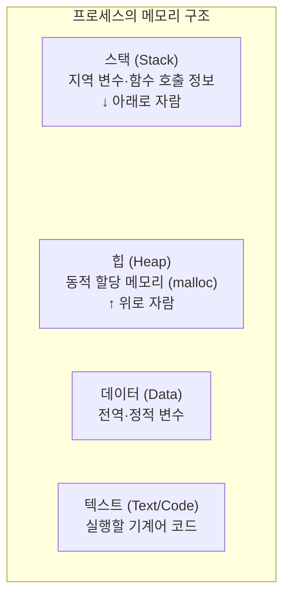
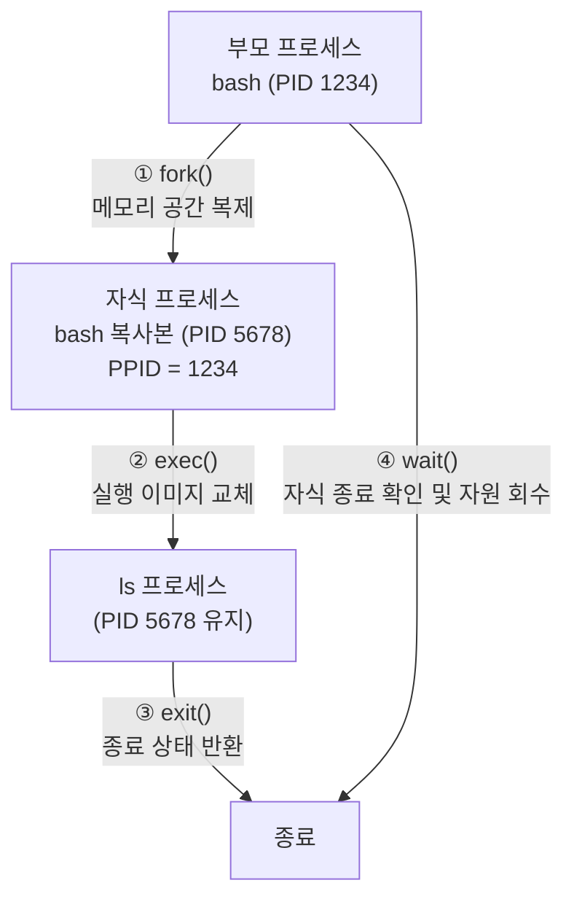
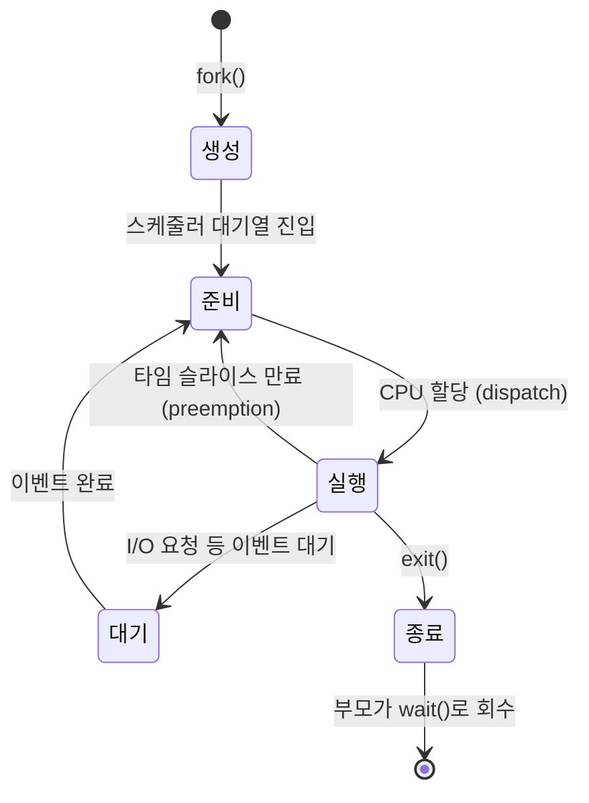
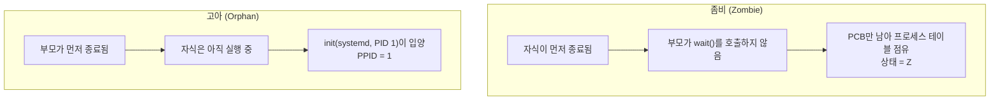
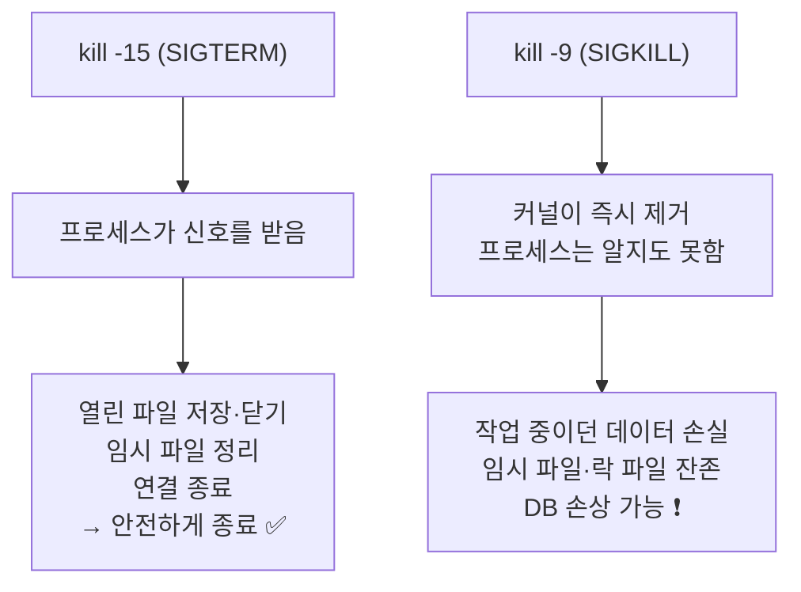
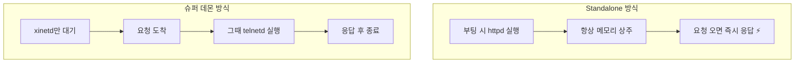

## 011. 프로세스의 이해

### 1. 프로그램과 프로세스

| 구분 | 프로그램 (Program) | 프로세스 (Process) |
| --- | --- | --- |
| 상태 | **디스크에 저장된 정적인 파일** | **메모리에 올라가 실행 중인 동적인 개체** |
| 예 | `/usr/bin/vi` | `vi` 를 실행한 결과 (PID 1234) |
| 개수 | 하나 | 같은 프로그램으로 **여러 개** 생성 가능 |

> 요리에 비유하면 **프로그램은 레시피**, **프로세스는 실제로 요리하는 과정**입니다.  
> 같은 레시피로 여러 사람이 동시에 요리할 수 있듯, 하나의 프로그램에서 여러 프로세스가 만들어집니다.

---

### 2. 프로세스의 구조

각 프로세스는 **독립된 메모리 공간**을 가집니다.



| 영역 | 담기는 것 |
| --- | --- |
| **텍스트(코드)** | 실행할 기계어. **읽기 전용** |
| **데이터** | 전역 변수, 정적 변수 |
| **힙** | 실행 중 동적으로 할당하는 메모리 |
| **스택** | 지역 변수, 함수 호출 정보(반환 주소) |

#### 프로세스 제어 블록 (PCB)

커널은 프로세스마다 **PCB(Process Control Block)** 라는 자료 구조를 만들어 다음을 기록합니다.

- PID, PPID (부모 PID)
- 프로세스 상태
- 프로그램 카운터(다음에 실행할 명령의 위치)
- 레지스터 값
- 메모리 할당 정보
- 열어 둔 파일 목록
- 소유자 UID/GID

> **문맥 교환(Context Switch)** 이 가능한 이유가 바로 PCB입니다.  
> CPU를 다른 프로세스에 넘길 때 **현재 상태를 PCB에 저장**해 두었다가, 나중에 그대로 복원하면 됩니다.

---

### 3. 프로세스의 생성 — fork와 exec



| 시스템 호출 | 역할 |
| --- | --- |
| **`fork()`** | 부모를 **그대로 복제**하여 자식 프로세스 생성. **PID만 다릅니다.** |
| **`exec()`** | 현재 프로세스의 **내용을 다른 프로그램으로 교체**. **PID는 그대로**입니다. |
| **`wait()`** | 부모가 자식의 종료를 기다리고 **자원을 회수**합니다. |
| **`exit()`** | 프로세스를 종료하고 **종료 상태를 부모에게** 전달합니다. |

#### fork와 exec의 차이 (시험 단골)

| | `fork` | `exec` |
| --- | --- | --- |
| 새 프로세스 생성 | **예** (PID 새로 부여) | **아니오** (기존 PID 유지) |
| 결과 | 부모와 자식 **2개** | 프로세스 **1개** (내용만 교체) |
| 부모 프로세스 | 그대로 유지 | **사라짐** (덮어써짐) |

```bash
# fork 방식 — 새 프로세스가 생기고 bash는 유지됨
$ ls
$ echo $$          # 셸의 PID는 그대로

# exec 방식 — 현재 셸이 ls로 교체되고, ls가 끝나면 터미널도 종료됨
$ exec ls          # ❗주의: 실행 후 셸이 사라집니다
```

---

### 4. 프로세스의 상태



| 상태 | `ps` 표시 | 의미 |
| --- | --- | --- |
| **실행 중 / 실행 대기** | **`R`** (Running/Runnable) | CPU를 쓰고 있거나 쓸 준비가 됨 |
| **대기 (인터럽트 가능)** | **`S`** (Sleeping) | I/O 등 이벤트를 기다림. **시그널로 깨울 수 있음** |
| **대기 (인터럽트 불가)** | **`D`** (Uninterruptible) | 주로 디스크 I/O 중. **`kill`로도 안 죽음** ❗ |
| **중지** | **`T`** (Stopped) | `Ctrl+Z` 등으로 일시 정지 |
| **좀비** | **`Z`** (Zombie) | 종료됐지만 **부모가 회수하지 않음** |

```bash
$ ps aux | head -3
USER  PID %CPU %MEM    VSZ   RSS TTY  STAT START   TIME COMMAND
root    1  0.0  0.3 172400 13624 ?    Ss   09:00   0:03 /usr/lib/systemd/systemd
root  856  0.0  0.1  91100  6520 ?    Ss   09:00   0:00 /usr/sbin/sshd -D
```

**STAT 열의 추가 기호**

| 기호 | 의미 |
| --- | --- |
| `s` | 세션 리더 |
| `l` | 멀티스레드 |
| `+` | **포그라운드 프로세스 그룹** |
| `<` | 높은 우선순위 (nice < 0) |
| `N` | 낮은 우선순위 (nice > 0) |

---

### 5. 좀비 프로세스와 고아 프로세스

**면접과 시험 모두에서 자주 나오는 개념**입니다.



| 구분 | **좀비 프로세스** | **고아 프로세스** |
| --- | --- | --- |
| 상황 | **자식이 먼저 죽음** + 부모가 회수 안 함 | **부모가 먼저 죽음** |
| 상태 | `Z` (defunct) | 정상 실행 |
| 문제 | **프로세스 테이블(PID) 고갈** 가능 | 문제 없음 |
| 해결 | **부모 프로세스를 종료** → init이 대신 회수 | 자동 해결 (init이 입양) |

> **핵심** : 좀비는 이미 죽은 프로세스라 **`kill`로 죽일 수 없습니다.**  
> 이미 시체이기 때문입니다. **부모를 죽여야** init(PID 1)이 회수해 갑니다.

```bash
# 좀비 프로세스 찾기
$ ps aux | grep 'Z'
$ ps -eo pid,ppid,stat,comm | awk '$3 ~ /^Z/'
  PID  PPID STAT COMMAND
 5678  1234 Z    myapp <defunct>

# 부모(PPID 1234)를 종료하면 좀비가 정리됩니다
$ kill -9 1234
```

---

### 6. 프로세스 확인 명령어

#### `ps` — 스냅샷 방식

**옵션 스타일이 두 가지**라 헷갈립니다. 둘 다 알아 두어야 합니다.

| 스타일 | 대표 조합 | 의미 |
| --- | --- | --- |
| **BSD** (하이픈 없음) | **`ps aux`** | 모든 사용자의 모든 프로세스 |
| **System V** (하이픈 있음) | **`ps -ef`** | 모든 프로세스를 전체 형식으로 |

```bash
$ ps aux
USER  PID %CPU %MEM    VSZ   RSS TTY STAT START TIME COMMAND
      │                 │     │
      │                 │     └── RSS: 실제 물리 메모리 사용량(KB)
      │                 └──────── VSZ: 가상 메모리 크기(KB)
      └────────────────────────── 프로세스 ID

$ ps -ef
UID    PID  PPID  C STIME TTY  TIME     CMD
root     1     0  0 09:00 ?    00:00:03 /usr/lib/systemd/systemd
              └── 부모 PID (ps -ef 에서 확인 가능)
```

| 옵션 | 의미 |
| --- | --- |
| `a` | 다른 사용자의 프로세스도 포함 |
| `u` | 사용자 중심 형식 (CPU·메모리 표시) |
| `x` | 터미널이 없는 프로세스도 포함 (데몬) |
| `-e` | 모든 프로세스 |
| `-f` | 전체 형식 (**PPID 포함**) |
| `-l` | 긴 형식 (**우선순위 PRI, NI 표시**) |
| `-u 사용자` | 특정 사용자 |
| `-C 이름` | 특정 명령어 이름 |
| `--forest` / `-H` | 트리 형태 |

```bash
# 자주 쓰는 조합
$ ps -ef | grep nginx                          # 특정 프로세스 찾기
$ ps -eo pid,ppid,ni,pri,stat,%cpu,%mem,comm   # 원하는 열만 지정
$ ps aux --sort=-%mem | head -6                # 메모리 사용 상위 5개
$ ps aux --sort=-%cpu | head -6                # CPU 사용 상위 5개
$ ps -ef --forest | head -20                   # 부모-자식 관계 트리
```

#### `pstree` — 계층 구조

```bash
$ pstree -p | head -8
systemd(1)─┬─NetworkManager(892)─┬─{NetworkManager}(895)
           ├─sshd(1105)───sshd(2341)───bash(2345)───pstree(2890)
           └─systemd-journal(543)
```

> 모든 프로세스가 **PID 1(systemd)의 자손**임을 한눈에 확인할 수 있습니다.

#### `top` / `htop` — 실시간 모니터링

```bash
$ top
top - 21:30:15 up 2 days,  3:14,  2 users,  load average: 0.15, 0.10, 0.05
Tasks: 215 total,   1 running, 214 sleeping,   0 stopped,   0 zombie
%Cpu(s):  2.3 us,  1.0 sy,  0.0 ni, 96.5 id,  0.2 wa,  0.0 hi,  0.0 si
MiB Mem :  15884.5 total,   7891.2 free,   3245.1 used,   4748.2 buff/cache
```

**top 화면 읽는 법**

| 항목 | 의미 |
| --- | --- |
| **load average** | 1분·5분·15분 평균 부하. **CPU 코어 수보다 크면 과부하** |
| `us` | 사용자 프로세스 CPU 사용률 |
| `sy` | 커널(시스템) CPU 사용률 |
| `id` | **유휴(idle)** — 클수록 여유로움 |
| **`wa`** | **I/O 대기** — 높으면 **디스크가 병목** |
| `st` | 가상화 환경에서 뺏긴 시간 |

**top 실행 중 단축키**

| 키 | 기능 |
| --- | --- |
| **`P`** | **CPU 사용률순 정렬** |
| **`M`** | **메모리 사용률순 정렬** |
| `T` | 실행 시간순 정렬 |
| **`k`** | **프로세스 종료(kill)** |
| **`r`** | **우선순위 변경(renice)** |
| `u` | 특정 사용자만 표시 |
| `1` | CPU 코어별로 표시 |
| `c` | 전체 명령줄 표시 |
| `h` | 도움말 |
| **`q`** | **종료** |

```bash
$ top -d 2          # 2초마다 갱신
$ top -u nginx      # 특정 사용자만
$ top -b -n 1       # 배치 모드 1회 (스크립트용)
```

---

### 7. 프로세스 종료 — 시그널과 kill

**시그널(Signal)** 은 프로세스에게 보내는 **비동기 알림**입니다.

#### 주요 시그널 (번호까지 암기 필요)

| 번호 | 이름 | 의미 | 무시 가능? |
| --- | --- | --- | --- |
| **1** | **SIGHUP** | 터미널 연결 끊김. **데몬은 설정 재읽기** 용도로 활용 | 가능 |
| **2** | **SIGINT** | 인터럽트 (**`Ctrl + C`**) | 가능 |
| **3** | **SIGQUIT** | 종료 + 코어 덤프 (`Ctrl + \`) | 가능 |
| **9** | **SIGKILL** | **강제 종료** | **불가능** ❗ |
| **15** | **SIGTERM** | **정상 종료 요청 (기본값)** | 가능 |
| **18** | SIGCONT | 중지된 프로세스 재개 | 가능 |
| **19** | SIGSTOP | **강제 중지** | **불가능** ❗ |
| **20** | SIGTSTP | 중지 (**`Ctrl + Z`**) | 가능 |

```bash
# 시그널 목록
$ kill -l
 1) SIGHUP   2) SIGINT   3) SIGQUIT  4) SIGILL   5) SIGTRAP
 6) SIGABRT  7) SIGBUS   8) SIGFPE   9) SIGKILL 10) SIGUSR1
```

#### kill 사용법

```bash
# 기본은 SIGTERM(15) — 정상 종료 요청
$ kill 1234
$ kill -15 1234
$ kill -TERM 1234

# 강제 종료 (최후의 수단)
$ kill -9 1234
$ kill -KILL 1234

# 설정 파일 다시 읽기 (재시작 없이)
$ kill -HUP 1234
$ kill -1 1234

# 이름으로 종료
$ pkill nginx                  # 이름이 일치하는 프로세스
$ pkill -u masterway           # 특정 사용자의 프로세스 전부
$ killall httpd                # 같은 이름 전부
$ killall -9 httpd

# PID 찾기
$ pgrep nginx
$ pgrep -u root sshd
$ pidof nginx
```

#### 왜 `kill -9`를 함부로 쓰면 안 될까? (중요)



**`SIGKILL(9)`은 프로세스가 받지도 못합니다.** 커널이 곧바로 제거해 버립니다.  
따라서 **정리 작업을 할 기회가 전혀 없습니다.**

**올바른 순서**

```bash
$ kill 1234           # ① 먼저 정상 종료 시도
(몇 초 대기)
$ kill 1234           # ② 한 번 더
(그래도 안 되면)
$ kill -9 1234        # ③ 최후의 수단
```

> **`D` 상태(Uninterruptible Sleep)의 프로세스는 `kill -9`로도 죽지 않습니다.**  
> 디스크 I/O가 끝나기를 기다리는 중이라 시그널 자체를 처리할 수 없기 때문입니다.  
> 이 경우 대개 **디스크나 NFS에 문제**가 있는 것이므로 원인을 봐야 합니다.

---

### 8. 프로세스 우선순위 — nice와 renice

리눅스는 **nice 값**으로 프로세스의 우선순위를 조절합니다.

```
NI 값 범위 :  -20  ←────────────→  +19
             (높은 우선순위)      (낮은 우선순위)
```

| 항목 | 설명 |
| --- | --- |
| **범위** | **-20 ~ 19** |
| **기본값** | **0** |
| **값이 작을수록** | **우선순위 높음** (CPU를 더 많이 받음) |
| **음수 지정** | **root만 가능** ❗ |
| 일반 사용자 | 자기 프로세스의 nice 값을 **올리기만** 가능 (양보만 됨) |

> **이름의 유래** : "nice(친절한)" — 값이 **클수록 다른 프로세스에게 양보하는 착한 프로세스**입니다.  
> 그래서 값이 클수록 우선순위가 **낮습니다.** 직관과 반대라 시험에 자주 나옵니다.

```bash
# 실행할 때 우선순위 지정
$ nice -n 10 ./backup.sh          # 낮은 우선순위로 실행
$ sudo nice -n -5 ./critical.sh   # 높은 우선순위 (root 필요)
$ nice ./script.sh                # -n 생략 시 기본 +10

# 실행 중인 프로세스의 우선순위 변경
$ renice -n 5 -p 1234             # PID 1234
$ sudo renice -n -10 -p 1234      # 우선순위 높이기 (root)
$ renice -n 5 -u masterway        # 특정 사용자의 모든 프로세스
$ renice -n 5 -g developers       # 특정 그룹

# 확인
$ ps -eo pid,ni,pri,comm | head -5
  PID  NI PRI COMMAND
    1   0  19 systemd
 1234  10   9 backup.sh
```

> **PRI와 NI의 관계** : `PRI(실제 우선순위) = 기본값 + NI`  
> `ps -l` 이나 `ps -eo pri,ni` 로 함께 확인할 수 있습니다.

---

### 9. 포그라운드와 백그라운드 (잡 컨트롤)

```bash
# 백그라운드 실행
$ ./long_task.sh &
[1] 5678
 │    └── PID
 └── 작업(job) 번호

# 작업 목록
$ jobs
[1]+  Running    ./long_task.sh &
[2]-  Stopped    vi report.txt

# 전환
$ fg %1            # 1번 작업을 포그라운드로
$ bg %2            # 2번 작업을 백그라운드에서 재개
$ fg               # 가장 최근 작업

# 포그라운드 작업 제어
Ctrl + Z           # 일시 중지 (SIGTSTP) → 백그라운드 Stopped 상태
Ctrl + C           # 종료 (SIGINT)
```

| 기호 | 의미 |
| --- | --- |
| `%1` | 1번 작업 |
| `%+` 또는 `%%` | 가장 최근 작업 |
| `%-` | 그 이전 작업 |

#### 로그아웃해도 계속 실행되게 하려면

터미널을 닫으면 **SIGHUP**이 전달되어 자식 프로세스들이 종료됩니다.

```bash
# ① nohup — SIGHUP 무시
$ nohup ./long_task.sh &
nohup: ignoring input and appending output to 'nohup.out'

# ② disown — 이미 실행 중인 작업을 잡 목록에서 분리
$ ./long_task.sh &
$ disown -h %1

# ③ setsid — 새 세션으로 분리
$ setsid ./long_task.sh

# ④ tmux / screen — 세션을 유지 (실무에서 가장 권장)
$ tmux new -s work
(작업 수행)
Ctrl+B, D           # 분리(detach)
$ tmux attach -t work    # 나중에 다시 접속
```

> **실무 권장** : 장시간 작업은 **`tmux`나 `screen`** 을 쓰는 것이 가장 안전합니다.  
> 네트워크가 끊겨도 세션이 살아 있어 다시 붙을 수 있습니다.

---

### 10. 데몬 (Daemon)

**데몬**은 백그라운드에서 계속 실행되며 서비스를 제공하는 프로세스입니다.

- 이름이 보통 **`d`로 끝납니다** : `sshd`, `httpd`, `crond`, `systemd`
- 터미널과 분리되어 있어 `ps aux`에서 **TTY가 `?`** 로 표시됩니다.

#### 데몬의 실행 방식

| 방식 | 설명 | 장단점 |
| --- | --- | --- |
| **Standalone** | 부팅 시 **미리 실행**되어 항상 대기 | 응답 **빠름**, 메모리 상주 |
| **inetd / xinetd (슈퍼 데몬)** | 요청이 올 때 **그때 실행** | 메모리 절약, 응답 **느림** |



> **선택 기준**  
> 웹 서버(`httpd`)처럼 **요청이 잦은 서비스**는 Standalone,  
> 가끔 쓰는 서비스는 슈퍼 데몬 방식이 유리합니다.  
> 현재는 **systemd의 소켓 활성화(`.socket`)** 가 슈퍼 데몬 역할을 대체하고 있습니다.

---

### 시험 포인트 정리

| 항목 | 핵심 |
| --- | --- |
| 프로그램 vs 프로세스 | 디스크의 파일 / **메모리에서 실행 중** |
| `fork()` | 부모 **복제**, 새 PID |
| `exec()` | **내용 교체**, PID 유지 |
| PID 1 | **systemd** |
| 프로세스 상태 | R(실행), S(대기), **D(인터럽트 불가)**, T(중지), **Z(좀비)** |
| **좀비** | **자식이 먼저 죽고 부모가 회수 안 함** → 부모를 죽여야 정리 |
| **고아** | **부모가 먼저 죽음** → init이 입양 |
| `ps aux` / `ps -ef` | BSD 스타일 / **System V 스타일(PPID 포함)** |
| top 정렬 | **`P`=CPU, `M`=메모리** |
| top의 `wa` | **I/O 대기** — 높으면 디스크 병목 |
| SIGHUP | **1** — 설정 재읽기 |
| SIGINT | **2** — `Ctrl+C` |
| **SIGKILL** | **9** — 강제 종료, **무시 불가** |
| **SIGTERM** | **15** — **kill의 기본값** |
| SIGTSTP | **20** — `Ctrl+Z` |
| nice 범위 | **-20 ~ 19**, 기본 **0**, **작을수록 우선순위 높음** |
| 음수 nice | **root만 가능** |
| 로그아웃 후 유지 | **`nohup`**, `disown`, `tmux` |
| 데몬 실행 방식 | **Standalone**(상주) vs **슈퍼 데몬**(요청 시 실행) |

---

### 한 줄 정리

프로세스는 **`fork()`로 복제되고 `exec()`로 내용이 교체**되며,  
**좀비는 자식이 먼저 죽고 부모가 회수하지 않은 상태(부모를 종료해야 정리)**,  
**고아는 부모가 먼저 죽어 init이 입양한 상태**이고,  
종료는 **SIGTERM(15) → 안 되면 SIGKILL(9)** 순으로, 우선순위는 **nice 값이 작을수록 높습니다.**
