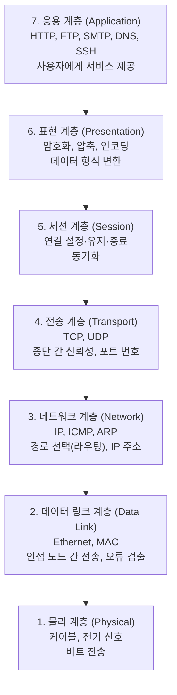
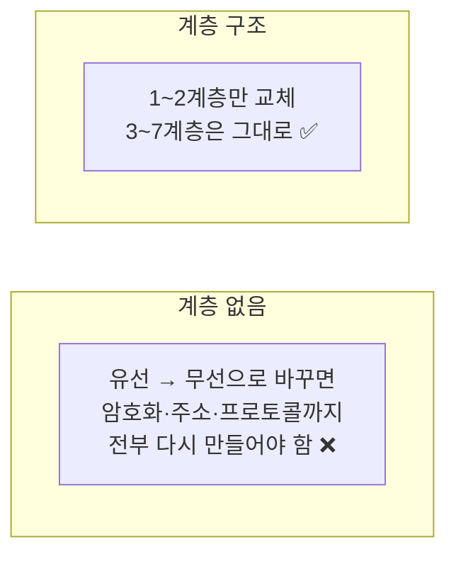
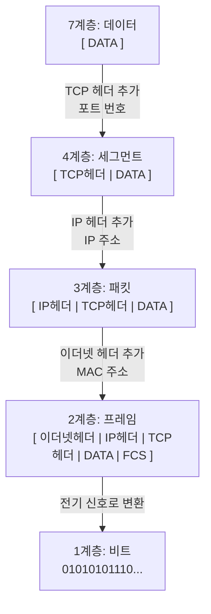
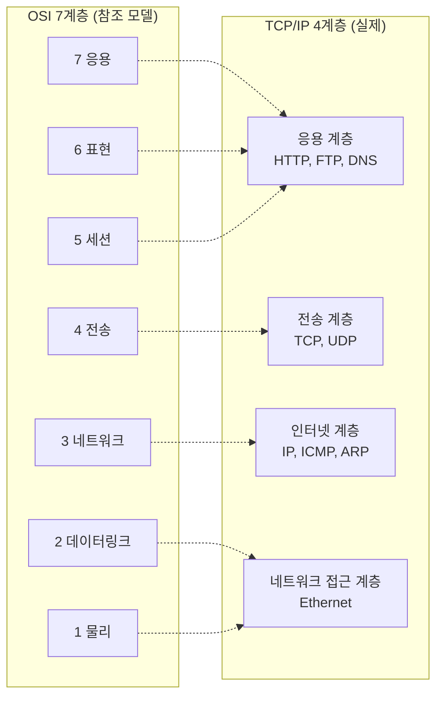
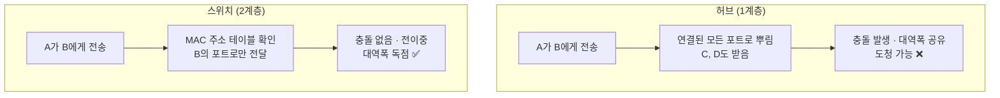
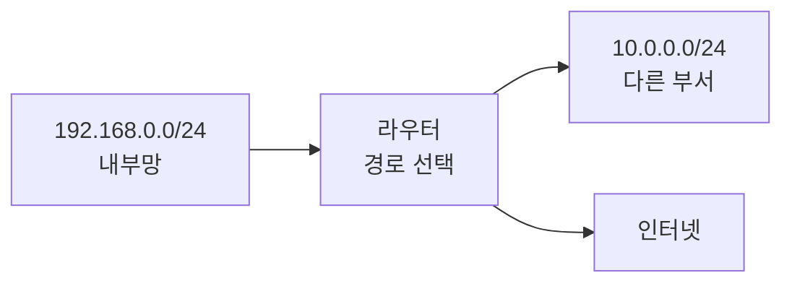
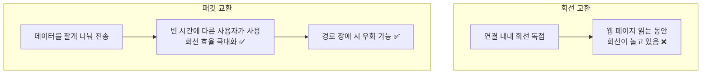

## 012. 네트워크 개요와 OSI 7계층

### 1. 네트워크란

네트워크는 **둘 이상의 컴퓨터를 연결하여 데이터와 자원을 주고받는 것**입니다.

리눅스 서버 관리자에게 네트워크는 선택이 아닙니다.  
웹 서버·DB 서버·메일 서버 모두 **네트워크 위에서만 의미가 있기** 때문입니다.

---

### 2. 네트워크의 분류

#### 규모에 따른 분류

| 구분 | 범위 | 특징 |
| --- | --- | --- |
| **LAN** (Local Area Network) | 건물·사무실 등 **좁은 지역** | 속도 **빠름**, 오류율 **낮음**, 직접 구축·관리 |
| **MAN** (Metropolitan Area Network) | 도시 규모 | LAN과 WAN의 중간 |
| **WAN** (Wide Area Network) | 국가·대륙 | 속도 상대적으로 느림, 통신사 회선 임대 |
| **VPN** (Virtual Private Network) | 공중망 위의 가상 전용망 | **암호화 터널**로 전용선처럼 사용 |

#### 통신 방식에 따른 분류

| 방식 | 설명 | 예 |
| --- | --- | --- |
| **단방향 (Simplex)** | 한쪽으로만 전송 | 라디오, TV 방송 |
| **반이중 (Half Duplex)** | 양방향 가능하지만 **동시에는 불가** | 무전기, 초기 이더넷 허브 |
| **전이중 (Full Duplex)** | **양방향 동시** 전송 | 전화, 현대 이더넷 스위치 |

> **허브와 스위치의 결정적 차이가 여기에 있습니다.**  
> 허브는 회선을 공유하므로 **반이중**이고 **충돌(Collision)** 이 발생합니다.  
> 스위치는 포트마다 독립 회선이라 **전이중**이고 충돌이 없습니다.

---

### 3. OSI 7계층 모델

**OSI(Open Systems Interconnection)** 는 ISO가 정의한 **네트워크 통신의 표준 참조 모델**입니다.

#### 계층별 상세

| 계층 | 이름 | 하는 일 | 데이터 단위 (PDU) | 대표 프로토콜 | 장비 |
| --- | --- | --- | --- | --- | --- |
| **7** | **응용** | 사용자에게 서비스 제공 | 데이터 | HTTP, FTP, SMTP, DNS, SSH | 게이트웨이 |
| **6** | **표현** | **암호화·압축·형식 변환** | 데이터 | SSL/TLS, JPEG, ASCII | |
| **5** | **세션** | **연결 설정·유지·종료** | 데이터 | NetBIOS, RPC | |
| **4** | **전송** | **종단 간 신뢰성, 포트 번호** | **세그먼트**(TCP) / 데이터그램(UDP) | **TCP, UDP** | L4 스위치 |
| **3** | **네트워크** | **경로 선택(라우팅), 논리 주소** | **패킷** | **IP**, ICMP, ARP, RARP | **라우터**, L3 스위치 |
| **2** | **데이터 링크** | 인접 노드 간 전송, **물리 주소(MAC)**, 오류 검출 | **프레임** | Ethernet, PPP, HDLC | **스위치**, 브리지 |
| **1** | **물리** | 전기·광 신호로 **비트** 전송 | **비트** | RS-232, 10BASE-T | **허브**, 리피터, 케이블 |

#### 암기법

**아래에서 위로** : **물 - 데 - 네 - 전 - 세 - 표 - 응**

> **PDU(데이터 단위) 암기법**  
> **비트(1) → 프레임(2) → 패킷(3) → 세그먼트(4) → 데이터(5~7)**

---

### 4. 왜 계층으로 나눌까?

네트워크 통신을 한 덩어리로 만들면, **작은 변경 하나가 전체를 무너뜨립니다.**

**계층화의 이점**

| 이점 | 설명 |
| --- | --- |
| **독립성** | 각 계층은 **바로 위·아래와의 약속만** 지키면 됩니다. |
| **교체 용이** | 유선 → 무선으로 바꿔도 상위 계층은 그대로입니다. |
| **문제 진단** | 장애가 **몇 계층 문제인지** 좁혀 나갈 수 있습니다. |
| **표준화** | 계층별로 여러 회사가 나누어 개발할 수 있습니다. |

> **실무 예시**  
> "인터넷이 안 돼요"라는 문의가 오면 아래에서 위로 확인합니다.  
> 케이블(1) → 링크 up(2) → IP·게이트웨이(3) → 포트·방화벽(4) → DNS·서비스(7)

---

### 5. 캡슐화와 역캡슐화

데이터가 계층을 내려갈 때마다 **헤더가 하나씩 붙습니다.** 이것이 **캡슐화(Encapsulation)** 입니다.

받는 쪽에서는 **반대로 헤더를 하나씩 벗겨냅니다(역캡슐화)**.

> **택배에 비유하면**  
> 물건(데이터)을 상자에 넣고(TCP), 주소 송장을 붙이고(IP), 트럭 배차표를 붙이는(이더넷) 것과 같습니다.  
> 받는 쪽은 배차표 → 송장 → 상자 순으로 벗겨내고 물건만 꺼냅니다.

---

### 6. OSI 7계층 vs TCP/IP 4계층

실제 인터넷은 OSI가 아니라 **TCP/IP 모델**로 동작합니다.  
OSI는 **이론적 참조 모델**, TCP/IP는 **실제 구현 모델**입니다.

| OSI 7계층 | TCP/IP 4계층 |
| --- | --- |
| 7 응용 / 6 표현 / 5 세션 | **응용 계층 (Application)** |
| 4 전송 | **전송 계층 (Transport)** |
| 3 네트워크 | **인터넷 계층 (Internet)** |
| 2 데이터링크 / 1 물리 | **네트워크 접근 계층 (Network Access)** |

> 일부 교재는 TCP/IP를 **5계층**(물리와 데이터링크를 분리)으로 설명하기도 합니다.  
> 시험에서는 **4계층 기준**으로 출제되는 경우가 많습니다.

---

### 7. 네트워크 장비와 계층

**"이 장비는 몇 계층 장비인가?"** 는 매우 자주 출제됩니다.

| 계층 | 장비 | 판단 기준 |
| --- | --- | --- |
| **1 물리** | **허브(Hub)**, 리피터 | 신호를 **증폭·복사**만 함. 주소를 모름 |
| **2 데이터링크** | **스위치(Switch)**, 브리지 | **MAC 주소**를 보고 전달 |
| **3 네트워크** | **라우터(Router)**, L3 스위치 | **IP 주소**를 보고 경로 선택 |
| **4 전송** | L4 스위치 | **포트 번호**를 보고 부하 분산 |
| **7 응용** | **게이트웨이**, L7 스위치, 프록시 | 프로토콜 내용까지 해석 |

#### 허브 vs 스위치 — 왜 스위치가 이겼나

**허브의 문제**

- 받은 데이터를 **모든 포트에 복사**해서 뿌립니다 (플러딩).
- 여러 대가 동시에 보내면 **충돌(Collision)** 이 발생합니다.
- 다른 사람의 데이터를 **엿볼 수 있어** 보안에 취약합니다.
- 전체 대역폭을 **나눠 씁니다.** (100Mbps 허브에 10대 → 대당 평균 10Mbps)

**스위치의 해결**

- **MAC 주소 테이블**을 학습하여 **목적지 포트로만** 전달합니다.
- 포트마다 독립된 회선이라 **충돌이 없고 전이중** 통신이 가능합니다.
- 각 포트가 **전체 대역폭을 사용**합니다.

> **핵심 용어**  
> **콜리전 도메인(Collision Domain)** : 충돌이 발생할 수 있는 범위 → 스위치가 **분리**  
> **브로드캐스트 도메인(Broadcast Domain)** : 브로드캐스트가 전달되는 범위 → **라우터가 분리**

#### 라우터의 역할

라우터는 **서로 다른 네트워크를 연결**하고, **최적 경로를 선택**합니다.

스위치는 **같은 네트워크 안에서만** 전달할 수 있습니다.  
다른 네트워크로 나가려면 **"어느 길로 가야 하는가"** 를 판단할 장비가 필요하고, 그것이 라우터입니다.

---

### 8. 전송 매체

| 매체 | 특징 | 용도 |
| --- | --- | --- |
| **UTP 케이블** | 구리선을 꼬아 만듦. 저렴하고 설치 쉬움 | 일반 LAN (**가장 널리 사용**) |
| **STP 케이블** | UTP + 차폐(Shield) | 전자기 간섭이 심한 환경 |
| **동축 케이블** | 중심 도체를 절연체로 감쌈 | 케이블 TV, 구형 네트워크 |
| **광섬유 케이블** | **빛으로 전송**. 매우 빠르고 간섭 없음, 보안성 높음 | 백본망, 장거리 |
| **무선(Wi-Fi)** | 전파 이용 | 이동성 필요 시 |

#### UTP 케이블 등급

| 등급 | 속도 | 용도 |
| --- | --- | --- |
| Cat 5 | 100Mbps | 구형 |
| **Cat 5e** | **1Gbps** | 일반적 |
| **Cat 6** | **1Gbps (10Gbps는 55m 이내)** | 현재 표준 |
| Cat 6a | 10Gbps (100m) | 고속 |
| Cat 7 | 10Gbps 이상 | 데이터센터 |

#### 케이블 배선 방식 (실기에서 나올 수 있음)

| 방식 | 용도 |
| --- | --- |
| **다이렉트 케이블 (Straight-through)** | **다른 종류** 장비 연결 (PC ↔ 스위치, 스위치 ↔ 라우터) |
| **크로스 케이블 (Crossover)** | **같은 종류** 장비 연결 (PC ↔ PC, 스위치 ↔ 스위치) |

> 요즘 장비는 **Auto MDI-X** 기능이 있어 자동으로 감지하므로 실무에서는 구분이 거의 사라졌습니다.  
> 다만 **시험에서는 여전히 출제**됩니다.

#### 광섬유의 강점 — 왜 백본에 쓸까?

구리선은 **전기 신호**를 쓰므로

- 형광등·모터 등 **전자기 간섭**을 받습니다
- 거리가 길어지면 **신호가 약해집니다** (100m 제한)
- 케이블 주변에서 **도청이 가능**합니다

광섬유는 **빛**을 쓰므로 이 세 가지 문제가 모두 해결됩니다.

---

### 9. 네트워크 토폴로지

| 형태 | 구조 | 장점 | 단점 |
| --- | --- | --- | --- |
| **성형 (Star)** | 중앙 장비에 모두 연결 | **장애 발견 쉬움**, 확장 용이 | **중앙 장비 고장 시 전체 마비** |
| **버스형 (Bus)** | 하나의 회선에 모두 연결 | 구조 단순, 설치 저렴 | **회선 장애 시 전체 영향**, 충돌 많음 |
| **링형 (Ring)** | 원형으로 연결 | 충돌 없음 | 한 노드 장애가 전체에 영향 (이중화로 보완) |
| **망형 (Mesh)** | 모든 노드가 서로 연결 | **신뢰성 최고** | **회선 수 급증** — n(n-1)/2 |
| **트리형 (Tree)** | 계층 구조 | 확장 쉬움 | 상위 노드 장애 시 하위 전체 영향 |

> **망형의 회선 수** : 노드 n개 → **n(n-1)/2 개**  
> 5개 → 10회선, 10개 → 45회선, 100개 → 4,950회선  
> 이 계산식이 시험에 그대로 나옵니다.

**현재 사무실 네트워크는 대부분 성형**입니다. 스위치 하나에 모든 PC가 연결되는 구조이며,  
중앙 장비 고장이라는 단점이 있지만 **관리와 장애 진단이 압도적으로 쉽기** 때문입니다.

---

### 10. 회선 교환과 패킷 교환

| 방식 | 설명 | 예 |
| --- | --- | --- |
| **회선 교환 (Circuit Switching)** | 통신 전에 **전용 경로를 확보**하고 통신 끝까지 독점 | 전통 전화망 |
| **패킷 교환 (Packet Switching)** | 데이터를 **패킷으로 나누어** 전송, 회선 공유 | **인터넷** |

#### 인터넷이 패킷 교환을 쓰는 이유

웹 서핑은 **데이터를 받는 순간보다 읽고 있는 시간이 훨씬 깁니다.**  
회선을 독점하면 대부분의 시간 동안 회선이 놀게 되므로, **잘게 나눠 공유하는 방식**이 훨씬 효율적입니다.

또한 패킷마다 다른 경로로 갈 수 있어, **중간 경로가 끊겨도 우회**가 가능합니다.  
(이것이 ARPANET의 원래 설계 목표였습니다.)

---

### 시험 포인트 정리

| 항목 | 핵심 |
| --- | --- |
| OSI 7계층 순서 | **물-데-네-전-세-표-응** (아래에서 위로) |
| 데이터 단위(PDU) | **비트 → 프레임 → 패킷 → 세그먼트 → 데이터** |
| 암호화·압축 계층 | **6계층 (표현)** |
| 연결 설정·유지 계층 | **5계층 (세션)** |
| 포트 번호 사용 계층 | **4계층 (전송)** |
| IP 주소 사용 계층 | **3계층 (네트워크)** |
| MAC 주소 사용 계층 | **2계층 (데이터링크)** |
| **허브** | **1계층** |
| **스위치·브리지** | **2계층** |
| **라우터** | **3계층** |
| 게이트웨이 | 전 계층(주로 7계층) |
| 콜리전 도메인 분리 | **스위치** |
| 브로드캐스트 도메인 분리 | **라우터** |
| TCP/IP 4계층 | 응용 / 전송 / **인터넷** / 네트워크 접근 |
| 망형 회선 수 | **n(n-1)/2** |
| 다이렉트 케이블 | **다른 종류** 장비 (PC↔스위치) |
| 크로스 케이블 | **같은 종류** 장비 (PC↔PC) |
| 인터넷 교환 방식 | **패킷 교환** |

---

### 한 줄 정리

OSI 7계층은 **물-데-네-전-세-표-응** 순이며 데이터 단위는 **비트→프레임→패킷→세그먼트**이고,  
**허브(1) / 스위치(2, MAC) / 라우터(3, IP) / L4 스위치(4, 포트)** 로 장비의 계층을 구분하며,  
실제 인터넷은 OSI를 단순화한 **TCP/IP 4계층**과 **패킷 교환 방식**으로 동작합니다.
