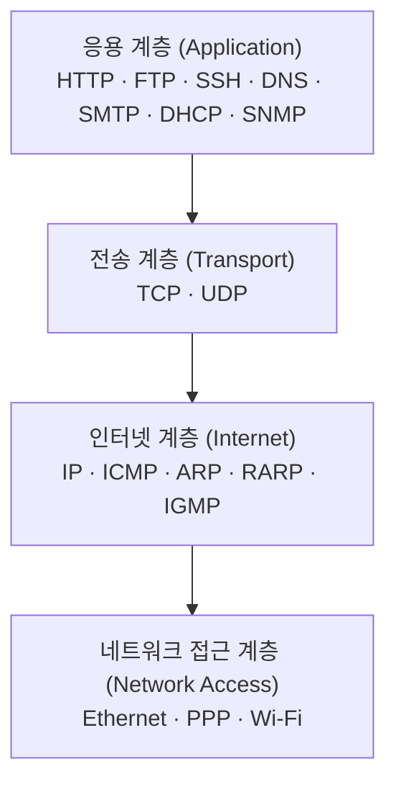
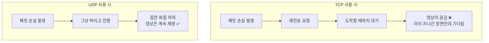
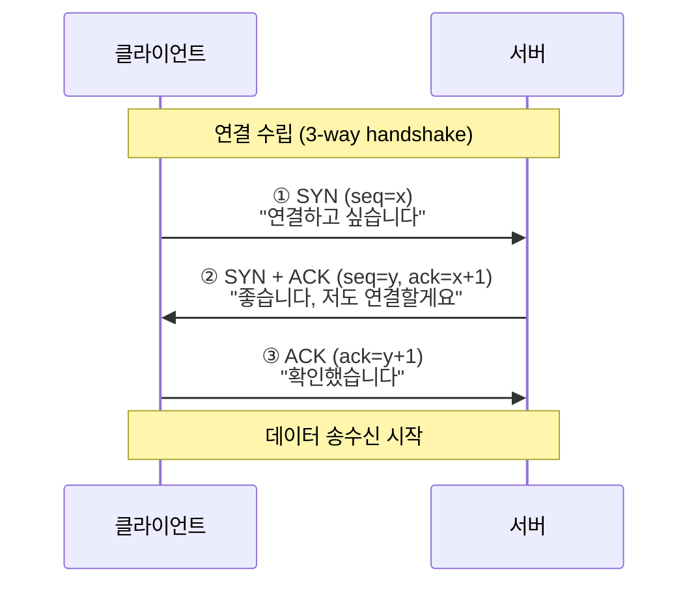
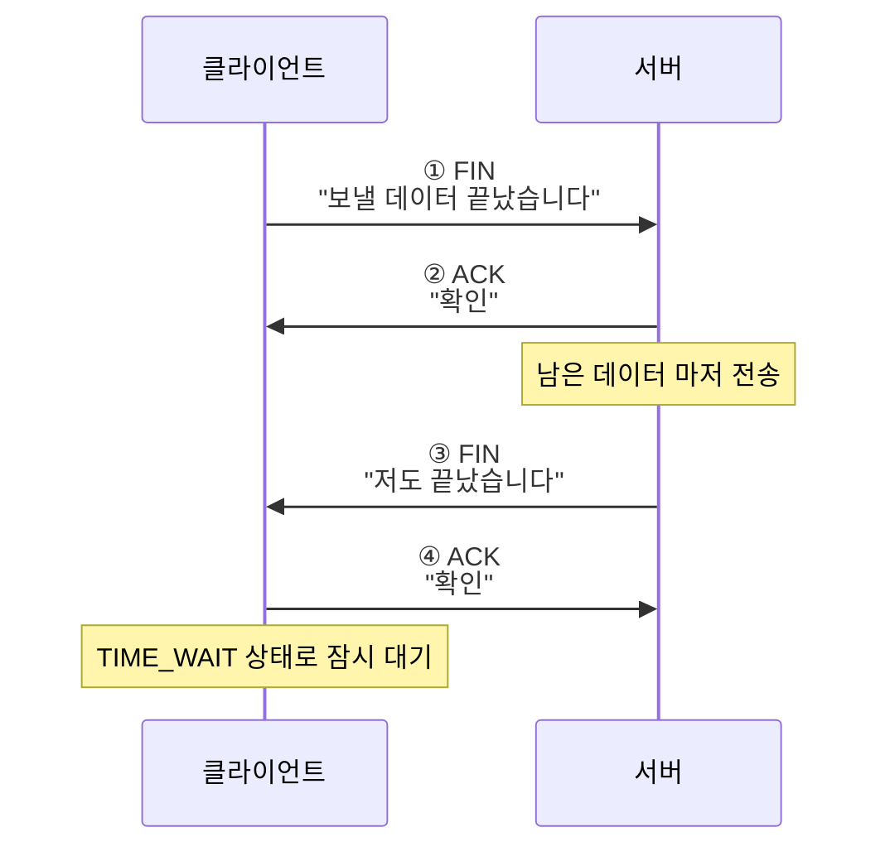
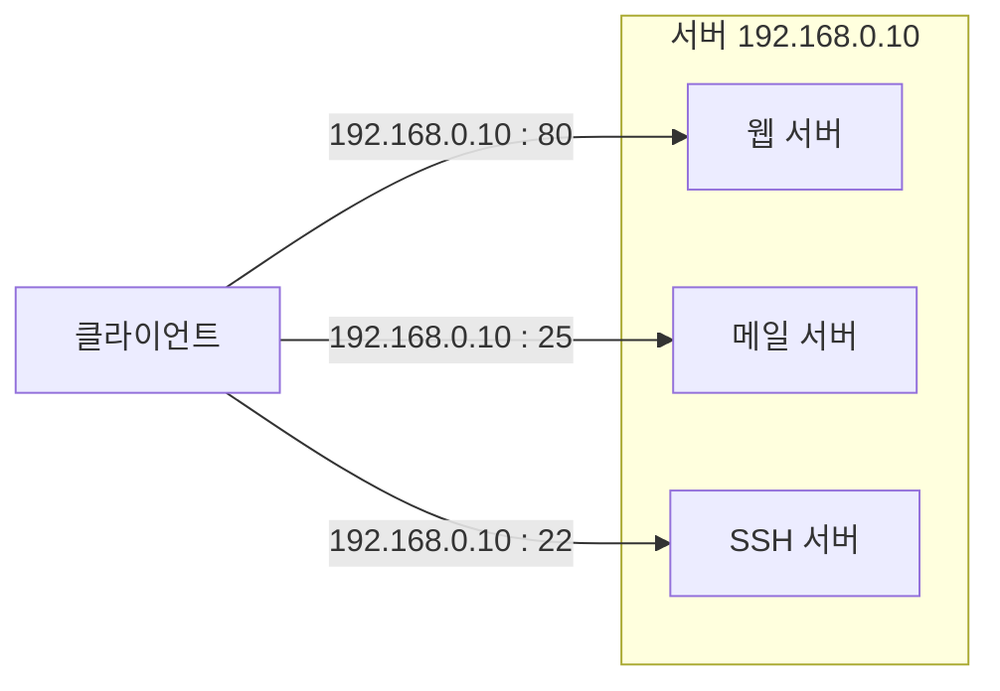
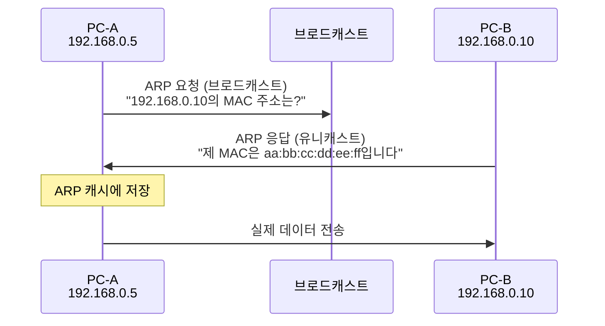
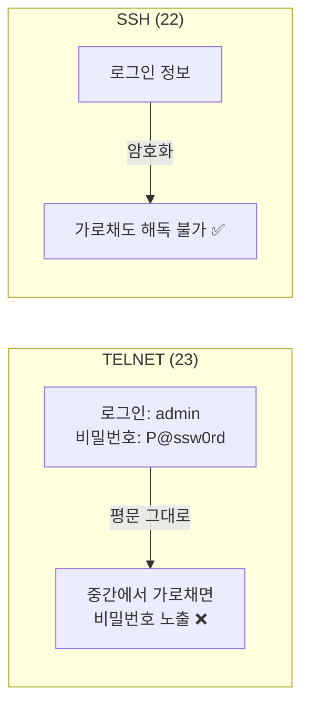

## 013. TCP/IP 프로토콜

### 1. 프로토콜이란

**프로토콜(Protocol)** 은 통신을 위해 미리 정해 둔 **규칙과 약속**입니다.

서로 다른 제조사·운영체제의 컴퓨터가 통신하려면  
**"어떤 형식으로, 어떤 순서로, 무슨 의미로"** 데이터를 주고받을지 합의해야 합니다.

#### 프로토콜의 3요소 (시험 출제)

| 요소 | 규정하는 것 |
| --- | --- |
| **구문 (Syntax)** | 데이터의 **형식, 부호화, 신호 레벨** |
| **의미 (Semantics)** | **제어 정보, 오류 처리** 방식 |
| **시간 (Timing)** | **속도 조절, 순서** |

---

### 2. TCP/IP 4계층 구조



| 계층 | 역할 | 주소 체계 |
| --- | --- | --- |
| **응용** | 사용자 서비스 제공 | — |
| **전송** | 종단 간 데이터 전달, 신뢰성 | **포트 번호** |
| **인터넷** | 네트워크 간 경로 선택 | **IP 주소** |
| **네트워크 접근** | 물리적 전송 | **MAC 주소** |

---

### 3. IP (Internet Protocol) — 인터넷 계층

IP는 **패킷을 목적지까지 전달하는 역할**을 합니다.

#### IP의 두 가지 중요한 특성

| 특성 | 의미 |
| --- | --- |
| **비연결형 (Connectionless)** | 미리 연결을 맺지 않고 **바로 보냅니다.** |
| **비신뢰성 (Unreliable)** | 도착을 **보장하지 않습니다.** 순서도 보장하지 않습니다. |

> **"그럼 인터넷은 왜 잘 동작하지?"**  
> 신뢰성은 **상위 계층인 TCP가 책임**지기 때문입니다.  
> IP는 **"최선을 다해 보낸다(Best Effort)"** 까지만 담당합니다.  
> 역할을 나눔으로써 IP는 단순하고 빠르게 유지되고, 필요할 때만 TCP로 신뢰성을 추가합니다.

#### IP 헤더의 주요 필드

| 필드 | 역할 |
| --- | --- |
| **Version** | IPv4 또는 IPv6 |
| **TTL (Time To Live)** | **거칠 수 있는 라우터 수**. 1씩 감소하여 0이 되면 폐기 |
| **Protocol** | 상위 프로토콜 (TCP=6, UDP=17, ICMP=1) |
| **Source / Destination IP** | 출발지·목적지 주소 |
| Fragment Offset | 분할된 패킷의 순서 |
| Checksum | 헤더 오류 검사 |

#### TTL이 필요한 이유

라우팅 설정이 잘못되면 패킷이 **A→B→C→A→B→C...** 로 **무한히 돌 수 있습니다.**

TTL은 **라우터를 하나 지날 때마다 1씩 감소**하고, **0이 되면 폐기**됩니다.  
덕분에 잘못된 패킷이 네트워크를 영원히 떠도는 일을 막습니다.

```bash
# TTL을 이용해 경로를 추적하는 것이 traceroute입니다
$ traceroute 8.8.8.8
 1  192.168.0.1     0.512 ms      ← TTL=1로 보내면 첫 라우터가 응답
 2  10.20.30.1      5.123 ms      ← TTL=2로 보내면 두 번째 라우터가 응답
 3  ...

# 운영체제별 기본 TTL로 OS를 추정할 수도 있습니다
$ ping -c1 example.com
64 bytes from ...: icmp_seq=1 ttl=54 time=32.1 ms
```

| 운영체제 | 기본 TTL |
| --- | --- |
| **Linux / Unix** | **64** |
| **Windows** | **128** |
| 일부 네트워크 장비 | 255 |

---

### 4. TCP vs UDP — 전송 계층

**시험에서 가장 많이 나오는 비교**입니다.

| 구분 | **TCP** (Transmission Control Protocol) | **UDP** (User Datagram Protocol) |
| --- | --- | --- |
| 연결 방식 | **연결형 (Connection-oriented)** | **비연결형 (Connectionless)** |
| 신뢰성 | **높음** — 재전송, 순서 보장 | **낮음** — 보장 없음 |
| 속도 | 상대적으로 **느림** | **빠름** |
| 헤더 크기 | **20바이트 이상** | **8바이트** |
| 흐름 제어 | **있음** | 없음 |
| 혼잡 제어 | **있음** | 없음 |
| 순서 보장 | **있음** | 없음 |
| 전송 단위 | **세그먼트 (Segment)** | **데이터그램 (Datagram)** |
| 1:N 통신 | 불가 (1:1만) | **가능** (브로드캐스트·멀티캐스트) |
| 용도 | 웹, 메일, 파일 전송, SSH | 스트리밍, VoIP, DNS, DHCP |

#### 왜 실시간 방송은 UDP를 쓸까?



실시간 영상에서 **1초 전 장면을 다시 받아 봐야 의미가 없습니다.**  
"완벽하지만 끊기는 것"보다 **"약간 손실돼도 매끄러운 것"** 이 낫기 때문에 UDP를 씁니다.

#### TCP 3-way 핸드셰이크 (연결 수립)



| 단계 | 플래그 | 의미 |
| --- | --- | --- |
| 1 | **SYN** | 클라이언트 → 서버 : 연결 요청 |
| 2 | **SYN + ACK** | 서버 → 클라이언트 : 요청 수락 + 자신도 연결 요청 |
| 3 | **ACK** | 클라이언트 → 서버 : 최종 확인 |

> **왜 3번이나 주고받을까?**  
> 양쪽 모두 **"내가 보낼 수 있고, 상대가 받을 수 있다"** 를 확인해야 하기 때문입니다.  
> 2번만 하면 서버는 자신의 응답이 도착했는지 알 수 없습니다.

#### TCP 4-way 핸드셰이크 (연결 종료)



> **왜 연결은 3번인데 종료는 4번일까?**  
> 종료는 **한쪽이 끝나도 다른 쪽은 보낼 데이터가 남아 있을 수 있기** 때문입니다.  
> 그래서 서버의 ACK와 FIN이 **분리**되어 총 4단계가 됩니다.

#### TCP 주요 플래그

| 플래그 | 의미 |
| --- | --- |
| **SYN** | 연결 요청 (Synchronize) |
| **ACK** | 확인 응답 (Acknowledgement) |
| **FIN** | 정상 종료 (Finish) |
| **RST** | **강제 종료** (Reset) — 비정상 상황 |
| PSH | 즉시 전달 (Push) |
| URG | 긴급 데이터 |

#### TCP 연결 상태

```bash
$ ss -tan | head -6
State      Recv-Q Send-Q  Local Address:Port   Peer Address:Port
LISTEN     0      128           0.0.0.0:22          0.0.0.0:*
ESTAB      0      0        192.168.0.5:22      192.168.0.100:52344
TIME-WAIT  0      0        192.168.0.5:443     203.0.113.7:41022
```

| 상태 | 의미 |
| --- | --- |
| **LISTEN** | 서버가 연결을 **대기 중** |
| **SYN-SENT** | 연결 요청을 보내고 응답 대기 |
| **ESTABLISHED** | **연결 완료, 통신 중** |
| **FIN-WAIT** | 종료 요청 후 대기 |
| **TIME-WAIT** | 종료 후 잔여 패킷을 위해 **일정 시간 대기** |
| CLOSE-WAIT | 상대가 종료를 요청, 내 쪽 종료 대기 |

> **`TIME_WAIT`이 많이 보이는 이유**  
> 정상입니다. 지연 도착하는 패킷이 다음 연결과 섞이지 않도록 **일부러 대기**하는 상태입니다.  
> 다만 웹 서버에서 지나치게 많으면 커널 파라미터 튜닝을 검토합니다.

---

### 5. 포트 번호

**IP 주소가 "건물 주소"라면, 포트 번호는 "호수"** 입니다.

한 서버가 웹·메일·FTP를 동시에 제공할 수 있는 이유가 포트 번호 덕분입니다.



#### 포트 번호 범위

| 범위 | 이름 | 설명 |
| --- | --- | --- |
| **0 ~ 1023** | **잘 알려진 포트 (Well-Known)** | 표준 서비스용. **root 권한 필요** |
| **1024 ~ 49151** | 등록 포트 (Registered) | 특정 애플리케이션용 |
| **49152 ~ 65535** | 동적/사설 포트 (Dynamic) | 클라이언트가 임시로 사용 |

> **전체 범위는 0 ~ 65535** (16비트 = 2¹⁶ = 65,536개)

#### 주요 포트 번호 (반드시 암기)

| 포트 | 프로토콜 | 서비스 | TCP/UDP |
| --- | --- | --- | --- |
| **20** | FTP-DATA | FTP 데이터 | TCP |
| **21** | **FTP** | 파일 전송 (제어) | TCP |
| **22** | **SSH** | 보안 원격 접속 | TCP |
| **23** | **TELNET** | 원격 접속 (암호화 없음) | TCP |
| **25** | **SMTP** | 메일 발송 | TCP |
| **53** | **DNS** | 도메인 이름 조회 | **TCP + UDP** |
| **67 / 68** | **DHCP** | IP 자동 할당 (서버/클라이언트) | UDP |
| **69** | TFTP | 간이 파일 전송 | UDP |
| **80** | **HTTP** | 웹 | TCP |
| **110** | **POP3** | 메일 수신 (내려받기) | TCP |
| **111** | RPC | 원격 프로시저 호출 | TCP/UDP |
| **123** | NTP | 시간 동기화 | UDP |
| **143** | **IMAP** | 메일 수신 (서버 보관) | TCP |
| **161 / 162** | SNMP | 네트워크 관리 | UDP |
| **389** | LDAP | 디렉터리 서비스 | TCP |
| **443** | **HTTPS** | 보안 웹 | TCP |
| **445** | SMB | 윈도우 파일 공유 | TCP |
| **514** | syslog | 로그 전송 | UDP |
| **587** | SMTP (Submission) | 메일 제출 | TCP |
| **993** | IMAPS | 보안 IMAP | TCP |
| **995** | POP3S | 보안 POP3 | TCP |
| **2049** | NFS | 네트워크 파일 시스템 | TCP/UDP |
| **3306** | MySQL | 데이터베이스 | TCP |
| **5432** | PostgreSQL | 데이터베이스 | TCP |

```bash
# 포트 번호 확인 (서비스 이름 ↔ 포트)
$ grep -w "22/tcp" /etc/services
ssh             22/tcp                          # The Secure Shell (SSH)

$ cat /etc/services | head -20
```

> **DNS가 TCP와 UDP를 모두 쓰는 이유**  
> 일반 조회는 크기가 작아 **UDP(빠름)** 를 쓰고,  
> 응답이 512바이트를 넘거나 **영역 전송(Zone Transfer)** 시에는 **TCP** 를 씁니다.

---

### 6. ARP와 RARP

**IP 주소만으로는 실제 통신이 안 됩니다.** 같은 네트워크 안에서는 **MAC 주소**로 전달되기 때문입니다.



| 프로토콜 | 변환 방향 |
| --- | --- |
| **ARP** (Address Resolution Protocol) | **IP → MAC** |
| **RARP** (Reverse ARP) | **MAC → IP** |

```bash
# ARP 캐시 확인
$ ip neigh
192.168.0.1 dev eth0 lladdr aa:bb:cc:dd:ee:ff REACHABLE
192.168.0.10 dev eth0 lladdr 11:22:33:44:55:66 STALE

$ arp -a              # 구형 명령
$ arp -d 192.168.0.10 # 캐시 삭제
```

> **보안 이슈 — ARP 스푸핑**  
> ARP는 **인증 절차가 없습니다.** 아무나 "제가 게이트웨이입니다"라고 응답할 수 있습니다.  
> 공격자가 이를 악용해 트래픽을 가로채는 것이 **ARP 스푸핑**입니다. ([045. 네트워크 침해 유형과 특징]에서 다룹니다)

---

### 7. ICMP

**ICMP(Internet Control Message Protocol)** 는 **오류 보고와 진단**을 담당합니다.

| 사용 예 | 설명 |
| --- | --- |
| **`ping`** | Echo Request(8) / Echo Reply(0) |
| **`traceroute`** | TTL 만료 메시지(11) 활용 |
| Destination Unreachable(3) | 목적지 도달 불가 |

```bash
$ ping -c 3 8.8.8.8
PING 8.8.8.8 (8.8.8.8) 56(84) bytes of data.
64 bytes from 8.8.8.8: icmp_seq=1 ttl=118 time=32.1 ms
64 bytes from 8.8.8.8: icmp_seq=2 ttl=118 time=31.8 ms

--- 8.8.8.8 ping statistics ---
3 packets transmitted, 3 received, 0% packet loss, time 2003ms
rtt min/avg/max/mdev = 31.802/32.011/32.145/0.145 ms
```

| `ping` 옵션 | 의미 |
| --- | --- |
| `-c N` | N번만 전송 |
| `-i N` | N초 간격 |
| `-s N` | 패킷 크기 지정 |
| `-W N` | 응답 대기 시간 |
| `-f` | 플러드 핑 (**root 전용**, 부하 테스트) |

> **`ping`이 안 된다고 서버가 죽은 것은 아닙니다.**  
> 많은 서버가 보안상 **ICMP를 차단**합니다. 서비스 확인은 포트로 해야 합니다.  
> ```bash
> $ nc -zv example.com 443       # 포트가 열려 있는지 확인
> $ curl -I https://example.com  # HTTP 응답 확인
> ```

---

### 8. 응용 계층 주요 프로토콜

| 프로토콜 | 역할 | 특징 |
| --- | --- | --- |
| **HTTP / HTTPS** | 웹 문서 전송 | HTTPS는 **TLS로 암호화** |
| **FTP** | 파일 전송 | **제어(21) + 데이터(20)** 두 포트 사용 |
| **SFTP / SCP** | 보안 파일 전송 | **SSH(22)** 기반 |
| **SSH** | 보안 원격 접속 | telnet을 대체 |
| **TELNET** | 원격 접속 | **평문 전송 — 사용 금지** ❗ |
| **SMTP** | 메일 **발송** | 밀어내는 방식(Push) |
| **POP3** | 메일 **수신** (내려받고 서버에서 삭제) | |
| **IMAP** | 메일 **수신** (서버에 보관, 동기화) | 여러 기기에 유리 |
| **DNS** | 도메인 ↔ IP 변환 | |
| **DHCP** | IP 자동 할당 | |
| **SNMP** | 네트워크 장비 관리·감시 | |
| **NTP** | 시간 동기화 | |
| **LDAP** | 디렉터리(계정 정보) 서비스 | |

#### TELNET vs SSH — 왜 SSH를 써야 하나



TELNET은 **아이디와 비밀번호를 암호화 없이 그대로** 전송합니다.  
같은 네트워크에서 패킷만 캡처하면 **비밀번호가 그대로 보입니다.**

**실무에서 TELNET은 절대 사용하지 않으며, 반드시 SSH를 씁니다.**  
(단, 포트가 열려 있는지 확인하는 용도로 `telnet host port` 는 여전히 쓰입니다.)

---

### 시험 포인트 정리

| 항목 | 핵심 |
| --- | --- |
| 프로토콜 3요소 | **구문 · 의미 · 시간** |
| IP의 특성 | **비연결형 · 비신뢰성** (신뢰성은 TCP 담당) |
| TTL 기본값 | **Linux 64 / Windows 128** |
| TCP | 연결형, 신뢰성, 헤더 **20B**, **세그먼트** |
| UDP | 비연결형, 빠름, 헤더 **8B**, **데이터그램** |
| 3-way handshake | **SYN → SYN+ACK → ACK** |
| 4-way handshake | **FIN → ACK → FIN → ACK** |
| 포트 전체 범위 | **0 ~ 65535** |
| Well-Known 포트 | **0 ~ 1023** (root 권한 필요) |
| FTP | **20(데이터) / 21(제어)** |
| SSH / TELNET | **22 / 23** |
| SMTP / POP3 / IMAP | **25 / 110 / 143** |
| DNS | **53 (TCP+UDP 모두)** |
| DHCP | **67 / 68** |
| HTTP / HTTPS | **80 / 443** |
| **ARP** | **IP → MAC** |
| **RARP** | **MAC → IP** |
| ICMP 사용 명령 | **ping, traceroute** |
| TELNET의 문제 | **평문 전송** → SSH 사용 |

---

### 한 줄 정리

**IP는 비연결형·비신뢰성으로 전달만 담당**하고 **신뢰성은 TCP가 책임**지며,  
TCP는 **SYN→SYN+ACK→ACK 3단계로 연결하고 FIN 4단계로 종료**하고,  
포트는 **0~65535 중 0~1023이 Well-Known**이며 **ARP는 IP를 MAC으로 변환**합니다.
