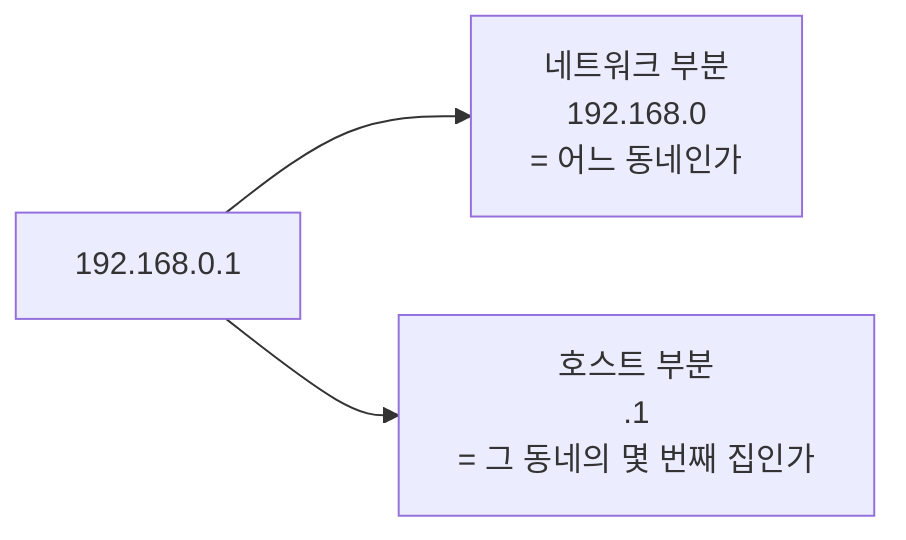
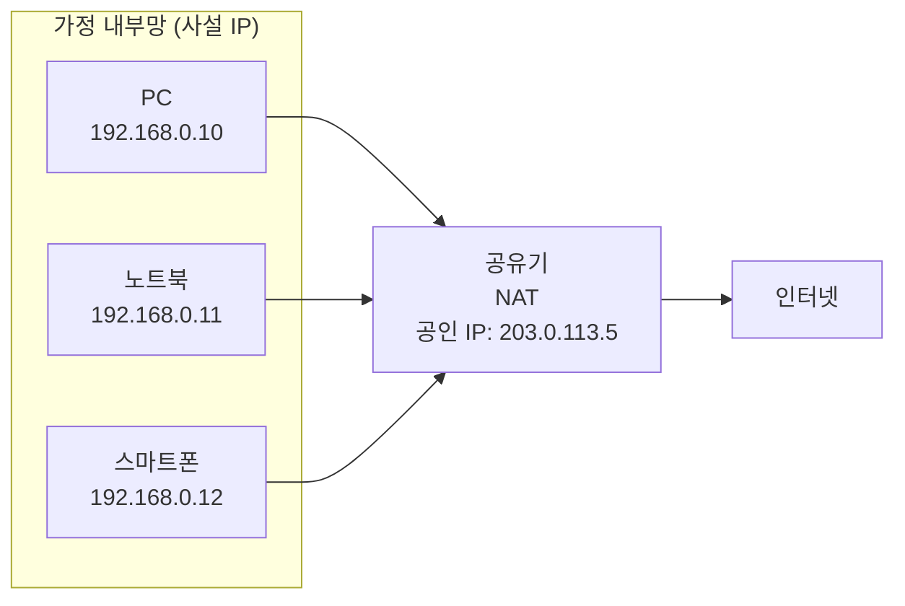
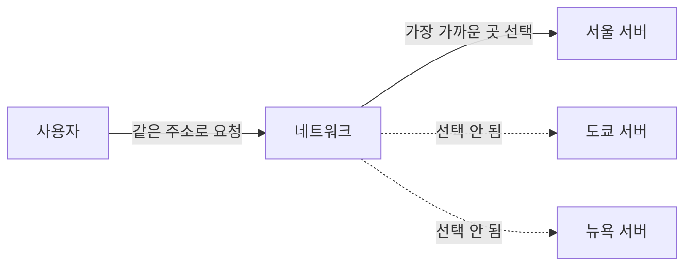
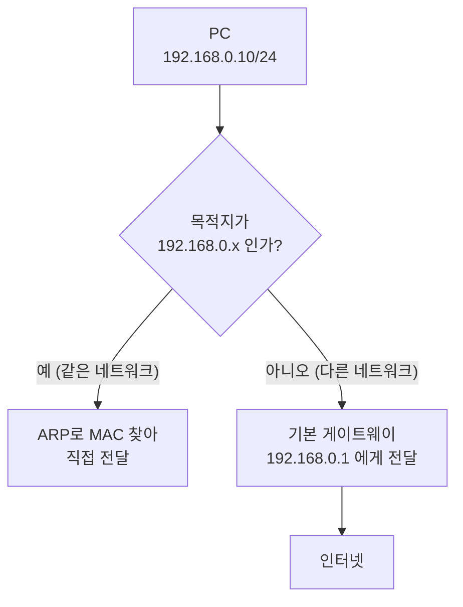

## 014. IP 주소와 서브네팅

### 1. IP 주소란

IP 주소는 **네트워크에 연결된 장비를 구분하는 고유한 주소**입니다.

#### IPv4의 구조

**32비트**를 **8비트씩 4덩어리(옥텟)** 로 나누고, 각 옥텟을 10진수로 표기합니다.

```
    192   .   168   .    0    .    1
     │        │         │         │
  11000000 . 10101000 . 00000000 . 00000001    ← 실제로는 32비트 2진수

각 옥텟 범위 : 0 ~ 255  (8비트 = 2⁸ = 256가지)
전체 개수    : 2³² ≈ 약 43억 개
```

#### IP 주소는 두 부분으로 나뉩니다 (핵심 개념)



| 부분 | 의미 |
| --- | --- |
| **네트워크 주소** | **어느 네트워크에 속하는가** (동네) |
| **호스트 주소** | **그 네트워크 안의 몇 번째 장비인가** (집 번호) |

**이 구분이 왜 중요할까?**

컴퓨터가 데이터를 보낼 때 가장 먼저 판단하는 것은  
**"상대가 우리 동네 사람인가, 밖에 있는 사람인가?"** 입니다.

- **같은 네트워크** → 직접 전달 (ARP로 MAC 주소를 찾아 바로 보냄)
- **다른 네트워크** → **게이트웨이(라우터)** 에게 넘김

이 판단을 하려면 **어디까지가 네트워크 부분인지**를 알아야 하고,  
그것을 알려 주는 것이 **서브넷 마스크**입니다.

---

### 2. IP 주소 클래스

과거에는 IP 주소를 **클래스**로 나누어 관리했습니다.

| 클래스 | 첫 옥텟 범위 | 기본 서브넷 마스크 | 네트워크 수 | 호스트 수 | 용도 |
| --- | --- | --- | --- | --- | --- |
| **A** | **1 ~ 126** | **255.0.0.0** (`/8`) | 적음 (126) | **매우 많음 (약 1,677만)** | 대규모 |
| **B** | **128 ~ 191** | **255.255.0.0** (`/16`) | 중간 (16,384) | 중간 (65,534) | 중규모 |
| **C** | **192 ~ 223** | **255.255.255.0** (`/24`) | **많음** | 적음 (**254**) | 소규모 |
| **D** | **224 ~ 239** | — | — | — | **멀티캐스트** |
| **E** | **240 ~ 255** | — | — | — | 연구·예약 |

> **127로 시작하는 주소는 왜 빠져 있을까?**  
> **`127.0.0.0/8`은 루프백(loopback)** 전용입니다.  
> `127.0.0.1`(localhost)은 **자기 자신**을 가리키며, 네트워크 카드 없이도 통신이 가능합니다.

#### 클래스 판별 연습

| IP 주소 | 첫 옥텟 | 클래스 |
| --- | --- | --- |
| `10.0.0.1` | 10 | **A** |
| `172.16.0.1` | 172 | **B** |
| `192.168.0.1` | 192 | **C** |
| `224.0.0.1` | 224 | **D (멀티캐스트)** |
| `127.0.0.1` | 127 | 루프백 (클래스 구분 대상 아님) |

---

### 3. 사설 IP 주소 (Private IP)

인터넷에 직접 연결되지 않는 **내부 전용 주소**입니다. **반드시 암기해야 합니다.**

| 클래스 | 사설 IP 대역 | CIDR |
| --- | --- | --- |
| **A** | **10.0.0.0 ~ 10.255.255.255** | `10.0.0.0/8` |
| **B** | **172.16.0.0 ~ 172.31.255.255** | `172.16.0.0/12` |
| **C** | **192.168.0.0 ~ 192.168.255.255** | `192.168.0.0/16` |

> **B 클래스 범위 주의** : `172.16` ~ **`172.31`** 까지입니다. `172.32`는 공인 IP입니다.

#### 왜 사설 IP가 필요했을까?

IPv4 주소는 약 43억 개인데, 전 세계 인터넷 기기는 이미 그보다 훨씬 많습니다.



**NAT(Network Address Translation)** 기술로,  
**공인 IP 하나를 여러 사설 IP가 공유**할 수 있게 되었습니다.

집에 기기가 10대여도 인터넷에서 볼 때는 **공유기의 공인 IP 하나**로 보입니다.

| 구분 | 공인 IP | 사설 IP |
| --- | --- | --- |
| 인터넷 직접 통신 | **가능** | 불가 (NAT 필요) |
| 유일성 | **전 세계에서 유일** | 내부망 안에서만 유일 |
| 비용 | 유료 (ISP 할당) | 무료 |
| 예 | `203.0.113.5` | `192.168.0.10` |

```bash
# 내 공인 IP 확인
$ curl ifconfig.me
203.0.113.5

# 내 사설 IP 확인
$ ip addr show | grep "inet "
    inet 127.0.0.1/8 scope host lo
    inet 192.168.0.10/24 brd 192.168.0.255 scope global eth0
```

---

### 4. 서브넷 마스크

**서브넷 마스크**는 IP 주소에서 **어디까지가 네트워크 부분인지 표시**하는 값입니다.

```
IP 주소       : 192.168.  0.  1   →  11000000 10101000 00000000 00000001
서브넷 마스크 : 255.255.255.  0   →  11111111 11111111 11111111 00000000
                                      └────── 네트워크 ──────┘└─호스트─┘
```

**규칙** : 서브넷 마스크에서 **1인 부분이 네트워크**, **0인 부분이 호스트**입니다.  
그리고 **1은 반드시 왼쪽부터 연속**되어야 합니다.

#### CIDR 표기법

`/24` 처럼 **1의 개수**로 표기하는 방식입니다.

| CIDR | 서브넷 마스크 | 호스트 비트 | 사용 가능 호스트 수 |
| --- | --- | --- | --- |
| `/8` | 255.0.0.0 | 24 | 16,777,214 |
| `/16` | 255.255.0.0 | 16 | 65,534 |
| `/24` | **255.255.255.0** | 8 | **254** |
| `/25` | 255.255.255.128 | 7 | 126 |
| `/26` | 255.255.255.192 | 6 | 62 |
| `/27` | 255.255.255.224 | 5 | 30 |
| `/28` | 255.255.255.240 | 4 | 14 |
| `/29` | 255.255.255.248 | 3 | 6 |
| `/30` | 255.255.255.252 | 2 | **2** (라우터 간 연결용) |

#### 계산 공식 (시험 필수)

```
호스트 비트 수 = 32 - CIDR 값
전체 주소 개수 = 2^(호스트 비트 수)
사용 가능 호스트 수 = 2^(호스트 비트 수) - 2
```

**왜 2를 뺄까?**

| 주소 | 용도 |
| --- | --- |
| **첫 번째 주소** (호스트 비트 전부 0) | **네트워크 주소** — 네트워크 자체를 가리킴 |
| **마지막 주소** (호스트 비트 전부 1) | **브로드캐스트 주소** — 전체에게 전송 |

이 두 개는 **특정 장비에 할당할 수 없으므로** 제외합니다.

---

### 5. 서브네팅 계산 실습

#### 예제 1 — `192.168.10.0/24`

```
CIDR /24 → 서브넷 마스크 255.255.255.0
호스트 비트 = 32 - 24 = 8
전체 주소 = 2⁸ = 256
사용 가능 = 256 - 2 = 254

네트워크 주소   : 192.168.10.0        ← 할당 불가
사용 가능 범위  : 192.168.10.1 ~ 192.168.10.254
브로드캐스트    : 192.168.10.255      ← 할당 불가
```

#### 예제 2 — `192.168.10.0/26` (자주 출제)

```
CIDR /26 → 마스크 255.255.255.192
호스트 비트 = 32 - 26 = 6
전체 주소 = 2⁶ = 64
사용 가능 = 64 - 2 = 62

블록 크기가 64이므로 네트워크가 4개로 나뉩니다.
```

| 서브넷 | 네트워크 주소 | 사용 가능 범위 | 브로드캐스트 |
| --- | --- | --- | --- |
| 1 | 192.168.10.**0** | .1 ~ .62 | 192.168.10.**63** |
| 2 | 192.168.10.**64** | .65 ~ .126 | 192.168.10.**127** |
| 3 | 192.168.10.**128** | .129 ~ .190 | 192.168.10.**191** |
| 4 | 192.168.10.**192** | .193 ~ .254 | 192.168.10.**255** |

#### 빠른 계산법 (실전 요령)

```
① 블록 크기 = 256 - 마스크의 마지막 옥텟 값
   /26 → 256 - 192 = 64

② 네트워크 주소는 블록 크기의 배수
   0, 64, 128, 192

③ 브로드캐스트 = 다음 네트워크 주소 - 1
   0의 브로드캐스트 = 64 - 1 = 63
```

#### 예제 3 — 주어진 IP가 속한 네트워크 찾기

**문제** : `192.168.10.100/26`이 속한 네트워크 주소와 브로드캐스트 주소는?

```
① 블록 크기 = 256 - 192 = 64
② 네트워크 경계 = 0, 64, 128, 192
③ 100은 64와 128 사이 → 네트워크 주소는 192.168.10.64
④ 브로드캐스트 = 128 - 1 = 192.168.10.127

정답: 네트워크 192.168.10.64 / 브로드캐스트 192.168.10.127
      사용 가능 범위 192.168.10.65 ~ 192.168.10.126
```

#### 예제 4 — 필요한 호스트 수로 서브넷 정하기

**문제** : 각 부서에 50대의 PC가 필요하다. 어떤 CIDR을 써야 하나?

```
필요 호스트 50대 → 2ⁿ - 2 ≥ 50 을 만족하는 최소 n
n=5 : 2⁵-2 = 30  ❌ 부족
n=6 : 2⁶-2 = 62  ✅ 충분

호스트 비트 6개 → CIDR = 32 - 6 = /26
정답: /26 (255.255.255.192)
```

---

### 6. 특수 IP 주소

| 주소 | 의미 |
| --- | --- |
| **0.0.0.0** | 모든 주소 / 미지정 주소 (서버가 모든 인터페이스에서 수신할 때) |
| **127.0.0.1** | **루프백 (localhost)** — 자기 자신 |
| **255.255.255.255** | **제한적 브로드캐스트** (로컬 네트워크 전체) |
| **169.254.x.x** | **APIPA** — DHCP 서버를 못 찾았을 때 자동 할당 |
| **224.0.0.0 ~ 239.255.255.255** | 멀티캐스트 |

> **실무 팁 — `169.254.x.x`가 보이면?**  
> **DHCP 서버로부터 IP를 받지 못했다**는 뜻입니다.  
> 케이블 연결, DHCP 서버 상태, 스위치 포트를 확인해야 합니다.

---

### 7. IPv6

IPv4의 주소 고갈 문제를 해결하기 위해 등장했습니다.

| 구분 | **IPv4** | **IPv6** |
| --- | --- | --- |
| 주소 길이 | **32비트** | **128비트** |
| 표기 | **10진수, 점(`.`)** | **16진수, 콜론(`:`)** |
| 구분 단위 | 8비트씩 4개 | **16비트씩 8개** |
| 주소 개수 | 약 43억 (2³²) | 약 3.4 × 10³⁸ (2¹²⁸) |
| 헤더 | 가변 길이, 복잡 | **고정 40바이트, 단순** |
| 보안 | 별도(IPsec 선택) | **IPsec 기본 내장** |
| 브로드캐스트 | **있음** | **없음** ❗ |
| 특수 전송 | 유니캐스트/멀티캐스트/브로드캐스트 | 유니캐스트/멀티캐스트/**애니캐스트** |
| 주소 자동 설정 | DHCP 필요 | **자동 설정(SLAAC) 지원** |

```
IPv6 표기 예:
2001:0db8:85a3:0000:0000:8a2e:0370:7334

축약 규칙:
① 각 그룹 앞의 0 생략      → 2001:db8:85a3:0:0:8a2e:370:7334
② 연속된 0 그룹은 :: 로    → 2001:db8:85a3::8a2e:370:7334
   (:: 는 한 번만 사용 가능)

루프백: ::1        (IPv4의 127.0.0.1)
미지정: ::         (IPv4의 0.0.0.0)
```

#### 애니캐스트란?

같은 주소를 가진 서버가 여러 곳에 있고, **가장 가까운 서버**에게 전달되는 방식입니다.



사용자는 아무것도 몰라도 **가장 빠른 서버에 연결**되므로,  
속도 향상과 부하 분산을 동시에 얻습니다. (CDN, DNS 루트 서버가 이 방식을 씁니다)

> **시험 포인트** : **IPv6에는 브로드캐스트가 없고, 대신 애니캐스트가 있습니다.**

---

### 8. 게이트웨이와 라우팅



**기본 게이트웨이(Default Gateway)** 는 **다른 네트워크로 나가는 출구**입니다.  
가정에서는 보통 **공유기**가 이 역할을 합니다.

```bash
# 라우팅 테이블 확인
$ ip route
default via 192.168.0.1 dev eth0 proto dhcp metric 100
192.168.0.0/24 dev eth0 proto kernel scope link src 192.168.0.10

# 해석
# default via 192.168.0.1  → 그 외 모든 목적지는 192.168.0.1로 (기본 게이트웨이)
# 192.168.0.0/24 dev eth0  → 이 대역은 eth0로 직접 전달

$ route -n              # 구형 명령
$ ip route get 8.8.8.8  # 특정 목적지로 갈 때 사용할 경로 확인
8.8.8.8 via 192.168.0.1 dev eth0 src 192.168.0.10
```

---

### 시험 포인트 정리

| 항목 | 핵심 |
| --- | --- |
| IPv4 | **32비트**, 8비트씩 4개, 10진수·점 |
| A 클래스 | **1~126**, `/8`, 255.0.0.0 |
| B 클래스 | **128~191**, `/16` |
| C 클래스 | **192~223**, `/24`, 호스트 **254개** |
| D 클래스 | **224~239**, **멀티캐스트** |
| 루프백 | **127.0.0.1** (`127.0.0.0/8`) |
| **사설 IP A** | **10.0.0.0/8** |
| **사설 IP B** | **172.16.0.0 ~ 172.31.255.255** |
| **사설 IP C** | **192.168.0.0/16** |
| 사용 가능 호스트 수 | **2^(32-CIDR) - 2** |
| 2를 빼는 이유 | **네트워크 주소 + 브로드캐스트 주소** |
| 블록 크기 계산 | **256 - 마스크 마지막 옥텟** |
| `/26` | 마스크 **255.255.255.192**, 호스트 **62개** |
| `/30` | 호스트 **2개** (라우터 간 연결) |
| APIPA | **169.254.x.x** — DHCP 실패 |
| IPv6 | **128비트**, 16진수, 콜론, **브로드캐스트 없음** |
| IPv6 루프백 | **`::1`** |
| 애니캐스트 | **가장 가까운 하나**에게 전달 |

---

### 한 줄 정리

IP 주소는 **네트워크 부분과 호스트 부분**으로 나뉘고 그 경계를 **서브넷 마스크**가 정하며,  
사용 가능한 호스트 수는 **2^(32−CIDR) − 2** (네트워크·브로드캐스트 제외)이고,  
사설 IP는 **10.0.0.0/8, 172.16~31, 192.168.0.0/16** 세 대역이며 **NAT**로 공인 IP를 공유합니다.
