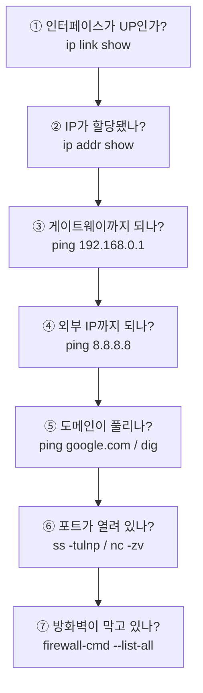

## 015. 네트워크 설정과 명령어

### 1. 네트워크 인터페이스 이름

리눅스의 네트워크 인터페이스 이름은 **버전에 따라 규칙이 다릅니다.**

| 방식 | 예 | 특징 |
| --- | --- | --- |
| **전통 방식** | `eth0`, `eth1`, `wlan0` | 인식 순서대로 번호 부여 → **재부팅 시 바뀔 수 있음** ❗ |
| **예측 가능한 이름 (Predictable Names)** | `enp0s3`, `ens192`, `wlp2s0` | **물리적 위치 기반** → 항상 동일 |
| 루프백 | **`lo`** | 자기 자신 (127.0.0.1) |

```
enp0s3
│││ │
│││ └── s3  : 슬롯 3
││└──── p0  : PCI 버스 0
│└───── n   : (선택) 이름
└────── en  : Ethernet   (wl = Wireless LAN, ww = WWAN)
```

> **왜 이름 규칙이 바뀌었을까?**  
> 랜카드가 2장 있을 때, 전통 방식에서는 부팅할 때마다 **`eth0`과 `eth1`이 뒤바뀔 수 있었습니다.**  
> 방화벽 규칙이 엉뚱한 카드에 적용되는 사고가 생기므로,  
> **물리적 위치 기반의 고정 이름**으로 바뀌었습니다.

---

### 2. `ip` 명령어 — 현재 표준

과거의 `ifconfig`, `route`, `arp`를 모두 대체하는 통합 명령어입니다.

| 옛 명령어 | 현재 명령어 |
| --- | --- |
| `ifconfig` | **`ip addr`**, `ip link` |
| `route` | **`ip route`** |
| `arp` | **`ip neigh`** |
| `netstat` | **`ss`** |

#### 주소 확인과 설정

```bash
# 인터페이스와 IP 확인
$ ip addr show
$ ip a                        # 축약형
$ ip addr show eth0           # 특정 인터페이스만

1: lo: <LOOPBACK,UP,LOWER_UP> mtu 65536 qdisc noqueue state UNKNOWN
    inet 127.0.0.1/8 scope host lo
2: enp0s3: <BROADCAST,MULTICAST,UP,LOWER_UP> mtu 1500 qdisc fq_codel state UP
    link/ether 08:00:27:12:34:56 brd ff:ff:ff:ff:ff:ff
    inet 192.168.0.10/24 brd 192.168.0.255 scope global dynamic enp0s3
         │                                        │
         └── IP 주소와 CIDR                      └── DHCP로 받았음

# IP 주소 추가 / 삭제 (❗재부팅하면 사라짐 — 임시 설정)
$ sudo ip addr add 192.168.0.50/24 dev enp0s3
$ sudo ip addr del 192.168.0.50/24 dev enp0s3

# 인터페이스 활성화 / 비활성화
$ sudo ip link set enp0s3 up
$ sudo ip link set enp0s3 down

# MAC 주소 변경
$ sudo ip link set enp0s3 address 00:11:22:33:44:55

# MTU 변경
$ sudo ip link set enp0s3 mtu 9000
```

#### 라우팅

```bash
# 라우팅 테이블 확인
$ ip route
default via 192.168.0.1 dev enp0s3 proto dhcp metric 100
192.168.0.0/24 dev enp0s3 proto kernel scope link src 192.168.0.10

# 기본 게이트웨이 설정 / 삭제
$ sudo ip route add default via 192.168.0.1
$ sudo ip route del default

# 특정 네트워크 경로 추가 (정적 라우팅)
$ sudo ip route add 10.0.0.0/24 via 192.168.0.254

# 특정 목적지로 갈 때 어떤 경로를 쓰는지 확인 (진단에 매우 유용)
$ ip route get 8.8.8.8
8.8.8.8 via 192.168.0.1 dev enp0s3 src 192.168.0.10 uid 1000
```

#### ARP 캐시

```bash
$ ip neigh
192.168.0.1 dev enp0s3 lladdr aa:bb:cc:dd:ee:ff REACHABLE

$ sudo ip neigh del 192.168.0.1 dev enp0s3     # 캐시 삭제
$ sudo ip neigh flush all                       # 전체 삭제
```

> **중요** : `ip` 명령으로 한 설정은 **모두 임시**입니다. **재부팅하면 사라집니다.**  
> 영구 설정은 아래 3~4절의 설정 파일이나 `nmcli`를 사용해야 합니다.

---

### 3. 영구 설정 — Red Hat 계열 (Rocky/RHEL)

#### 방법 ① NetworkManager (`nmcli`) — 권장

RHEL 8 / Rocky 8의 **표준 방식**입니다.

```bash
# 연결 목록 확인
$ nmcli connection show
NAME     UUID                                  TYPE      DEVICE
enp0s3   a1b2c3d4-1111-2222-3333-444455556666  ethernet  enp0s3

# 장치 상태
$ nmcli device status
DEVICE   TYPE      STATE      CONNECTION
enp0s3   ethernet  connected  enp0s3
lo       loopback  unmanaged  --

# 고정 IP 설정
$ sudo nmcli connection modify enp0s3 \
    ipv4.method manual \
    ipv4.addresses 192.168.0.10/24 \
    ipv4.gateway 192.168.0.1 \
    ipv4.dns "8.8.8.8 1.1.1.1"

# DHCP로 변경
$ sudo nmcli connection modify enp0s3 ipv4.method auto

# 설정 적용 (연결 재시작)
$ sudo nmcli connection up enp0s3
# 또는
$ sudo nmcli device reapply enp0s3

# 부팅 시 자동 연결
$ sudo nmcli connection modify enp0s3 connection.autoconnect yes

# 상세 설정 확인
$ nmcli connection show enp0s3 | grep ipv4
```

#### 방법 ② 설정 파일 직접 편집

```bash
$ sudo vi /etc/sysconfig/network-scripts/ifcfg-enp0s3
```

```ini
TYPE=Ethernet
BOOTPROTO=static          # static(고정) 또는 dhcp
NAME=enp0s3
DEVICE=enp0s3
ONBOOT=yes                # 부팅 시 활성화 ⭐
IPADDR=192.168.0.10       # IP 주소
PREFIX=24                 # 또는 NETMASK=255.255.255.0
GATEWAY=192.168.0.1       # 기본 게이트웨이
DNS1=8.8.8.8
DNS2=1.1.1.1
```

| 항목 | 의미 |
| --- | --- |
| **`BOOTPROTO`** | **`static`(고정)** / **`dhcp`(자동)** / `none` |
| **`ONBOOT`** | **`yes`면 부팅 시 자동 활성화** ❗ 가장 자주 빠뜨리는 항목 |
| `IPADDR` | IP 주소 |
| `PREFIX` / `NETMASK` | 서브넷 마스크 |
| `GATEWAY` | 기본 게이트웨이 |
| `DNS1`, `DNS2` | DNS 서버 |
| `DEFROUTE` | 기본 경로로 사용할지 |

```bash
# 설정 적용
$ sudo nmcli connection reload
$ sudo nmcli connection up enp0s3
# 또는
$ sudo systemctl restart NetworkManager
```

---

### 4. 영구 설정 — Debian / Ubuntu 계열

#### Netplan (Ubuntu 18.04 이상)

```bash
$ sudo vi /etc/netplan/01-netcfg.yaml
```

```yaml
network:
  version: 2
  renderer: networkd
  ethernets:
    enp0s3:
      dhcp4: no
      addresses:
        - 192.168.0.10/24
      routes:
        - to: default
          via: 192.168.0.1
      nameservers:
        addresses: [8.8.8.8, 1.1.1.1]
```

```bash
$ sudo netplan try        # 임시 적용 후 120초 내 확인 (안전)
$ sudo netplan apply      # 적용
```

> **YAML은 들여쓰기에 매우 민감합니다.** 탭이 아닌 **공백**을 사용해야 합니다.  
> `netplan try` 를 쓰면 잘못된 설정으로 **접속이 끊겨도 자동 롤백**되므로 원격 서버에서 안전합니다.

---

### 5. 주요 네트워크 설정 파일

| 파일 | 역할 |
| --- | --- |
| **`/etc/hostname`** | **호스트 이름** |
| **`/etc/hosts`** | **IP ↔ 호스트명 정적 매핑** (DNS보다 우선) |
| **`/etc/resolv.conf`** | **DNS 서버 주소** |
| **`/etc/nsswitch.conf`** | 이름 조회 순서 (`hosts: files dns`) |
| `/etc/services` | 서비스명 ↔ 포트 번호 매핑 |
| `/etc/protocols` | 프로토콜 번호 |
| `/etc/sysconfig/network-scripts/ifcfg-*` | RHEL 계열 인터페이스 설정 |
| `/etc/netplan/*.yaml` | Ubuntu 네트워크 설정 |

```bash
# 호스트 이름
$ hostname
server01
$ hostnamectl set-hostname server01.example.com    # 영구 변경 (권장)

# /etc/hosts
$ cat /etc/hosts
127.0.0.1   localhost localhost.localdomain
::1         localhost localhost.localdomain
192.168.0.20  db-server    # DNS 없이도 이름으로 접근 가능

# DNS 설정
$ cat /etc/resolv.conf
nameserver 8.8.8.8
nameserver 1.1.1.1
search example.com
```

> **주의** : `/etc/resolv.conf`는 **NetworkManager가 자동으로 덮어씁니다.**  
> 직접 수정해도 재부팅하면 사라지므로, **`nmcli`의 `ipv4.dns`** 로 설정해야 합니다.

#### `/etc/hosts`가 DNS보다 우선인 이유

`/etc/nsswitch.conf` 에 조회 순서가 정의되어 있습니다.

```bash
$ grep hosts /etc/nsswitch.conf
hosts:      files dns myhostname
            └─┬─┘ └┬┘
              │    └── 그다음 DNS 서버에 질의
              └─────── 먼저 /etc/hosts 확인
```

**실무 활용** : 개발 중 특정 도메인을 테스트 서버로 강제 연결할 때 유용합니다.

```bash
# /etc/hosts 에 추가하면 DNS와 무관하게 해당 IP로 접속
192.168.0.99  www.example.com
```

---

### 6. 네트워크 진단 명령어

#### 연결 확인 — `ping`

```bash
$ ping -c 4 8.8.8.8
$ ping -c 4 -i 0.2 192.168.0.1     # 0.2초 간격
$ ping -c 4 -s 1000 8.8.8.8        # 패킷 크기 1000바이트
```

#### 경로 추적 — `traceroute` / `tracepath` / `mtr`

```bash
$ traceroute 8.8.8.8
 1  192.168.0.1 (192.168.0.1)   0.512 ms
 2  10.20.30.1  (10.20.30.1)    5.123 ms
 3  * * *                        ← 응답 없음 (ICMP 차단 or 문제 지점)
 4  8.8.8.8     (8.8.8.8)       32.1 ms

$ tracepath 8.8.8.8      # root 권한 불필요
$ mtr 8.8.8.8            # ping + traceroute 실시간 (가장 유용)
```

> **`* * *` 이 나오면?**  
> 해당 홉이 **ICMP 응답을 차단**하고 있을 뿐, 반드시 장애는 아닙니다.  
> 그 이후 홉이 정상 응답하면 통신은 문제없습니다.

#### 포트와 연결 상태 — `ss` (netstat 대체)

```bash
# 열려 있는 포트 확인 (가장 자주 쓰는 조합)
$ ss -tulnp
Netid State  Local Address:Port  Peer Address:Port Process
tcp   LISTEN 0.0.0.0:22          0.0.0.0:*         users:(("sshd",pid=856,fd=3))
tcp   LISTEN 0.0.0.0:80          0.0.0.0:*         users:(("httpd",pid=1203,fd=4))
```

| 옵션 | 의미 |
| --- | --- |
| **`-t`** | TCP |
| **`-u`** | UDP |
| **`-l`** | **LISTEN 상태만** |
| **`-n`** | 숫자로 표시 (이름 변환 안 함 → 빠름) |
| **`-p`** | **프로세스 정보 표시** (root 권한 필요) |
| `-a` | 모든 소켓 |
| `-s` | 요약 통계 |

```bash
# 특정 포트를 누가 쓰는지 찾기 (실무 필수)
$ sudo ss -tulnp | grep :80
$ sudo lsof -i :80
$ sudo fuser 80/tcp

# 연결된 세션 확인
$ ss -tan state established
```

#### 포트 열림 확인 — `nc`, `telnet`, `nmap`

```bash
# 특정 포트가 열려 있는지 (가장 간단)
$ nc -zv example.com 443
Connection to example.com 443 port [tcp/https] succeeded!

$ nc -zv 192.168.0.20 3306        # DB 포트 확인

# telnet으로도 가능 (연결되면 열린 것)
$ telnet example.com 80

# 포트 스캔 (❗허가받은 시스템에만 사용)
$ nmap -p 1-1000 192.168.0.20
$ nmap -sV 192.168.0.20           # 서비스 버전까지
```

> **주의** : `nmap` 포트 스캔은 **본인 소유이거나 명시적으로 허가받은 시스템**에만 수행해야 합니다.  
> 무단 스캔은 법적 문제가 될 수 있습니다.

#### DNS 조회 — `dig`, `nslookup`, `host`

```bash
# dig (가장 상세, 권장)
$ dig example.com
;; ANSWER SECTION:
example.com.  86400  IN  A  93.184.216.34

$ dig example.com MX          # 메일 서버 조회
$ dig example.com NS          # 네임 서버 조회
$ dig +short example.com      # 결과만 간단히
$ dig @8.8.8.8 example.com    # 특정 DNS 서버에 질의
$ dig -x 8.8.8.8              # 역방향 조회 (IP → 도메인)

# 간단 조회
$ host example.com
$ nslookup example.com
```

#### 트래픽 캡처 — `tcpdump`

```bash
$ sudo tcpdump -i enp0s3                      # 인터페이스 감시
$ sudo tcpdump -i enp0s3 port 80              # 80번 포트만
$ sudo tcpdump -i enp0s3 host 192.168.0.20    # 특정 호스트만
$ sudo tcpdump -i enp0s3 -w capture.pcap      # 파일로 저장 (Wireshark로 분석)
$ sudo tcpdump -i enp0s3 -nn -A port 80       # 내용까지 ASCII로
```

#### 대역폭·다운로드 — `curl`, `wget`

```bash
$ curl -I https://example.com          # 헤더만 확인
$ curl -o file.zip https://.../file.zip
$ curl -v https://example.com          # 상세 과정 (TLS 핸드셰이크 포함)
$ wget https://example.com/file.zip
$ wget -c https://.../big.iso          # 이어받기
```

---

### 7. 네트워크 문제 해결 순서 (실무 필수)

문제가 생겼을 때 **가까운 곳에서 먼 곳으로** 좁혀 나갑니다.



| 증상 | 원인 추정 |
| --- | --- |
| ①에서 DOWN | 케이블 불량, `ONBOOT=no`, 드라이버 문제 |
| ②에서 IP 없음 / `169.254.x.x` | **DHCP 서버 문제** |
| ③ 실패 | 같은 네트워크 문제 (스위치, VLAN, 서브넷 마스크 오류) |
| ④ 실패 | **게이트웨이·라우팅** 문제 |
| ⑤만 실패 | **DNS 문제** (`/etc/resolv.conf` 확인) |
| ⑥ 실패 | 서비스가 안 떠 있거나 다른 IP에 바인딩됨 |
| ⑦ | 방화벽 / SELinux |

> **가장 흔한 사례 : `ping 8.8.8.8`은 되는데 `ping google.com`은 안 된다**  
> → 네트워크는 정상, **DNS만 문제**입니다. `/etc/resolv.conf`를 확인하면 됩니다.

---

### 8. 방화벽 기본 확인 (상세는 032번 문서에서)

```bash
# firewalld (RHEL/Rocky 기본)
$ sudo firewall-cmd --state
$ sudo firewall-cmd --list-all
$ sudo firewall-cmd --add-port=80/tcp --permanent
$ sudo firewall-cmd --reload

# ufw (Ubuntu)
$ sudo ufw status
$ sudo ufw allow 80/tcp
```

> **서비스는 떠 있는데 외부에서 접속이 안 될 때**, 90%는 **방화벽**입니다.  
> `ss -tulnp`로 서비스가 LISTEN 중인지 먼저 확인하고, 그다음 방화벽을 봅니다.

---

### 시험 포인트 정리

| 항목 | 핵심 |
| --- | --- |
| 인터페이스 이름 | `eth0`(전통) / **`enp0s3`(예측 가능)** / `lo`(루프백) |
| `ip` 명령 설정 | **임시** — 재부팅 시 사라짐 |
| RHEL 설정 파일 | **`/etc/sysconfig/network-scripts/ifcfg-*`** |
| `BOOTPROTO` | **static / dhcp** |
| `ONBOOT=yes` | **부팅 시 자동 활성화** |
| Ubuntu 설정 | **Netplan** (`/etc/netplan/*.yaml`) |
| 호스트명 파일 | **`/etc/hostname`** |
| IP↔이름 매핑 | **`/etc/hosts`** (DNS보다 **우선**) |
| DNS 설정 | **`/etc/resolv.conf`** (`nameserver`) |
| 조회 순서 정의 | **`/etc/nsswitch.conf`** |
| 열린 포트 확인 | **`ss -tulnp`** (구: `netstat -tulnp`) |
| 경로 추적 | **`traceroute`**, `mtr` |
| DNS 조회 | **`dig`**, `nslookup`, `host` |
| 패킷 캡처 | **`tcpdump`** |
| 포트 열림 확인 | **`nc -zv`** |
| IP는 되는데 도메인 안 됨 | **DNS 문제** |

---

### 한 줄 정리

`ip` 명령으로 한 설정은 **임시**이므로 영구 설정은 **RHEL은 `nmcli`/`ifcfg-*`, Ubuntu는 Netplan**을 써야 하며,  
문제 진단은 **인터페이스 → IP → 게이트웨이 → 외부 IP → DNS → 포트 → 방화벽** 순으로 좁혀 나가고,  
**`ping 8.8.8.8`은 되는데 도메인이 안 되면 DNS 문제**입니다.
