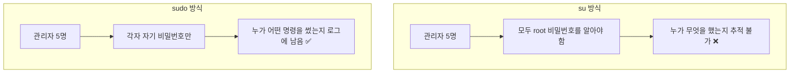

## 016. 사용자 계정 관리

### 1. 리눅스의 사용자 개념

리눅스는 **다중 사용자(Multi-user) 운영체제**입니다.  
여러 사람이 동시에 접속해서 작업할 수 있고, 각자의 파일과 권한이 분리되어 있습니다.

이를 가능하게 하는 것이 **UID(User ID)** 입니다.

> **핵심** : 리눅스는 사용자를 **이름이 아니라 숫자(UID)로 식별**합니다.  
> 이름은 사람이 보기 편하라고 붙인 것일 뿐, 커널은 UID만 봅니다.


#### UID 범위 (시험 출제)

| UID | 용도 |
| --- | --- |
| **0** | **root (슈퍼 유저)** — 모든 권한 |
| **1 ~ 999** | **시스템 계정** (데몬용) — RHEL 8 기준 |
| **1000 이상** | **일반 사용자 계정** |

> **UID 0이면 이름이 root가 아니어도 root 권한을 가집니다.**  
> 그래서 `/etc/passwd`에 UID가 0인 계정이 두 개 이상 있으면 **심각한 보안 문제**입니다.
> ```bash
> # UID 0인 계정 점검 (보안 감사 필수 항목)
> $ awk -F: '$3 == 0 {print $1}' /etc/passwd
> root
> ```

---

### 2. `/etc/passwd` — 사용자 정보

```bash
$ cat /etc/passwd | head -3
root:x:0:0:root:/root:/bin/bash
daemon:x:2:2:daemon:/sbin:/sbin/nologin
masterway:x:1000:1000:Master Way:/home/masterway:/bin/bash
```

#### 7개 필드 (반드시 암기)

```
masterway : x : 1000 : 1000 : Master Way : /home/masterway : /bin/bash
    │       │     │      │         │             │               │
    ①       ②     ③      ④         ⑤             ⑥               ⑦
```

| 번호 | 필드 | 설명 |
| --- | --- | --- |
| **①** | **사용자명** | 로그인 ID |
| **②** | **비밀번호** | **`x`** = 실제 암호는 `/etc/shadow`에 있음 |
| **③** | **UID** | 사용자 ID |
| **④** | **GID** | 기본 그룹 ID |
| **⑤** | **설명(GECOS)** | 실명, 연락처 등 주석 |
| **⑥** | **홈 디렉터리** | 로그인 시 위치 |
| **⑦** | **로그인 셸** | `/bin/bash`, `/sbin/nologin` 등 |

#### 왜 비밀번호가 `x` 로 되어 있을까?

`/etc/passwd`는 **모든 사용자가 읽을 수 있어야 합니다.**  
`ls -l` 로 파일 소유자 이름을 표시하려면 UID ↔ 이름 매핑을 조회해야 하기 때문입니다.

```bash
$ ls -l /etc/passwd
-rw-r--r--. 1 root root 2891 Jan 29 06:25 /etc/passwd
   └── 누구나 읽기 가능 (644)
```

그런데 여기에 암호 해시가 있으면 **누구나 해시를 가져가 무차별 대입 공격**을 할 수 있습니다.

그래서 암호를 **`/etc/shadow`로 분리**하고, `/etc/passwd`에는 `x`만 남겼습니다.  
이를 **섀도우 패스워드(Shadow Password)** 방식이라고 합니다.

---

### 3. `/etc/shadow` — 비밀번호 정보

```bash
$ sudo cat /etc/shadow | grep masterway
masterway:$6$rounds$abcXYZ...:19750:0:99999:7:::

$ ls -l /etc/shadow
----------. 1 root root 1421 Jan 29 06:25 /etc/shadow
   └── 권한 000 — root만 접근 가능 ❗
```

#### 9개 필드

```
masterway : $6$... : 19750 : 0 : 99999 : 7 : : :
    ①         ②       ③     ④    ⑤     ⑥  ⑦ ⑧ ⑨
```

| 번호 | 필드 | 설명 |
| --- | --- | --- |
| **①** | 사용자명 | |
| **②** | **암호화된 비밀번호** | 해시값 |
| **③** | **마지막 변경일** | **1970-01-01부터의 일수** |
| **④** | **최소 사용일** | 변경 후 며칠 뒤부터 다시 변경 가능 (0=제한 없음) |
| **⑤** | **최대 사용일** | 며칠마다 변경해야 하는가 (99999=사실상 무제한) |
| **⑥** | **경고일** | 만료 며칠 전부터 경고 |
| **⑦** | **비활성일** | 만료 후 며칠간 유예 |
| **⑧** | **계정 만료일** | 1970-01-01부터의 일수 |
| **⑨** | 예약 | 미사용 |

#### 비밀번호 해시 형식

```
$6$rounds=5000$saltsalt$hashhashhash...
 │              │        │
 │              │        └── 해시값
 │              └─────────── 솔트(Salt) — 같은 비밀번호도 다른 해시가 되게 함
 └────────────────────────── 알고리즘 ID
```

| ID | 알고리즘 |
| --- | --- |
| `$1$` | MD5 (**취약, 사용 금지**) |
| `$5$` | SHA-256 |
| **`$6$`** | **SHA-512 (현재 기본)** |
| `$y$` | yescrypt (최신 배포판) |

**특수 표시**

| 값 | 의미 |
| --- | --- |
| **`!`** 또는 **`!!`** 로 시작 | **계정 잠금(Lock)** |
| **`*`** | 비밀번호 로그인 **불가** (시스템 계정) |
| **빈 값** | **비밀번호 없이 로그인 가능** ❗ 매우 위험 |

```bash
# 비밀번호가 없는 계정 점검 (보안 감사)
$ sudo awk -F: '$2 == "" {print $1}' /etc/shadow
```

#### 왜 솔트(Salt)가 필요할까?

솔트가 없으면 **같은 비밀번호는 항상 같은 해시**가 됩니다.

```
비밀번호 "1234" → 해시 abc123...   (사용자 A)
비밀번호 "1234" → 해시 abc123...   (사용자 B)   ← 같은 비밀번호임이 드러남
```

공격자는 **미리 계산해 둔 해시 표(레인보우 테이블)** 로 즉시 복원할 수 있습니다.

솔트는 사용자마다 다른 무작위 값을 섞어 넣어,  
**같은 비밀번호라도 완전히 다른 해시**가 나오게 만듭니다.

---

### 4. 사용자 추가 — `useradd`

```bash
# 기본 생성
$ sudo useradd devuser

# 옵션을 지정한 생성
$ sudo useradd -u 1500 -g developers -G wheel,docker \
               -d /home/devuser -s /bin/bash \
               -c "Dev User" -m devuser

# 비밀번호 설정 (계정 생성만으로는 로그인 불가)
$ sudo passwd devuser
```

| 옵션 | 의미 |
| --- | --- |
| **`-u UID`** | UID 지정 |
| **`-g 그룹`** | **기본(주) 그룹** 지정 |
| **`-G 그룹1,그룹2`** | **보조 그룹** 지정 |
| **`-d 경로`** | 홈 디렉터리 경로 |
| **`-m`** | **홈 디렉터리 생성** |
| `-M` | 홈 디렉터리 생성 **안 함** |
| **`-s 셸`** | 로그인 셸 |
| **`-c 설명`** | GECOS 필드 |
| **`-e YYYY-MM-DD`** | 계정 만료일 |
| **`-r`** | **시스템 계정**으로 생성 (UID < 1000) |
| `-k 경로` | 스켈레톤 디렉터리 지정 |

#### `-g` 와 `-G` 의 차이 (자주 출제)

```mermaid
graph LR
    U["devuser"] -->|"-g (주 그룹)<br/>단 1개"| P["developers<br/>= 새로 만든 파일의 소유 그룹"]
    U -->|"-G (보조 그룹)<br/>여러 개 가능"| S1["wheel"]
    U -->|""| S2["docker"]
```

| 구분 | **주 그룹 (`-g`)** | **보조 그룹 (`-G`)** |
| --- | --- | --- |
| 개수 | **1개만** | 여러 개 |
| 저장 위치 | `/etc/passwd`의 GID 필드 | `/etc/group`의 멤버 목록 |
| 역할 | **새로 만드는 파일의 소유 그룹** | 추가 권한 획득 |

> **`-G` 사용 시 주의** : `usermod -G` 는 **기존 보조 그룹을 덮어씁니다.**  
> 추가만 하려면 반드시 **`-aG`** (append) 를 써야 합니다.
> ```bash
> $ sudo usermod -aG docker devuser     # ✅ 추가
> $ sudo usermod -G docker devuser      # ❌ 기존 보조 그룹 전부 사라짐
> ```

#### 스켈레톤 디렉터리 — `/etc/skel`

`useradd -m` 으로 홈 디렉터리를 만들면, **`/etc/skel`의 내용이 그대로 복사**됩니다.

```bash
$ ls -a /etc/skel
.  ..  .bash_logout  .bash_profile  .bashrc

# 새 사용자 전원에게 공통 설정을 적용하고 싶다면
$ sudo vi /etc/skel/.bashrc          # 여기에 추가하면 이후 생성되는 사용자에게 반영
```

> **주의** : `/etc/skel` 수정은 **이후에 만들어지는 계정에만** 적용됩니다.  
> 기존 사용자에게는 반영되지 않습니다.

#### 기본값 설정 — `/etc/default/useradd`, `/etc/login.defs`

```bash
# useradd 기본값 확인
$ useradd -D
GROUP=100
HOME=/home
INACTIVE=-1
EXPIRE=
SHELL=/bin/bash
SKEL=/etc/skel
CREATE_MAIL_SPOOL=yes

# 기본 셸 변경
$ sudo useradd -D -s /bin/zsh

# 비밀번호 정책 등 기본값
$ grep -E "^(UID_MIN|UID_MAX|PASS_MAX_DAYS|PASS_MIN_DAYS|PASS_WARN_AGE)" /etc/login.defs
PASS_MAX_DAYS   99999
PASS_MIN_DAYS   0
PASS_WARN_AGE   7
UID_MIN         1000
UID_MAX         60000
```

---

### 5. 사용자 수정 — `usermod`

```bash
$ sudo usermod -c "New Comment" devuser        # 설명 변경
$ sudo usermod -s /bin/zsh devuser             # 셸 변경
$ sudo usermod -d /data/devuser -m devuser     # 홈 이동(-m: 기존 내용도 이동)
$ sudo usermod -aG wheel devuser               # 보조 그룹 추가 ⭐
$ sudo usermod -g newgroup devuser             # 주 그룹 변경
$ sudo usermod -l newname oldname              # 로그인명 변경
$ sudo usermod -u 2000 devuser                 # UID 변경

# 계정 잠금 / 해제
$ sudo usermod -L devuser                      # Lock (shadow에 ! 추가)
$ sudo usermod -U devuser                      # Unlock
$ sudo passwd -l devuser                       # 동일 (lock)
$ sudo passwd -u devuser                       # 동일 (unlock)

# 계정 만료일 설정
$ sudo usermod -e 2026-12-31 devuser
```

#### 계정 잠금의 여러 방법 (차이 이해)

| 방법 | 효과 |
| --- | --- |
| `usermod -L` / `passwd -l` | **비밀번호 로그인만 차단** (SSH 키는 여전히 가능) ❗ |
| `usermod -s /sbin/nologin` | **셸 로그인 차단** (SSH 키도 차단) |
| `usermod -e 1` (과거 날짜) | **계정 자체 만료** — 가장 확실 |
| `chage -E 0` | 동일하게 계정 만료 |

> **실무 주의** : `passwd -l` 만으로는 **SSH 공개키 로그인을 막지 못합니다.**  
> 완전히 차단하려면 **셸을 `/sbin/nologin`으로 바꾸거나 계정을 만료**시켜야 합니다.

---

### 6. 사용자 삭제 — `userdel`

```bash
$ sudo userdel devuser              # 계정만 삭제 (홈 디렉터리 남음)
$ sudo userdel -r devuser           # 홈 디렉터리·메일 스풀까지 삭제 ⭐
$ sudo userdel -f devuser           # 로그인 중이어도 강제 삭제
```

> **삭제 후 남은 파일 정리**  
> 사용자를 지워도 그 사용자가 다른 곳에 만든 파일은 남습니다.  
> 소유자가 사라진 파일은 **UID 숫자로만 표시**됩니다.
> ```bash
> # 소유자 없는 파일 찾기
> $ sudo find / -nouser -o -nogroup 2>/dev/null
> ```

---

### 7. 비밀번호 관리 — `passwd`, `chage`

```bash
# 비밀번호 변경
$ passwd                        # 본인
$ sudo passwd devuser           # 다른 사용자 (root만)

# 상태 확인
$ sudo passwd -S devuser
devuser PS 2026-01-29 0 99999 7 -1
        │
        └── PS=사용 가능, LK=잠김, NP=비밀번호 없음
```

| `passwd` 옵션 | 의미 |
| --- | --- |
| `-l` | 계정 잠금 |
| `-u` | 잠금 해제 |
| `-d` | **비밀번호 삭제** (위험) |
| `-e` | 다음 로그인 시 **비밀번호 변경 강제** |
| `-S` | 상태 확인 |
| `-n` / `-x` / `-w` | 최소/최대 사용일, 경고일 |

#### `chage` — 비밀번호 유효기간 관리

```bash
# 현재 설정 확인
$ sudo chage -l devuser
Last password change                                    : Jan 29, 2026
Password expires                                        : never
Password inactive                                       : never
Account expires                                         : never
Minimum number of days between password change          : 0
Maximum number of days between password change          : 99999
Number of days of warning before password expires       : 7

# 90일마다 변경 강제, 7일 전 경고
$ sudo chage -M 90 -W 7 devuser

# 다음 로그인 시 반드시 변경하게 (신규 계정 발급 시 유용) ⭐
$ sudo chage -d 0 devuser

# 계정 만료일 지정
$ sudo chage -E 2026-12-31 devuser
$ sudo chage -E -1 devuser        # 만료 해제
```

| `chage` 옵션 | 의미 |
| --- | --- |
| **`-l`** | 현재 설정 조회 |
| **`-M`** | 최대 사용일 |
| `-m` | 최소 사용일 |
| **`-W`** | 경고일 |
| `-I` | 비활성일 |
| **`-E`** | **계정 만료일** |
| **`-d 0`** | **다음 로그인 시 변경 강제** |

---

### 8. 사용자 전환 — `su`와 `sudo`

#### `su` (Switch User)

```bash
$ su - devuser        # 로그인 셸로 전환 (환경 변수까지 완전 전환) ⭐
$ su devuser          # 현재 환경을 유지한 채 사용자만 전환
$ su -                # root로 전환
$ su - -c "명령"      # 명령 하나만 실행
```

> **`su`와 `su -` 의 차이 (시험 출제)**  
> **`su -`** (하이픈): 로그인 셸 → **대상 사용자의 `.bash_profile`을 읽고 홈 디렉터리로 이동**  
> **`su`** (하이픈 없음): 비로그인 셸 → **환경 변수와 현재 디렉터리가 그대로 유지**  
>
> `su`만 쓰면 `PATH`가 이전 사용자 것이라 **root 전용 명령을 못 찾는 경우**가 생깁니다.  
> 특별한 이유가 없으면 **항상 `su -`** 를 쓰는 것이 안전합니다.

#### `sudo` (Superuser Do)

```bash
$ sudo 명령                  # 관리자 권한으로 명령 하나 실행
$ sudo -u devuser 명령       # 특정 사용자 권한으로 실행
$ sudo -i                    # root 로그인 셸
$ sudo -l                    # 내가 실행 가능한 sudo 명령 확인
```

#### `su` vs `sudo` — 왜 sudo가 권장될까

| 구분 | **`su`** | **`sudo`** |
| --- | --- | --- |
| 필요한 비밀번호 | **대상 계정(root)의 비밀번호** | **자기 자신의 비밀번호** |
| 권한 범위 | 전환 후 **모든 권한** | **허용된 명령만** |
| 로그 | 전환 기록만 | **실행한 명령 전부 기록** ⭐ |
| root 비밀번호 공유 | **필요** ❗ | 불필요 |



**감사(Audit) 관점에서 sudo가 압도적으로 우수**하기 때문에, 현대 리눅스는 sudo를 표준으로 씁니다.

```bash
# sudo 사용 기록 확인
$ sudo grep sudo /var/log/secure | tail -3       # RHEL 계열
$ sudo grep sudo /var/log/auth.log | tail -3     # Debian 계열
Jan 29 06:25:11 server sudo: masterway : TTY=pts/0 ; PWD=/home/masterway ;
    USER=root ; COMMAND=/usr/bin/systemctl restart httpd
```

#### `/etc/sudoers` 설정

```bash
# ❗반드시 visudo로 편집 (문법 검사를 해 줌)
$ sudo visudo
```

```
# 형식: 사용자  호스트=(실행권한자)  명령
root      ALL=(ALL)       ALL
%wheel    ALL=(ALL)       ALL              # wheel 그룹은 모든 명령 가능
devuser   ALL=(ALL)       NOPASSWD: /usr/bin/systemctl restart httpd
                          └── 비밀번호 없이 실행 허용
```

| 항목 | 의미 |
| --- | --- |
| `%그룹명` | 그룹에 적용 |
| `ALL=(ALL) ALL` | 모든 호스트에서, 모든 사용자 권한으로, 모든 명령 |
| `NOPASSWD:` | 비밀번호 입력 생략 |

> **`visudo`를 반드시 써야 하는 이유**  
> `/etc/sudoers`에 문법 오류가 있으면 **sudo 자체가 동작하지 않습니다.**  
> root 로그인이 막혀 있다면 **시스템 관리가 불가능**해집니다.  
> `visudo`는 저장 전에 **문법을 검사**하여 이 사고를 막아 줍니다.
>
> 개별 파일로 관리하는 것이 더 안전합니다.
> ```bash
> $ sudo visudo -f /etc/sudoers.d/devuser
> ```

---

### 9. 사용자 조회 명령어

```bash
# 내 정보
$ whoami
masterway
$ id
uid=1000(masterway) gid=1000(masterway) groups=1000(masterway),10(wheel)
$ id -u          # UID만
$ id -g          # GID만
$ id -Gn         # 소속 그룹 이름 전부
$ groups         # 소속 그룹

# 다른 사용자 정보
$ id devuser
$ finger devuser        # 별도 설치 필요

# 현재 접속 중인 사용자
$ who
masterway pts/0        2026-01-29 06:25 (192.168.0.100)
$ w                     # who + 무엇을 하는 중인지
$ users                 # 이름만 나열

# 로그인 기록
$ last | head -5        # 로그인 성공 기록 (/var/log/wtmp)
$ lastb | head -5       # 로그인 실패 기록 (/var/log/btmp) ⭐ 보안 점검
$ lastlog               # 사용자별 마지막 로그인
```

> **보안 점검 팁** : `lastb` 로 **로그인 실패가 비정상적으로 많은지** 확인하면  
> 무차별 대입 공격(Brute Force) 시도를 발견할 수 있습니다.

---

### 시험 포인트 정리

| 항목 | 핵심 |
| --- | --- |
| root UID | **0** |
| 시스템 계정 UID | **1 ~ 999** (RHEL 8) |
| 일반 사용자 UID | **1000 이상** |
| **`/etc/passwd` 필드 수** | **7개** — 이름:x:UID:GID:설명:홈:셸 |
| `/etc/passwd`의 `x` | 암호는 **`/etc/shadow`** 에 있음 |
| `/etc/shadow` 필드 수 | **9개** |
| shadow 3번째 필드 | **마지막 변경일 (1970-01-01부터의 일수)** |
| `$6$` | **SHA-512** |
| shadow의 `!` | **계정 잠금** |
| **`-g` vs `-G`** | **주 그룹(1개)** vs **보조 그룹(여러 개)** |
| 보조 그룹 **추가** | **`usermod -aG`** (`-G`만 쓰면 덮어씀) |
| 홈 디렉터리 생성 | **`useradd -m`** |
| 홈 템플릿 | **`/etc/skel`** |
| 홈까지 삭제 | **`userdel -r`** |
| 다음 로그인 시 변경 강제 | **`chage -d 0`** |
| 계정 만료일 | **`chage -E`** |
| `su` vs `su -` | **`su -` 는 로그인 셸(환경 완전 전환)** |
| sudo 설정 편집 | **반드시 `visudo`** |
| 로그인 실패 기록 | **`lastb`** (`/var/log/btmp`) |

---

### 한 줄 정리

리눅스는 사용자를 **UID로 식별(root=0)** 하며,  
**`/etc/passwd`(7필드, 누구나 읽기 가능)** 와 **`/etc/shadow`(9필드, root만 접근)** 로 정보를 분리 저장하고,  
보조 그룹 추가는 **반드시 `usermod -aG`**, 권한 상승은 **감사 로그가 남는 `sudo`** 를 사용합니다.
