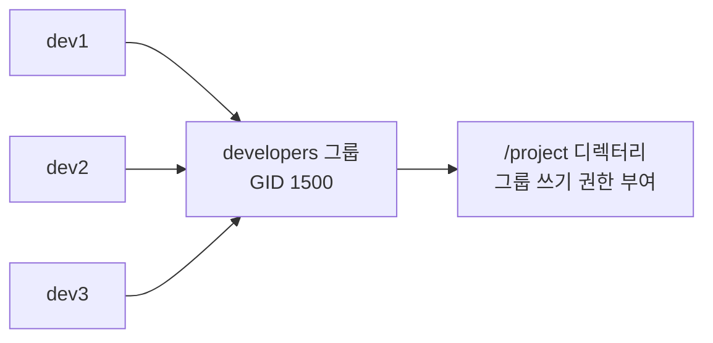
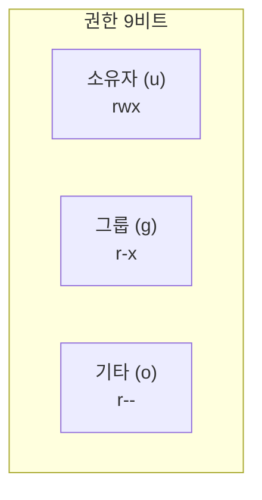
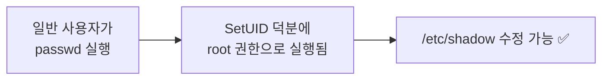
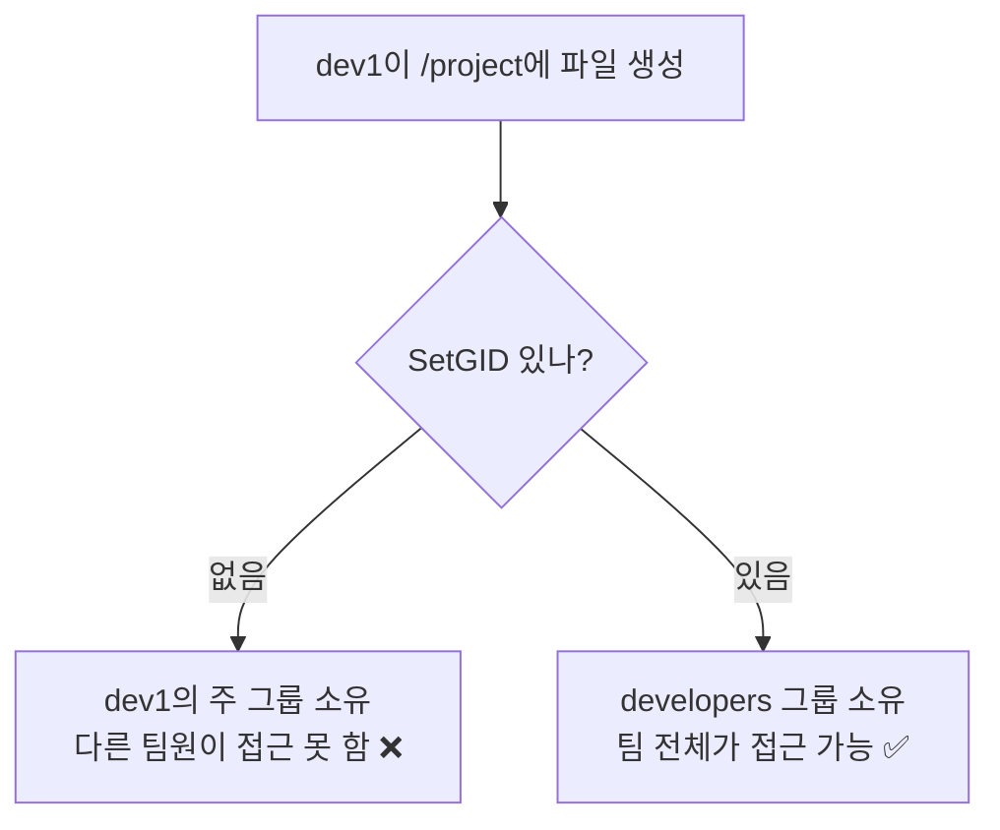
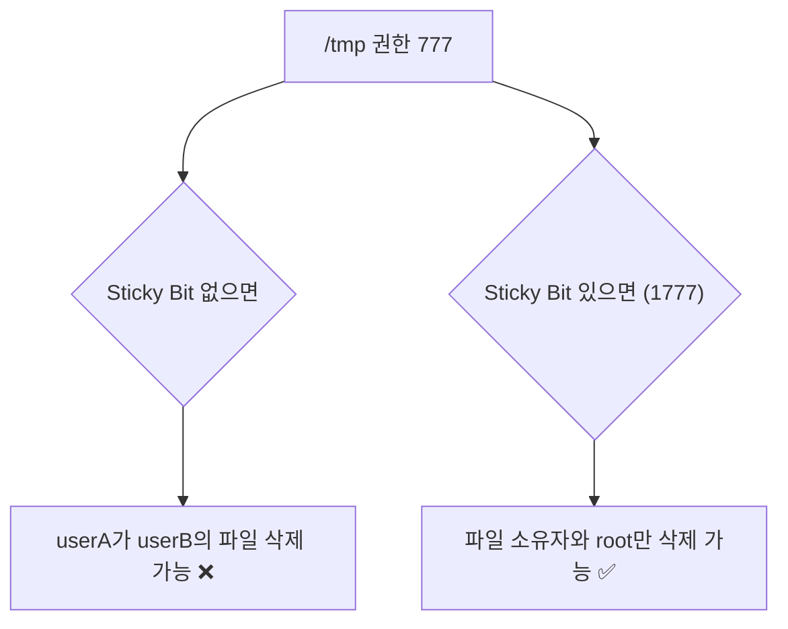

## 017. 그룹 관리와 권한 설정

### 1. 그룹이란

그룹은 **여러 사용자를 묶어 권한을 한꺼번에 관리**하기 위한 단위입니다.

개발자 5명에게 같은 디렉터리 접근 권한을 주려면,  
사용자마다 개별 설정하는 대신 **`developers` 그룹을 만들고 디렉터리를 그 그룹 소유로** 하면 됩니다.



---

### 2. `/etc/group` 과 `/etc/gshadow`

```bash
$ cat /etc/group | tail -3
wheel:x:10:masterway,admin
developers:x:1500:dev1,dev2,dev3
docker:x:991:masterway
```

#### `/etc/group` 4개 필드

```
developers : x : 1500 : dev1,dev2,dev3
     │       │     │          │
     ①       ②     ③          ④
```

| 번호 | 필드 | 설명 |
| --- | --- | --- |
| **①** | 그룹명 | |
| **②** | 그룹 비밀번호 | **`x`** = `/etc/gshadow`에 있음 |
| **③** | **GID** | 그룹 ID |
| **④** | **그룹 멤버** | **보조 그룹으로 속한 사용자 목록** (쉼표 구분) |

> **중요** : 4번째 필드에는 **보조 그룹 멤버만** 나열됩니다.  
> **주 그룹으로 속한 사용자는 여기에 나타나지 않습니다.** (`/etc/passwd`의 GID로 확인)
>
> ```bash
> # dev1의 주 그룹이 developers라면 /etc/group 목록에는 없을 수 있음
> $ id dev1
> uid=1501(dev1) gid=1500(developers) groups=1500(developers)
> ```

#### `/etc/gshadow`

```bash
$ sudo cat /etc/gshadow | grep developers
developers:!::dev1,dev2,dev3
     │      │ │      │
     │      │ │      └── 멤버
     │      │ └───────── 그룹 관리자
     │      └─────────── 비밀번호 (! = 사용 안 함)
     └────────────────── 그룹명
```

---

### 3. 그룹 관리 명령어

```bash
# 그룹 생성
$ sudo groupadd developers
$ sudo groupadd -g 1500 developers      # GID 지정
$ sudo groupadd -r sysgroup             # 시스템 그룹 (GID < 1000)

# 그룹 수정
$ sudo groupmod -n newname oldname      # 이름 변경
$ sudo groupmod -g 1600 developers      # GID 변경

# 그룹 삭제
$ sudo groupdel developers
# ❗주 그룹으로 사용 중인 그룹은 삭제 불가

# 멤버 추가 / 제거
$ sudo usermod -aG developers dev4      # 추가 (권장) ⭐
$ sudo gpasswd -a dev4 developers       # 추가
$ sudo gpasswd -d dev4 developers       # 제거
$ sudo gpasswd -A dev1 developers       # 그룹 관리자 지정

# 조회
$ groups dev1
$ id dev1
$ getent group developers
developers:x:1500:dev1,dev2,dev3
```

#### 주 그룹 전환 — `newgrp`

```bash
$ id
uid=1501(dev1) gid=1500(developers) groups=1500(developers),1600(testers)

$ newgrp testers          # 임시로 주 그룹 전환
$ id
uid=1501(dev1) gid=1600(testers) groups=1500(developers),1600(testers)
                    └── 이제 새로 만드는 파일은 testers 그룹 소유가 됨
```

> **언제 쓸까?** 여러 그룹에 속한 사용자가 **파일을 특정 그룹 소유로 만들고 싶을 때** 사용합니다.

---

### 4. 파일 권한의 구조

`ls -l` 출력을 정확히 읽는 것이 모든 것의 출발점입니다.

```
-rwxr-xr--  1  masterway  developers  4096  Jan 29 06:25  script.sh
│└─┬┘└┬┘└┬┘     │            │
│  │  │  │      │            └── 그룹 (Group)
│  │  │  │      └─────────────── 소유자 (Owner/User)
│  │  │  └────────────────────── 기타 (Others)  r--
│  │  └───────────────────────── 그룹 (Group)   r-x
│  └──────────────────────────── 소유자 (User)  rwx
└─────────────────────────────── 파일 종류
```

#### 권한의 3종류 × 3대상



| 권한 | 문자 | 숫자 | **파일**에서의 의미 | **디렉터리**에서의 의미 |
| --- | --- | --- | --- | --- |
| **읽기** | **`r`** | **4** | 내용 읽기 | **목록 조회 (`ls`)** |
| **쓰기** | **`w`** | **2** | 내용 수정 | **파일 생성·삭제·이름 변경** |
| **실행** | **`x`** | **1** | 프로그램 실행 | **디렉터리 진입 (`cd`)** |

#### 디렉터리 권한이 헷갈리는 이유 (반드시 이해)

디렉터리의 `w` 권한이 **"그 안의 파일을 지울 수 있다"** 는 뜻이라는 점이 핵심입니다.

```bash
# 파일에는 쓰기 권한이 없지만
$ ls -l /tmp/test/data.txt
-r--r--r--. 1 root root 100 Jan 29 06:25 data.txt

# 디렉터리에 쓰기 권한이 있으면
$ ls -ld /tmp/test
drwxrwxrwx. 2 root root 4096 Jan 29 06:25 /tmp/test

$ rm /tmp/test/data.txt        # ✅ 삭제됩니다!
```

> **파일 삭제 권한은 파일이 아니라 "그 파일이 들어 있는 디렉터리"의 `w` 권한이 결정합니다.**  
> 파일 목록(이름 ↔ inode 매핑)이 **디렉터리에 저장**되어 있기 때문입니다.  
> 이것이 다음에 설명할 **Sticky Bit**가 필요한 이유입니다.

또한 **`x` 없이 `r`만 있으면** 목록은 볼 수 있어도 **파일 내용에 접근할 수 없습니다.**

```bash
$ chmod 644 /tmp/dir            # r-- 이지만 x 없음
$ ls /tmp/dir                   # ✅ 목록은 보임
$ cd /tmp/dir                   # ❌ Permission denied
$ cat /tmp/dir/file.txt         # ❌ Permission denied
```

---

### 5. `chmod` — 권한 변경

#### 숫자(8진수) 방식

```
r=4, w=2, x=1  →  더해서 표현

rwx = 4+2+1 = 7
rw- = 4+2   = 6
r-x = 4+1   = 5
r-- = 4     = 4
-wx = 2+1   = 3
-w- = 2     = 2
--x = 1     = 1
--- = 0     = 0
```

```bash
$ chmod 755 script.sh      # rwxr-xr-x  (소유자 전부, 나머지 읽기+실행)
$ chmod 644 data.txt       # rw-r--r--  (일반 파일 기본)
$ chmod 700 secret/        # rwx------  (소유자만)
$ chmod 600 ~/.ssh/id_rsa  # rw-------  (개인키 필수 권한) ⭐
$ chmod 777 public/        # rwxrwxrwx  (❗위험 — 되도록 사용 금지)
```

| 권한 | 용도 |
| --- | --- |
| **644** | 일반 파일 (읽기 전용 공유) |
| **755** | 실행 파일, 디렉터리 |
| **600** | **개인키, 비밀 설정 파일** |
| **700** | 개인 디렉터리 |
| **400** | 읽기 전용 백업 |

#### 기호 방식

```bash
$ chmod u+x script.sh        # 소유자에게 실행 권한 추가
$ chmod g-w data.txt         # 그룹에서 쓰기 권한 제거
$ chmod o=r data.txt         # 기타에게 읽기만 (나머지 제거)
$ chmod a+r data.txt         # 모두에게 읽기 추가 (a = all)
$ chmod ug+rw,o-rwx file     # 여러 개 조합
```

| 대상 | 기호 |
| --- | --- |
| `u` | 소유자 (user) |
| `g` | 그룹 (group) |
| `o` | 기타 (others) |
| **`a`** | **전체 (all)** |

| 연산자 | 의미 |
| --- | --- |
| `+` | 권한 **추가** |
| `-` | 권한 **제거** |
| `=` | 권한 **지정 (나머지 제거)** |

```bash
# 재귀 적용
$ chmod -R 755 /var/www/html

# ⚠️ 디렉터리와 파일에 다른 권한을 주고 싶을 때 (실무 관용구)
$ find /var/www -type d -exec chmod 755 {} \;    # 디렉터리는 755
$ find /var/www -type f -exec chmod 644 {} \;    # 파일은 644
# 또는 대문자 X 사용 — 디렉터리와 "이미 실행 권한이 있는 파일"에만 x 부여
$ chmod -R a+rX /var/www
```

> **`chmod -R 777`을 쓰면 안 되는 이유**  
> 모든 사용자가 **파일을 수정·삭제·실행**할 수 있게 됩니다.  
> 웹 서버에서 이렇게 하면 공격자가 **악성 스크립트를 업로드하고 실행**할 수 있습니다.  
> "권한 문제가 나서 777로 했더니 됐다"는 것은 **문제를 해결한 게 아니라 보안을 없앤 것**입니다.

---

### 6. `chown` / `chgrp` — 소유권 변경

```bash
$ sudo chown newowner file.txt              # 소유자 변경
$ sudo chown newowner:newgroup file.txt     # 소유자 + 그룹
$ sudo chown :newgroup file.txt             # 그룹만
$ sudo chgrp newgroup file.txt              # 그룹만 (전용 명령)

$ sudo chown -R apache:apache /var/www/html # 재귀
$ sudo chown --reference=a.txt b.txt        # a.txt와 같은 소유권으로
```

> **소유자 변경은 root만 가능합니다.**  
> 일반 사용자가 자기 파일의 소유자를 남에게 넘길 수 있다면,  
> **디스크 쿼터를 우회**하거나 **책임을 회피**할 수 있기 때문입니다.  
> 단, 자신이 속한 그룹으로의 **그룹 변경은 소유자도 가능**합니다.

---

### 7. `umask` — 기본 권한 마스크

새로 만드는 파일과 디렉터리의 **기본 권한을 결정**합니다.

```bash
$ umask
0022

$ umask -S
u=rwx,g=rx,o=rx
```

#### 계산 방법 (시험 필수)

```
                파일          디렉터리
기본 최대 권한   666           777
umask          - 022         - 022
─────────────────────────────────────
결과            644           755
```

> **왜 파일은 666에서 시작할까?**  
> 새로 만든 **파일에 실행 권한이 자동으로 붙으면 위험**하기 때문입니다.  
> 악성 스크립트를 만들자마자 실행 가능해지는 상황을 막기 위해,  
> 파일의 기본 최대 권한은 **실행 비트를 뺀 666**입니다.  
> 디렉터리는 `x`(진입)가 없으면 쓸 수 없으므로 **777**에서 시작합니다.

#### 계산 연습

| umask | 파일 (666-umask) | 디렉터리 (777-umask) |
| --- | --- | --- |
| **022** | **644** (rw-r--r--) | **755** (rwxr-xr-x) |
| **002** | **664** (rw-rw-r--) | **775** (rwxrwxr-x) |
| **077** | **600** (rw-------) | **700** (rwx------) |
| 027 | 640 | 750 |

```bash
# 임시 변경
$ umask 077
$ touch newfile && ls -l newfile
-rw-------. 1 masterway masterway 0 Jan 29 06:25 newfile

# 영구 적용
$ echo "umask 022" >> ~/.bashrc          # 개인
$ sudo vi /etc/profile                    # 전체 사용자
```

> **주의** : umask는 **뺄셈이 아니라 비트 마스킹(AND NOT)** 입니다.  
> 실무에서는 뺄셈으로 계산해도 대부분 맞지만, umask에 `1`, `3`, `5`, `7` 같은 홀수가 들어가면  
> 단순 뺄셈이 어긋날 수 있습니다. (예: 파일 666에 umask 007 → 660)

---

### 8. 특수 권한 — SetUID, SetGID, Sticky Bit

**1급 시험의 핵심 출제 항목**입니다.

| 특수 권한 | 숫자 | 표시 위치 | 효과 |
| --- | --- | --- | --- |
| **SetUID** | **4** | 소유자 `x` 자리 → **`s`** | 실행 시 **파일 소유자 권한**으로 동작 |
| **SetGID** | **2** | 그룹 `x` 자리 → **`s`** | 실행 시 **그룹 권한**으로 동작 / **디렉터리는 그룹 상속** |
| **Sticky Bit** | **1** | 기타 `x` 자리 → **`t`** | 디렉터리에서 **소유자만 삭제 가능** |

#### SetUID — 왜 필요할까?

`passwd` 명령을 생각해 봅시다.

```bash
$ ls -l /usr/bin/passwd
-rwsr-xr-x. 1 root root 33544 Jan 29 06:25 /usr/bin/passwd
   └── s : SetUID 설정됨
```

- 비밀번호는 **`/etc/shadow`** 에 저장되는데, 이 파일은 **root만 읽고 쓸 수 있습니다.**
- 그런데 일반 사용자도 **자기 비밀번호는 바꿀 수 있어야** 합니다.



SetUID는 **"이 프로그램을 실행하는 동안만 소유자(root) 권한을 빌려준다"** 는 뜻입니다.

> **보안 주의** : SetUID 프로그램에 취약점이 있으면 **권한 상승 공격**의 통로가 됩니다.  
> 그래서 정기적으로 점검해야 합니다.
> ```bash
> # SetUID가 설정된 파일 찾기 (보안 감사 필수)
> $ sudo find / -perm -4000 -type f 2>/dev/null
> /usr/bin/passwd
> /usr/bin/sudo
> /usr/bin/su
> ```

#### SetGID — 디렉터리에서 특히 중요

```bash
# 디렉터리에 SetGID를 설정하면
$ sudo mkdir /project
$ sudo chgrp developers /project
$ sudo chmod 2775 /project
$ ls -ld /project
drwxrwsr-x. 2 root developers 4096 Jan 29 06:25 /project
       └── s
```

**효과** : 이 디렉터리 안에 만들어지는 **모든 파일이 자동으로 `developers` 그룹 소유**가 됩니다.



**협업 디렉터리를 만들 때 반드시 필요한 설정**입니다.

#### Sticky Bit — `/tmp` 의 비밀

```bash
$ ls -ld /tmp
drwxrwxrwt. 15 root root 4096 Jan 29 06:25 /tmp
         └── t : Sticky Bit
```

`/tmp`는 **모든 사용자가 쓸 수 있어야(w)** 합니다.  
그런데 앞서 배웠듯 **디렉터리에 `w` 권한이 있으면 남의 파일도 지울 수 있습니다.**



**Sticky Bit는 "쓰기 권한은 주되, 삭제는 소유자만"** 이라는 조건을 추가합니다.

#### 특수 권한 설정 방법

```bash
# 숫자 방식 — 네 자리로 표현 (맨 앞이 특수 권한)
$ chmod 4755 file        # SetUID  → -rwsr-xr-x
$ chmod 2775 dir         # SetGID  → drwxrwsr-x
$ chmod 1777 dir         # Sticky  → drwxrwxrwt
$ chmod 6755 file        # SetUID + SetGID (4+2)

# 기호 방식
$ chmod u+s file         # SetUID
$ chmod g+s dir          # SetGID
$ chmod o+t dir          # Sticky Bit
$ chmod u-s file         # 해제
```

#### 대문자 S / T 의 의미 (자주 출제)

```bash
$ chmod 4644 file
$ ls -l file
-rwSr--r--       ← 대문자 S ❗
   └── 실행 권한(x)이 없는 상태에서 SetUID만 설정됨 → 실제로는 동작 안 함
```

| 표시 | 의미 |
| --- | --- |
| **소문자 `s` / `t`** | **실행 권한(`x`)이 있음** → 정상 동작 |
| **대문자 `S` / `T`** | **실행 권한(`x`)이 없음** → 설정만 되고 효과 없음 |

---

### 9. 확장 권한 — ACL

기본 권한(소유자/그룹/기타)만으로는 **"특정 사용자 한 명에게만 권한을 주고 싶다"** 를 표현할 수 없습니다.  
이때 **ACL(Access Control List)** 을 씁니다.

```bash
# ACL 확인
$ getfacl report.txt
# file: report.txt
# owner: masterway
# group: developers
user::rw-
group::r--
other::r--

# 특정 사용자에게만 쓰기 권한 부여
$ setfacl -m u:dev1:rw report.txt

# 특정 그룹에게 부여
$ setfacl -m g:testers:r report.txt

# 디렉터리와 그 하위에 기본 ACL 적용
$ setfacl -R -m u:dev1:rwx /project
$ setfacl -d -m u:dev1:rwx /project      # 앞으로 생성될 파일에도 적용

# 제거
$ setfacl -x u:dev1 report.txt           # 특정 항목만
$ setfacl -b report.txt                  # 전부 제거
```

**ACL이 설정된 파일은 `ls -l`에 `+` 표시가 붙습니다.**

```bash
$ ls -l report.txt
-rw-rw-r--+ 1 masterway developers 1024 Jan 29 06:25 report.txt
          └── + : ACL 있음
```

---

### 10. 파일 속성 — `chattr` / `lsattr`

권한과는 별개로, **파일 시스템 수준의 속성**을 지정할 수 있습니다.

```bash
# 변경 불가 속성 (root도 수정·삭제 불가) ⭐
$ sudo chattr +i /etc/important.conf
$ lsattr /etc/important.conf
----i----------- /etc/important.conf

$ sudo rm /etc/important.conf
rm: cannot remove: Operation not permitted     ← root여도 불가 ❗

$ sudo chattr -i /etc/important.conf           # 해제

# 추가만 가능 (로그 파일 보호에 유용)
$ sudo chattr +a /var/log/audit.log
```

| 속성 | 의미 |
| --- | --- |
| **`i`** (immutable) | **수정·삭제·이름변경·링크 생성 모두 불가** |
| **`a`** (append only) | **내용 추가만 가능** (기존 내용 수정·삭제 불가) |
| `c` | 압축 저장 |
| `s` | 삭제 시 안전 삭제(0으로 덮어쓰기) |

> **실무 활용** : 중요한 설정 파일이 실수로 수정되는 것을 막을 때 `chattr +i` 를 씁니다.  
> 반대로 **침해 사고 조사 시** `lsattr`로 공격자가 걸어 둔 속성을 확인하기도 합니다.

---

### 시험 포인트 정리

| 항목 | 핵심 |
| --- | --- |
| `/etc/group` 필드 | **4개** — 이름:x:GID:멤버 |
| `/etc/group` 멤버 필드 | **보조 그룹 멤버만** (주 그룹은 안 나옴) |
| 보조 그룹 추가 | **`usermod -aG`** / `gpasswd -a` |
| 권한 값 | **r=4, w=2, x=1** |
| **디렉터리 `w`** | **파일 생성·삭제 가능** (파일 권한과 무관) |
| **디렉터리 `x`** | **진입(`cd`) 가능** |
| umask 기본 | 파일 **666**, 디렉터리 **777** 에서 뺌 |
| umask 022 | 파일 **644**, 디렉터리 **755** |
| **SetUID** | **4** — 소유자 `x`자리 `s` — **소유자 권한으로 실행** (예: `passwd`) |
| **SetGID** | **2** — 그룹 `x`자리 `s` — **디렉터리는 그룹 상속** |
| **Sticky Bit** | **1** — 기타 `x`자리 `t` — **소유자만 삭제** (예: `/tmp`) |
| 대문자 `S`/`T` | **실행 권한이 없어 효과 없음** |
| SetUID 파일 찾기 | **`find / -perm -4000`** |
| ACL 설정/확인 | **`setfacl` / `getfacl`**, `ls -l`에 **`+`** 표시 |
| 변경 불가 속성 | **`chattr +i`** (root도 삭제 불가) |
| `/tmp` 권한 | **1777** (rwxrwxrwt) |

---

### 한 줄 정리

권한은 **r=4·w=2·x=1** 로 계산하고 **디렉터리의 `w`가 파일 삭제 권한**을 결정하며,  
특수 권한은 **SetUID(4, 소유자 권한 실행) · SetGID(2, 그룹 상속) · Sticky(1, 소유자만 삭제)** 이고,  
umask는 **파일 666 / 디렉터리 777** 에서 빼서 기본 권한을 만듭니다.
