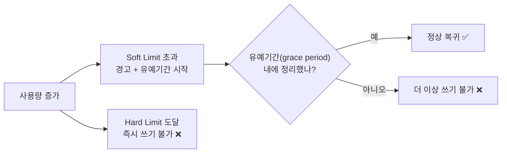
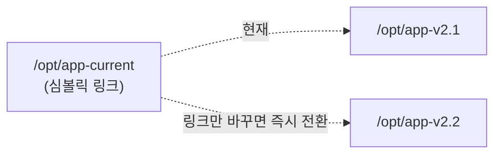

## 018. 파일 시스템 관리

### 1. 디스크 사용량 확인

#### `df` — 파일 시스템 단위 사용량

```bash
$ df -hT
Filesystem          Type      Size  Used Avail Use% Mounted on
devtmpfs            devtmpfs  1.9G     0  1.9G   0% /dev
tmpfs               tmpfs     1.9G     0  1.9G   0% /dev/shm
/dev/mapper/rl-root xfs        70G   12G   58G  18% /
/dev/sda1           xfs      1014M  245M  770M  25% /boot
```

| 옵션 | 의미 |
| --- | --- |
| **`-h`** | 사람이 읽기 쉬운 단위 (K/M/G) |
| **`-T`** | **파일 시스템 타입 표시** |
| **`-i`** | **inode 사용량** 표시 |
| `-a` | 모든 파일 시스템 |
| `-x tmpfs` | 특정 타입 제외 |

```bash
# ❗용량은 남았는데 "No space left on device" 가 날 때
$ df -i
Filesystem            Inodes   IUsed    IFree IUse% Mounted on
/dev/mapper/rl-root  36700160 36700160       0  100% /
                                                └── inode 고갈 ❗
```

> **inode 고갈** : 작은 파일이 수백만 개 쌓이면 용량은 남아도 **inode가 먼저 바닥**납니다.  
> 세션 파일, 캐시 파일, 메일 큐가 흔한 원인입니다.

#### `du` — 디렉터리/파일 단위 사용량

```bash
# 현재 디렉터리 총 사용량
$ du -sh
2.3G    .

# 하위 디렉터리별 크기
$ du -h --max-depth=1 /var | sort -rh | head -6
8.2G    /var
5.1G    /var/log
2.0G    /var/lib
900M    /var/cache
```

| 옵션 | 의미 |
| --- | --- |
| **`-s`** | 총합만 (summarize) |
| **`-h`** | 읽기 쉬운 단위 |
| **`--max-depth=N`** | N단계까지만 표시 |
| `-a` | 파일까지 표시 |
| `-c` | 마지막에 총합 |
| `-x` | 다른 파일 시스템 제외 |

#### `df` 와 `du` 의 값이 다를 때 (실무 필수 지식)

```bash
$ df -h /var
/dev/sda3   50G   45G  5.0G  90% /var       ← 45G 사용 중

$ du -sh /var
20G     /var                                 ← 20G 밖에 없음?
```

**원인** : **삭제됐지만 프로세스가 아직 열고 있는 파일**입니다.

- `rm`으로 파일을 지워도, **어떤 프로세스가 그 파일을 열어 두고 있으면** 디스크 공간은 반환되지 않습니다.
- `du`는 파일 목록을 세므로 안 보이지만, `df`는 실제 사용량이라 그대로 잡힙니다.

```bash
# 삭제됐지만 열려 있는 파일 찾기
$ sudo lsof | grep deleted
httpd  1203  apache  2w  REG  8,3  5368709120  1234  /var/log/httpd/error.log (deleted)
                                    └── 5GB를 여전히 점유 중

# 해결: 해당 프로세스 재시작 (또는 로그 파일을 비움)
$ sudo systemctl restart httpd
# 또는 프로세스를 죽이지 않고 비우기
$ sudo truncate -s 0 /proc/1203/fd/2
```

> **가장 흔한 시나리오** : 로그 파일이 커져서 `rm`으로 지웠는데 용량이 안 줄어드는 경우.  
> **로그는 `rm`이 아니라 `truncate -s 0` 또는 `> file` 로 비워야** 합니다.
> ```bash
> $ sudo truncate -s 0 /var/log/huge.log      # ✅ 안전
> $ sudo sh -c '> /var/log/huge.log'          # ✅ 동일
> ```

---

### 2. 파일 찾기 — `find`

**실기 시험과 실무 모두에서 가장 중요한 명령어** 중 하나입니다.

```bash
find [경로] [조건] [동작]
```

#### 이름·종류로 찾기

```bash
$ find /etc -name "*.conf"              # 이름 (대소문자 구분)
$ find /etc -iname "*.CONF"             # 대소문자 무시
$ find / -type f -name "passwd"         # 일반 파일만
$ find / -type d -name "log"            # 디렉터리만
$ find / -type l                        # 심볼릭 링크만
```

| `-type` | 대상 |
| --- | --- |
| **`f`** | 일반 파일 |
| **`d`** | 디렉터리 |
| **`l`** | 심볼릭 링크 |
| `b` / `c` | 블록 / 문자 장치 |
| `s` | 소켓 |

#### 크기로 찾기

```bash
$ find /var -size +100M           # 100MB 초과
$ find /var -size -1k             # 1KB 미만
$ find /var -size +1G -type f     # 1GB 넘는 파일 (디스크 정리 시 필수)

# 큰 파일 상위 10개 찾기 (실무 관용구)
$ sudo find / -type f -size +100M -exec ls -lh {} \; 2>/dev/null | sort -k5 -rh | head -10
```

| 단위 | 의미 |
| --- | --- |
| `c` | 바이트 |
| `k` | KB |
| **`M`** | **MB** |
| **`G`** | **GB** |
| `b` | 512바이트 블록 (기본) |

> **`+` 와 `-` 의 의미** : `+100M`=**초과**, `-100M`=**미만**, `100M`=정확히 일치

#### 시간으로 찾기 (시험 출제 포인트)

```bash
$ find /var/log -mtime +30        # 30일보다 이전에 수정된 파일
$ find /var/log -mtime -7         # 최근 7일 이내 수정
$ find /home -atime +90           # 90일 이상 접근 안 한 파일
$ find /tmp -mmin -60             # 최근 60분 이내 수정
```

| 옵션 | 기준 | 단위 |
| --- | --- | --- |
| **`-mtime`** | **내용 수정** 시각 | **일** |
| **`-atime`** | **접근** 시각 | 일 |
| **`-ctime`** | **inode 변경** 시각 | 일 |
| `-mmin` / `-amin` / `-cmin` | 위와 동일 | **분** |

#### 권한·소유자로 찾기

```bash
$ find / -perm -4000 -type f          # SetUID 파일 (보안 감사) ⭐
$ find / -perm -2000 -type f          # SetGID 파일
$ find / -perm -1000 -type d          # Sticky Bit 디렉터리
$ find /home -perm 777                # 정확히 777인 파일
$ find / -perm -o+w -type f           # 누구나 쓸 수 있는 파일 (위험) ⭐

$ find /home -user devuser            # 특정 사용자 소유
$ find /home -group developers        # 특정 그룹 소유
$ find / -nouser -o -nogroup          # 소유자 없는 파일 (삭제된 계정의 잔여물)
```

> **`-perm` 의 세 가지 형태 (자주 혼동)**  
> `-perm 644` : **정확히** 644  
> `-perm -644` : 644 권한을 **모두 포함** (이상)  
> `-perm /644` : 644 중 **하나라도 포함**

#### 동작 지정 — `-exec` 와 `-delete`

```bash
# 찾은 파일에 명령 실행
$ find /var/log -name "*.log" -mtime +30 -exec rm {} \;
                                                 │  │
                                                 │  └── 명령 끝 표시 (필수)
                                                 └── 찾은 파일이 들어가는 자리

# 여러 개를 한 번에 넘겨 성능 향상 (권장)
$ find /var/log -name "*.log" -mtime +30 -exec rm {} +

# 실행 전 확인
$ find /var/log -name "*.log" -mtime +30 -ok rm {} \;      # 하나씩 y/n 확인

# 삭제 전용
$ find /tmp -name "*.tmp" -mtime +7 -delete

# xargs와 조합 (파일명에 공백이 있어도 안전하게)
$ find /var/log -name "*.log" -print0 | xargs -0 rm
```

> **`\;` 와 `+` 의 차이**  
> `\;` → 파일 **하나마다** 명령을 한 번씩 실행 (느림)  
> `+` → 여러 파일을 **한 번에** 인자로 전달 (빠름)  
>
> 파일이 10,000개면 `\;`는 명령을 10,000번 실행합니다.

#### 실무에서 자주 쓰는 조합

```bash
# 30일 지난 로그 삭제
$ sudo find /var/log -name "*.log" -mtime +30 -delete

# 빈 파일·디렉터리 정리
$ find /tmp -type f -empty -delete
$ find /tmp -type d -empty -delete

# 특정 문자열이 포함된 파일 찾기 (find + grep)
$ find /etc -type f -exec grep -l "192.168.0.1" {} \; 2>/dev/null

# 권한 일괄 수정 (디렉터리와 파일 구분)
$ find /var/www -type d -exec chmod 755 {} +
$ find /var/www -type f -exec chmod 644 {} +
```

---

### 3. 빠른 검색 — `locate`, `which`, `whereis`

```bash
# locate — 미리 만들어 둔 DB에서 검색 (매우 빠름)
$ locate passwd
/etc/passwd
/usr/bin/passwd

$ sudo updatedb          # DB 갱신 (하루 한 번 자동 실행됨)
```

> **`find` vs `locate`**  
> `find` : 실시간으로 디스크를 뒤짐 → **느리지만 항상 정확**  
> `locate` : DB 조회 → **매우 빠르지만 최근 파일은 못 찾음** (DB 갱신 전)

```bash
# which — PATH에서 실행 파일 위치
$ which ls
/usr/bin/ls

# whereis — 실행 파일 + 소스 + 매뉴얼
$ whereis passwd
passwd: /usr/bin/passwd /etc/passwd /usr/share/man/man1/passwd.1.gz

# type — 내부/외부 명령어 구분
$ type cd
cd is a shell builtin
```

---

### 4. 디스크 쿼터 (Quota)

**사용자나 그룹별로 디스크 사용량을 제한**하는 기능입니다.

#### 왜 필요할까?

여러 사용자가 함께 쓰는 서버에서, 한 사용자가 **디스크를 전부 채워 버리면**  
다른 사용자는 물론 **시스템 서비스까지 멈춥니다.**

로그를 못 쓰고, 임시 파일을 못 만들어 서비스가 죽습니다.

#### 쿼터의 두 가지 기준

| 기준 | 제한 대상 |
| --- | --- |
| **블록(Block)** | **용량** (KB 단위) |
| **inode** | **파일 개수** |

#### Soft Limit 과 Hard Limit



| 구분 | 동작 |
| --- | --- |
| **Soft Limit** | 초과해도 **일정 기간(유예기간) 동안은 사용 가능**, 경고 발생 |
| **Hard Limit** | **절대 초과 불가**, 즉시 차단 |
| **Grace Period** | Soft Limit 초과 후 허용되는 **유예 기간** (기본 7일) |

#### 쿼터 설정 절차 (실기 대비)

```bash
# ① /etc/fstab 에 쿼터 옵션 추가
$ sudo vi /etc/fstab
/dev/sdb1  /home  xfs  defaults,usrquota,grpquota  0 0
                                └────┬────┘
                          usrquota=사용자, grpquota=그룹

# ② 재마운트
$ sudo mount -o remount /home
# 또는
$ sudo umount /home && sudo mount /home

# ③ 쿼터 DB 생성 (ext 계열)
$ sudo quotacheck -cugm /home
   -c: 새로 생성, -u: 사용자, -g: 그룹, -m: 마운트 유지

# ④ 쿼터 활성화
$ sudo quotaon -v /home

# ⑤ 사용자별 쿼터 설정 (편집기가 열림)
$ sudo edquota -u devuser
```

`edquota` 편집 화면:

```
Disk quotas for user devuser (uid 1501):
  Filesystem  blocks   soft    hard  inodes  soft  hard
  /dev/sdb1     2048  512000  1024000    45  5000 10000
                       │        │              │     │
                       │        │              │     └── inode Hard
                       │        │              └──────── inode Soft
                       │        └─────────────────────── 용량 Hard (KB)
                       └──────────────────────────────── 용량 Soft (KB)
```

```bash
# ⑥ 다른 사용자에게 동일 설정 복사
$ sudo edquota -p devuser dev2 dev3

# ⑦ 유예 기간 설정
$ sudo edquota -t

# 확인
$ quota -u devuser              # 특정 사용자
$ sudo repquota -a              # 전체 리포트 ⭐
$ sudo repquota -u /home

# 비활성화
$ sudo quotaoff -v /home
```

| 명령어 | 역할 |
| --- | --- |
| **`quotacheck`** | 쿼터 DB 생성·검사 |
| **`quotaon` / `quotaoff`** | 쿼터 활성화 / 비활성화 |
| **`edquota`** | **사용자·그룹 쿼터 편집** |
| **`setquota`** | 명령줄에서 직접 설정 (스크립트용) |
| **`quota`** | 사용자 쿼터 조회 |
| **`repquota`** | **전체 쿼터 리포트** |

```bash
# setquota로 한 줄에 설정 (스크립트에 유용)
$ sudo setquota -u devuser 512000 1024000 5000 10000 /home
#                         소프트  하드     소프트 하드
#                         (블록)          (inode)
```

> **XFS의 경우** : Rocky/RHEL 기본 파일 시스템인 XFS는 별도 명령을 씁니다.
> ```bash
> $ sudo xfs_quota -x -c 'limit bsoft=500m bhard=1g devuser' /home
> $ sudo xfs_quota -x -c 'report -h' /home
> ```

---

### 5. 링크 관리 복습 및 활용

```bash
# 하드 링크 — 같은 inode
$ ln original.txt hardlink.txt

# 심볼릭 링크 — 경로 참조 (실무에서 훨씬 자주 사용)
$ ln -s /opt/app-v2.1 /opt/app-current
$ ln -sf /opt/app-v2.2 /opt/app-current    # -f: 기존 링크 덮어쓰기
```

**실무 활용 — 무중단 배포 패턴**



```bash
# 새 버전 배포
$ sudo ln -sfn /opt/app-v2.2 /opt/app-current
# 문제가 생기면 즉시 롤백
$ sudo ln -sfn /opt/app-v2.1 /opt/app-current
```

> `-n` 옵션은 링크가 **디렉터리를 가리킬 때** 그 안으로 들어가지 않고 링크 자체를 바꿉니다.  
> 디렉터리 심볼릭 링크를 갱신할 때는 **`-sfn`** 을 함께 써야 합니다.

---

### 6. 파일 시스템 점검과 복구

```bash
# 파일 시스템 검사 (❗반드시 언마운트 후)
$ sudo umount /dev/sdb1
$ sudo fsck /dev/sdb1
$ sudo fsck -y /dev/sdb1           # 모든 질문에 yes
$ sudo fsck -f /dev/sdb1           # 강제 검사

# ext 계열 전용
$ sudo e2fsck -f /dev/sdb1

# XFS 전용 (fsck 대신)
$ sudo xfs_repair /dev/sdb1
$ sudo xfs_repair -n /dev/sdb1     # 검사만 (수정 안 함)

# 파일 시스템 정보
$ sudo dumpe2fs -h /dev/sdb1       # ext 계열
$ sudo xfs_info /home              # XFS
$ sudo tune2fs -l /dev/sdb1        # ext 파라미터
```

> **경고** : 마운트된 상태에서 `fsck`를 실행하면 **파일 시스템이 손상될 수 있습니다.**  
> 루트(`/`)를 검사해야 한다면 다음 부팅 시 검사하도록 예약합니다.
> ```bash
> $ sudo touch /forcefsck && sudo reboot
> ```

#### 파일 시스템 확장

```bash
# XFS — 마운트된 상태에서 확장 (축소는 불가) ⭐
$ sudo xfs_growfs /home

# ext4 — 확장과 축소 모두 가능
$ sudo resize2fs /dev/sdb1              # 전체 크기로 확장
$ sudo resize2fs /dev/sdb1 20G          # 특정 크기로
# 축소는 반드시 언마운트 후
$ sudo umount /data
$ sudo e2fsck -f /dev/sdb1
$ sudo resize2fs /dev/sdb1 10G
```

---

### 7. 스왑(Swap) 관리

**스왑**은 메모리가 부족할 때 **디스크의 일부를 메모리처럼 사용**하는 공간입니다.

```bash
# 현재 스왑 확인
$ swapon --show
NAME      TYPE      SIZE USED PRIO
/dev/dm-1 partition   2G   0B   -2

$ free -h
              total   used   free  shared  buff/cache  available
Mem:           15Gi  3.2Gi  7.7Gi   128Mi       4.6Gi        11Gi
Swap:         2.0Gi     0B  2.0Gi

# 스왑 파일 추가 (파티션 없이)
$ sudo dd if=/dev/zero of=/swapfile bs=1M count=2048    # 2GB
$ sudo chmod 600 /swapfile                               # ❗권한 필수
$ sudo mkswap /swapfile
$ sudo swapon /swapfile

# 영구 적용 — /etc/fstab에 추가
/swapfile  swap  swap  defaults  0 0

# 비활성화
$ sudo swapoff /swapfile
```

| 명령어 | 역할 |
| --- | --- |
| **`mkswap`** | 스왑 영역 생성(포맷) |
| **`swapon`** | 스왑 활성화 |
| **`swapoff`** | 스왑 비활성화 |
| `swapon --show` / `swapon -s` | 스왑 목록 |

#### swappiness — 스왑 사용 성향

```bash
$ cat /proc/sys/vm/swappiness
30

# 0에 가까울수록 스왑을 덜 씀 (메모리 우선)
$ sudo sysctl -w vm.swappiness=10
$ echo "vm.swappiness = 10" | sudo tee -a /etc/sysctl.conf
```

> **DB 서버는 swappiness를 낮게(1~10)** 설정하는 것이 일반적입니다.  
> 스왑에 데이터가 내려가면 **응답 속도가 급격히 느려지기** 때문입니다.

---

### 시험 포인트 정리

| 항목 | 핵심 |
| --- | --- |
| 파일 시스템 사용량 | **`df -hT`** |
| **inode 사용량** | **`df -i`** |
| 디렉터리 사용량 | **`du -sh`**, `du -h --max-depth=1` |
| `df` ≠ `du` | **삭제됐지만 열려 있는 파일** — `lsof \| grep deleted` |
| 로그 비우기 | `rm` 대신 **`truncate -s 0`** |
| `find -mtime +30` | **30일 이전** 수정 |
| `find -size +100M` | **100MB 초과** |
| SetUID 찾기 | **`find / -perm -4000`** |
| `-exec {} \;` vs `+` | 하나씩 / **한 번에 (빠름)** |
| `find` vs `locate` | 실시간·정확 / **DB조회·빠름** |
| 쿼터 대상 | **블록(용량) + inode(개수)** |
| **Soft Limit** | 유예기간 동안 초과 허용 |
| **Hard Limit** | **즉시 차단** |
| 쿼터 fstab 옵션 | **`usrquota`, `grpquota`** |
| 쿼터 편집 | **`edquota`** |
| 쿼터 리포트 | **`repquota`** |
| XFS | **확장 가능, 축소 불가** (`xfs_growfs`) |
| 스왑 생성 순서 | **`mkswap` → `swapon`** |

---

### 한 줄 정리

`df`는 **파일 시스템**, `du`는 **디렉터리** 단위로 사용량을 보며 값이 다르면 **삭제됐지만 열린 파일**을 의심하고,  
`find`는 **`-name`·`-size`·`-mtime`·`-perm`** 조건과 **`-exec`** 동작을 조합해 사용하며,  
쿼터는 **블록(용량)과 inode(개수)** 를 **Soft(유예)·Hard(즉시 차단)** 로 제한합니다.
