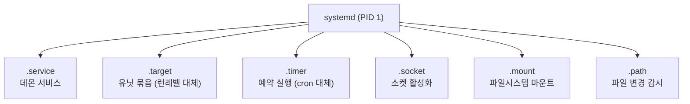
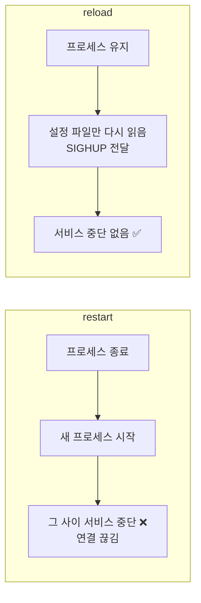

## 019. 프로세스 관리

> [011. 프로세스의 이해]에서 개념을 다뤘다면, 이 문서는 **실제 운영에서 프로세스를 다루는 방법**에 집중합니다.

### 1. systemd — 현대 리눅스의 서비스 관리자

RHEL 7 / Rocky 8 이후 모든 서비스는 **systemd**가 관리합니다.



#### 서비스 관리 기본 명령

```bash
$ sudo systemctl start httpd          # 시작
$ sudo systemctl stop httpd           # 중지
$ sudo systemctl restart httpd        # 재시작 (중단 발생)
$ sudo systemctl reload httpd         # 설정만 다시 읽기 (무중단) ⭐
$ sudo systemctl reload-or-restart httpd

$ sudo systemctl enable httpd         # 부팅 시 자동 시작 등록
$ sudo systemctl disable httpd        # 자동 시작 해제
$ sudo systemctl enable --now httpd   # 등록 + 즉시 시작 ⭐

$ systemctl status httpd              # 상태 확인
$ systemctl is-active httpd           # 실행 중인가?
$ systemctl is-enabled httpd          # 자동 시작 설정됐나?
$ systemctl is-failed httpd           # 실패 상태인가?

$ sudo systemctl mask httpd           # 완전 차단 (start도 불가) ⭐
$ sudo systemctl unmask httpd
```

#### `restart` vs `reload` — 왜 구분할까



운영 중인 웹 서버에서 설정만 바꿨다면 **반드시 `reload`** 를 써야 사용자 연결이 끊기지 않습니다.

> **`disable` vs `mask` 의 차이 (시험 출제)**  
> `disable` : 자동 시작만 해제 → **수동으로 `start`는 가능**  
> `mask` : `/dev/null`로 심볼릭 링크 → **`start` 자체가 불가능** (완전 차단)

#### 서비스 목록 조회

```bash
# 실행 중인 서비스
$ systemctl list-units --type=service
$ systemctl list-units --type=service --state=running

# 실패한 서비스만 (장애 점검 시 첫 번째로 확인) ⭐
$ systemctl --failed
$ systemctl list-units --state=failed

# 자동 시작 설정 목록
$ systemctl list-unit-files --type=service --state=enabled

# 의존 관계 확인
$ systemctl list-dependencies httpd
```

#### 유닛 파일 구조

```bash
$ systemctl cat sshd.service
```

```ini
[Unit]
Description=OpenSSH server daemon
After=network.target sshd-keygen.target      # 이후에 시작
Wants=sshd-keygen.target

[Service]
Type=notify                                   # 시작 방식
ExecStart=/usr/sbin/sshd -D $OPTIONS
ExecReload=/bin/kill -HUP $MAINPID           # reload 시 실행할 명령
Restart=on-failure                            # 실패 시 자동 재시작 ⭐
RestartSec=42s

[Install]
WantedBy=multi-user.target                    # enable 시 연결될 타깃
```

| 섹션 | 역할 |
| --- | --- |
| **`[Unit]`** | 설명, **의존 관계** (`After`, `Requires`, `Wants`) |
| **`[Service]`** | 실행 방법 (`ExecStart`, `Restart`, `User`) |
| **`[Install]`** | `enable` 시 어느 타깃에 연결할지 |

| `Type=` | 의미 |
| --- | --- |
| `simple` | ExecStart가 메인 프로세스 (기본값) |
| `forking` | 프로세스가 fork 후 부모가 종료되는 전통적 데몬 |
| `oneshot` | 한 번 실행하고 종료 |
| `notify` | 준비 완료를 systemd에 알림 |

#### 사용자 정의 서비스 만들기 (실기 대비)

```bash
$ sudo vi /etc/systemd/system/myapp.service
```

```ini
[Unit]
Description=My Application
After=network.target

[Service]
Type=simple
User=appuser
WorkingDirectory=/opt/myapp
ExecStart=/opt/myapp/bin/start.sh
Restart=always
RestartSec=10
StandardOutput=journal
StandardError=journal

[Install]
WantedBy=multi-user.target
```

```bash
# ❗유닛 파일을 수정했으면 반드시 데몬 리로드
$ sudo systemctl daemon-reload
$ sudo systemctl enable --now myapp
$ systemctl status myapp
```

> **가장 흔한 실수** : 유닛 파일을 만들거나 수정한 뒤 **`daemon-reload`를 빠뜨리는 것**입니다.  
> systemd가 변경 사항을 읽지 못해 "Unit not found" 또는 예전 설정으로 동작합니다.

#### 유닛 파일 위치와 우선순위

| 경로 | 용도 | 우선순위 |
| --- | --- | --- |
| `/etc/systemd/system/` | **관리자가 만든/수정한 것** | **가장 높음** |
| `/run/systemd/system/` | 런타임 생성 | 중간 |
| `/usr/lib/systemd/system/` | **패키지가 설치한 기본 유닛** | 낮음 |

```bash
# 패키지 원본을 건드리지 않고 일부만 덮어쓰기 (권장)
$ sudo systemctl edit httpd
# → /etc/systemd/system/httpd.service.d/override.conf 생성됨
```

---

### 2. 프로세스 상태 확인 (운영 관점)

```bash
# CPU 사용 상위
$ ps aux --sort=-%cpu | head -6

# 메모리 사용 상위
$ ps aux --sort=-%mem | head -6

# 특정 서비스의 프로세스만
$ ps -ef | grep [h]ttpd          # [h] 트릭 — grep 자기 자신 제외
$ pgrep -a httpd                 # 더 깔끔

# 프로세스 트리
$ ps -ef --forest
$ pstree -p httpd

# systemd 관점에서 보기 (cgroup 단위)
$ systemd-cgtop
$ systemctl status httpd         # 하위 프로세스까지 함께 표시
```

#### 실시간 모니터링

```bash
$ top
$ htop                    # 더 보기 좋음 (별도 설치)
$ top -p 1234,5678        # 특정 PID만
$ watch -n 2 'ps aux --sort=-%mem | head -10'
```

---

### 3. 프로세스 종료 (운영 관점)

```bash
# 순서대로 시도
$ sudo systemctl stop httpd       # ① 서비스는 systemctl로 (가장 안전)
$ kill 1234                       # ② SIGTERM
$ kill -9 1234                    # ③ 최후의 수단

# 이름으로
$ pkill -f "python myapp.py"      # -f: 전체 명령줄로 매칭 ⭐
$ killall httpd
$ pkill -u devuser                # 특정 사용자의 모든 프로세스
```

> **`pkill -f` 가 유용한 이유**  
> `pkill python` 은 **모든 파이썬 프로세스**를 죽입니다.  
> `pkill -f "python myapp.py"` 는 **해당 스크립트만** 정확히 지정합니다.

#### 안 죽는 프로세스 대처

```bash
# 상태 확인
$ ps -o pid,stat,wchan,comm -p 1234
  PID STAT WCHAN  COMMAND
 1234 D    io_schedule  myapp
      └── D 상태 = 인터럽트 불가 (kill -9도 안 통함)
```

**`D` 상태**는 대개 **디스크·NFS I/O 대기**입니다.  
프로세스가 문제가 아니라 **저장장치나 네트워크 마운트가 문제**이므로,  
`dmesg`와 `df`로 원인을 찾아야 합니다.

```bash
$ dmesg -T | tail -20              # I/O 오류 확인
$ df -h                            # NFS 마운트 응답 확인
$ mount | grep nfs
```

---

### 4. 프로세스 자원 제한 — `ulimit`

한 사용자나 프로세스가 시스템 자원을 독점하지 못하게 제한합니다.

```bash
# 현재 제한 확인
$ ulimit -a
core file size          (blocks, -c) 0
data seg size           (kbytes, -d) unlimited
file size               (blocks, -f) unlimited
max locked memory       (kbytes, -l) 64
open files                      (-n) 1024
max user processes              (-u) 15043
virtual memory          (kbytes, -v) unlimited

# 임시 변경 (현재 셸에서만)
$ ulimit -n 4096         # 열 수 있는 파일 수
$ ulimit -u 2048         # 프로세스 수
```

| 옵션 | 제한 대상 |
| --- | --- |
| **`-n`** | **열 수 있는 파일 개수 (file descriptor)** ⭐ |
| **`-u`** | **최대 프로세스 수** |
| `-c` | 코어 덤프 크기 |
| `-f` | 생성 가능한 파일 크기 |
| `-v` | 가상 메모리 |
| `-s` | 스택 크기 |
| **`-a`** | 전체 확인 |
| `-H` / `-S` | Hard / Soft 제한 |

#### 영구 설정 — `/etc/security/limits.conf`

```bash
$ sudo vi /etc/security/limits.conf
```

```
# <도메인>   <타입>   <항목>    <값>
devuser      soft     nofile    4096
devuser      hard     nofile    8192
@developers  soft     nproc     2048
*            hard     core      0
```

| 필드 | 값 |
| --- | --- |
| 도메인 | 사용자명, `@그룹명`, `*`(전체) |
| 타입 | **`soft`**(경고 후 조정 가능) / **`hard`**(절대 상한) |
| 항목 | `nofile`(파일 수), `nproc`(프로세스 수), `core`, `memlock` |

> **실무에서 자주 만나는 오류**  
> **"Too many open files"** → `nofile` 제한 초과입니다.  
> 웹 서버·DB 서버는 기본값 1024가 부족한 경우가 많아 늘려 줘야 합니다.
>
> **systemd 서비스는 `limits.conf`가 적용되지 않습니다.**  
> 유닛 파일에 직접 지정해야 합니다.
> ```ini
> [Service]
> LimitNOFILE=65536
> LimitNPROC=4096
> ```

#### fork bomb 방어

```bash
# nproc을 제한하지 않으면 이런 공격에 시스템이 마비됩니다
# :(){ :|:& };:      ← 실행하지 마세요

$ sudo vi /etc/security/limits.d/99-nproc.conf
*    soft    nproc    4096
root soft    nproc    unlimited
```

---

### 5. cgroup — 자원 그룹 제한

systemd는 **cgroup(Control Group)** 을 이용해 서비스 단위로 자원을 제한합니다.

```bash
# 서비스의 자원 사용 현황
$ systemd-cgtop

# 서비스에 자원 제한 걸기
$ sudo systemctl set-property httpd.service CPUQuota=50%
$ sudo systemctl set-property httpd.service MemoryMax=2G
$ sudo systemctl set-property httpd.service TasksMax=500
```

유닛 파일에 직접 지정할 수도 있습니다.

```ini
[Service]
CPUQuota=50%           # CPU 최대 50% (코어 0.5개 분량)
MemoryMax=2G           # 메모리 상한 (초과 시 OOM Kill)
MemoryHigh=1500M       # 이 값을 넘으면 회수 압력 증가
TasksMax=500           # 최대 프로세스/스레드 수
IOWeight=100           # I/O 우선순위
```

> **왜 cgroup이 필요할까?**  
> `nice`는 **CPU 우선순위만** 조절합니다. 메모리나 I/O는 제어하지 못합니다.  
> cgroup은 **CPU·메모리·I/O·프로세스 수를 그룹 단위로 확실히 격리**합니다.  
> Docker와 Kubernetes의 컨테이너 격리도 이 cgroup 위에서 동작합니다.

---

### 6. OOM Killer — 메모리 부족 시 무슨 일이 일어나나

메모리가 완전히 고갈되면 커널은 **OOM(Out Of Memory) Killer**를 발동해  
**프로세스를 강제로 죽여서** 시스템을 살립니다.

```bash
# OOM 발생 기록 확인
$ dmesg -T | grep -i "out of memory"
$ sudo journalctl -k | grep -i oom
[Thu Jan 29 06:25:11 2026] Out of memory: Killed process 1234 (mysqld)
    total-vm:8388608kB, anon-rss:6291456kB
```

#### 어떤 프로세스가 죽을까?

커널은 **oom_score** 가 가장 높은 프로세스를 선택합니다.  
메모리를 많이 쓸수록 점수가 높습니다.

```bash
# 현재 점수 확인
$ cat /proc/1234/oom_score

# 중요한 프로세스는 죽지 않게 보호 (-1000 ~ 1000)
$ echo -1000 | sudo tee /proc/1234/oom_score_adj    # 절대 죽이지 않음
$ echo 500 | sudo tee /proc/5678/oom_score_adj      # 우선적으로 죽임
```

systemd 유닛에서도 지정할 수 있습니다.

```ini
[Service]
OOMScoreAdjust=-500
```

> **실무 팁** : DB 서버가 갑자기 죽었는데 로그에 아무것도 없다면 **OOM Killer를 의심**해야 합니다.  
> `dmesg`나 `journalctl -k` 를 확인하면 커널이 죽인 기록이 남아 있습니다.

---

### 7. 프로세스 추적과 디버깅

```bash
# 시스템 호출 추적
$ strace -p 1234                    # 실행 중인 프로세스에 붙기
$ strace -c ls                      # 통계만
$ strace -e trace=open,read ls      # 특정 호출만
$ strace -f -o out.txt ./app        # 자식 프로세스까지, 파일로 저장

# 라이브러리 호출 추적
$ ltrace ./app

# 프로세스가 연 파일 확인
$ lsof -p 1234
$ lsof -u devuser                   # 사용자별
$ lsof -i :80                       # 포트별 ⭐
$ lsof /var/log/messages            # 특정 파일을 누가 쓰는지

# 프로세스 정보 직접 조회
$ cat /proc/1234/status             # 상태 요약
$ cat /proc/1234/cmdline | tr '\0' ' '   # 실행 명령줄
$ ls -l /proc/1234/cwd              # 작업 디렉터리
$ ls -l /proc/1234/exe              # 실행 파일 경로
$ ls -l /proc/1234/fd/              # 열린 파일 디스크립터 ⭐
$ cat /proc/1234/limits             # 이 프로세스의 ulimit
```

> **실무 사례** : "프로세스가 멈춘 것 같은데 뭘 하고 있는지 모르겠다"  
> → `strace -p PID` 로 붙어 보면 **어떤 시스템 호출에서 대기 중인지** 즉시 알 수 있습니다.  
> 대개 특정 파일이나 네트워크 응답을 기다리고 있습니다.

---

### 8. 부하 확인 — Load Average

```bash
$ uptime
 06:25:11 up 5 days,  2:14,  2 users,  load average: 1.25, 0.98, 0.75
                                                      1분   5분   15분
```

#### Load Average 를 어떻게 읽어야 할까?

**실행 중이거나 실행을 기다리는 프로세스의 평균 개수**입니다.

```bash
# CPU 코어 수 확인
$ nproc
4
```

| Load Average | 4코어 시스템에서의 해석 |
| --- | --- |
| **1.0** | 코어 1개 분량 사용 → 여유로움 |
| **4.0** | **코어 수와 동일 → 100% 사용, 포화 직전** |
| **8.0** | 코어 수의 2배 → **대기가 발생, 과부하** |

> **핵심** : Load Average는 **CPU 코어 수와 비교**해야 의미가 있습니다.  
> 1코어에서 4.0은 심각한 과부하지만, 16코어에서 4.0은 여유롭습니다.

#### 부하의 원인 구분

```bash
$ top
%Cpu(s):  5.2 us,  2.1 sy,  0.0 ni, 12.3 id, 80.1 wa,  0.0 hi,  0.3 si
                                              └── wa가 80%! ❗
```

| 지표가 높음 | 원인 | 확인 방법 |
| --- | --- | --- |
| **`us`** (user) | 응용 프로그램 CPU 사용 | `ps aux --sort=-%cpu` |
| **`sy`** (system) | 커널 작업 과다 (시스템 호출, 인터럽트) | `strace`, 네트워크 확인 |
| **`wa`** (iowait) | **디스크 I/O 병목** ⭐ | `iostat -x 1`, `iotop` |
| **`si`** (softirq) | 네트워크 인터럽트 과다 | `sar -n DEV 1` |

```bash
# I/O 병목 상세 확인
$ iostat -x 1 3
$ sudo iotop -o          # I/O를 실제로 쓰는 프로세스만
$ vmstat 1 5
```

> **Load Average는 높은데 CPU는 한가한 경우**  
> → `wa`(I/O 대기)가 높을 가능성이 큽니다.  
> 리눅스의 Load Average는 **CPU 대기뿐 아니라 `D` 상태(I/O 대기) 프로세스도 포함**하기 때문입니다.

---

### 시험 포인트 정리

| 항목 | 핵심 |
| --- | --- |
| 서비스 시작·자동시작 동시 | **`systemctl enable --now`** |
| **`restart` vs `reload`** | 중단 발생 / **무중단(설정만 재읽기)** |
| **`disable` vs `mask`** | 자동시작만 해제 / **start 자체 불가** |
| 유닛 파일 수정 후 | **반드시 `systemctl daemon-reload`** |
| 관리자 유닛 위치 | **`/etc/systemd/system/`** (우선순위 높음) |
| 패키지 유닛 위치 | `/usr/lib/systemd/system/` |
| 실패한 서비스 확인 | **`systemctl --failed`** |
| 자동 재시작 설정 | `Restart=always` / `on-failure` |
| 열린 파일 수 제한 | **`ulimit -n`** / `nofile` |
| 프로세스 수 제한 | **`ulimit -u`** / `nproc` |
| 영구 제한 설정 | **`/etc/security/limits.conf`** |
| systemd 서비스 제한 | 유닛 파일의 **`LimitNOFILE`** |
| 자원 그룹 격리 | **cgroup** (`CPUQuota`, `MemoryMax`) |
| 메모리 고갈 시 | **OOM Killer** — `dmesg`에 기록 |
| OOM 보호 | **`oom_score_adj`** (-1000 = 보호) |
| Load Average 기준 | **CPU 코어 수와 비교** |
| `wa` 높음 | **디스크 I/O 병목** |
| 시스템 호출 추적 | **`strace -p PID`** |
| 열린 파일 확인 | **`lsof`** |

---

### 한 줄 정리

서비스는 **`systemctl`로 관리**하되 설정 변경은 **무중단인 `reload`**, 유닛 수정 후에는 **`daemon-reload`** 가 필수이고,  
자원 제한은 **`ulimit`/`limits.conf`(사용자)와 cgroup(서비스)** 로 나뉘며,  
**Load Average는 CPU 코어 수와 비교**해서 해석하고 **`wa`가 높으면 디스크 I/O 병목**입니다.
