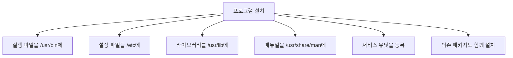
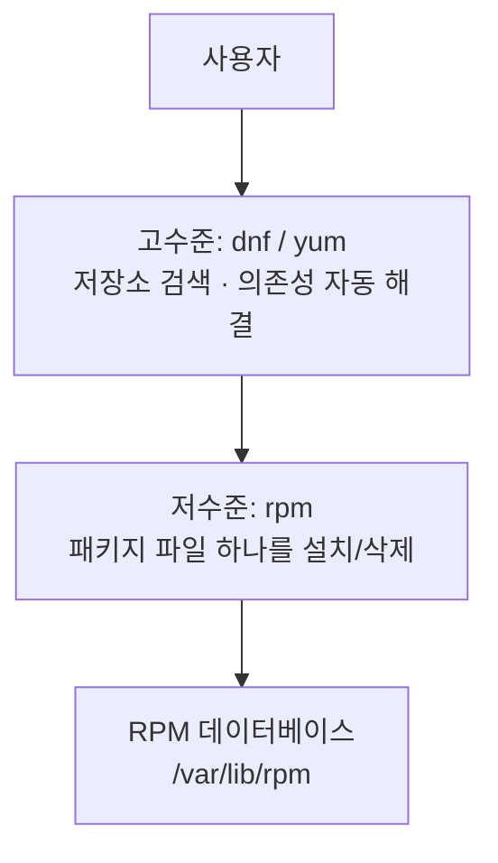
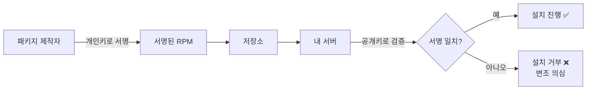

## 020. 패키지 관리 - RPM과 YUM/DNF

### 1. 패키지 관리자가 필요한 이유

프로그램을 설치한다는 것은 단순히 파일을 복사하는 일이 아닙니다.



이것을 손으로 하면

- 어떤 파일이 어디에 설치됐는지 **기록이 남지 않아** 삭제할 수 없고
- 필요한 **의존 라이브러리를 일일이 찾아** 설치해야 하며
- 업데이트할 때 **기존 파일을 어떻게 처리할지** 알 수 없습니다

**패키지 관리자는 이 모든 것을 데이터베이스로 추적**합니다.

---

### 2. 저수준과 고수준 도구

Red Hat 계열에는 두 층의 도구가 있습니다.



| 구분 | **`rpm`** | **`dnf` / `yum`** |
| --- | --- | --- |
| 대상 | **로컬 `.rpm` 파일 하나** | **저장소(Repository)** |
| 의존성 | **처리 안 함** (없으면 에러) | **자동 해결** ⭐ |
| 인터넷 | 불필요 | 필요 |
| 사용 시점 | 직접 받은 rpm 파일 설치 | **평소 대부분** |

> **RHEL 8 / Rocky 8부터 `yum`은 `dnf`의 심볼릭 링크**입니다.  
> 두 명령은 사실상 동일하며, 신규 문서는 `dnf`를 씁니다.
> ```bash
> $ ls -l /usr/bin/yum
> lrwxrwxrwx. 1 root root 5 Jan 30 06:25 /usr/bin/yum -> dnf-3
> ```

---

### 3. RPM 패키지 파일 이름 구조

**시험에 매우 자주 나옵니다.**

```
httpd - 2.4.37 - 51.module+el8.5.0 . x86_64 . rpm
  │       │            │              │        │
  ①       ②            ③              ④        ⑤
```

| 번호 | 항목 | 설명 |
| --- | --- | --- |
| **①** | **패키지 이름** | `httpd` |
| **②** | **버전 (Version)** | `2.4.37` — 원 개발자가 붙인 버전 |
| **③** | **릴리스 (Release)** | `51.module+el8` — **배포판이 패키징한 횟수** |
| **④** | **아키텍처** | `x86_64`, `noarch`, `i686`, `aarch64` |
| **⑤** | 확장자 | `.rpm` |

| 아키텍처 | 의미 |
| --- | --- |
| **`x86_64`** | 64비트 인텔/AMD |
| `i386` / `i686` | 32비트 |
| **`noarch`** | **아키텍처 무관** (문서, 스크립트, 폰트) |
| `aarch64` | 64비트 ARM |
| `src` | 소스 RPM |

> **버전(Version)과 릴리스(Release)의 차이**  
> **버전**은 원 개발자(Apache 재단)가 붙인 번호,  
> **릴리스**는 같은 버전을 **배포판이 몇 번째로 패키징했는지**를 나타냅니다.  
> 보안 패치만 적용하면 버전은 그대로 두고 릴리스만 올립니다.

---

### 4. `rpm` 명령어

#### 설치 / 업그레이드 / 삭제

```bash
# 설치
$ sudo rpm -ivh package.rpm
     │  │││
     │  ││└── h: 진행 상황을 # 로 표시 (hash)
     │  │└─── v: 상세 출력 (verbose)
     │  └──── i: 설치 (install)
     └─────── 명령

# 업그레이드 (없으면 새로 설치) ⭐ 실무에서 주로 사용
$ sudo rpm -Uvh package.rpm

# 업그레이드 (기존에 설치된 경우에만)
$ sudo rpm -Fvh package.rpm

# 삭제
$ sudo rpm -e package-name
$ sudo rpm -e --nodeps package-name      # 의존성 무시 (❗위험)

# 강제 옵션
$ sudo rpm -ivh --force package.rpm      # 강제 설치
$ sudo rpm -ivh --nodeps package.rpm     # 의존성 검사 생략
$ sudo rpm -ivh --test package.rpm       # 실제로 설치하지 않고 테스트만 ⭐
```

| 옵션 | 의미 |
| --- | --- |
| **`-i`** | **설치 (install)** |
| **`-U`** | **업그레이드 (없으면 설치)** ⭐ |
| **`-F`** | 업그레이드 (**이미 설치된 것만**, freshen) |
| **`-e`** | **삭제 (erase)** |
| `-v` | 상세 출력 |
| `-h` | 진행 표시 |
| `--nodeps` | 의존성 검사 생략 |
| `--force` | 강제 |
| `--test` | 테스트만 |

> **`-i` vs `-U` vs `-F` (시험 단골)**  
> `-i` : 설치. **이미 있으면 에러**  
> `-U` : **없으면 설치, 있으면 업그레이드** ← 가장 안전하고 일반적  
> `-F` : **이미 설치된 것만 업그레이드**. 없으면 아무것도 안 함

#### 조회 (`-q`)

```bash
# 설치 여부 확인
$ rpm -q httpd
httpd-2.4.37-51.module+el8.5.0.x86_64

# 설치된 전체 패키지
$ rpm -qa
$ rpm -qa | grep httpd
$ rpm -qa | wc -l                     # 설치된 패키지 수

# 패키지 상세 정보
$ rpm -qi httpd
Name        : httpd
Version     : 2.4.37
Release     : 51.module+el8.5.0
Architecture: x86_64
Install Date: Thu 30 Jan 2026 06:25:11 AM KST
Group       : System Environment/Daemons
Size        : 4468969
License     : ASL 2.0
Summary     : Apache HTTP Server

# 패키지에 포함된 파일 목록
$ rpm -ql httpd | head -5
/etc/httpd
/etc/httpd/conf
/etc/httpd/conf/httpd.conf
/usr/sbin/httpd

# 설정 파일만
$ rpm -qc httpd

# 문서 파일만
$ rpm -qd httpd

# ⭐ 특정 파일이 어느 패키지 소속인지 (매우 자주 사용)
$ rpm -qf /usr/sbin/httpd
httpd-2.4.37-51.module+el8.5.0.x86_64

$ rpm -qf $(which ls)
coreutils-8.30-15.el8.x86_64

# 의존성 확인
$ rpm -qR httpd                       # 이 패키지가 필요로 하는 것
$ rpm -q --whatrequires httpd         # 이 패키지를 필요로 하는 것

# 설치하지 않은 rpm 파일 조회 (-p 추가)
$ rpm -qip package.rpm                # 정보
$ rpm -qlp package.rpm                # 파일 목록
```

| 조회 옵션 | 의미 |
| --- | --- |
| **`-qa`** | 설치된 **모든** 패키지 |
| **`-qi`** | 패키지 **정보** |
| **`-ql`** | 패키지의 **파일 목록** |
| **`-qf 파일`** | **파일이 속한 패키지** ⭐ |
| `-qc` | 설정 파일 |
| `-qd` | 문서 파일 |
| `-qR` | 의존성 |
| **`-p`** | **설치되지 않은 rpm 파일** 대상 |

#### 검증 (`-V`)

```bash
# 설치 후 파일이 변경됐는지 검사
$ rpm -V httpd
S.5....T.  c /etc/httpd/conf/httpd.conf
│││││││││
```

| 문자 | 변경된 항목 |
| --- | --- |
| **`S`** | 파일 **크기(Size)** |
| **`M`** | **권한(Mode)** |
| **`5`** | **MD5 체크섬** (내용 변경) |
| `D` | 장치 번호 |
| `L` | 심볼릭 링크 |
| **`U`** | **소유자(User)** |
| **`G`** | **그룹(Group)** |
| **`T`** | **수정 시각(mTime)** |
| `c` | 설정 파일임을 표시 |

```bash
# 전체 패키지 검증 (침해 사고 조사에 유용) ⭐
$ sudo rpm -Va | head -20
```

> **보안 활용** : 시스템이 해킹된 것 같을 때 `rpm -Va` 로 검증하면  
> **`/usr/bin/ls` 같은 기본 명령어가 변조되었는지** 확인할 수 있습니다.  
> (단, 공격자가 RPM DB까지 조작했다면 신뢰할 수 없으므로 외부 매체로 검증해야 합니다.)

#### RPM 데이터베이스

```bash
$ ls /var/lib/rpm/

# DB 손상 시 복구
$ sudo rpm --rebuilddb
```

---

### 5. `dnf` / `yum` — 고수준 패키지 관리

#### 설치와 삭제

```bash
# 설치
$ sudo dnf install httpd
$ sudo dnf install -y httpd nginx      # -y: 확인 없이 진행
$ sudo dnf install ./local.rpm         # 로컬 파일도 의존성 해결하며 설치 ⭐
$ sudo dnf localinstall ./local.rpm    # yum 시절 명령 (dnf에서도 동작)

# 삭제
$ sudo dnf remove httpd
$ sudo dnf autoremove                  # 더 이상 필요 없는 의존 패키지 정리

# 업데이트
$ sudo dnf check-update                # 업데이트 가능 목록만 확인
$ sudo dnf update                      # 전체 업데이트
$ sudo dnf update httpd                # 특정 패키지만
$ sudo dnf upgrade                     # update와 동일 (dnf)

# 다운그레이드
$ sudo dnf downgrade httpd
```

#### 검색과 정보 조회

```bash
$ dnf search httpd                     # 이름·설명에서 검색
$ dnf search all "web server"          # 전체 검색
$ dnf info httpd                       # 패키지 정보
$ dnf list installed                   # 설치된 것
$ dnf list available                   # 설치 가능한 것
$ dnf list httpd                       # 특정 패키지 상태

# ⭐ 어떤 패키지가 이 명령어를 제공하는지 (매우 유용)
$ dnf provides /usr/sbin/httpd
$ dnf provides "*/nginx"

# 의존성
$ dnf deplist httpd
$ dnf repoquery --requires httpd
```

> **실무 사례** : `command not found` 가 났을 때  
> ```bash
> $ dnf provides ifconfig
> net-tools-2.0-0.52.el8.x86_64 : Basic networking tools
> $ sudo dnf install net-tools
> ```

#### 그룹 패키지

여러 패키지를 묶어 한 번에 설치합니다.

```bash
$ dnf group list                       # 그룹 목록
$ dnf group info "Development Tools"   # 그룹에 포함된 패키지
$ sudo dnf group install "Development Tools"    # ⭐ 컴파일 도구 일괄 설치
$ sudo dnf group install "Server with GUI"      # GUI 환경
$ sudo dnf group remove "Development Tools"
```

#### 히스토리와 롤백 (dnf의 강력한 기능)

```bash
# 작업 이력
$ sudo dnf history
ID | Command line          | Date and time    | Action(s)  | Altered
---------------------------------------------------------------------
 5 | install httpd         | 2026-01-30 06:25 | Install    |    4
 4 | update                | 2026-01-29 06:50 | Update     |   23

# 특정 작업 상세
$ sudo dnf history info 5

# ⭐ 되돌리기 (업데이트 후 문제 생겼을 때)
$ sudo dnf history undo 5
$ sudo dnf history redo 5
$ sudo dnf history rollback 4          # 4번 시점 상태로
```

> **실무에서 매우 중요** : 업데이트 후 서비스에 문제가 생기면  
> **`dnf history undo`** 로 이전 상태로 되돌릴 수 있습니다.  
> `rpm`만 쓸 때는 불가능했던 기능입니다.

#### 캐시 관리

```bash
$ sudo dnf clean all                   # 캐시 전부 삭제
$ sudo dnf clean packages              # 받아둔 rpm만 삭제
$ sudo dnf makecache                   # 메타데이터 캐시 재생성
```

> 저장소 오류가 날 때 **`dnf clean all && dnf makecache`** 가 첫 번째 해결책입니다.

#### 버전 고정

```bash
# 특정 패키지가 업데이트되지 않게 고정
$ sudo dnf install python3-dnf-plugin-versionlock
$ sudo dnf versionlock add httpd
$ sudo dnf versionlock list
$ sudo dnf versionlock delete httpd
```

> **왜 필요할까?** 특정 버전에 맞춰 개발한 애플리케이션이 있다면,  
> 전체 업데이트 시 해당 패키지만 올라가서 **호환성이 깨지는 것을 막습니다.**

---

### 6. 저장소(Repository) 관리

#### 저장소란

패키지들이 모여 있는 **서버 또는 디렉터리**입니다.  
`dnf install`을 하면 여기서 패키지를 찾아 내려받습니다.

```bash
# 저장소 목록
$ dnf repolist
repo id              repo name
appstream            Rocky Linux 8 - AppStream
baseos               Rocky Linux 8 - BaseOS
extras               Rocky Linux 8 - Extras

$ dnf repolist all                     # 비활성 포함
$ dnf repolist -v                      # 상세
```

#### 저장소 설정 파일

```bash
$ ls /etc/yum.repos.d/
Rocky-AppStream.repo  Rocky-BaseOS.repo  Rocky-Extras.repo

$ cat /etc/yum.repos.d/Rocky-BaseOS.repo
```

```ini
[baseos]                                    # ← 저장소 ID
name=Rocky Linux $releasever - BaseOS       # 표시 이름
mirrorlist=https://mirrors.rockylinux.org/mirrorlist?arch=$basearch&repo=BaseOS-$releasever
#baseurl=http://dl.rockylinux.org/$contentdir/$releasever/BaseOS/$basearch/os/
gpgcheck=1                                  # GPG 서명 검증 ⭐
enabled=1                                   # 활성화 여부
gpgkey=file:///etc/pki/rpm-gpg/RPM-GPG-KEY-rockyofficial
```

| 항목 | 의미 |
| --- | --- |
| **`[id]`** | 저장소 식별자 |
| `name` | 사람이 읽는 이름 |
| **`baseurl`** | **저장소 주소 (직접 지정)** |
| `mirrorlist` | 미러 목록 URL |
| **`enabled`** | **1=사용, 0=사용 안 함** |
| **`gpgcheck`** | **1=서명 검증 (보안상 반드시 1)** ⭐ |
| `gpgkey` | 공개키 위치 |
| `priority` | 우선순위 (낮을수록 우선) |

#### 저장소 추가

```bash
# ① EPEL 추가 (가장 많이 쓰는 추가 저장소)
$ sudo dnf install epel-release
$ dnf repolist | grep epel

# ② 명령으로 추가
$ sudo dnf config-manager --add-repo https://example.com/myrepo.repo

# ③ 활성화 / 비활성화
$ sudo dnf config-manager --set-enabled epel
$ sudo dnf config-manager --set-disabled epel

# ④ 특정 저장소만 사용해서 설치
$ sudo dnf --enablerepo=epel install htop
$ sudo dnf --disablerepo=epel update
```

> **EPEL (Extra Packages for Enterprise Linux)**  
> RHEL/Rocky의 기본 저장소에 없는 유용한 패키지(`htop`, `nginx`, `iotop` 등)를 제공합니다.  
> Fedora 프로젝트가 관리하는 신뢰할 수 있는 저장소입니다.

#### GPG 키와 서명 검증



```bash
# 등록된 GPG 키 확인
$ rpm -qa gpg-pubkey*
$ rpm -qi gpg-pubkey-6d745a60-...

# 키 가져오기
$ sudo rpm --import /etc/pki/rpm-gpg/RPM-GPG-KEY-rockyofficial
```

> **`gpgcheck=0` 으로 두면 안 되는 이유**  
> 중간자 공격이나 저장소 침해로 **악성 코드가 삽입된 패키지**를 받아도 알 수 없습니다.  
> 신뢰할 수 없는 저장소를 쓸 때는 특히 `gpgcheck=1`이 필수입니다.

#### 로컬 저장소 만들기 (오프라인 환경)

```bash
$ sudo dnf install createrepo
$ sudo mkdir -p /repo/packages
$ sudo cp *.rpm /repo/packages/
$ sudo createrepo /repo

$ sudo vi /etc/yum.repos.d/local.repo
```

```ini
[local]
name=Local Repository
baseurl=file:///repo
enabled=1
gpgcheck=0
```

```bash
$ sudo dnf clean all && sudo dnf repolist
```

> **폐쇄망(인터넷 없는 환경)** 서버 구축 시 반드시 필요한 작업입니다.

---

### 7. `rpm` vs `dnf` 실무 사용 기준

| 상황 | 사용할 도구 |
| --- | --- |
| 평소 설치·업데이트 | **`dnf`** |
| 인터넷에서 직접 받은 rpm 하나 설치 | **`dnf install ./file.rpm`** (의존성 해결됨) |
| 설치된 패키지 조회 | **`rpm -qa`**, `rpm -qf` |
| 어떤 파일이 어느 패키지인지 | **`rpm -qf`** |
| 파일 변조 검증 | **`rpm -V`** |
| 업데이트 되돌리기 | **`dnf history undo`** |

> **`rpm -ivh`로 설치하지 말아야 하는 이유**  
> 의존성이 해결되지 않아 실패하거나, `--nodeps`로 강제 설치하면  
> **동작하지 않는 패키지가 설치된 것처럼 기록**되어 이후 관리가 꼬입니다.  
> 로컬 rpm 파일도 **`dnf install ./file.rpm`** 을 쓰는 것이 안전합니다.

---

### 시험 포인트 정리

| 항목 | 핵심 |
| --- | --- |
| RPM 파일명 구조 | **이름-버전-릴리스.아키텍처.rpm** |
| `noarch` | **아키텍처 무관** 패키지 |
| **`rpm -i`** | 설치 (이미 있으면 에러) |
| **`rpm -U`** | **없으면 설치, 있으면 업그레이드** ⭐ |
| **`rpm -F`** | **설치된 것만** 업그레이드 |
| **`rpm -e`** | 삭제 |
| **`rpm -qa`** | 설치된 전체 목록 |
| **`rpm -qi`** | 패키지 정보 |
| **`rpm -ql`** | 파일 목록 |
| **`rpm -qf 파일`** | **파일이 속한 패키지** ⭐ |
| `rpm -qp` | **설치 안 된 rpm 파일** 조회 |
| **`rpm -V`** | 파일 변조 검증 (`5`=내용, `S`=크기, `T`=시각) |
| `rpm --rebuilddb` | RPM DB 복구 |
| RPM DB 위치 | **`/var/lib/rpm`** |
| dnf 저장소 설정 | **`/etc/yum.repos.d/*.repo`** |
| `gpgcheck=1` | **서명 검증 (보안상 필수)** |
| `enabled=0` | 저장소 비활성화 |
| **`dnf provides`** | **파일을 제공하는 패키지 찾기** |
| **`dnf history undo`** | **업데이트 되돌리기** |
| 그룹 설치 | **`dnf group install`** |
| 추가 저장소 | **EPEL** |
| 로컬 저장소 생성 | **`createrepo`** |

---

### 한 줄 정리

**`rpm`은 파일 하나를 다루는 저수준 도구(의존성 처리 안 함)**, **`dnf`는 저장소에서 의존성까지 해결하는 고수준 도구**이며,  
조회는 **`rpm -qa/-qi/-ql/-qf`**, 파일 검증은 **`rpm -V`**, 되돌리기는 **`dnf history undo`** 를 사용하고,  
저장소 설정은 **`/etc/yum.repos.d/*.repo`** 에서 **`enabled`와 `gpgcheck`** 를 관리합니다.
