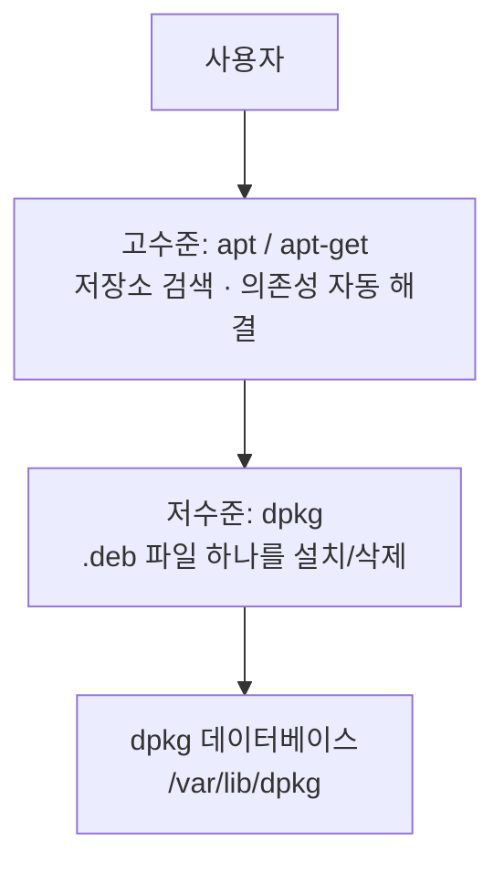
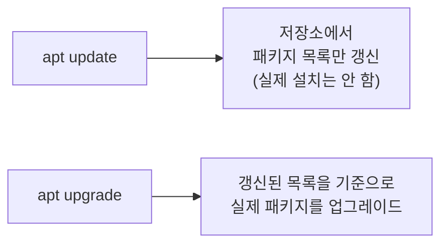

## 021. 패키지 관리 - DEB와 APT

### 1. Debian 계열 패키지 관리 구조

Red Hat 계열과 **구조는 같고 도구 이름만 다릅니다.**



#### Red Hat 계열과의 대응표 (시험 출제)

| 기능 | **Red Hat 계열** | **Debian 계열** |
| --- | --- | --- |
| 패키지 확장자 | `.rpm` | **`.deb`** |
| **저수준 도구** | `rpm` | **`dpkg`** |
| **고수준 도구** | `yum` / `dnf` | **`apt` / `apt-get`** |
| 검색 도구 | `dnf search` | `apt search` / `apt-cache search` |
| 저장소 설정 | `/etc/yum.repos.d/*.repo` | **`/etc/apt/sources.list`**, `sources.list.d/` |
| 패키지 DB | `/var/lib/rpm` | **`/var/lib/dpkg`** |
| 캐시 위치 | `/var/cache/dnf` | `/var/cache/apt/archives` |

---

### 2. DEB 패키지 파일 이름 구조

```
nginx _ 1.18.0-6ubuntu14.4 _ amd64 . deb
  │            │               │      │
  ①            ②               ③      ④
```

| 번호 | 항목 | 설명 |
| --- | --- | --- |
| **①** | 패키지 이름 | `nginx` |
| **②** | **버전-리비전** | `1.18.0` = 상위 버전, `6ubuntu14.4` = 데비안/우분투 리비전 |
| **③** | **아키텍처** | `amd64`, `i386`, `all`, `arm64` |
| **④** | 확장자 | `.deb` |

> **RPM과 다른 점**  
> RPM은 `-`(하이픈)으로 구분하지만, **DEB는 `_`(언더바)** 로 구분합니다.  
> 아키텍처 이름도 다릅니다 : RPM의 `x86_64` ↔ DEB의 **`amd64`**, RPM의 `noarch` ↔ DEB의 **`all`**

---

### 3. `dpkg` — 저수준 도구

#### 설치와 삭제

```bash
# 설치
$ sudo dpkg -i package.deb
     │      │
     │      └── i: install
     └───────── 명령

# 삭제 (설정 파일은 남김)
$ sudo dpkg -r package-name

# 완전 삭제 (설정 파일까지)
$ sudo dpkg -P package-name        # P: purge ⭐

# 의존성 문제 해결 (dpkg -i 후 에러가 났을 때)
$ sudo apt -f install               # -f: fix-broken ⭐
```

| 옵션 | 의미 |
| --- | --- |
| **`-i`** | **설치 (install)** |
| **`-r`** | **삭제** (설정 파일 유지, remove) |
| **`-P`** | **완전 삭제** (설정 파일까지, purge) |
| `-l` | 설치된 패키지 목록 |
| `-L` | 패키지의 파일 목록 |
| `-S` | 파일이 속한 패키지 검색 |
| `-s` | 패키지 상태 정보 |
| `-c` | deb 파일 내용 확인 |
| `-I` | deb 파일 정보 |

> **`-r` 과 `-P` 의 차이 (자주 출제)**  
> `-r` (remove) : 프로그램은 지우되 **`/etc`의 설정 파일은 남깁니다.** 재설치 시 설정 유지  
> `-P` (purge) : **설정 파일까지 완전히 제거**합니다.

#### 조회

```bash
# 설치된 패키지 목록
$ dpkg -l
$ dpkg -l | grep nginx
ii  nginx  1.18.0-6ubuntu14.4  all  small, powerful, scalable web/proxy server
│└── 상태
└─── 희망 상태

# 패키지의 파일 목록  (RPM의 rpm -ql)
$ dpkg -L nginx | head -5
/etc/nginx
/etc/nginx/nginx.conf
/usr/sbin/nginx

# ⭐ 파일이 속한 패키지  (RPM의 rpm -qf)
$ dpkg -S /usr/sbin/nginx
nginx-core: /usr/sbin/nginx

$ dpkg -S $(which ls)
coreutils: /usr/bin/ls

# 패키지 상태 정보  (RPM의 rpm -qi)
$ dpkg -s nginx

# 설치하지 않은 deb 파일 조회
$ dpkg -I package.deb              # 정보  (RPM의 rpm -qip)
$ dpkg -c package.deb              # 파일 목록  (RPM의 rpm -qlp)
```

#### `dpkg -l` 의 상태 코드 읽기

```
ii  nginx  1.18.0  all  ...
││
│└── 실제 상태 : i=설치됨, c=설정만 남음, u=미설치
└─── 희망 상태 : i=설치, r=삭제, p=완전삭제, h=고정
```

| 표시 | 의미 |
| --- | --- |
| **`ii`** | **정상 설치됨** |
| `rc` | 삭제됐지만 **설정 파일이 남아 있음** |
| `iU` | 설치됐지만 설정이 완료되지 않음 |
| `iF` | 설치 실패 |

```bash
# 설정 파일만 남은 패키지 정리
$ dpkg -l | grep '^rc' | awk '{print $2}' | xargs sudo dpkg -P
```

---

### 4. `apt` — 고수준 도구

#### `apt` vs `apt-get`

| 구분 | **`apt`** | **`apt-get`** |
| --- | --- | --- |
| 등장 | Ubuntu 16.04 이후 | 전통적 |
| 대상 | **사람이 직접 사용** | **스크립트용** |
| 출력 | 진행 바, 색상 표시 | 단순 텍스트 |
| 권장 | **대화형 작업** | **자동화 스크립트** |

> 기능은 거의 같지만, **스크립트에서는 `apt-get`을 쓰는 것이 권장**됩니다.  
> `apt`는 사용자 편의를 위해 출력 형식이 바뀔 수 있기 때문입니다.

#### 기본 사용법

```bash
# ⭐ 패키지 목록 갱신 (설치 전 반드시 실행)
$ sudo apt update

# 설치
$ sudo apt install nginx
$ sudo apt install -y nginx curl vim
$ sudo apt install ./local.deb           # 로컬 파일 (의존성 해결)

# 삭제
$ sudo apt remove nginx                  # 설정 파일 유지
$ sudo apt purge nginx                   # 설정 파일까지 삭제
$ sudo apt autoremove                    # 불필요한 의존 패키지 정리 ⭐

# 업그레이드
$ sudo apt upgrade                       # 설치된 패키지 업그레이드
$ sudo apt full-upgrade                  # 필요 시 패키지 삭제도 허용
$ sudo apt dist-upgrade                  # full-upgrade와 동일 (구 명령)

# 검색과 정보
$ apt search nginx
$ apt show nginx
$ apt list --installed
$ apt list --upgradable                  # 업그레이드 가능 목록

# 캐시 정리
$ sudo apt clean                         # 받아둔 deb 전부 삭제
$ sudo apt autoclean                     # 오래된 것만 삭제
```

#### `update` 와 `upgrade` 를 반드시 구분해야 합니다



| 명령 | 하는 일 |
| --- | --- |
| **`apt update`** | **저장소의 패키지 목록(메타데이터)만 갱신** — 아무것도 설치하지 않음 |
| **`apt upgrade`** | **실제로 패키지를 업그레이드** |

> **`apt update`를 먼저 하지 않으면**  
> 오래된 목록을 기준으로 설치를 시도해 **"E: Unable to locate package"** 또는  
> **404 Not Found** 오류가 발생합니다.  
> 그래서 항상 **`sudo apt update && sudo apt install ...`** 로 붙여 씁니다.

#### `remove` vs `purge` vs `autoremove`

| 명령 | 삭제 대상 |
| --- | --- |
| **`remove`** | 프로그램 파일 (**설정 파일 유지**) |
| **`purge`** | 프로그램 + **설정 파일** |
| **`autoremove`** | **더 이상 아무도 필요로 하지 않는 의존 패키지** |

```bash
# 완전히 정리하려면
$ sudo apt purge nginx && sudo apt autoremove
```

---

### 5. 저장소 관리

#### `/etc/apt/sources.list`

```bash
$ cat /etc/apt/sources.list
deb http://archive.ubuntu.com/ubuntu jammy main restricted universe multiverse
deb http://archive.ubuntu.com/ubuntu jammy-updates main restricted
deb http://security.ubuntu.com/ubuntu jammy-security main restricted
 │              │                       │          │
 ①              ②                       ③          ④
```

| 번호 | 항목 | 설명 |
| --- | --- | --- |
| **①** | **아카이브 종류** | **`deb`**=바이너리, **`deb-src`**=소스 |
| **②** | **저장소 URL** | |
| **③** | **배포판 코드명** | `jammy`(22.04), `focal`(20.04), `noble`(24.04) |
| **④** | **컴포넌트** | `main`, `restricted`, `universe`, `multiverse` |

#### Ubuntu의 컴포넌트 구분

| 컴포넌트 | 의미 |
| --- | --- |
| **`main`** | **공식 지원 + 자유 소프트웨어** |
| **`restricted`** | 공식 지원 + **독점 드라이버** (그래픽, 무선) |
| **`universe`** | **커뮤니티 관리** + 자유 소프트웨어 |
| **`multiverse`** | 커뮤니티 관리 + **라이선스 제한** 소프트웨어 |

#### 저장소 추가

```bash
# ① PPA 추가 (Ubuntu 전용 개인 저장소)
$ sudo add-apt-repository ppa:nginx/stable
$ sudo apt update

# PPA 제거
$ sudo add-apt-repository --remove ppa:nginx/stable

# ② 서드파티 저장소 수동 추가 (예: Docker)
# GPG 키 등록
$ curl -fsSL https://download.docker.com/linux/ubuntu/gpg | \
    sudo gpg --dearmor -o /etc/apt/keyrings/docker.gpg

# 저장소 추가
$ echo "deb [arch=amd64 signed-by=/etc/apt/keyrings/docker.gpg] \
    https://download.docker.com/linux/ubuntu $(lsb_release -cs) stable" | \
    sudo tee /etc/apt/sources.list.d/docker.list

$ sudo apt update
```

> **`apt-key` 는 더 이상 사용하지 않습니다 (deprecated)**  
> 예전에는 `apt-key add`로 키를 전역 등록했지만,  
> **모든 저장소가 그 키로 서명된 패키지를 신뢰**하게 되어 보안 문제가 있었습니다.  
> 이제는 **`/etc/apt/keyrings/`에 키를 두고 `signed-by=`로 저장소별로 연결**합니다.

#### 저장소 우선순위 — APT Pinning

```bash
$ sudo vi /etc/apt/preferences.d/nginx
```

```
Package: nginx
Pin: origin nginx.org
Pin-Priority: 900
```

| 우선순위 | 의미 |
| --- | --- |
| 1000 이상 | 다운그레이드도 허용 |
| **500** | **기본값** |
| 100 | 설치되어 있을 때만 |
| 0 미만 | 설치 금지 |

---

### 6. 패키지 고정과 자동 업데이트

```bash
# 패키지 버전 고정 (업데이트 방지)
$ sudo apt-mark hold nginx
$ apt-mark showhold                    # 고정 목록
$ sudo apt-mark unhold nginx

# 수동 설치 / 자동 설치 표시
$ sudo apt-mark manual nginx           # autoremove 대상에서 제외
$ sudo apt-mark auto nginx
$ apt-mark showauto | head

# 보안 업데이트 자동 적용
$ sudo apt install unattended-upgrades
$ sudo dpkg-reconfigure --priority=low unattended-upgrades
```

---

### 7. 문제 해결

```bash
# 의존성이 깨졌을 때
$ sudo apt -f install                  # fix-broken ⭐
$ sudo dpkg --configure -a             # 설정이 중단된 패키지 마무리

# lock 파일 오류
# "Could not get lock /var/lib/dpkg/lock-frontend"
$ sudo lsof /var/lib/dpkg/lock-frontend    # 누가 쓰는지 확인
# 다른 apt 프로세스가 끝날 때까지 기다리는 것이 원칙
# 정말 남아 있는 프로세스가 없다면
$ sudo rm /var/lib/dpkg/lock-frontend /var/lib/dpkg/lock
$ sudo dpkg --configure -a

# 캐시 손상
$ sudo apt clean && sudo apt update

# GPG 키 오류
# "NO_PUBKEY XXXXXXXX"
$ sudo apt-key adv --keyserver keyserver.ubuntu.com --recv-keys XXXXXXXX
# (신규 방식은 위 6절 참고)
```

> **lock 오류 시 주의**  
> `rm`으로 lock 파일을 지우는 것은 **다른 apt 작업이 정말 없을 때만** 해야 합니다.  
> 진행 중인 설치가 있는데 지우면 **패키지 DB가 손상**될 수 있습니다.

---

### 8. Snap과 Flatpak (참고)

배포판 저장소와 별개로 동작하는 **범용 패키지 시스템**입니다.

| 구분 | Snap | Flatpak |
| --- | --- | --- |
| 주도 | Canonical (Ubuntu) | 커뮤니티 |
| 특징 | 의존성을 **패키지 안에 포함** | 동일 |
| 장점 | 배포판 무관, 최신 버전 즉시 사용 | 동일 |
| 단점 | **용량 큼, 실행 느림** | 동일 |

```bash
$ snap list
$ sudo snap install code --classic
$ sudo snap remove code
$ sudo snap refresh                    # 업데이트
```

> **왜 만들어졌나?**  
> 배포판 저장소의 패키지는 **안정성 우선이라 버전이 오래된 경우**가 많습니다.  
> Snap/Flatpak은 의존성을 통째로 포함해 **어느 배포판에서든 최신 버전을 바로** 쓸 수 있게 합니다.  
> 대신 같은 라이브러리가 중복 설치되어 **용량이 커지는 단점**이 있습니다.

---

### 9. RPM/DNF ↔ DEB/APT 명령 대조표

**시험과 실무 모두에서 이 표 하나로 정리됩니다.**

| 작업 | **Red Hat (dnf/rpm)** | **Debian (apt/dpkg)** |
| --- | --- | --- |
| 목록 갱신 | (자동) | **`apt update`** |
| 설치 | `dnf install pkg` | `apt install pkg` |
| 로컬 파일 설치 | `dnf install ./f.rpm` | `apt install ./f.deb` |
| 저수준 설치 | `rpm -ivh f.rpm` | **`dpkg -i f.deb`** |
| 삭제 | `dnf remove pkg` | `apt remove pkg` |
| 완전 삭제 | `dnf remove pkg` | **`apt purge pkg`** |
| 업그레이드 | `dnf update` | **`apt upgrade`** |
| 검색 | `dnf search` | `apt search` |
| 정보 | `dnf info` / `rpm -qi` | `apt show` / `dpkg -s` |
| 설치 목록 | **`rpm -qa`** | **`dpkg -l`** |
| 파일 목록 | **`rpm -ql`** | **`dpkg -L`** |
| **파일→패키지** | **`rpm -qf`** | **`dpkg -S`** |
| 파일 제공 검색 | `dnf provides` | `apt-file search` |
| 불필요 패키지 정리 | `dnf autoremove` | `apt autoremove` |
| 캐시 정리 | `dnf clean all` | `apt clean` |
| 저장소 설정 | `/etc/yum.repos.d/` | **`/etc/apt/sources.list`** |
| 버전 고정 | `dnf versionlock` | **`apt-mark hold`** |
| 의존성 복구 | — | **`apt -f install`** |

---

### 시험 포인트 정리

| 항목 | 핵심 |
| --- | --- |
| DEB 파일명 구분자 | **`_` (언더바)** — RPM은 `-` |
| DEB 아키텍처 | **`amd64`**, `all` — RPM은 `x86_64`, `noarch` |
| **`dpkg -i`** | 설치 |
| **`dpkg -r`** | 삭제 (**설정 유지**) |
| **`dpkg -P`** | **완전 삭제** (설정까지) |
| **`dpkg -l`** | 설치 목록 |
| **`dpkg -L`** | 파일 목록 |
| **`dpkg -S`** | **파일이 속한 패키지** ⭐ |
| **`apt update`** | **목록만 갱신** (설치 아님) |
| **`apt upgrade`** | 실제 업그레이드 |
| `apt purge` | 설정 파일까지 삭제 |
| `apt autoremove` | 불필요한 의존 패키지 정리 |
| 의존성 복구 | **`apt -f install`** |
| 저장소 설정 파일 | **`/etc/apt/sources.list`** |
| 컴포넌트 | `main` / `restricted` / `universe` / `multiverse` |
| PPA 추가 | **`add-apt-repository ppa:...`** |
| 버전 고정 | **`apt-mark hold`** |
| dpkg DB 위치 | **`/var/lib/dpkg`** |

---

### 한 줄 정리

Debian 계열은 **`dpkg`(저수준)와 `apt`(고수준)** 로 Red Hat의 `rpm`/`dnf`와 같은 구조이며,  
**`apt update`는 목록 갱신·`apt upgrade`가 실제 업그레이드**라는 구분이 핵심이고,  
파일이 속한 패키지는 **`dpkg -S`**(RPM의 `rpm -qf`), 의존성이 깨지면 **`apt -f install`** 로 복구합니다.
