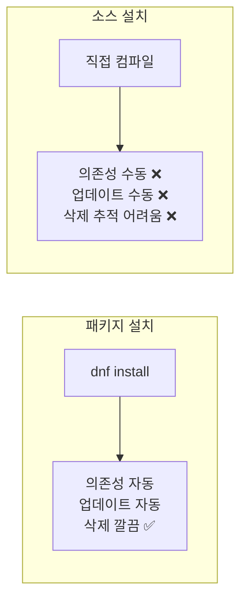
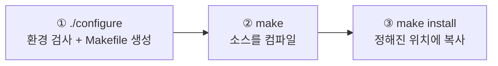
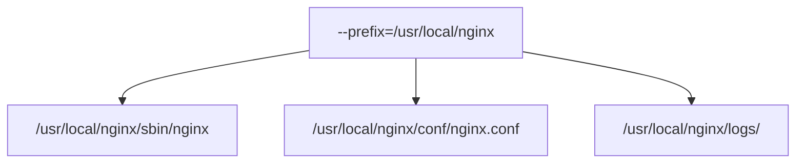
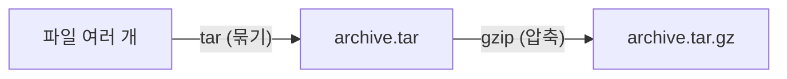
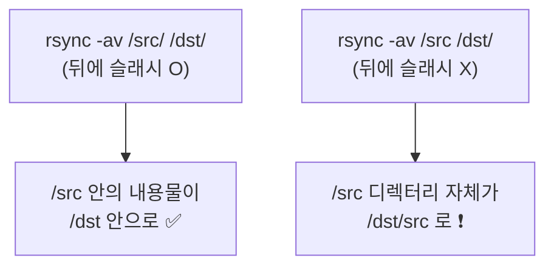

## 022. 소스 설치와 아카이브 관리

### 1. 왜 소스로 설치할까?

패키지 관리자(`dnf`, `apt`)가 있는데도 소스 컴파일이 필요한 경우가 있습니다.

| 상황 | 이유 |
| --- | --- |
| **저장소에 없는 프로그램** | 최신 버전이나 특수 소프트웨어 |
| **최신 버전이 필요** | 배포판 저장소는 안정성 우선이라 버전이 오래됨 |
| **옵션을 커스터마이즈** | 필요한 기능만 넣어 가볍게 빌드 |
| **아키텍처에 맞춘 최적화** | 특정 CPU에 최적화된 바이너리 |

**단점도 분명합니다.**



> **원칙** : **패키지가 있으면 패키지를 쓰고**, 정말 필요할 때만 소스로 설치합니다.

---

### 2. 소스 설치의 3단계

리눅스 소스 설치는 거의 항상 이 세 단계입니다.



#### 전체 과정 예시

```bash
# ① 컴파일 도구 준비
$ sudo dnf group install "Development Tools"      # RHEL 계열
$ sudo apt install build-essential                # Debian 계열

# ② 소스 다운로드
$ wget https://nginx.org/download/nginx-1.24.0.tar.gz

# ③ 압축 해제
$ tar xvzf nginx-1.24.0.tar.gz
$ cd nginx-1.24.0

# ④ configure — 환경 검사 및 옵션 지정
$ ./configure --prefix=/usr/local/nginx \
              --with-http_ssl_module \
              --without-http_rewrite_module

# ⑤ 컴파일
$ make -j$(nproc)        # -j: 병렬 컴파일 (CPU 코어 수만큼) ⭐

# ⑥ 설치 (root 권한 필요)
$ sudo make install

# ⑦ 정리
$ make clean             # 컴파일 결과물 삭제
$ make distclean         # 결과물 + configure 결과까지 삭제
```

#### 각 단계가 하는 일

| 단계 | 하는 일 |
| --- | --- |
| **`./configure`** | 시스템에 필요한 **라이브러리·컴파일러가 있는지 검사**하고, 결과에 맞는 **`Makefile`을 생성** |
| **`make`** | `Makefile`을 읽어 **소스를 컴파일**하여 실행 파일 생성 |
| **`make install`** | 생성된 파일을 **지정된 경로에 복사** (`/usr/local` 등) |

#### `--prefix` 옵션이 중요한 이유

```bash
$ ./configure --prefix=/usr/local/nginx
```

`--prefix`는 **설치될 최상위 경로**를 지정합니다. 기본값은 보통 `/usr/local` 입니다.



**한 디렉터리 아래에 모아 두면**

- 삭제할 때 **그 디렉터리만 지우면 됩니다**
- 여러 버전을 **동시에 설치**할 수 있습니다 (`/usr/local/nginx-1.24`, `nginx-1.25`)

> **왜 `/usr/local`에 설치할까?**  
> `/usr/bin` 은 **패키지 관리자가 관리하는 영역**입니다.  
> 여기에 소스로 설치한 파일을 넣으면 **패키지 업데이트 시 충돌**이 발생합니다.  
> `/usr/local`은 **관리자가 직접 설치한 것**을 위한 공간으로 FHS에 정의되어 있습니다.

#### `make -j` 옵션

```bash
$ nproc
8
$ make -j8              # 8개 작업 병렬 실행
$ make -j$(nproc)       # 코어 수 자동 지정 ⭐
```

컴파일 시간이 코어 수에 비례해 줄어듭니다. 대형 프로젝트에서는 차이가 큽니다.

#### 소스 설치 프로그램 삭제

```bash
# ① Makefile이 uninstall을 지원하면
$ sudo make uninstall

# ② 지원하지 않으면 → prefix 디렉터리 삭제
$ sudo rm -rf /usr/local/nginx

# ③ checkinstall로 패키지화해서 설치하면 관리가 쉬워집니다 (권장)
$ sudo checkinstall          # deb/rpm 패키지를 만들어 설치
```

> **소스 설치의 가장 큰 문제는 "삭제 추적"** 입니다.  
> `make install`이 어떤 파일을 어디에 복사했는지 기록이 남지 않기 때문입니다.  
> `--prefix`를 반드시 지정하거나, `checkinstall`로 패키지화하는 것이 좋습니다.

---

### 3. `tar` — 아카이브 관리

**`tar`는 실기 시험 단골이며 실무에서도 매일 씁니다.**

#### tar의 원래 의미

**T**ape **AR**chive — 원래는 **여러 파일을 하나로 묶기만** 하는 도구였습니다.  
압축은 `gzip`, `bzip2` 같은 별도 프로그램이 담당합니다.



현재는 `tar`가 **압축 옵션을 함께 제공**하여 한 번에 처리합니다.

#### 핵심 옵션

| 옵션 | 의미 |
| --- | --- |
| **`c`** | **생성 (create)** |
| **`x`** | **해제 (extract)** |
| **`t`** | **목록 보기 (list)** |
| **`v`** | 진행 상황 표시 (verbose) |
| **`f`** | **파일 이름 지정 (file)** — **반드시 마지막에** |
| **`z`** | **gzip** 압축 (`.gz`) |
| **`j`** | **bzip2** 압축 (`.bz2`) |
| **`J`** | **xz** 압축 (`.xz`) |
| `C 경로` | 지정한 디렉터리로 이동 후 작업 |
| `p` | 권한 유지 |
| `--exclude=패턴` | 제외할 파일 |

> **`f` 옵션은 반드시 마지막에** 와야 합니다.  
> `f` 바로 뒤에 오는 인자를 파일 이름으로 인식하기 때문입니다.  
> `tar cfvz file.tar.gz dir` ❌ → `v`를 파일명으로 오해  
> `tar cvzf file.tar.gz dir` ✅

#### 묶기 (생성)

```bash
# tar만 (압축 없음)
$ tar cvf backup.tar /home/user

# gzip 압축 (가장 일반적) ⭐
$ tar cvzf backup.tar.gz /home/user

# bzip2 압축 (압축률 높음, 느림)
$ tar cvjf backup.tar.bz2 /home/user

# xz 압축 (압축률 가장 높음, 가장 느림)
$ tar cvJf backup.tar.xz /home/user

# 특정 파일 제외
$ tar cvzf backup.tar.gz /home/user --exclude="*.log" --exclude="cache"

# 절대 경로 경고 없애기 (앞의 / 제거)
$ tar cvzf backup.tar.gz -C /home user
#                        └── /home으로 이동 후 user 디렉터리를 묶음
```

#### 풀기 (해제)

```bash
# 현재 디렉터리에 풀기
$ tar xvzf backup.tar.gz

# 특정 디렉터리에 풀기 ⭐
$ tar xvzf backup.tar.gz -C /restore

# 특정 파일만 골라서 풀기
$ tar xvzf backup.tar.gz home/user/report.txt

# 권한과 소유자 유지 (root로 복원 시)
$ sudo tar xvzpf backup.tar.gz -C /
```

> **최신 tar는 압축 형식을 자동 감지**합니다.  
> `tar xvf backup.tar.gz` 처럼 `z`를 빼도 대부분 동작합니다.  
> 하지만 **시험에서는 형식에 맞는 옵션을 정확히 쓰는 것**을 요구하므로 외워 두어야 합니다.

#### 목록 확인 (풀기 전 반드시 확인)

```bash
$ tar tvzf backup.tar.gz | head -5
drwxr-xr-x user/user  0 2026-01-31 06:25 home/user/
-rw-r--r-- user/user 1024 2026-01-31 06:20 home/user/report.txt
```

> **왜 먼저 목록을 봐야 할까?**  
> 아카이브가 **`./` 없이 절대 경로나 상대 경로 없이 만들어진 경우**,  
> 현재 디렉터리에 **파일이 흩어져 쏟아질 수 있습니다.**  
> `tar tvf`로 구조를 먼저 확인하는 습관이 사고를 막습니다.

#### 아카이브에 추가·갱신

```bash
$ tar rvf backup.tar newfile.txt        # r: 추가 (append) — 압축 파일에는 불가
$ tar uvf backup.tar dir/               # u: 변경된 것만 갱신 (update)
```

> **주의** : `r`과 `u`는 **압축되지 않은 `.tar`에만** 사용할 수 있습니다.  
> `.tar.gz`에 추가하려면 풀었다가 다시 묶어야 합니다.

#### 실무 활용 예

```bash
# 원격 서버로 바로 전송 (중간 파일 없이)
$ tar cvzf - /data | ssh user@remote "cat > /backup/data.tar.gz"

# 디렉터리를 다른 곳으로 통째 복사 (권한 유지)
$ tar cf - -C /src . | tar xf - -C /dst

# 진행률 보기
$ tar cvzf backup.tar.gz /data | pv > /dev/null
```

---

### 4. 압축 명령어

#### `gzip` / `gunzip`

```bash
$ gzip file.txt              # file.txt → file.txt.gz (원본 삭제됨) ❗
$ gzip -k file.txt           # 원본 유지 (keep)
$ gzip -9 file.txt           # 최대 압축 (1=빠름, 9=최대)
$ gzip -d file.txt.gz        # 압축 해제
$ gunzip file.txt.gz         # 동일
$ zcat file.txt.gz           # 압축 해제 없이 내용 보기 ⭐
$ zgrep "error" file.log.gz  # 압축 파일에서 검색 ⭐
```

#### `bzip2` / `xz`

```bash
$ bzip2 file.txt             # → file.txt.bz2
$ bunzip2 file.txt.bz2
$ bzcat file.txt.bz2

$ xz file.txt                # → file.txt.xz
$ unxz file.txt.xz
$ xzcat file.txt.xz
```

#### 압축 형식 비교 (시험 출제)

| 형식 | 확장자 | 압축률 | 속도 | tar 옵션 |
| --- | --- | --- | --- | --- |
| **gzip** | `.gz` | 보통 | **빠름** | **`z`** |
| **bzip2** | `.bz2` | 좋음 | 느림 | **`j`** |
| **xz** | `.xz` | **최고** | **가장 느림** | **`J`** |
| zip | `.zip` | 보통 | 빠름 | — |
| compress | `.Z` | 낮음 | 빠름 | `Z` |

```
압축률 :  xz  >  bzip2  >  gzip
속  도 : gzip  >  bzip2  >  xz
```

> **선택 기준**  
> **로그 백업처럼 자주 압축**하는 경우 → **gzip** (속도 우선)  
> **배포용 아카이브처럼 한 번 만들고 여러 번 내려받는** 경우 → **xz** (용량 우선)

#### `zip` / `unzip` (Windows 호환)

```bash
$ zip -r archive.zip dir/          # -r: 하위 디렉터리 포함 ⭐
$ zip -e secret.zip file.txt       # 비밀번호 설정
$ unzip archive.zip
$ unzip -l archive.zip             # 목록만 보기
$ unzip archive.zip -d /restore    # 특정 위치에 풀기
```

> **`tar` vs `zip`**  
> `tar.gz`는 **전체를 하나로 묶어 압축**해서 압축률이 높지만, 파일 하나만 꺼내려면 전체를 훑어야 합니다.  
> `zip`은 **파일별로 압축**해서 개별 추출이 빠르지만 압축률은 낮습니다.  
> 리눅스 간 전송은 `tar.gz`, Windows와 주고받을 때는 `zip`이 무난합니다.

---

### 5. 파일 복사·동기화 — `rsync`

**백업과 배포에서 `cp`보다 훨씬 유용**합니다.

```bash
# 기본 사용
$ rsync -avz /src/ /dst/
        │││
        ││└── z: 전송 시 압축
        │└─── v: 상세 출력
        └──── a: 아카이브 모드 (권한·소유자·타임스탬프·링크 보존) ⭐

# 원격 서버로
$ rsync -avz /data/ user@remote:/backup/
$ rsync -avz -e "ssh -p 2222" /data/ user@remote:/backup/

# 삭제된 파일도 동기화 (완전 미러링)
$ rsync -avz --delete /src/ /dst/       # ❗주의: 대상의 파일이 지워짐

# 실행 전 확인 (매우 중요) ⭐
$ rsync -avzn --delete /src/ /dst/      # n: dry-run (실제로는 안 함)

# 진행률 표시
$ rsync -avz --progress /src/ /dst/

# 제외
$ rsync -avz --exclude="*.log" --exclude="tmp/" /src/ /dst/
```

| 옵션 | 의미 |
| --- | --- |
| **`-a`** | **아카이브 모드** (`-rlptgoD` 와 동일) |
| `-v` | 상세 출력 |
| `-z` | 압축 전송 |
| **`-n`** | **테스트만 (dry-run)** ⭐ |
| **`--delete`** | 원본에 없는 파일을 대상에서 **삭제** |
| `--progress` | 진행률 |
| `--exclude` | 제외 패턴 |
| `-e` | 원격 셸 지정 |

#### 슬래시(`/`) 하나가 결과를 바꿉니다 (가장 흔한 실수)



```bash
# 결과: /dst/file1, /dst/file2
$ rsync -av /src/ /dst/

# 결과: /dst/src/file1, /dst/src/file2
$ rsync -av /src /dst/
```

> **`--delete`를 쓸 때는 반드시 `-n`(dry-run)으로 먼저 확인**하세요.  
> 경로를 잘못 지정하면 **대상 디렉터리의 파일이 대량 삭제**됩니다.

#### `cp` 대신 `rsync`를 쓰는 이유

| 기능 | `cp` | `rsync` |
| --- | --- | --- |
| **변경된 부분만 전송** | ❌ (전체 복사) | **✅** |
| 중단 후 이어받기 | ❌ | **✅** |
| 원격 전송 | ❌ | **✅** |
| 진행률 표시 | ❌ | **✅** |
| 권한·소유자 보존 | `-p` 필요 | **`-a`로 전부** |

대용량 디렉터리를 반복 백업할 때, **두 번째부터는 바뀐 파일만 전송**하므로 압도적으로 빠릅니다.

---

### 6. 파일 전송 — `scp`, `sftp`

```bash
# scp — 단순 파일 복사
$ scp file.txt user@remote:/path/
$ scp user@remote:/path/file.txt ./
$ scp -r dir/ user@remote:/path/        # -r: 디렉터리
$ scp -P 2222 file.txt user@remote:/    # -P: 포트 (대문자 ❗)

# sftp — 대화형 전송
$ sftp user@remote
sftp> ls
sftp> put localfile.txt
sftp> get remotefile.txt
sftp> bye
```

> **`scp`의 포트 옵션은 대문자 `-P`** 입니다.  
> `ssh`는 소문자 `-p`를 쓰므로 헷갈리기 쉽습니다.

---

### 7. 컴파일 관련 도구

| 도구 | 역할 |
| --- | --- |
| **`gcc`** | C 컴파일러 |
| **`g++`** | C++ 컴파일러 |
| **`make`** | Makefile 기반 빌드 자동화 |
| **`cmake`** | 크로스 플랫폼 빌드 시스템 (Makefile 생성) |
| `autoconf` / `automake` | `configure` 스크립트 생성 |
| `ldd` | **실행 파일의 공유 라이브러리 의존성 확인** |
| `ldconfig` | 라이브러리 캐시 갱신 |

```bash
# 간단한 컴파일
$ gcc -o hello hello.c
$ gcc -Wall -O2 -o app main.c util.c      # -Wall: 경고 전부, -O2: 최적화

# 라이브러리 의존성 확인 ⭐
$ ldd /usr/sbin/nginx
        linux-vdso.so.1 (0x00007ffc...)
        libpthread.so.0 => /lib64/libpthread.so.0 (0x00007f...)
        libcrypt.so.1 => not found                          ← ❗누락
```

> **"error while loading shared libraries"** 오류가 나면 **`ldd`로 확인**합니다.  
> `not found`가 있으면 해당 라이브러리를 설치하거나 경로를 등록해야 합니다.
> ```bash
> $ echo "/usr/local/lib" | sudo tee /etc/ld.so.conf.d/local.conf
> $ sudo ldconfig
> ```

---

### 시험 포인트 정리

| 항목 | 핵심 |
| --- | --- |
| 소스 설치 3단계 | **`./configure` → `make` → `make install`** |
| `./configure` 역할 | **환경 검사 + Makefile 생성** |
| **`--prefix`** | **설치 경로 지정** (기본 `/usr/local`) |
| 병렬 컴파일 | **`make -j$(nproc)`** |
| 빌드 정리 | `make clean` / **`make distclean`**(설정까지) |
| **tar `c`/`x`/`t`** | **생성 / 해제 / 목록** |
| **tar `f`** | **반드시 마지막 옵션** |
| **tar `z`/`j`/`J`** | **gzip / bzip2 / xz** |
| tar 특정 위치 해제 | **`-C 경로`** |
| 압축률 | **xz > bzip2 > gzip** |
| 속도 | **gzip > bzip2 > xz** |
| 압축 파일 내용 보기 | **`zcat`**, `zgrep` |
| zip 하위 디렉터리 | **`zip -r`** |
| **rsync `-a`** | **아카이브 모드** (권한·소유자 보존) |
| **rsync `-n`** | **dry-run (테스트)** ⭐ |
| **rsync `--delete`** | 대상의 여분 파일 삭제 (**주의**) |
| rsync 경로 슬래시 | **`/src/` 는 내용물, `/src` 는 디렉터리째** |
| scp 포트 옵션 | **대문자 `-P`** |
| 라이브러리 의존성 | **`ldd`** |
| 라이브러리 경로 갱신 | **`ldconfig`** |

---

### 한 줄 정리

소스 설치는 **`./configure`(환경 검사·Makefile 생성) → `make`(컴파일) → `make install`(복사)** 3단계이며 **`--prefix`로 경로를 격리**하고,  
`tar`는 **`c`(생성)/`x`(해제)/`t`(목록)** 에 **`z`(gzip)·`j`(bzip2)·`J`(xz)** 를 조합하되 **`f`는 반드시 마지막**,  
반복 백업은 **변경분만 전송하는 `rsync`** 를 쓰되 **`--delete` 전에는 반드시 `-n`으로 확인**합니다.
