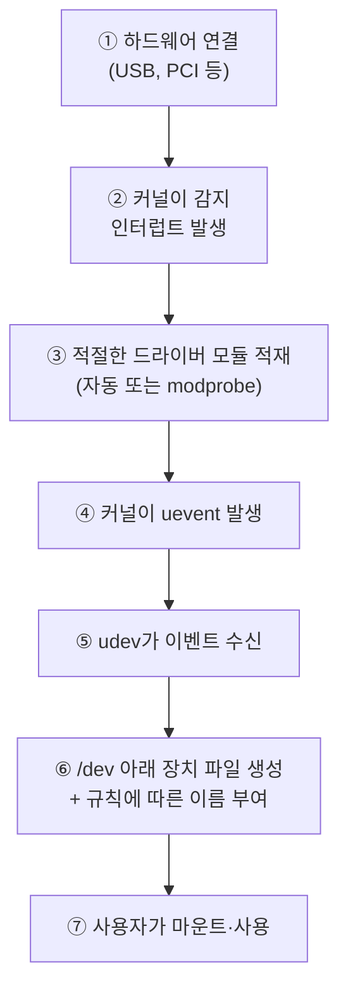

## 023. 장치의 인식과 관리

### 1. 리눅스가 장치를 인식하는 과정

새 하드웨어를 꽂았을 때 리눅스 안에서 벌어지는 일을 순서대로 보겠습니다.



각 단계를 명령어로 확인할 수 있습니다.

```bash
# ② 커널이 감지했는지 (가장 먼저 확인) ⭐
$ dmesg -T | tail -20
[Sat Jan 31 06:25:11 2026] usb 1-1: new high-speed USB device number 4
[Sat Jan 31 06:25:11 2026] usb-storage 1-1:1.0: USB Mass Storage device detected
[Sat Jan 31 06:25:12 2026] sd 3:0:0:0: [sdb] 30310400 512-byte logical blocks
[Sat Jan 31 06:25:12 2026]  sdb: sdb1

# ③ 드라이버가 적재됐는지
$ lsmod | grep usb_storage

# ⑥ 장치 파일이 생겼는지
$ lsblk
$ ls -l /dev/sdb*
```

> **실무 팁** : "USB를 꽂았는데 안 보인다"는 상황에서 **`dmesg -T | tail`** 이 가장 빠른 진단입니다.  
> 여기에 아무것도 안 나오면 **물리적 연결이나 하드웨어 문제**,  
> 인식은 됐는데 마운트가 안 되면 **파일 시스템이나 권한 문제**입니다.

---

### 2. 장치 파일 복습과 심화

```bash
$ ls -l /dev/sda /dev/tty0 /dev/null
brw-rw----. 1 root disk 8,  0 Jan 31 06:25 /dev/sda
crw--w----. 1 root tty  4,  0 Jan 31 06:25 /dev/tty0
crw-rw-rw-. 1 root root 1,  3 Jan 31 06:25 /dev/null
│                       │   │
│                       │   └── 부 번호 (Minor) : 같은 드라이버가 관리하는 몇 번째 장치
│                       └────── 주 번호 (Major) : 어떤 드라이버가 담당하는가
└── b=블록, c=문자
```

#### 주 번호와 부 번호의 의미

```bash
# 커널이 알고 있는 장치 번호 목록
$ cat /proc/devices
Character devices:
  1 mem
  4 tty
  5 /dev/tty
Block devices:
  8 sd
 11 sr
253 device-mapper
```

| 번호 | 담당 |
| --- | --- |
| 블록 **8** | SCSI/SATA 디스크 (`sd`) |
| 블록 **11** | 광학 드라이브 (`sr`) |
| 블록 **253** | device-mapper (LVM) |
| 문자 **1** | 메모리 장치 (`null`, `zero`, `random`) |
| 문자 **4** | 터미널 (`tty`) |

**주 번호가 같으면 같은 드라이버**가 담당합니다.  
`/dev/sda`(8,0), `/dev/sdb`(8,16) 은 모두 `sd` 드라이버가 처리합니다.

---

### 3. udev — 장치 파일 자동 관리

#### udev가 없던 시절의 문제

예전에는 `/dev`에 **가능한 모든 장치 파일을 미리 만들어** 두었습니다.  
실제로 연결되지 않은 장치까지 포함해 **수천 개**의 파일이 있었습니다.

**udev**는 커널의 이벤트를 받아 **연결된 장치에 대해서만** 파일을 만들고, 제거되면 삭제합니다.

```bash
# udev 데몬 확인
$ systemctl status systemd-udevd

# 장치 이벤트 실시간 관찰 (USB를 꽂아 보면 흐름이 보입니다) ⭐
$ sudo udevadm monitor

# 장치의 속성 확인 (규칙 작성 시 필요)
$ udevadm info /dev/sdb
$ udevadm info -a -n /dev/sdb | head -30
```

#### udev 규칙 만들기 — 고정된 장치 이름 부여

**문제 상황** : USB 장치를 꽂는 순서에 따라 `/dev/sdb`가 될 수도, `/dev/sdc`가 될 수도 있습니다.  
스크립트에서 특정 장치를 지정해야 하는데 이름이 바뀌면 곤란합니다.

**해결** : udev 규칙으로 **고정된 심볼릭 링크**를 만듭니다.

```bash
# ① 장치의 고유 속성 확인
$ udevadm info -a -n /dev/sdb | grep -E "serial|idVendor|idProduct"
    ATTRS{serial}=="0123456789ABCDEF"
    ATTRS{idVendor}=="0781"
    ATTRS{idProduct}=="5567"

# ② 규칙 파일 작성
$ sudo vi /etc/udev/rules.d/99-mybackup.rules
```

```
SUBSYSTEM=="block", ATTRS{idVendor}=="0781", ATTRS{idProduct}=="5567", SYMLINK+="backup-usb"
```

```bash
# ③ 규칙 적용
$ sudo udevadm control --reload-rules
$ sudo udevadm trigger

# ④ 확인 — 이제 항상 같은 이름으로 접근 가능
$ ls -l /dev/backup-usb
lrwxrwxrwx. 1 root root 3 Jan 31 06:25 /dev/backup-usb -> sdb
```

| 규칙 키워드 | 의미 |
| --- | --- |
| `SUBSYSTEM==` | 서브시스템 (`block`, `usb`, `net`) |
| `KERNEL==` | 커널이 부여한 이름 |
| `ATTRS{...}==` | 장치 속성 |
| **`SYMLINK+=`** | **심볼릭 링크 이름 부여** |
| `NAME=` | 장치 파일 이름 지정 |
| `MODE=`, `OWNER=`, `GROUP=` | 권한 지정 |
| `RUN+=` | 명령 실행 |

> **네트워크 인터페이스 이름(`enp0s3`)도 udev가 정합니다.**  
> 그래서 `/etc/udev/rules.d/70-persistent-net.rules` 로 이름을 고정할 수 있습니다.

---

### 4. 장치 정보 조회 명령어 총정리

```bash
# 블록 장치 (디스크) — 트리 형태 ⭐
$ lsblk
$ lsblk -f                    # 파일 시스템·UUID 포함
$ lsblk -o NAME,SIZE,TYPE,MOUNTPOINT,FSTYPE,UUID

# 장치의 UUID와 파일 시스템
$ sudo blkid
/dev/sda1: UUID="a1b2..." TYPE="xfs" PARTUUID="..."

# PCI 장치 (그래픽·랜카드·컨트롤러)
$ lspci
$ lspci -v                    # 상세 (드라이버, IRQ)
$ lspci -nn                   # 벤더/디바이스 ID 표시
$ lspci -k                    # 사용 중인 커널 드라이버 ⭐

# USB 장치
$ lsusb
$ lsusb -t                    # 트리 형태
$ lsusb -v                    # 상세

# CPU
$ lscpu

# 메모리 슬롯 (물리 정보)
$ sudo dmidecode -t memory | grep -E "Size|Speed|Locator"

# 전체 하드웨어 요약
$ sudo lshw -short
$ sudo lshw -class disk -class network

# SCSI 장치
$ lsscsi
$ cat /proc/scsi/scsi

# 시스템·BIOS 정보
$ sudo dmidecode -t system
$ sudo dmidecode -t bios
```

| 명령어 | 대상 |
| --- | --- |
| **`lsblk`** | **블록 장치 (디스크·파티션)** |
| **`blkid`** | **UUID·파일 시스템 타입** |
| **`lspci`** | PCI 장치 |
| **`lsusb`** | USB 장치 |
| **`lscpu`** | CPU |
| `lsscsi` | SCSI 장치 |
| `lshw` | 전체 하드웨어 |
| **`dmidecode`** | **BIOS·메인보드·메모리 슬롯** (물리 정보) |
| **`dmesg`** | **커널 인식 로그** |

---

### 5. 시스템 자원 — IRQ, DMA, I/O 포트

장치가 CPU·메모리와 통신하기 위해 필요한 자원들입니다.

```bash
# IRQ (인터럽트 요청) 사용 현황
$ cat /proc/interrupts | head -8
           CPU0       CPU1
  0:         38          0   IO-APIC   2-edge      timer
  1:          9          0   IO-APIC   1-edge      i8042
  8:          1          0   IO-APIC   8-edge      rtc0
 19:      12345          0   IO-APIC  19-fasteoi   enp0s3

# DMA 채널
$ cat /proc/dma

# I/O 포트 주소
$ cat /proc/ioports | head -5

# 메모리 매핑
$ cat /proc/iomem | head -5
```

| 자원 | 역할 |
| --- | --- |
| **IRQ** | 장치가 CPU에게 **"처리해 달라"고 요청**하는 신호 번호 |
| **DMA** | CPU를 거치지 않고 **메모리와 직접** 데이터 전송 |
| **I/O 포트** | CPU가 장치와 데이터를 주고받는 **주소 공간** |

#### 왜 자원이 겹치면 안 될까?

두 장치가 같은 IRQ를 쓰면, CPU는 **어느 장치가 요청했는지 구분할 수 없습니다.**

과거에는 사용자가 점퍼로 직접 지정해야 했고, **충돌은 가장 흔한 하드웨어 문제**였습니다.  
현재는 **PnP와 APIC**가 자동으로 조정하고, **IRQ 공유**도 가능해져 문제가 거의 없습니다.

---

### 6. 커널 모듈 관리 (심화)

```bash
# 적재된 모듈
$ lsmod
Module                  Size  Used by
xfs                  1515520  1
libcrc32c              16384  1 xfs
                              └── xfs가 이 모듈을 사용 중 (Used by)

# 모듈 정보
$ modinfo e1000
filename:       /lib/modules/4.18.0/kernel/drivers/net/ethernet/intel/e1000/e1000.ko
license:        GPL
description:    Intel(R) PRO/1000 Network Driver
depends:
parm:           debug:Debug level (int)         ← 설정 가능한 파라미터

# 적재 / 제거
$ sudo modprobe e1000                    # 의존성 자동 처리 ⭐
$ sudo modprobe -r e1000                 # 제거
$ sudo modprobe e1000 debug=3            # 파라미터 지정

$ sudo insmod /path/to/module.ko         # 의존성 처리 안 함
$ sudo rmmod e1000

# 의존성 정보 갱신
$ sudo depmod -a
```

#### 부팅 시 자동 적재 / 차단

```bash
# 자동 적재할 모듈 등록
$ echo "e1000" | sudo tee /etc/modules-load.d/e1000.conf

# 모듈 파라미터 지정
$ echo "options e1000 debug=3" | sudo tee /etc/modprobe.d/e1000.conf

# 특정 모듈 차단 (블랙리스트) ⭐
$ echo "blacklist nouveau" | sudo tee /etc/modprobe.d/blacklist-nouveau.conf
$ sudo dracut -f              # initramfs 재생성 (RHEL 계열)
$ sudo reboot
```

> **블랙리스트가 필요한 대표 사례**  
> NVIDIA 공식 드라이버를 설치하려면 **오픈소스 드라이버 `nouveau`를 먼저 차단**해야 합니다.  
> 두 드라이버가 같은 하드웨어를 잡으려고 충돌하기 때문입니다.

---

### 7. 마운트 관리 (장치 관점)

```bash
# 현재 마운트 상태
$ findmnt                         # 트리 형태 (보기 편함) ⭐
$ mount | column -t
$ df -hT

# 마운트
$ sudo mkdir -p /mnt/usb
$ sudo mount /dev/sdb1 /mnt/usb
$ sudo mount -t vfat /dev/sdb1 /mnt/usb           # 타입 지정
$ sudo mount -o ro,noexec /dev/sdb1 /mnt/usb      # 옵션 지정
$ sudo mount UUID=a1b2c3d4 /mnt/data              # UUID로 마운트 ⭐

# 언마운트
$ sudo umount /mnt/usb
$ sudo umount -l /mnt/usb          # 지연 언마운트
```

#### 자동 마운트 — `autofs`

USB나 NFS를 **필요할 때만 자동으로 마운트**하고, 사용하지 않으면 해제합니다.

```bash
$ sudo dnf install autofs
$ sudo vi /etc/auto.master
/mnt/auto   /etc/auto.usb   --timeout=60

$ sudo vi /etc/auto.usb
usb   -fstype=vfat,rw   :/dev/sdb1

$ sudo systemctl enable --now autofs
```

> **장점** : 마운트되어 있지 않아도 `/mnt/auto/usb` 에 접근하는 순간 자동 마운트되고,  
> 60초간 사용이 없으면 자동 해제됩니다. **NFS 서버가 다운되어도 부팅이 멈추지 않습니다.**

---

### 8. 장치 관련 문제 해결

| 증상 | 확인 순서 |
| --- | --- |
| **장치가 아예 안 보임** | ① `dmesg -T \| tail` ② `lsusb`/`lspci` ③ 케이블·전원 |
| **인식은 되는데 `/dev`에 없음** | ① `lsblk` ② `udevadm monitor` ③ 드라이버 확인 |
| **드라이버가 없음** | `lspci -k` 로 커널 드라이버 확인 → `modprobe` |
| **마운트 실패** | `blkid`로 파일 시스템 확인 → 해당 타입 지원 여부 |
| **언마운트 실패 (busy)** | `lsof +D /mnt/x`, `fuser -vm /mnt/x` |
| **권한 부족** | 장치 파일 권한, 사용자의 그룹(`disk`, `dialout`) 확인 |

```bash
# 파일 시스템을 인식 못 할 때 (예: NTFS)
$ sudo dnf install ntfs-3g
$ sudo mount -t ntfs-3g /dev/sdb1 /mnt/usb

# 언마운트가 안 될 때
$ sudo fuser -vm /mnt/usb
                     USER   PID ACCESS COMMAND
/mnt/usb:            root  1234 ..c..  bash
$ sudo fuser -km /mnt/usb        # 사용 중인 프로세스 종료 (주의)
$ sudo umount /mnt/usb
```

---

### 시험 포인트 정리

| 항목 | 핵심 |
| --- | --- |
| 장치 인식 순서 | 커널 감지 → 드라이버 적재 → **udev** → `/dev` 파일 생성 |
| 블록 장치 (`b`) | 디스크 — 블록 단위, 버퍼, 랜덤 접근 |
| 문자 장치 (`c`) | 키보드·터미널 — 바이트 단위, 순차 |
| 주 번호 (Major) | **어떤 드라이버**가 담당 |
| 부 번호 (Minor) | 같은 드라이버의 **몇 번째 장치** |
| 장치 번호 목록 | **`/proc/devices`** |
| **udev 역할** | **장치 파일 자동 생성·삭제, 이름 규칙 부여** |
| udev 규칙 위치 | **`/etc/udev/rules.d/`** |
| udev 규칙 적용 | **`udevadm control --reload-rules`** + `udevadm trigger` |
| 블록 장치 조회 | **`lsblk`** |
| UUID 조회 | **`blkid`**, `lsblk -f` |
| PCI / USB | **`lspci`** / **`lsusb`** |
| 커널 드라이버 확인 | **`lspci -k`** |
| BIOS·메모리 물리 정보 | **`dmidecode`** |
| 커널 인식 로그 | **`dmesg`** |
| IRQ 확인 | **`/proc/interrupts`** |
| 모듈 적재 (의존성 O) | **`modprobe`** |
| 모듈 차단 | **`/etc/modprobe.d/`** 에 `blacklist` |
| 부팅 시 모듈 적재 | `/etc/modules-load.d/` |
| 자동 마운트 | **`autofs`** |
| 언마운트 실패 원인 확인 | **`lsof`, `fuser`** |

---

### 한 줄 정리

장치는 **커널이 감지 → 드라이버 적재 → udev가 `/dev`에 파일 생성** 순으로 인식되며,  
문제가 생기면 **`dmesg -T | tail`** 로 커널 인식 여부를 가장 먼저 확인하고,  
조회는 **`lsblk`(디스크)·`lspci`(PCI)·`lsusb`(USB)·`dmidecode`(물리 정보)**,  
드라이버는 **`modprobe`(적재)와 `/etc/modprobe.d/`의 blacklist(차단)** 로 관리합니다.
