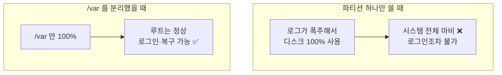
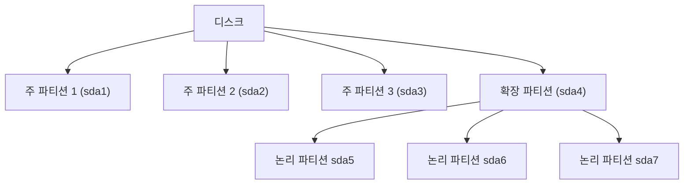

## 024. 디스크와 파티션 관리

### 1. 새 디스크를 사용하기까지의 전체 흐름

**실기 시험의 핵심 시나리오**입니다. 순서를 정확히 외워야 합니다.


| 단계 | 명령어 | 하는 일 |
| --- | --- | --- |
| ① 인식 확인 | `lsblk`, `fdisk -l` | 디스크가 보이는지 |
| ② **파티션 생성** | **`fdisk`**, `gdisk`, `parted` | 디스크를 논리적으로 나눔 |
| ③ **파일 시스템 생성** | **`mkfs`** | 포맷 (파일을 저장할 규칙 부여) |
| ④ 마운트 | `mount` | 디렉터리 트리에 연결 |
| ⑤ 영구 등록 | `/etc/fstab` | 재부팅해도 유지 |

> **파티션만 만들고 포맷하지 않으면 사용할 수 없습니다.**  
> 파티션은 "땅을 구획하는 것", 파일 시스템은 "건물을 세우는 것"이라고 생각하면 됩니다.

---

### 2. 파티션이란

**하나의 물리 디스크를 여러 개의 논리적 영역으로 나누는 것**입니다.

#### 왜 나눌까?

| 이유 | 설명 |
| --- | --- |
| **데이터 보호** | OS를 재설치해도 `/home`은 그대로 유지 |
| **용량 폭주 방지** | `/var/log`가 가득 차도 루트(`/`)는 안전 |
| **성능·용도 분리** | 파티션마다 다른 파일 시스템·마운트 옵션 적용 |
| **보안** | `/tmp`를 `noexec,nosuid`로 마운트 |



---

### 3. MBR vs GPT

| 구분 | **MBR** | **GPT** |
| --- | --- | --- |
| 정식 명칭 | Master Boot Record | GUID Partition Table |
| 등장 | 1983 | 2000년대 |
| 짝이 되는 펌웨어 | **BIOS** | **UEFI** |
| **최대 디스크 용량** | **2TB** | 사실상 무제한 (9.4ZB) |
| **주 파티션 수** | **4개** | **128개** |
| 파티션 테이블 백업 | **없음** | **디스크 앞뒤 이중 저장** ⭐ |
| 무결성 검사 | 없음 | **CRC32** |
| 사용 도구 | `fdisk` | **`gdisk`, `parted`** |

#### MBR의 구조 (시험 단골)

```
MBR = 512 바이트
┌──────────────────────────────┬──────────────────┬────────┐
│  부트로더 코드                │  파티션 테이블    │ 시그니처│
│  446 바이트                   │  64 바이트        │  2 바이트│
│                              │  = 16 × 4개       │ (0x55AA)│
└──────────────────────────────┴──────────────────┴────────┘
```

**파티션 테이블이 64바이트, 항목 하나가 16바이트 → 주 파티션 최대 4개**

#### MBR의 파티션 종류



| 종류 | 설명 | 번호 |
| --- | --- | --- |
| **주 파티션 (Primary)** | 부팅 가능, **최대 4개** | **1 ~ 4** |
| **확장 파티션 (Extended)** | 논리 파티션을 담는 그릇, **디스크당 1개만**, 직접 사용 불가 | 1 ~ 4 중 하나 |
| **논리 파티션 (Logical)** | 확장 파티션 안에 생성 | **5부터** |

> **핵심** : 4개보다 많은 파티션이 필요하면  
> **주 3개 + 확장 1개**를 만들고, 확장 안에 **논리 파티션을 5번부터** 생성합니다.  
> 그래서 `/dev/sda5`가 존재한다면 **그 디스크에는 확장 파티션이 있다**는 뜻입니다.

---

### 4. `fdisk` — MBR 파티션 관리

```bash
# 디스크 목록 확인
$ sudo fdisk -l
$ sudo fdisk -l /dev/sdb

# 파티션 편집 시작
$ sudo fdisk /dev/sdb
```

#### 대화형 명령어 (실기 필수 암기)

| 키 | 기능 |
| --- | --- |
| **`m`** | **도움말** |
| **`p`** | **현재 파티션 목록 출력 (print)** |
| **`n`** | **새 파티션 생성 (new)** |
| **`d`** | **파티션 삭제 (delete)** |
| **`t`** | **파티션 타입 변경 (type)** |
| **`l`** | 파티션 타입 목록 |
| **`a`** | 부팅 가능 플래그 토글 |
| **`w`** | **저장하고 종료 (write)** ⭐ |
| **`q`** | **저장하지 않고 종료 (quit)** |

> **`w`를 눌러야 실제로 디스크에 기록됩니다.**  
> 실수했다면 **`q`로 빠져나오면 아무 변경도 일어나지 않습니다.** 이것이 중요한 안전장치입니다.

#### 실제 작업 예시

```bash
$ sudo fdisk /dev/sdb

Command (m for help): p                    ← 현재 상태 확인
Disk /dev/sdb: 20 GiB, 21474836480 bytes

Command (m for help): n                    ← 새 파티션
Partition type
   p   primary (0 primary, 0 extended, 4 free)
   e   extended
Select (default p): p                      ← 주 파티션
Partition number (1-4, default 1): 1
First sector (2048-41943039, default 2048): [Enter]
Last sector, +sectors or +size{K,M,G,T,P}: +10G     ← 크기 지정 ⭐

Created a new partition 1 of type 'Linux' and of size 10 GiB.

Command (m for help): t                    ← 타입 변경
Selected partition 1
Hex code: 8e                               ← 8e = Linux LVM
Changed type of partition 'Linux' to 'Linux LVM'.

Command (m for help): p                    ← 확인
Device     Boot Start      End  Sectors Size Id Type
/dev/sdb1        2048 20973567 20971520  10G 8e Linux LVM

Command (m for help): w                    ← 저장 ⭐
The partition table has been altered.
```

#### 주요 파티션 타입 코드 (시험 출제)

| 코드 | 타입 |
| --- | --- |
| **`83`** | **Linux** (일반 파일 시스템) — 기본값 |
| **`82`** | **Linux swap** |
| **`8e`** | **Linux LVM** |
| **`fd`** | **Linux RAID (autodetect)** |
| `5` | Extended |
| `7` | NTFS/exFAT |
| `b` / `c` | FAT32 |
| `ef` | EFI System Partition |

```bash
# 커널에 파티션 변경을 알림 (재부팅 없이) ⭐
$ sudo partprobe /dev/sdb
$ sudo partx -u /dev/sdb
$ lsblk
```

> **`w` 후에도 `lsblk`에 안 보이면** 커널이 아직 파티션 테이블을 다시 읽지 않은 것입니다.  
> **`partprobe`** 를 실행하면 재부팅 없이 반영됩니다.

---

### 5. `gdisk` / `parted` — GPT 파티션 관리

#### `gdisk` (GPT 전용, fdisk와 사용법 유사)

```bash
$ sudo gdisk /dev/sdb

Command (? for help): n         # 새 파티션
Command (? for help): p         # 목록
Command (? for help): t         # 타입 변경
Command (? for help): w         # 저장
```

**GPT 파티션 타입 코드**

| 코드 | 타입 |
| --- | --- |
| **`8300`** | Linux filesystem |
| **`8200`** | Linux swap |
| **`8e00`** | Linux LVM |
| **`fd00`** | Linux RAID |
| `ef00` | EFI System |

#### `parted` (MBR·GPT 모두 지원, 2TB 초과 필수)

```bash
# 대화형
$ sudo parted /dev/sdb
(parted) print                              # 현재 상태
(parted) mklabel gpt                        # GPT 레이블 생성 ⭐
(parted) mkpart primary xfs 1MiB 10GiB      # 파티션 생성
(parted) print
(parted) quit

# 비대화형 (스크립트에 유용)
$ sudo parted -s /dev/sdb mklabel gpt
$ sudo parted -s /dev/sdb mkpart primary xfs 1MiB 10GiB
$ sudo parted -s /dev/sdb set 1 lvm on
$ sudo parted /dev/sdb print
```

> **2TB를 넘는 디스크는 `fdisk`(MBR)로 다룰 수 없습니다.**  
> 반드시 **`parted` 또는 `gdisk`로 GPT** 를 사용해야 합니다.  
> `parted`는 명령을 입력하는 즉시 적용되므로 (fdisk의 `w`가 없음) **더 신중해야 합니다.**

---

### 6. 파일 시스템 생성 — `mkfs`

```bash
# 방법 ① mkfs -t
$ sudo mkfs -t xfs /dev/sdb1
$ sudo mkfs -t ext4 /dev/sdb1

# 방법 ② mkfs.타입 (더 흔히 사용)
$ sudo mkfs.xfs /dev/sdb1
$ sudo mkfs.ext4 /dev/sdb1
$ sudo mkfs.vfat -F 32 /dev/sdb1        # FAT32 (USB 호환)

# 옵션
$ sudo mkfs.ext4 -L DATA /dev/sdb1      # 레이블 지정
$ sudo mkfs.ext4 -b 4096 /dev/sdb1      # 블록 크기
$ sudo mkfs.xfs -f /dev/sdb1            # 기존 파일시스템 덮어쓰기 강제

# 스왑 영역 생성
$ sudo mkswap /dev/sdb2
$ sudo swapon /dev/sdb2
```

> **`mkfs`는 되돌릴 수 없습니다.**  
> 장치 이름을 잘못 입력하면 **기존 데이터가 전부 사라집니다.**  
> 실행 전 반드시 `lsblk`로 **대상 장치를 두 번 확인**하는 습관이 필요합니다.

#### 파일 시스템 비교 (선택 기준)

| 파일 시스템 | 저널링 | 최대 파일 | 확장 | **축소** | 비고 |
| --- | --- | --- | --- | --- | --- |
| **ext4** | ✅ | 16TB | ✅ | **✅** | 범용, 축소 가능 |
| **XFS** | ✅ | 8EB | ✅ | **❌ 불가** | **RHEL/Rocky 기본**, 대용량 강함 |
| ext2 | ❌ | 2TB | ✅ | ✅ | 저널링 없음 (USB용) |
| Btrfs | ✅ | 16EB | ✅ | ✅ | 스냅샷·압축 내장 |
| vfat | ❌ | **4GB** ❗ | — | — | Windows 호환, 4GB 파일 제한 |

> **XFS는 축소가 불가능**하다는 점이 실무에서 매우 중요합니다.  
> Rocky Linux 기본이 XFS이므로, **파티션 크기를 처음에 여유 있게 잡거나 LVM을 써야** 합니다.

---

### 7. 마운트와 `/etc/fstab`

```bash
# 임시 마운트 (재부팅하면 사라짐)
$ sudo mkdir -p /data
$ sudo mount /dev/sdb1 /data
$ df -hT | grep data

# UUID 확인
$ sudo blkid /dev/sdb1
/dev/sdb1: UUID="a1b2c3d4-e5f6-7890-abcd-ef1234567890" TYPE="xfs"
```

#### `/etc/fstab` 등록 (영구)

```bash
$ sudo vi /etc/fstab
```

```
UUID=a1b2c3d4-e5f6-7890-abcd-ef1234567890  /data  xfs  defaults  0 2
              ①                              ②     ③      ④      ⑤ ⑥
```

| 번호 | 필드 | 설명 |
| --- | --- | --- |
| **①** | **장치** | **UUID 권장** (`/dev/sdb1`은 순서가 바뀔 수 있음) |
| **②** | 마운트 지점 | `/data`, `swap` |
| **③** | 파일 시스템 타입 | `xfs`, `ext4`, `swap` |
| **④** | 마운트 옵션 | `defaults`, `noexec`, `usrquota` |
| **⑤** | **dump** | 백업 대상 — **0=안 함** |
| **⑥** | **fsck 순서** | **0=검사 안 함, 1=루트(`/`), 2=나머지** |

```bash
# ❗재부팅 전에 반드시 검증
$ sudo mount -a           # fstab의 모든 항목을 지금 마운트
$ findmnt --verify        # 문법 검증
$ df -hT
```

> **fstab을 잘못 쓰고 재부팅하면 응급 모드로 빠져 부팅되지 않습니다.**  
> 이는 실무에서 가장 흔한 사고 중 하나입니다.  
> **`mount -a`로 검증하는 것이 유일한 예방책**입니다.
>
> 만약 사고가 났다면 응급 모드에서 복구합니다.
> ```bash
> # 응급 모드 진입 후
> $ mount -o remount,rw /
> $ vi /etc/fstab          # 문제 줄 앞에 # 추가
> $ reboot
> ```
>
> 또는 `nofail` 옵션을 넣어 두면 마운트 실패해도 부팅은 진행됩니다.
> ```
> UUID=...  /data  xfs  defaults,nofail  0 2
> ```

---

### 8. 주요 마운트 옵션

| 옵션 | 의미 |
| --- | --- |
| **`defaults`** | `rw,suid,dev,exec,auto,nouser,async` |
| `rw` / `ro` | 읽기·쓰기 / 읽기 전용 |
| **`noexec`** | **실행 파일 실행 금지** (보안) |
| **`nosuid`** | **SetUID 무시** (보안) |
| **`nodev`** | 장치 파일 무시 (보안) |
| **`noatime`** | 접근 시각 갱신 안 함 (**성능 향상**) |
| `relatime` | 조건부 atime 갱신 (기본값) |
| **`nofail`** | 마운트 실패해도 **부팅 계속** |
| `auto` / `noauto` | `mount -a` 대상 포함 / 제외 |
| `user` | 일반 사용자도 마운트 가능 |
| `usrquota`, `grpquota` | 디스크 쿼터 사용 |
| `discard` | SSD TRIM 활성화 |

#### 보안을 위한 마운트 옵션 조합

```
/dev/sdb1  /tmp   xfs  defaults,noexec,nosuid,nodev  0 2
/dev/sdb2  /home  xfs  defaults,nosuid,nodev         0 2
```

> **왜 `/tmp`에 `noexec`을 걸까?**  
> `/tmp`는 누구나 쓸 수 있는 공간이라, 공격자가 **악성 스크립트를 업로드하고 실행**하기 좋은 위치입니다.  
> `noexec`을 걸면 파일을 올릴 수는 있어도 **실행할 수 없습니다.**

---

### 9. 디스크 성능과 상태 점검

```bash
# I/O 통계
$ iostat -x 1 3
Device  r/s   w/s  rkB/s  wkB/s  await  %util
sda    12.0  45.0  480.0 1800.0   8.50   85.2
                                   │      │
                                   │      └── 100%에 가까우면 포화
                                   └── 평균 대기 시간(ms), 높으면 병목

# 실시간 I/O 사용 프로세스
$ sudo iotop -o

# 디스크 속도 측정
$ sudo hdparm -tT /dev/sda
 Timing cached reads:   18000 MB in  2.00 seconds = 9000 MB/sec
 Timing buffered disk reads: 1200 MB in  3.00 seconds = 400 MB/sec

# 쓰기 속도 간단 측정
$ dd if=/dev/zero of=/tmp/test bs=1M count=1024 oflag=direct
1073741824 bytes (1.1 GB) copied, 2.5 s, 429 MB/s
$ rm /tmp/test

# S.M.A.R.T. — 디스크 건강 상태 ⭐
$ sudo dnf install smartmontools
$ sudo smartctl -H /dev/sda
SMART overall-health self-assessment test result: PASSED

$ sudo smartctl -a /dev/sda | grep -E "Reallocated|Pending|Uncorrectable"
  5 Reallocated_Sector_Ct   0x0033   100   100   010    -    0
197 Current_Pending_Sector  0x0032   100   100   000    -    0
```

> **디스크 교체 시점을 판단하는 지표**  
> **`Reallocated_Sector_Ct`** (대체된 불량 섹터)와 **`Current_Pending_Sector`** 가  
> **0이 아니고 계속 증가한다면** 디스크 수명이 다해 가는 신호입니다.  
> 즉시 백업하고 교체를 준비해야 합니다.

---

### 10. 파일 시스템 크기 조정

```bash
# XFS 확장 (마운트된 상태에서, 축소 불가) ⭐
$ sudo xfs_growfs /data

# ext4 확장
$ sudo resize2fs /dev/sdb1
$ sudo resize2fs /dev/sdb1 20G

# ext4 축소 (반드시 언마운트 후)
$ sudo umount /data
$ sudo e2fsck -f /dev/sdb1        # 먼저 검사 필수 ⭐
$ sudo resize2fs /dev/sdb1 10G
$ sudo mount /data
```

> **크기 조정 순서를 헷갈리면 데이터가 날아갑니다.**  
> **확장** : 파티션 늘리기 → 파일 시스템 늘리기  
> **축소** : **파일 시스템 줄이기 → 파티션 줄이기** (순서가 반대!)  
>
> 이 복잡함 때문에 실무에서는 **LVM을 사용**합니다. ([025. LVM과 RAID])

---

### 시험 포인트 정리

| 항목 | 핵심 |
| --- | --- |
| 디스크 사용 순서 | **파티션 → 파일시스템(mkfs) → 마운트 → fstab** |
| MBR 구조 | **512B = 446(부트로더) + 64(테이블) + 2(시그니처)** |
| MBR 한계 | **주 파티션 4개, 2TB** |
| 논리 파티션 번호 | **5번부터** |
| 확장 파티션 | **디스크당 1개만**, 직접 사용 불가 |
| GPT | 파티션 **128개**, **이중 백업**, UEFI와 짝 |
| MBR 도구 | **`fdisk`** |
| GPT 도구 | **`gdisk`, `parted`** |
| fdisk 저장 | **`w`** / 취소 **`q`** |
| 파티션 타입 `83` | **Linux** |
| 파티션 타입 `82` | **Linux swap** |
| 파티션 타입 **`8e`** | **Linux LVM** |
| 파티션 타입 **`fd`** | **Linux RAID** |
| 커널에 변경 알림 | **`partprobe`** |
| 파일 시스템 생성 | **`mkfs -t`** 또는 `mkfs.xfs` |
| 스왑 생성 | **`mkswap` → `swapon`** |
| fstab 5번 필드 | **dump (0=안 함)** |
| fstab 6번 필드 | **fsck (루트=1, 나머지=2, 안 함=0)** |
| fstab 검증 | **`mount -a`** |
| 부팅 실패 방지 옵션 | **`nofail`** |
| **XFS** | **확장 O, 축소 X** (`xfs_growfs`) |
| ext4 크기 조정 | **`resize2fs`** |
| 디스크 건강 확인 | **`smartctl -H`** |

---

### 한 줄 정리

새 디스크는 **파티션(`fdisk`/`parted`) → 파일 시스템(`mkfs`) → 마운트 → `/etc/fstab` 등록** 순으로 사용하며,  
**MBR은 주 파티션 4개·2TB 한계로 논리 파티션이 5번부터** 시작하고 **GPT는 128개·무제한**이며,  
fstab 수정 후에는 **반드시 `mount -a`로 검증**해야 부팅 실패를 막을 수 있습니다.
