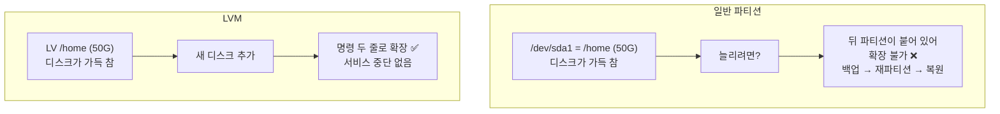
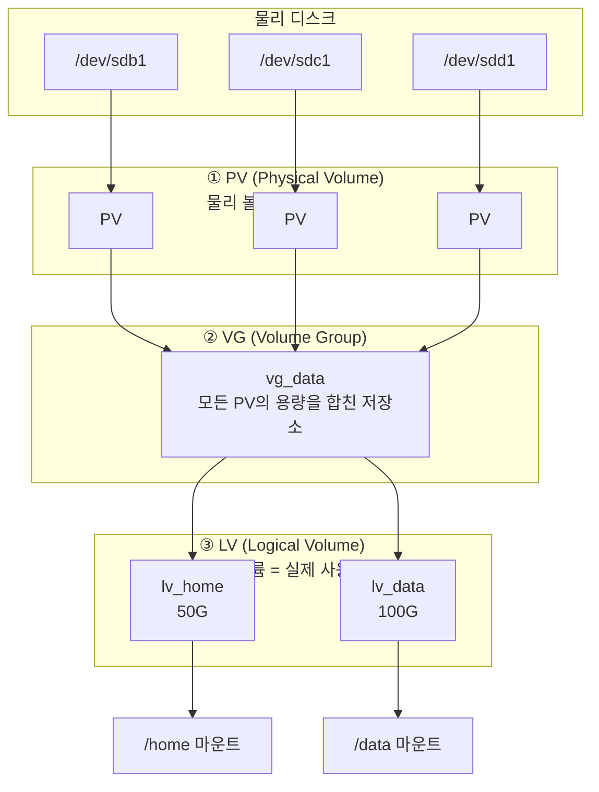
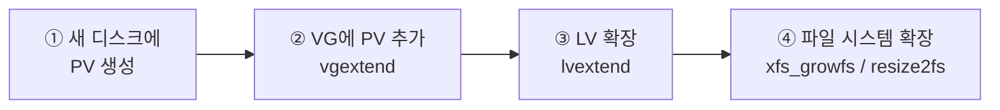
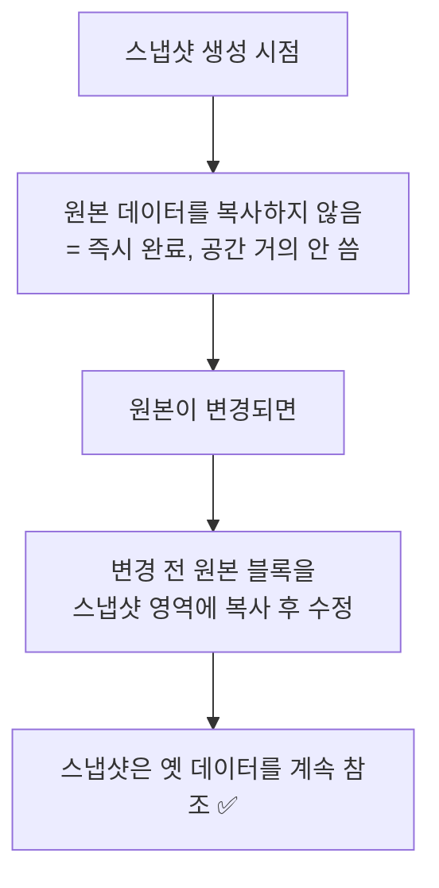
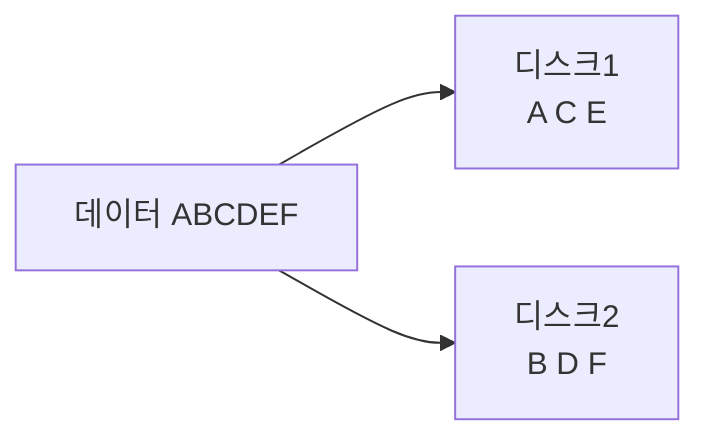
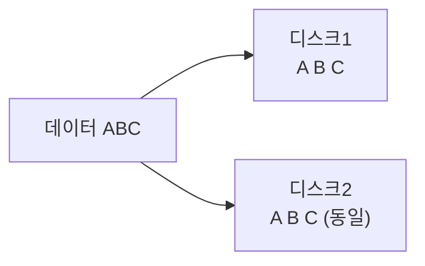
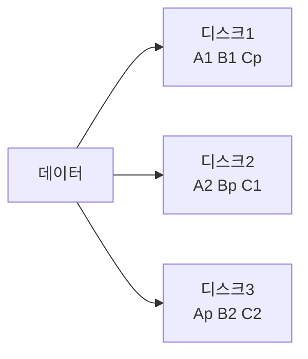
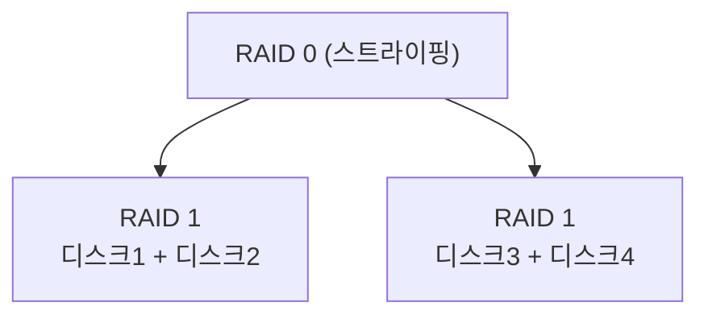
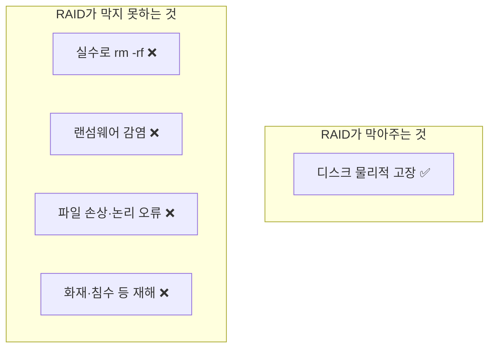
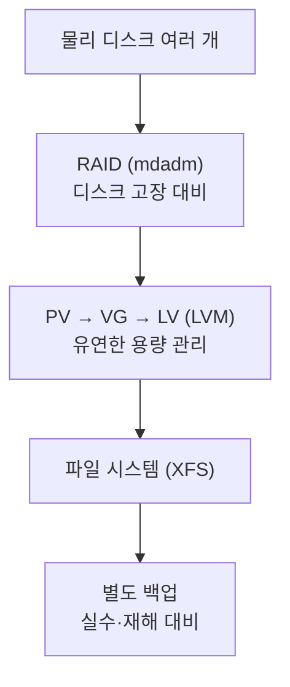

## 025. LVM과 RAID

### 1. LVM이 필요한 이유

일반 파티션의 가장 큰 문제는 **한 번 정하면 바꾸기 어렵다**는 점입니다.



**LVM(Logical Volume Manager)** 은 물리 디스크와 파일 시스템 사이에 **추상화 계층**을 넣어  
디스크 크기를 **유연하게 조정**할 수 있게 합니다.

---

### 2. LVM의 3계층 구조

**LVM에서 가장 중요한 개념**입니다.



| 계층 | 이름 | 역할 |
| --- | --- | --- |
| **①** | **PV** (Physical Volume) | **물리 디스크·파티션을 LVM용으로 초기화**한 것 |
| **②** | **VG** (Volume Group) | **여러 PV를 묶은 하나의 큰 저장소 풀** |
| **③** | **LV** (Logical Volume) | **VG에서 잘라 쓰는 실제 사용 단위** (파티션처럼 사용) |
| — | **PE** (Physical Extent) | VG를 구성하는 **최소 할당 단위** (기본 4MB) |

> **비유로 이해하기**  
> **PV** = 밀가루 포대 여러 개  
> **VG** = 포대를 전부 부어 만든 **큰 밀가루 통**  
> **LV** = 통에서 필요한 만큼 퍼낸 **반죽 덩어리**  
> **PE** = 퍼내는 **국자 한 스푼 크기** (최소 단위)

---

### 3. LVM 구축 실습 (실기 필수)

```bash
# ────────── 준비: 파티션 생성 후 타입을 8e(Linux LVM)로 ──────────
$ sudo fdisk /dev/sdb
  n → p → 1 → Enter → Enter
  t → 8e            ← 파티션 타입을 Linux LVM으로 ⭐
  w
$ sudo partprobe /dev/sdb

# ────────── ① PV 생성 ──────────
$ sudo pvcreate /dev/sdb1 /dev/sdc1
  Physical volume "/dev/sdb1" successfully created.

$ sudo pvs                    # 간단 조회
  PV         VG Fmt  Attr PSize  PFree
  /dev/sdb1     lvm2 ---  20.00g 20.00g
  /dev/sdc1     lvm2 ---  20.00g 20.00g

$ sudo pvdisplay              # 상세 조회
$ sudo pvscan                 # 스캔

# ────────── ② VG 생성 ──────────
$ sudo vgcreate vg_data /dev/sdb1 /dev/sdc1
  Volume group "vg_data" successfully created

$ sudo vgs
  VG      #PV #LV #SN Attr   VSize  VFree
  vg_data   2   0   0 wz--n- 39.99g 39.99g
                                     └── 사용 가능 공간

$ sudo vgdisplay vg_data | grep "PE Size"
  PE Size               4.00 MiB      ← PE 기본 크기

# PE 크기를 지정하려면
$ sudo vgcreate -s 16M vg_data /dev/sdb1

# ────────── ③ LV 생성 ──────────
$ sudo lvcreate -L 10G -n lv_home vg_data      # 크기 지정
$ sudo lvcreate -l 100%FREE -n lv_data vg_data # 남은 공간 전부 ⭐

$ sudo lvs
  LV      VG      Attr       LSize
  lv_home vg_data -wi-a----- 10.00g
  lv_data vg_data -wi-a----- 29.99g

$ sudo lvdisplay

# ────────── ④ 파일 시스템 생성 & 마운트 ──────────
$ sudo mkfs.xfs /dev/vg_data/lv_home
$ sudo mkdir -p /home2
$ sudo mount /dev/vg_data/lv_home /home2

# ────────── ⑤ fstab 등록 ──────────
$ sudo blkid /dev/vg_data/lv_home
$ sudo vi /etc/fstab
/dev/mapper/vg_data-lv_home  /home2  xfs  defaults  0 2
$ sudo mount -a
```

#### LV 장치 경로 (두 가지 표기)

```bash
/dev/vg_data/lv_home              # 사람이 읽기 쉬운 형태
/dev/mapper/vg_data-lv_home       # device-mapper 실제 경로
```

둘은 같은 장치를 가리킵니다. `fstab`에는 보통 `/dev/mapper/` 형식을 씁니다.

| 옵션 | 의미 |
| --- | --- |
| **`-L`** | **크기 지정** (`-L 10G`) |
| **`-l`** | **PE 개수 또는 비율** (`-l 100%FREE`, `-l 50%VG`) |
| **`-n`** | LV 이름 |

---

### 4. LVM 용량 확장 (가장 중요한 시나리오)



```bash
# ① 새 디스크 준비
$ sudo pvcreate /dev/sdd1

# ② VG에 추가 (VG 용량 증가)
$ sudo vgextend vg_data /dev/sdd1
$ sudo vgs                              # VFree가 늘어남 확인

# ③ LV 확장
$ sudo lvextend -L +10G /dev/vg_data/lv_home        # 10G 추가
$ sudo lvextend -l +100%FREE /dev/vg_data/lv_home   # 남은 공간 전부

# ④ 파일 시스템 확장 (❗이 단계를 빠뜨리면 용량이 늘지 않음)
$ sudo xfs_growfs /home2                # XFS
$ sudo resize2fs /dev/vg_data/lv_home   # ext4

# ⭐ ③④를 한 번에 (매우 편리)
$ sudo lvextend -r -L +10G /dev/vg_data/lv_home
#              └── -r: 파일 시스템까지 자동 확장 (resizefs)
```

> **가장 흔한 실수** : `lvextend`만 하고 `xfs_growfs`를 빠뜨리는 것입니다.  
> LV(그릇)는 커졌지만 **파일 시스템(내용물)은 그대로**라 `df`에 반영되지 않습니다.  
> **`-r` 옵션을 쓰면 한 번에 처리**되므로 실수를 막을 수 있습니다.

#### LV 축소 (ext4만 가능, 매우 위험)

```bash
# 순서가 확장과 반대입니다 ⭐
$ sudo umount /data
$ sudo e2fsck -f /dev/vg_data/lv_data          # ① 검사
$ sudo resize2fs /dev/vg_data/lv_data 10G      # ② 파일 시스템 먼저 축소
$ sudo lvreduce -L 10G /dev/vg_data/lv_data    # ③ LV 축소
$ sudo mount /data

# 또는 -r 옵션으로 한 번에
$ sudo lvreduce -r -L 10G /dev/vg_data/lv_data
```

> **⚠️ XFS는 축소가 불가능합니다.**  
> Rocky/RHEL 기본이 XFS이므로, 축소가 필요하다면 **백업 → LV 재생성 → 복원** 밖에 없습니다.  
> 또한 축소는 **순서를 틀리면 데이터가 손상**되므로 반드시 백업 후 진행해야 합니다.

---

### 5. LVM 스냅샷

**특정 시점의 상태를 보존**하는 기능입니다. 백업 중 데이터가 변경되는 문제를 해결합니다.

```bash
# 스냅샷 생성
$ sudo lvcreate -L 5G -s -n lv_data_snap /dev/vg_data/lv_data
                      └── -s: snapshot

# 마운트해서 백업
$ sudo mkdir /mnt/snap
$ sudo mount -o ro,nouuid /dev/vg_data/lv_data_snap /mnt/snap
$ sudo tar czf /backup/data.tar.gz -C /mnt/snap .

# 정리
$ sudo umount /mnt/snap
$ sudo lvremove /dev/vg_data/lv_data_snap

# 스냅샷 시점으로 되돌리기 (병합)
$ sudo lvconvert --merge /dev/vg_data/lv_data_snap
```

#### 스냅샷의 원리 — CoW (Copy on Write)



> **스냅샷 크기를 어떻게 잡아야 할까?**  
> 스냅샷은 **원본 전체가 아니라 "변경된 부분"만** 저장합니다.  
> 백업 시간 동안 예상되는 변경량의 10~20% 정도면 충분합니다.  
> **다만 스냅샷 공간이 꽉 차면 스냅샷이 무효화**되므로 여유를 둬야 합니다.

---

### 6. LVM 관리 명령어 정리

| 대상 | 생성 | 조회(간단) | 조회(상세) | 확장 | 축소 | 삭제 |
| --- | --- | --- | --- | --- | --- | --- |
| **PV** | `pvcreate` | `pvs` | `pvdisplay` | — | — | `pvremove` |
| **VG** | `vgcreate` | `vgs` | `vgdisplay` | **`vgextend`** | `vgreduce` | `vgremove` |
| **LV** | `lvcreate` | `lvs` | `lvdisplay` | **`lvextend`** | `lvreduce` | `lvremove` |

```bash
# 전체 구조 한눈에 보기 ⭐
$ sudo lvs -o +devices
$ lsblk
NAME                   TYPE  SIZE MOUNTPOINT
sdb                    disk   20G
└─sdb1                 part   20G
  └─vg_data-lv_home    lvm    30G /home2
sdc                    disk   20G
└─sdc1                 part   20G
  └─vg_data-lv_home    lvm    30G /home2
```

#### LVM의 장단점

| 장점 | 단점 |
| --- | --- |
| **온라인 용량 확장** | 구조가 복잡해 **장애 시 복구가 어려움** |
| **여러 디스크를 하나로 통합** | 레이어가 추가되어 **약간의 성능 저하** |
| **스냅샷** 지원 | 부팅 파티션(`/boot`)에는 사용 제한 |
| 디스크 교체·이동이 유연 | LVM 자체는 **데이터 보호 기능이 없음** ❗ |

> **중요** : LVM은 **용량 관리 도구이지 백업·이중화 도구가 아닙니다.**  
> VG에 속한 디스크 하나가 고장 나면 **전체 데이터를 잃을 수 있습니다.**  
> 데이터 보호는 **RAID**가 담당합니다.

---

### 7. RAID란

**RAID(Redundant Array of Independent Disks)** 는 **여러 디스크를 묶어 성능이나 안정성을 높이는 기술**입니다.

| 목적 | 방법 |
| --- | --- |
| **성능 향상** | 여러 디스크에 **나눠서 동시에** 읽고 쓰기 (스트라이핑) |
| **안정성 향상** | **같은 데이터를 복제**하거나 **패리티**로 복구 가능하게 |

#### 구현 방식

| 구분 | 설명 | 특징 |
| --- | --- | --- |
| **하드웨어 RAID** | 전용 RAID 컨트롤러 카드 | 성능 좋음, 비쌈, OS와 무관 |
| **소프트웨어 RAID** | 커널이 처리 (**`mdadm`**) | 무료, CPU 사용, 유연함 |
| 펌웨어/Fake RAID | 메인보드 칩셋 | 권장하지 않음 |

---

### 8. RAID 레벨 (시험 최다 출제)

#### RAID 0 — 스트라이핑 (Striping)



| 항목 | 내용 |
| --- | --- |
| 최소 디스크 | **2개** |
| **용량 효율** | **100%** (손실 없음) |
| **성능** | **읽기·쓰기 모두 최고** |
| **결함 허용** | **없음** ❗ 디스크 1개만 고장 나도 **전체 데이터 손실** |
| 용도 | 임시 작업 공간, 캐시 (중요 데이터 ❌) |

#### RAID 1 — 미러링 (Mirroring)



| 항목 | 내용 |
| --- | --- |
| 최소 디스크 | **2개** |
| **용량 효율** | **50%** (절반만 사용) |
| 성능 | 읽기 향상, 쓰기는 동일하거나 약간 저하 |
| **결함 허용** | **디스크 1개 고장까지 OK** |
| 용도 | OS 영역, 중요 데이터 |

#### RAID 5 — 분산 패리티



| 항목 | 내용 |
| --- | --- |
| **최소 디스크** | **3개** |
| **용량 효율** | **(N-1)/N** — 디스크 1개 분량을 패리티로 사용 |
| 성능 | 읽기 좋음, **쓰기는 패리티 계산 때문에 느림** |
| **결함 허용** | **디스크 1개** |
| 용도 | 일반 파일 서버 (가장 널리 쓰임) |

#### RAID 6 — 이중 패리티

| 항목 | 내용 |
| --- | --- |
| **최소 디스크** | **4개** |
| **용량 효율** | **(N-2)/N** |
| **결함 허용** | **디스크 2개** ⭐ |
| 용도 | 대용량 디스크 환경 (재구축 중 추가 고장 대비) |

#### RAID 10 (1+0) — 미러 후 스트라이프



| 항목 | 내용 |
| --- | --- |
| **최소 디스크** | **4개** |
| **용량 효율** | **50%** |
| **성능** | **매우 우수** (RAID 0의 속도) |
| **결함 허용** | 각 미러 쌍에서 1개씩 (**운이 좋으면 절반까지**) |
| 용도 | **데이터베이스** (성능+안정성 모두 필요) |

#### RAID 레벨 비교표 (반드시 암기)

| 레벨 | 최소 디스크 | 용량 효율 | 결함 허용 | 특징 |
| --- | --- | --- | --- | --- |
| **0** | **2** | **100%** | **0개** ❗ | 속도 최고, 안정성 없음 |
| **1** | **2** | **50%** | **1개** | 안정성, 용량 손실 큼 |
| **5** | **3** | **(N-1)/N** | **1개** | 균형형, 쓰기 느림 |
| **6** | **4** | **(N-2)/N** | **2개** | 안정성 높음, 더 느림 |
| **10** | **4** | **50%** | 미러당 1개 | 성능+안정성, 비쌈 |
| 2, 3, 4 | — | — | — | 거의 사용 안 함 |

> **용량 계산 예시**  
> 1TB 디스크 4개로 구성 시  
> RAID 0 → **4TB** / RAID 1 → **2TB** / RAID 5 → **3TB** / RAID 6 → **2TB** / RAID 10 → **2TB**

#### 패리티(Parity)의 원리

RAID 5가 어떻게 디스크 하나가 죽어도 복구할 수 있을까요?  
**XOR 연산**을 이용합니다.

```
데이터 A = 1 0 1 1
데이터 B = 0 1 1 0
─────────────────── XOR
패리티 P = 1 1 0 1

디스크 B가 고장 나면?
A XOR P = 1011 XOR 1101 = 0110 = B  ✅ 복구 성공
```

> **왜 RAID 5는 쓰기가 느릴까?**  
> 데이터를 조금만 바꿔도 **패리티를 다시 계산해서 써야** 합니다.  
> 읽기 → 계산 → 쓰기가 반복되므로 이를 **"쓰기 페널티(Write Penalty)"** 라고 합니다.

---

### 9. `mdadm` — 소프트웨어 RAID 구성 (실기)

```bash
$ sudo dnf install mdadm

# ────────── RAID 5 생성 ──────────
# 준비: 파티션 타입을 fd(Linux RAID)로 설정
$ sudo fdisk /dev/sdb
  n → p → 1 → Enter → Enter
  t → fd            ← Linux RAID autodetect ⭐
  w

$ sudo mdadm --create /dev/md0 --level=5 --raid-devices=3 \
             /dev/sdb1 /dev/sdc1 /dev/sdd1

# 상태 확인 ⭐
$ cat /proc/mdstat
Personalities : [raid6] [raid5] [raid4]
md0 : active raid5 sdd1[3] sdc1[1] sdb1[0]
      41908224 blocks super 1.2 level 5, 512k chunk, algorithm 2 [3/3] [UUU]
                                                                  │      │
                                                        정상 디스크 수   U=정상, _=고장

$ sudo mdadm --detail /dev/md0

# ────────── 파일 시스템 생성 & 마운트 ──────────
$ sudo mkfs.xfs /dev/md0
$ sudo mkdir /raid
$ sudo mount /dev/md0 /raid

# ────────── 설정 저장 (재부팅 후에도 유지) ⭐ ──────────
$ sudo mdadm --detail --scan | sudo tee -a /etc/mdadm.conf
$ sudo dracut -f          # initramfs 재생성 (RHEL 계열)

$ sudo vi /etc/fstab
/dev/md0  /raid  xfs  defaults  0 2
```

#### 디스크 장애 처리 (실기 단골)

```bash
# 상태 확인 — [U_U] 처럼 _ 가 보이면 고장
$ cat /proc/mdstat
md0 : active raid5 sdd1[3] sdb1[0]
      41908224 blocks ... [3/2] [U_U]
                                └── 두 번째 디스크 고장 ❗

# ① 고장 표시 (자동으로 되지만 수동으로도 가능)
$ sudo mdadm --manage /dev/md0 --fail /dev/sdc1

# ② 배열에서 제거
$ sudo mdadm --manage /dev/md0 --remove /dev/sdc1

# ③ 새 디스크 장착 후 추가
$ sudo mdadm --manage /dev/md0 --add /dev/sde1

# ④ 재구축 진행 상황 확인
$ cat /proc/mdstat
md0 : active raid5 sde1[4] sdd1[3] sdb1[0]
      [====>................]  recovery = 23.4% (4900000/20954112) finish=5.2min
```

| `mdadm` 옵션 | 기능 |
| --- | --- |
| `--create` | RAID 생성 |
| `--detail` | 상세 정보 |
| `--scan` | 스캔 |
| **`--fail`** | 디스크를 **고장으로 표시** |
| **`--remove`** | 배열에서 제거 |
| **`--add`** | 새 디스크 추가 |
| `--stop` | RAID 중지 |
| `--assemble` | RAID 재조립 |
| `--zero-superblock` | RAID 메타데이터 삭제 |

```bash
# 스페어 디스크 추가 (고장 시 자동 교체) ⭐
$ sudo mdadm --manage /dev/md0 --add-spare /dev/sdf1

# RAID 삭제
$ sudo umount /raid
$ sudo mdadm --stop /dev/md0
$ sudo mdadm --zero-superblock /dev/sdb1 /dev/sdc1 /dev/sdd1
```

---

### 10. RAID vs 백업 — 반드시 구분해야 합니다



> **"RAID는 백업이 아닙니다."**  
> RAID는 **디스크 고장으로 인한 서비스 중단을 막는 가용성 기술**입니다.  
> 실수로 파일을 지우면 **모든 디스크에서 동시에 지워집니다.**  
> **반드시 별도의 백업이 함께 있어야 합니다.**

**실무 구성** : **RAID(가용성) + LVM(유연한 용량 관리) + 정기 백업(복구)** 를 모두 사용합니다.



---

### 시험 포인트 정리

| 항목 | 핵심 |
| --- | --- |
| LVM 3계층 | **PV → VG → LV** |
| PE | VG의 **최소 할당 단위** (기본 4MB) |
| LVM용 파티션 타입 | **`8e`** |
| PV 생성 | **`pvcreate`** |
| VG 생성 / 확장 | **`vgcreate` / `vgextend`** |
| LV 생성 / 확장 | **`lvcreate` / `lvextend`** |
| LV 확장 후 | **반드시 `xfs_growfs` 또는 `resize2fs`** |
| 한 번에 확장 | **`lvextend -r`** |
| 축소 순서 | **파일시스템 먼저 → LV 나중** (확장과 반대) |
| XFS 축소 | **불가능** |
| 스냅샷 생성 | **`lvcreate -s`** |
| RAID용 파티션 타입 | **`fd`** |
| **RAID 0** | 최소 **2개**, 효율 **100%**, 결함 허용 **0** |
| **RAID 1** | 최소 **2개**, 효율 **50%**, 결함 허용 **1** |
| **RAID 5** | 최소 **3개**, 효율 **(N-1)/N**, 결함 허용 **1** |
| **RAID 6** | 최소 **4개**, 효율 **(N-2)/N**, 결함 허용 **2** |
| **RAID 10** | 최소 **4개**, 효율 **50%**, 성능+안정성 |
| RAID 상태 확인 | **`cat /proc/mdstat`**, `mdadm --detail` |
| 디스크 교체 | **`--fail` → `--remove` → `--add`** |
| RAID 설정 저장 | **`/etc/mdadm.conf`** |
| RAID ≠ 백업 | **실수·랜섬웨어는 못 막음** |

---

### 한 줄 정리

LVM은 **PV(물리) → VG(풀) → LV(사용 단위)** 3계층으로 용량을 유연하게 관리하며 **확장 후 `xfs_growfs`가 필수**이고,  
RAID는 **0(속도·결함허용 0) / 1(미러·50%) / 5(패리티·최소3개·1개허용) / 6(2개허용) / 10(성능+안정성)** 으로 구분되며,  
**RAID는 디스크 고장만 막을 뿐 백업을 대체하지 않습니다.**
