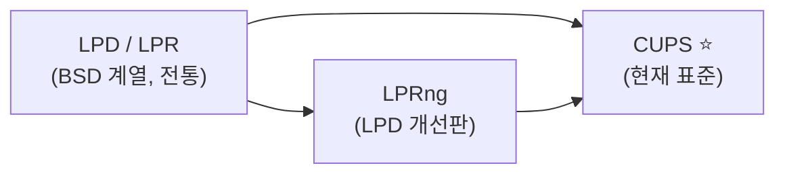
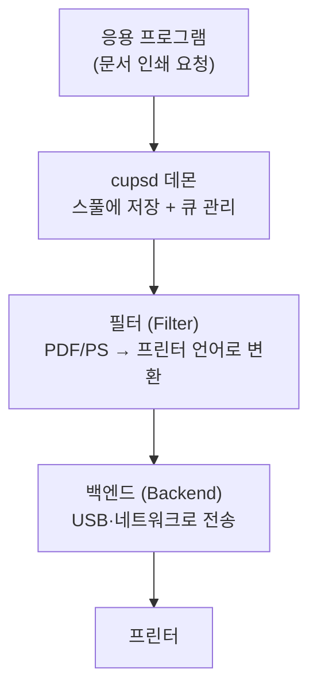
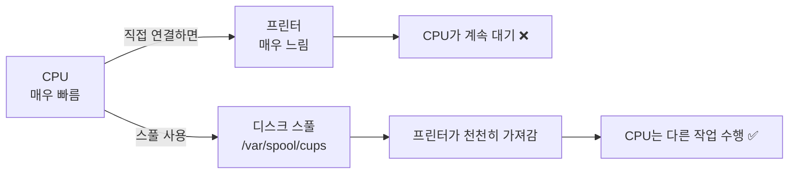
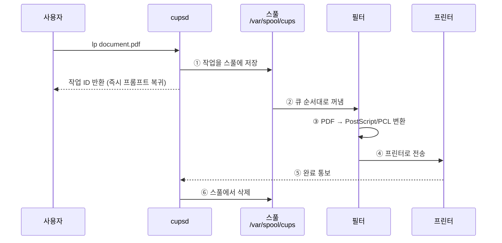

## 026. 프린터 관리

### 1. 리눅스 인쇄 시스템의 역사



| 시스템 | 설명 |
| --- | --- |
| **LPD** (Line Printer Daemon) | BSD 계열의 전통적 인쇄 시스템. 설정 파일은 `/etc/printcap` |
| **LPRng** | LPD의 개선 버전 |
| **CUPS** (Common UNIX Printing System) | **현재 리눅스·macOS의 표준**. Apple이 개발을 주도 |

> **CUPS가 표준이 된 이유**  
> LPD는 **텍스트 인쇄 중심**이라 현대 프린터의 다양한 기능(양면·컬러·해상도)을 다루기 어려웠습니다.  
> CUPS는 **IPP(Internet Printing Protocol)** 를 사용하여 네트워크 프린터를 표준 방식으로 다루고,  
> **웹 인터페이스**로 관리할 수 있어 훨씬 편리합니다.

---

### 2. CUPS 구조



| 구성 요소 | 역할 |
| --- | --- |
| **`cupsd`** | CUPS 데몬. 인쇄 요청을 받아 **큐에 저장하고 관리** |
| **필터(Filter)** | 문서를 **프린터가 이해하는 언어(PostScript, PCL)** 로 변환 |
| **백엔드(Backend)** | USB·네트워크 등 **실제 전송 경로** |
| **PPD 파일** | 프린터별 기능 정의 파일 (PostScript Printer Description) |

#### 스풀(Spool)이 필요한 이유



**SPOOL** = **S**imultaneous **P**eripheral **O**peration **O**n-**L**ine

인쇄 데이터를 **디스크에 먼저 저장**해 두고 프린터가 처리하게 하므로,  
사용자는 인쇄가 끝날 때까지 기다릴 필요가 없습니다.

> **인쇄 속도 자체는 오히려 느려집니다.** (디스크 입출력이 추가되므로)  
> 대신 **전체 작업 효율이 크게 향상**됩니다. 시험에서 자주 나오는 포인트입니다.

---

### 3. CUPS 설치와 서비스 관리

```bash
# 설치
$ sudo dnf install cups cups-client        # RHEL 계열
$ sudo apt install cups                    # Debian 계열

# 서비스 관리
$ sudo systemctl enable --now cups
$ systemctl status cups

# 방화벽 개방 (631 포트)
$ sudo firewall-cmd --add-service=ipp --permanent
$ sudo firewall-cmd --reload
```

#### 주요 파일과 디렉터리

| 경로 | 역할 |
| --- | --- |
| **`/etc/cups/cupsd.conf`** | **CUPS 데몬 주 설정 파일** |
| **`/etc/cups/printers.conf`** | 등록된 프린터 정보 |
| `/etc/cups/ppd/` | 프린터별 PPD 파일 |
| **`/var/spool/cups/`** | **인쇄 작업 스풀 디렉터리** |
| **`/var/log/cups/`** | 로그 (`access_log`, `error_log`, `page_log`) |
| `/etc/printcap` | LPD 시절 설정 (CUPS는 호환용으로만 생성) |

#### 웹 인터페이스

CUPS는 **631번 포트**에서 웹 관리 페이지를 제공합니다.

```
http://localhost:631
```

```bash
# 원격에서 접근하려면 cupsd.conf 수정
$ sudo vi /etc/cups/cupsd.conf
```

```apache
Listen *:631                 # 모든 인터페이스에서 수신

<Location />
  Order allow,deny
  Allow @LOCAL               # 로컬 네트워크 허용
</Location>

<Location /admin>
  Encryption Required
  Order allow,deny
  Allow @LOCAL
</Location>
```

```bash
$ sudo systemctl restart cups
```

> **CUPS의 포트 631**은 **IPP(Internet Printing Protocol)** 표준 포트입니다.  
> 시험에 자주 나오므로 반드시 기억해야 합니다.

---

### 4. 프린터 등록과 관리 — `lpadmin`

```bash
# 프린터 추가 (네트워크 프린터)
$ sudo lpadmin -p Office-Printer \
               -E \
               -v ipp://192.168.0.100/ipp/print \
               -m everywhere
#              │  │                              │
#              │  │                              └── 드라이버(PPD) 지정
#              │  └── 장치 URI
#              └── -E: 즉시 활성화

# USB 프린터
$ lpinfo -v                                 # 사용 가능한 장치 목록 ⭐
network ipp://192.168.0.100
direct usb://HP/LaserJet%20P1102

$ sudo lpadmin -p USB-Printer -E -v usb://HP/LaserJet%20P1102 -m drv:///...

# 드라이버 목록 확인
$ lpinfo -m | head -5

# 기본 프린터 지정 ⭐
$ sudo lpadmin -d Office-Printer
$ lpstat -d
system default destination: Office-Printer

# 프린터 삭제
$ sudo lpadmin -x Office-Printer

# 프린터 활성화 / 비활성화
$ sudo cupsenable Office-Printer
$ sudo cupsdisable Office-Printer

# 인쇄 요청 수락 / 거부
$ sudo cupsaccept Office-Printer
$ sudo cupsreject Office-Printer
```

| 옵션 | 의미 |
| --- | --- |
| **`-p`** | 프린터 이름 |
| **`-E`** | 활성화 (enable) |
| **`-v`** | 장치 URI |
| **`-m`** | 드라이버(PPD) 모델 |
| **`-d`** | **기본 프린터 지정** |
| **`-x`** | 프린터 삭제 |

> **`cupsdisable` vs `cupsreject` (자주 혼동)**  
> **`cupsdisable`** : 인쇄 요청은 **받지만 출력하지 않고 큐에 쌓아 둠** (프린터 점검 시)  
> **`cupsreject`** : 인쇄 요청 **자체를 거부** (프린터 폐기 시)

---

### 5. 인쇄 명령어 — CUPS(System V) 계열

```bash
# 인쇄
$ lp document.pdf                       # 기본 프린터로
$ lp -d Office-Printer document.pdf     # 프린터 지정
$ lp -n 3 document.pdf                  # 3부 인쇄
$ lp -o sides=two-sided-long-edge doc.pdf   # 양면 인쇄
$ lp -o media=A4 doc.pdf                # 용지 크기
$ lp -o page-ranges=1-5 doc.pdf         # 페이지 범위
$ lp -o orientation-requested=4 doc.pdf # 가로 방향

# 상태 확인
$ lpstat -t                             # 전체 상태 ⭐
$ lpstat -p                             # 프린터 상태
$ lpstat -d                             # 기본 프린터
$ lpstat -a                             # 인쇄 수락 여부
$ lpstat -o                             # 대기 중인 작업 ⭐

# 작업 취소
$ cancel 123                            # 작업 ID로
$ cancel -a                             # 모든 작업 ⭐
$ cancel -a Office-Printer              # 특정 프린터의 모든 작업
```

### 6. 인쇄 명령어 — LPD(BSD) 계열

CUPS는 **호환성을 위해 BSD 명령어도 제공**합니다. 시험에서는 둘 다 물어봅니다.

```bash
$ lpr document.pdf                      # 인쇄
$ lpr -P Office-Printer document.pdf    # 프린터 지정 (대문자 -P)
$ lpr -# 3 document.pdf                 # 3부

$ lpq                                   # 인쇄 대기열 확인 ⭐
Office-Printer is ready and printing
Rank    Owner   Job     File(s)      Total Size
active  user    123     report.pdf   1024 bytes

$ lpq -P Office-Printer
$ lprm 123                              # 작업 삭제 ⭐
$ lprm -                                # 내 작업 전부 삭제

$ lpc status                            # 프린터 제어·상태
```

#### 두 계열 명령어 대응표 (시험 필수)

| 기능 | **System V (CUPS)** | **BSD (LPD)** |
| --- | --- | --- |
| **인쇄** | **`lp`** | **`lpr`** |
| **대기열 확인** | **`lpstat -o`** | **`lpq`** |
| **작업 취소** | **`cancel`** | **`lprm`** |
| 프린터 상태 | `lpstat -p` | `lpc status` |
| 프린터 지정 | `lp -d 프린터` | `lpr -P 프린터` |
| 부수 지정 | `lp -n 3` | `lpr -# 3` |

> **암기 팁**  
> **System V** : `lp`, `lpstat`, `cancel` → **"lp로 시작하거나 영어 단어"**  
> **BSD** : `lpr`, `lpq`, `lprm` → **"전부 lp로 시작하는 3글자"**  
> 프린터 지정 옵션도 **`-d`(System V) vs `-P`(BSD)** 로 다릅니다.

---

### 7. 인쇄 작업 흐름 이해



```bash
# 스풀 디렉터리 확인
$ sudo ls -l /var/spool/cups/
-rw-------. 1 root lp    1024 Feb  1 06:25 c00123      # 제어 파일
-rw-------. 1 root lp  524288 Feb  1 06:25 d00123-001  # 데이터 파일

# 인쇄 로그 확인
$ sudo tail /var/log/cups/error_log
$ sudo tail /var/log/cups/page_log        # 누가 몇 페이지 인쇄했는지 ⭐
```

> **`page_log`는 인쇄량 과금이나 감사에 사용**됩니다.  
> 사용자별·프린터별 인쇄 페이지 수가 기록됩니다.

---

### 8. 프린터 공유

```bash
# CUPS 서버에서 공유 설정
$ sudo cupsctl --share-printers
$ sudo cupsctl --remote-any              # 원격 접근 허용 (주의)

# 또는 cupsd.conf 직접 수정
$ sudo vi /etc/cups/cupsd.conf
```

```apache
Browsing On
BrowseLocalProtocols dnssd

<Location />
  Order allow,deny
  Allow 192.168.0.0/24
</Location>
```

```bash
$ sudo systemctl restart cups

# 클라이언트에서 원격 프린터 사용
$ sudo lpadmin -p Remote -E -v ipp://192.168.0.50:631/printers/Office-Printer -m everywhere
```

---

### 9. 프린터 문제 해결

| 증상 | 확인 순서 |
| --- | --- |
| **인쇄가 안 됨** | ① `lpstat -t` ② `lpstat -o`(큐에 쌓였는지) ③ `cupsenable` |
| **큐에 쌓이기만 함** | 프린터가 `disabled` 상태 → **`cupsenable 프린터명`** |
| **작업이 거부됨** | `rejecting` 상태 → **`cupsaccept 프린터명`** |
| **글자가 깨짐** | PPD(드라이버) 불일치 → 드라이버 재설치 |
| **네트워크 프린터 안 보임** | 방화벽 631 포트, `lpinfo -v` 확인 |
| **권한 오류** | 사용자가 `lp` 그룹에 속해 있는지 확인 |

```bash
# 종합 상태 확인
$ lpstat -t
scheduler is running
system default destination: Office-Printer
device for Office-Printer: ipp://192.168.0.100/ipp/print
Office-Printer accepting requests since ...
printer Office-Printer disabled since Feb 01 06:25:00 2026 -
        Unable to connect to printer            ← 원인이 여기 표시됨 ⭐

# 큐에 쌓인 작업 확인 후 정리
$ lpstat -o
$ cancel -a

# 프린터 재활성화
$ sudo cupsenable Office-Printer
$ sudo cupsaccept Office-Printer

# CUPS 재시작
$ sudo systemctl restart cups

# 상세 로그 활성화 (문제 진단 시)
$ sudo vi /etc/cups/cupsd.conf
LogLevel debug
$ sudo systemctl restart cups
$ sudo tail -f /var/log/cups/error_log
```

> **가장 흔한 원인** : 프린터가 **`disabled`** 상태가 된 것입니다.  
> 프린터가 일시적으로 응답하지 않으면 CUPS가 자동으로 비활성화하는데,  
> 프린터를 고친 뒤 **`cupsenable`로 다시 켜 줘야** 합니다.
>
> 자동으로 재개하려면 `cupsd.conf`에 다음을 추가합니다.
> ```apache
> ErrorPolicy retry-job
> ```

---

### 10. 프린터 관련 용어

| 용어 | 설명 |
| --- | --- |
| **DPI** (Dots Per Inch) | **해상도** — 1인치당 점의 수, **클수록 선명** |
| **PPM** (Pages Per Minute) | 분당 인쇄 페이지 수 — **레이저·잉크젯** |
| **CPS** (Characters Per Second) | 초당 문자 수 — **도트 매트릭스** |
| **LPM** (Lines Per Minute) | 분당 줄 수 — 라인 프린터 |
| **PostScript** | Adobe의 페이지 기술 언어 |
| **PCL** | HP의 프린터 제어 언어 |
| **PPD** | 프린터 기능 정의 파일 |
| **IPP** | 인터넷 인쇄 프로토콜 (**포트 631**) |

> **속도 단위로 프린터 종류를 알 수 있습니다.**  
> **CPS** → 글자 단위로 찍는 **도트 매트릭스**  
> **LPM** → 줄 단위로 찍는 **라인 프린터**  
> **PPM** → 페이지 단위로 처리하는 **레이저·잉크젯**

---

### 시험 포인트 정리

| 항목 | 핵심 |
| --- | --- |
| 현재 표준 인쇄 시스템 | **CUPS** |
| 전통적 인쇄 시스템 | **LPD / LPRng** (`/etc/printcap`) |
| CUPS 데몬 | **`cupsd`** |
| **CUPS 웹 포트** | **631 (IPP)** |
| CUPS 주 설정 파일 | **`/etc/cups/cupsd.conf`** |
| 스풀 디렉터리 | **`/var/spool/cups`** |
| 스풀의 목적 | **속도 차이 완화** (인쇄 속도는 오히려 느려짐) |
| **인쇄 (System V)** | **`lp`** |
| **인쇄 (BSD)** | **`lpr`** |
| **대기열 (System V)** | **`lpstat -o`** |
| **대기열 (BSD)** | **`lpq`** |
| **취소 (System V)** | **`cancel`** |
| **취소 (BSD)** | **`lprm`** |
| 프린터 지정 옵션 | **`lp -d`** vs **`lpr -P`** |
| 프린터 등록·관리 | **`lpadmin`** |
| 기본 프린터 지정 | **`lpadmin -d`** |
| 프린터 활성화 | **`cupsenable`** |
| 요청 수락 | **`cupsaccept`** |
| 장치 목록 조회 | **`lpinfo -v`** |
| 해상도 단위 | **DPI (클수록 선명)** |
| 레이저 속도 단위 | **PPM** |

---

### 한 줄 정리

리눅스 인쇄는 **CUPS(포트 631, `cupsd`)** 가 표준이며 **스풀에 저장 후 필터로 변환하여 출력**하고,  
명령어는 **System V(`lp`·`lpstat -o`·`cancel`)** 와 **BSD(`lpr`·`lpq`·`lprm`)** 두 계열이 공존하며,  
인쇄가 안 될 때는 **`lpstat -t`로 `disabled` 여부를 확인하고 `cupsenable`** 로 복구합니다.
