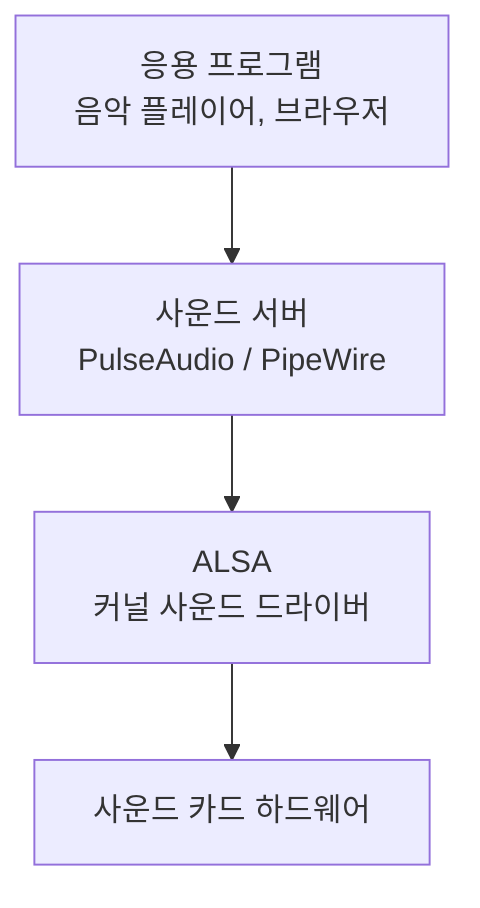
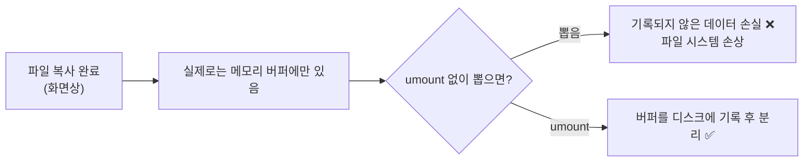

## 027. 사운드 및 기타 주변장치

### 1. 리눅스 사운드 시스템의 구조



| 계층 | 이름 | 역할 |
| --- | --- | --- |
| **커널 계층** | **ALSA** (Advanced Linux Sound Architecture) | **커널의 사운드 드라이버.** 하드웨어를 직접 제어 |
| **서버 계층** | **PulseAudio** | 여러 프로그램의 소리를 **믹싱**하고 장치 간 전환 |
| **서버 계층(신규)** | **PipeWire** | PulseAudio + JACK을 대체하는 최신 서버 (RHEL 9, Fedora 기본) |
| 구형 | **OSS** (Open Sound System) | ALSA 이전에 쓰이던 시스템 (현재는 거의 미사용) |

#### 왜 ALSA 위에 사운드 서버가 또 필요할까?


ALSA는 **하드웨어 하나에 프로그램 하나**만 접근할 수 있습니다.  
PulseAudio는 중간에서 **여러 소리를 섞어(믹싱)** 하나로 만들어 ALSA에 전달합니다.

또한 **앱별 볼륨 조절**, **재생 중 출력 장치 변경**(스피커 ↔ 헤드폰)도 사운드 서버가 담당합니다.

---

### 2. ALSA 관련 명령어

```bash
# 설치
$ sudo dnf install alsa-utils

# ────────── 사운드 카드 확인 ──────────
$ aplay -l                                  # 재생 장치 목록 ⭐
**** List of PLAYBACK Hardware Devices ****
card 0: PCH [HDA Intel PCH], device 0: ALC295 Analog [ALC295 Analog]
  Subdevices: 1/1
     │
     └── card 0, device 0 → hw:0,0

$ arecord -l                                # 녹음 장치 목록
$ cat /proc/asound/cards                    # 커널이 인식한 사운드 카드
$ lspci | grep -i audio                     # 하드웨어 확인
$ lsmod | grep snd                          # 사운드 모듈 확인

# ────────── 볼륨 조절 ──────────
$ alsamixer                                 # 텍스트 GUI 믹서 ⭐
  (↑↓ 볼륨, ←→ 채널 이동, M 음소거 토글, Esc 종료)

$ amixer                                    # 현재 설정 출력
$ amixer set Master 80%                     # 볼륨 설정
$ amixer set Master 5%+                     # 5% 증가
$ amixer set Master toggle                  # 음소거 토글
$ amixer set Master unmute

# ────────── 설정 저장·복원 ──────────
$ sudo alsactl store                        # 현재 설정 저장 ⭐
$ sudo alsactl restore                      # 저장된 설정 복원
# 저장 위치: /var/lib/alsa/asound.state

# ────────── 재생·녹음 테스트 ──────────
$ aplay test.wav                            # WAV 재생
$ aplay -D hw:0,0 test.wav                  # 장치 지정
$ speaker-test -c 2 -t wav                  # 스피커 테스트 ⭐
$ arecord -d 5 -f cd test.wav               # 5초 녹음
```

| 명령어 | 기능 |
| --- | --- |
| **`aplay -l`** | **재생 장치 목록** |
| `arecord -l` | 녹음 장치 목록 |
| **`alsamixer`** | **텍스트 기반 볼륨 조절 GUI** |
| **`amixer`** | 명령줄 볼륨 조절 (스크립트용) |
| **`alsactl store/restore`** | **설정 저장·복원** |
| `aplay` / `arecord` | 재생 / 녹음 |
| `speaker-test` | 스피커 테스트 |

> **`hw:0,0` 표기의 의미**  
> **`hw:카드번호,장치번호`** 입니다.  
> `aplay -l` 출력의 `card 0`, `device 0` 이 각각 대응됩니다.

---

### 3. PulseAudio 관련 명령어

```bash
# 상태 확인
$ pactl info
$ pulseaudio --check -v

# 출력 장치(싱크) 목록 ⭐
$ pactl list short sinks
0    alsa_output.pci-0000_00_1f.3.analog-stereo    module-alsa-card.c    s16le 2ch 48000Hz

# 입력 장치(소스) 목록
$ pactl list short sources

# 볼륨 조절
$ pactl set-sink-volume 0 80%
$ pactl set-sink-mute 0 toggle

# 기본 출력 장치 변경
$ pactl set-default-sink alsa_output.pci-0000_00_1f.3.analog-stereo

# 앱별 볼륨 조절 GUI
$ pavucontrol

# PulseAudio 재시작 (소리 문제 발생 시 첫 번째 조치) ⭐
$ pulseaudio -k && pulseaudio --start
$ systemctl --user restart pulseaudio
```

#### PipeWire (최신 배포판)

```bash
$ systemctl --user status pipewire
$ wpctl status                    # 장치 목록
$ wpctl set-volume @DEFAULT_SINK@ 80%
$ pactl info | grep "Server Name"
Server Name: PulseAudio (on PipeWire 0.3.47)     ← PipeWire가 PulseAudio 호환 제공
```

> **PipeWire는 PulseAudio 명령어와 호환**됩니다.  
> 기존 `pactl` 명령이 그대로 동작하므로 전환이 부드럽습니다.

---

### 4. 사운드 문제 해결

| 증상 | 확인 순서 |
| --- | --- |
| **소리가 전혀 안 남** | ① `alsamixer`로 음소거(MM) 확인 ② `aplay -l`로 장치 인식 ③ 드라이버 |
| **장치가 안 보임** | `lspci \| grep -i audio` → `lsmod \| grep snd` → 모듈 적재 |
| **특정 앱만 소리 없음** | `pavucontrol`의 재생 탭에서 앱별 볼륨 확인 |
| **출력이 잘못된 장치로** | `pactl set-default-sink` 로 변경 |
| **재부팅하면 볼륨 초기화** | **`alsactl store`** 로 설정 저장 |

```bash
# ① 음소거 확인 (가장 흔한 원인) ⭐
$ alsamixer
# MM 이라고 표시되면 음소거 → M 키로 해제하면 OO 로 바뀜

$ amixer get Master
Mono: Playback 65536 [100%] [on]
                              └── off 면 음소거

# ② 커널 로그에서 사운드 카드 인식 확인
$ dmesg | grep -i snd

# ③ 모듈 재적재
$ sudo modprobe -r snd_hda_intel
$ sudo modprobe snd_hda_intel
```

> **가장 흔한 원인은 음소거입니다.**  
> `alsamixer`에서 채널 아래에 **`MM`** 이 표시되면 음소거 상태이며,  
> **`M` 키를 눌러 `OO`** 로 바꾸면 해제됩니다.

---

### 5. USB 장치 관리

```bash
# USB 장치 목록
$ lsusb
Bus 001 Device 004: ID 0781:5567 SanDisk Corp. Cruzer Blade
    │       │          │    │
    │       │          │    └── Product ID
    │       │          └─────── Vendor ID
    │       └────────────────── 장치 번호
    └────────────────────────── 버스 번호

$ lsusb -t                        # 트리 (연결 구조)
$ lsusb -v -d 0781:5567           # 특정 장치 상세

# USB 저장장치 연결 시 흐름 확인 ⭐
$ dmesg -T | tail -10
[Sun Feb  1 06:25:11 2026] usb 1-1: new high-speed USB device number 4
[Sun Feb  1 06:25:11 2026] usb-storage 1-1:1.0: USB Mass Storage device detected
[Sun Feb  1 06:25:12 2026] sd 3:0:0:0: [sdb] 30310400 512-byte logical blocks
[Sun Feb  1 06:25:12 2026]  sdb: sdb1

# 마운트
$ lsblk -f
$ sudo mkdir -p /mnt/usb
$ sudo mount /dev/sdb1 /mnt/usb

# ❗안전하게 제거
$ sync                            # 버퍼 내용을 디스크에 기록 ⭐
$ sudo umount /mnt/usb
$ sudo udisksctl power-off -b /dev/sdb    # 전원 차단 (선택)
```

#### 왜 `sync`와 `umount`가 필요할까?



리눅스는 성능을 위해 **쓰기를 모아 두었다가 한꺼번에 처리(write-back 캐시)** 합니다.  
복사가 끝난 것처럼 보여도 **실제로는 아직 기록되지 않았을 수 있습니다.**

`umount`는 **남은 버퍼를 모두 기록한 뒤** 연결을 끊으므로 반드시 필요합니다.

#### USB 버전과 속도

| 규격 | 최대 속도 | 표시 색 |
| --- | --- | --- |
| USB 1.1 | 12 Mbps | — |
| **USB 2.0** | **480 Mbps** | 검정/흰색 |
| **USB 3.0 (3.2 Gen1)** | **5 Gbps** | **파랑** |
| USB 3.1 (3.2 Gen2) | 10 Gbps | 청록 |
| USB 3.2 Gen2x2 | 20 Gbps | 빨강 |
| USB4 | 40 Gbps | — |

- USB는 **최대 127개**의 장치를 연결할 수 있습니다.
- **핫 플러그(Hot Plug)** 와 **PnP**를 지원합니다.
- 장치에 **전원을 함께 공급**합니다.

---

### 6. 스캐너

```bash
# SANE (Scanner Access Now Easy) 설치
$ sudo dnf install sane-backends sane-frontends

# 스캐너 검색 ⭐
$ scanimage -L
device `hpaio:/usb/HP_ScanJet' is a Hewlett-Packard HP_ScanJet flatbed scanner

# 스캔 실행
$ scanimage --format=png > scan.png
$ scanimage --resolution 300 --format=tiff > scan.tiff
$ scanimage -d 'hpaio:/usb/HP_ScanJet' --format=png > scan.png

# GUI 도구
$ xsane
$ simple-scan
```

| 항목 | 설명 |
| --- | --- |
| **SANE** | 리눅스 표준 **스캐너 인터페이스** |
| **`scanimage`** | 명령줄 스캔 도구 |
| `xsane` | GUI 스캔 도구 |
| **해상도 단위** | **DPI** (클수록 선명, 파일 크기 증가) |

> **스캐너가 안 잡힐 때**  
> `lsusb`로 하드웨어 인식을 먼저 확인하고,  
> 사용자가 **`scanner` 그룹**에 속해 있는지 확인합니다.
> ```bash
> $ sudo usermod -aG scanner,lp $USER
> ```

---

### 7. 그 밖의 주변장치

#### 키보드

```bash
# 콘솔 키맵 확인·변경
$ localectl status
$ localectl list-keymaps | grep kr
$ sudo localectl set-keymap kr

# X 윈도 키보드 레이아웃
$ setxkbmap -query
$ setxkbmap kr

# 키 입력 테스트 (어떤 키코드가 들어오는지)
$ showkey            # 콘솔
$ xev                # X 윈도
```

#### 마우스

```bash
# 입력 장치 목록
$ cat /proc/bus/input/devices | grep -A5 -i mouse
$ xinput list                          # X 윈도

# 마우스 설정 변경
$ xinput set-prop <id> "libinput Natural Scrolling Enabled" 1
$ xinput set-prop <id> "libinput Accel Speed" 0.5
```

#### 시리얼 포트

```bash
# 시리얼 장치 (네트워크 장비 콘솔 접속에 사용)
$ ls -l /dev/ttyS*      # 내장 시리얼 포트
$ ls -l /dev/ttyUSB*    # USB-시리얼 변환기 ⭐

# 통신 프로그램
$ sudo dnf install minicom
$ sudo minicom -D /dev/ttyUSB0 -b 9600
$ screen /dev/ttyUSB0 9600

# 포트 설정 확인
$ stty -F /dev/ttyUSB0 -a
```

> **실무 활용** : 스위치·라우터 등 네트워크 장비의 **콘솔 포트에 접속**할 때 사용합니다.  
> 사용자가 **`dialout` 그룹**에 속해야 권한 오류 없이 접근할 수 있습니다.
> ```bash
> $ sudo usermod -aG dialout $USER
> ```

#### 블루투스

```bash
$ sudo systemctl enable --now bluetooth
$ bluetoothctl
[bluetooth]# power on
[bluetooth]# scan on
[bluetooth]# pair AA:BB:CC:DD:EE:FF
[bluetooth]# trust AA:BB:CC:DD:EE:FF
[bluetooth]# connect AA:BB:CC:DD:EE:FF
[bluetooth]# quit

$ hciconfig                # 블루투스 어댑터 상태
```

---

### 8. 전원 관리

```bash
# 전원 상태 확인 (노트북)
$ upower -i /org/freedesktop/UPower/devices/battery_BAT0
$ cat /sys/class/power_supply/BAT0/capacity
$ acpi -b

# CPU 주파수 관리
$ cpupower frequency-info
$ sudo cpupower frequency-set -g performance     # 성능 우선
$ sudo cpupower frequency-set -g powersave       # 절전 우선

# 튜닝 프로파일 (RHEL 계열) ⭐
$ tuned-adm list
$ tuned-adm active
Current active profile: virtual-guest
$ sudo tuned-adm profile throughput-performance   # 서버 성능 최적화
```

| tuned 프로파일 | 용도 |
| --- | --- |
| `balanced` | 균형 (기본) |
| **`throughput-performance`** | **서버 처리량 최대화** |
| `latency-performance` | 응답 지연 최소화 |
| `powersave` | 절전 |
| `virtual-guest` | 가상 머신 게스트 |
| `virtual-host` | 가상화 호스트 |

> **서버에서는 `throughput-performance`** 를 적용하는 것이 일반적입니다.  
> CPU 절전 기능을 끄고 성능을 최대로 유지합니다.

---

### 9. 장치 권한과 그룹

주변장치를 사용하려면 **해당 그룹에 속해야** 합니다.

| 그룹 | 접근 가능한 장치 |
| --- | --- |
| **`disk`** | 디스크 장치 |
| **`lp`** | 프린터 |
| **`audio`** | 사운드 장치 |
| **`video`** | 비디오·웹캠 |
| **`dialout`** | **시리얼 포트** |
| **`scanner`** | 스캐너 |
| `cdrom` | 광학 드라이브 |
| `input` | 입력 장치 |

```bash
# 현재 소속 그룹 확인
$ groups
masterway wheel audio video

# 그룹 추가 (❗-aG 사용)
$ sudo usermod -aG audio,video,dialout masterway

# 적용하려면 재로그인 필요
$ newgrp audio        # 또는 즉시 적용
```

> **"장치는 인식되는데 권한 오류가 난다"** 는 상황의 대부분은 **그룹 문제**입니다.  
> `ls -l /dev/장치` 로 그룹을 확인하고 사용자를 그 그룹에 추가하면 해결됩니다.

---

### 시험 포인트 정리

| 항목 | 핵심 |
| --- | --- |
| **ALSA** | **커널 사운드 드라이버** (현재 표준) |
| **OSS** | ALSA 이전의 구형 사운드 시스템 |
| **PulseAudio** | 사운드 **서버** — 믹싱, 앱별 볼륨 |
| **PipeWire** | PulseAudio를 대체하는 최신 서버 |
| 재생 장치 목록 | **`aplay -l`** |
| 볼륨 조절 GUI | **`alsamixer`** |
| 볼륨 조절 CLI | **`amixer`** |
| 사운드 설정 저장 | **`alsactl store`** |
| PulseAudio 제어 | **`pactl`** |
| 소리 안 날 때 1순위 | **`alsamixer`에서 음소거(MM) 확인** |
| USB 장치 목록 | **`lsusb`** |
| USB 최대 연결 수 | **127개** |
| USB 2.0 / 3.0 속도 | **480Mbps / 5Gbps** |
| USB 제거 전 | **`sync` + `umount`** |
| 스캐너 인터페이스 | **SANE** |
| 스캐너 검색 | **`scanimage -L`** |
| 시리얼 장치 | **`/dev/ttyS*`, `/dev/ttyUSB*`** |
| 시리얼 통신 | **`minicom`** |
| 시리얼 접근 그룹 | **`dialout`** |
| 사운드 접근 그룹 | **`audio`** |
| 프린터 접근 그룹 | **`lp`** |
| 성능 프로파일 | **`tuned-adm`** |

---

### 한 줄 정리

리눅스 사운드는 **ALSA(커널 드라이버) 위에 PulseAudio/PipeWire(믹싱 서버)** 가 얹힌 구조이며,  
소리가 안 나면 **`alsamixer`에서 음소거(MM)부터 확인**하고 설정은 **`alsactl store`** 로 저장하며,  
USB는 **제거 전 반드시 `umount`**, 주변장치 권한 문제는 **`audio`·`lp`·`dialout`·`scanner` 그룹 소속**을 확인합니다.
