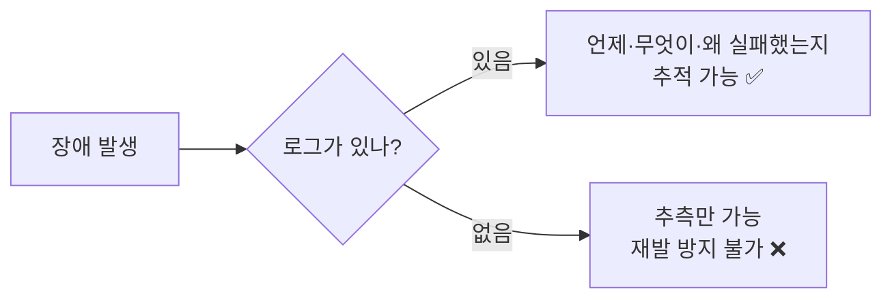
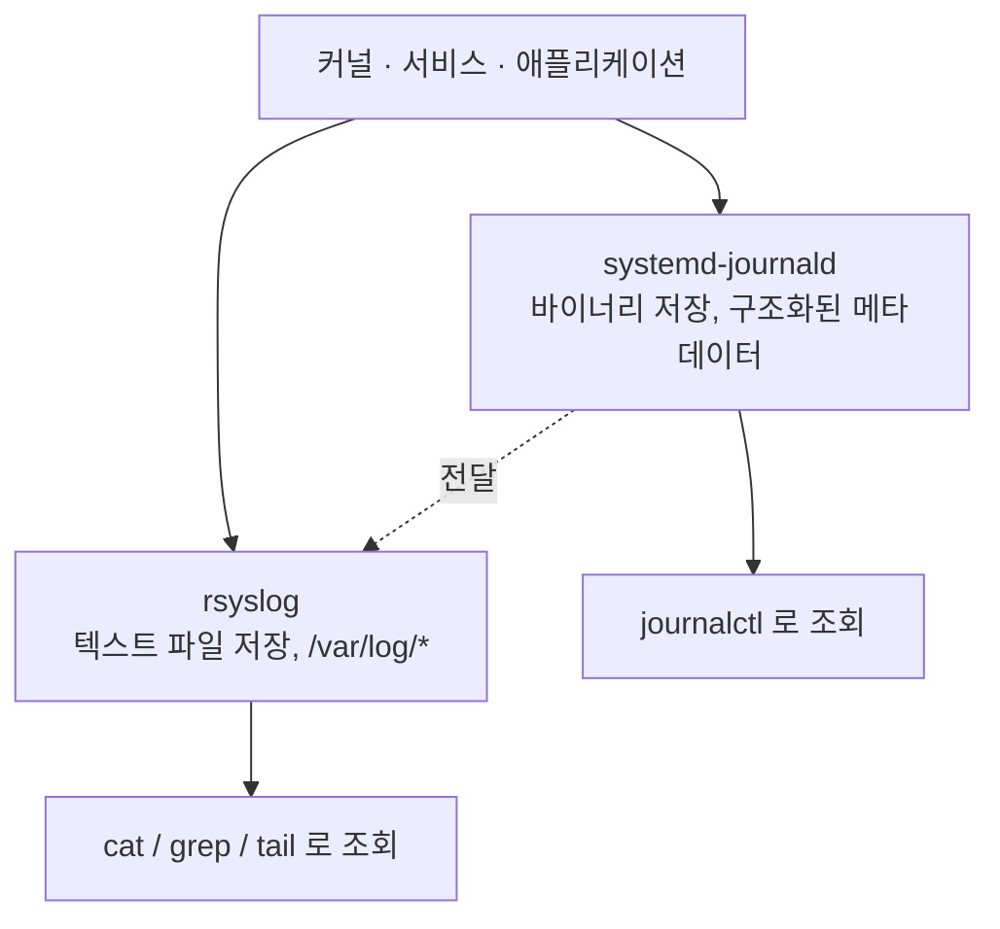
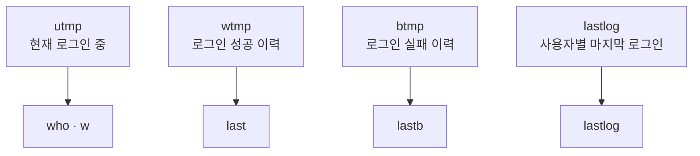
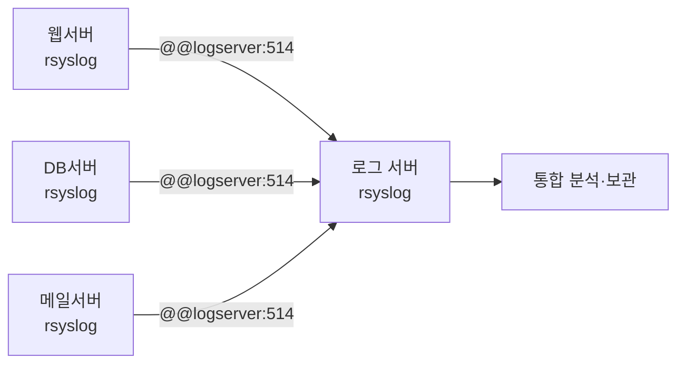
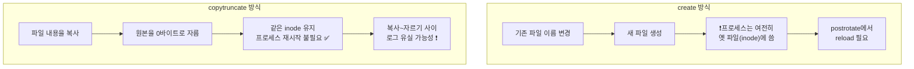

## 028. 시스템 분석과 로그 관리

### 1. 로그가 중요한 이유

서버에 문제가 생겼을 때 **유일하게 남아 있는 단서**가 로그입니다.



로그는 **장애 분석**뿐 아니라 **보안 사고 조사(포렌식)**, **감사(Audit)**, **성능 분석**의 근거가 됩니다.

---

### 2. 리눅스 로그 시스템의 두 축

현대 리눅스에는 **두 개의 로그 시스템이 함께 동작**합니다.



| 시스템 | 저장 형식 | 조회 방법 | 특징 |
| --- | --- | --- | --- |
| **`systemd-journald`** | **바이너리** | **`journalctl`** | 구조화된 필드, 빠른 필터링, 기본 휘발성 |
| **`rsyslog`** | **텍스트** | `cat`, `grep`, `tail` | 전통적, 원격 전송 용이, 영구 보존 |

> **왜 둘 다 쓸까?**  
> journald는 **메타데이터(유닛명·PID·우선순위)** 를 구조적으로 담아 필터링이 강력하지만,  
> 바이너리라 **grep이나 외부 도구로 다루기 불편**합니다.  
> 그래서 journald가 받은 로그를 **rsyslog에 넘겨 텍스트 파일로도 남깁니다.**

---

### 3. 주요 로그 파일 (시험 필수 암기)

```bash
$ ls -l /var/log/
```

| 파일 | 내용 | 배포판 |
| --- | --- | --- |
| **`/var/log/messages`** | **시스템 전반의 일반 메시지** | RHEL 계열 |
| **`/var/log/syslog`** | 위와 동일 | Debian 계열 |
| **`/var/log/secure`** | **인증·보안 관련 (로그인, sudo, SSH)** ⭐ | RHEL 계열 |
| **`/var/log/auth.log`** | 위와 동일 | Debian 계열 |
| **`/var/log/boot.log`** | 부팅 과정 메시지 |  |
| **`/var/log/dmesg`** | **커널 링 버퍼** (하드웨어 인식) |  |
| **`/var/log/cron`** | **cron 작업 실행 기록** |  |
| **`/var/log/maillog`** | 메일 서버 로그 | RHEL |
| **`/var/log/wtmp`** | **로그인 성공 기록** (바이너리) → **`last`** ⭐ |  |
| **`/var/log/btmp`** | **로그인 실패 기록** (바이너리) → **`lastb`** ⭐ |  |
| **`/var/log/lastlog`** | **사용자별 마지막 로그인** (바이너리) → **`lastlog`** |  |
| `/var/run/utmp` | **현재 로그인 중인 사용자** → **`who`, `w`** |  |
| `/var/log/httpd/` | Apache 로그 (`access_log`, `error_log`) |  |
| `/var/log/audit/audit.log` | SELinux·감사 로그 |  |

#### 바이너리 로그 4종 (매우 자주 출제)



```bash
# 현재 접속자
$ who
masterway pts/0   2026-02-02 06:00 (192.168.0.100)
$ w
 06:00:15 up 5 days,  load average: 0.15, 0.10, 0.05
USER     TTY      FROM             LOGIN@   IDLE   WHAT
masterway pts/0   192.168.0.100    06:00    0.00s  w

# 로그인 성공 이력
$ last | head -5
masterway pts/0  192.168.0.100  Mon Feb  2 06:00   still logged in
reboot    system boot 4.18.0-513  Sun Feb  1 09:00

$ last -n 10                  # 최근 10건
$ last masterway              # 특정 사용자
$ last reboot                 # 재부팅 이력 ⭐

# ⭐ 로그인 실패 이력 (보안 점검 필수)
$ sudo lastb | head -10
root     ssh:notty  203.0.113.55  Mon Feb  2 05:12 - 05:12  (00:00)
admin    ssh:notty  203.0.113.55  Mon Feb  2 05:12 - 05:12  (00:00)
test     ssh:notty  203.0.113.55  Mon Feb  2 05:12 - 05:12  (00:00)
                    └── 같은 IP에서 여러 계정 시도 = 무차별 대입 공격 ❗

# 사용자별 마지막 로그인
$ lastlog
$ lastlog -u masterway
$ lastlog -b 30               # 30일 이상 로그인 안 한 계정 (휴면 계정 점검) ⭐
```

> **보안 점검 실무**  
> **`lastb`** 로 로그인 실패가 비정상적으로 많은지 확인하면  
> **무차별 대입(Brute Force) 공격**을 조기에 발견할 수 있습니다.
>
> ```bash
> # 공격 IP 집계
> $ sudo lastb | awk '{print $3}' | sort | uniq -c | sort -rn | head
>     4521 203.0.113.55
>      892 198.51.100.22
> ```

---

### 4. `rsyslog` 설정

#### 설정 파일 구조

```bash
$ sudo vi /etc/rsyslog.conf
```

```
#  Facility.Priority          Action
   authpriv.*                 /var/log/secure
   *.info;mail.none;authpriv.none;cron.none    /var/log/messages
   cron.*                     /var/log/cron
   *.emerg                    :omusrmsg:*
   mail.*                     -/var/log/maillog
   local7.*                   /var/log/boot.log
```

**형식** : `Facility(시설).Priority(우선순위)    Action(동작)`

#### Facility — 로그를 발생시킨 주체

| Facility | 의미 |
| --- | --- |
| **`auth` / `authpriv`** | **인증 관련** (로그인, sudo) |
| **`cron`** | cron 작업 |
| **`daemon`** | 시스템 데몬 |
| **`kern`** | **커널** |
| **`mail`** | 메일 시스템 |
| `lpr` | 프린터 |
| `news`, `uucp` | 뉴스, UUCP |
| `syslog` | syslog 자체 |
| `user` | 사용자 프로세스 |
| **`local0` ~ `local7`** | **사용자 정의** (애플리케이션이 자유롭게 사용) |
| **`*`** | **전체** |

#### Priority — 심각도 (숫자가 작을수록 심각)

| 번호 | Priority | 의미 |
| --- | --- | --- |
| **0** | **`emerg`** (panic) | **시스템 사용 불가** |
| **1** | **`alert`** | 즉시 조치 필요 |
| **2** | **`crit`** | 치명적 상황 |
| **3** | **`err`** (error) | **오류** |
| **4** | **`warning`** (warn) | 경고 |
| **5** | **`notice`** | 정상이지만 주목할 만함 |
| **6** | **`info`** | 정보성 메시지 |
| **7** | **`debug`** | 디버깅용 (가장 상세) |
| — | `none` | **해당 facility 제외** |

> **암기법** : **emerg → alert → crit → err → warning → notice → info → debug**  
> **"이(e) 알(a) 크(c) 에(e) 워(w) 노(n) 인(i) 디(d)"** 순으로 심각도가 낮아집니다.

#### 중요한 규칙 — 지정한 우선순위 **이상**이 기록됩니다

```
cron.info     →  info, notice, warning, err, crit, alert, emerg 를 모두 기록
                 (info보다 심각한 것들 전부)
cron.=info    →  info 만 정확히 기록  (= 사용)
cron.!info    →  info 를 제외
```

#### Action — 어디에 기록할지

| Action | 의미 |
| --- | --- |
| `/var/log/messages` | 파일에 기록 |
| **`-/var/log/maillog`** | 파일에 기록하되 **버퍼 사용** (성능↑, 정전 시 손실 가능) |
| `@192.168.0.50` | **UDP로 원격 전송** |
| **`@@192.168.0.50:514`** | **TCP로 원격 전송** (더 안전) |
| `:omusrmsg:*` | 모든 로그인 사용자에게 메시지 |
| `*` | 모든 터미널 |

```bash
# 설정 변경 후 재시작
$ sudo systemctl restart rsyslog

# 설정 문법 검사
$ sudo rsyslogd -N1
```

#### 중앙 로그 서버 구성 (실무·시험)



```bash
# ────────── 로그 서버 측 (수신) ──────────
$ sudo vi /etc/rsyslog.conf
# TCP 수신 활성화
module(load="imtcp")
input(type="imtcp" port="514")

$ sudo firewall-cmd --add-port=514/tcp --permanent && sudo firewall-cmd --reload
$ sudo systemctl restart rsyslog

# ────────── 클라이언트 측 (전송) ──────────
$ sudo vi /etc/rsyslog.conf
*.* @@192.168.0.50:514           # TCP 전송
# *.* @192.168.0.50:514          # UDP 전송

$ sudo systemctl restart rsyslog
```

> **왜 중앙 로그 서버가 필요할까?**  
> 서버가 해킹당하면 공격자가 **가장 먼저 로그를 지웁니다.**  
> 로그를 **다른 서버로 실시간 전송**해 두면, 침해당한 서버의 로그가 지워져도 **증거가 남습니다.**  
> 또한 수십 대의 서버 로그를 **한곳에서 검색**할 수 있어 분석이 훨씬 효율적입니다.

#### 직접 로그 남기기 — `logger`

```bash
$ logger "테스트 메시지"
$ logger -p local0.info "애플리케이션 시작"
$ logger -t myapp -p user.err "처리 실패"

$ sudo tail -2 /var/log/messages
Feb  2 06:00:15 server01 masterway[12345]: 테스트 메시지
Feb  2 06:00:20 server01 myapp[12346]: 처리 실패
```

> **스크립트에서 유용합니다.** 백업 스크립트의 성공·실패를 `logger`로 남기면  
> 시스템 로그에 함께 기록되어 통합 관리가 가능합니다.

---

### 5. `journalctl` — systemd 저널

```bash
# 전체 로그 (최신이 아래, less로 열림)
$ journalctl

# ────────── 시간 필터 ──────────
$ journalctl -b                          # 이번 부팅 ⭐
$ journalctl -b -1                       # 직전 부팅
$ journalctl --list-boots                # 부팅 목록
$ journalctl --since "2026-02-01"
$ journalctl --since "1 hour ago"        # ⭐
$ journalctl --since today
$ journalctl --since "09:00" --until "10:00"

# ────────── 대상 필터 ──────────
$ journalctl -u sshd                     # 특정 서비스 ⭐
$ journalctl -u sshd -u httpd            # 여러 서비스
$ journalctl _PID=1234                   # 특정 PID
$ journalctl _UID=1000                   # 특정 사용자
$ journalctl /usr/sbin/sshd              # 특정 실행 파일
$ journalctl -k                          # 커널 메시지만 (= dmesg) ⭐

# ────────── 우선순위 필터 ──────────
$ journalctl -p err                      # err 이상만 ⭐
$ journalctl -p 0..3                     # emerg~err
$ journalctl -p warning -b               # 이번 부팅의 경고 이상

# ────────── 출력 형식 ──────────
$ journalctl -f                          # 실시간 추적 (tail -f) ⭐
$ journalctl -n 50                       # 최근 50줄
$ journalctl -r                          # 역순 (최신이 위)
$ journalctl -o short-precise            # 밀리초까지
$ journalctl -o json-pretty              # JSON (파싱용)
$ journalctl -x                          # 설명 추가
$ journalctl --no-pager                  # less 없이 출력

# ────────── 자주 쓰는 조합 ──────────
$ journalctl -xeu httpd                  # httpd 로그를 설명과 함께 마지막부터 ⭐
$ journalctl -u httpd --since "10 min ago" -f
$ journalctl -p err -b --no-pager | head -20
```

#### 저널 저장 방식 — 휘발성 vs 영구

**기본적으로 journald는 재부팅하면 로그가 사라집니다.**

```bash
# 현재 저장 위치 확인
$ ls /var/log/journal 2>/dev/null || echo "휘발성 (메모리 저장)"

# 영구 저장으로 변경 ⭐
$ sudo mkdir -p /var/log/journal
$ sudo systemd-tmpfiles --create --prefix /var/log/journal
$ sudo systemctl restart systemd-journald

# 또는 설정 파일에서
$ sudo vi /etc/systemd/journald.conf
[Journal]
Storage=persistent          # volatile(메모리) / persistent(디스크) / auto
SystemMaxUse=1G             # 최대 사용 용량
MaxRetentionSec=1month      # 보관 기간
```

```bash
# 저널 용량 확인·정리
$ journalctl --disk-usage
Archived and active journals take up 512.0M in the file system.

$ sudo journalctl --vacuum-size=500M     # 500MB만 남기고 삭제
$ sudo journalctl --vacuum-time=30d      # 30일치만 보관
$ sudo journalctl --verify               # 무결성 검증
```

> **시험 포인트** : journald는 기본이 **휘발성(`volatile`)** 이며,  
> **`/var/log/journal` 디렉터리를 만들어야 영구 저장**됩니다.

---

### 6. 로그 로테이션 — `logrotate`

로그를 방치하면 **디스크를 가득 채워 서비스가 멈춥니다.**


```bash
# 주 설정 파일
$ cat /etc/logrotate.conf
weekly                    # 주 단위 로테이션
rotate 4                  # 4개 보관 (4주치)
create                    # 로테이션 후 새 파일 생성
dateext                   # 파일명에 날짜 추가
compress                  # 압축
include /etc/logrotate.d  # 개별 설정 디렉터리

# 개별 서비스 설정
$ ls /etc/logrotate.d/
httpd  chrony  syslog  sssd
```

#### 설정 예시

```bash
$ sudo vi /etc/logrotate.d/myapp
```

```
/var/log/myapp/*.log {
    daily                    # 매일 로테이션
    rotate 30                # 30개(30일치) 보관
    compress                 # gzip 압축
    delaycompress            # 한 주기 뒤에 압축 (직전 파일은 그대로)
    missingok                # 파일 없어도 오류 안 냄
    notifempty               # 비어 있으면 로테이션 안 함
    create 0640 root adm     # 새 파일 권한·소유자
    dateext                  # 파일명에 날짜
    sharedscripts
    postrotate
        /bin/systemctl reload myapp > /dev/null 2>&1 || true
    endscript
}
```

| 지시어 | 의미 |
| --- | --- |
| **`daily` / `weekly` / `monthly`** | 로테이션 주기 |
| **`rotate N`** | **N개 보관 후 삭제** |
| **`size 100M`** | 크기 기준 로테이션 |
| **`compress`** | gzip 압축 |
| `delaycompress` | 한 주기 늦게 압축 |
| **`create 권한 소유자 그룹`** | 새 로그 파일 생성 |
| **`copytruncate`** | **복사 후 원본을 0으로 비움** |
| `missingok` | 파일이 없어도 무시 |
| `notifempty` | 비어 있으면 건너뜀 |
| `postrotate` ~ `endscript` | 로테이션 후 실행할 명령 |

#### `create` 와 `copytruncate` 의 차이 (중요)



- **`create`** : 프로세스가 로그 파일을 다시 열어야 하므로 **`postrotate`에서 reload** 가 필요합니다.
- **`copytruncate`** : reload가 불가능한 프로그램에 사용하지만, **극히 짧은 순간 로그가 유실**될 수 있습니다.

```bash
# 수동 실행·테스트
$ sudo logrotate -d /etc/logrotate.d/myapp     # -d: 테스트만 (dry-run) ⭐
$ sudo logrotate -f /etc/logrotate.d/myapp     # -f: 강제 실행
$ sudo logrotate -v /etc/logrotate.conf        # 상세 출력

# 마지막 실행 기록
$ cat /var/lib/logrotate/logrotate.status
```

---

### 7. 로그 분석 실무 기법

```bash
# ────────── 기본 검색 ──────────
$ sudo grep -i error /var/log/messages | tail -20
$ sudo grep -c "Failed password" /var/log/secure       # 개수만
$ sudo tail -f /var/log/messages                        # 실시간 ⭐

# ────────── SSH 공격 분석 ⭐ ──────────
# 실패한 로그인 시도 IP 집계
$ sudo grep "Failed password" /var/log/secure | \
    awk '{print $(NF-3)}' | sort | uniq -c | sort -rn | head
   4521 203.0.113.55
    892 198.51.100.22

# 시도된 계정 집계
$ sudo grep "Failed password" /var/log/secure | \
    awk '{print $9}' | sort | uniq -c | sort -rn | head
   3200 root
    450 admin
    320 test

# 성공한 로그인
$ sudo grep "Accepted password" /var/log/secure | tail -10

# ────────── sudo 사용 감사 ──────────
$ sudo grep sudo /var/log/secure | grep COMMAND | tail -10

# ────────── 시간대별 집계 ──────────
$ sudo awk '{print $1, $2, $3}' /var/log/messages | \
    cut -d: -f1 | sort | uniq -c
```

#### 웹 서버 로그 분석 예시

```bash
# 접속 상위 IP
$ sudo awk '{print $1}' /var/log/httpd/access_log | sort | uniq -c | sort -rn | head

# 404 에러가 난 경로
$ sudo awk '$9 == 404 {print $7}' /var/log/httpd/access_log | sort | uniq -c | sort -rn | head

# 시간대별 요청 수
$ sudo awk -F'[:[]' '{print $2":"$3}' /var/log/httpd/access_log | sort | uniq -c
```

---

### 8. 로그 보안

로그는 **침해 사고의 증거**이므로 보호해야 합니다.

```bash
# ① 권한 확인 — 일반 사용자가 읽을 수 없어야 함
$ ls -l /var/log/secure
-rw-------. 1 root root 24680 Feb  2 06:00 /var/log/secure

# ② 변경 불가 속성 (append only) ⭐
$ sudo chattr +a /var/log/audit/audit.log
$ lsattr /var/log/audit/audit.log
-----a---------- /var/log/audit/audit.log
# 이제 추가만 가능하고 기존 내용 수정·삭제 불가 (root도)

# ③ 원격 로그 서버로 실시간 전송 (가장 확실)
*.* @@logserver.example.com:514
```

> **공격자가 가장 먼저 하는 일이 로그 삭제**입니다.  
> `chattr +a` 로 **추가만 가능하게** 만들거나,  
> **원격 서버로 전송**해 두면 로컬 로그가 지워져도 증거가 남습니다.

---

### 시험 포인트 정리

| 항목 | 핵심 |
| --- | --- |
| RHEL 일반 로그 | **`/var/log/messages`** |
| Debian 일반 로그 | `/var/log/syslog` |
| **인증·보안 로그** | **`/var/log/secure`** (RHEL) / `auth.log` (Debian) |
| **`wtmp`** | **로그인 성공** → **`last`** |
| **`btmp`** | **로그인 실패** → **`lastb`** ⭐ |
| **`utmp`** | **현재 접속자** → **`who`, `w`** |
| **`lastlog`** | 사용자별 **마지막 로그인** |
| rsyslog 설정 파일 | **`/etc/rsyslog.conf`** |
| rsyslog 형식 | **`Facility.Priority   Action`** |
| Priority 순서 | **emerg(0) → alert → crit → err → warning → notice → info → debug(7)** |
| **`.info`** 의 의미 | **info 이상 전부** 기록 |
| `.=info` | info **만** |
| `.none` | 해당 facility **제외** |
| 원격 전송 | **`@`=UDP, `@@`=TCP** |
| 수동 로그 기록 | **`logger`** |
| systemd 로그 조회 | **`journalctl`** |
| 이번 부팅 로그 | **`journalctl -b`** |
| 서비스별 로그 | **`journalctl -u 서비스`** |
| 실시간 추적 | **`journalctl -f`** |
| 커널 로그 | **`journalctl -k`** |
| journald 영구 저장 | **`/var/log/journal` 생성** 또는 `Storage=persistent` |
| 로그 로테이션 | **`logrotate`** (`/etc/logrotate.conf`) |
| 로테이션 테스트 | **`logrotate -d`** |
| `rotate N` | **N개 보관** |
| `copytruncate` | 원본을 **0으로 잘라** 재시작 불필요 |
| 로그 변조 방지 | **`chattr +a`** |

---

### 한 줄 정리

로그는 **journald(바이너리·`journalctl`)와 rsyslog(텍스트·`/var/log/*`)** 두 축으로 관리되며,  
**`secure`(인증)·`wtmp`(성공)·`btmp`(실패)** 가 보안 점검의 핵심이고,  
rsyslog는 **`Facility.Priority` 형식**으로 **지정 우선순위 이상**을 기록하며,  
디스크 폭주는 **`logrotate`**, 로그 변조는 **`chattr +a`와 원격 전송**으로 방지합니다.
