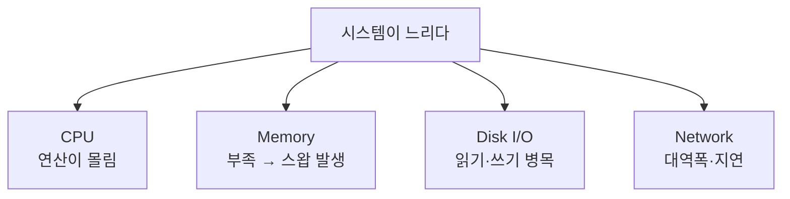
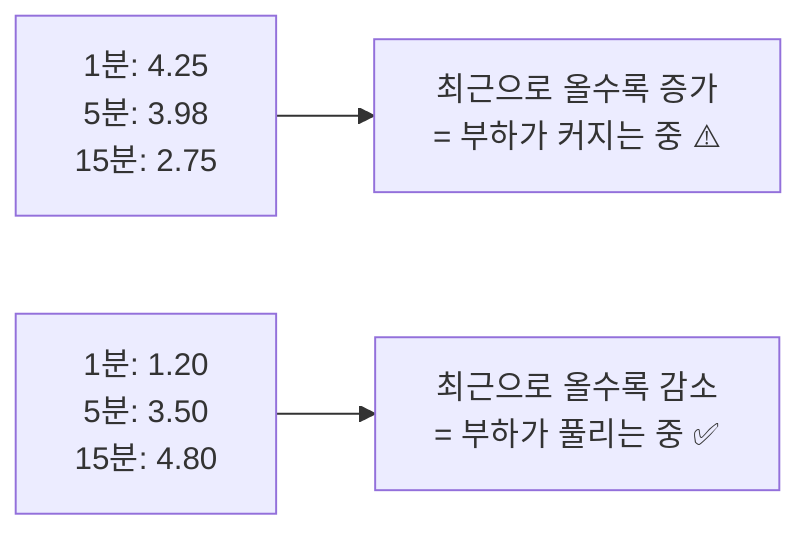
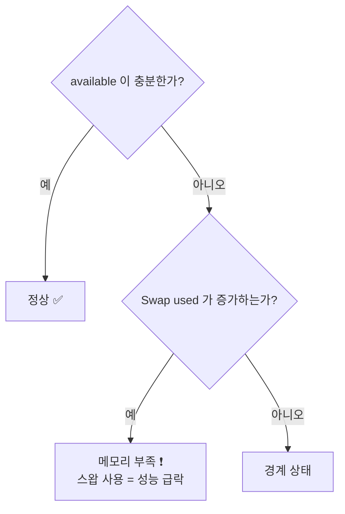
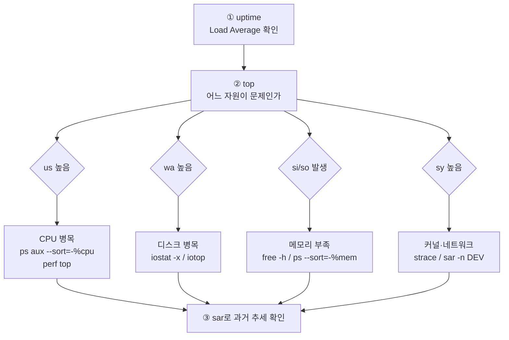

## 029. 시스템 모니터링과 성능 분석

### 1. 성능 분석의 4대 자원

서버가 느릴 때 원인은 **반드시 이 넷 중 하나**입니다.



**분석 순서** : `uptime`/`top` 으로 큰 그림을 본 뒤 → 의심되는 자원을 전용 도구로 깊게 파고듭니다.

---

### 2. 첫 진단 — `uptime`과 Load Average

```bash
$ uptime
 06:50:15 up 5 days,  2:14,  2 users,  load average: 4.25, 3.98, 2.75
                                                      1분   5분   15분
```

#### Load Average를 읽는 법

**실행 중이거나 실행을 기다리는 프로세스의 평균 개수**입니다.

```bash
$ nproc
4              ← CPU 코어 4개
```

| Load Average | 4코어에서의 해석 |
| --- | --- |
| 1.0 | 코어 1개 분량 → **여유** |
| **4.0** | **코어 수와 동일 → 100% 포화** |
| 8.0 | 코어 수의 2배 → **대기 발생, 과부하** |



> **핵심** : Load Average는 **반드시 CPU 코어 수와 비교**해야 합니다.  
> 그리고 **1분·5분·15분 값의 추세**를 보면 상황이 나빠지는 중인지 좋아지는 중인지 알 수 있습니다.

> **리눅스의 Load Average는 특별합니다.**  
> 다른 UNIX는 **CPU 대기만** 세지만, **리눅스는 `D` 상태(디스크 I/O 대기) 프로세스도 포함**합니다.  
> 그래서 **CPU는 한가한데 Load Average가 높다면 디스크 I/O 병목**입니다.

---

### 3. `top` — 종합 실시간 모니터링

```bash
$ top
top - 06:50:15 up 5 days,  2:14,  2 users,  load average: 4.25, 3.98, 2.75
Tasks: 215 total,   3 running, 212 sleeping,   0 stopped,   1 zombie
%Cpu(s): 25.3 us, 10.2 sy,  0.0 ni, 34.1 id, 30.2 wa,  0.0 hi,  0.2 si,  0.0 st
MiB Mem :  15884.5 total,   1234.2 free,  11245.1 used,   3405.2 buff/cache
MiB Swap:   2048.0 total,    512.0 free,   1536.0 used.   3210.5 avail Mem

  PID USER      PR  NI    VIRT    RES    SHR S  %CPU  %MEM     TIME+ COMMAND
 1234 mysql     20   0 8388608 6291456   8192 S  85.3  38.6 120:15.32 mysqld
 5678 apache    20   0  512000  98304   4096 R  25.1   0.6   5:23.11 httpd
```

#### CPU 라인 읽기 (매우 중요)

| 지표 | 의미 | 높을 때의 원인 |
| --- | --- | --- |
| **`us`** (user) | 사용자 프로세스 | **애플리케이션 연산 과다** |
| **`sy`** (system) | 커널 | 시스템 호출·인터럽트 과다 |
| `ni` (nice) | 우선순위 조정된 프로세스 | |
| **`id`** (idle) | **유휴** | 클수록 여유 |
| **`wa`** (iowait) | **I/O 대기** ⭐ | **디스크 병목** |
| `hi` / `si` | 하드/소프트 인터럽트 | 네트워크 트래픽 과다 |
| `st` (steal) | 가상화에서 뺏긴 시간 | **호스트가 과부하** |

> 위 예시에서 **`wa`가 30.2%** 입니다.  
> CPU는 34% 놀고 있는데 **디스크를 기다리느라 30%를 낭비**하고 있으므로,  
> **디스크 I/O가 병목**임을 알 수 있습니다.

#### 메모리 라인 읽기

```
MiB Mem :  15884.5 total,   1234.2 free,  11245.1 used,   3405.2 buff/cache
                                                          └── 캐시 (필요하면 회수 가능)
                            └── 완전히 빈 메모리 (적어도 정상)
```

> **`free`가 적다고 걱정할 필요 없습니다.**  
> 리눅스는 **남는 메모리를 전부 디스크 캐시로 활용**합니다.  
> 실제로 봐야 할 것은 **`avail Mem`(available)** 입니다.

#### top 실행 중 단축키

| 키 | 기능 |
| --- | --- |
| **`P`** | **CPU 사용률순 정렬** |
| **`M`** | **메모리 사용률순 정렬** |
| `T` | 실행 시간순 |
| `N` | PID순 |
| **`1`** | **CPU 코어별로 표시** ⭐ |
| **`k`** | 프로세스 종료 |
| **`r`** | 우선순위 변경 |
| `u` | 특정 사용자만 |
| `c` | 전체 명령줄 표시 |
| `H` | 스레드 단위 표시 |
| `f` | 표시할 열 선택 |
| `W` | 현재 설정 저장 |
| **`q`** | 종료 |

```bash
$ top -d 2               # 2초마다 갱신
$ top -u mysql           # 특정 사용자
$ top -p 1234,5678       # 특정 PID
$ top -b -n 1 > top.txt  # 배치 모드 (스크립트·기록용) ⭐
$ htop                   # 더 보기 좋은 대체 도구
```

---

### 4. 메모리 분석

```bash
$ free -h
              total   used   free  shared  buff/cache  available
Mem:           15Gi   11Gi  1.2Gi   128Mi       3.3Gi       3.1Gi
Swap:         2.0Gi  1.5Gi  512Mi

$ free -h -s 2          # 2초마다 반복
$ free -m               # MB 단위
```

| 항목 | 의미 |
| --- | --- |
| **`used`** | 실제 사용 중 |
| **`free`** | 완전히 비어 있음 |
| **`buff/cache`** | **디스크 캐시** (필요 시 즉시 회수 가능) |
| **`available`** | **실제로 쓸 수 있는 메모리** ⭐ |

#### 메모리 부족 판단 기준



```bash
# 스왑을 실제로 쓰고 있는지 (중요) ⭐
$ vmstat 1 5
procs -----------memory---------- ---swap-- -----io---- --system-- ------cpu-----
 r  b   swpd   free   buff  cache   si   so    bi    bo   in   cs us sy id wa st
 3  2 1572864 126464  8192 3407872  120  340  2048  1024 1520 3200 25 10 35 30  0
                                     │    │
                                     │    └── so: 스왑 아웃 (메모리→디스크) ❗
                                     └────── si: 스왑 인 (디스크→메모리) ❗
```

> **`si`와 `so`가 계속 0이 아니면 메모리가 부족한 것**입니다.  
> `Swap used`가 있어도 **`si`/`so`가 0이면** 과거에 한 번 스왑했다가 그대로 남아 있는 것뿐이라 문제없습니다.  
> **지금 활발히 스와핑 중인지**가 판단 기준입니다.

```bash
# 메모리 많이 쓰는 프로세스
$ ps aux --sort=-%mem | head -6

# 프로세스별 상세 메모리
$ pmap -x 1234 | tail -3

# 캐시 비우기 (테스트용, 운영에서는 불필요)
$ sync && echo 3 | sudo tee /proc/sys/vm/drop_caches
```

---

### 5. 디스크 I/O 분석

```bash
$ sudo dnf install sysstat        # iostat, sar 포함

$ iostat -x 1 3
Device   r/s    w/s   rkB/s   wkB/s  r_await  w_await  aqu-sz  %util
sda     45.0  120.0  1800.0  4800.0    12.50    45.30    8.20   98.5
                                          │        │        │      │
                                          │        │        │      └── 100%에 가까움 = 포화 ❗
                                          │        │        └── 대기 큐 길이
                                          │        └── 쓰기 평균 대기(ms) — 높으면 병목
                                          └── 읽기 평균 대기(ms)
```

| 지표 | 정상 기준 | 의미 |
| --- | --- | --- |
| **`%util`** | **80% 미만** | 장치 사용률 — 100%면 포화 |
| **`await`** | HDD 10ms / SSD 1ms 미만 | 요청 평균 대기 시간 |
| `aqu-sz` | 낮을수록 좋음 | 대기 큐 길이 |
| `r/s`, `w/s` | — | 초당 읽기·쓰기 횟수 (IOPS) |

```bash
# 어떤 프로세스가 I/O를 쓰는지 ⭐
$ sudo iotop -o
Total DISK READ: 12.50 M/s | Total DISK WRITE: 45.20 M/s
  TID  PRIO  USER   DISK READ  DISK WRITE  COMMAND
 1234  be/4  mysql   8.20 M/s   38.10 M/s  mysqld

# 디스크별 사용량
$ iostat -d -h 1
```

> **`%util`이 100%인데 `r/s`·`w/s`가 낮다면?**  
> 디스크가 **물리적으로 느려졌거나 불량 섹터** 때문일 수 있습니다.  
> `smartctl -a`로 디스크 건강 상태를 확인해야 합니다.

---

### 6. 네트워크 분석

```bash
# 인터페이스별 트래픽
$ sar -n DEV 1 3
IFACE   rxpck/s   txpck/s    rxkB/s    txkB/s
eth0    12500.0    8200.0   15000.5    9800.2

# 실시간 대역폭 (설치 필요)
$ sudo dnf install iftop nload
$ sudo iftop -i eth0
$ nload eth0

# 연결 상태 통계
$ ss -s
Total: 512
TCP:   380 (estab 120, closed 200, orphaned 0, timewait 195)

# 상태별 연결 수 집계 ⭐
$ ss -tan | awk '{print $1}' | sort | uniq -c | sort -rn
    195 TIME-WAIT
    120 ESTAB
     45 LISTEN

# 특정 포트 연결 수
$ ss -tan state established '( dport = :443 or sport = :443 )' | wc -l

# 패킷 손실·에러 확인 ⭐
$ ip -s link show eth0
    RX: bytes  packets  errors  dropped
    123456789  987654   0       12
                        │       └── 드롭된 패킷 (0이어야 정상)
                        └────────── 에러
```

> **`errors`나 `dropped`가 증가한다면**  
> 케이블 불량, NIC 문제, 버퍼 부족, 또는 **트래픽 과부하**를 의심해야 합니다.

---

### 7. `vmstat` — 종합 상태 한눈에

```bash
$ vmstat 1 5
procs -----------memory---------- ---swap-- -----io---- --system-- ------cpu-----
 r  b   swpd   free   buff  cache   si   so    bi    bo   in   cs us sy id wa st
 3  2 1572864 126464  8192 3407872  120  340  2048  1024 1520 3200 25 10 35 30  0
 │  │                             │    │     │     │
 │  │                             │    │     │     └── bo: 디스크로 쓴 블록
 │  │                             │    │     └──────── bi: 디스크에서 읽은 블록
 │  │                             │    └────────────── so: 스왑 아웃 ❗
 │  │                             └─────────────────── si: 스왑 인 ❗
 │  └── b: I/O 대기 중인 프로세스 수 (블록됨) ⚠️
 └───── r: 실행 대기 중인 프로세스 수 (CPU 대기)
```

#### `vmstat` 한 줄로 원인 진단하기

| 관찰 | 결론 |
| --- | --- |
| **`r`이 CPU 코어 수보다 크다** | **CPU 병목** |
| **`b`가 크고 `wa`가 높다** | **디스크 I/O 병목** ⭐ |
| **`si`/`so`가 0이 아니다** | **메모리 부족** ⭐ |
| `cs`(문맥 교환)가 비정상적으로 높다 | 프로세스·스레드 과다 |
| `in`(인터럽트)이 높다 | 네트워크·장치 부하 |

> **첫 줄은 부팅 후 평균값이므로 무시**하고, **두 번째 줄부터** 봐야 합니다.

---

### 8. `sar` — 과거 데이터 분석 (실무 핵심)

`top`이나 `vmstat`은 **지금 이 순간**만 봅니다.  
**"어제 새벽 3시에 왜 느렸는지"** 를 알려면 `sar`가 필요합니다.

```bash
$ sudo dnf install sysstat
$ sudo systemctl enable --now sysstat

# 수집 주기 설정 (기본 10분 → 1분으로)
$ sudo vi /etc/cron.d/sysstat
*/1 * * * * root /usr/lib64/sa/sa1 1 1
```

```bash
# ────────── 현재 상태 ──────────
$ sar -u 1 3              # CPU
$ sar -r 1 3              # 메모리
$ sar -b 1 3              # I/O
$ sar -n DEV 1 3          # 네트워크
$ sar -q 1 3              # Load Average
$ sar -W 1 3              # 스왑

# ────────── 과거 데이터 ⭐ ──────────
$ sar -u                            # 오늘 하루 CPU 추이
$ sar -u -f /var/log/sa/sa15        # 15일자 데이터
$ sar -u -s 03:00:00 -e 04:00:00    # 특정 시간대만 ⭐
$ sar -r -f /var/log/sa/sa15 -s 02:00:00 -e 05:00:00
```

```bash
# 출력 예시 — 새벽 3시대에 wa(I/O 대기)가 급등한 것이 보임
$ sar -u -s 02:00:00 -e 05:00:00
02:00:01 AM  CPU  %user  %nice  %system  %iowait  %steal  %idle
02:10:01 AM  all   5.20   0.00     2.10     1.50    0.00  91.20
03:10:01 AM  all   8.10   0.00     6.50    62.30    0.00  23.10    ← ❗
04:10:01 AM  all   4.90   0.00     2.00     1.20    0.00  91.90
```

| `sar` 옵션 | 대상 |
| --- | --- |
| **`-u`** | **CPU** |
| **`-r`** | **메모리** |
| **`-b`** | I/O 전체 |
| **`-d`** | 장치별 I/O |
| **`-n DEV`** | 네트워크 |
| **`-q`** | Load Average, 실행 큐 |
| `-W` | 스왑 |
| `-A` | 전부 |
| **`-f 파일`** | **과거 데이터 파일 지정** |
| **`-s` / `-e`** | **시작 / 종료 시각** |

> **데이터 저장 위치** : `/var/log/sa/saDD` (DD=일자)  
> 기본 보관 기간은 **28일** (`/etc/sysconfig/sysstat`의 `HISTORY`)

> **실무에서 `sar`가 가장 중요한 이유**  
> 장애는 대개 **내가 안 볼 때** 발생합니다.  
> `sar`를 켜 두지 않으면 "그때 무슨 일이 있었는지" 영원히 알 수 없습니다.  
> **서버 구축 시 가장 먼저 활성화해야 할 도구** 중 하나입니다.

---

### 9. 성능 문제 진단 순서 (실무 흐름)



#### 증상별 대응표

| 증상 | 원인 후보 | 확인 명령 | 조치 |
| --- | --- | --- | --- |
| Load 높음 + `us` 높음 | 애플리케이션 연산 | `ps aux --sort=-%cpu` | 코드 최적화, 스케일아웃 |
| Load 높음 + **`wa` 높음** | **디스크 I/O** | `iostat -x`, `iotop` | SSD 교체, 쿼리 튜닝, 캐시 |
| **`si`/`so` 발생** | **메모리 부족** | `free -h`, `vmstat` | RAM 증설, 메모리 누수 점검 |
| `sy` 높음 | 시스템 호출 과다 | `strace -c` | 코드 개선 |
| `st` 높음 | 가상화 호스트 과부하 | — | 호스트 자원 확인 |
| 응답만 느림 | 네트워크·외부 API | `ping`, `mtr`, `ss` | 경로 확인 |

---

### 10. 그 밖의 모니터링 도구

```bash
# 통합 모니터링
$ dstat -cdngy 1              # CPU·디스크·네트워크·페이징 동시에
$ glances                     # 종합 대시보드
$ nmon                        # 대화형 성능 모니터

# 프로세스 상세 추적
$ pidstat -u 1 3              # 프로세스별 CPU
$ pidstat -r 1 3              # 프로세스별 메모리
$ pidstat -d 1 3              # 프로세스별 I/O ⭐

# 파일·소켓
$ lsof -p 1234                # 프로세스가 연 파일
$ lsof -i :80                 # 포트를 쓰는 프로세스

# 커널 레벨 프로파일링
$ sudo perf top               # 실시간 CPU 사용 함수
$ sudo perf record -a sleep 10 && sudo perf report

# 시스템 정보 요약
$ systemd-analyze             # 부팅 시간
$ systemd-analyze blame       # 서비스별 부팅 소요 시간 ⭐
$ systemd-cgtop               # cgroup별 자원 사용
```

#### 모니터링 자동화 (간단한 임계값 알림)

```bash
#!/bin/bash
# /usr/local/bin/check_load.sh
THRESHOLD=$(( $(nproc) * 2 ))
LOAD=$(awk '{print int($1)}' /proc/loadavg)

if [ "$LOAD" -gt "$THRESHOLD" ]; then
    logger -p user.crit "High load detected: $LOAD (threshold: $THRESHOLD)"
    top -b -n 1 | head -20 >> /var/log/highload.log
fi
```

```bash
$ sudo chmod +x /usr/local/bin/check_load.sh
$ echo "*/5 * * * * root /usr/local/bin/check_load.sh" | sudo tee /etc/cron.d/checkload
```

> 실무에서는 **Prometheus + Grafana**, **Zabbix**, **Nagios** 같은 전문 도구를 사용하지만,  
> 그 도구들이 수집하는 지표는 결국 **여기서 다룬 `/proc` 값들**입니다.

---

### 시험 포인트 정리

| 항목 | 핵심 |
| --- | --- |
| Load Average 해석 | **CPU 코어 수와 비교** |
| 리눅스 Load의 특징 | **`D` 상태(I/O 대기)도 포함** |
| top의 **`wa`** | **I/O 대기** — 높으면 디스크 병목 |
| top의 `st` | 가상화 호스트 과부하 |
| top **`P` / `M`** | **CPU순 / 메모리순 정렬** |
| top `1` | **코어별 표시** |
| `free`의 **`available`** | **실제 사용 가능 메모리** |
| **`si`/`so` ≠ 0** | **메모리 부족 (활발히 스와핑 중)** |
| vmstat **`r`** | CPU 대기 프로세스 수 |
| vmstat **`b`** | **I/O 대기(블록) 프로세스 수** |
| **`iostat -x`의 `%util`** | **100%면 디스크 포화** |
| `await` | 요청 평균 대기 시간(ms) |
| I/O 사용 프로세스 | **`iotop -o`** |
| **`sar`** | **과거 성능 데이터 분석** ⭐ |
| sar 데이터 위치 | **`/var/log/sa/saDD`** |
| sar CPU / 메모리 | **`-u` / `-r`** |
| sar 시간대 지정 | **`-s`, `-e`** |
| sysstat 패키지 | `iostat`, `sar`, `pidstat` 포함 |
| 부팅 시간 분석 | **`systemd-analyze blame`** |
| 패킷 드롭 확인 | **`ip -s link`** |

---

### 한 줄 정리

성능 분석은 **`uptime`(Load) → `top`(어느 자원인지) → 전용 도구(`iostat`·`free`·`sar`)** 순으로 좁혀 가며,  
**`wa`가 높으면 디스크·`si`/`so`가 있으면 메모리·`r`이 코어 수보다 크면 CPU** 병목이고,  
**과거 장애 분석에는 `sar`가 유일한 수단**이므로 서버 구축 시 반드시 활성화해 두어야 합니다.
