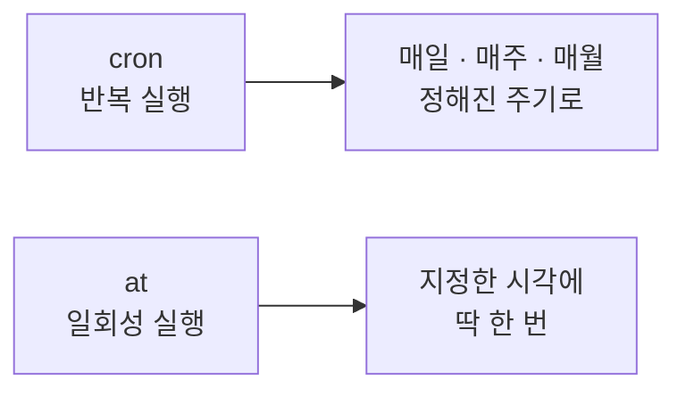
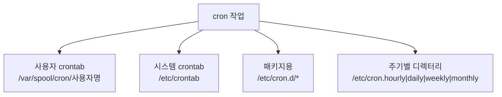
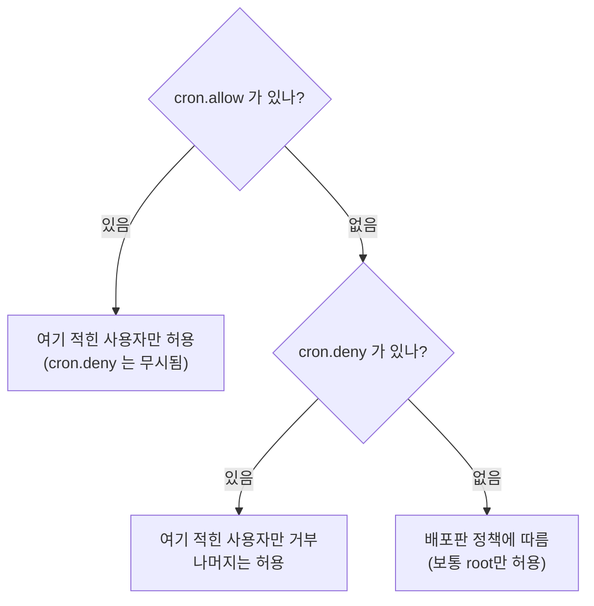

## 030. 작업 예약 - cron과 at

### 1. 작업 예약이 필요한 이유

서버 관리에는 **정해진 시간에 반복해야 하는 일**이 많습니다.

| 작업 | 주기 |
| --- | --- |
| 데이터베이스 백업 | 매일 새벽 3시 |
| 로그 정리 | 매주 일요일 |
| 인증서 갱신 확인 | 매일 |
| 디스크 용량 점검 | 5분마다 |
| 임시 파일 삭제 | 매일 자정 |

사람이 직접 하면 **잊어버리거나 새벽에 깨어 있어야** 합니다.  
이를 자동화하는 것이 **cron(반복)** 과 **at(일회성)** 입니다.



---

### 2. `cron` — 반복 작업 예약

#### crontab 형식 (반드시 암기)

```
*  *  *  *  *  실행할_명령
│  │  │  │  │
│  │  │  │  └── 요일   (0-7, 0과 7 = 일요일)
│  │  │  └───── 월     (1-12)
│  │  └──────── 일     (1-31)
│  └─────────── 시     (0-23)
└────────────── 분     (0-59)
```

**순서 암기법** : **분 - 시 - 일 - 월 - 요일**

#### 특수 문자

| 기호 | 의미 | 예 |
| --- | --- | --- |
| **`*`** | **모든 값** | `* * * * *` = 매분 |
| **`,`** | **목록** | `0,15,30,45` = 0·15·30·45분 |
| **`-`** | **범위** | `9-18` = 9시부터 18시까지 |
| **`/`** | **간격** | `*/10` = 10분마다 |
| `?` | 지정 안 함 (일부 구현) | |

#### 실전 예제 (시험 단골)

| crontab | 의미 |
| --- | --- |
| `0 3 * * *` | **매일 새벽 3시 정각** |
| `*/5 * * * *` | **5분마다** |
| `0 */2 * * *` | 2시간마다 (정각) |
| `30 2 * * 0` | **매주 일요일 새벽 2시 30분** |
| `0 0 1 * *` | **매월 1일 자정** |
| `0 9-18 * * 1-5` | **평일 9시~18시 매 정각** |
| `0 0 * * 6` | 매주 토요일 자정 |
| `15 14 1 * *` | 매월 1일 14시 15분 |
| `0 4 1,15 * *` | 매월 1일과 15일 새벽 4시 |

> **주의 — 일(日)과 요일을 함께 쓰면 OR 조건입니다.**  
> `0 0 1 * 1` 은 "1일 **또는** 월요일"에 실행됩니다. (AND가 아님)  
> 시험에서 자주 함정으로 나옵니다.

#### 특수 문자열

| 문자열 | 의미 | 동등한 표현 |
| --- | --- | --- |
| **`@reboot`** | **부팅 시 1회** | — |
| `@yearly` / `@annually` | 매년 1월 1일 자정 | `0 0 1 1 *` |
| `@monthly` | 매월 1일 자정 | `0 0 1 * *` |
| `@weekly` | 매주 일요일 자정 | `0 0 * * 0` |
| **`@daily`** / `@midnight` | **매일 자정** | `0 0 * * *` |
| **`@hourly`** | **매시 정각** | `0 * * * *` |

---

### 3. `crontab` 명령어

```bash
# 편집 (가장 많이 사용) ⭐
$ crontab -e

# 목록 확인
$ crontab -l

# 전체 삭제 (❗주의)
$ crontab -r

# 삭제 전 확인
$ crontab -i -r

# 다른 사용자의 crontab (root만)
$ sudo crontab -e -u devuser
$ sudo crontab -l -u devuser

# 파일에서 등록
$ crontab mycron.txt
```

| 옵션 | 의미 |
| --- | --- |
| **`-e`** | **편집** |
| **`-l`** | 목록 출력 |
| **`-r`** | **전체 삭제** ❗ |
| `-i` | 삭제 시 확인 |
| `-u 사용자` | 대상 사용자 지정 (root 전용) |

> **`crontab -r`은 확인 없이 전부 지웁니다.**  
> `-e`(편집)와 키가 가까워 실수하기 쉬우므로,  
> **`alias crontab='crontab -i'`** 를 걸어 두는 것이 안전합니다.

---

### 4. crontab 파일의 종류



| 위치 | 용도 | **사용자 필드** |
| --- | --- | --- |
| **`/var/spool/cron/사용자명`** | **사용자별 crontab** (`crontab -e`로 편집) | **없음** |
| **`/etc/crontab`** | **시스템 전역 crontab** | **있음** ⭐ |
| **`/etc/cron.d/`** | 패키지가 설치하는 작업 | **있음** |
| `/etc/cron.hourly/` | 매시 실행할 **스크립트** 배치 | — |
| `/etc/cron.daily/` | 매일 실행할 스크립트 | — |
| `/etc/cron.weekly/` | 매주 | — |
| `/etc/cron.monthly/` | 매월 | — |

#### 가장 중요한 차이 — 사용자 필드

```bash
# 사용자 crontab (crontab -e) — 사용자 필드 없음
0 3 * * * /usr/local/bin/backup.sh

# /etc/crontab, /etc/cron.d/* — 사용자 필드 있음 ⭐
0 3 * * * root /usr/local/bin/backup.sh
          └── 실행할 사용자
```

```bash
$ cat /etc/crontab
SHELL=/bin/bash
PATH=/sbin:/bin:/usr/sbin:/usr/bin
MAILTO=root

# *  *  *  *  * user-name  command to be executed
```

> **시험 단골** : **`/etc/crontab`에는 사용자 필드가 있고, `crontab -e`로 만든 파일에는 없습니다.**  
> 형식을 틀리면 cron이 명령을 인식하지 못합니다.

#### 주기별 디렉터리 사용법

```bash
# 매일 실행할 스크립트를 넣기만 하면 됨
$ sudo vi /etc/cron.daily/cleanup
#!/bin/bash
find /tmp -type f -mtime +7 -delete

$ sudo chmod +x /etc/cron.daily/cleanup     # ❗실행 권한 필수
```

> **실행 권한이 없으면 동작하지 않습니다.** 가장 흔한 실수입니다.  
> 또한 **파일 이름에 점(`.`)이 있으면 무시**되는 경우가 있으므로 `cleanup.sh` 보다 `cleanup`이 안전합니다.

---

### 5. cron 접근 제어

```bash
$ ls -l /etc/cron.allow /etc/cron.deny
```

| 파일 | 동작 |
| --- | --- |
| **`/etc/cron.allow`** | **여기 있는 사용자만 허용** (있으면 deny 무시) |
| **`/etc/cron.deny`** | 여기 있는 사용자만 **거부** |

#### 판정 규칙 (시험 출제)



> **`cron.allow`가 우선입니다.** 두 파일이 모두 있으면 **`cron.deny`는 무시**됩니다.  
> `at`도 동일하게 **`/etc/at.allow`, `/etc/at.deny`** 를 사용합니다.

```bash
# devuser만 cron 사용 허용
$ echo "devuser" | sudo tee /etc/cron.allow

# testuser만 차단
$ sudo rm -f /etc/cron.allow
$ echo "testuser" | sudo tee -a /etc/cron.deny
```

---

### 6. cron 실무에서 자주 겪는 문제

#### 문제 ① PATH 환경 변수 (가장 흔함)

```bash
# 터미널에서는 잘 되는데
$ mysqldump -u root mydb > backup.sql    # ✅ 동작

# cron에서는 실패
0 3 * * * mysqldump -u root mydb > /backup/db.sql    # ❌ command not found
```

**원인** : cron은 **매우 제한된 환경**에서 실행됩니다.

```bash
# cron의 기본 PATH
PATH=/usr/bin:/bin
```

**해결 방법 3가지**

```bash
# ① 절대 경로 사용 (가장 확실) ⭐
0 3 * * * /usr/bin/mysqldump -u root mydb > /backup/db.sql

# ② crontab 상단에 PATH 지정
PATH=/usr/local/bin:/usr/bin:/bin:/usr/local/sbin
0 3 * * * mysqldump -u root mydb > /backup/db.sql

# ③ 스크립트 안에서 환경 로드
0 3 * * * /bin/bash -lc '/usr/local/bin/backup.sh'
```

> **원칙** : **cron에 등록하는 명령은 항상 절대 경로**로 씁니다.  
> `which 명령어` 로 경로를 확인해서 넣으면 됩니다.

#### 문제 ② `%` 문자

```bash
# ❌ 실패 — cron에서 %는 줄바꿈으로 해석됨
0 3 * * * tar czf /backup/$(date +%Y%m%d).tar.gz /data

# ✅ 이스케이프
0 3 * * * tar czf /backup/$(date +\%Y\%m\%d).tar.gz /data

# ✅ 더 안전한 방법 — 스크립트로 분리 ⭐
0 3 * * * /usr/local/bin/backup.sh
```

#### 문제 ③ 출력과 메일

cron은 명령의 출력을 **작업 소유자에게 메일로 보냅니다.**  
메일 시스템이 없으면 로그만 쌓이고, 출력이 많으면 성가십니다.

```bash
# 출력 버리기
0 3 * * * /usr/local/bin/backup.sh > /dev/null 2>&1

# 로그로 남기기 (권장) ⭐
0 3 * * * /usr/local/bin/backup.sh >> /var/log/backup.log 2>&1

# 메일 수신자 지정
MAILTO=admin@example.com
0 3 * * * /usr/local/bin/backup.sh

# 메일 끄기
MAILTO=""
```

> **`> /dev/null 2>&1`로 전부 버리면 실패해도 알 수 없습니다.**  
> **로그 파일로 남기는 것**이 훨씬 좋습니다.

#### 문제 ④ 실행 여부 확인

```bash
# cron 실행 로그 확인 ⭐
$ sudo grep CRON /var/log/cron | tail -10          # RHEL
$ sudo grep CRON /var/log/syslog | tail -10        # Debian
$ sudo journalctl -u crond --since "1 hour ago"

# 출력 예시
Feb  2 03:00:01 server CROND[12345]: (root) CMD (/usr/local/bin/backup.sh)
```

> **로그에 CMD가 찍혔는데 결과가 없다면** → 스크립트 내부 오류 (PATH, 권한)  
> **로그에 CMD 자체가 없다면** → crontab 등록이나 형식 문제

---

### 7. `anacron` — 꺼져 있던 시간의 작업 보완


**`cron`은 정확한 시각**에, **`anacron`은 정해진 주기(일 단위)** 에 실행합니다.

```bash
$ cat /etc/anacrontab
SHELL=/bin/sh
PATH=/sbin:/bin:/usr/sbin:/usr/bin
RANDOM_DELAY=45
START_HOURS_RANGE=3-22

# period  delay  job-identifier   command
1         5      cron.daily       nice run-parts /etc/cron.daily
7         25     cron.weekly      nice run-parts /etc/cron.weekly
@monthly  45     cron.monthly     nice run-parts /etc/cron.monthly
│         │      │
│         │      └── 작업 식별자 (실행 기록이 /var/spool/anacron/에 저장)
│         └───────── 부팅 후 대기 시간(분)
└─────────────────── 주기(일)
```

| 구분 | **cron** | **anacron** |
| --- | --- | --- |
| 실행 단위 | **분 단위 정확한 시각** | **일 단위 주기** |
| 시스템이 꺼져 있었다면 | **건너뜀** | **켜진 후 실행** ⭐ |
| 대상 | 24시간 켜진 서버 | **노트북·데스크톱** |
| 최소 주기 | 1분 | **1일** |

> **노트북에서는 anacron이 필수**입니다.  
> 새벽에 꺼 두면 cron 작업이 영원히 실행되지 않기 때문입니다.

---

### 8. `at` — 일회성 예약

```bash
# 대화형 등록
$ at 03:00
at> /usr/local/bin/report.sh
at> <Ctrl+D>            # 입력 종료 ⭐
job 5 at Mon Feb  2 03:00:00 2026

# 파이프로 등록 (더 편리)
$ echo "/usr/local/bin/report.sh" | at 03:00
$ echo "shutdown -h now" | sudo at 23:00

# 파일에서 읽기
$ at -f script.sh 03:00
```

#### 시간 지정 형식

| 형식 | 예 |
| --- | --- |
| 절대 시각 | `at 15:30`, `at 3:00 PM` |
| **`now + N`** | **`at now + 30 minutes`**, `at now + 2 hours`, `at now + 3 days` |
| 날짜 지정 | `at 10:00 2026-02-15`, `at 10:00 Feb 15` |
| 키워드 | **`at midnight`**, `at noon`, `at teatime`(16:00) |
| 상대 날짜 | `at 10:00 tomorrow`, `at 10:00 next week` |

```bash
$ at now + 1 hour
$ at 14:00 tomorrow
$ at midnight
```

#### 작업 관리

```bash
$ atq                        # 예약 목록 확인 ⭐
5  Mon Feb  2 03:00:00 2026 a masterway
│                             │
│                             └── 큐 이름
└── 작업 번호

$ at -l                      # atq와 동일
$ at -c 5                    # 5번 작업 내용 확인 ⭐
$ atrm 5                     # 작업 삭제
$ at -d 5                    # atrm과 동일
```

| 명령어 | 기능 |
| --- | --- |
| **`at`** | 작업 예약 |
| **`atq`** (`at -l`) | **예약 목록** |
| **`atrm`** (`at -d`) | **작업 삭제** |
| `at -c 번호` | 작업 내용 확인 |
| `batch` | **시스템 부하가 낮을 때** 실행 |

```bash
# batch — Load Average가 0.8 미만일 때 실행
$ echo "/usr/local/bin/heavy_job.sh" | batch
```

#### `at` 서비스와 접근 제어

```bash
$ sudo systemctl enable --now atd
$ systemctl status atd

# 접근 제어 (cron과 동일한 규칙)
$ cat /etc/at.allow
$ cat /etc/at.deny

# 작업 저장 위치
$ sudo ls /var/spool/at/
```

> **`atd` 서비스가 꺼져 있으면 예약해도 실행되지 않습니다.**  
> `at` 명령은 성공한 것처럼 보이므로 반드시 서비스 상태를 확인해야 합니다.

---

### 9. `systemd timer` — cron의 현대적 대안

```bash
# 타이머 목록
$ systemctl list-timers
NEXT                        LEFT     LAST                        UNIT
Mon 2026-02-03 00:00:00 KST 17h left Sun 2026-02-02 00:00:12 KST logrotate.timer
```

#### 타이머 만들기

```bash
# ① 서비스 유닛
$ sudo vi /etc/systemd/system/backup.service
```
```ini
[Unit]
Description=Daily Backup

[Service]
Type=oneshot
ExecStart=/usr/local/bin/backup.sh
```

```bash
# ② 타이머 유닛
$ sudo vi /etc/systemd/system/backup.timer
```
```ini
[Unit]
Description=Run backup daily at 3AM

[Timer]
OnCalendar=*-*-* 03:00:00
Persistent=true              # 놓친 작업을 부팅 후 실행 (anacron 역할) ⭐
RandomizedDelaySec=300       # 0~5분 랜덤 지연 (부하 분산)

[Install]
WantedBy=timers.target
```

```bash
$ sudo systemctl daemon-reload
$ sudo systemctl enable --now backup.timer
$ systemctl list-timers backup.timer
```

#### cron vs systemd timer

| 구분 | **cron** | **systemd timer** |
| --- | --- | --- |
| 설정 난이도 | **간단** | 파일 2개 필요 (복잡) |
| 로그 | 별도 확인 필요 | **`journalctl -u`로 통합** ⭐ |
| 의존 관계 | 불가 | **다른 유닛과 연동 가능** |
| 놓친 작업 | anacron 필요 | **`Persistent=true`** |
| 자원 제한 | 불가 | **cgroup으로 제한 가능** |
| 실행 결과 확인 | 어려움 | **`systemctl status`로 확인** |

> **간단한 작업은 cron, 복잡하거나 의존성이 있는 작업은 systemd timer**를 씁니다.  
> 시험 범위는 **cron 중심**이지만, 실무에서는 timer도 널리 쓰입니다.

---

### 10. 실무 예제 모음

```bash
$ crontab -e
```

```bash
# 환경 설정
SHELL=/bin/bash
PATH=/usr/local/sbin:/usr/local/bin:/usr/sbin:/usr/bin:/sbin:/bin
MAILTO=admin@example.com

# 매일 새벽 3시 DB 백업
0 3 * * * /usr/local/bin/db_backup.sh >> /var/log/db_backup.log 2>&1

# 5분마다 디스크 용량 점검
*/5 * * * * /usr/local/bin/check_disk.sh

# 매주 일요일 새벽 4시 오래된 로그 삭제
0 4 * * 0 /usr/bin/find /var/log -name "*.log" -mtime +90 -delete

# 매월 1일 새벽 2시 전체 백업
0 2 1 * * /usr/local/bin/full_backup.sh >> /var/log/full_backup.log 2>&1

# 평일 업무시간에만 모니터링
*/10 9-18 * * 1-5 /usr/local/bin/monitor.sh

# 부팅 시 1회 실행
@reboot /usr/local/bin/startup.sh
```

**디스크 점검 스크립트 예시**

```bash
#!/bin/bash
# /usr/local/bin/check_disk.sh
THRESHOLD=85
df -h --output=pcent,target | tail -n +2 | while read pct mnt; do
    usage=${pct%\%}
    if [ "$usage" -ge "$THRESHOLD" ]; then
        logger -p user.crit "Disk usage warning: $mnt is ${usage}%"
    fi
done
```

---

### 시험 포인트 정리

| 항목 | 핵심 |
| --- | --- |
| **crontab 필드 순서** | **분 - 시 - 일 - 월 - 요일** |
| 요일 값 | **0~7 (0과 7 모두 일요일)** |
| `*/10` | **10분(단위)마다** |
| `0 3 * * *` | **매일 새벽 3시** |
| `30 2 * * 0` | **매주 일요일 2시 30분** |
| 일과 요일 동시 지정 | **OR 조건** (AND 아님) |
| **`crontab -e/-l/-r`** | **편집 / 목록 / 전체 삭제** |
| 사용자 crontab 위치 | **`/var/spool/cron/사용자명`** |
| **`/etc/crontab`** | **사용자 필드 있음** ⭐ |
| `crontab -e` 파일 | **사용자 필드 없음** |
| cron 접근 제어 | **`/etc/cron.allow`(우선), `/etc/cron.deny`** |
| allow가 있으면 | **deny 무시** |
| cron 로그 | **`/var/log/cron`** (RHEL) |
| cron의 PATH 문제 | **절대 경로 사용** |
| cron에서 `%` | **이스케이프(`\%`) 필요** |
| **`anacron`** | **꺼져 있던 작업을 켜진 후 실행** |
| anacron 설정 | **`/etc/anacrontab`** |
| **`at`** | **일회성 예약** |
| **`atq`** | 예약 목록 |
| **`atrm`** | 예약 삭제 |
| at 서비스 | **`atd`** |
| at 접근 제어 | `/etc/at.allow`, `/etc/at.deny` |
| `batch` | **부하가 낮을 때 실행** |
| systemd 타이머 | `OnCalendar`, **`Persistent=true`** |

---

### 한 줄 정리

cron은 **분-시-일-월-요일** 순서로 **반복 작업**을, `at`은 **일회성 작업**을 예약하며,  
**`/etc/crontab`에는 사용자 필드가 있지만 `crontab -e`로 만든 파일에는 없고**,  
cron 실패의 대부분은 **PATH 문제이므로 절대 경로**를 쓰고 **로그를 파일로 남겨야** 하며,  
서버가 꺼져 있던 시간의 작업은 **anacron 또는 systemd timer의 `Persistent=true`** 로 보완합니다.
