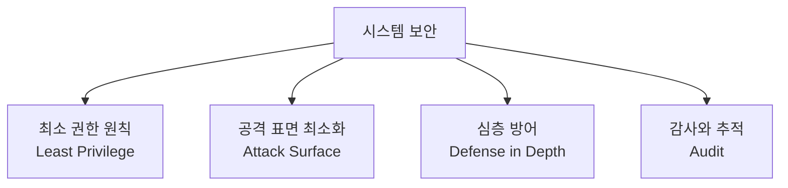
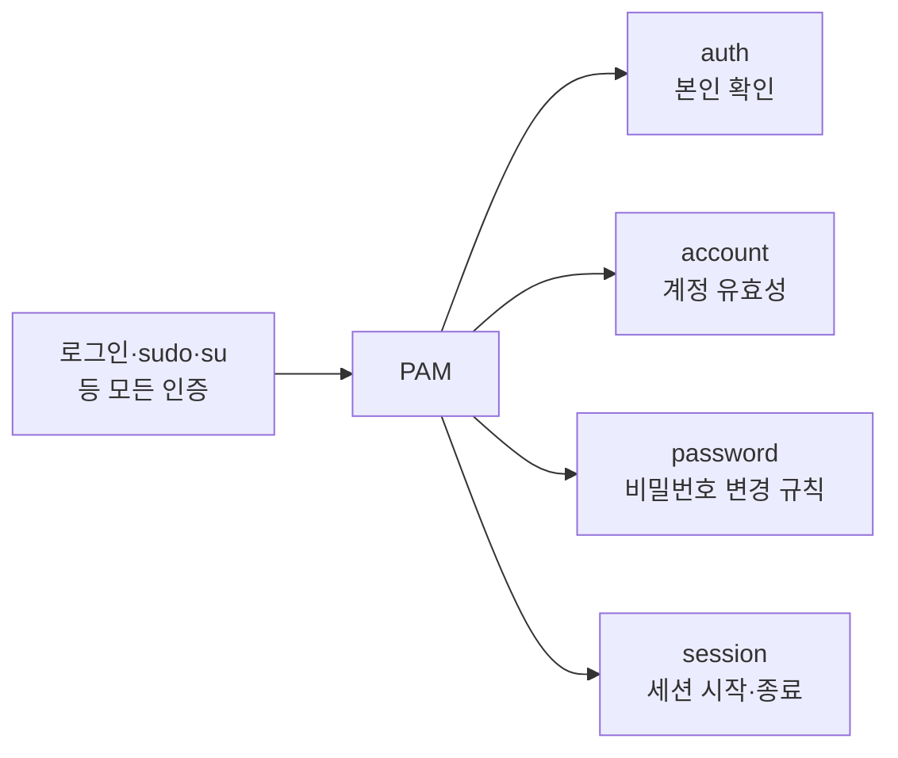

## 031. 시스템 보안 관리

### 1. 보안의 기본 원칙



| 원칙 | 의미 |
| --- | --- |
| **최소 권한** | 필요한 **최소한의 권한만** 부여합니다. root로 서비스를 돌리지 않습니다. |
| **공격 표면 최소화** | 안 쓰는 **서비스·포트·계정을 제거**합니다. 없는 것은 공격당하지 않습니다. |
| **심층 방어** | 방화벽 하나에 의존하지 않고 **여러 겹의 방어**를 둡니다. |
| **감사와 추적** | 누가 무엇을 했는지 **기록으로 남깁니다.** |

---

### 2. 계정 보안

#### ① 불필요한 계정 정리

```bash
# 로그인 가능한 계정 목록 확인 ⭐
$ grep -vE "nologin|false" /etc/passwd
root:x:0:0:root:/root:/bin/bash
masterway:x:1000:1000::/home/masterway:/bin/bash
sync:x:5:0:sync:/sbin:/bin/sync

# UID 0인 계정 점검 (root는 하나여야 함) ⭐
$ awk -F: '$3 == 0 {print $1}' /etc/passwd
root

# 비밀번호 없는 계정 점검 ⭐
$ sudo awk -F: '$2 == "" {print $1}' /etc/shadow

# 사용하지 않는 계정 잠금
$ sudo usermod -L olduser
$ sudo usermod -s /sbin/nologin olduser     # 셸까지 차단 (더 확실)
$ sudo chage -E 0 olduser                    # 계정 만료
```

> **UID 0인 계정이 root 외에 있으면 심각한 문제**입니다.  
> 공격자가 백도어 계정을 만들 때 흔히 쓰는 수법입니다.

#### ② 비밀번호 정책

```bash
# /etc/login.defs — 신규 계정의 기본 정책
$ sudo vi /etc/login.defs
PASS_MAX_DAYS   90        # 최대 사용 기간
PASS_MIN_DAYS   1         # 변경 후 최소 대기
PASS_MIN_LEN    8         # 최소 길이
PASS_WARN_AGE   7         # 만료 경고 시작일

# 기존 계정에 적용
$ sudo chage -M 90 -m 1 -W 7 devuser
$ sudo chage -l devuser
```

#### ③ 비밀번호 복잡도 — PAM

```bash
$ sudo vi /etc/security/pwquality.conf
minlen = 12               # 최소 길이
dcredit = -1              # 숫자 최소 1개 (음수 = 최소 개수)
ucredit = -1              # 대문자 최소 1개
lcredit = -1              # 소문자 최소 1개
ocredit = -1              # 특수문자 최소 1개
minclass = 3              # 문자 종류 최소 3가지
maxrepeat = 3             # 같은 문자 연속 최대 3회
dictcheck = 1             # 사전 단어 검사
```

> **`dcredit` 값의 의미**  
> **음수(-1)** = 해당 종류를 **최소 1개 포함해야 함**  
> 양수(1) = 포함 시 길이 계산에 가산점

#### ④ 로그인 실패 잠금 — `faillock`

```bash
$ sudo vi /etc/security/faillock.conf
deny = 5                  # 5회 실패 시 잠금
unlock_time = 900         # 900초(15분) 후 자동 해제
fail_interval = 900       # 실패 카운트 유지 시간

# 잠긴 계정 확인·해제
$ sudo faillock --user devuser
$ sudo faillock --user devuser --reset
```

> **무차별 대입 공격 방어의 핵심**입니다.  
> 아무리 강한 비밀번호라도 **무한히 시도할 수 있으면 언젠가 뚫립니다.**  
> 시도 횟수를 제한하면 공격 자체가 무의미해집니다.

---

### 3. SSH 보안 강화 (가장 중요)

SSH는 **외부에 노출되는 대표적인 서비스**라 공격 대상 1순위입니다.

```bash
$ sudo vi /etc/ssh/sshd_config
```

```apache
# ① root 직접 로그인 차단 ⭐⭐
PermitRootLogin no

# ② 기본 포트 변경 (자동화 스캔 회피)
Port 2222

# ③ 비밀번호 인증 비활성화 (공개키만 허용) ⭐
PasswordAuthentication no
PubkeyAuthentication yes

# ④ 빈 비밀번호 금지
PermitEmptyPasswords no

# ⑤ 프로토콜 2만 사용 (1은 취약)
Protocol 2

# ⑥ 접속 허용 사용자·그룹 제한 ⭐
AllowUsers masterway devuser
AllowGroups sshusers
# DenyUsers testuser

# ⑦ 로그인 시도 제한
MaxAuthTries 3
LoginGraceTime 30
MaxSessions 5

# ⑧ 유휴 세션 자동 종료
ClientAliveInterval 300
ClientAliveCountMax 2

# ⑨ X11 포워딩 비활성화 (불필요하면)
X11Forwarding no
```

```bash
# ❗설정 문법 검사 (재시작 전 필수) ⭐
$ sudo sshd -t

# 재시작
$ sudo systemctl restart sshd

# 포트 변경 시 방화벽·SELinux도 함께
$ sudo semanage port -a -t ssh_port_t -p tcp 2222
$ sudo firewall-cmd --add-port=2222/tcp --permanent
$ sudo firewall-cmd --reload
```

> **⚠️ 원격 작업 시 주의**  
> SSH 설정을 바꾸고 재시작했다가 잘못되면 **다시 접속할 수 없습니다.**  
> **반드시 기존 세션을 유지한 채 새 터미널로 접속 테스트**를 해 보고,  
> 정상 확인 후에 기존 세션을 닫아야 합니다.

#### 공개키 인증 설정 (실기 대비)


```bash
# ① 클라이언트에서 키 쌍 생성
$ ssh-keygen -t ed25519 -C "masterway@laptop"
$ ssh-keygen -t rsa -b 4096 -C "masterway@laptop"      # RSA 사용 시
# → ~/.ssh/id_ed25519 (개인키), ~/.ssh/id_ed25519.pub (공개키)

# ② 서버에 공개키 등록
$ ssh-copy-id -p 2222 masterway@192.168.0.50

# 수동으로 하려면
$ cat ~/.ssh/id_ed25519.pub | ssh masterway@192.168.0.50 \
    "mkdir -p ~/.ssh && cat >> ~/.ssh/authorized_keys"

# ③ 서버에서 권한 확인 (❗권한이 틀리면 동작 안 함) ⭐
$ chmod 700 ~/.ssh
$ chmod 600 ~/.ssh/authorized_keys
$ chmod 600 ~/.ssh/id_ed25519          # 개인키
```

| 파일/디렉터리 | 필수 권한 |
| --- | --- |
| **`~/.ssh`** | **700** |
| **`~/.ssh/authorized_keys`** | **600** |
| **`~/.ssh/id_rsa`** (개인키) | **600** |
| `~/.ssh/id_rsa.pub` (공개키) | 644 |

> **공개키 로그인이 안 될 때 90%는 권한 문제**입니다.  
> SSH는 보안상 **권한이 너무 열려 있으면 키를 무시**합니다.
> ```bash
> $ sudo tail -f /var/log/secure       # 원인이 여기에 기록됨
> Authentication refused: bad ownership or modes for directory /home/user/.ssh
> ```

#### `fail2ban` — 자동 차단

```bash
$ sudo dnf install epel-release && sudo dnf install fail2ban

$ sudo vi /etc/fail2ban/jail.local
```
```ini
[DEFAULT]
bantime = 3600            # 차단 시간(초)
findtime = 600            # 관찰 시간
maxretry = 5              # 허용 실패 횟수

[sshd]
enabled = true
port = 2222
logpath = /var/log/secure
```

```bash
$ sudo systemctl enable --now fail2ban
$ sudo fail2ban-client status sshd
Status for the jail: sshd
|- Currently banned: 3
`- Banned IP list:   203.0.113.55 198.51.100.22

$ sudo fail2ban-client set sshd unbanip 203.0.113.55    # 차단 해제
```

---

### 4. 불필요한 서비스와 포트 정리

```bash
# ① 실행 중인 서비스 확인
$ systemctl list-units --type=service --state=running

# ② 자동 시작 서비스 확인
$ systemctl list-unit-files --type=service --state=enabled

# ③ 열려 있는 포트 확인 ⭐
$ sudo ss -tulnp
Netid State  Local Address:Port  Process
tcp   LISTEN 0.0.0.0:22          users:(("sshd",pid=856))
tcp   LISTEN 0.0.0.0:80          users:(("httpd",pid=1203))
tcp   LISTEN 0.0.0.0:23          users:(("telnetd",pid=1500))    ← ❗위험

# ④ 불필요한 서비스 중지·차단
$ sudo systemctl disable --now telnet.socket
$ sudo systemctl mask telnet.socket          # 완전 차단
```

#### 제거하거나 차단해야 할 서비스

| 서비스 | 포트 | 이유 | 대체 |
| --- | --- | --- | --- |
| **telnet** | 23 | **평문 전송** | **SSH (22)** |
| **rsh / rlogin / rexec** | 512-514 | 평문, 인증 취약 | SSH |
| **FTP** | 21 | 평문 전송 | **SFTP / FTPS** |
| **TFTP** | 69 | 인증 없음 | — |
| finger | 79 | 사용자 정보 노출 | — |
| **NFS (불필요 시)** | 2049 | 설정 미흡 시 위험 | — |

> **`0.0.0.0`으로 LISTEN 중인 서비스에 주의**하세요.  
> 모든 인터페이스에서 접속을 받는다는 뜻입니다.  
> 내부에서만 쓸 서비스는 **`127.0.0.1`에 바인딩**해야 합니다.
> ```
> # 예: MySQL을 로컬에서만
> bind-address = 127.0.0.1
> ```

---

### 5. 파일 시스템 보안

#### SetUID / SetGID 점검

```bash
# SetUID 파일 목록 (정기 점검 필수) ⭐
$ sudo find / -perm -4000 -type f 2>/dev/null
/usr/bin/passwd
/usr/bin/sudo
/usr/bin/su

# SetGID 파일
$ sudo find / -perm -2000 -type f 2>/dev/null

# 기준 목록을 만들어 두고 변화를 감시
$ sudo find / -perm -4000 -type f 2>/dev/null | sort > /root/setuid.baseline
# 나중에
$ sudo find / -perm -4000 -type f 2>/dev/null | sort | diff /root/setuid.baseline -
```

> **공격자는 백도어를 만들 때 SetUID를 자주 사용**합니다.  
> `/tmp`나 사용자 홈에 SetUID 바이너리가 있다면 **거의 확실히 침해 흔적**입니다.

#### 위험한 권한 점검

```bash
# 누구나 쓸 수 있는 파일 ⭐
$ sudo find / -type f -perm -o+w -not -path "/proc/*" 2>/dev/null

# 누구나 쓸 수 있는 디렉터리 중 Sticky Bit 없는 것 (위험) ⭐
$ sudo find / -type d -perm -o+w ! -perm -1000 2>/dev/null

# 소유자 없는 파일 (삭제된 계정의 잔여물)
$ sudo find / -nouser -o -nogroup 2>/dev/null
```

#### 보안 마운트 옵션

```bash
$ sudo vi /etc/fstab
/dev/sdb1  /tmp   xfs  defaults,noexec,nosuid,nodev  0 2
/dev/sdb2  /home  xfs  defaults,nosuid,nodev         0 2
```

| 옵션 | 효과 |
| --- | --- |
| **`noexec`** | **실행 파일 실행 금지** — 악성 스크립트 실행 차단 |
| **`nosuid`** | **SetUID 무시** — 권한 상승 차단 |
| **`nodev`** | 장치 파일 무시 |

#### 중요 파일 변경 방지

```bash
$ sudo chattr +i /etc/passwd /etc/shadow /etc/group
$ lsattr /etc/passwd
----i---------- /etc/passwd

# 변경이 필요할 때만 해제
$ sudo chattr -i /etc/passwd
```

---

### 6. PAM (Pluggable Authentication Modules)

**인증을 모듈 방식으로 처리**하는 시스템입니다.



| 모듈 타입 | 역할 |
| --- | --- |
| **`auth`** | **인증** — 비밀번호 확인 |
| **`account`** | **계정 유효성** — 만료·시간 제한 확인 |
| **`password`** | **비밀번호 변경** 규칙 |
| **`session`** | 세션 시작·종료 시 처리 |

| 제어 플래그 | 의미 |
| --- | --- |
| **`required`** | **반드시 성공** (실패해도 다음 모듈은 실행, 최종 실패) |
| **`requisite`** | 반드시 성공, **실패 시 즉시 중단** |
| **`sufficient`** | **성공하면 즉시 통과** (이후 모듈 생략) |
| `optional` | 결과가 영향을 주지 않음 |

```bash
$ cat /etc/pam.d/sshd
auth       required     pam_sepermit.so
auth       substack     password-auth
account    required     pam_nologin.so
session    required     pam_loginuid.so
```

#### 실무 활용 — `wheel` 그룹만 `su` 허용

```bash
$ sudo vi /etc/pam.d/su
# 아래 줄의 주석을 해제
auth       required   pam_wheel.so use_uid
```

이렇게 하면 **`wheel` 그룹에 속한 사용자만 `su`로 root 전환**이 가능해집니다.

```bash
$ sudo usermod -aG wheel masterway
```

> **PAM 설정을 잘못 건드리면 로그인 자체가 불가능**해질 수 있습니다.  
> 반드시 **다른 터미널 세션을 열어 둔 채로** 수정하고 테스트해야 합니다.

---

### 7. 침해 흔적 점검 (실무)

```bash
# ① 최근 로그인 기록
$ last | head -20
$ sudo lastb | head -20                  # 실패 기록 ⭐

# ② 현재 접속자와 실행 중인 명령
$ w
$ who -a

# ③ 이상한 프로세스
$ ps aux --sort=-%cpu | head -10
$ ps -ef --forest | less
$ sudo lsof -i -n -P | grep ESTABLISHED  # 외부 연결 ⭐

# ④ 예약 작업 점검 (백도어가 자주 숨는 곳) ⭐
$ sudo crontab -l -u root
$ for u in $(cut -f1 -d: /etc/passwd); do echo "== $u"; sudo crontab -l -u $u 2>/dev/null; done
$ ls -la /etc/cron.*/
$ cat /etc/cron.d/*

# ⑤ 시작 프로그램 점검
$ systemctl list-unit-files --state=enabled
$ ls -la /etc/systemd/system/

# ⑥ SetUID 백도어 점검
$ sudo find /tmp /var/tmp /dev/shm -perm -4000 2>/dev/null

# ⑦ 패키지 파일 변조 검증 ⭐
$ sudo rpm -Va | grep "^..5" | head -20
S.5....T.  /usr/bin/ls              ← ls가 변조됨 ❗

# ⑧ 숨김 파일·디렉터리
$ sudo find / -name ".*" -type d 2>/dev/null | grep -vE "^/(proc|sys|home)"

# ⑨ 최근 변경된 파일
$ sudo find /etc /usr/bin /usr/sbin -mtime -7 -type f 2>/dev/null
```

> **`rpm -Va`에서 `/usr/bin/ls` 같은 기본 명령이 변조되었다면**  
> **루트킷 감염**을 의심해야 합니다.  
> 이 경우 시스템의 모든 명령을 신뢰할 수 없으므로,  
> **외부 매체로 부팅해서 조사**하거나 **재설치**가 원칙입니다.

---

### 8. 무결성 검사 도구 — AIDE

```bash
$ sudo dnf install aide

# ① 기준 DB 생성 (설치 직후, 깨끗한 상태에서) ⭐
$ sudo aide --init
$ sudo mv /var/lib/aide/aide.db.new.gz /var/lib/aide/aide.db.gz

# ② 정기 검사
$ sudo aide --check
Summary:
  Total number of entries:      45231
  Added entries:                0
  Removed entries:              0
  Changed entries:              2      ← ❗변경 발생

# ③ 정상적인 변경 후 DB 갱신
$ sudo aide --update
```

```bash
# cron으로 매일 검사
$ echo "0 5 * * * root /usr/sbin/aide --check | mail -s 'AIDE Report' admin@example.com" \
    | sudo tee /etc/cron.d/aide
```

> **AIDE DB는 반드시 외부에 보관**해야 합니다.  
> 공격자가 시스템을 장악하면 **DB도 함께 조작**할 수 있기 때문입니다.

---

### 9. 보안 업데이트

```bash
# 보안 업데이트 목록 확인 ⭐
$ sudo dnf updateinfo list security
$ sudo dnf updateinfo info security

# 보안 업데이트만 적용
$ sudo dnf update --security

# 자동 업데이트 설정
$ sudo dnf install dnf-automatic
$ sudo vi /etc/dnf/automatic.conf
upgrade_type = security
apply_updates = yes
$ sudo systemctl enable --now dnf-automatic.timer

# Debian 계열
$ sudo apt install unattended-upgrades
$ sudo dpkg-reconfigure -plow unattended-upgrades
```

> **취약점 공개 = 공격 시작**입니다.  
> 취약점이 발표되면 공격 코드도 함께 퍼지므로,  
> **보안 패치는 최대한 빨리 적용**해야 합니다.

---

### 10. 보안 점검 체크리스트

| 항목 | 확인 명령 |
| --- | --- |
| UID 0 계정이 root뿐인가 | `awk -F: '$3==0' /etc/passwd` |
| 비밀번호 없는 계정 | `awk -F: '$2==""' /etc/shadow` |
| SSH root 로그인 차단 | `grep PermitRootLogin /etc/ssh/sshd_config` |
| 불필요한 포트 | `ss -tulnp` |
| telnet 등 취약 서비스 | `systemctl list-units --state=running` |
| SetUID 파일 변화 | `find / -perm -4000 -type f` |
| 누구나 쓰기 가능한 파일 | `find / -type f -perm -o+w` |
| 방화벽 활성화 | `firewall-cmd --state` |
| SELinux 활성화 | `getenforce` |
| 로그인 실패 이력 | `lastb` |
| 패키지 무결성 | `rpm -Va` |
| 보안 업데이트 | `dnf updateinfo list security` |
| 예약 작업 점검 | `crontab -l`, `ls /etc/cron.d/` |

---

### 시험 포인트 정리

| 항목 | 핵심 |
| --- | --- |
| 보안 원칙 | **최소 권한 · 공격 표면 최소화 · 심층 방어** |
| UID 0 | **root만 있어야 함** |
| SSH root 차단 | **`PermitRootLogin no`** ⭐ |
| SSH 비밀번호 차단 | `PasswordAuthentication no` |
| SSH 사용자 제한 | **`AllowUsers`, `AllowGroups`** |
| SSH 설정 검사 | **`sshd -t`** |
| **`~/.ssh` 권한** | **700** |
| **`authorized_keys` 권한** | **600** ⭐ |
| 개인키 권한 | **600** |
| 로그인 실패 잠금 | **`faillock`** |
| 비밀번호 복잡도 | **`/etc/security/pwquality.conf`** |
| 자동 IP 차단 | **`fail2ban`** |
| telnet 대체 | **SSH (평문 전송 문제)** |
| SetUID 점검 | **`find / -perm -4000`** |
| 보안 마운트 옵션 | **`noexec,nosuid,nodev`** |
| 파일 변경 방지 | **`chattr +i`** |
| **PAM 타입** | **auth / account / password / session** |
| PAM `sufficient` | **성공하면 즉시 통과** |
| PAM `required` | 반드시 성공 (계속 진행) |
| wheel만 su 허용 | **`pam_wheel.so`** |
| 무결성 검사 | **AIDE** |
| 패키지 변조 검증 | **`rpm -Va`** |
| 보안 업데이트만 | **`dnf update --security`** |

---

### 한 줄 정리

시스템 보안의 핵심은 **최소 권한·불필요한 서비스 제거·심층 방어**이며,  
SSH는 **`PermitRootLogin no` + 공개키 인증(`~/.ssh` 700, `authorized_keys` 600)** 이 기본이고,  
정기적으로 **SetUID 파일(`find -perm -4000`)·로그인 실패(`lastb`)·패키지 무결성(`rpm -Va`)** 을 점검해야 합니다.
