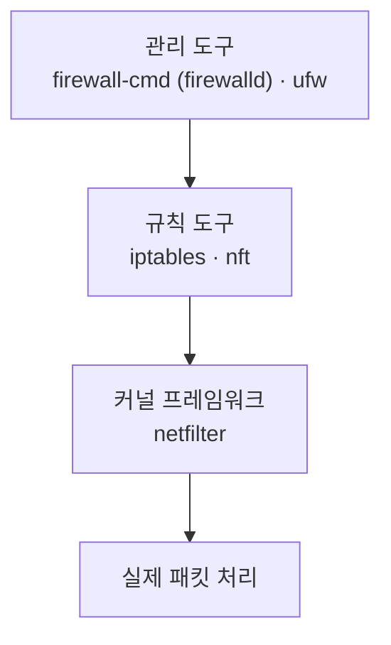
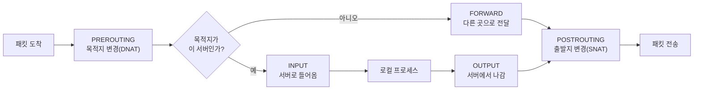
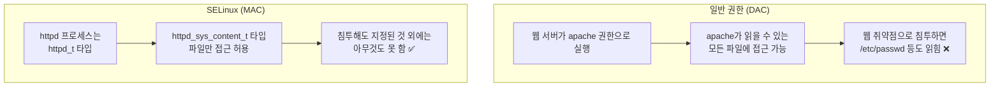
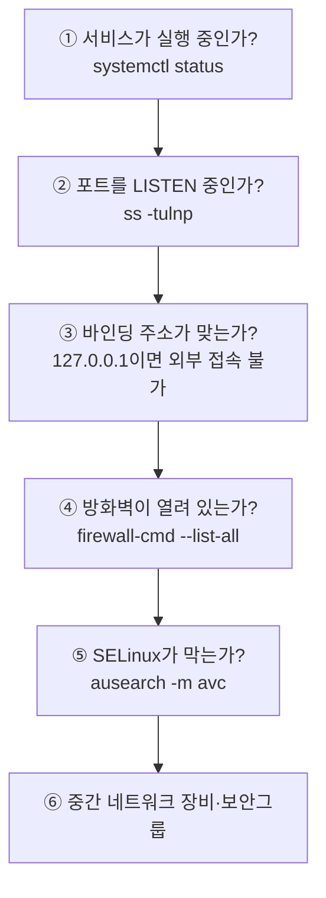

## 032. 방화벽과 SELinux

### 1. 리눅스 방화벽의 계층 구조



| 계층 | 이름 | 역할 |
| --- | --- | --- |
| **커널** | **netfilter** | 실제로 패킷을 검사·차단하는 **커널 프레임워크** |
| **규칙 도구** | **iptables** / **nftables** | netfilter에 규칙을 등록하는 명령 |
| **관리 도구** | **firewalld** (RHEL) / **ufw** (Ubuntu) | 사용하기 쉽게 감싼 상위 도구 |

> **핵심** : `firewalld`나 `ufw`는 **결국 iptables/nftables를 대신 조작해 주는 도구**입니다.  
> 셋을 동시에 쓰면 **규칙이 충돌**하므로 하나만 사용해야 합니다.

---

### 2. `iptables` — 전통적 방화벽

#### 테이블과 체인 구조



#### 주요 테이블

| 테이블 | 용도 | 주요 체인 |
| --- | --- | --- |
| **`filter`** | **패킷 허용·차단 (기본)** | **INPUT, OUTPUT, FORWARD** |
| **`nat`** | **주소 변환** | **PREROUTING, POSTROUTING**, OUTPUT |
| `mangle` | 패킷 헤더 변경 | 전체 |
| `raw` | 연결 추적 예외 | PREROUTING, OUTPUT |

#### 주요 체인 (시험 필수)

| 체인 | 언제 통과하나 |
| --- | --- |
| **`INPUT`** | **서버로 들어오는** 패킷 |
| **`OUTPUT`** | **서버에서 나가는** 패킷 |
| **`FORWARD`** | **서버를 거쳐 다른 곳으로** 가는 패킷 (라우터 역할) |
| **`PREROUTING`** | 라우팅 **전** — **DNAT**(목적지 변경, 포트포워딩) |
| **`POSTROUTING`** | 라우팅 **후** — **SNAT/MASQUERADE**(출발지 변경, 공유) |

#### 정책(Target)

| Target | 동작 |
| --- | --- |
| **`ACCEPT`** | **허용** |
| **`DROP`** | **버림 (응답 없음)** — 공격자에게 정보를 주지 않음 |
| **`REJECT`** | **거부 + 거부 메시지 전송** — 내부망에서 빠른 실패 처리에 유리 |
| `LOG` | 로그만 남기고 다음 규칙으로 |
| `SNAT` / `DNAT` / `MASQUERADE` | 주소 변환 |

> **`DROP` vs `REJECT` (시험 출제)**  
> **`DROP`** : 아무 응답도 하지 않음 → 공격자가 **포트가 있는지조차 알 수 없음** (외부 대응에 유리)  
> **`REJECT`** : "거부됐다"고 알려 줌 → 클라이언트가 **즉시 실패를 인지** (내부망에 유리)

#### 기본 사용법

```bash
# 규칙 조회 ⭐
$ sudo iptables -L -n -v --line-numbers
     │  │  │  │
     │  │  │  └── 줄 번호 표시
     │  │  └───── 상세 (패킷 수, 바이트)
     │  └──────── 숫자로 표시 (이름 변환 안 함, 빠름)
     └─────────── 목록

$ sudo iptables -t nat -L -n            # nat 테이블

# 규칙 추가
$ sudo iptables -A INPUT -p tcp --dport 22 -j ACCEPT      # 맨 뒤에 추가 (Append)
$ sudo iptables -I INPUT 1 -p tcp --dport 80 -j ACCEPT    # 맨 앞에 삽입 (Insert) ⭐

# 규칙 삭제
$ sudo iptables -D INPUT 3                                # 3번 규칙 삭제
$ sudo iptables -D INPUT -p tcp --dport 22 -j ACCEPT      # 규칙 내용으로 삭제

# 기본 정책 설정
$ sudo iptables -P INPUT DROP           # ❗원격 접속 중이면 즉시 끊김
$ sudo iptables -P FORWARD DROP
$ sudo iptables -P OUTPUT ACCEPT

# 전체 삭제
$ sudo iptables -F                      # 규칙 비우기 (Flush)
$ sudo iptables -X                      # 사용자 정의 체인 삭제
```

| 옵션 | 의미 |
| --- | --- |
| **`-A`** | **체인 끝에 추가** (Append) |
| **`-I`** | **앞에 삽입** (Insert) |
| **`-D`** | 삭제 |
| **`-P`** | **기본 정책** |
| **`-L`** | 목록 |
| **`-F`** | 전체 비우기 |
| **`-p`** | 프로토콜 (tcp, udp, icmp) |
| **`--dport`** | **목적지 포트** |
| `--sport` | 출발지 포트 |
| **`-s`** | 출발지 IP |
| `-d` | 목적지 IP |
| **`-j`** | **동작 지정** (jump) |
| `-i` / `-o` | 입력 / 출력 인터페이스 |
| `-m` | 확장 모듈 (`state`, `multiport`) |

> **규칙은 위에서부터 순서대로 검사**하며, **먼저 일치하는 규칙이 적용**됩니다.  
> 그래서 `-A`(뒤에 추가)와 `-I`(앞에 삽입)의 차이가 중요합니다.  
> **DROP 규칙 뒤에 ACCEPT를 추가하면 아무 효과가 없습니다.**

#### 실전 규칙 세트

```bash
# ① 기존 연결과 로컬은 항상 허용 (가장 먼저!) ⭐
$ sudo iptables -A INPUT -m state --state ESTABLISHED,RELATED -j ACCEPT
$ sudo iptables -A INPUT -i lo -j ACCEPT

# ② 필요한 서비스 허용
$ sudo iptables -A INPUT -p tcp --dport 22 -j ACCEPT
$ sudo iptables -A INPUT -p tcp --dport 80 -j ACCEPT
$ sudo iptables -A INPUT -p tcp --dport 443 -j ACCEPT

# ③ 특정 IP만 SSH 허용
$ sudo iptables -A INPUT -p tcp --dport 22 -s 192.168.0.0/24 -j ACCEPT

# ④ 여러 포트 한 번에
$ sudo iptables -A INPUT -p tcp -m multiport --dports 80,443,8080 -j ACCEPT

# ⑤ ICMP(ping) 허용
$ sudo iptables -A INPUT -p icmp --icmp-type echo-request -j ACCEPT

# ⑥ 나머지 차단
$ sudo iptables -P INPUT DROP
```

> **`ESTABLISHED,RELATED` 규칙을 맨 앞에 두는 이유**  
> 이 규칙이 없으면 **내가 보낸 요청의 응답도 차단**됩니다.  
> `ping 8.8.8.8`을 보내도 돌아오는 응답이 막혀 통신이 되지 않습니다.

#### 규칙 저장 (재부팅 시 유지)

```bash
# ❗iptables 규칙은 메모리에만 있어 재부팅하면 사라집니다
$ sudo dnf install iptables-services
$ sudo service iptables save
# → /etc/sysconfig/iptables 에 저장

# Debian 계열
$ sudo apt install iptables-persistent
$ sudo netfilter-persistent save

# 수동 저장·복원
$ sudo iptables-save > /etc/iptables.rules
$ sudo iptables-restore < /etc/iptables.rules
```

---

### 3. `firewalld` — RHEL/Rocky 기본 방화벽

`iptables`는 규칙 순서를 직접 관리해야 해서 복잡합니다.  
`firewalld`는 **존(Zone)** 개념으로 이를 단순화했습니다.

#### 존(Zone) — 신뢰 수준별 규칙 묶음

| 존 | 신뢰 수준 | 용도 |
| --- | --- | --- |
| `drop` | 최저 | 모든 수신 차단, 응답 없음 |
| `block` | 낮음 | 수신 거부 (거부 메시지 전송) |
| **`public`** | 낮음 | **기본값** — 공용 네트워크 |
| `external` | 낮음 | 외부망 (마스커레이딩 활성) |
| `dmz` | 중간 | DMZ 서버 |
| `work` / `home` | 높음 | 사내망·가정 |
| `internal` | 높음 | 내부망 |
| `trusted` | **최고** | **모든 연결 허용** |

```bash
# 상태 확인
$ sudo firewall-cmd --state
running

# 현재 존과 설정 확인 ⭐
$ sudo firewall-cmd --get-default-zone
public
$ sudo firewall-cmd --list-all
public (active)
  interfaces: enp0s3
  services: cockpit dhcpv6-client ssh
  ports: 8080/tcp
  masquerade: no

$ sudo firewall-cmd --get-active-zones
$ sudo firewall-cmd --get-services              # 사용 가능한 서비스 목록
```

#### 규칙 추가·삭제

```bash
# ────────── 서비스 단위 (권장) ⭐ ──────────
$ sudo firewall-cmd --add-service=http --permanent
$ sudo firewall-cmd --add-service=https --permanent
$ sudo firewall-cmd --remove-service=ssh --permanent

# ────────── 포트 단위 ──────────
$ sudo firewall-cmd --add-port=8080/tcp --permanent
$ sudo firewall-cmd --add-port=5000-5100/tcp --permanent
$ sudo firewall-cmd --remove-port=8080/tcp --permanent

# ────────── ❗반드시 reload 해야 적용 ⭐ ──────────
$ sudo firewall-cmd --reload

# 확인
$ sudo firewall-cmd --list-services
$ sudo firewall-cmd --list-ports
```

> **`--permanent`와 `--reload`의 관계 (가장 자주 하는 실수)**  
> **`--permanent` 없이** 추가 → 지금은 적용되지만 **재부팅하면 사라짐**  
> **`--permanent`만** 추가 → 설정 파일에는 저장되지만 **지금은 적용 안 됨**  
> **`--permanent` + `--reload`** → 지금도 적용되고 재부팅 후에도 유지 ✅

```bash
# 즉시 + 영구 둘 다 적용하려면
$ sudo firewall-cmd --add-service=http              # 즉시
$ sudo firewall-cmd --add-service=http --permanent  # 영구
# 또는
$ sudo firewall-cmd --add-service=http --permanent && sudo firewall-cmd --reload
```

#### Rich Rule — 세밀한 제어

```bash
# 특정 IP만 SSH 허용
$ sudo firewall-cmd --permanent --add-rich-rule=\
'rule family="ipv4" source address="192.168.0.0/24" service name="ssh" accept'

# 특정 IP 차단
$ sudo firewall-cmd --permanent --add-rich-rule=\
'rule family="ipv4" source address="203.0.113.55" drop'

# 로그 남기며 허용
$ sudo firewall-cmd --permanent --add-rich-rule=\
'rule family="ipv4" service name="http" log prefix="HTTP: " level="info" accept'

$ sudo firewall-cmd --reload
$ sudo firewall-cmd --list-rich-rules
```

#### 포트 포워딩과 마스커레이딩

```bash
# 포트 포워딩 (8080 → 80)
$ sudo firewall-cmd --permanent --add-forward-port=port=8080:proto=tcp:toport=80

# 다른 서버로 전달
$ sudo firewall-cmd --permanent \
    --add-forward-port=port=80:proto=tcp:toport=80:toaddr=192.168.0.100

# 마스커레이딩 (NAT — 내부망이 외부로 나갈 때)
$ sudo firewall-cmd --permanent --add-masquerade
$ sudo firewall-cmd --reload
```

#### 패닉 모드

```bash
$ sudo firewall-cmd --panic-on        # 모든 통신 즉시 차단 (침해 대응) ⭐
$ sudo firewall-cmd --panic-off       # 해제
$ sudo firewall-cmd --query-panic
```

> **원격 접속 중에 `--panic-on`을 실행하면 본인도 끊깁니다.** 주의해야 합니다.

---

### 4. `ufw` — Ubuntu 기본 방화벽

```bash
$ sudo ufw status verbose
$ sudo ufw enable                     # 활성화 (❗SSH 먼저 허용할 것)
$ sudo ufw disable

# 규칙 추가
$ sudo ufw allow 22/tcp
$ sudo ufw allow ssh                  # 서비스 이름
$ sudo ufw allow from 192.168.0.0/24 to any port 22
$ sudo ufw deny 23

# 기본 정책
$ sudo ufw default deny incoming
$ sudo ufw default allow outgoing

# 삭제
$ sudo ufw status numbered
$ sudo ufw delete 3
```

> **`ufw enable` 전에 반드시 SSH를 먼저 허용**해야 합니다.  
> 순서를 바꾸면 원격 접속이 즉시 끊깁니다.

---

### 5. SELinux — 강제 접근 통제

#### 왜 SELinux가 필요할까?

일반 리눅스 권한(DAC)의 한계를 보여 주는 예시입니다.



| 구분 | **DAC** (임의 접근 통제) | **MAC** (강제 접근 통제) |
| --- | --- | --- |
| 기준 | **소유자·권한(rwx)** | **정책(Policy)** |
| 권한 변경 | **소유자가 자유롭게** | **관리자·정책만** |
| root | **모든 권한** | **정책의 제한을 받음** ⭐ |
| 예 | 일반 파일 권한 | **SELinux, AppArmor** |

> **SELinux의 핵심 가치**  
> **root조차도 정책에 없는 행동은 할 수 없습니다.**  
> 서비스가 해킹당해도 **그 서비스에 허용된 범위 밖으로는 피해가 확산되지 않습니다.**

#### SELinux 모드

```bash
$ getenforce
Enforcing

$ sestatus
SELinux status:                 enabled
Current mode:                   enforcing
Mode from config file:          enforcing
Policy from config file:        targeted
```

| 모드 | 동작 |
| --- | --- |
| **`Enforcing`** | **정책 위반을 차단하고 로그 기록** (권장) |
| **`Permissive`** | **차단하지 않고 로그만 기록** (문제 진단용) ⭐ |
| **`Disabled`** | 완전 비활성화 |

```bash
# 임시 변경 (재부팅하면 원복)
$ sudo setenforce 0        # Permissive
$ sudo setenforce 1        # Enforcing

# 영구 변경 ⭐
$ sudo vi /etc/selinux/config
SELINUX=enforcing          # enforcing | permissive | disabled
SELINUXTYPE=targeted
```

> **`Disabled` → `Enforcing`으로 바꾸면 재부팅이 필요**하고,  
> 모든 파일의 **라벨을 다시 붙이는 작업(relabel)** 이 오래 걸립니다.  
> ```bash
> $ sudo touch /.autorelabel && sudo reboot
> ```
>
> `Enforcing` ↔ `Permissive` 는 `setenforce`로 즉시 전환됩니다.

#### 보안 컨텍스트 (라벨)

SELinux는 **모든 파일과 프로세스에 라벨**을 붙이고, 그 조합을 정책으로 판단합니다.

```bash
$ ls -Z /var/www/html/index.html
unconfined_u:object_r:httpd_sys_content_t:s0  index.html
     │           │            │            │
     ①           ②            ③            ④

$ ps -eZ | grep httpd
system_u:system_r:httpd_t:s0  1203 ?  00:00:01 httpd
```

| 번호 | 항목 | 설명 |
| --- | --- | --- |
| ① | **User** | SELinux 사용자 |
| ② | **Role** | 역할 |
| ③ | **Type** | **가장 중요** — 실제 접근 판단 기준 |
| ④ | Level | MLS 보안 수준 |

> **판단 원리** : `httpd_t` 타입의 프로세스는 `httpd_sys_content_t` 타입의 파일만 읽을 수 있다  
> → 정책에 이렇게 정의되어 있습니다.

#### 컨텍스트 변경

```bash
# 임시 변경 (relabel하면 사라짐)
$ sudo chcon -t httpd_sys_content_t /web/index.html
$ sudo chcon -R -t httpd_sys_content_t /web/

# ⭐ 영구 변경 (정책에 등록 후 적용)
$ sudo semanage fcontext -a -t httpd_sys_content_t "/web(/.*)?"
$ sudo restorecon -Rv /web

# 기본 컨텍스트로 복원
$ sudo restorecon -Rv /var/www/html
```

| 명령어 | 특징 |
| --- | --- |
| **`chcon`** | **임시 변경** — `restorecon` 시 원복됨 |
| **`semanage fcontext`** | **정책에 영구 등록** ⭐ |
| **`restorecon`** | **정책 기준으로 라벨 복원** |

> **실무 원칙** : `chcon`은 테스트용이고,  
> **영구 적용은 `semanage fcontext` + `restorecon`** 조합을 써야 합니다.

#### Boolean — 정책 스위치

```bash
# Boolean 목록
$ getsebool -a | grep httpd
httpd_can_network_connect --> off
httpd_can_sendmail --> off
httpd_enable_homedirs --> off

# 켜기 (-P: 영구) ⭐
$ sudo setsebool -P httpd_can_network_connect on
$ sudo setsebool -P httpd_enable_homedirs on

# 설명 보기
$ sudo semanage boolean -l | grep httpd_can_network
```

> **자주 쓰는 Boolean**  
> `httpd_can_network_connect` : 웹 서버가 **DB 등 외부에 접속**할 수 있게 (리버스 프록시 필수)  
> `httpd_enable_homedirs` : 사용자 홈 디렉터리 접근 허용  
> `samba_enable_home_dirs` : Samba가 홈 디렉터리 공유

#### 포트 라벨

```bash
# 포트 목록
$ sudo semanage port -l | grep http
http_port_t   tcp   80, 81, 443, 488, 8008, 8009, 8443

# 비표준 포트 추가 ⭐
$ sudo semanage port -a -t http_port_t -p tcp 8888
$ sudo semanage port -a -t ssh_port_t -p tcp 2222
```

> **SSH 포트를 22에서 바꿨는데 접속이 안 되는 흔한 원인**입니다.  
> 방화벽만 열어서는 안 되고, **SELinux 포트 라벨도 등록**해야 합니다.

#### SELinux 문제 진단 (실무 핵심)

```bash
# ① 거부 로그 확인 ⭐
$ sudo ausearch -m avc -ts recent
$ sudo grep denied /var/log/audit/audit.log | tail -5

# ② 사람이 읽기 쉬운 형태로 + 해결 방법 제안 ⭐⭐
$ sudo dnf install setroubleshoot-server
$ sudo sealert -a /var/log/audit/audit.log

# 출력 예시
SELinux is preventing /usr/sbin/httpd from read access on the file index.html.

*****  Plugin restorecon (99.5 confidence) suggests   ************************
You can restore the default system context with:
# /sbin/restorecon -v /web/index.html
```

> **`sealert`는 원인과 해결 명령까지 알려 줍니다.**  
> SELinux 문제를 만나면 **가장 먼저 실행해야 할 명령**입니다.

```bash
# ③ 진단 절차
# Permissive로 바꿔서 문제가 사라지면 → SELinux가 원인
$ sudo setenforce 0
# (테스트)
$ sudo setenforce 1
```

> **⚠️ SELinux를 끄는 것은 해결이 아닙니다.**  
> "안 되니까 disabled로 했다"는 것은 **보안 계층을 통째로 제거한 것**입니다.  
> 대부분 **컨텍스트 수정(`restorecon`)이나 Boolean 설정**으로 해결됩니다.

---

### 6. AppArmor (Ubuntu 계열)

Ubuntu는 SELinux 대신 **AppArmor**를 사용합니다.

| 구분 | **SELinux** | **AppArmor** |
| --- | --- | --- |
| 기준 | **라벨(Type)** | **파일 경로** |
| 배포판 | RHEL, Rocky, Fedora | **Ubuntu, SUSE** |
| 학습 난이도 | 높음 | **낮음** |
| 세밀함 | **매우 세밀** | 상대적으로 단순 |

```bash
$ sudo aa-status
$ sudo aa-complain /usr/sbin/nginx      # 로그만 (Permissive와 유사)
$ sudo aa-enforce /usr/sbin/nginx       # 차단
$ ls /etc/apparmor.d/
```

---

### 7. 방화벽 + SELinux 통합 문제 해결

**"서비스는 켜져 있는데 외부에서 접속이 안 된다"** 는 상황의 진단 순서입니다.



```bash
# ① 서비스 상태
$ systemctl status httpd

# ② LISTEN 확인
$ sudo ss -tulnp | grep :80
tcp LISTEN 0.0.0.0:80    users:(("httpd",pid=1203))
              │
              └── 0.0.0.0 = 모든 인터페이스 ✅ (127.0.0.1이면 외부 불가 ❌)

# ③ 로컬에서 접속 테스트
$ curl -I http://localhost

# ④ 방화벽
$ sudo firewall-cmd --list-all

# ⑤ SELinux
$ sudo ausearch -m avc -ts recent
$ sudo sealert -a /var/log/audit/audit.log
```

| 증상 | 원인 |
| --- | --- |
| 로컬은 되는데 외부만 안 됨 | **방화벽** 또는 바인딩 주소 |
| 로컬도 안 됨 | 서비스·설정 문제 |
| 로그에 Permission denied (권한은 정상) | **SELinux** ⭐ |
| 표준 포트는 되는데 변경 포트만 안 됨 | **SELinux 포트 라벨** |

---

### 시험 포인트 정리

| 항목 | 핵심 |
| --- | --- |
| 커널 방화벽 프레임워크 | **netfilter** |
| iptables 기본 테이블 | **filter** |
| filter 체인 | **INPUT / OUTPUT / FORWARD** |
| nat 체인 | **PREROUTING(DNAT) / POSTROUTING(SNAT)** |
| **`DROP` vs `REJECT`** | **응답 없음 / 거부 메시지 전송** |
| `-A` vs `-I` | **뒤에 추가 / 앞에 삽입** |
| 기본 정책 설정 | **`-P`** |
| 규칙 전체 삭제 | **`-F`** |
| iptables 규칙 저장 | `iptables-save`, `/etc/sysconfig/iptables` |
| RHEL 기본 방화벽 | **firewalld** |
| firewalld 기본 존 | **public** |
| firewalld 최고 신뢰 존 | **trusted** |
| **firewalld 영구 적용** | **`--permanent` + `--reload`** ⭐ |
| 세밀한 규칙 | **rich rule** |
| 침해 시 전체 차단 | **`--panic-on`** |
| Ubuntu 방화벽 | **ufw** |
| DAC vs MAC | 소유자 기준 / **정책 기준(root도 제한)** |
| SELinux 모드 | **Enforcing / Permissive / Disabled** |
| 모드 확인 | **`getenforce`**, `sestatus` |
| 임시 모드 변경 | **`setenforce 0/1`** |
| 영구 모드 변경 | **`/etc/selinux/config`** |
| 컨텍스트 확인 | **`ls -Z`, `ps -eZ`** |
| 컨텍스트 임시 변경 | **`chcon`** |
| 컨텍스트 영구 등록 | **`semanage fcontext`** + **`restorecon`** ⭐ |
| 정책 스위치 | **`getsebool` / `setsebool -P`** |
| 포트 라벨 추가 | **`semanage port -a`** |
| 거부 로그 분석 | **`ausearch -m avc`, `sealert`** |
| Ubuntu의 MAC | **AppArmor** (경로 기반) |

---

### 한 줄 정리

리눅스 방화벽은 **netfilter(커널) ← iptables/nftables(규칙) ← firewalld/ufw(관리)** 구조이며,  
firewalld는 반드시 **`--permanent` + `--reload`** 로 적용하고,  
SELinux는 **root조차 정책에 묶는 MAC**으로 **Enforcing/Permissive/Disabled** 모드를 가지며,  
문제 발생 시 **끄지 말고 `sealert`로 진단하여 `restorecon`이나 `setsebool -P`** 로 해결해야 합니다.
