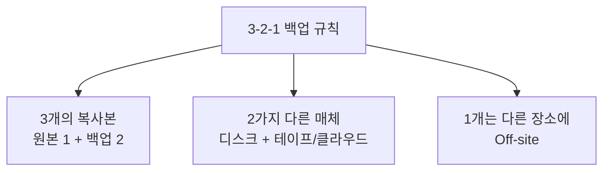
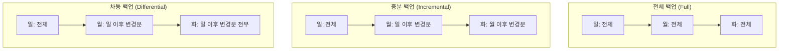
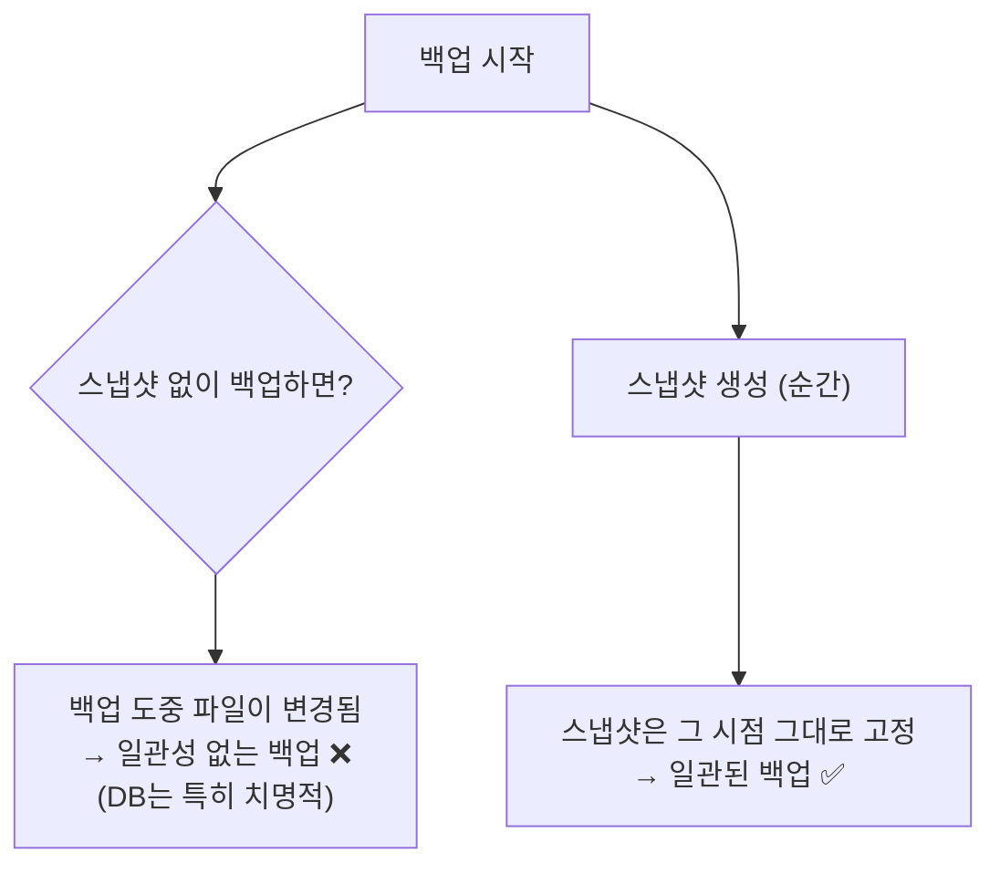
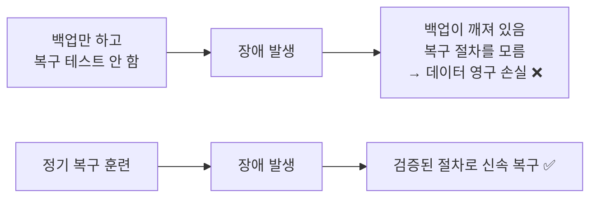

## 033. 시스템 백업과 복구

### 1. 백업의 원칙 — 3-2-1 규칙



| 규칙 | 이유 |
| --- | --- |
| **3개의 복사본** | 백업 하나가 손상돼도 다른 하나가 남습니다 |
| **2가지 다른 매체** | 같은 종류 매체는 **동일한 결함을 공유**할 수 있습니다 |
| **1개는 다른 장소에** | **화재·침수·도난** 시 같은 건물의 백업은 함께 사라집니다 |

> **백업의 목적은 "복사본을 만드는 것"이 아니라 "복구하는 것"** 입니다.  
> **복구 테스트를 해 보지 않은 백업은 백업이 아닙니다.**  
> 실제로 복구 시점에야 백업이 깨져 있었다는 사실을 알게 되는 사고가 매우 흔합니다.

---

### 2. 백업 방식의 종류



| 방식 | 백업 대상 | 백업 시간 | 용량 | **복구 시 필요한 것** |
| --- | --- | --- | --- | --- |
| **전체 (Full)** | **모든 데이터** | 김 | 큼 | **전체 백업 1개** ✅ |
| **증분 (Incremental)** | **마지막 백업 이후** 변경분 | **가장 짧음** | **가장 작음** | **전체 + 모든 증분** ❗ |
| **차등 (Differential)** | **마지막 전체 백업 이후** 변경분 | 중간 | 중간 | **전체 + 마지막 차등** |

#### 증분과 차등의 차이 (시험 단골)

수요일에 장애가 발생했다고 가정해 봅시다.

```
[증분 백업]
일(전체) → 월(증분) → 화(증분) → 수(장애)
복구 시 : 일 + 월 + 화  → 3개 모두 필요 ❗
          하나라도 손상되면 이후 복구 불가

[차등 백업]
일(전체) → 월(차등) → 화(차등) → 수(장애)
복구 시 : 일 + 화  → 2개만 필요 ✅
          중간 것이 손상돼도 문제없음
```

| 비교 | 증분 | 차등 |
| --- | --- | --- |
| 백업 속도 | **빠름** ✅ | 보통 |
| 백업 용량 | **작음** ✅ | 점점 커짐 |
| **복구 속도** | 느림 ❌ | **빠름** ✅ |
| **복구 안정성** | 낮음 (모두 필요) ❌ | **높음** ✅ |

> **선택 기준**  
> 백업 시간·용량이 중요하면 **증분**,  
> **빠르고 안전한 복구**가 중요하면 **차등**을 선택합니다.  
> 실무에서는 **주 1회 전체 + 매일 차등** 조합을 많이 씁니다.

---

### 3. `tar` 를 이용한 백업

#### 전체 백업

```bash
# 시스템 전체 백업 (제외 디렉터리 지정 필수) ⭐
$ sudo tar czpvf /backup/full-$(date +%F).tar.gz \
    --exclude=/proc --exclude=/sys --exclude=/dev \
    --exclude=/tmp --exclude=/run --exclude=/mnt \
    --exclude=/media --exclude=/backup \
    --exclude=/var/cache \
    /

# 옵션 설명
#  c: 생성  z: gzip  p: 권한 유지 ⭐  v: 상세  f: 파일명
```

> **`/proc`, `/sys`, `/dev`를 반드시 제외**해야 합니다.  
> 이들은 **가상 파일 시스템**이라 백업할 의미가 없고,  
> `/proc`을 백업하려 하면 **무한 루프에 빠지거나 오류**가 발생합니다.
>
> **`-p`(권한 유지) 옵션**을 빠뜨리면 복원 시 **모든 파일 권한이 망가집니다.**

#### 증분 백업 — `--listed-incremental`

```bash
# 전체 백업 (스냅샷 파일 생성)
$ sudo tar czpf /backup/full.tar.gz \
    --listed-incremental=/backup/snapshot.snar /data

# 증분 백업 (같은 스냅샷 파일 사용) ⭐
$ sudo tar czpf /backup/inc-$(date +%F).tar.gz \
    --listed-incremental=/backup/snapshot.snar /data

# 복원 (반드시 순서대로) ⭐
$ sudo tar xzpf /backup/full.tar.gz -C /restore --listed-incremental=/dev/null
$ sudo tar xzpf /backup/inc-2026-02-04.tar.gz -C /restore --listed-incremental=/dev/null
```

> **스냅샷 파일(`.snar`)** 이 "무엇이 바뀌었는지"를 기억합니다.  
> 이 파일이 없어지면 증분 백업 체인이 끊기므로 **함께 백업**해야 합니다.

#### 복원

```bash
# 목록 먼저 확인 (필수) ⭐
$ tar tzvf /backup/full.tar.gz | head -20

# 전체 복원
$ sudo tar xzpvf /backup/full.tar.gz -C /restore

# 특정 파일만 복원
$ sudo tar xzpvf /backup/full.tar.gz -C /restore etc/httpd/conf/httpd.conf

# 루트에 직접 복원 (매우 주의)
$ sudo tar xzpvf /backup/full.tar.gz -C / --numeric-owner
#                                          └── UID/GID를 숫자 그대로 복원 ⭐
```

> **`--numeric-owner`가 필요한 이유**  
> 다른 시스템에 복원할 때, **같은 이름의 사용자가 다른 UID**를 가질 수 있습니다.  
> 이 옵션을 쓰면 **이름이 아닌 숫자 UID/GID를 그대로** 복원하여 일관성이 유지됩니다.

---

### 4. `rsync` 를 이용한 백업

**변경분만 전송**하므로 반복 백업에 압도적으로 유리합니다.

```bash
# 기본 백업
$ sudo rsync -avz --delete /data/ /backup/data/

# 원격 서버로
$ sudo rsync -avz -e ssh /data/ backup@192.168.0.50:/backup/data/

# ❗실행 전 반드시 확인 ⭐
$ sudo rsync -avzn --delete /data/ /backup/data/

# 제외 목록
$ sudo rsync -avz --exclude-from=/etc/backup-exclude.txt /data/ /backup/
```

#### 스냅샷 방식 백업 (하드 링크 활용) — 실무 고급 기법

```bash
#!/bin/bash
# 매일 실행하면 날짜별 스냅샷이 쌓이되, 변경분만 용량을 차지합니다
TODAY=$(date +%F)
YESTERDAY=$(date -d yesterday +%F)

rsync -a --delete \
      --link-dest=/backup/$YESTERDAY \
      /data/ /backup/$TODAY/
```


> **`--link-dest`의 마법**  
> 변경되지 않은 파일은 **하드 링크로 연결**되어 **디스크 공간을 추가로 쓰지 않습니다.**  
> 그런데 각 날짜 디렉터리는 **완전한 전체 백업처럼 보입니다.**  
> 증분 백업의 용량 효율과 전체 백업의 복구 편의성을 동시에 얻는 방법입니다.

---

### 5. `dd` — 디스크 이미지 백업

```bash
# 파티션 전체를 이미지로
$ sudo dd if=/dev/sda1 of=/backup/sda1.img bs=4M status=progress

# 압축하며 백업
$ sudo dd if=/dev/sda bs=4M status=progress | gzip > /backup/sda.img.gz

# 복원 (❗대상 장치를 절대 틀리면 안 됨)
$ sudo dd if=/backup/sda1.img of=/dev/sda1 bs=4M status=progress
$ gunzip -c /backup/sda.img.gz | sudo dd of=/dev/sda bs=4M

# MBR만 백업 (512바이트) ⭐
$ sudo dd if=/dev/sda of=/backup/mbr.img bs=512 count=1

# MBR 복원
$ sudo dd if=/backup/mbr.img of=/dev/sda bs=512 count=1
# 파티션 테이블 제외하고 부트로더만 복원하려면
$ sudo dd if=/backup/mbr.img of=/dev/sda bs=446 count=1
```

| 옵션 | 의미 |
| --- | --- |
| **`if=`** | **입력 파일 (input file)** |
| **`of=`** | **출력 파일 (output file)** |
| **`bs=`** | 블록 크기 (클수록 빠름, 보통 4M) |
| `count=` | 복사할 블록 수 |
| `status=progress` | 진행률 표시 |
| `conv=noerror,sync` | 오류가 나도 계속 진행 (손상 디스크 복구 시) |

> **⚠️ `dd`는 "Disk Destroyer"라는 별명이 있습니다.**  
> `if`와 `of`를 **거꾸로 쓰면 원본이 백업 파일로 덮어써집니다.**  
> 실행 전 반드시 **`lsblk`로 장치를 두 번 확인**하세요.  
> 되돌릴 방법이 없습니다.

---

### 6. LVM 스냅샷을 이용한 무중단 백업

**백업 중 데이터가 변경되는 문제**를 해결합니다.



```bash
# ① 스냅샷 생성 (거의 즉시 완료)
$ sudo lvcreate -L 5G -s -n data_snap /dev/vg_data/lv_data

# ② 스냅샷 마운트
$ sudo mkdir -p /mnt/snap
$ sudo mount -o ro,nouuid /dev/vg_data/data_snap /mnt/snap

# ③ 백업
$ sudo tar czpf /backup/data-$(date +%F).tar.gz -C /mnt/snap .

# ④ 정리
$ sudo umount /mnt/snap
$ sudo lvremove -f /dev/vg_data/data_snap
```

> **데이터베이스 백업에 특히 중요합니다.**  
> DB 파일을 그냥 복사하면 **트랜잭션 도중의 상태가 섞여** 복원해도 손상된 DB가 됩니다.  
> 스냅샷은 **특정 시점의 일관된 상태**를 보장합니다.

---

### 7. 전용 백업 도구

#### `dump` / `restore` (ext 계열 전용)

```bash
$ sudo dnf install dump

# 레벨 0 = 전체 백업
$ sudo dump -0u -f /backup/home.dump /home
#           │└── u: /etc/dumpdates 에 기록 ⭐
#           └─── 0~9 레벨 (0=전체, 1~9=증분)

# 레벨 1 = 레벨 0 이후 변경분
$ sudo dump -1u -f /backup/home-1.dump /home

# 복원
$ sudo restore -rf /backup/home.dump      # 전체 복원
$ sudo restore -if /backup/home.dump      # 대화형 복원 ⭐
restore > ls
restore > add etc/passwd
restore > extract
restore > quit

# 백업 이력 확인
$ cat /etc/dumpdates
```

| 레벨 | 의미 |
| --- | --- |
| **0** | **전체 백업** |
| **1~9** | **자기보다 낮은 레벨 이후**의 변경분 |

> **`dump`는 XFS에서 사용할 수 없습니다.**  
> Rocky/RHEL 기본이 XFS이므로, XFS에서는 **`xfsdump`/`xfsrestore`** 를 씁니다.
> ```bash
> $ sudo xfsdump -l 0 -f /backup/data.xfsdump /data
> $ sudo xfsrestore -f /backup/data.xfsdump /restore
> ```

#### `cpio`

```bash
# 백업
$ find /home -depth -print | cpio -ovcB > /backup/home.cpio

# 복원
$ cpio -idmv < /backup/home.cpio
#      │││└── v: 상세
#      ││└─── m: 수정 시각 유지
#      │└──── d: 디렉터리 생성
#      └───── i: 추출 모드
```

| 모드 | 의미 |
| --- | --- |
| **`-o`** | **생성 (output)** |
| **`-i`** | **추출 (input)** |
| `-p` | 복사 (pass-through) |

#### 기타 도구

| 도구 | 특징 |
| --- | --- |
| **`rsnapshot`** | rsync + 하드 링크 기반 자동 스냅샷 백업 |
| **`Bacula` / `Amanda`** | 엔터프라이즈급 중앙 백업 시스템 |
| **`Borg` / `restic`** | **중복 제거 + 암호화** 지원 현대적 백업 도구 |
| `Timeshift` | 데스크톱용 시스템 스냅샷 |

---

### 8. 백업 자동화 스크립트

```bash
$ sudo vi /usr/local/bin/backup.sh
```

```bash
#!/bin/bash
set -euo pipefail

BACKUP_DIR="/backup"
SOURCE_DIRS="/etc /home /var/www"
DATE=$(date +%F)
RETENTION=30
LOG="/var/log/backup.log"

log() { echo "[$(date '+%F %T')] $*" | tee -a "$LOG"; }

log "===== 백업 시작 ====="

# 디스크 여유 공간 확인 (백업 전 필수) ⭐
AVAIL=$(df -P "$BACKUP_DIR" | awk 'NR==2 {print $4}')
if [ "$AVAIL" -lt 10485760 ]; then       # 10GB 미만
    log "ERROR: 백업 공간 부족 (${AVAIL}KB)"
    logger -p user.crit "Backup failed: insufficient space"
    exit 1
fi

# 백업 실행
if tar czpf "$BACKUP_DIR/backup-$DATE.tar.gz" \
        --exclude='*.log' --exclude='*/cache/*' \
        $SOURCE_DIRS 2>>"$LOG"; then
    SIZE=$(du -h "$BACKUP_DIR/backup-$DATE.tar.gz" | cut -f1)
    log "백업 성공: backup-$DATE.tar.gz ($SIZE)"
else
    log "ERROR: 백업 실패"
    logger -p user.crit "Backup failed"
    exit 1
fi

# 무결성 검증 ⭐
if tar tzf "$BACKUP_DIR/backup-$DATE.tar.gz" > /dev/null 2>&1; then
    log "무결성 검증 통과"
else
    log "ERROR: 백업 파일 손상"
    exit 1
fi

# 오래된 백업 삭제
DELETED=$(find "$BACKUP_DIR" -name "backup-*.tar.gz" -mtime +$RETENTION -print -delete | wc -l)
log "오래된 백업 ${DELETED}개 삭제"

log "===== 백업 완료 ====="
```

```bash
$ sudo chmod +x /usr/local/bin/backup.sh

# cron 등록 — 매일 새벽 3시
$ sudo crontab -e
0 3 * * * /usr/local/bin/backup.sh
```

> **좋은 백업 스크립트의 조건**  
> ① 실행 전 **공간 확인** ② 실패 시 **명확한 종료 코드와 알림**  
> ③ 백업 후 **무결성 검증** ④ **보관 기간 관리** ⑤ **로그 기록**

---

### 9. 시스템 복구 시나리오

#### ① 부팅 불가 — 응급 모드

```
GRUB 메뉴에서 [e] → linux 줄 끝에 추가 → Ctrl+X

  rd.break                       ← initramfs 단계
  systemd.unit=rescue.target     ← 단일 사용자
  systemd.unit=emergency.target  ← 최소 환경
```

```bash
# rd.break 진입 후 (root 비밀번호 초기화 등)
switch_root:/# mount -o remount,rw /sysroot
switch_root:/# chroot /sysroot
sh-4.4# passwd root
sh-4.4# touch /.autorelabel       # ❗SELinux 라벨 재설정 (빠뜨리면 부팅 실패)
sh-4.4# exit
switch_root:/# exit
```

#### ② `/etc/fstab` 오류로 부팅 실패

```bash
# 응급 모드에서
$ mount -o remount,rw /
$ vi /etc/fstab              # 문제 줄 앞에 # 추가하거나 nofail 옵션 추가
$ reboot
```

#### ③ 부트로더 손상 — Live CD/USB로 복구

```bash
# Live 환경으로 부팅 후
$ sudo mount /dev/sda2 /mnt              # 루트 파티션
$ sudo mount /dev/sda1 /mnt/boot         # 부트 파티션
$ sudo mount --bind /dev  /mnt/dev
$ sudo mount --bind /proc /mnt/proc
$ sudo mount --bind /sys  /mnt/sys

$ sudo chroot /mnt
# grub2-install /dev/sda
# grub2-mkconfig -o /boot/grub2/grub.cfg
# exit

$ sudo umount -R /mnt && sudo reboot
```

> **`--bind` 마운트가 필요한 이유**  
> `chroot` 후에도 **장치·프로세스·커널 정보에 접근**해야 `grub2-install`이 동작합니다.  
> 이 세 개를 빠뜨리면 오류가 발생합니다.

#### ④ 파일 시스템 손상

```bash
$ sudo umount /dev/sdb1
$ sudo fsck -y /dev/sdb1              # ext 계열
$ sudo xfs_repair /dev/sdb1           # XFS
$ sudo xfs_repair -n /dev/sdb1        # 검사만
```

#### ⑤ 실수로 삭제한 파일 복구

```bash
# 삭제됐지만 프로세스가 아직 열고 있다면 복구 가능 ⭐
$ sudo lsof | grep deleted
httpd 1203 apache 5w REG 8,3 1024 12345 /var/log/app.log (deleted)

$ sudo cp /proc/1203/fd/5 /restore/app.log      # 복구!

# ext 계열 복구 도구
$ sudo dnf install extundelete testdisk
$ sudo extundelete /dev/sdb1 --restore-file /home/user/important.txt
```

> **파일을 실수로 지웠다면 가장 먼저 할 일은 "그 파일 시스템에 아무것도 쓰지 않는 것"** 입니다.  
> 새 데이터가 기록되면 삭제된 데이터가 덮어써져 복구가 불가능해집니다.  
> 즉시 **언마운트하거나 읽기 전용으로 재마운트**해야 합니다.

---

### 10. 복구 훈련의 중요성



**정기적으로 확인해야 할 것**

- 백업 파일이 **실제로 열리는가** (`tar tzf`)
- 복원한 데이터가 **정상 동작하는가** (DB는 실제로 기동해 보기)
- 복구에 **얼마나 걸리는가** (RTO 측정)
- 복구 절차 문서가 **최신인가**

| 지표 | 의미 |
| --- | --- |
| **RTO** (Recovery Time Objective) | **목표 복구 시간** — 얼마나 빨리 복구할 것인가 |
| **RPO** (Recovery Point Objective) | **목표 복구 시점** — 얼마만큼의 데이터 손실을 감수할 것인가 |

> **RPO가 24시간이면** 하루치 데이터 손실을 감수하겠다는 뜻이므로 **일 1회 백업**이면 됩니다.  
> **RPO가 1시간이면** 시간당 백업이나 실시간 복제가 필요합니다.

---

### 시험 포인트 정리

| 항목 | 핵심 |
| --- | --- |
| 백업 규칙 | **3-2-1 (복사본 3, 매체 2, 원격 1)** |
| **전체 백업** | 모든 데이터, 복구는 **1개만 필요** |
| **증분 백업** | **마지막 백업 이후** 변경분, 복구 시 **전부 필요** |
| **차등 백업** | **마지막 전체 백업 이후** 변경분, 복구 시 **2개** |
| 백업 속도 | **증분 > 차등 > 전체** |
| **복구 편의** | **전체 > 차등 > 증분** |
| tar 권한 유지 | **`-p`** |
| tar 백업 제외 | **`/proc`, `/sys`, `/dev`** |
| tar 증분 | **`--listed-incremental`** |
| 다른 시스템 복원 | **`--numeric-owner`** |
| rsync 변경분만 | **`-a` + `--link-dest`** |
| **`dd`** | **`if=`(입력) `of=`(출력)** — 순서 주의 |
| MBR 백업 | **`dd bs=512 count=1`** |
| 무중단 일관 백업 | **LVM 스냅샷** |
| **`dump` 레벨 0** | **전체 백업** |
| dump 이력 파일 | **`/etc/dumpdates`** |
| XFS 백업 도구 | **`xfsdump` / `xfsrestore`** |
| cpio 생성/추출 | **`-o` / `-i`** |
| 응급 모드 진입 | **`rd.break`**, `rescue.target` |
| root 비번 초기화 후 | **`touch /.autorelabel`** |
| chroot 복구 시 | **`/dev`, `/proc`, `/sys` bind 마운트** |
| 삭제 파일 복구 | **`lsof \| grep deleted`** → `/proc/PID/fd/` |
| RTO / RPO | **복구 시간 / 복구 시점 목표** |

---

### 한 줄 정리

백업은 **3-2-1 규칙**을 지키고 **전체·증분·차등**의 특성(증분은 빠르지만 복구 시 전부 필요, 차등은 복구가 안전)을 이해해야 하며,  
`tar`는 **`-p`(권한)와 `/proc`·`/sys`·`/dev` 제외**가 필수, `dd`는 **`if`/`of` 순서를 절대 틀리면 안 되고**,  
**복구 테스트를 해 보지 않은 백업은 백업이 아닙니다.**
