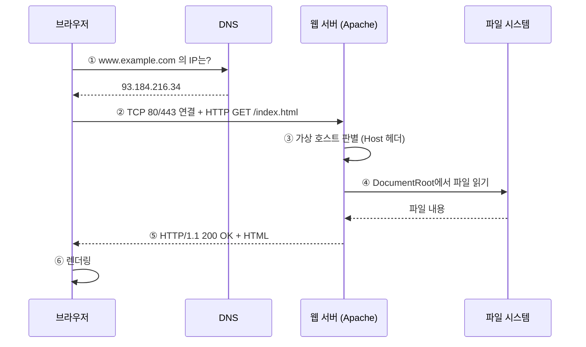
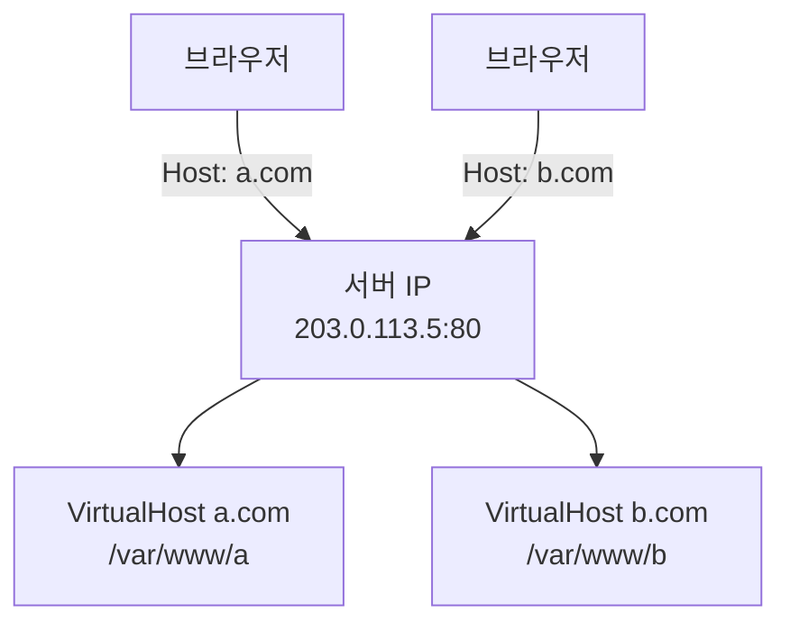

## 034. 웹 서비스 - Apache

### 1. 웹 서버의 동작 원리



| 단계 | 핵심 |
| --- | --- |
| ② | **정적 파일**은 바로 응답, **동적 요청**은 PHP·WAS로 전달 |
| ③ | 한 IP에 여러 사이트가 있으면 **Host 헤더**로 구분 |

---

### 2. Apache 설치와 기본 관리

```bash
# 설치
$ sudo dnf install httpd                  # RHEL/Rocky
$ sudo apt install apache2                # Debian/Ubuntu

# 서비스 관리
$ sudo systemctl enable --now httpd
$ systemctl status httpd
$ sudo systemctl reload httpd             # 설정만 반영 (무중단) ⭐
$ sudo apachectl configtest               # 설정 문법 검사 ⭐
Syntax OK

# 방화벽
$ sudo firewall-cmd --add-service=http --add-service=https --permanent
$ sudo firewall-cmd --reload
```

> **설정 변경 후에는 반드시 `apachectl configtest`(또는 `httpd -t`)로 검사**한 뒤 `reload` 하세요.  
> 문법 오류가 있으면 **재시작 시 서비스가 아예 뜨지 않습니다.**

#### 배포판별 구조 차이 (시험 출제)

| 항목 | **RHEL/Rocky** | **Debian/Ubuntu** |
| --- | --- | --- |
| 패키지·서비스명 | **`httpd`** | **`apache2`** |
| 주 설정 파일 | **`/etc/httpd/conf/httpd.conf`** | **`/etc/apache2/apache2.conf`** |
| 추가 설정 | `/etc/httpd/conf.d/*.conf` | `/etc/apache2/sites-available/` |
| 문서 루트 | **`/var/www/html`** | `/var/www/html` |
| 로그 | `/var/log/httpd/` | `/var/log/apache2/` |
| 실행 사용자 | **`apache`** | **`www-data`** |
| 모듈 관리 | `/etc/httpd/conf.modules.d/` | **`a2enmod` / `a2dismod`** |
| 사이트 활성화 | 파일 배치 | **`a2ensite` / `a2dissite`** |

---

### 3. 주요 설정 지시자

```bash
$ sudo vi /etc/httpd/conf/httpd.conf
```

```apache
ServerRoot "/etc/httpd"              # 설정 기준 디렉터리
Listen 80                            # 수신 포트 ⭐
ServerName www.example.com:80        # 서버 이름
ServerAdmin admin@example.com        # 관리자 메일
DocumentRoot "/var/www/html"         # 문서 루트 ⭐
DirectoryIndex index.html index.php  # 기본 문서 ⭐
User apache                          # 실행 사용자 ⭐
Group apache
Timeout 60
KeepAlive On                         # 연결 재사용 ⭐
MaxKeepAliveRequests 100
KeepAliveTimeout 5
ServerTokens Prod                    # 버전 정보 숨김 (보안) ⭐
ServerSignature Off
```

| 지시자 | 의미 |
| --- | --- |
| **`ServerRoot`** | Apache 설정·모듈의 기준 경로 |
| **`Listen`** | **수신할 포트/IP** |
| **`DocumentRoot`** | **웹 문서가 위치한 디렉터리** ⭐ |
| **`DirectoryIndex`** | **디렉터리 요청 시 보여줄 기본 파일** |
| **`ServerName`** | 서버의 정식 이름 |
| **`User` / `Group`** | **자식 프로세스 실행 계정** |
| **`KeepAlive`** | 하나의 연결로 여러 요청 처리 |
| **`ServerTokens`** | 응답 헤더의 정보 노출 수준 |
| `ErrorLog` / `CustomLog` | 로그 파일 경로 |

#### `KeepAlive` — 왜 성능에 중요한가


> 웹 페이지 하나에는 보통 **수십 개의 파일**이 포함됩니다.  
> 매번 TCP 연결을 새로 맺으면 **핸드셰이크 지연이 누적**됩니다.  
> 다만 `KeepAliveTimeout`이 너무 길면 **유휴 연결이 자원을 점유**하므로 5초 내외가 적당합니다.

#### `ServerTokens` — 정보 노출 최소화

```bash
$ curl -I http://localhost | grep Server
Server: Apache/2.4.37 (Rocky Linux) OpenSSL/1.1.1k PHP/7.4     ← ❗너무 많은 정보

# ServerTokens Prod 설정 후
Server: Apache                                                  ← ✅
```

> 버전 정보가 노출되면 공격자가 **해당 버전의 알려진 취약점**을 바로 시도할 수 있습니다.  
> **`ServerTokens Prod` + `ServerSignature Off`** 는 기본 보안 설정입니다.

---

### 4. `<Directory>` 블록과 접근 제어

```apache
<Directory "/var/www/html">
    Options Indexes FollowSymLinks
    AllowOverride None
    Require all granted
</Directory>
```

#### `Options` 지시자

| 옵션 | 의미 |
| --- | --- |
| **`Indexes`** | **기본 문서가 없으면 파일 목록 표시** ❗보안상 끄는 것이 좋음 |
| **`FollowSymLinks`** | 심볼릭 링크를 따라감 |
| `SymLinksIfOwnerMatch` | 소유자가 같을 때만 링크 따라감 (더 안전) |
| `ExecCGI` | CGI 스크립트 실행 허용 |
| `MultiViews` | 콘텐츠 협상 |
| **`None`** | **모두 비활성화** |
| `All` | MultiViews 제외 전부 |

> **`Indexes`를 끄는 이유**  
> `index.html`이 없는 디렉터리에 접근하면 **파일 목록이 그대로 노출**됩니다.  
> 백업 파일·설정 파일이 그대로 보이는 사고로 이어집니다.
> ```apache
> Options -Indexes
> ```

#### `AllowOverride` — `.htaccess` 허용 여부

| 값 | 의미 |
| --- | --- |
| **`None`** | **`.htaccess` 무시** (성능 좋음, 권장) ⭐ |
| `All` | 모든 지시자 허용 |
| `AuthConfig` | 인증 관련만 허용 |
| `FileInfo`, `Limit`, `Options` | 해당 범주만 |

> **`AllowOverride None`이 권장되는 이유**  
> `.htaccess`를 허용하면 Apache가 **요청마다 모든 상위 디렉터리에서 `.htaccess`를 찾습니다.**  
> 성능이 떨어지고, 보안 정책이 분산되어 관리가 어려워집니다.  
> 가능하면 **`<Directory>` 블록에 직접 설정**하는 것이 좋습니다.

#### 접근 제어 (2.4 문법)

```apache
# 모두 허용
Require all granted

# 모두 차단
Require all denied

# 특정 IP만
Require ip 192.168.0.0/24
Require ip 203.0.113.5

# 인증된 사용자만
Require valid-user

# 조합
<RequireAll>
    Require ip 192.168.0.0/24
    Require not ip 192.168.0.99
</RequireAll>
```

> **Apache 2.2 → 2.4 문법 변경 (시험 출제)**
> ```apache
> # 2.2 (구 문법)
> Order allow,deny
> Allow from 192.168.0.0/24
>
> # 2.4 (현 문법) ⭐
> Require ip 192.168.0.0/24
> ```

---

### 5. 가상 호스트 (Virtual Host)

**하나의 서버에서 여러 웹사이트를 운영**하는 기능입니다.



#### 이름 기반 vs IP 기반

| 구분 | **이름 기반 (Name-based)** | **IP 기반 (IP-based)** |
| --- | --- | --- |
| 구분 기준 | **HTTP `Host` 헤더** | **IP 주소** |
| 필요한 IP | **1개** | 사이트 수만큼 |
| 비용 | 저렴 ✅ | 비쌈 |
| SSL | SNI 필요 | 제한 없음 |
| 사용 빈도 | **대부분** | 특수한 경우 |

```bash
$ sudo vi /etc/httpd/conf.d/vhost.conf
```

```apache
<VirtualHost *:80>
    ServerName www.example.com
    ServerAlias example.com
    DocumentRoot /var/www/example
    ErrorLog logs/example-error_log
    CustomLog logs/example-access_log combined

    <Directory /var/www/example>
        Options -Indexes +FollowSymLinks
        AllowOverride None
        Require all granted
    </Directory>
</VirtualHost>

<VirtualHost *:80>
    ServerName blog.example.com
    DocumentRoot /var/www/blog
    <Directory /var/www/blog>
        Require all granted
    </Directory>
</VirtualHost>
```

```bash
$ sudo mkdir -p /var/www/{example,blog}
$ sudo chown -R apache:apache /var/www/example /var/www/blog
$ sudo restorecon -Rv /var/www              # SELinux 컨텍스트 ⭐
$ sudo apachectl configtest && sudo systemctl reload httpd
```

> **주의** : 가상 호스트를 하나라도 정의하면 **모든 요청이 가상 호스트로 처리**됩니다.  
> 어느 것과도 매칭되지 않으면 **첫 번째 가상 호스트**가 기본으로 사용됩니다.  
> 그래서 보통 **기본(catch-all) 가상 호스트를 맨 앞에** 둡니다.

---

### 6. SSL/TLS (HTTPS) 설정

```bash
$ sudo dnf install mod_ssl
$ sudo vi /etc/httpd/conf.d/ssl-vhost.conf
```

```apache
<VirtualHost *:443>
    ServerName www.example.com
    DocumentRoot /var/www/example

    SSLEngine on
    SSLCertificateFile      /etc/pki/tls/certs/example.crt
    SSLCertificateKeyFile   /etc/pki/tls/private/example.key
    SSLCertificateChainFile /etc/pki/tls/certs/chain.crt

    SSLProtocol -all +TLSv1.2 +TLSv1.3        # 구버전 프로토콜 차단 ⭐
    SSLCipherSuite HIGH:!aNULL:!MD5
    SSLHonorCipherOrder on

    Header always set Strict-Transport-Security "max-age=31536000"
</VirtualHost>

# HTTP → HTTPS 리다이렉트 ⭐
<VirtualHost *:80>
    ServerName www.example.com
    Redirect permanent / https://www.example.com/
</VirtualHost>
```

```bash
# Let's Encrypt 무료 인증서 (실무에서 가장 많이 사용)
$ sudo dnf install certbot python3-certbot-apache
$ sudo certbot --apache -d www.example.com -d example.com
$ sudo certbot renew --dry-run                # 자동 갱신 테스트
```

#### 인증서 관련 파일

| 파일 | 내용 |
| --- | --- |
| **`.key`** | **개인키** — 절대 유출되면 안 됨 (권한 **600**) ⭐ |
| **`.crt` / `.pem`** | 인증서 (공개키 + 서명) |
| `.csr` | 인증서 서명 요청 |
| `chain.crt` | 중간 인증서 |

```bash
# 자체 서명 인증서 생성 (테스트용)
$ sudo openssl req -x509 -nodes -days 365 -newkey rsa:2048 \
    -keyout /etc/pki/tls/private/test.key \
    -out /etc/pki/tls/certs/test.crt

# 인증서 확인
$ openssl x509 -in /etc/pki/tls/certs/example.crt -text -noout
$ openssl s_client -connect www.example.com:443 -servername www.example.com
```

> **SNI (Server Name Indication)**  
> 예전에는 IP 하나에 HTTPS 사이트 하나만 가능했습니다.  
> TLS 핸드셰이크는 **Host 헤더를 읽기 전에** 일어나기 때문입니다.  
> SNI는 핸드셰이크 단계에서 **도메인 이름을 미리 알려 주어**,  
> **하나의 IP로 여러 HTTPS 사이트**를 운영할 수 있게 합니다.

---

### 7. MPM — 요청 처리 방식

Apache가 **동시 요청을 어떻게 처리할지** 결정하는 모듈입니다.

| MPM | 방식 | 특징 |
| --- | --- | --- |
| **`prefork`** | **프로세스 기반** (요청당 프로세스) | 안정적, **메모리 많이 사용**, `mod_php`와 호환 |
| **`worker`** | **프로세스 + 스레드** | 메모리 효율 좋음 |
| **`event`** | worker + **KeepAlive 연결 분리 처리** | **현재 권장**, 동시 접속에 강함 ⭐ |

```bash
# 현재 MPM 확인
$ httpd -V | grep MPM
Server MPM:     event

# 변경
$ sudo vi /etc/httpd/conf.modules.d/00-mpm.conf
# LoadModule mpm_prefork_module modules/mod_mpm_prefork.so
LoadModule mpm_event_module modules/mod_mpm_event.so
```

```apache
<IfModule mpm_event_module>
    StartServers             4
    MinSpareThreads         25
    MaxSpareThreads         75
    ThreadsPerChild         25
    MaxRequestWorkers      400        # 동시 처리 최대 수 ⭐
    MaxConnectionsPerChild   0
</IfModule>
```

> **`prefork`를 쓰는 이유가 남아 있는 경우**  
> `mod_php`는 스레드 안전하지 않아 **`prefork`에서만** 사용할 수 있습니다.  
> 현대적인 구성은 **`event` MPM + PHP-FPM** 조합을 씁니다. (메모리 효율이 훨씬 좋음)

---

### 8. 주요 모듈

```bash
# 적재된 모듈 확인
$ httpd -M | head -10
$ apache2ctl -M                     # Debian

# Debian 계열 모듈 관리
$ sudo a2enmod rewrite ssl headers
$ sudo a2dismod status
$ sudo systemctl reload apache2
```

| 모듈 | 기능 |
| --- | --- |
| **`mod_ssl`** | HTTPS |
| **`mod_rewrite`** | **URL 재작성** |
| `mod_headers` | HTTP 헤더 조작 |
| **`mod_proxy`** | **리버스 프록시** |
| `mod_deflate` | 응답 압축 (전송량 감소) |
| `mod_security` | 웹 방화벽(WAF) |
| `mod_status` | 서버 상태 페이지 |

#### `mod_rewrite` 예시

```apache
RewriteEngine On

# HTTP → HTTPS
RewriteCond %{HTTPS} off
RewriteRule ^(.*)$ https://%{HTTP_HOST}%{REQUEST_URI} [L,R=301]

# www 없는 주소를 www로 통일
RewriteCond %{HTTP_HOST} ^example\.com$ [NC]
RewriteRule ^(.*)$ https://www.example.com/$1 [L,R=301]
```

#### 리버스 프록시 (WAS 연동)

```apache
<VirtualHost *:80>
    ServerName app.example.com
    ProxyPreserveHost On
    ProxyPass        / http://127.0.0.1:8080/
    ProxyPassReverse / http://127.0.0.1:8080/
</VirtualHost>
```

```bash
# ❗SELinux가 기본적으로 프록시 연결을 차단합니다 ⭐
$ sudo setsebool -P httpd_can_network_connect on
```

> **리버스 프록시 구성 시 가장 흔한 함정**입니다.  
> 설정은 맞는데 **503 오류**가 난다면 **SELinux Boolean**을 확인하세요.

---

### 9. 로그 관리

```bash
$ ls /var/log/httpd/
access_log  error_log
```

```apache
LogFormat "%h %l %u %t \"%r\" %>s %b \"%{Referer}i\" \"%{User-Agent}i\"" combined
CustomLog logs/access_log combined
ErrorLog  logs/error_log
LogLevel warn
```

| 포맷 | 의미 |
| --- | --- |
| `%h` | 클라이언트 IP |
| `%u` | 인증된 사용자 |
| `%t` | 시각 |
| `%r` | 요청 라인 (`GET /index.html HTTP/1.1`) |
| **`%>s`** | **응답 상태 코드** |
| `%b` | 응답 바이트 수 |
| `%{Referer}i` | 유입 경로 |
| `%{User-Agent}i` | 브라우저 정보 |

```bash
# 로그 실시간 확인
$ sudo tail -f /var/log/httpd/access_log
$ sudo tail -f /var/log/httpd/error_log

# 접속 상위 IP ⭐
$ sudo awk '{print $1}' /var/log/httpd/access_log | sort | uniq -c | sort -rn | head

# 404 발생 경로
$ sudo awk '$9 == 404 {print $7}' /var/log/httpd/access_log | sort | uniq -c | sort -rn | head

# 상태 코드 분포
$ sudo awk '{print $9}' /var/log/httpd/access_log | sort | uniq -c | sort -rn
```

#### 주요 HTTP 상태 코드 (시험 출제)

| 코드 | 의미 |
| --- | --- |
| **200** | **OK — 정상** |
| 301 | 영구 이동 |
| 302 | 임시 이동 |
| 304 | Not Modified (캐시 사용) |
| **400** | Bad Request |
| **401** | **인증 필요** |
| **403** | **Forbidden — 권한 없음** ⭐ |
| **404** | **Not Found — 파일 없음** ⭐ |
| **500** | **Internal Server Error — 서버 내부 오류** ⭐ |
| **502** | Bad Gateway (백엔드 응답 이상) |
| **503** | Service Unavailable (서비스 과부하·중단) |

> **403 vs 404 구분**  
> **404** = 파일이 **없음** / **403** = 파일은 있는데 **권한이 없음**  
> 403이 나오면 **파일 권한, SELinux 컨텍스트, `Require` 설정**을 확인합니다.

---

### 10. Apache 문제 해결

| 증상 | 원인 | 확인 |
| --- | --- | --- |
| 서비스 시작 실패 | 설정 문법 오류 | **`apachectl configtest`** |
| **403 Forbidden** | 권한 / SELinux / `Require` | `ls -lZ`, `ausearch -m avc` |
| 404 Not Found | `DocumentRoot` 경로 오류 | 설정과 실제 경로 비교 |
| **503 (프록시 시)** | **SELinux Boolean** | `setsebool -P httpd_can_network_connect on` |
| 포트 충돌 | 다른 서비스가 80 사용 | `ss -tulnp \| grep :80` |
| 외부 접속 불가 | 방화벽 | `firewall-cmd --list-all` |

```bash
# 종합 진단 순서
$ sudo apachectl configtest                     # ① 설정
$ systemctl status httpd                        # ② 서비스
$ sudo ss -tulnp | grep httpd                   # ③ LISTEN
$ curl -I http://localhost                      # ④ 로컬 접속
$ sudo tail -20 /var/log/httpd/error_log        # ⑤ 에러 로그 ⭐
$ sudo firewall-cmd --list-all                  # ⑥ 방화벽
$ sudo ausearch -m avc -ts recent               # ⑦ SELinux
```

#### SELinux 관련 필수 지식

```bash
# 웹 문서 디렉터리의 올바른 컨텍스트
$ ls -Z /var/www/html/index.html
unconfined_u:object_r:httpd_sys_content_t:s0

# 다른 경로를 DocumentRoot로 쓸 때 ⭐
$ sudo semanage fcontext -a -t httpd_sys_content_t "/web(/.*)?"
$ sudo restorecon -Rv /web

# 비표준 포트 사용 시 ⭐
$ sudo semanage port -a -t http_port_t -p tcp 8888

# 자주 쓰는 Boolean
$ sudo setsebool -P httpd_can_network_connect on      # 외부 접속(프록시·DB)
$ sudo setsebool -P httpd_enable_homedirs on          # 홈 디렉터리 접근
$ sudo setsebool -P httpd_can_sendmail on             # 메일 발송
```

---

### 시험 포인트 정리

| 항목 | 핵심 |
| --- | --- |
| RHEL 패키지·서비스 | **`httpd`** |
| Debian 패키지·서비스 | **`apache2`** |
| RHEL 주 설정 파일 | **`/etc/httpd/conf/httpd.conf`** |
| 기본 문서 루트 | **`/var/www/html`** |
| 설정 문법 검사 | **`apachectl configtest`** / `httpd -t` |
| **`DocumentRoot`** | 웹 문서 디렉터리 |
| **`DirectoryIndex`** | 기본 표시 파일 |
| **`Listen`** | 수신 포트 |
| **`Options Indexes`** | **디렉터리 목록 노출** (보안상 끄기) |
| **`AllowOverride None`** | `.htaccess` 무시 (권장) |
| 2.4 접근 제어 | **`Require all granted`** |
| 2.2 접근 제어 | `Order allow,deny` |
| 가상 호스트 구분 | **`Host` 헤더 (이름 기반)** |
| HTTPS 포트 | **443** |
| HTTPS 모듈 | **`mod_ssl`** |
| 여러 HTTPS 사이트 | **SNI** |
| MPM 종류 | **prefork / worker / event** |
| `prefork` 특징 | 프로세스 기반, `mod_php` 호환 |
| **`event`** | **현재 권장** |
| URL 재작성 | **`mod_rewrite`** |
| 리버스 프록시 | **`mod_proxy`** + **SELinux Boolean** |
| 버전 숨김 | **`ServerTokens Prod`** |
| **403 / 404 / 500** | **권한 없음 / 없음 / 서버 오류** |
| 웹 문서 SELinux 타입 | **`httpd_sys_content_t`** |

---

### 한 줄 정리

Apache는 **RHEL에서 `httpd`(`/etc/httpd/conf/httpd.conf`)**, Debian에서 `apache2`로 동작하며,  
**`DocumentRoot`·`DirectoryIndex`·`VirtualHost`(Host 헤더 기반)** 가 핵심 설정이고,  
설정 변경 후에는 **`apachectl configtest` → `reload`**,  
403·503 오류는 **파일 권한과 SELinux(`httpd_sys_content_t`, `httpd_can_network_connect`)** 를 먼저 확인합니다.
