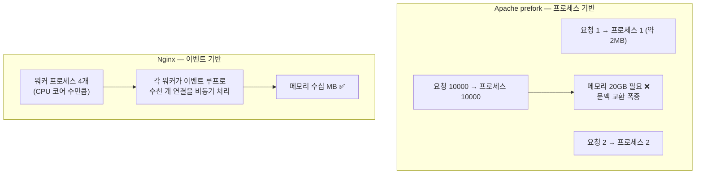
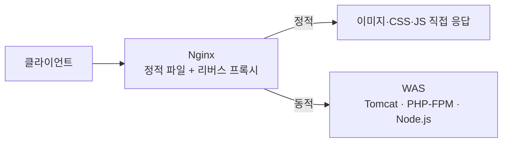
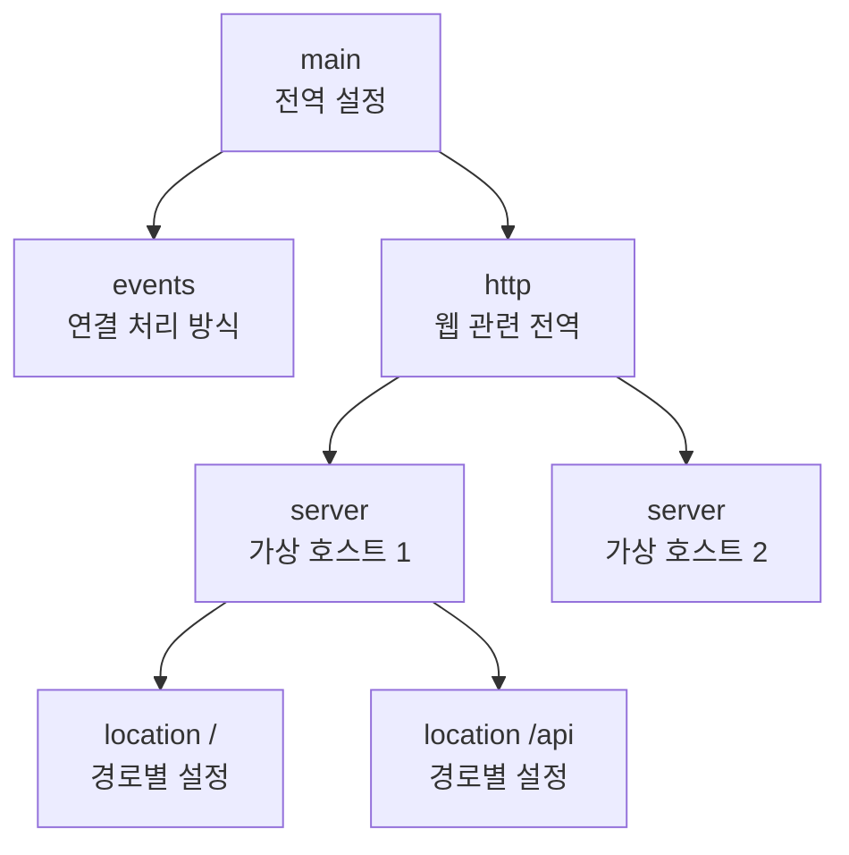
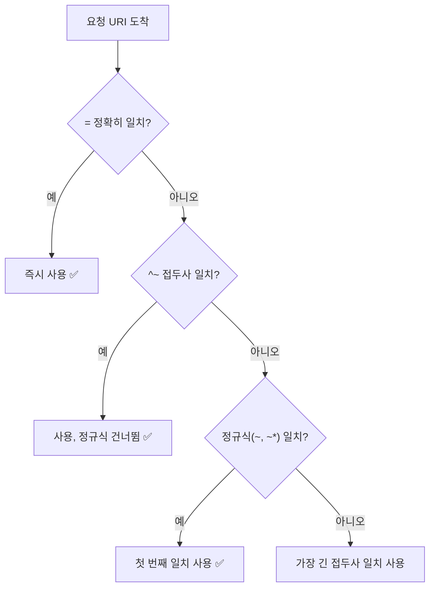
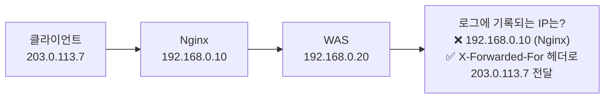

## 035. 웹 서비스 - Nginx

### 1. Nginx가 등장한 이유 — C10K 문제

2000년대 초, 웹 서버에는 **동시 접속 1만 개(C10K)** 를 처리하지 못하는 한계가 있었습니다.



| 구분 | **Apache (prefork)** | **Nginx** |
| --- | --- | --- |
| 처리 방식 | **프로세스/스레드 기반** | **이벤트 기반 (비동기)** |
| 연결당 비용 | 프로세스 하나 (**MB 단위**) | 이벤트 하나 (**KB 단위**) |
| 동시 접속 | 수백~수천 | **수만 이상** ⭐ |
| 정적 파일 | 보통 | **매우 빠름** ⭐ |
| 동적 처리 | 모듈 내장(`mod_php`) | **외부 위임(FastCGI)** |
| 설정 | `.htaccess` 지원 | **미지원** (중앙 설정만) |
| 모듈 | **동적 로드 가능** | 주로 **컴파일 시 포함** |

> **핵심 차이** : Apache는 **연결마다 자원을 할당**하고, Nginx는 **적은 워커가 이벤트를 돌려가며 처리**합니다.  
> 그래서 Nginx는 **정적 파일 서빙과 리버스 프록시**에 압도적으로 유리합니다.

#### 실무에서의 일반적인 조합



Nginx를 **앞단(프론트)** 에 두어 정적 파일을 처리하고,  
동적 요청만 뒤의 애플리케이션 서버로 넘기는 구조가 표준입니다.

---

### 2. 설치와 기본 관리

```bash
# 설치
$ sudo dnf install nginx                  # RHEL/Rocky (EPEL 또는 기본 저장소)
$ sudo apt install nginx                  # Debian/Ubuntu

$ sudo systemctl enable --now nginx
$ systemctl status nginx

# ⭐ 설정 문법 검사 (변경 후 필수)
$ sudo nginx -t
nginx: configuration file /etc/nginx/nginx.conf syntax is ok
nginx: configuration file /etc/nginx/nginx.conf test is successful

# 무중단 재적용 ⭐
$ sudo nginx -s reload
$ sudo systemctl reload nginx

# 방화벽
$ sudo firewall-cmd --add-service=http --add-service=https --permanent
$ sudo firewall-cmd --reload
```

| 명령 | 기능 |
| --- | --- |
| **`nginx -t`** | **설정 문법 검사** |
| **`nginx -s reload`** | **무중단 설정 반영** |
| `nginx -s stop` | 즉시 종료 |
| `nginx -s quit` | 처리 중 요청 마친 뒤 종료 |
| `nginx -V` | 버전 + **컴파일 옵션** 확인 |

> **`nginx -s reload`가 무중단인 이유**  
> 마스터 프로세스가 **새 설정으로 새 워커를 띄우고**,  
> 기존 워커는 **처리 중인 요청을 끝낸 뒤 종료**합니다.  
> 그래서 사용자는 끊김을 느끼지 못합니다.

---

### 3. 디렉터리 구조

| 경로 | 역할 |
| --- | --- |
| **`/etc/nginx/nginx.conf`** | **주 설정 파일** |
| **`/etc/nginx/conf.d/*.conf`** | 추가 설정 (RHEL 계열 관례) |
| `/etc/nginx/sites-available/` | 사이트 설정 (Debian 계열) |
| **`/etc/nginx/sites-enabled/`** | **활성화된 사이트** (symlink) |
| **`/usr/share/nginx/html`** | 기본 문서 루트 (RHEL) |
| `/var/www/html` | 기본 문서 루트 (Debian) |
| **`/var/log/nginx/`** | `access.log`, `error.log` |

```bash
# Debian 계열 사이트 활성화 방식
$ sudo ln -s /etc/nginx/sites-available/example /etc/nginx/sites-enabled/
$ sudo nginx -t && sudo systemctl reload nginx
```

---

### 4. 설정 파일 구조

Nginx 설정은 **블록(컨텍스트)의 계층 구조**입니다.



```nginx
# ────────── main 컨텍스트 ──────────
user  nginx;                          # 워커 실행 사용자 ⭐
worker_processes  auto;               # CPU 코어 수만큼 ⭐
error_log  /var/log/nginx/error.log warn;
pid        /run/nginx.pid;

# ────────── events ──────────
events {
    worker_connections  1024;         # 워커당 최대 연결 수 ⭐
    use epoll;                        # 리눅스 고성능 이벤트 모델
    multi_accept on;
}

# ────────── http ──────────
http {
    include       /etc/nginx/mime.types;
    default_type  application/octet-stream;

    log_format  main  '$remote_addr - $remote_user [$time_local] "$request" '
                      '$status $body_bytes_sent "$http_referer" "$http_user_agent"';
    access_log  /var/log/nginx/access.log  main;

    sendfile        on;               # 커널 수준 파일 전송 (성능↑) ⭐
    tcp_nopush      on;
    keepalive_timeout  65;
    gzip            on;               # 응답 압축
    server_tokens   off;              # 버전 숨김 (보안) ⭐

    include /etc/nginx/conf.d/*.conf;

    # ────────── server (가상 호스트) ──────────
    server {
        listen       80;
        server_name  www.example.com;
        root         /usr/share/nginx/html;
        index        index.html index.htm;

        # ────────── location (경로별) ──────────
        location / {
            try_files $uri $uri/ =404;
        }

        error_page  404              /404.html;
        error_page  500 502 503 504  /50x.html;
    }
}
```

#### 최대 동시 접속 수 계산 (시험 출제)

```
최대 동시 접속 = worker_processes × worker_connections

예) worker_processes 4 × worker_connections 1024 = 4,096
```

> 리버스 프록시로 쓸 때는 **클라이언트 연결 + 백엔드 연결**이 각각 하나씩 필요하므로,  
> 실질적인 처리량은 **절반** 정도로 봐야 합니다.

| 지시자 | 의미 |
| --- | --- |
| **`user`** | 워커 프로세스 실행 계정 |
| **`worker_processes`** | **워커 수** (`auto` = CPU 코어 수) |
| **`worker_connections`** | **워커당 최대 연결 수** |
| **`sendfile on`** | 커널에서 직접 파일 전송 (성능 향상) |
| `gzip on` | 응답 압축 |
| **`server_tokens off`** | **버전 정보 숨김** |
| **`root`** | 문서 루트 |
| **`index`** | 기본 문서 |
| **`server_name`** | 가상 호스트 이름 |

---

### 5. `location` 블록 — 매칭 우선순위

**Nginx에서 가장 헷갈리는 부분**이자 시험 출제 포인트입니다.

| 접두사 | 의미 | 우선순위 |
| --- | --- | --- |
| **`=`** | **정확히 일치** | **1 (최우선)** |
| **`^~`** | 접두사 일치 후 **정규식 검사 중단** | 2 |
| **`~`** | **정규식** (대소문자 구분) | 3 |
| **`~*`** | 정규식 (대소문자 무시) | 3 |
| (없음) | 접두사 일치 | 4 (가장 낮음) |

```nginx
location = /favicon.ico { access_log off; log_not_found off; }   # ① 정확히 일치
location ^~ /static/    { expires 30d; }                          # ② 정규식 건너뜀
location ~* \.(jpg|png|gif|css|js)$ { expires 7d; }               # ③ 정규식
location /                { try_files $uri $uri/ =404; }          # ④ 기본
```



---

### 6. 가상 호스트 (Server Block)

```bash
$ sudo vi /etc/nginx/conf.d/example.conf
```

```nginx
server {
    listen       80;
    server_name  www.example.com example.com;
    root         /var/www/example;
    index        index.html;

    access_log  /var/log/nginx/example-access.log main;
    error_log   /var/log/nginx/example-error.log  warn;

    location / {
        try_files $uri $uri/ =404;
    }

    # 정적 파일 캐시
    location ~* \.(jpg|jpeg|png|gif|ico|css|js)$ {
        expires 30d;
        add_header Cache-Control "public, immutable";
    }

    # 숨김 파일 접근 차단 (보안) ⭐
    location ~ /\. {
        deny all;
    }
}
```

```bash
$ sudo mkdir -p /var/www/example
$ sudo chown -R nginx:nginx /var/www/example
$ sudo restorecon -Rv /var/www/example        # SELinux ⭐
$ sudo nginx -t && sudo systemctl reload nginx
```

#### `server_name` 매칭 규칙

| 우선순위 | 형태 | 예 |
| --- | --- | --- |
| 1 | **정확한 이름** | `www.example.com` |
| 2 | `*`로 시작하는 와일드카드 | `*.example.com` |
| 3 | `*`로 끝나는 와일드카드 | `www.example.*` |
| 4 | 정규식 | `~^www\d+\.example\.com$` |
| 5 | **기본 서버** | `default_server` 지정 또는 첫 번째 |

```nginx
# 매칭되지 않는 요청 차단 (기본 서버) ⭐
server {
    listen 80 default_server;
    server_name _;
    return 444;                  # 응답 없이 연결 종료 (Nginx 전용 코드)
}
```

> **왜 기본 서버를 두어야 할까?**  
> 설정하지 않으면 **첫 번째 server 블록**이 기본이 됩니다.  
> 공격자가 IP로 직접 접속하거나 임의의 Host 헤더를 보내면  
> **의도치 않은 사이트가 노출**될 수 있습니다.

---

### 7. 리버스 프록시 — Nginx의 핵심 용도

```nginx
upstream backend {
    server 127.0.0.1:8080;
    server 127.0.0.1:8081;
    keepalive 32;
}

server {
    listen 80;
    server_name app.example.com;

    location / {
        proxy_pass         http://backend;
        proxy_http_version 1.1;

        # ⭐ 원본 클라이언트 정보 전달 (매우 중요)
        proxy_set_header Host              $host;
        proxy_set_header X-Real-IP         $remote_addr;
        proxy_set_header X-Forwarded-For   $proxy_add_x_forwarded_for;
        proxy_set_header X-Forwarded-Proto $scheme;

        proxy_connect_timeout 5s;
        proxy_read_timeout    60s;
    }
}
```

```bash
# ❗SELinux — 프록시 연결 허용 (안 하면 502 오류) ⭐
$ sudo setsebool -P httpd_can_network_connect on
```

#### 왜 `X-Forwarded-For`가 필요할까?



리버스 프록시를 거치면 백엔드는 **프록시의 IP만** 보게 됩니다.  
`X-Real-IP`와 `X-Forwarded-For` 헤더로 **원본 클라이언트 IP를 전달**해야  
백엔드에서 접속자 로그와 IP 기반 제어가 정상 동작합니다.

#### 로드 밸런싱 방식

```nginx
upstream backend {
    # ① 라운드 로빈 (기본) — 순서대로 분배
    server 10.0.0.1:8080;
    server 10.0.0.2:8080;

    # ② 가중치 — 성능 좋은 서버에 더 많이
    # server 10.0.0.1:8080 weight=3;

    # ③ least_conn — 연결이 가장 적은 서버로
    # least_conn;

    # ④ ip_hash — 같은 클라이언트는 항상 같은 서버로 ⭐
    # ip_hash;

    # 백업 서버 (다른 서버가 모두 죽으면 사용)
    server 10.0.0.3:8080 backup;
}
```

| 방식 | 특징 |
| --- | --- |
| **라운드 로빈** | 기본, 순서대로 |
| **`weight`** | 서버 성능에 따라 가중치 |
| **`least_conn`** | 연결 수가 적은 곳으로 |
| **`ip_hash`** | **세션 유지(Sticky)** 필요 시 ⭐ |

> **`ip_hash`가 필요한 경우**  
> 세션을 서버 메모리에 저장하는 애플리케이션은,  
> 요청이 다른 서버로 가면 **로그인이 풀립니다.**  
> `ip_hash`는 같은 IP를 항상 같은 서버로 보내 이를 방지합니다.  
> (근본적으로는 **세션을 Redis 등 외부에 저장**하는 것이 좋습니다.)

---

### 8. PHP-FPM 연동

Nginx는 PHP를 직접 실행하지 못하고 **FastCGI로 위임**합니다.

```bash
$ sudo dnf install php-fpm php-mysqlnd
$ sudo systemctl enable --now php-fpm
```

```nginx
server {
    listen 80;
    server_name www.example.com;
    root /var/www/example;
    index index.php index.html;

    location / {
        try_files $uri $uri/ /index.php?$query_string;
    }

    location ~ \.php$ {
        fastcgi_pass   unix:/run/php-fpm/www.sock;
        fastcgi_index  index.php;
        fastcgi_param  SCRIPT_FILENAME $document_root$fastcgi_script_name;
        include        fastcgi_params;
    }
}
```

> **Apache의 `mod_php`와의 차이**  
> `mod_php`는 **모든 Apache 프로세스에 PHP가 내장**되어 정적 파일 요청에도 메모리를 차지합니다.  
> **PHP-FPM은 별도 프로세스 풀**이라 정적 파일은 Nginx가 가볍게 처리하고,  
> PHP가 필요할 때만 FPM에 넘기므로 **메모리 효율이 훨씬 좋습니다.**

---

### 9. HTTPS 설정

```nginx
server {
    listen 443 ssl http2;
    server_name www.example.com;
    root /var/www/example;

    ssl_certificate     /etc/pki/tls/certs/example.crt;
    ssl_certificate_key /etc/pki/tls/private/example.key;

    ssl_protocols       TLSv1.2 TLSv1.3;        # 구버전 차단 ⭐
    ssl_ciphers         HIGH:!aNULL:!MD5;
    ssl_prefer_server_ciphers on;
    ssl_session_cache   shared:SSL:10m;
    ssl_session_timeout 10m;

    add_header Strict-Transport-Security "max-age=31536000" always;
    add_header X-Frame-Options SAMEORIGIN;
    add_header X-Content-Type-Options nosniff;
}

# HTTP → HTTPS 리다이렉트 ⭐
server {
    listen 80;
    server_name www.example.com;
    return 301 https://$host$request_uri;
}
```

```bash
# Let's Encrypt
$ sudo dnf install certbot python3-certbot-nginx
$ sudo certbot --nginx -d www.example.com
$ sudo certbot renew --dry-run
```

---

### 10. 성능 최적화와 보안

#### 성능

```nginx
# 압축
gzip              on;
gzip_comp_level   5;
gzip_min_length   1000;
gzip_types        text/plain text/css application/json application/javascript;

# 정적 파일 캐시
location ~* \.(jpg|png|css|js|woff2)$ {
    expires 30d;
    add_header Cache-Control "public";
    access_log off;                     # 정적 파일 로그 끄기 (I/O 절감) ⭐
}

# 파일 디스크립터 캐시
open_file_cache max=10000 inactive=20s;
```

#### 보안

```nginx
server_tokens off;                      # 버전 숨김 ⭐

# 숨김 파일 차단
location ~ /\.(?!well-known) { deny all; }

# 특정 IP만 허용
location /admin {
    allow 192.168.0.0/24;
    deny  all;
}

# 요청 크기 제한
client_max_body_size 10m;

# 접속 속도 제한 (DoS 완화) ⭐
limit_req_zone $binary_remote_addr zone=one:10m rate=10r/s;
location /login {
    limit_req zone=one burst=20 nodelay;
}
```

> **`limit_req`는 무차별 대입 공격 완화에 효과적**입니다.  
> 로그인 페이지에 초당 요청 수를 제한하면 자동화 공격이 어려워집니다.

---

### 11. Apache vs Nginx 선택 기준

| 상황 | 권장 |
| --- | --- |
| **정적 파일 위주** | **Nginx** |
| **동시 접속이 매우 많음** | **Nginx** |
| **리버스 프록시·로드밸런서** | **Nginx** |
| `.htaccess`로 디렉터리별 설정 필요 | **Apache** |
| 다양한 모듈이 필요 (`mod_security` 등) | Apache |
| 레거시 PHP 애플리케이션 | Apache (`mod_php`) |
| **일반적인 현대 구성** | **Nginx(프론트) + WAS(백엔드)** ⭐ |

---

### 12. 문제 해결

| 증상 | 원인 | 확인 |
| --- | --- | --- |
| 시작 실패 | 설정 오류 | **`nginx -t`** |
| **502 Bad Gateway** | **백엔드 응답 없음 / SELinux** ⭐ | `setsebool -P httpd_can_network_connect on` |
| 504 Gateway Timeout | 백엔드 처리 지연 | `proxy_read_timeout` 증가 |
| 403 Forbidden | 파일 권한 / SELinux | `ls -lZ`, `ausearch -m avc` |
| 413 Too Large | 업로드 크기 초과 | `client_max_body_size` 증가 |
| 포트 충돌 | Apache가 80 사용 중 | `ss -tulnp \| grep :80` |

```bash
$ sudo nginx -t                                  # ① 설정
$ systemctl status nginx                         # ② 서비스
$ sudo ss -tulnp | grep nginx                    # ③ LISTEN
$ curl -I http://localhost                       # ④ 로컬 테스트
$ sudo tail -30 /var/log/nginx/error.log         # ⑤ 에러 로그 ⭐
$ sudo ausearch -m avc -ts recent                # ⑥ SELinux
```

> **502 Bad Gateway가 나면 90%는 두 가지 중 하나입니다.**  
> ① **백엔드 서비스가 안 떠 있음** (`systemctl status tomcat`)  
> ② **SELinux가 프록시 연결을 차단** (`httpd_can_network_connect`)

---

### 시험 포인트 정리

| 항목 | 핵심 |
| --- | --- |
| Nginx 처리 방식 | **이벤트 기반 비동기** (Apache는 프로세스/스레드) |
| 해결한 문제 | **C10K (동시 접속 1만)** |
| 주 설정 파일 | **`/etc/nginx/nginx.conf`** |
| 설정 문법 검사 | **`nginx -t`** ⭐ |
| 무중단 반영 | **`nginx -s reload`** |
| 블록 구조 | **main → events → http → server → location** |
| 최대 동시 접속 | **`worker_processes` × `worker_connections`** |
| `worker_processes auto` | CPU 코어 수 |
| location 최우선 | **`=` (정확히 일치)** |
| `^~` | 접두사 일치 후 **정규식 건너뜀** |
| `~` / `~*` | 정규식 (대소문자 구분/무시) |
| 문서 루트 지시자 | **`root`** |
| 기본 문서 | **`index`** |
| 가상 호스트 | **`server` 블록**, `server_name` |
| 리버스 프록시 | **`proxy_pass`** |
| 원본 IP 전달 | **`X-Forwarded-For`, `X-Real-IP`** ⭐ |
| 로드밸런싱 | `upstream` — 라운드로빈 / `weight` / `least_conn` / **`ip_hash`** |
| 세션 유지 | **`ip_hash`** |
| PHP 연동 | **FastCGI (PHP-FPM)** |
| 버전 숨김 | **`server_tokens off`** |
| 업로드 크기 | `client_max_body_size` |
| 요청 속도 제한 | **`limit_req`** |
| **502 오류** | **백엔드 다운 또는 SELinux** ⭐ |

---

### 한 줄 정리

Nginx는 **이벤트 기반 비동기 처리로 C10K 문제를 해결**한 웹 서버로,  
**main → events → http → server → location** 계층 구조를 가지며 `location`은 **`=` > `^~` > 정규식 > 접두사** 순으로 매칭되고,  
실무에서는 **정적 파일 서빙 + 리버스 프록시(`proxy_pass`, `X-Forwarded-For`)** 로 주로 쓰이며,  
**502 오류는 백엔드 상태와 SELinux Boolean**을 먼저 확인합니다.
