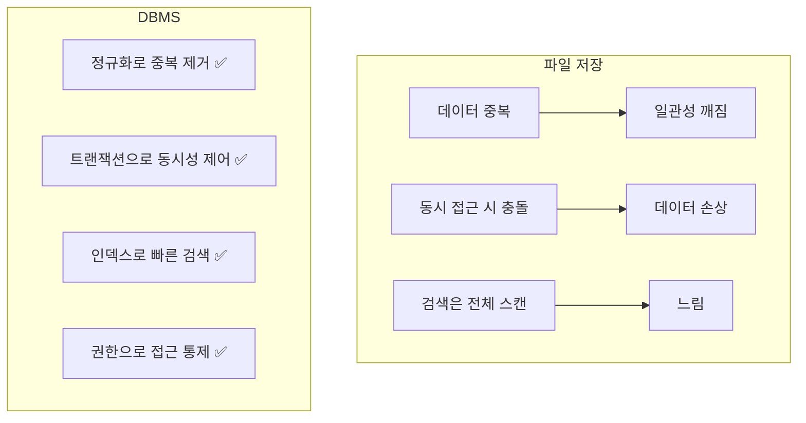
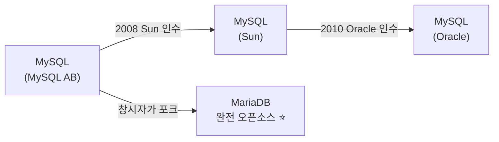
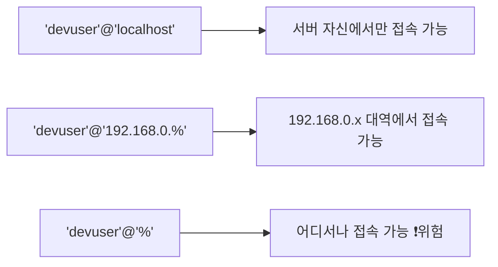
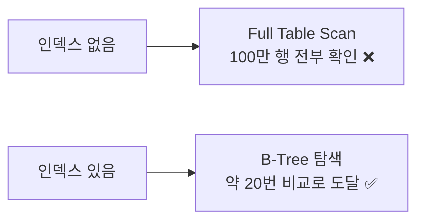

## 036. 데이터베이스 서비스

### 1. 데이터베이스 기본 개념

**DBMS(Database Management System)** 는 데이터를 **체계적으로 저장·검색·관리**하는 소프트웨어입니다.

#### 파일로 저장하면 안 되는 이유



| 기능 | 설명 |
| --- | --- |
| **동시성 제어** | 여러 사용자가 동시에 접근해도 **데이터 일관성 유지** |
| **트랜잭션** | 여러 작업을 **하나의 단위로 묶어** 전부 성공하거나 전부 취소 |
| **무결성** | 정해진 규칙에 어긋나는 데이터를 **거부** |
| **복구** | 장애 시 로그를 이용해 **일관된 상태로 복원** |
| **보안** | 사용자·테이블 단위 **권한 관리** |

#### 트랜잭션의 ACID 특성 (시험 출제)

| 특성 | 의미 |
| --- | --- |
| **A**tomicity (**원자성**) | **전부 실행되거나 전부 취소** — 중간 상태 없음 |
| **C**onsistency (**일관성**) | 트랜잭션 전후로 **데이터 규칙이 유지** |
| **I**solation (**고립성**) | 동시에 실행되는 트랜잭션이 **서로 간섭하지 않음** |
| **D**urability (**지속성**) | 커밋된 결과는 **장애가 나도 유지** |

> **원자성의 예** : 계좌 이체는 "A에서 출금"과 "B에 입금"이 **둘 다 되거나 둘 다 안 되어야** 합니다.  
> 출금만 되고 입금이 실패하면 돈이 사라집니다.

---

### 2. 주요 DBMS 비교

| DBMS | 라이선스 | 특징 | 기본 포트 |
| --- | --- | --- | --- |
| **MySQL** | GPL / 상용 (Oracle) | 가장 널리 사용, 웹 서비스 표준 | **3306** |
| **MariaDB** | **GPL (완전 오픈)** | MySQL 포크, **RHEL/Rocky 기본** ⭐ | **3306** |
| **PostgreSQL** | PostgreSQL License | **표준 준수·기능 풍부**, 복잡한 쿼리에 강함 | **5432** |
| **Oracle DB** | 상용 | 대규모 엔터프라이즈 | 1521 |
| **SQLite** | Public Domain | **파일 하나로 동작**, 서버 불필요 | — |
| **MongoDB** | SSPL | **NoSQL** 문서형 | 27017 |
| **Redis** | BSD | **인메모리** 캐시·세션 저장소 | 6379 |

#### MySQL과 MariaDB의 관계



MySQL이 Oracle에 인수되면서 **폐쇄적으로 바뀔 것을 우려**한 원 개발자가 만든 것이 MariaDB입니다.  
**명령어와 문법이 거의 동일**하여 대부분 그대로 호환됩니다.

> **RHEL/Rocky의 기본 저장소에는 MySQL이 아니라 MariaDB가 들어 있습니다.**  
> 시험에서도 MariaDB 기준으로 출제됩니다.

---

### 3. MariaDB 설치와 초기 설정

```bash
# 설치
$ sudo dnf install mariadb-server mariadb
$ sudo systemctl enable --now mariadb
$ systemctl status mariadb

# ⭐ 보안 초기 설정 (설치 직후 반드시 실행)
$ sudo mysql_secure_installation
```

`mysql_secure_installation`이 수행하는 작업:

| 항목 | 이유 |
| --- | --- |
| **root 비밀번호 설정** | 기본 상태는 **비밀번호가 없습니다** ❗ |
| **익명 사용자 제거** | 누구나 로그인 가능한 계정 |
| **root 원격 로그인 차단** | root는 로컬에서만 |
| **test 데이터베이스 제거** | 누구나 접근 가능한 기본 DB |
| 권한 테이블 재적용 | 변경 사항 즉시 반영 |

> **설치 직후 이 명령을 실행하지 않으면 비밀번호 없이 누구나 접속**할 수 있습니다.  
> 실무에서 가장 흔한 DB 침해 원인 중 하나입니다.

```bash
# 방화벽 (원격 접속이 필요한 경우만)
$ sudo firewall-cmd --add-service=mysql --permanent
$ sudo firewall-cmd --reload
```

---

### 4. 접속과 기본 명령

```bash
# 접속
$ mysql -u root -p
$ mysql -u devuser -p mydb
$ mysql -h 192.168.0.50 -P 3306 -u devuser -p        # 원격 (-P 대문자 ⭐)

# 명령 한 줄 실행
$ mysql -u root -p -e "SHOW DATABASES;"

# SQL 파일 실행
$ mysql -u root -p mydb < script.sql
```

```sql
-- 데이터베이스 목록
SHOW DATABASES;

-- 데이터베이스 생성 (문자셋 지정 필수) ⭐
CREATE DATABASE mydb DEFAULT CHARACTER SET utf8mb4 COLLATE utf8mb4_unicode_ci;

-- 사용할 DB 선택
USE mydb;

-- 테이블 목록·구조
SHOW TABLES;
DESC users;
SHOW CREATE TABLE users;

-- 현재 상태
SELECT VERSION();
SELECT USER(), DATABASE();
SHOW PROCESSLIST;                   -- 실행 중인 쿼리 ⭐
SHOW VARIABLES LIKE 'max_connections';
SHOW STATUS LIKE 'Threads_connected';

-- 종료
EXIT;   -- 또는 \q
```

> **`utf8`이 아니라 `utf8mb4`를 써야 하는 이유**  
> MySQL의 `utf8`은 **3바이트까지만** 저장하여 **이모지(4바이트)를 저장할 수 없습니다.**  
> `utf8mb4`가 진짜 UTF-8이므로 **항상 `utf8mb4`를 사용**해야 합니다.

---

### 5. 사용자와 권한 관리 (실기 핵심)

```sql
-- ────────── 사용자 생성 ──────────
CREATE USER 'devuser'@'localhost' IDENTIFIED BY 'StrongPass123!';
CREATE USER 'devuser'@'192.168.0.%' IDENTIFIED BY 'StrongPass123!';
CREATE USER 'devuser'@'%' IDENTIFIED BY 'StrongPass123!';   -- 어디서나 (비권장)

-- ────────── 권한 부여 ──────────
GRANT ALL PRIVILEGES ON mydb.* TO 'devuser'@'localhost';
GRANT SELECT, INSERT, UPDATE, DELETE ON mydb.* TO 'appuser'@'192.168.0.%';
GRANT SELECT ON mydb.users TO 'readonly'@'localhost';       -- 테이블 단위

-- ⭐ 권한 변경 후 반드시 적용
FLUSH PRIVILEGES;

-- ────────── 권한 확인 ──────────
SHOW GRANTS FOR 'devuser'@'localhost';
SELECT User, Host FROM mysql.user;

-- ────────── 권한 회수 / 사용자 삭제 ──────────
REVOKE INSERT, UPDATE ON mydb.* FROM 'devuser'@'localhost';
DROP USER 'devuser'@'localhost';

-- ────────── 비밀번호 변경 ──────────
ALTER USER 'devuser'@'localhost' IDENTIFIED BY 'NewPass456!';
SET PASSWORD FOR 'devuser'@'localhost' = PASSWORD('NewPass456!');   -- 구버전
```

#### `'사용자'@'호스트'` 형식이 핵심입니다



> **MySQL/MariaDB는 사용자를 "이름 + 접속 위치"로 구분**합니다.  
> `'devuser'@'localhost'`와 `'devuser'@'%'`는 **완전히 다른 계정**입니다.  
> 원격 접속이 안 될 때 이 부분을 확인해야 합니다.

#### 주요 권한

| 권한 | 의미 |
| --- | --- |
| **`ALL PRIVILEGES`** | 모든 권한 |
| **`SELECT`** | 조회 |
| **`INSERT`** | 삽입 |
| **`UPDATE`** | 수정 |
| **`DELETE`** | 삭제 |
| `CREATE` / `DROP` | 생성 / 삭제 |
| `ALTER` | 구조 변경 |
| `INDEX` | 인덱스 관리 |
| **`GRANT OPTION`** | **자신의 권한을 남에게 부여** 가능 |

> **최소 권한 원칙** : 애플리케이션 계정에 `ALL PRIVILEGES`를 주면 안 됩니다.  
> 웹 애플리케이션은 대부분 **`SELECT, INSERT, UPDATE, DELETE`** 만 있으면 충분합니다.  
> SQL Injection이 발생해도 **`DROP TABLE`을 막을 수 있습니다.**

---

### 6. 주요 설정

```bash
$ sudo vi /etc/my.cnf.d/mariadb-server.cnf
```

```ini
[mysqld]
datadir=/var/lib/mysql                    # 데이터 저장 위치 ⭐
socket=/var/lib/mysql/mysql.sock
port=3306

# 접속 제한
bind-address=127.0.0.1                    # 로컬만 허용 (보안) ⭐
max_connections=200

# 문자셋
character-set-server=utf8mb4
collation-server=utf8mb4_unicode_ci

# InnoDB (성능에 가장 큰 영향) ⭐
innodb_buffer_pool_size=2G                # 전체 메모리의 50~70%
innodb_log_file_size=256M
innodb_flush_log_at_trx_commit=1          # 1=완전 보장, 2=성능 우선

# 로그
log_error=/var/log/mariadb/mariadb.log
slow_query_log=1                          # 느린 쿼리 기록 ⭐
slow_query_log_file=/var/log/mariadb/slow.log
long_query_time=2                         # 2초 이상 쿼리 기록
```

```bash
$ sudo systemctl restart mariadb
```

| 설정 | 의미 |
| --- | --- |
| **`datadir`** | **데이터 파일 위치** |
| **`bind-address`** | **접속 허용 IP** (`127.0.0.1`=로컬만) |
| `max_connections` | 최대 동시 접속 수 |
| **`innodb_buffer_pool_size`** | **InnoDB 캐시 크기 — 성능의 핵심** ⭐ |
| **`slow_query_log`** | **느린 쿼리 기록** |
| `long_query_time` | 느린 쿼리 기준(초) |

> **`bind-address=127.0.0.1`의 중요성**  
> DB는 **웹 서버에서만 접근**하면 되는 경우가 대부분입니다.  
> 외부에 노출하면 **무차별 대입 공격의 표적**이 됩니다.  
> 같은 서버에 웹과 DB가 있다면 반드시 `127.0.0.1`로 묶어야 합니다.

> **`innodb_buffer_pool_size`가 성능을 좌우하는 이유**  
> DB 성능의 핵심은 **디스크 접근을 얼마나 줄이는가**입니다.  
> 이 값이 크면 자주 쓰는 데이터가 **메모리에 상주**하여 디스크를 거의 읽지 않습니다.  
> 전용 DB 서버라면 **전체 메모리의 50~70%** 로 설정합니다.

#### 스토리지 엔진

| 엔진 | 특징 |
| --- | --- |
| **InnoDB** | **트랜잭션 지원, 외래키, 행 단위 잠금** — **기본값** ⭐ |
| MyISAM | 트랜잭션 없음, 테이블 단위 잠금, 읽기 위주에 빠름 (레거시) |
| Memory | 메모리에만 저장, 재시작 시 소멸 |

```sql
SHOW ENGINES;
SELECT TABLE_NAME, ENGINE FROM information_schema.TABLES WHERE TABLE_SCHEMA='mydb';
```

---

### 7. 백업과 복구 (실기 필수)

#### 논리 백업 — `mysqldump`

```bash
# ────────── 백업 ──────────
$ mysqldump -u root -p mydb > /backup/mydb.sql                  # 단일 DB
$ mysqldump -u root -p --all-databases > /backup/all.sql        # 전체 ⭐
$ mysqldump -u root -p --databases db1 db2 > /backup/multi.sql
$ mysqldump -u root -p mydb users > /backup/users.sql           # 특정 테이블

# 압축하며 백업
$ mysqldump -u root -p mydb | gzip > /backup/mydb-$(date +%F).sql.gz

# ⭐ 일관성 있는 백업 (InnoDB — 서비스 중단 없이)
$ mysqldump -u root -p --single-transaction --routines --triggers \
            --events mydb > /backup/mydb.sql

# ────────── 복구 ──────────
$ mysql -u root -p mydb < /backup/mydb.sql
$ gunzip -c /backup/mydb.sql.gz | mysql -u root -p mydb

# 전체 복구
$ mysql -u root -p < /backup/all.sql
```

| 옵션 | 의미 |
| --- | --- |
| **`--all-databases`** | **모든 DB** |
| **`--single-transaction`** | **InnoDB 무중단 일관성 백업** ⭐ |
| `--routines` | 저장 프로시저·함수 포함 |
| `--triggers` | 트리거 포함 |
| `--no-data` | **구조만** (스키마) |
| `--where="조건"` | 조건에 맞는 행만 |
| `--lock-all-tables` | 전체 잠금 (MyISAM용) |

> **`--single-transaction`이 중요한 이유**  
> 옵션 없이 백업하면 **테이블을 잠가서 서비스가 멈추거나**,  
> 백업 도중 변경된 데이터가 섞여 **일관성이 깨집니다.**  
> InnoDB는 이 옵션으로 **스냅샷 시점의 일관된 데이터**를 잠금 없이 백업할 수 있습니다.

#### 물리 백업

```bash
# 서비스를 멈추고 데이터 디렉터리 복사
$ sudo systemctl stop mariadb
$ sudo tar czf /backup/mysql-data.tar.gz /var/lib/mysql
$ sudo systemctl start mariadb

# 전용 도구 (무중단)
$ sudo dnf install mariadb-backup
$ sudo mariabackup --backup --target-dir=/backup/full -u root -p
```

| 구분 | **논리 백업 (`mysqldump`)** | **물리 백업** |
| --- | --- | --- |
| 형식 | **SQL 텍스트** | 데이터 파일 그대로 |
| 크기 | 큼 | 작음 |
| 속도 | 느림 | **빠름** |
| 이식성 | **버전·플랫폼 간 이동 용이** ✅ | 제한적 |
| 부분 복구 | **쉬움** (테이블 단위) | 어려움 |
| 대용량 | 부적합 | **적합** |

---

### 8. PostgreSQL

```bash
$ sudo dnf install postgresql-server postgresql-contrib
$ sudo postgresql-setup --initdb                     # ⭐ 초기화 필수
$ sudo systemctl enable --now postgresql

# 접속 (postgres 계정으로 전환)
$ sudo -u postgres psql
```

```sql
-- 데이터베이스·사용자
\l                                       -- DB 목록
CREATE DATABASE mydb;
\c mydb                                  -- DB 전환
\dt                                      -- 테이블 목록
\du                                      -- 사용자 목록
\q                                       -- 종료

CREATE USER devuser WITH PASSWORD 'StrongPass123!';
GRANT ALL PRIVILEGES ON DATABASE mydb TO devuser;
```

#### 접속 인증 설정 — `pg_hba.conf`

```bash
$ sudo vi /var/lib/pgsql/data/pg_hba.conf
```

```
# TYPE  DATABASE  USER  ADDRESS          METHOD
local   all       all                    peer
host    all       all   127.0.0.1/32     scram-sha-256
host    mydb      devuser  192.168.0.0/24  scram-sha-256
```

| METHOD | 의미 |
| --- | --- |
| **`trust`** | **비밀번호 없이 허용** ❗위험 |
| **`peer`** | OS 사용자 이름과 DB 사용자 이름이 같으면 허용 (로컬) |
| **`md5` / `scram-sha-256`** | **비밀번호 인증** |
| `reject` | 거부 |

```bash
# 외부 접속 허용
$ sudo vi /var/lib/pgsql/data/postgresql.conf
listen_addresses = '*'

$ sudo systemctl restart postgresql
```

```bash
# 백업·복구
$ sudo -u postgres pg_dump mydb > /backup/mydb.sql
$ sudo -u postgres pg_dumpall > /backup/all.sql          # 전체
$ sudo -u postgres psql mydb < /backup/mydb.sql
```

#### MySQL/MariaDB vs PostgreSQL

| 구분 | **MySQL/MariaDB** | **PostgreSQL** |
| --- | --- | --- |
| 강점 | **읽기 성능, 단순 웹 서비스** | **표준 준수, 복잡한 쿼리, 데이터 무결성** |
| 사용자 인증 | DB 자체 계정 | **OS 계정 연동(peer) 가능** |
| 인증 설정 | `mysql.user` 테이블 | **`pg_hba.conf`** |
| 기본 포트 | **3306** | **5432** |
| 클라이언트 | `mysql` | **`psql`** |
| 백업 | `mysqldump` | **`pg_dump`** |

---

### 9. 성능 모니터링과 튜닝

```sql
-- 현재 실행 중인 쿼리 ⭐
SHOW PROCESSLIST;
SHOW FULL PROCESSLIST;

-- 오래 걸리는 쿼리 강제 종료
KILL 12345;

-- 상태 확인
SHOW STATUS LIKE 'Threads_connected';
SHOW STATUS LIKE 'Slow_queries';
SHOW STATUS LIKE 'Innodb_buffer_pool_read%';

-- 실행 계획 분석 ⭐
EXPLAIN SELECT * FROM users WHERE email = 'a@b.com';
```

```bash
# 느린 쿼리 로그 분석
$ sudo mysqldumpslow -s t -t 10 /var/log/mariadb/slow.log

# 튜닝 도구
$ sudo dnf install mysqltuner
$ mysqltuner
```

#### 인덱스 — 성능의 핵심

```sql
-- 인덱스 생성
CREATE INDEX idx_email ON users(email);
CREATE UNIQUE INDEX idx_uid ON users(user_id);

-- 인덱스 확인
SHOW INDEX FROM users;

-- 인덱스 삭제
DROP INDEX idx_email ON users;
```



> **인덱스는 만능이 아닙니다.**  
> 조회는 빨라지지만 **INSERT·UPDATE·DELETE 시 인덱스도 갱신**해야 하므로 느려집니다.  
> 또한 디스크 공간을 추가로 사용합니다.  
> **자주 조회하는 컬럼(WHERE, JOIN, ORDER BY)에만** 신중히 생성해야 합니다.

---

### 10. 보안 체크리스트

| 항목 | 방법 |
| --- | --- |
| **초기 보안 설정** | **`mysql_secure_installation`** ⭐ |
| **외부 노출 차단** | **`bind-address=127.0.0.1`** |
| root 원격 접속 차단 | `'root'@'localhost'` 만 유지 |
| **최소 권한 부여** | `ALL PRIVILEGES` 대신 필요한 권한만 |
| 익명·기본 계정 제거 | `SELECT User,Host FROM mysql.user;` 로 점검 |
| 강력한 비밀번호 | 12자 이상, 복잡도 |
| **정기 백업** | `mysqldump --single-transaction` + cron |
| 방화벽 | 필요한 IP만 3306 허용 |
| SELinux | `setsebool -P mysqld_connect_any on` (필요 시) |
| 로그 감시 | `slow_query_log`, 에러 로그 |
| 최신 패치 | `dnf update mariadb-server` |

```sql
-- 위험한 계정 점검 ⭐
SELECT User, Host FROM mysql.user WHERE User='' OR Host='%';
SELECT User, Host, Password FROM mysql.user WHERE Password='';
```

---

### 시험 포인트 정리

| 항목 | 핵심 |
| --- | --- |
| 트랜잭션 특성 | **ACID (원자성·일관성·고립성·지속성)** |
| **MySQL/MariaDB 포트** | **3306** |
| **PostgreSQL 포트** | **5432** |
| RHEL 기본 DB | **MariaDB** |
| 설치 직후 필수 | **`mysql_secure_installation`** ⭐ |
| 데이터 디렉터리 | **`/var/lib/mysql`** |
| 설정 파일 | `/etc/my.cnf`, `/etc/my.cnf.d/` |
| 사용자 형식 | **`'user'@'host'`** ⭐ |
| 권한 부여 | **`GRANT ... ON db.* TO ...`** |
| 권한 적용 | **`FLUSH PRIVILEGES`** |
| 권한 확인 | `SHOW GRANTS FOR` |
| 외부 접속 차단 | **`bind-address=127.0.0.1`** |
| 성능 핵심 설정 | **`innodb_buffer_pool_size`** |
| 기본 스토리지 엔진 | **InnoDB** (트랜잭션 지원) |
| **논리 백업** | **`mysqldump`** |
| 무중단 일관 백업 | **`--single-transaction`** ⭐ |
| 전체 백업 | `--all-databases` |
| 복구 | **`mysql -u root -p db < file.sql`** |
| 실행 중 쿼리 | **`SHOW PROCESSLIST`** |
| 실행 계획 | **`EXPLAIN`** |
| PostgreSQL 초기화 | **`postgresql-setup --initdb`** |
| PostgreSQL 인증 설정 | **`pg_hba.conf`** |
| PostgreSQL 백업 | **`pg_dump`** |
| PostgreSQL 클라이언트 | **`psql`** |

---

### 한 줄 정리

RHEL 계열의 기본 DB는 **MariaDB(포트 3306)** 이며 설치 직후 **`mysql_secure_installation`** 이 필수이고,  
사용자는 **`'이름'@'호스트'`** 로 구분하며 권한 변경 후 **`FLUSH PRIVILEGES`**,  
백업은 **`mysqldump --single-transaction`(무중단 일관성)**,  
보안의 기본은 **`bind-address=127.0.0.1`와 최소 권한 부여**입니다.
