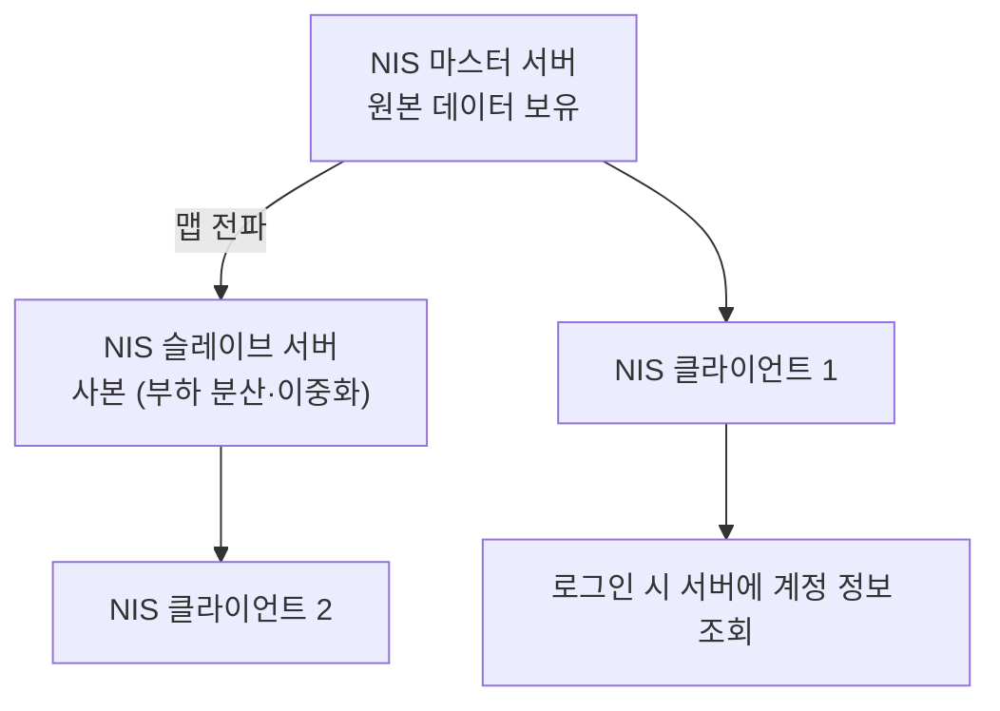
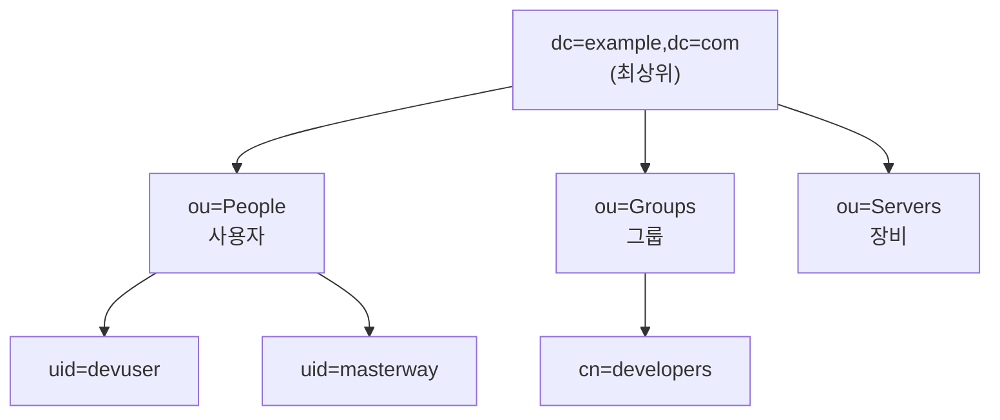
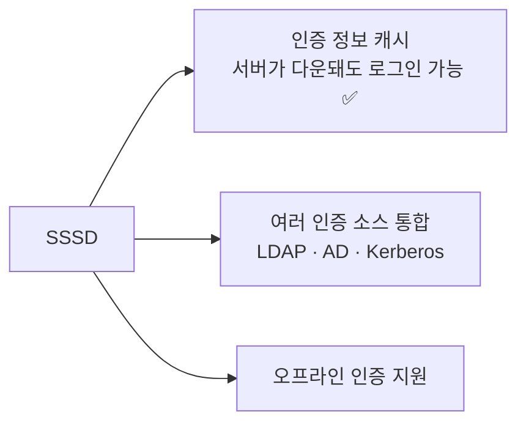
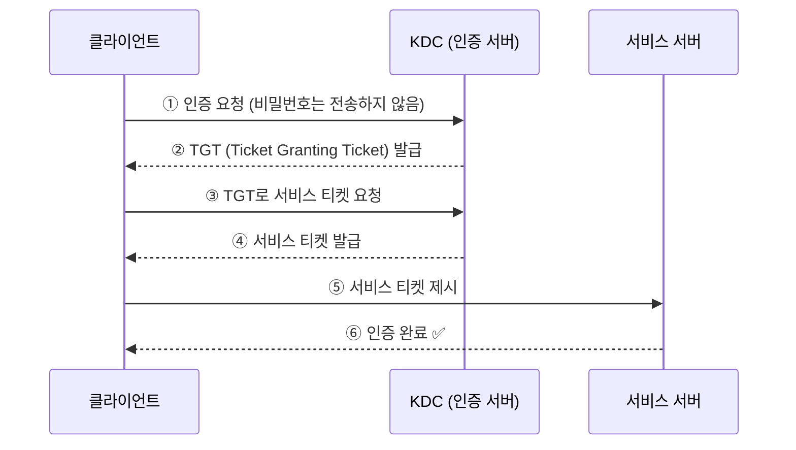

## 037. 인증 서비스 - NIS와 LDAP

### 1. 중앙 인증이 필요한 이유

서버가 한 대일 때는 `/etc/passwd`로 충분합니다. 하지만 서버가 늘어나면 문제가 생깁니다.


| 문제 | 중앙 인증으로 해결 |
| --- | --- |
| 계정을 서버마다 만들어야 함 | **한 번만 등록** |
| 비밀번호가 서버마다 다름 | **하나의 비밀번호로 모든 서버** |
| UID가 서버마다 달라 NFS 권한 꼬임 | **UID 일관성 유지** ⭐ |
| 퇴사자 계정 삭제 누락 | **한 곳에서 삭제하면 전체 차단** |

> **UID 불일치 문제가 특히 심각합니다.**  
> 서버 A에서 `masterway`가 UID 1000이고 서버 B에서 `devuser`가 UID 1000이면,  
> NFS로 공유한 파일의 소유자가 **서버마다 다르게 보입니다.**

---

### 2. NIS (Network Information Service)

**Sun Microsystems가 개발**한 초기 중앙 인증 시스템입니다. (구 명칭 : Yellow Pages, YP)



#### 구성 요소

| 역할 | 설명 |
| --- | --- |
| **마스터 서버** | 원본 데이터를 보유하고 맵을 생성 |
| **슬레이브 서버** | 마스터의 사본 유지 (이중화) |
| **클라이언트** | 서버에 계정 정보를 조회 |
| **도메인(NIS Domain)** | 하나의 관리 단위 (DNS 도메인과 무관) |
| **맵(Map)** | `passwd`, `group`, `hosts` 등을 변환한 **DBM 데이터베이스** |

#### 주요 데몬과 포트

| 데몬 | 역할 | 위치 |
| --- | --- | --- |
| **`ypserv`** | **NIS 서버** 데몬 | 서버 |
| **`ypbind`** | **NIS 클라이언트** 데몬 | 클라이언트 |
| **`yppasswdd`** | 비밀번호 변경 처리 | 서버 |
| `ypxfrd` | 맵 전송 (슬레이브용) | 서버 |
| **`rpcbind`** | **RPC 포트 매핑 (포트 111)** ⭐ | 양쪽 |

> **NIS는 RPC 기반**이라 **`rpcbind`(포트 111)** 가 반드시 실행되어야 합니다.  
> 포트가 동적으로 할당되므로 방화벽 설정이 까다롭습니다.

#### 서버 설정

```bash
# 설치
$ sudo dnf install ypserv rpcbind

# ① NIS 도메인 설정
$ sudo nisdomainname example-nis
$ echo "NISDOMAIN=example-nis" | sudo tee -a /etc/sysconfig/network

# ② 서비스 시작
$ sudo systemctl enable --now rpcbind ypserv yppasswdd

# ③ 맵 생성 (⭐ 계정 추가·변경 시마다 실행)
$ sudo /usr/lib64/yp/ypinit -m
$ cd /var/yp && sudo make

# 확인
$ ypcat passwd                    # 공유되는 계정 목록
$ ypwhich                         # 접속 중인 NIS 서버
$ rpcinfo -p localhost            # RPC 서비스 확인
```

#### 클라이언트 설정

```bash
$ sudo dnf install ypbind rpcbind

$ sudo nisdomainname example-nis
$ sudo authselect select nis --force        # RHEL 8
# 또는 수동으로 /etc/yp.conf 편집
$ echo "domain example-nis server 192.168.0.50" | sudo tee /etc/yp.conf

$ sudo systemctl enable --now rpcbind ypbind

# 확인
$ ypwhich
192.168.0.50
$ getent passwd nisuser                     # NIS 계정 조회 ⭐
```

#### `/etc/nsswitch.conf` — 조회 순서

```bash
$ grep -E "^(passwd|group|shadow)" /etc/nsswitch.conf
passwd:     files nis
group:      files nis
shadow:     files nis
            └┬─┘ └┬┘
             │    └── 그다음 NIS 서버에 조회
             └─────── 먼저 로컬 파일(/etc/passwd) 확인
```

> **`files nis` 순서의 의미**  
> **로컬 계정이 우선**입니다. `root` 같은 시스템 계정은 로컬에서 처리되고,  
> 로컬에 없는 계정만 NIS 서버에 물어봅니다.

#### NIS의 치명적 문제 (시험 출제)

| 문제 | 설명 |
| --- | --- |
| **평문 전송** | 비밀번호 해시가 **네트워크에 그대로** 흐릅니다 ❗ |
| **인증 없는 조회** | 도메인 이름만 알면 **누구나 계정 목록을 가져갈 수 있습니다** ❗ |
| RPC 동적 포트 | 방화벽 설정이 어렵습니다 |
| 확장성 부족 | 계정 정보 외에는 담기 어렵습니다 |

```bash
# 공격자가 NIS 도메인만 알면
$ ypcat passwd
nisuser:$6$abc123...:1001:1001::/home/nisuser:/bin/bash
        └── 비밀번호 해시가 그대로 노출 ❗
```

> **NIS는 신뢰할 수 있는 내부망에서만** 사용해야 하며,  
> **현재는 LDAP으로 대체하는 것이 표준**입니다.  
> 시험에는 여전히 출제되므로 개념은 알아 두어야 합니다.

---

### 3. LDAP (Lightweight Directory Access Protocol)

**디렉터리 서비스**를 위한 표준 프로토콜입니다.  
계정 정보뿐 아니라 **조직 구조·연락처·장비 정보** 등을 계층적으로 저장합니다.

#### 디렉터리 구조 (DIT)



#### 주요 용어 (시험 필수)

| 약어 | 정식 명칭 | 의미 |
| --- | --- | --- |
| **`dn`** | Distinguished Name | **항목의 고유 식별자 (전체 경로)** ⭐ |
| **`dc`** | Domain Component | **도메인 구성 요소** (`dc=example,dc=com`) |
| **`ou`** | Organizational Unit | **조직 단위** (부서) |
| **`cn`** | Common Name | **일반 이름** |
| **`uid`** | User ID | 사용자 ID |
| `sn` | Surname | 성 |
| `o` | Organization | 조직 |
| `objectClass` | — | 항목의 **유형 정의** (스키마) |

```
dn: uid=devuser,ou=People,dc=example,dc=com
    └───┬────┘ └───┬────┘ └──────┬───────┘
      개별 항목    조직 단위        도메인
```

> **DN은 "파일 경로"와 같습니다.**  
> `/com/example/People/devuser` 를 거꾸로 쓴 것이라고 생각하면 이해가 쉽습니다.  
> LDAP은 **오른쪽이 상위**입니다.

#### NIS vs LDAP 비교 (시험 출제)

| 구분 | **NIS** | **LDAP** |
| --- | --- | --- |
| 개발 | Sun Microsystems | 표준 (IETF) |
| 구조 | **평면(flat)** | **계층(트리)** ⭐ |
| 프로토콜 | **RPC** (포트 111 + 동적) | **TCP 389 / 636(SSL)** ⭐ |
| 암호화 | **없음** ❗ | **TLS/SSL 지원** ✅ |
| 접근 제어 | 거의 없음 | **세밀한 ACL** |
| 저장 정보 | 계정·호스트 등 제한적 | **모든 종류의 디렉터리 정보** |
| 확장성 | 낮음 | **높음** |
| 플랫폼 | UNIX 계열 | **크로스 플랫폼** (Windows AD 포함) |
| 현재 | 레거시 | **표준** ⭐ |

#### 포트

| 포트 | 용도 |
| --- | --- |
| **389** | **LDAP (평문 또는 STARTTLS)** |
| **636** | **LDAPS (SSL/TLS 암호화)** ⭐ |

---

### 4. OpenLDAP 서버 구축

```bash
$ sudo dnf install openldap openldap-servers openldap-clients
$ sudo systemctl enable --now slapd            # LDAP 서버 데몬 ⭐
$ systemctl status slapd

$ sudo firewall-cmd --add-service=ldap --permanent
$ sudo firewall-cmd --reload
```

#### 관리자 비밀번호 설정

```bash
# 해시 생성
$ slappasswd
New password:
{SSHA}xxxxxxxxxxxxxxxxxxxxxxxxxxxx

# LDIF 파일로 설정 적용
$ cat > /tmp/rootpw.ldif <<'EOF'
dn: olcDatabase={2}hdb,cn=config
changetype: modify
replace: olcRootPW
olcRootPW: {SSHA}xxxxxxxxxxxxxxxxxxxxxxxxxxxx
EOF

$ sudo ldapmodify -Y EXTERNAL -H ldapi:/// -f /tmp/rootpw.ldif
```

#### 기본 구조 생성 (LDIF)

**LDIF(LDAP Data Interchange Format)** 는 LDAP 데이터를 텍스트로 표현한 형식입니다.

```bash
$ cat > base.ldif <<'EOF'
dn: dc=example,dc=com
objectClass: top
objectClass: dcObject
objectClass: organization
o: Example Inc
dc: example

dn: ou=People,dc=example,dc=com
objectClass: organizationalUnit
ou: People

dn: ou=Groups,dc=example,dc=com
objectClass: organizationalUnit
ou: Groups
EOF

$ ldapadd -x -D "cn=Manager,dc=example,dc=com" -W -f base.ldif
```

#### 사용자 추가

```bash
$ cat > devuser.ldif <<'EOF'
dn: uid=devuser,ou=People,dc=example,dc=com
objectClass: top
objectClass: person
objectClass: posixAccount
objectClass: shadowAccount
cn: Dev User
sn: User
uid: devuser
uidNumber: 2001
gidNumber: 2001
homeDirectory: /home/devuser
loginShell: /bin/bash
userPassword: {SSHA}xxxxxxxxxxxxxxxx
EOF

$ ldapadd -x -D "cn=Manager,dc=example,dc=com" -W -f devuser.ldif
```

---

### 5. LDAP 명령어

```bash
# ────────── 검색 ⭐ ──────────
$ ldapsearch -x -b "dc=example,dc=com"
$ ldapsearch -x -b "dc=example,dc=com" "(uid=devuser)"
$ ldapsearch -x -b "ou=People,dc=example,dc=com" "(objectClass=posixAccount)" uid uidNumber
$ ldapsearch -x -H ldap://192.168.0.50 -b "dc=example,dc=com"

# ────────── 추가·수정·삭제 ──────────
$ ldapadd    -x -D "cn=Manager,dc=example,dc=com" -W -f new.ldif
$ ldapmodify -x -D "cn=Manager,dc=example,dc=com" -W -f mod.ldif
$ ldapdelete -x -D "cn=Manager,dc=example,dc=com" -W "uid=devuser,ou=People,dc=example,dc=com"

# ────────── 비밀번호 ──────────
$ ldappasswd -x -D "cn=Manager,dc=example,dc=com" -W -S "uid=devuser,ou=People,dc=example,dc=com"
```

| 옵션 | 의미 |
| --- | --- |
| **`-x`** | **단순 인증** (SASL 대신) |
| **`-b`** | **검색 기준 DN (base)** |
| **`-D`** | **바인드 DN (접속 계정)** |
| **`-W`** | 비밀번호를 프롬프트로 입력 |
| `-w 암호` | 비밀번호 직접 입력 (히스토리에 남음 ❗) |
| **`-H`** | LDAP 서버 URI |
| `-LLL` | 간결한 출력 |

| 명령어 | 기능 |
| --- | --- |
| **`ldapsearch`** | **검색** |
| **`ldapadd`** | 추가 |
| **`ldapmodify`** | 수정 |
| **`ldapdelete`** | 삭제 |
| `ldappasswd` | 비밀번호 변경 |
| `slapcat` | DB를 LDIF로 덤프 (백업) |
| `slapadd` | LDIF를 DB에 적재 (복원) |

```bash
# 백업·복원
$ sudo systemctl stop slapd
$ sudo slapcat -l /backup/ldap-$(date +%F).ldif
$ sudo slapadd -l /backup/ldap.ldif
$ sudo systemctl start slapd
```

---

### 6. LDAP 클라이언트 설정

```bash
$ sudo dnf install openldap-clients sssd sssd-ldap authselect

# ⭐ SSSD 사용 (현재 권장 방식)
$ sudo authselect select sssd with-mkhomedir --force

$ sudo vi /etc/sssd/sssd.conf
```

```ini
[sssd]
services = nss, pam
domains = example.com

[domain/example.com]
id_provider = ldap
auth_provider = ldap
ldap_uri = ldaps://ldap.example.com
ldap_search_base = dc=example,dc=com
ldap_tls_reqcert = demand
cache_credentials = True
```

```bash
$ sudo chmod 600 /etc/sssd/sssd.conf        # ❗권한 필수
$ sudo systemctl enable --now sssd
$ sudo systemctl enable --now oddjobd       # 홈 디렉터리 자동 생성

# 확인
$ getent passwd devuser                     # LDAP 계정 조회 ⭐
$ id devuser
$ su - devuser
```

#### SSSD를 쓰는 이유



> **`nslcd`(구형)와 달리 SSSD는 인증 정보를 캐시**합니다.  
> LDAP 서버가 잠시 다운되어도 **최근 로그인한 사용자는 접속할 수 있어**  
> 서비스 연속성이 보장됩니다.

#### 홈 디렉터리 자동 생성

LDAP 계정은 **홈 디렉터리가 자동으로 만들어지지 않습니다.**

```bash
# 방법 ① pam_mkhomedir (로그인 시 자동 생성)
$ sudo authselect select sssd with-mkhomedir --force

# 방법 ② NFS로 홈 디렉터리 공유 (더 일반적) ⭐
$ sudo mount -t nfs 192.168.0.60:/export/home /home
```

> **실무에서는 LDAP(인증) + NFS(홈 디렉터리)** 를 조합합니다.  
> 어느 서버에 로그인해도 **같은 홈 디렉터리**를 쓸 수 있습니다.

---

### 7. LDAP 보안

```bash
# ────────── TLS 활성화 (필수) ⭐ ──────────
$ sudo vi /etc/openldap/slapd.conf
TLSCACertificateFile /etc/pki/tls/certs/ca.crt
TLSCertificateFile   /etc/pki/tls/certs/ldap.crt
TLSCertificateKeyFile /etc/pki/tls/private/ldap.key

# LDAPS(636) 활성화
$ sudo vi /etc/sysconfig/slapd
SLAPD_URLS="ldapi:/// ldap:/// ldaps:///"

$ sudo systemctl restart slapd
$ sudo firewall-cmd --add-service=ldaps --permanent && sudo firewall-cmd --reload
```

```
# 접근 제어 (ACL) 예시
access to attrs=userPassword
    by self write
    by anonymous auth
    by * none

access to *
    by self write
    by users read
    by * none
```

| 보안 항목 | 조치 |
| --- | --- |
| **평문 전송 방지** | **LDAPS(636) 또는 STARTTLS** ⭐ |
| 익명 조회 차단 | ACL에서 `by anonymous none` |
| **비밀번호 노출 방지** | `userPassword`는 **auth만 허용** |
| 관리자 계정 보호 | 강력한 비밀번호, 접근 IP 제한 |
| 방화벽 | 필요한 서버만 389/636 허용 |

> **LDAP도 평문(389)으로 쓰면 NIS와 다를 바 없습니다.**  
> **반드시 TLS를 적용**해야 중앙 인증의 보안 이점이 생깁니다.

---

### 8. Kerberos (참고)

**티켓 기반 인증 프로토콜**로, LDAP과 함께 쓰이는 경우가 많습니다.



| 용어 | 의미 |
| --- | --- |
| **KDC** (Key Distribution Center) | 인증 서버 |
| **TGT** (Ticket Granting Ticket) | 티켓을 받기 위한 티켓 |
| **Realm** | Kerberos 관리 영역 (보통 대문자 도메인) |
| **Principal** | 인증 주체 (`user@REALM`) |

```bash
$ kinit devuser@EXAMPLE.COM        # 티켓 발급
$ klist                            # 티켓 확인
$ kdestroy                         # 티켓 삭제
```

> **Kerberos의 강점** : 비밀번호가 **네트워크를 흐르지 않습니다.**  
> 티켓만 오가므로 가로채도 재사용이 어렵습니다.  
> **Windows Active Directory**도 Kerberos + LDAP 조합입니다.

**일반적인 구성** : **LDAP(계정 정보 저장) + Kerberos(인증)** 를 함께 사용합니다.

---

### 9. 문제 해결

| 증상 | 확인 |
| --- | --- |
| **LDAP 계정 조회 안 됨** | **`getent passwd 계정`** ⭐ |
| 서버 연결 실패 | `ldapsearch -x -H ldap://서버 -b "..."` |
| 로그인은 되는데 홈이 없음 | `pam_mkhomedir` 또는 NFS 확인 |
| SSSD 동작 이상 | `journalctl -u sssd`, 캐시 삭제 |
| 인증 실패 | `/var/log/secure`, SSSD 로그 |

```bash
# SSSD 캐시 초기화 (설정 변경 후 반영 안 될 때) ⭐
$ sudo systemctl stop sssd
$ sudo rm -f /var/lib/sss/db/*
$ sudo systemctl start sssd

# 상세 로그 활성화
$ sudo vi /etc/sssd/sssd.conf
debug_level = 9
$ sudo systemctl restart sssd
$ sudo tail -f /var/log/sssd/sssd_example.com.log

# 연결 테스트
$ ldapsearch -x -H ldap://192.168.0.50 -b "dc=example,dc=com" -LLL
$ nc -zv 192.168.0.50 389
```

> **`getent passwd 계정`이 가장 빠른 진단 방법**입니다.  
> 결과가 나오면 **이름 조회는 성공**한 것이므로, 이후 문제는 인증이나 홈 디렉터리 쪽입니다.

---

### 시험 포인트 정리

| 항목 | 핵심 |
| --- | --- |
| NIS 개발사 | **Sun Microsystems** (구 명칭 YP) |
| **NIS 서버 데몬** | **`ypserv`** |
| **NIS 클라이언트 데몬** | **`ypbind`** |
| NIS 필수 서비스 | **`rpcbind` (포트 111)** |
| NIS 맵 생성 | **`/var/yp` 에서 `make`**, `ypinit -m` |
| NIS 계정 확인 | **`ypcat passwd`**, `ypwhich` |
| **NIS의 문제** | **평문 전송, 인증 없는 조회** ❗ |
| 조회 순서 정의 | **`/etc/nsswitch.conf`** |
| **LDAP 포트** | **389 (평문) / 636 (SSL)** ⭐ |
| LDAP 서버 데몬 | **`slapd`** |
| **`dn`** | **고유 식별자 (전체 경로)** |
| **`dc`** | 도메인 구성 요소 |
| **`ou`** | 조직 단위 |
| **`cn`** | 일반 이름 |
| 데이터 형식 | **LDIF** |
| LDAP 검색 | **`ldapsearch -x -b`** |
| LDAP 추가 | **`ldapadd`** |
| LDAP 백업 | **`slapcat`** |
| 클라이언트 데몬 | **`sssd`** (캐시 지원) |
| 계정 조회 확인 | **`getent passwd`** ⭐ |
| NIS vs LDAP 구조 | **평면 vs 계층(트리)** |
| Kerberos 인증 서버 | **KDC** |
| Kerberos 티켓 | **TGT** |

---

### 한 줄 정리

중앙 인증은 **서버마다 계정을 만드는 문제와 UID 불일치**를 해결하며,  
**NIS는 `ypserv`/`ypbind` + RPC(111) 기반이지만 평문 전송이라 레거시**이고,  
**LDAP은 `slapd` + 포트 389/636으로 계층 구조(dn·dc·ou·cn)를 가지며 TLS로 암호화**할 수 있어 현재 표준이며,  
클라이언트는 **SSSD(캐시 지원)** 를 쓰고 문제 진단은 **`getent passwd`** 로 시작합니다.
