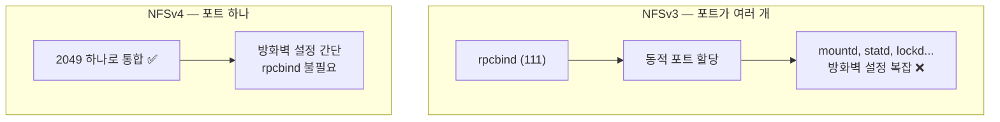
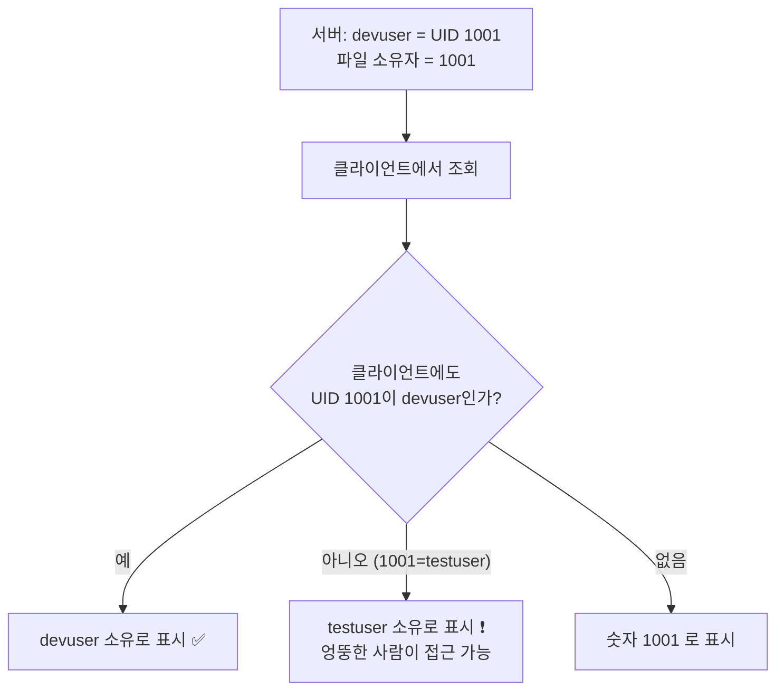
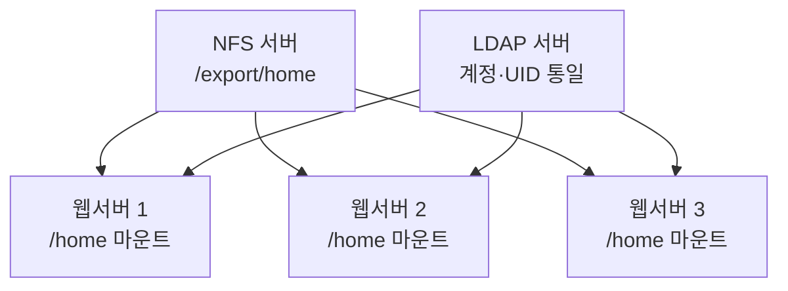

## 038. 파일 서비스 - NFS

### 1. NFS란

**NFS(Network File System)** 는 **Sun Microsystems가 개발**한, 네트워크를 통해 **원격 디렉터리를 로컬처럼 사용**하는 파일 공유 시스템입니다.

```mermaid
graph LR
    S["NFS 서버<br/>/export/data"] -->|"네트워크로 공유(export)"| C1["클라이언트 A<br/>/mnt/data 에 마운트"]
    S -->|""| C2["클라이언트 B<br/>/mnt/data 에 마운트"]
    C1 --> U["사용자에게는<br/>로컬 디렉터리처럼 보임 ✅"]
```

#### 핵심 특징

| 특징 | 설명 |
| --- | --- |
| **투명성** | 사용자는 **로컬 디렉터리와 구분할 수 없습니다** |
| **UNIX/Linux 계열 표준** | 리눅스끼리 파일 공유의 기본 |
| **UID/GID 기반 권한** | **서버와 클라이언트의 UID가 같아야** 권한이 맞습니다 ⭐ |
| 포트 | **2049** (NFSv4는 이것 하나만) |

> **Samba와의 차이**  
> **NFS** = **UNIX/Linux 간** 공유 (POSIX 권한 그대로)  
> **Samba** = **Windows와의** 공유 (SMB/CIFS 프로토콜)

---

### 2. NFS 버전별 차이 (시험 출제)

| 버전 | 특징 |
| --- | --- |
| **NFSv2** | UDP만, 파일 크기 2GB 제한 |
| **NFSv3** | TCP 지원, **64비트 파일 크기**, 비동기 쓰기 |
| **NFSv4** | **포트 2049 하나만 사용** ⭐, **rpcbind 불필요**, Kerberos 인증, ACL, 상태 유지 |
| NFSv4.1/4.2 | 병렬 NFS(pNFS), 서버 측 복사 |



> **NFSv4의 가장 큰 장점은 방화벽 친화적**이라는 점입니다.  
> NFSv3는 `rpcbind`가 동적으로 포트를 할당해 방화벽 규칙을 만들기 매우 까다로웠습니다.

---

### 3. NFS 서버 구축 (실기 필수)

```bash
# ① 설치
$ sudo dnf install nfs-utils

# ② 공유할 디렉터리 준비
$ sudo mkdir -p /export/data
$ sudo chown -R nobody:nobody /export/data
$ sudo chmod 755 /export/data

# ③ 공유 설정 ⭐
$ sudo vi /etc/exports
```

```
/export/data   192.168.0.0/24(rw,sync,no_root_squash)
/export/public *(ro,sync)
/export/home   192.168.0.10(rw,sync,no_subtree_check) 192.168.0.11(ro,sync)
     │              │           │
     │              │           └── 옵션 (❗공백 없이 붙여 씀)
     │              └────────────── 허용 클라이언트
     └───────────────────────────── 공유할 디렉터리
```

```bash
# ④ 서비스 시작
$ sudo systemctl enable --now nfs-server
$ systemctl status nfs-server

# ⑤ 설정 적용 (재시작 없이) ⭐
$ sudo exportfs -ra
     │         ││
     │         │└── a: 모든 항목
     │         └─── r: 재적용 (re-export)

# ⑥ 확인
$ sudo exportfs -v
/export/data  192.168.0.0/24(sync,wdelay,hide,no_subtree_check,sec=sys,rw,secure,no_root_squash)

$ showmount -e localhost                # 공유 목록 ⭐
Export list for localhost:
/export/data 192.168.0.0/24

# ⑦ 방화벽
$ sudo firewall-cmd --add-service=nfs --permanent
$ sudo firewall-cmd --add-service=mountd --add-service=rpc-bind --permanent   # NFSv3용
$ sudo firewall-cmd --reload
```

> **`/etc/exports` 작성 시 가장 흔한 실수**  
> **클라이언트와 옵션 사이에 공백을 넣으면 안 됩니다.**
> ```
> /export/data 192.168.0.0/24(rw,sync)     ✅ 올바름
> /export/data 192.168.0.0/24 (rw,sync)    ❌ 공백 → 모든 호스트에 기본 옵션 적용됨!
> ```
> 공백을 넣으면 **"192.168.0.0/24에는 기본 옵션, 그리고 모든 호스트(`*`)에 rw"** 로 해석되어  
> **의도치 않게 전체에 공개**됩니다. 심각한 보안 사고로 이어집니다.

---

### 4. `/etc/exports` 옵션 (시험 핵심)

#### 접근 권한

| 옵션 | 의미 |
| --- | --- |
| **`ro`** | **읽기 전용** (기본값) |
| **`rw`** | **읽기·쓰기** |

#### 쓰기 방식

| 옵션 | 의미 |
| --- | --- |
| **`sync`** | **디스크에 기록한 후 응답** — 안전하지만 느림 (**기본값**) ⭐ |
| **`async`** | **메모리에만 쓰고 바로 응답** — 빠르지만 **장애 시 데이터 손실 위험** ❗ |

> **`async`는 성능이 크게 향상되지만**, 서버가 갑자기 다운되면  
> **클라이언트는 저장됐다고 알고 있는데 실제로는 사라진** 상태가 됩니다.  
> 중요한 데이터에는 반드시 **`sync`** 를 사용해야 합니다.

#### root 권한 처리 (매우 중요)

| 옵션 | 의미 |
| --- | --- |
| **`root_squash`** | **클라이언트의 root를 `nobody`로 매핑** (**기본값, 안전**) ⭐ |
| **`no_root_squash`** | **클라이언트의 root를 서버의 root로 인정** ❗**위험** |
| **`all_squash`** | **모든 사용자를 `nobody`로 매핑** |
| `anonuid=`, `anongid=` | 매핑할 UID/GID 지정 |


> **`no_root_squash`가 위험한 이유**  
> 클라이언트에서 root 권한만 얻으면 **NFS로 공유된 서버 파일을 root 권한으로 조작**할 수 있습니다.  
> SetUID 바이너리를 심어 두면 **서버 자체를 장악**할 수도 있습니다.  
> **정말 필요한 경우(디스크리스 부팅 등)가 아니면 사용하지 않아야** 합니다.

#### 기타 옵션

| 옵션 | 의미 |
| --- | --- |
| `secure` | 1024 미만 포트에서만 접근 허용 (기본) |
| `insecure` | 1024 이상 포트도 허용 |
| **`no_subtree_check`** | 하위 트리 검사 생략 (**성능 향상, 권장**) |
| `subtree_check` | 하위 트리 검사 |
| `wdelay` | 쓰기 지연 (묶어서 처리) |
| `hide` / `nohide` | 중첩 마운트 표시 여부 |

#### 클라이언트 지정 방법

```
/export/data 192.168.0.10(rw,sync)              # 단일 IP
/export/data 192.168.0.0/24(rw,sync)            # 네트워크 대역 ⭐
/export/data *.example.com(rw,sync)             # 도메인 와일드카드
/export/data *(ro,sync)                          # 모든 호스트 (❗주의)
/export/data @trusted(rw,sync)                   # 넷그룹
```

---

### 5. NFS 클라이언트 설정

```bash
# ① 설치
$ sudo dnf install nfs-utils

# ② 서버의 공유 목록 확인 ⭐
$ showmount -e 192.168.0.50
Export list for 192.168.0.50:
/export/data 192.168.0.0/24

# ③ 마운트
$ sudo mkdir -p /mnt/nfsdata
$ sudo mount -t nfs 192.168.0.50:/export/data /mnt/nfsdata

# 버전·옵션 지정
$ sudo mount -t nfs -o vers=4,rw,hard,intr 192.168.0.50:/export/data /mnt/nfsdata

# ④ 확인
$ df -hT | grep nfs
$ mount | grep nfs
192.168.0.50:/export/data on /mnt/nfsdata type nfs4 (rw,relatime,vers=4.2,...)

# ⑤ 언마운트
$ sudo umount /mnt/nfsdata
```

#### `/etc/fstab` 등록 (영구 마운트)

```bash
$ sudo vi /etc/fstab
```

```
192.168.0.50:/export/data  /mnt/nfsdata  nfs  defaults,_netdev,soft,timeo=100  0 0
                                                       │       │
                                                       │       └── soft 마운트 (아래 설명)
                                                       └────────── 네트워크 준비 후 마운트 ⭐
```

```bash
$ sudo mount -a          # ❗재부팅 전 반드시 검증
```

> **`_netdev` 옵션이 필수인 이유**  
> 이 옵션이 없으면 **네트워크가 준비되기 전에 마운트를 시도**하여 실패하고,  
> 시스템이 **응급 모드로 빠져 부팅이 멈출 수 있습니다.**

---

### 6. 마운트 옵션 — `hard` vs `soft` (시험 핵심)


| 옵션 | 서버 무응답 시 | 데이터 안전성 | 용도 |
| --- | --- | --- | --- |
| **`hard`** | **무한 재시도** (기본) | **높음** ✅ | **중요 데이터** |
| **`soft`** | 일정 시간 후 **오류 반환** | 낮음 ❌ | 읽기 전용, 참조용 |
| **`intr`** | hard여도 **시그널로 중단 가능** | — | hard와 함께 사용 |

| 옵션 | 의미 |
| --- | --- |
| `vers=3` / `vers=4` | NFS 버전 지정 |
| `rsize=`, `wsize=` | 읽기·쓰기 블록 크기 (성능 튜닝) |
| **`timeo=`** | 재전송 대기 시간 (1/10초 단위) |
| `retrans=` | 재전송 횟수 |
| **`noatime`** | 접근 시각 갱신 안 함 (성능↑) |
| `bg` | 백그라운드로 마운트 재시도 |
| **`_netdev`** | **네트워크 준비 후 마운트** ⭐ |

> **실무 권장**  
> 데이터 무결성이 중요하면 **`hard,intr`**,  
> 서버가 불안정하고 읽기 위주라면 **`soft,timeo=100,retrans=3`** 을 사용합니다.

---

### 7. NFS와 UID/GID 문제 (실무 핵심)

NFS는 **사용자 이름이 아니라 UID/GID로 권한을 판단**합니다.



```bash
# 서버
$ ls -ln /export/data/report.txt
-rw-r--r--. 1 1001 1001 1024 Feb  5 06:25 report.txt

# 클라이언트 (UID가 다르면)
$ ls -l /mnt/nfsdata/report.txt
-rw-r--r--. 1 1001 1001 1024 Feb  5 06:25 report.txt      ← 이름이 안 나옴
```

**해결 방법**

| 방법 | 설명 |
| --- | --- |
| **중앙 인증 사용** | **LDAP/NIS로 UID를 통일** ⭐ (가장 근본적) |
| 수동으로 UID 맞추기 | `usermod -u 1001 devuser` (소규모) |
| `all_squash` + `anonuid` | 모든 접근을 특정 UID로 고정 |
| **NFSv4 + idmapd** | 이름 기반 매핑 |

```bash
# NFSv4 ID 매핑 설정
$ sudo vi /etc/idmapd.conf
[General]
Domain = example.com          # ⭐ 서버·클라이언트가 동일해야 함

$ sudo systemctl restart nfs-idmapd
```

> **NFSv4에서 소유자가 `nobody:nobody`로 보이는 흔한 문제**  
> **`/etc/idmapd.conf`의 `Domain` 값이 서버와 클라이언트에서 다를 때** 발생합니다.  
> 양쪽을 동일하게 맞추고 서비스를 재시작하면 해결됩니다.

---

### 8. NFS 관련 명령어

```bash
# ────────── 서버 ──────────
$ sudo exportfs -v                    # 현재 공유 목록 ⭐
$ sudo exportfs -ra                   # 설정 재적용 ⭐
$ sudo exportfs -u /export/data       # 특정 공유 해제
$ sudo exportfs -a                    # 모두 공유

$ showmount -e                        # 내 공유 목록
$ showmount -a                        # 마운트한 클라이언트 목록 ⭐
$ showmount -d                        # 마운트된 디렉터리

# ────────── 클라이언트 ──────────
$ showmount -e 192.168.0.50           # 서버의 공유 목록 확인 ⭐
$ mount -t nfs 서버:/경로 /마운트포인트
$ umount /마운트포인트
$ nfsstat -c                          # 클라이언트 통계
$ nfsstat -s                          # 서버 통계

# ────────── RPC (NFSv3) ──────────
$ rpcinfo -p 192.168.0.50             # RPC 서비스 목록 ⭐
   program vers proto   port  service
    100000    4   tcp    111  portmapper
    100003    4   tcp   2049  nfs
    100005    3   tcp  20048  mountd
```

| 명령어 | 기능 |
| --- | --- |
| **`exportfs -v`** | 공유 목록 상세 |
| **`exportfs -ra`** | **설정 재적용** ⭐ |
| **`showmount -e`** | **공유 목록 조회** ⭐ |
| `showmount -a` | 연결된 클라이언트 |
| `nfsstat` | 통계 |
| `rpcinfo -p` | RPC 서비스 확인 |

---

### 9. 문제 해결

| 증상 | 원인 | 확인·조치 |
| --- | --- | --- |
| **`showmount -e` 실패** | 방화벽 / 서비스 미실행 | `systemctl status nfs-server`, 방화벽 |
| **`access denied`** | `/etc/exports` 클라이언트 지정 오류 | `exportfs -v` 로 실제 적용 확인 |
| **쓰기 불가 (`Read-only`)** | `ro` 옵션 | `rw`로 변경 후 `exportfs -ra` |
| **소유자가 `nobody`** | **idmapd Domain 불일치** ⭐ | `/etc/idmapd.conf` 양쪽 통일 |
| **UID가 숫자로 표시** | UID 불일치 | LDAP/NIS 도입 또는 UID 통일 |
| **프로세스가 멈춤(D 상태)** | **hard 마운트 + 서버 다운** | 서버 복구 또는 `umount -l` |
| **부팅이 멈춤** | fstab에 `_netdev` 없음 | `_netdev` 추가 |
| 언마운트 불가 | 사용 중 | `lsof +D /mnt`, `fuser -vm /mnt` |

```bash
# 진단 순서
$ ping 192.168.0.50                          # ① 네트워크
$ showmount -e 192.168.0.50                  # ② 공유 목록 ⭐
$ sudo mount -t nfs -v 192.168.0.50:/export/data /mnt/nfsdata   # ③ 상세 마운트
$ sudo tail -f /var/log/messages             # ④ 로그
$ sudo exportfs -v                           # ⑤ (서버) 실제 적용된 옵션
$ sudo firewall-cmd --list-all               # ⑥ 방화벽
$ sudo ausearch -m avc -ts recent            # ⑦ SELinux
```

```bash
# SELinux 관련 (NFS 사용 시 필요할 수 있음)
$ sudo setsebool -P nfs_export_all_rw on          # 서버
$ sudo setsebool -P use_nfs_home_dirs on          # 홈 디렉터리를 NFS로 쓸 때 ⭐
```

#### 서버 다운 시 대응

```bash
# hard 마운트 상태에서 서버가 죽으면 프로세스가 D 상태로 멈춤
$ ps -eo pid,stat,comm | awk '$2 ~ /D/'
$ mount | grep nfs

# 강제 언마운트
$ sudo umount -f /mnt/nfsdata        # 강제
$ sudo umount -l /mnt/nfsdata        # 지연 (lazy) — 더 안전 ⭐
```

---

### 10. NFS 활용 사례



| 활용 | 설명 |
| --- | --- |
| **홈 디렉터리 공유** | 어느 서버에 로그인해도 **같은 홈** (LDAP과 조합) ⭐ |
| **웹 콘텐츠 공유** | 여러 웹 서버가 **같은 문서 루트** 사용 |
| 백업 저장소 | 중앙 백업 서버 마운트 |
| 소프트웨어 배포 | 설치 파일을 한곳에 두고 공유 |
| 가상화 이미지 | VM 이미지 공유 스토리지 |

> **LDAP(인증·UID 통일) + NFS(홈 디렉터리)** 조합이 전통적인 UNIX 환경의 표준 구성입니다.

---

### 시험 포인트 정리

| 항목 | 핵심 |
| --- | --- |
| NFS 개발사 | **Sun Microsystems** |
| **NFS 포트** | **2049** |
| **NFSv4 특징** | **포트 2049 하나만, rpcbind 불필요** ⭐ |
| NFSv3 필수 서비스 | **`rpcbind` (111)** |
| **설정 파일** | **`/etc/exports`** ⭐ |
| 서비스 데몬 | **`nfs-server`** |
| **설정 재적용** | **`exportfs -ra`** ⭐ |
| 공유 목록 확인 | **`showmount -e`**, `exportfs -v` |
| 연결된 클라이언트 | `showmount -a` |
| **`ro` / `rw`** | 읽기 전용 / 읽기·쓰기 |
| **`sync`** | **디스크 기록 후 응답 (안전, 기본)** |
| **`async`** | 메모리 기록 후 응답 (빠름, **손실 위험**) |
| **`root_squash`** | **root를 nobody로 (기본, 안전)** ⭐ |
| **`no_root_squash`** | root 권한 인정 (**위험**) |
| `all_squash` | 모든 사용자를 nobody로 |
| exports 문법 주의 | **클라이언트와 옵션 사이 공백 금지** ⭐ |
| **`hard` 마운트** | **무한 재시도 (기본), 데이터 안전** |
| **`soft` 마운트** | 오류 반환, 데이터 손실 가능 |
| `intr` | hard여도 중단 가능 |
| fstab 필수 옵션 | **`_netdev`** ⭐ |
| 권한 판단 기준 | **UID/GID** (이름 아님) |
| NFSv4 이름 매핑 | **`/etc/idmapd.conf`의 Domain** |
| 소유자가 nobody | **idmapd Domain 불일치** |

---

### 한 줄 정리

NFS는 **UNIX/Linux 간 파일 공유 표준(포트 2049)** 으로 서버는 **`/etc/exports`에 공유를 정의하고 `exportfs -ra`로 적용**하며,  
**`sync`(안전)/`async`(빠름)**, **`root_squash`(기본·안전)/`no_root_squash`(위험)** 의 구분이 핵심이고,  
클라이언트는 **`hard`(무한 재시도)/`soft`(오류 반환)** 를 선택하며 fstab에는 **`_netdev`** 가 필수이고,  
권한은 **UID/GID 기준이므로 LDAP 등으로 UID를 통일**해야 합니다.
