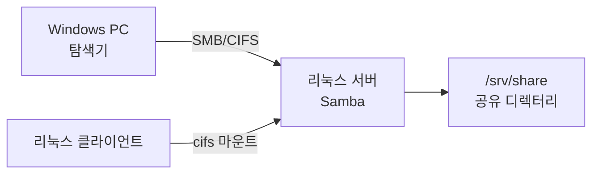
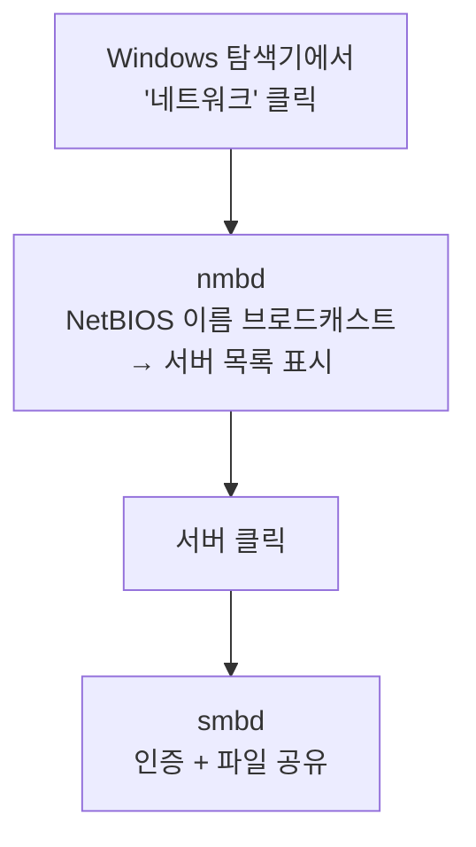
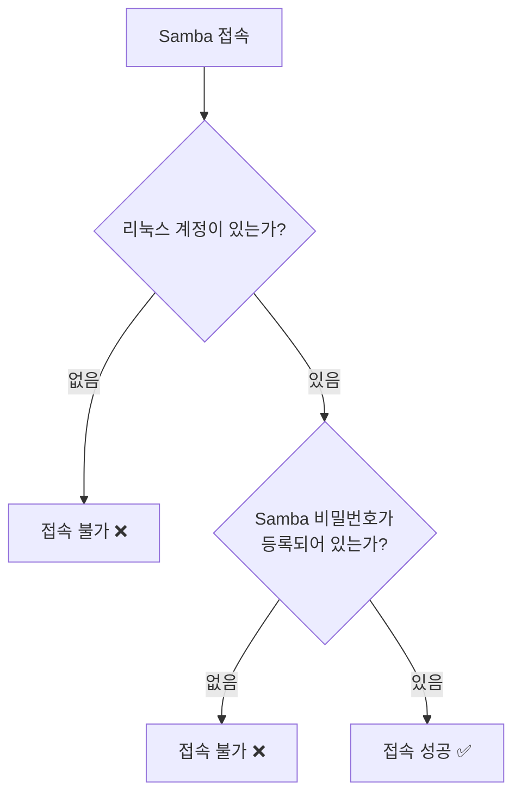

## 039. 파일 서비스 - Samba

### 1. Samba란

**Samba**는 리눅스/UNIX에서 **Windows의 파일·프린터 공유 프로토콜(SMB/CIFS)** 을 구현한 소프트웨어입니다.



#### NFS vs Samba (시험 출제)

| 구분 | **NFS** | **Samba** |
| --- | --- | --- |
| 주 대상 | **UNIX / Linux 간** | **Windows ↔ Linux** ⭐ |
| 프로토콜 | NFS (RPC 기반) | **SMB / CIFS** |
| 포트 | **2049** | **139 (NetBIOS), 445 (SMB)** ⭐ |
| 권한 기준 | **UID/GID** | **사용자 계정 + 비밀번호** |
| 인증 | 호스트(IP) 기반 | **사용자 인증 기반** ⭐ |
| 프린터 공유 | ✕ | **○** |

> **선택 기준**  
> 리눅스끼리만 쓴다면 **NFS**가 단순하고 빠릅니다.  
> **Windows 클라이언트가 있다면 반드시 Samba**를 써야 합니다.

#### SMB 버전

| 버전 | 특징 |
| --- | --- |
| SMB1 (CIFS) | **취약점 다수 — 사용 금지** ❗ (WannaCry 랜섬웨어가 악용) |
| SMB2 | 성능 개선 |
| **SMB3** | **암호화 지원**, 현재 표준 ⭐ |

---

### 2. 설치와 데몬 구조

```bash
$ sudo dnf install samba samba-client samba-common

$ sudo systemctl enable --now smb nmb
$ systemctl status smb

$ sudo firewall-cmd --add-service=samba --permanent
$ sudo firewall-cmd --reload
```

#### 주요 데몬 (시험 출제)

| 데몬 | 역할 | 포트 |
| --- | --- | --- |
| **`smbd`** | **파일·프린터 공유, 사용자 인증** ⭐ | **139, 445** |
| **`nmbd`** | **NetBIOS 이름 서비스** (네트워크 검색) | **137, 138** |
| `winbindd` | Windows 도메인 계정 연동 | — |



> **`nmbd`가 없으면 '네트워크'에서 서버가 안 보입니다.**  
> 다만 **`\\192.168.0.50` 처럼 직접 입력하면 접속됩니다.** (smbd만 있어도 동작)  
> 최신 환경은 NetBIOS 대신 **WS-Discovery**를 쓰므로 `nmbd` 없이도 운영하는 경우가 많습니다.

---

### 3. `smb.conf` 설정 (실기 핵심)

```bash
$ sudo vi /etc/samba/smb.conf
```

```ini
#==================== Global Settings ====================
[global]
    workgroup = WORKGROUP              # Windows 작업 그룹 ⭐
    server string = Samba File Server
    netbios name = LINUXSRV
    security = user                    # 보안 모드 ⭐
    map to guest = Bad User
    
    # 접근 제한 ⭐
    hosts allow = 192.168.0. 127.
    hosts deny  = ALL
    
    # 인터페이스 제한
    interfaces = lo enp0s3
    bind interfaces only = yes
    
    # 프로토콜 (SMB1 차단) ⭐
    server min protocol = SMB2
    
    # 로그
    log file = /var/log/samba/log.%m
    max log size = 50
    
    # 문자셋 (한글 파일명) ⭐
    unix charset = UTF-8
    dos charset = CP949

#==================== Share Definitions ====================
[homes]
    comment = Home Directories
    browseable = no                    # 목록에 표시 안 함
    writable = yes
    valid users = %S                   # 자기 홈만 접근

[public]
    comment = Public Share
    path = /srv/samba/public
    browseable = yes
    writable = yes
    guest ok = yes                     # 인증 없이 접근 ⭐
    create mask = 0664
    directory mask = 0775

[secure]
    comment = Secure Share
    path = /srv/samba/secure
    browseable = yes
    writable = yes
    valid users = @sambagroup smbuser  # 특정 사용자·그룹만 ⭐
    write list = smbuser
    create mask = 0660
    directory mask = 0770
```

#### `[global]` 주요 지시자

| 지시자 | 의미 |
| --- | --- |
| **`workgroup`** | **Windows 작업 그룹 이름** |
| `server string` | 서버 설명 |
| `netbios name` | NetBIOS 이름 |
| **`security`** | **인증 방식** (아래 표) |
| **`hosts allow` / `hosts deny`** | **접근 허용·거부 호스트** ⭐ |
| `log file` | 로그 경로 (`%m` = 클라이언트별) |
| `unix charset` / `dos charset` | 문자셋 (한글 처리) |

#### `security` 모드 (시험 출제)

| 값 | 의미 |
| --- | --- |
| **`user`** | **사용자 계정 + 비밀번호로 인증 (기본, 권장)** ⭐ |
| `share` | 공유별 비밀번호 (구버전, **현재 폐지**) |
| `domain` | Windows 도메인 컨트롤러에 인증 위임 |
| `ads` | Active Directory 연동 |

#### 공유 정의 지시자

| 지시자 | 의미 |
| --- | --- |
| **`path`** | **공유할 디렉터리 경로** ⭐ |
| **`browseable`** | **목록에 표시할지** (`no`면 숨김) |
| **`writable`** / `read only` | 쓰기 허용 여부 |
| **`guest ok`** / `public` | **인증 없이 접근 허용** |
| **`valid users`** | **접근 가능한 사용자·그룹** (`@그룹`) ⭐ |
| `invalid users` | 접근 금지 사용자 |
| `write list` | 쓰기 가능한 사용자 |
| `read list` | 읽기만 가능한 사용자 |
| **`create mask`** | 새 파일의 권한 |
| **`directory mask`** | 새 디렉터리의 권한 |
| `force user` / `force group` | 파일 소유자를 강제 지정 |

```bash
# ⭐ 설정 문법 검사 (변경 후 필수)
$ testparm
Load smb config files from /etc/samba/smb.conf
Loaded services file OK.

$ testparm -s              # 전체 설정 출력

$ sudo systemctl restart smb nmb
```

---

### 4. Samba 사용자 관리 (매우 중요)

**Samba 계정은 리눅스 계정과 별개**입니다.



> **핵심** : Samba 사용자는 **① 리눅스 계정이 먼저 존재**해야 하고,  
> **② 별도로 Samba 비밀번호를 등록**해야 합니다.  
> 리눅스 비밀번호와 **Samba 비밀번호는 서로 다릅니다.**

```bash
# ① 리눅스 계정 생성 (로그인은 막고 Samba만 쓰게)
$ sudo useradd -M -s /sbin/nologin smbuser
#              │   └── 셸 로그인 차단
#              └────── 홈 디렉터리 생성 안 함

# ② Samba 비밀번호 등록 ⭐
$ sudo smbpasswd -a smbuser
New SMB password:
Retype new SMB password:
Added user smbuser.

# ③ 계정 활성화
$ sudo smbpasswd -e smbuser

# 관리
$ sudo pdbedit -L                    # Samba 사용자 목록 ⭐
$ sudo pdbedit -L -v smbuser         # 상세 정보
$ sudo smbpasswd -d smbuser          # 비활성화
$ sudo smbpasswd -x smbuser          # 삭제
```

| 명령어 | 기능 |
| --- | --- |
| **`smbpasswd -a`** | **사용자 추가** ⭐ |
| `smbpasswd -e` | 활성화 (enable) |
| `smbpasswd -d` | 비활성화 (disable) |
| `smbpasswd -x` | 삭제 |
| **`pdbedit -L`** | **사용자 목록** |

---

### 5. 공유 디렉터리 준비

```bash
# 디렉터리 생성
$ sudo mkdir -p /srv/samba/{public,secure}

# 권한 설정
$ sudo chmod 777 /srv/samba/public
$ sudo chown -R smbuser:sambagroup /srv/samba/secure
$ sudo chmod 2770 /srv/samba/secure        # SetGID로 그룹 상속 ⭐

# ⭐⭐ SELinux 컨텍스트 (이것을 빠뜨리면 접근 불가)
$ sudo semanage fcontext -a -t samba_share_t "/srv/samba(/.*)?"
$ sudo restorecon -Rv /srv/samba

# 또는 Boolean 사용
$ sudo setsebool -P samba_export_all_rw on
$ sudo setsebool -P samba_enable_home_dirs on      # 홈 디렉터리 공유 시
```

> **Samba 문제의 절반 이상이 SELinux 때문입니다.**  
> 설정과 권한이 모두 맞는데 접근이 안 된다면 **`samba_share_t` 컨텍스트**를 확인하세요.
> ```bash
> $ ls -Z /srv/samba/public
> unconfined_u:object_r:samba_share_t:s0   public      ← 이렇게 나와야 정상
> ```

---

### 6. 클라이언트에서 접속

#### Windows에서

```
탐색기 주소창에 입력:
  \\192.168.0.50
  \\192.168.0.50\public
  \\LINUXSRV\secure

네트워크 드라이브 연결:
  마우스 오른쪽 → 네트워크 드라이브 연결 → Z: 지정
```

#### 리눅스에서

```bash
$ sudo dnf install cifs-utils samba-client

# ① 공유 목록 확인 ⭐
$ smbclient -L //192.168.0.50 -U smbuser
        Sharename       Type      Comment
        ---------       ----      -------
        public          Disk      Public Share
        secure          Disk      Secure Share

# 익명으로
$ smbclient -L //192.168.0.50 -N

# ② FTP 방식으로 접속
$ smbclient //192.168.0.50/public -U smbuser
smb: \> ls
smb: \> get file.txt
smb: \> put local.txt
smb: \> quit

# ③ 마운트 ⭐
$ sudo mkdir -p /mnt/smb
$ sudo mount -t cifs //192.168.0.50/public /mnt/smb -o username=smbuser
$ sudo mount -t cifs //192.168.0.50/public /mnt/smb \
    -o username=smbuser,password=pass,uid=1000,gid=1000,vers=3.0

$ df -hT | grep cifs
```

#### 자격 증명 파일 사용 (보안 권장)

비밀번호를 명령줄이나 fstab에 직접 쓰면 **다른 사용자에게 노출**됩니다.

```bash
$ sudo vi /etc/samba/credentials
username=smbuser
password=StrongPass123!
domain=WORKGROUP

$ sudo chmod 600 /etc/samba/credentials      # ❗권한 필수 ⭐
```

```bash
# /etc/fstab 등록
$ sudo vi /etc/fstab
//192.168.0.50/public  /mnt/smb  cifs  credentials=/etc/samba/credentials,_netdev,uid=1000,gid=1000  0 0

$ sudo mount -a          # 검증 ⭐
```

| 마운트 옵션 | 의미 |
| --- | --- |
| **`username`, `password`** | 인증 정보 |
| **`credentials=`** | **자격 증명 파일** (권장) ⭐ |
| `uid=`, `gid=` | **마운트된 파일의 소유자** 지정 |
| `file_mode=`, `dir_mode=` | 파일·디렉터리 권한 |
| `vers=3.0` | SMB 버전 |
| **`_netdev`** | **네트워크 준비 후 마운트** ⭐ |
| `iocharset=utf8` | 한글 파일명 처리 |

---

### 7. 프린터 공유

```ini
[global]
    load printers = yes
    printing = cups
    printcap name = cups

[printers]
    comment = All Printers
    path = /var/spool/samba
    browseable = no
    guest ok = yes
    writable = no
    printable = yes            # ⭐ 프린터 공유임을 표시

[print$]
    comment = Printer Drivers
    path = /var/lib/samba/drivers
    browseable = yes
    read only = yes
    write list = root
```

> **`printable = yes`** 가 있으면 파일 공유가 아니라 **프린터 공유**로 동작합니다.  
> `[print$]`는 Windows 클라이언트가 **드라이버를 자동으로 내려받는** 특수 공유입니다.

---

### 8. 문제 해결

| 증상 | 원인 | 확인·조치 |
| --- | --- | --- |
| **접속 자체가 안 됨** | 방화벽 / 서비스 | `systemctl status smb`, `firewall-cmd --list-all` |
| **인증 실패** | Samba 비밀번호 미등록 | **`pdbedit -L`** 로 확인 → `smbpasswd -a` ⭐ |
| **접근은 되는데 쓰기 불가** | 리눅스 권한 / **SELinux** ⭐ | `ls -lZ`, `semanage fcontext` |
| **네트워크에서 서버가 안 보임** | `nmbd` 미실행 | `systemctl status nmb` (IP 직접 입력은 됨) |
| **한글 파일명 깨짐** | 문자셋 | `unix charset = UTF-8` |
| Windows에서 접속 거부 | SMB1 차단 | `server min protocol = SMB2` 확인 |

```bash
# 진단 순서
$ testparm                                   # ① 설정 문법 ⭐
$ systemctl status smb nmb                   # ② 서비스
$ sudo ss -tulnp | grep -E ':(139|445)'      # ③ 포트 LISTEN
$ sudo pdbedit -L                            # ④ Samba 사용자 ⭐
$ smbclient -L localhost -U smbuser          # ⑤ 로컬 접속 테스트
$ ls -lZ /srv/samba/public                   # ⑥ 권한 + SELinux ⭐
$ sudo tail -f /var/log/samba/log.smbd       # ⑦ 로그
$ sudo ausearch -m avc -ts recent            # ⑧ SELinux 거부 로그
```

#### SELinux 관련 필수 정리

```bash
# 컨텍스트 확인
$ ls -Z /srv/samba/public
unconfined_u:object_r:samba_share_t:s0   public       ← 정상

# 잘못된 경우 수정 ⭐
$ sudo semanage fcontext -a -t samba_share_t "/srv/samba(/.*)?"
$ sudo restorecon -Rv /srv/samba

# 주요 Boolean
$ getsebool -a | grep samba
$ sudo setsebool -P samba_export_all_rw on        # 모든 경로 읽기·쓰기
$ sudo setsebool -P samba_enable_home_dirs on     # 홈 디렉터리 공유
$ sudo setsebool -P samba_share_nfs on            # NFS 마운트 경로 공유
```

---

### 9. 보안 권장 사항

| 항목 | 설정 |
| --- | --- |
| **SMB1 차단** | **`server min protocol = SMB2`** ⭐ |
| **접근 IP 제한** | **`hosts allow = 192.168.0.`** |
| 인터페이스 제한 | `interfaces`, `bind interfaces only = yes` |
| 게스트 접근 최소화 | 꼭 필요한 공유만 `guest ok = yes` |
| 로그인 셸 차단 | `useradd -s /sbin/nologin` |
| 암호화 (SMB3) | `smb encrypt = required` |
| 방화벽 | 내부망만 445 허용 |
| 자격 증명 파일 | **권한 600** |

```ini
[global]
    server min protocol = SMB2
    smb encrypt = desired
    hosts allow = 192.168.0. 127.
    hosts deny = ALL
    restrict anonymous = 2
```

> **SMB1을 반드시 차단해야 하는 이유**  
> 2017년 **WannaCry 랜섬웨어**가 SMB1의 취약점(EternalBlue)을 악용해  
> 전 세계 수십만 대의 시스템을 감염시켰습니다.  
> 현재 Windows도 SMB1을 기본 비활성화합니다.

---

### 10. Samba를 도메인 컨트롤러로 (참고)

Samba 4부터는 **Active Directory 도메인 컨트롤러** 역할도 가능합니다.

```bash
$ sudo samba-tool domain provision --use-rfc2307 --interactive
$ sudo systemctl enable --now samba
$ sudo samba-tool user create newuser
$ sudo samba-tool user list
```

> 소규모 조직에서 **Windows Server 없이 AD 환경을 구성**할 수 있습니다.  
> 시험 범위는 아니지만 실무에서 활용도가 높습니다.

---

### 시험 포인트 정리

| 항목 | 핵심 |
| --- | --- |
| Samba 프로토콜 | **SMB / CIFS** |
| **Samba 포트** | **139 (NetBIOS), 445 (SMB)** ⭐ |
| **`smbd`** | **파일·프린터 공유, 인증** |
| **`nmbd`** | **NetBIOS 이름 서비스 (137, 138)** |
| **설정 파일** | **`/etc/samba/smb.conf`** ⭐ |
| **설정 검사** | **`testparm`** ⭐ |
| **`security = user`** | **사용자 인증 (기본·권장)** |
| `workgroup` | Windows 작업 그룹 |
| **`path`** | 공유 디렉터리 |
| **`browseable`** | 목록 표시 여부 |
| **`valid users`** | 접근 허용 사용자 (`@그룹`) |
| **`guest ok`** | 인증 없이 접근 |
| `printable = yes` | **프린터 공유** |
| **Samba 사용자 추가** | **`smbpasswd -a`** ⭐ |
| **사용자 목록** | **`pdbedit -L`** |
| 전제 조건 | **리눅스 계정이 먼저 존재해야 함** ⭐ |
| 공유 목록 조회 | **`smbclient -L`** |
| 리눅스에서 마운트 | **`mount -t cifs`** |
| 자격 증명 파일 | `credentials=`, **권한 600** |
| SELinux 타입 | **`samba_share_t`** ⭐ |
| SELinux Boolean | `samba_export_all_rw` |
| SMB1 | **취약 — 차단해야 함** |
| NFS vs Samba | **UNIX 간 vs Windows 연동** |

---

### 한 줄 정리

Samba는 **Windows와 파일·프린터를 공유하는 SMB/CIFS 구현체(포트 139·445)** 로  
**`smbd`(공유·인증)와 `nmbd`(이름 서비스)** 두 데몬이 동작하며,  
**`/etc/samba/smb.conf`를 `testparm`으로 검사**하고,  
사용자는 **리눅스 계정 생성 후 반드시 `smbpasswd -a`로 별도 등록**해야 하며,  
접근이 안 될 때는 **SELinux `samba_share_t` 컨텍스트**를 확인해야 합니다.
