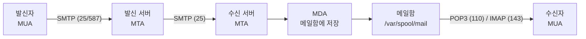
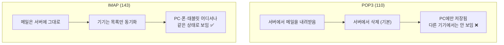
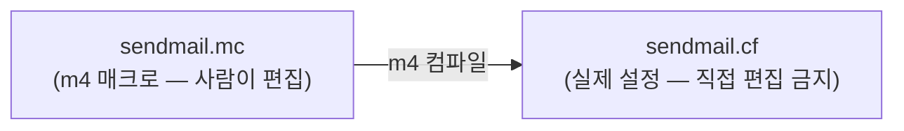
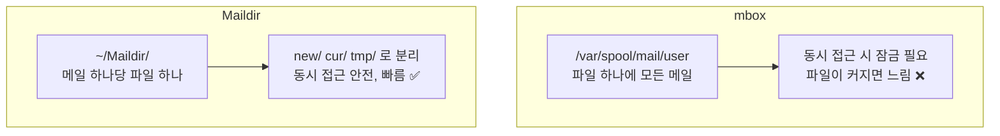
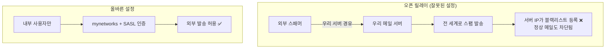
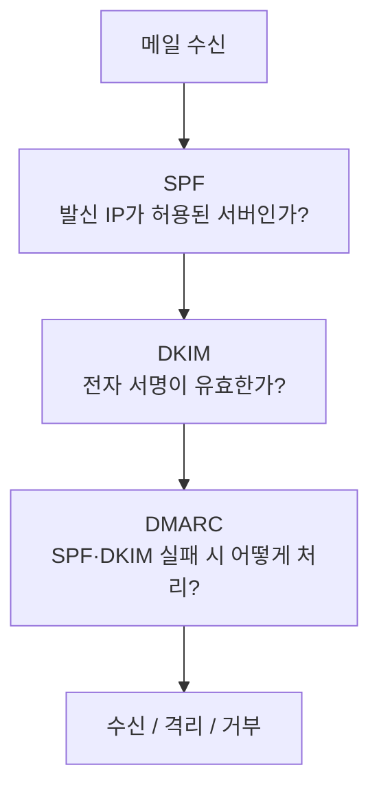

## 041. 메일 서비스

### 1. 메일이 전달되는 전체 과정

메일 시스템은 **여러 역할이 협력**하여 동작합니다.



#### 구성 요소 (시험 필수)

| 약어 | 정식 명칭 | 역할 | 예 |
| --- | --- | --- | --- |
| **MUA** | Mail **User** Agent | **사용자가 쓰는 메일 프로그램** | Outlook, Thunderbird, `mail` |
| **MTA** | Mail **Transfer** Agent | **메일을 서버 간 전송** ⭐ | **Sendmail, Postfix, Exim** |
| **MDA** | Mail **Delivery** Agent | **최종적으로 메일함에 배달** | Procmail, Dovecot LDA, maildrop |
| MRA | Mail Retrieval Agent | 사용자가 메일을 가져감 | Dovecot (POP3/IMAP) |

> **암기 팁**  
> **U**ser = 사용자 프로그램 / **T**ransfer = 전송(서버 간) / **D**elivery = 배달(메일함에 저장)

---

### 2. 메일 관련 프로토콜 (시험 최다 출제)

| 프로토콜 | 포트 | 역할 | 방향 |
| --- | --- | --- | --- |
| **SMTP** | **25** | **메일 발송·전송** | **보내기** ⭐ |
| SMTP (Submission) | **587** | 클라이언트 → 서버 제출 (인증 필수) |  |
| SMTPS | 465 | SMTP + SSL |  |
| **POP3** | **110** | **메일 수신** (**내려받고 서버에서 삭제**) | **받기** ⭐ |
| POP3S | 995 | POP3 + SSL |  |
| **IMAP** | **143** | **메일 수신** (**서버에 보관·동기화**) | **받기** ⭐ |
| IMAPS | 993 | IMAP + SSL |  |

#### POP3 vs IMAP (반드시 구분)



| 구분 | **POP3** | **IMAP** |
| --- | --- | --- |
| 저장 위치 | **로컬(PC)** | **서버** ⭐ |
| 서버의 원본 | 삭제 (기본) | **유지** |
| 여러 기기 사용 | 불편 ❌ | **편리** ✅ |
| 폴더 관리 | 로컬에서만 | **서버에서 동기화** |
| 오프라인 사용 | 유리 | 캐시 필요 |
| 서버 용량 | 적게 사용 | 많이 사용 |
| 현재 주류 | — | **IMAP** ⭐ |

> **스마트폰이 보급되면서 IMAP이 표준이 되었습니다.**  
> POP3는 PC에서 메일을 받으면 폰에서는 볼 수 없어 사용이 불편합니다.

#### MIME

**MIME(Multipurpose Internet Mail Extensions)** 는 메일에 **첨부파일·이미지·한글** 등을 담기 위한 표준입니다.

> 원래 SMTP는 **7비트 ASCII 텍스트만** 전송할 수 있었습니다.  
> MIME이 **바이너리 데이터를 텍스트로 인코딩(Base64)** 하여 전송할 수 있게 해 줍니다.  
> 한글 메일과 첨부파일이 가능한 이유가 MIME입니다.

---

### 3. Sendmail

전통적인 MTA로, **역사가 길지만 설정이 복잡**합니다.

```bash
$ sudo dnf install sendmail sendmail-cf m4
$ sudo systemctl enable --now sendmail
```

#### 설정 구조 (시험 출제)



| 파일 | 역할 |
| --- | --- |
| **`/etc/mail/sendmail.mc`** | **관리자가 편집하는 매크로 파일** ⭐ |
| **`/etc/mail/sendmail.cf`** | **실제 설정 파일 (자동 생성 — 직접 수정 금지)** ⭐ |
| **`/etc/mail/access`** | **접근 제어 (릴레이 허용·차단)** ⭐ |
| **`/etc/mail/local-host-names`** | 수신할 도메인 목록 |
| **`/etc/aliases`** | **메일 별칭** ⭐ |
| `/etc/mail/virtusertable` | 가상 사용자 매핑 |

```bash
# 설정 변경 절차 ⭐
$ sudo vi /etc/mail/sendmail.mc
# 외부 접속 허용 (기본은 127.0.0.1만)
dnl DAEMON_OPTIONS(`Port=smtp,Addr=127.0.0.1, Name=MTA')dnl
#  └── 앞에 dnl 을 붙이면 주석 처리 = 모든 IP에서 수신

# .mc → .cf 변환 ⭐
$ sudo m4 /etc/mail/sendmail.mc > /etc/mail/sendmail.cf
# 또는
$ cd /etc/mail && sudo make

$ sudo systemctl restart sendmail
```

> **`dnl`은 sendmail 매크로의 주석 표시**입니다. (delete to new line)  
> `dnl`을 붙이면 그 줄이 무시됩니다.

#### `access` — 릴레이 제어

```bash
$ sudo vi /etc/mail/access
Connect:localhost          RELAY
Connect:192.168.0          RELAY
Connect:spam-domain.com    REJECT
Connect:203.0.113.55       DISCARD

# ⭐ 텍스트 파일을 DB로 변환해야 적용됨
$ sudo makemap hash /etc/mail/access < /etc/mail/access
# 또는
$ cd /etc/mail && sudo make
```

| 값 | 의미 |
| --- | --- |
| **`RELAY`** | **중계 허용** |
| `OK` | 수신 허용 |
| **`REJECT`** | 거부 (거부 메시지 전송) |
| `DISCARD` | 조용히 폐기 |

#### `/etc/aliases` — 메일 별칭

```bash
$ sudo vi /etc/aliases
postmaster:     root
root:           admin@example.com
webmaster:      dev1, dev2, dev3           # 여러 명에게 전달
support:        /var/mail/support-archive  # 파일에 저장
sales:          "|/usr/local/bin/process"  # 프로그램에 전달

# ⭐ 반드시 실행해야 적용됨
$ sudo newaliases
# 또는
$ sudo sendmail -bi
```

> **`newaliases`를 실행하지 않으면 적용되지 않습니다.**  
> 텍스트 파일(`/etc/aliases`)을 **DB 파일(`/etc/aliases.db`)로 변환**하는 명령입니다.  
> 시험에 자주 나옵니다.

---

### 4. Postfix (현재 주류)

Sendmail의 복잡함과 보안 문제를 개선한 MTA로, **현재 대부분의 배포판 기본값**입니다.

```bash
$ sudo dnf install postfix
$ sudo systemctl enable --now postfix
```

#### Sendmail vs Postfix

| 구분 | **Sendmail** | **Postfix** |
| --- | --- | --- |
| 설정 난이도 | **매우 복잡** (m4 매크로) | **간단** (`key = value`) ⭐ |
| 구조 | 단일 거대 프로세스 | **여러 작은 프로세스로 분리** |
| 보안 | 취약점 이력 많음 | **권한 분리로 안전** ⭐ |
| 성능 | 보통 | **우수** |
| 현재 | 레거시 | **기본** ⭐ |

> **Postfix가 더 안전한 이유**  
> Sendmail은 **하나의 거대한 프로세스가 root 권한으로** 모든 일을 처리했습니다.  
> 취약점 하나가 곧 **시스템 전체 장악**으로 이어졌습니다.  
> Postfix는 **역할별로 프로세스를 분리**하고 대부분을 **낮은 권한으로 실행**하여,  
> 한 부분이 뚫려도 피해가 제한됩니다.

#### 주요 설정

```bash
$ sudo vi /etc/postfix/main.cf
```

```ini
myhostname = mail.example.com          # 이 서버의 호스트명 ⭐
mydomain = example.com                 # 도메인 ⭐
myorigin = $mydomain                   # 발신 주소의 도메인
inet_interfaces = all                  # 수신 인터페이스 ⭐ (기본: localhost)
inet_protocols = ipv4
mydestination = $myhostname, localhost.$mydomain, localhost, $mydomain   # 수신할 도메인 ⭐
mynetworks = 127.0.0.0/8, 192.168.0.0/24        # 릴레이 허용 네트워크 ⭐
relay_domains = 
home_mailbox = Maildir/                # 메일함 형식 ⭐
message_size_limit = 20971520          # 최대 메일 크기 (20MB)
mailbox_size_limit = 0                 # 메일함 크기 제한 없음

# SMTP 인증 (외부 발송 시 필수)
smtpd_sasl_auth_enable = yes
smtpd_sasl_type = dovecot
smtpd_sasl_path = private/auth
smtpd_recipient_restrictions =
    permit_mynetworks,
    permit_sasl_authenticated,
    reject_unauth_destination           # ⭐ 오픈 릴레이 방지
```

| 설정 | 의미 |
| --- | --- |
| **`myhostname`** | 서버의 정식 호스트명 |
| **`mydomain`** | 도메인 |
| **`inet_interfaces`** | **수신할 인터페이스** (`all` = 외부 허용) ⭐ |
| **`mydestination`** | **내 서버가 최종 수신할 도메인** ⭐ |
| **`mynetworks`** | **릴레이를 허용할 네트워크** ⭐ |
| **`home_mailbox`** | 메일함 형식·위치 |
| `message_size_limit` | 최대 메일 크기 |

```bash
$ sudo postfix check                   # 설정 검사 ⭐
$ sudo postconf -n                     # 기본값과 다른 설정만 출력 ⭐
$ sudo systemctl reload postfix
```

#### 메일함 형식 — mbox vs Maildir (시험 출제)



| 구분 | **mbox** | **Maildir** |
| --- | --- | --- |
| 저장 방식 | **파일 하나에 전부** | **메일 하나당 파일 하나** |
| 위치 | **`/var/spool/mail/사용자`** | **`~/Maildir/`** |
| 동시성 | 잠금 필요 (충돌 위험) | **안전** ✅ |
| 성능 | 메일이 많으면 느림 | **빠름** |
| 백업 | 파일 하나 | 파일 다수 |
| 권장 | — | **Maildir** ⭐ |

```bash
# Maildir 사용 설정
$ sudo postconf -e "home_mailbox = Maildir/"
$ sudo systemctl restart postfix
```

---

### 5. Dovecot — POP3/IMAP 서버

MTA는 메일을 **받기만** 합니다. 사용자가 **가져가려면 Dovecot** 같은 서버가 필요합니다.

```bash
$ sudo dnf install dovecot
$ sudo vi /etc/dovecot/dovecot.conf
```

```ini
protocols = imap pop3 lmtp
listen = *
```

```bash
$ sudo vi /etc/dovecot/conf.d/10-mail.conf
mail_location = maildir:~/Maildir            # ⭐ Postfix 설정과 일치해야 함

$ sudo vi /etc/dovecot/conf.d/10-auth.conf
disable_plaintext_auth = yes
auth_mechanisms = plain login

$ sudo systemctl enable --now dovecot

# 방화벽
$ sudo firewall-cmd --add-service=pop3 --add-service=imap --permanent
$ sudo firewall-cmd --add-service=pop3s --add-service=imaps --permanent
$ sudo firewall-cmd --reload
```

> **Postfix의 `home_mailbox`와 Dovecot의 `mail_location`이 일치해야 합니다.**  
> 한쪽은 mbox, 다른 쪽은 Maildir이면 **메일은 저장되는데 보이지 않는** 현상이 발생합니다.  
> 실무에서 자주 겪는 문제입니다.

---

### 6. 메일 명령어

```bash
# 메일 보내기
$ echo "본문입니다" | mail -s "제목" user@example.com
$ mail -s "제목" user@example.com < file.txt
$ mail -s "제목" -a attach.pdf user@example.com < body.txt

# 메일 읽기
$ mail
$ mailx

# 메일 큐 확인 ⭐
$ mailq
$ postqueue -p                      # Postfix
$ sendmail -bp                      # Sendmail

# 큐 처리
$ sudo postqueue -f                 # 즉시 재전송 시도
$ sudo postsuper -d ALL             # 큐 전체 삭제 ⭐
$ sudo postsuper -d QUEUEID         # 특정 메일 삭제
$ sudo postsuper -r ALL             # 재큐잉

# 로그 확인 ⭐
$ sudo tail -f /var/log/maillog
```

#### 전송 테스트 (telnet)

```bash
$ telnet localhost 25
220 mail.example.com ESMTP Postfix
HELO test.com
250 mail.example.com
MAIL FROM: <sender@example.com>
250 2.1.0 Ok
RCPT TO: <user@example.com>
250 2.1.5 Ok
DATA
354 End data with <CR><LF>.<CR><LF>
Subject: Test Mail

This is a test.
.
250 2.0.0 Ok: queued as ABC123
QUIT
```

> **SMTP 명령을 직접 입력해 보면 프로토콜 동작이 명확히 이해됩니다.**  
> 실무에서도 메일 서버 문제를 진단할 때 자주 사용합니다.  
> 마지막에 **점(`.`) 하나만 있는 줄**이 본문의 끝을 의미합니다.

---

### 7. 오픈 릴레이 — 반드시 막아야 할 설정



**오픈 릴레이**는 **아무나 우리 서버를 통해 메일을 보낼 수 있는 상태**입니다.

```ini
# Postfix — 오픈 릴레이 방지 ⭐
mynetworks = 127.0.0.0/8, 192.168.0.0/24
smtpd_recipient_restrictions =
    permit_mynetworks,
    permit_sasl_authenticated,
    reject_unauth_destination          # ⭐ 이 줄이 핵심
```

```bash
# 오픈 릴레이 테스트
$ telnet mail.example.com 25
MAIL FROM: <spam@outside.com>
RCPT TO: <victim@another.com>
554 5.7.1 Relay access denied           ← ✅ 정상 (차단됨)
250 2.1.5 Ok                            ← ❌ 오픈 릴레이! 즉시 수정 필요
```

> **오픈 릴레이의 결과**  
> 서버 IP가 **RBL(실시간 블랙리스트)에 등록**되어  
> **정상적인 업무 메일까지 전 세계에서 차단**됩니다.  
> 한번 등록되면 해제에 오랜 시간이 걸립니다.

---

### 8. 스팸 방지 기술 (시험 출제)



| 기술 | 방식 | 확인 대상 |
| --- | --- | --- |
| **SPF** (Sender Policy Framework) | **DNS TXT에 발송 허용 IP 등록** | **발신 서버 IP** ⭐ |
| **DKIM** (DomainKeys Identified Mail) | **메일에 전자 서명**, 공개키는 DNS에 | **내용 위조 여부** ⭐ |
| **DMARC** | SPF·DKIM 실패 시 **처리 정책 지정** | 정책 |
| RBL / DNSBL | 스팸 발송 IP 블랙리스트 조회 | 발신 IP |
| Greylisting | 처음 온 메일을 **일시 거부** 후 재시도 확인 | 재전송 여부 |

```dns
; SPF — 이 도메인의 메일은 이 IP에서만 발송됨
example.com.  IN TXT  "v=spf1 ip4:203.0.113.5 include:_spf.google.com -all"
                                                                        │
                                                    -all = 나머지는 거부 ⭐

; DMARC — SPF/DKIM 실패 시 격리
_dmarc.example.com. IN TXT "v=DMARC1; p=quarantine; rua=mailto:dmarc@example.com"
```

> **왜 세 가지가 모두 필요할까?**  
> **SPF** : "이 IP에서 보낸 게 맞나?" → 하지만 **전달(forward)되면 실패**  
> **DKIM** : "내용이 위조되지 않았나?" → 서명으로 확인  
> **DMARC** : "SPF와 DKIM이 실패하면 어떻게 할까?" → 정책 결정  
>
> 세 가지를 함께 설정해야 **도메인 사칭(스푸핑) 메일을 효과적으로 차단**할 수 있습니다.

```bash
# 확인
$ dig example.com TXT +short
$ dig _dmarc.example.com TXT +short
```

---

### 9. 메일 서버 보안

```ini
# ────────── TLS 암호화 (필수) ⭐ ──────────
smtpd_tls_cert_file = /etc/pki/tls/certs/mail.crt
smtpd_tls_key_file = /etc/pki/tls/private/mail.key
smtpd_tls_security_level = may
smtpd_tls_protocols = !SSLv2, !SSLv3, !TLSv1, !TLSv1.1

# ────────── 인증 필수 ──────────
smtpd_sasl_auth_enable = yes
smtpd_tls_auth_only = yes              # TLS 위에서만 인증 허용 ⭐

# ────────── 접속 제한 ──────────
smtpd_client_connection_rate_limit = 10
smtpd_client_message_rate_limit = 30
anvil_rate_time_unit = 60s

# ────────── 헤더 정보 숨김 ──────────
smtpd_banner = $myhostname ESMTP
```

| 보안 항목 | 조치 |
| --- | --- |
| **오픈 릴레이 차단** | **`reject_unauth_destination`** ⭐ |
| **TLS 암호화** | `smtpd_tls_security_level` |
| **인증 요구** | SASL + `smtpd_tls_auth_only` |
| 발송량 제한 | `rate_limit` |
| SPF/DKIM/DMARC | DNS 설정 |
| 바이러스·스팸 검사 | ClamAV + SpamAssassin |

```bash
# 스팸·바이러스 필터
$ sudo dnf install spamassassin clamav clamav-update amavisd-new
```

---

### 10. 문제 해결

| 증상 | 원인 | 확인·조치 |
| --- | --- | --- |
| **메일이 안 나감** | 큐에 쌓임 / DNS | **`mailq`**, `/var/log/maillog` ⭐ |
| **외부에서 수신 안 됨** | `inet_interfaces=localhost` | `all`로 변경 |
| **메일은 왔는데 안 보임** | **mbox/Maildir 불일치** ⭐ | Postfix·Dovecot 설정 일치 확인 |
| Relay access denied | `mynetworks` 미포함 | 네트워크 추가 또는 SASL 인증 |
| 스팸으로 분류됨 | **SPF/DKIM 미설정** | DNS 레코드 추가 ⭐ |
| POP3/IMAP 접속 불가 | Dovecot / 방화벽 | `systemctl status dovecot` |

```bash
# 진단 순서
$ systemctl status postfix dovecot            # ①
$ sudo postfix check                          # ② 설정 검사 ⭐
$ sudo ss -tulnp | grep -E ':(25|110|143)'    # ③ 포트
$ mailq                                       # ④ 큐 확인 ⭐
$ sudo tail -50 /var/log/maillog              # ⑤ 로그 ⭐
$ dig example.com MX +short                   # ⑥ MX 레코드 ⭐
$ telnet localhost 25                         # ⑦ SMTP 직접 테스트
```

> **`/var/log/maillog`가 모든 답을 가지고 있습니다.**  
> 메일 문제는 거의 항상 이 로그에 원인이 기록됩니다.  
> `status=sent`, `status=bounced`, `status=deferred` 를 보고 판단합니다.

```bash
# MX 레코드 확인 (메일 서버 지정) ⭐
$ dig example.com MX +short
10 mail.example.com.
    │
    └── 우선순위 (숫자가 작을수록 우선)
```

---

### 시험 포인트 정리

| 항목 | 핵심 |
| --- | --- |
| **MUA** | 사용자 메일 프로그램 |
| **MTA** | **메일 전송 (Sendmail, Postfix)** ⭐ |
| **MDA** | 메일함에 배달 (Procmail) |
| **SMTP** | **25 — 발송** ⭐ |
| SMTP Submission | 587 |
| **POP3** | **110 — 내려받고 서버에서 삭제** ⭐ |
| **IMAP** | **143 — 서버에 보관·동기화** ⭐ |
| POP3S / IMAPS | 995 / 993 |
| MIME | **첨부파일·한글 지원** |
| Sendmail 편집 파일 | **`sendmail.mc`** (`.cf`는 자동 생성) ⭐ |
| `.mc` → `.cf` | **`m4`** 명령 |
| Sendmail 접근 제어 | **`/etc/mail/access`** + **`makemap`** |
| **메일 별칭** | **`/etc/aliases`** + **`newaliases`** ⭐ |
| Postfix 주 설정 | **`/etc/postfix/main.cf`** |
| Postfix 설정 확인 | **`postconf -n`**, `postfix check` |
| **`mynetworks`** | **릴레이 허용 네트워크** |
| **`mydestination`** | 최종 수신 도메인 |
| **mbox** | `/var/spool/mail/사용자` — 파일 하나 |
| **Maildir** | `~/Maildir/` — 메일당 파일 하나 ⭐ |
| POP3/IMAP 서버 | **Dovecot** |
| 메일 큐 확인 | **`mailq`**, `postqueue -p` |
| 메일 로그 | **`/var/log/maillog`** ⭐ |
| **오픈 릴레이 방지** | **`reject_unauth_destination`** ⭐ |
| **SPF** | DNS TXT — **발신 IP 검증** |
| **DKIM** | **전자 서명 — 위조 검증** |
| **DMARC** | 실패 시 **처리 정책** |
| 메일 서버 지정 | **MX 레코드** |

---

### 한 줄 정리

메일은 **MUA → MTA(SMTP 25) → MDA → 메일함 → POP3(110)/IMAP(143)** 순으로 전달되며,  
**POP3는 내려받고 삭제, IMAP은 서버에 보관·동기화**가 핵심 차이이고,  
Sendmail은 **`sendmail.mc`를 `m4`로 컴파일**하고 별칭은 **`newaliases`** 로 적용하며,  
**오픈 릴레이는 반드시 차단(`reject_unauth_destination`)** 하고 **SPF·DKIM·DMARC**로 스푸핑을 방지해야 합니다.
