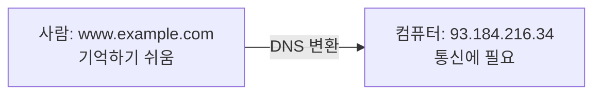
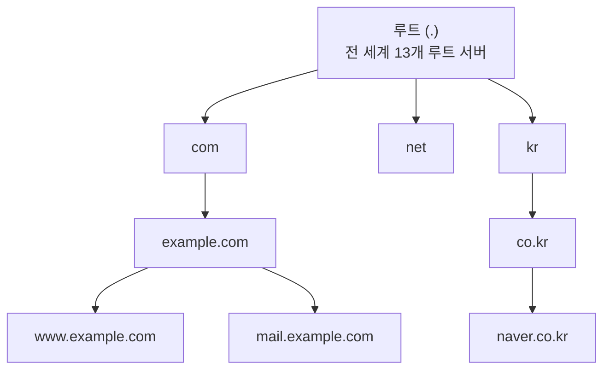
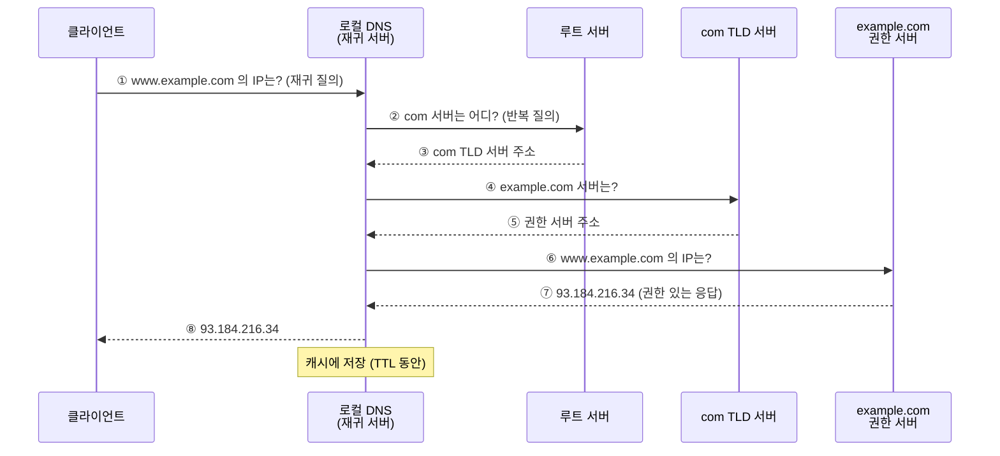
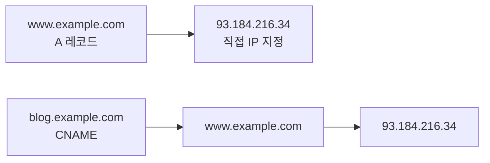
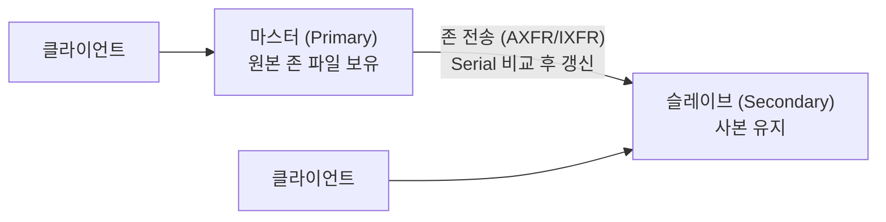
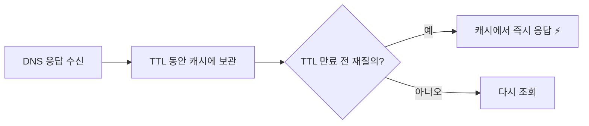
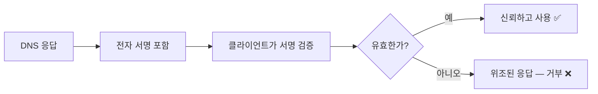

## 042. DNS 서비스

### 1. DNS가 하는 일

**DNS(Domain Name System)** 는 **도메인 이름을 IP 주소로 변환**하는 시스템입니다.



#### DNS가 없다면?

- IP 주소를 **전부 외워야** 합니다.
- 서버를 이전해 IP가 바뀌면 **모든 사용자에게 알려야** 합니다.
- 부하 분산이나 지역별 서버 안내가 불가능합니다.

> **DNS의 진짜 가치는 "이름과 주소의 분리"** 입니다.  
> 서버 IP가 바뀌어도 **DNS 레코드만 수정하면** 사용자는 아무것도 몰라도 됩니다.

---

### 2. DNS 계층 구조

DNS는 **전 세계가 하나의 거대한 트리**로 구성되어 있습니다.



```
www.example.com.
 │      │     │ │
 │      │     │ └── 루트 (생략 가능, 실제로는 점이 있음)
 │      │     └──── TLD (Top Level Domain)
 │      └────────── 2차 도메인 (조직)
 └───────────────── 호스트명
```

| 계층 | 예 | 관리 주체 |
| --- | --- | --- |
| **루트(Root)** | `.` | **전 세계 13개 루트 서버 그룹** |
| **TLD** | `com`, `net`, `org`, `kr` | 각 레지스트리 |
| **2차 도메인** | `example.com` | 도메인 소유자 |
| **호스트** | `www`, `mail` | 도메인 소유자 |

| TLD 종류 | 예 |
| --- | --- |
| **gTLD** (일반) | `com`, `net`, `org`, `edu`, `gov`, `mil` |
| **ccTLD** (국가) | `kr`, `jp`, `us`, `cn` |
| 신규 gTLD | `app`, `dev`, `shop` |

---

### 3. DNS 질의 과정 (시험 최다 출제)



#### 재귀 질의 vs 반복 질의 (반드시 구분)

| 구분 | **재귀 질의 (Recursive)** | **반복 질의 (Iterative)** |
| --- | --- | --- |
| 누가 | **클라이언트 → 로컬 DNS** | **로컬 DNS → 다른 DNS 서버들** |
| 요청 내용 | **"답을 찾아서 알려 줘"** | "네가 아는 만큼만 알려 줘" |
| 응답 | **최종 답** | **다음에 물어볼 서버 주소** |
| 부담 | 로컬 DNS가 전부 처리 | 각 서버는 아는 것만 답변 |

> **핵심** : 클라이언트는 **재귀 질의 한 번**만 보내면 되고,  
> **로컬 DNS 서버가 반복 질의를 여러 번** 수행하여 답을 찾아옵니다.

#### DNS 서버의 종류

| 종류 | 역할 |
| --- | --- |
| **Root Name Server** | 최상위, TLD 서버 위치를 안내 (**전 세계 13개**) |
| **TLD Name Server** | `com`, `kr` 등을 관리 |
| **Authoritative (권한) 서버** | **해당 도메인의 실제 정보를 보유** ⭐ |
| **Recursive / Caching 서버** | 사용자의 질의를 대신 처리하고 **캐시** (통신사 DNS, 8.8.8.8) |
| **Master (Primary)** | 원본 존 파일 보유 |
| **Slave (Secondary)** | 마스터에서 **존 전송(Zone Transfer)** 으로 복제 |

---

### 4. DNS 레코드 타입 (시험 필수 암기)

| 타입 | 이름 | 용도 |
| --- | --- | --- |
| **`A`** | Address | **도메인 → IPv4 주소** ⭐ |
| **`AAAA`** | — | **도메인 → IPv6 주소** ⭐ |
| **`CNAME`** | Canonical Name | **별칭 → 다른 도메인** ⭐ |
| **`MX`** | Mail Exchanger | **메일 서버 지정 (우선순위 포함)** ⭐ |
| **`NS`** | Name Server | **이 도메인을 관리하는 네임 서버** ⭐ |
| **`PTR`** | Pointer | **IP → 도메인 (역방향 조회)** ⭐ |
| **`SOA`** | Start of Authority | **존의 시작·관리 정보** ⭐ |
| **`TXT`** | Text | 임의의 텍스트 (**SPF, DKIM, 소유권 확인**) |
| `SRV` | Service | 서비스 위치 (포트 포함) |
| `CAA` | — | 인증서 발급 기관 지정 |

#### `A` vs `CNAME` (자주 혼동)



```dns
www     IN  A      93.184.216.34        ; 직접 IP 지정
blog    IN  CNAME  www.example.com.     ; www를 가리킴 (한 단계 더 조회)
```

> **CNAME의 장점** : 서버 IP가 바뀌어도 **`www`의 A 레코드 하나만 수정**하면  
> `blog`, `shop` 등 모든 별칭이 자동으로 따라갑니다.
>
> **CNAME의 제약 (시험 출제)**  
> **도메인 최상위(`example.com` 자체)에는 CNAME을 쓸 수 없습니다.**  
> SOA·NS 레코드와 공존할 수 없기 때문입니다.

#### `MX` 레코드

```dns
example.com.  IN  MX  10  mail1.example.com.
example.com.  IN  MX  20  mail2.example.com.
                      │
                      └── 우선순위 (숫자가 작을수록 우선) ⭐
```

> **숫자가 작을수록 우선**입니다. `10`이 주 서버, `20`이 백업 서버입니다.  
> 헷갈리기 쉬운 부분이라 시험에 자주 나옵니다.

---

### 5. BIND 설치와 설정

**BIND(Berkeley Internet Name Domain)** 가 리눅스 표준 DNS 서버입니다.

```bash
$ sudo dnf install bind bind-utils
$ sudo systemctl enable --now named
$ systemctl status named

$ sudo firewall-cmd --add-service=dns --permanent
$ sudo firewall-cmd --reload
```

#### 주요 파일

| 경로 | 역할 |
| --- | --- |
| **`/etc/named.conf`** | **주 설정 파일** ⭐ |
| `/etc/named.rfc1912.zones` | 존 정의 (기본) |
| **`/var/named/`** | **존 파일 디렉터리** ⭐ |
| `/var/named/named.ca` | 루트 서버 목록 (힌트) |
| `/var/log/messages` | 로그 |

#### `/etc/named.conf`

```bash
$ sudo vi /etc/named.conf
```

```
options {
    listen-on port 53 { any; };              # 수신 인터페이스 ⭐
    listen-on-v6 port 53 { none; };
    directory       "/var/named";            # 존 파일 위치 ⭐
    dump-file       "/var/named/data/cache_dump.db";
    statistics-file "/var/named/data/named_stats.txt";

    allow-query     { any; };                # 질의 허용 대상 ⭐
    allow-transfer  { 192.168.0.51; };       # 존 전송 허용 (슬레이브만) ⭐
    recursion       yes;                     # 재귀 질의 허용 ⭐
    allow-recursion { 192.168.0.0/24; };     # 재귀 허용 대상 (중요) ⭐

    forwarders      { 8.8.8.8; 1.1.1.1; };   # 상위 DNS로 전달
    dnssec-validation yes;
};

zone "." IN {
    type hint;
    file "named.ca";
};

zone "example.com" IN {
    type master;                             # 마스터 서버 ⭐
    file "example.com.zone";
    allow-update { none; };
};

zone "0.168.192.in-addr.arpa" IN {           # 역방향 존 ⭐
    type master;
    file "0.168.192.rev";
    allow-update { none; };
};
```

| 설정 | 의미 |
| --- | --- |
| **`listen-on`** | 수신할 IP·포트 |
| **`directory`** | **존 파일이 있는 디렉터리** |
| **`allow-query`** | **질의를 허용할 대상** |
| **`allow-transfer`** | **존 전송 허용 대상 (슬레이브만)** ⭐ |
| **`recursion`** | 재귀 질의 허용 여부 |
| **`allow-recursion`** | **재귀 허용 대상** ⭐ |
| `forwarders` | 상위 DNS 서버 |
| `type master/slave/hint/forward` | 존 유형 |

> **`recursion yes` + `allow-recursion { any; }` 는 매우 위험합니다.**  
> **오픈 리졸버(Open Resolver)** 가 되어 **DNS 증폭 공격(DDoS)에 악용**됩니다.  
> 권한 서버라면 **`recursion no`**, 내부용이라면 **내부 대역만 허용**해야 합니다.

---

### 6. 존 파일 작성 (실기 핵심)

```bash
$ sudo vi /var/named/example.com.zone
```

```dns
$TTL 86400
@   IN  SOA  ns1.example.com. admin.example.com. (
                2026020701  ; Serial   — 변경할 때마다 증가 ⭐
                3600        ; Refresh  — 슬레이브 확인 주기
                1800        ; Retry    — 실패 시 재시도 간격
                604800      ; Expire   — 마스터 불통 시 만료
                86400 )     ; Minimum  — 부정 캐시 TTL

; ────────── 네임 서버 ──────────
@           IN  NS      ns1.example.com.
@           IN  NS      ns2.example.com.

; ────────── 메일 서버 ──────────
@           IN  MX  10  mail.example.com.
@           IN  MX  20  mail2.example.com.

; ────────── 호스트 ──────────
@           IN  A       192.168.0.50
ns1         IN  A       192.168.0.50
ns2         IN  A       192.168.0.51
www         IN  A       192.168.0.50
mail        IN  A       192.168.0.52
db          IN  A       192.168.0.53

; ────────── 별칭 ──────────
blog        IN  CNAME   www
ftp         IN  CNAME   www

; ────────── TXT (SPF) ──────────
@           IN  TXT     "v=spf1 ip4:192.168.0.52 -all"
```

#### SOA 레코드의 각 값 (시험 출제)

| 항목 | 의미 |
| --- | --- |
| **Serial** | **존 파일의 버전 번호 — 수정할 때마다 반드시 증가** ⭐ |
| **Refresh** | 슬레이브가 마스터를 **확인하는 주기** |
| **Retry** | 확인 실패 시 **재시도 간격** |
| **Expire** | 마스터와 통신 불가 시 **슬레이브 데이터 만료 시점** |
| **Minimum / TTL** | 응답의 **캐시 유지 시간** |

> **Serial을 증가시키지 않으면 슬레이브가 갱신하지 않습니다.**  
> 마스터에서 레코드를 바꿔도 **슬레이브는 옛 정보를 그대로 서비스**합니다.  
> 실무에서 가장 흔한 실수이며, 관례적으로 **`YYYYMMDDNN`** 형식을 씁니다.

#### 존 파일 문법 주의사항 (매우 중요)

| 규칙 | 설명 |
| --- | --- |
| **`.` (점)** | **FQDN 끝에는 반드시 점** — 없으면 도메인이 자동으로 붙음 ⭐ |
| `@` | 존 이름(`example.com.`)을 의미 |
| `;` | 주석 |
| `$TTL` | 기본 TTL |
| `IN` | 인터넷 클래스 |

```dns
www  IN  A  192.168.0.50
mail IN  CNAME  www.example.com.     ; ✅ 점이 있음 → www.example.com
mail IN  CNAME  www.example.com      ; ❌ 점이 없음 → www.example.com.example.com !
```

> **끝의 점(`.`)을 빠뜨리는 것이 가장 흔한 실수**입니다.  
> 점이 없으면 **존 이름이 자동으로 뒤에 붙어** 엉뚱한 도메인이 됩니다.

#### 역방향 존 파일

```bash
$ sudo vi /var/named/0.168.192.rev
```

```dns
$TTL 86400
@   IN  SOA  ns1.example.com. admin.example.com. (
                2026020701 3600 1800 604800 86400 )

@       IN  NS   ns1.example.com.

50      IN  PTR  www.example.com.        ; 192.168.0.50 → www
51      IN  PTR  ns2.example.com.
52      IN  PTR  mail.example.com.
│
└── 호스트 부분만 씀 (192.168.0. 은 존 이름에 포함)
```

> **역방향 존 이름은 IP를 거꾸로** 씁니다.  
> `192.168.0.x` → **`0.168.192.in-addr.arpa`**  
> 도메인은 오른쪽이 상위이므로 IP도 뒤집어야 계층이 맞습니다.

> **역방향 조회(PTR)가 필요한 이유**  
> 많은 **메일 서버가 발신 IP의 PTR 레코드를 확인**합니다.  
> PTR이 없으면 **스팸으로 분류**되는 경우가 많습니다.

---

### 7. 설정 검증과 적용

```bash
# ⭐ named.conf 문법 검사
$ sudo named-checkconf
$ sudo named-checkconf -z          # 존 파일까지 검사

# ⭐ 존 파일 문법 검사
$ sudo named-checkzone example.com /var/named/example.com.zone
zone example.com/IN: loaded serial 2026020701
OK

$ sudo named-checkzone 0.168.192.in-addr.arpa /var/named/0.168.192.rev

# 권한 설정 (❗named 사용자가 읽을 수 있어야 함)
$ sudo chown root:named /var/named/example.com.zone
$ sudo chmod 640 /var/named/example.com.zone
$ sudo restorecon -Rv /var/named        # SELinux ⭐

# 적용
$ sudo systemctl reload named
$ sudo rndc reload                       # 또는 rndc 사용
```

| 명령어 | 기능 |
| --- | --- |
| **`named-checkconf`** | **설정 파일 문법 검사** ⭐ |
| **`named-checkzone`** | **존 파일 문법 검사** ⭐ |
| **`rndc reload`** | 설정 재적용 |
| `rndc status` | 상태 확인 |
| `rndc flush` | 캐시 비우기 |
| `rndc reload 존이름` | 특정 존만 재적용 |

> **존 파일에 문법 오류가 있으면 named가 그 존을 아예 로드하지 않습니다.**  
> 서비스는 실행 중인데 **해당 도메인만 응답하지 않는** 상황이 됩니다.  
> **반드시 `named-checkzone`으로 검사한 뒤 reload** 해야 합니다.

---

### 8. 마스터-슬레이브 구성



```
# ────────── 마스터 설정 ──────────
zone "example.com" IN {
    type master;
    file "example.com.zone";
    allow-transfer { 192.168.0.51; };        # 슬레이브만 허용 ⭐
    also-notify { 192.168.0.51; };           # 변경 시 즉시 알림
    notify yes;
};

# ────────── 슬레이브 설정 ──────────
zone "example.com" IN {
    type slave;
    file "slaves/example.com.zone";          # 자동 생성됨
    masters { 192.168.0.50; };               # 마스터 주소 ⭐
};
```

```bash
# 존 전송 테스트
$ dig @192.168.0.50 example.com AXFR
```

> **`allow-transfer`를 `any`로 두면 안 됩니다.**  
> 공격자가 **존 전송(AXFR)으로 도메인의 모든 호스트 목록을 가져갈 수 있습니다.**  
> 내부 서버 구조가 그대로 노출되는 **정보 수집(Reconnaissance) 취약점**입니다.
> ```bash
> # 취약점 점검
> $ dig @대상서버 example.com AXFR
> ; Transfer failed.        ← ✅ 정상 (차단됨)
> ```

---

### 9. DNS 조회 명령어

```bash
# ────────── dig (가장 상세, 권장) ⭐ ──────────
$ dig www.example.com
;; ANSWER SECTION:
www.example.com.  86400  IN  A  192.168.0.50

$ dig example.com MX              # 메일 서버
$ dig example.com NS              # 네임 서버
$ dig example.com SOA             # SOA
$ dig example.com TXT             # TXT (SPF 등)
$ dig example.com ANY             # 전부
$ dig +short www.example.com      # 결과만 간단히 ⭐
$ dig @8.8.8.8 example.com        # 특정 DNS 서버에 질의 ⭐
$ dig -x 192.168.0.50             # 역방향 조회 (PTR) ⭐
$ dig +trace www.example.com      # 루트부터 추적 ⭐

# ────────── host ──────────
$ host www.example.com
$ host -t MX example.com
$ host 192.168.0.50               # 역방향

# ────────── nslookup ──────────
$ nslookup www.example.com
$ nslookup
> server 8.8.8.8
> set type=MX
> example.com
> exit
```

| 명령어 | 특징 |
| --- | --- |
| **`dig`** | **가장 상세, 실무 표준** ⭐ |
| `host` | 간단한 조회 |
| `nslookup` | 대화형 지원 (구형) |

> **`dig +trace`는 학습에 매우 유용합니다.**  
> 루트 서버부터 시작해 **질의가 어떻게 위임되는지 전 과정**을 보여 줍니다.

---

### 10. 캐시와 TTL



```bash
# 캐시 확인·삭제
$ sudo rndc dumpdb -cache
$ sudo rndc flush                          # 전체 캐시 비우기 ⭐
$ sudo rndc flushname www.example.com      # 특정 이름만

# 클라이언트 캐시 (systemd-resolved)
$ sudo systemd-resolve --flush-caches
$ resolvectl statistics
```

> **서버 이전 시 TTL 관리가 중요합니다.**  
> 이전 **며칠 전에 TTL을 짧게(예: 300초) 줄여 두면**,  
> IP를 바꿨을 때 **전 세계 캐시가 빠르게 갱신**됩니다.  
> TTL이 86400(하루)이면 최대 하루 동안 옛 IP로 접속이 갑니다.

---

### 11. DNS 보안

| 위협 | 설명 | 대응 |
| --- | --- | --- |
| **DNS 스푸핑 / 캐시 포이즈닝** | 가짜 응답으로 **캐시를 오염**시켜 엉뚱한 서버로 유도 | **DNSSEC** ⭐ |
| **존 전송 유출** | AXFR로 전체 호스트 목록 탈취 | **`allow-transfer` 제한** ⭐ |
| **DNS 증폭 DDoS** | 오픈 리졸버를 악용한 대규모 공격 | **`recursion no`** / 대상 제한 ⭐ |
| DNS 터널링 | DNS 트래픽에 데이터를 숨겨 유출 | 트래픽 감시 |

#### DNSSEC



```
options {
    dnssec-validation yes;
};
```

```bash
$ dig +dnssec example.com
```

> **DNSSEC은 응답에 전자 서명을 붙여 위조를 방지**합니다.  
> 다만 **암호화는 하지 않습니다.** (도청은 여전히 가능)  
> 도청까지 막으려면 **DoH(DNS over HTTPS)** 나 **DoT(DNS over TLS)** 를 사용합니다.

#### 권한 서버 보안 설정

```
options {
    recursion no;                            # ⭐ 권한 서버는 재귀 비활성화
    allow-query { any; };                    # 조회는 허용
    allow-transfer { 192.168.0.51; };        # ⭐ 슬레이브만
    version "unknown";                       # 버전 숨김
    hostname none;
};
```

---

### 12. 문제 해결

| 증상 | 원인 | 확인·조치 |
| --- | --- | --- |
| **named 시작 실패** | 설정·존 파일 오류 | **`named-checkconf -z`** ⭐ |
| **특정 존만 응답 없음** | 존 파일 문법 오류 | **`named-checkzone`** ⭐ |
| 조회 실패 (SERVFAIL) | 존 로드 실패 / 권한 | `/var/log/messages` |
| 조회 거부 (REFUSED) | `allow-query` 제한 | 설정 확인 |
| **슬레이브가 갱신 안 됨** | **Serial 미증가** ⭐ | 존 파일 Serial 확인 |
| 파일을 못 읽음 | 권한 / SELinux | `chown root:named`, `restorecon` |
| 잘못된 도메인으로 조회됨 | **끝의 점 누락** ⭐ | 존 파일 FQDN 확인 |

```bash
# 진단 순서
$ sudo named-checkconf -z                       # ① 설정+존 검사 ⭐
$ systemctl status named                        # ②
$ sudo ss -tulnp | grep :53                     # ③ 포트
$ dig @localhost www.example.com                # ④ 로컬 조회 ⭐
$ dig @192.168.0.50 www.example.com             # ⑤ 원격 조회
$ sudo tail -50 /var/log/messages | grep named  # ⑥ 로그 ⭐
$ sudo firewall-cmd --list-all                  # ⑦ 방화벽 (53/tcp, 53/udp)
$ ls -lZ /var/named/                            # ⑧ 권한 + SELinux
```

> **DNS는 UDP 53과 TCP 53을 모두 사용**합니다.  
> 일반 조회는 UDP, **응답이 512바이트를 넘거나 존 전송 시 TCP**를 씁니다.  
> 방화벽에서 **둘 다 열어야** 합니다.

---

### 시험 포인트 정리

| 항목 | 핵심 |
| --- | --- |
| **DNS 포트** | **53 (UDP + TCP)** ⭐ |
| **재귀 질의** | **클라이언트 → 로컬 DNS ("답을 찾아 줘")** |
| **반복 질의** | **로컬 DNS → 상위 서버들** |
| 루트 서버 수 | **13개** |
| **`A` 레코드** | 도메인 → **IPv4** |
| **`AAAA`** | 도메인 → **IPv6** |
| **`CNAME`** | **별칭** (최상위 도메인에는 불가) |
| **`MX`** | **메일 서버, 숫자가 작을수록 우선** ⭐ |
| **`NS`** | 네임 서버 |
| **`PTR`** | **IP → 도메인 (역방향)** ⭐ |
| **`SOA`** | 존 시작·관리 정보 |
| **`TXT`** | SPF·DKIM 등 |
| DNS 서버 소프트웨어 | **BIND (`named`)** |
| **주 설정 파일** | **`/etc/named.conf`** ⭐ |
| **존 파일 위치** | **`/var/named/`** ⭐ |
| **SOA Serial** | **수정 시마다 증가 필수** ⭐ |
| 존 파일 FQDN | **끝에 점(`.`) 필수** ⭐ |
| 역방향 존 이름 | **`0.168.192.in-addr.arpa`** (IP 역순) ⭐ |
| **설정 검사** | **`named-checkconf`** |
| **존 검사** | **`named-checkzone`** ⭐ |
| 재적용 | `rndc reload` |
| **존 전송 제한** | **`allow-transfer`** ⭐ |
| 오픈 리졸버 방지 | **`recursion no`** 또는 대상 제한 |
| 위조 방지 | **DNSSEC** |
| 조회 명령 | **`dig`**, `host`, `nslookup` |
| 역방향 조회 | **`dig -x IP`** |

---

### 한 줄 정리

DNS는 **루트 → TLD → 권한 서버**의 계층에서 **클라이언트는 재귀 질의, 로컬 DNS는 반복 질의**로 이름을 찾으며,  
레코드는 **A(IPv4)·CNAME(별칭)·MX(메일, 작은 숫자 우선)·NS·PTR(역방향)·SOA·TXT** 가 핵심이고,  
BIND는 **`/etc/named.conf`와 `/var/named/`의 존 파일**로 구성되며 **수정 시 SOA Serial 증가와 FQDN 끝의 점**을 반드시 지키고,  
**`named-checkconf`·`named-checkzone`으로 검증** 후 reload 해야 합니다.
