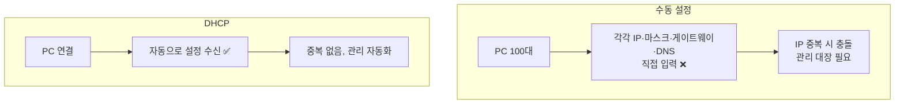
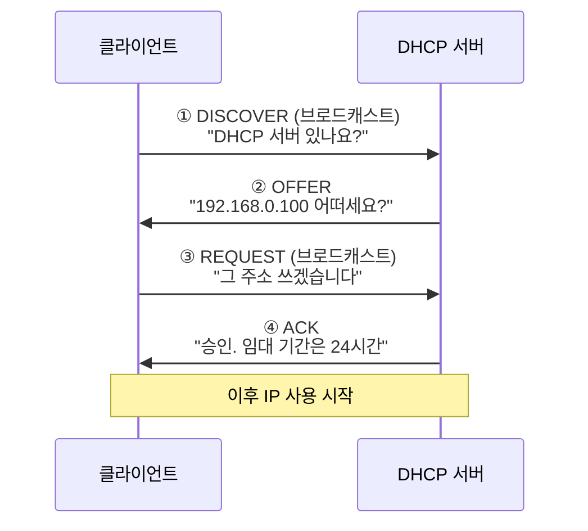
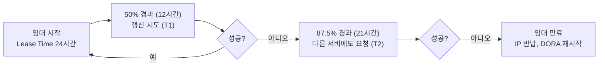
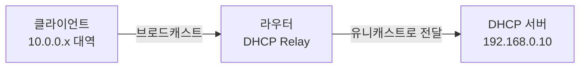
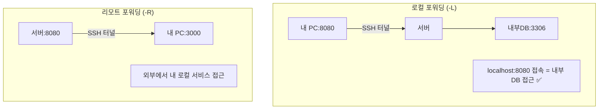

## 043. DHCP와 원격 접속 서비스

## 1부. DHCP

### 1. DHCP가 필요한 이유

**DHCP(Dynamic Host Configuration Protocol)** 는 네트워크 설정을 **자동으로 할당**하는 프로토콜입니다.



DHCP가 할당하는 정보:

- **IP 주소**
- **서브넷 마스크**
- **기본 게이트웨이**
- **DNS 서버 주소**
- 도메인 이름, NTP 서버, WINS 등

---

### 2. DHCP 동작 과정 — DORA (시험 최다 출제)



| 단계 | 메시지 | 방향 | 내용 |
| --- | --- | --- | --- |
| **D** | **DISCOVER** | 클라이언트 → **브로드캐스트** | DHCP 서버를 찾음 |
| **O** | **OFFER** | 서버 → 클라이언트 | 사용 가능한 IP 제안 |
| **R** | **REQUEST** | 클라이언트 → **브로드캐스트** | 해당 IP 사용 요청 |
| **A** | **ACK** | 서버 → 클라이언트 | 최종 승인 + 임대 정보 |

> **암기법** : **D-O-R-A (도라)**  
> **왜 REQUEST도 브로드캐스트일까?**  
> DHCP 서버가 여러 대일 수 있습니다. 브로드캐스트로 보내야  
> **선택받지 못한 서버들이 자신이 제안한 IP를 다시 회수**할 수 있습니다.

#### 그 밖의 메시지

| 메시지 | 의미 |
| --- | --- |
| **NAK** | 요청 거부 (해당 IP를 쓸 수 없음) |
| **RELEASE** | 클라이언트가 **IP 반납** |
| **DECLINE** | 이미 사용 중인 IP라 거부 |
| **INFORM** | IP는 있고 다른 설정만 요청 |

#### 포트

| 포트 | 용도 |
| --- | --- |
| **67 (UDP)** | **DHCP 서버** ⭐ |
| **68 (UDP)** | **DHCP 클라이언트** ⭐ |

> **아직 IP가 없는데 어떻게 통신할까?**  
> 클라이언트는 출발지 `0.0.0.0`, 목적지 `255.255.255.255`(브로드캐스트)로 보냅니다.  
> IP가 없어도 **같은 네트워크 전체에 뿌리는 방식**이라 가능합니다.

---

### 3. 임대(Lease)와 갱신



| 시점 | 동작 |
| --- | --- |
| **T1 (50%)** | 임대해 준 서버에 **갱신 요청** |
| **T2 (87.5%)** | 아무 DHCP 서버에나 **갱신 요청** |
| **100%** | **IP 반납**, 처음부터 다시 |

> **임대 기간을 짧게 하면** IP 회수가 빨라 주소 부족에 유리하지만 **트래픽이 늘고**,  
> **길게 하면** 안정적이지만 **떠난 기기의 IP가 오래 묶입니다.**  
> 사무실은 8시간~1일, 공공 와이파이는 1~2시간이 일반적입니다.

---

### 4. DHCP 서버 구축

```bash
$ sudo dnf install dhcp-server
$ sudo vi /etc/dhcp/dhcpd.conf
```

```
# ────────── 전역 설정 ──────────
option domain-name          "example.com";
option domain-name-servers  192.168.0.10, 8.8.8.8;
default-lease-time  86400;                 # 기본 임대 시간(초) ⭐
max-lease-time      172800;                # 최대 임대 시간
authoritative;                             # 공식 DHCP 서버임을 선언 ⭐
ddns-update-style none;

# ────────── 서브넷 정의 ⭐ ──────────
subnet 192.168.0.0 netmask 255.255.255.0 {
    range 192.168.0.100 192.168.0.200;     # 할당할 IP 범위 ⭐
    option routers          192.168.0.1;   # 게이트웨이 ⭐
    option subnet-mask      255.255.255.0;
    option broadcast-address 192.168.0.255;
    option domain-name-servers 192.168.0.10;
}

# ────────── 고정 IP 할당 (MAC 기반) ⭐ ──────────
host printer01 {
    hardware ethernet 00:11:22:33:44:55;   # MAC 주소 ⭐
    fixed-address 192.168.0.50;
}

host server01 {
    hardware ethernet aa:bb:cc:dd:ee:ff;
    fixed-address 192.168.0.51;
}
```

```bash
# ⭐ 설정 문법 검사
$ sudo dhcpd -t
$ sudo dhcpd -t -cf /etc/dhcp/dhcpd.conf

$ sudo systemctl enable --now dhcpd
$ systemctl status dhcpd

$ sudo firewall-cmd --add-service=dhcp --permanent
$ sudo firewall-cmd --reload
```

| 지시자 | 의미 |
| --- | --- |
| **`range`** | **할당할 IP 범위** ⭐ |
| **`option routers`** | **기본 게이트웨이** ⭐ |
| **`option domain-name-servers`** | **DNS 서버** ⭐ |
| **`default-lease-time`** | 기본 임대 시간(초) |
| `max-lease-time` | 최대 임대 시간 |
| **`hardware ethernet`** | **MAC 주소 (고정 할당용)** ⭐ |
| **`fixed-address`** | **고정 IP** ⭐ |
| `authoritative` | 공식 서버 선언 |

#### 임대 정보 확인

```bash
$ sudo cat /var/lib/dhcpd/dhcpd.leases
lease 192.168.0.100 {
  starts 3 2026/02/07 06:00:00;
  ends 4 2026/02/08 06:00:00;
  hardware ethernet 00:11:22:33:44:55;
  client-hostname "laptop01";
}
```

> **`/var/lib/dhcpd/dhcpd.leases`** 가 **현재 임대 현황**을 담고 있습니다.  
> "누가 어떤 IP를 언제까지 쓰는지" 확인할 때 봅니다.

#### 고정 IP 할당(예약)이 유용한 경우

| 대상 | 이유 |
| --- | --- |
| **프린터, 서버, NAS** | IP가 바뀌면 접속 설정이 깨짐 |
| 네트워크 장비 | 관리 주소 고정 필요 |
| 방화벽 정책 대상 | IP 기반 규칙 유지 |

> **수동 설정보다 DHCP 예약이 나은 이유**  
> 장비에서 직접 설정하면 **관리 대장이 흩어집니다.**  
> DHCP 서버에서 예약하면 **한 곳에서 전체 IP 배치를 관리**할 수 있습니다.

---

### 5. DHCP 클라이언트

```bash
# NetworkManager 사용 (권장)
$ sudo nmcli connection modify enp0s3 ipv4.method auto
$ sudo nmcli connection up enp0s3

# dhclient 직접 사용
$ sudo dhclient -r enp0s3          # IP 반납 (release) ⭐
$ sudo dhclient enp0s3             # IP 새로 요청 ⭐
$ sudo dhclient -v enp0s3          # 상세 출력

# 확인
$ ip addr show enp0s3
$ cat /var/lib/NetworkManager/*.lease
```

#### DHCP 문제 진단

```bash
# 169.254.x.x 가 할당됐다면? ⭐
$ ip addr show
    inet 169.254.12.34/16 ...
```

> **`169.254.x.x`는 APIPA 주소**입니다.  
> **DHCP 서버로부터 응답을 받지 못했을 때** 운영체제가 자동으로 부여합니다.  
> 즉, **DHCP 서버 문제 또는 네트워크 연결 문제**를 의미합니다.

```bash
# 진단
$ sudo tcpdump -i enp0s3 -n port 67 or port 68     # DHCP 패킷 확인 ⭐
$ sudo journalctl -u dhcpd -f                       # 서버 로그
$ sudo tail -f /var/log/messages | grep dhcp
```

| 증상 | 원인 |
| --- | --- |
| **169.254.x.x 할당** | **DHCP 서버 무응답** ⭐ |
| IP를 받지만 인터넷 안 됨 | `option routers` 누락 |
| 도메인만 안 됨 | `domain-name-servers` 누락 |
| 특정 대역만 안 됨 | 서브넷 정의 누락 |

#### DHCP 릴레이 (다른 네트워크에 서비스)



> **브로드캐스트는 라우터를 넘지 못합니다.**  
> 다른 네트워크에 DHCP를 제공하려면 **DHCP 릴레이 에이전트**가 필요합니다.
> ```bash
> $ sudo dnf install dhcp-relay
> $ sudo dhcrelay 192.168.0.10
> ```

---

## 2부. 원격 접속 서비스

### 6. SSH — 안전한 원격 접속

```bash
$ sudo dnf install openssh-server
$ sudo systemctl enable --now sshd
$ sudo firewall-cmd --add-service=ssh --permanent && sudo firewall-cmd --reload
```

#### SSH vs Telnet (시험 출제)

| 구분 | **Telnet** | **SSH** |
| --- | --- | --- |
| 포트 | **23** | **22** ⭐ |
| **암호화** | **없음 (평문)** ❌ | **있음** ✅ |
| 인증 | 비밀번호만 | 비밀번호 + **공개키** |
| 파일 전송 | 불가 | **SFTP/SCP 지원** |
| 포트 포워딩 | 불가 | **지원** |
| 현재 | **사용 금지** | **표준** |

```bash
# Telnet의 위험성 — 패킷을 캡처하면
$ sudo tcpdump -i eth0 -A port 23
...USER admin...PASS Secret123...     ← 비밀번호가 그대로 ❗
```

#### SSH 접속

```bash
$ ssh user@192.168.0.50
$ ssh -p 2222 user@192.168.0.50        # 포트 지정 (소문자 -p) ⭐
$ ssh -i ~/.ssh/id_ed25519 user@host   # 키 지정
$ ssh -v user@host                     # 상세 출력 (문제 진단) ⭐
$ ssh user@host 'df -h'                # 명령 하나만 실행
```

> **포트 옵션 주의** : `ssh`는 **소문자 `-p`**, `scp`는 **대문자 `-P`** 입니다.

---

### 7. 공개키 인증 (실기 필수)


```bash
# ① 키 쌍 생성
$ ssh-keygen -t ed25519 -C "masterway@laptop"      # 권장 (짧고 안전)
$ ssh-keygen -t rsa -b 4096 -C "masterway@laptop"  # RSA 사용 시
# → ~/.ssh/id_ed25519 (개인키), id_ed25519.pub (공개키)

# ② 서버에 공개키 등록 ⭐
$ ssh-copy-id user@192.168.0.50
$ ssh-copy-id -p 2222 -i ~/.ssh/id_ed25519.pub user@192.168.0.50

# 수동 등록
$ cat ~/.ssh/id_ed25519.pub | ssh user@host \
    "mkdir -p ~/.ssh && chmod 700 ~/.ssh && cat >> ~/.ssh/authorized_keys && chmod 600 ~/.ssh/authorized_keys"

# ③ 접속 (비밀번호 없이)
$ ssh user@192.168.0.50
```

#### 권한이 틀리면 동작하지 않습니다 (가장 흔한 문제)

| 대상 | 필수 권한 |
| --- | --- |
| **`~/.ssh`** | **700** |
| **`~/.ssh/authorized_keys`** | **600** ⭐ |
| **개인키 (`id_rsa`)** | **600** ⭐ |
| 공개키 (`.pub`) | 644 |
| **홈 디렉터리** | **다른 사용자 쓰기 불가 (755 이하)** |

```bash
$ chmod 700 ~/.ssh
$ chmod 600 ~/.ssh/authorized_keys ~/.ssh/id_ed25519
$ chmod 644 ~/.ssh/id_ed25519.pub
```

> **SSH는 권한이 너무 열려 있으면 키를 무시합니다.**  
> 다른 사용자가 읽을 수 있는 개인키는 **이미 유출된 것으로 간주**하기 때문입니다.
> ```bash
> $ sudo tail -f /var/log/secure
> Authentication refused: bad ownership or modes for directory /home/user/.ssh
> ```

#### SSH 클라이언트 설정 파일

```bash
$ vi ~/.ssh/config
```
```
Host prod
    HostName 192.168.0.50
    User masterway
    Port 2222
    IdentityFile ~/.ssh/id_ed25519_prod

Host *
    ServerAliveInterval 60
    ServerAliveCountMax 3
```

```bash
$ ssh prod          # 위 설정으로 자동 접속 ⭐
```

---

### 8. SSH 서버 보안 설정

```bash
$ sudo vi /etc/ssh/sshd_config
```

```apache
Port 2222                          # 기본 포트 변경
PermitRootLogin no                 # ⭐⭐ root 직접 로그인 차단
PasswordAuthentication no          # ⭐ 공개키만 허용
PubkeyAuthentication yes
PermitEmptyPasswords no
MaxAuthTries 3                     # 인증 시도 제한
LoginGraceTime 30
AllowUsers masterway devuser       # ⭐ 접속 허용 사용자
# AllowGroups sshusers
ClientAliveInterval 300            # 유휴 세션 종료
ClientAliveCountMax 2
X11Forwarding no
Protocol 2
```

```bash
# ⭐ 반드시 문법 검사 후 재시작
$ sudo sshd -t
$ sudo systemctl restart sshd

# 포트 변경 시 방화벽 + SELinux ⭐
$ sudo semanage port -a -t ssh_port_t -p tcp 2222
$ sudo firewall-cmd --add-port=2222/tcp --permanent && sudo firewall-cmd --reload
```

> **⚠️ 원격 작업 시 절대 규칙**  
> SSH 설정 변경 후 **기존 세션을 닫지 말고**, **새 터미널로 접속을 확인**한 뒤 닫으세요.  
> 설정이 잘못되면 **영영 접속할 수 없게 됩니다.**

---

### 9. SSH 포트 포워딩 (터널링)



```bash
# ① 로컬 포워딩 — 내 포트를 원격 서비스로 연결 ⭐
$ ssh -L 8080:localhost:3306 user@server
# → localhost:8080 으로 접속하면 server의 3306으로 연결

$ ssh -L 8080:내부DB주소:3306 user@bastion
# → 방화벽 안쪽 DB에 접근 (점프 서버 경유) ⭐

# ② 리모트 포워딩 — 원격의 포트를 내 서비스로 연결
$ ssh -R 8080:localhost:3000 user@server

# ③ 다이내믹 포워딩 (SOCKS 프록시)
$ ssh -D 1080 user@server

# 백그라운드 실행
$ ssh -fN -L 8080:localhost:3306 user@server
#     └── f: 백그라운드, N: 명령 실행 안 함
```

> **실무 활용** : DB 서버가 외부에 노출되어 있지 않을 때,  
> **SSH 터널로 안전하게 접근**할 수 있습니다.  
> DB 포트를 방화벽에 열지 않아도 되므로 훨씬 안전합니다.

#### 점프 호스트 (Bastion)

```bash
$ ssh -J bastion.example.com user@internal-server
# 또는 ~/.ssh/config 에
Host internal
    HostName 10.0.0.50
    ProxyJump bastion.example.com
```

---

### 10. 그 밖의 원격 접속

#### VNC — 그래픽 원격 제어

```bash
$ sudo dnf install tigervnc-server
$ vncpasswd                                  # 비밀번호 설정

$ sudo cp /usr/share/doc/tigervnc/vncserver@.service.template \
          /etc/systemd/system/vncserver@:1.service
$ sudo vi /etc/systemd/system/vncserver@:1.service
# User=masterway 로 수정

$ sudo systemctl daemon-reload
$ sudo systemctl enable --now vncserver@:1

# 포트: 5900 + 디스플레이 번호
# :1 → 5901 ⭐
$ sudo firewall-cmd --add-port=5901/tcp --permanent && sudo firewall-cmd --reload
```

| 항목 | 값 |
| --- | --- |
| **기본 포트** | **5900 + 디스플레이 번호** ⭐ |
| `:1` | **5901** |
| 암호화 | **기본적으로 없음** ❗ |

> **VNC는 암호화되지 않습니다.**  
> 반드시 **SSH 터널을 통해** 사용해야 합니다.
> ```bash
> $ ssh -L 5901:localhost:5901 user@server
> $ vncviewer localhost:5901          # 안전하게 연결 ✅
> ```

#### XRDP — Windows 원격 데스크톱 프로토콜

```bash
$ sudo dnf install xrdp
$ sudo systemctl enable --now xrdp
$ sudo firewall-cmd --add-port=3389/tcp --permanent && sudo firewall-cmd --reload
```

| 항목 | 값 |
| --- | --- |
| 포트 | **3389 (RDP)** |
| 장점 | **Windows 원격 데스크톱 클라이언트로 접속 가능** |

#### 원격 접속 방식 비교

| 방식 | 포트 | 형태 | 암호화 |
| --- | --- | --- | --- |
| **SSH** | **22** | 텍스트 (CLI) | **○** ⭐ |
| Telnet | 23 | 텍스트 | **✕** ❌ |
| **VNC** | **5900+n** | **그래픽** | ✕ (터널 필요) |
| XRDP | 3389 | 그래픽 | ○ |
| X11 Forwarding | 22 (SSH) | **개별 GUI 앱** | ○ |

```bash
# X11 포워딩 — 원격 GUI 프로그램을 내 화면에
$ ssh -X user@server
[server]$ firefox &          # 창은 내 컴퓨터에 뜸 ⭐
```

---

### 11. 접속 로그와 감사

```bash
# SSH 접속 기록
$ sudo grep sshd /var/log/secure | tail -20
$ sudo journalctl -u sshd -f

# 성공한 로그인
$ sudo grep "Accepted" /var/log/secure | tail -10

# ⭐ 실패한 로그인 (공격 탐지)
$ sudo grep "Failed password" /var/log/secure | tail -20

# 공격 IP 집계 ⭐
$ sudo grep "Failed password" /var/log/secure | \
    awk '{print $(NF-3)}' | sort | uniq -c | sort -rn | head
   4521 203.0.113.55

# 현재 접속자
$ who
$ w
$ ss -tan state established '( sport = :22 )'
```

```bash
# fail2ban으로 자동 차단 ⭐
$ sudo dnf install epel-release && sudo dnf install fail2ban
$ sudo systemctl enable --now fail2ban
$ sudo fail2ban-client status sshd
```

---

### 시험 포인트 정리

| 항목 | 핵심 |
| --- | --- |
| **DHCP 동작 순서** | **DISCOVER → OFFER → REQUEST → ACK (DORA)** ⭐ |
| **DHCP 포트** | **서버 67 / 클라이언트 68 (UDP)** ⭐ |
| DISCOVER 전송 방식 | **브로드캐스트** |
| **DHCP 설정 파일** | **`/etc/dhcp/dhcpd.conf`** ⭐ |
| **`range`** | 할당할 IP 범위 |
| **`option routers`** | 기본 게이트웨이 |
| **고정 IP 할당** | **`hardware ethernet` + `fixed-address`** ⭐ |
| 임대 정보 파일 | **`/var/lib/dhcpd/dhcpd.leases`** |
| 설정 검사 | **`dhcpd -t`** |
| 갱신 시점 | **T1=50%, T2=87.5%** |
| **169.254.x.x** | **DHCP 실패 (APIPA)** ⭐ |
| IP 반납·요청 | **`dhclient -r` / `dhclient`** |
| 다른 네트워크 지원 | **DHCP 릴레이** |
| **SSH 포트** | **22** ⭐ |
| **Telnet 포트** | **23 (평문 — 사용 금지)** |
| SSH 설정 파일 | **`/etc/ssh/sshd_config`** |
| **root 로그인 차단** | **`PermitRootLogin no`** ⭐ |
| SSH 설정 검사 | **`sshd -t`** |
| 키 생성 | **`ssh-keygen`** |
| 공개키 등록 | **`ssh-copy-id`** |
| **`~/.ssh` 권한** | **700** |
| **`authorized_keys` 권한** | **600** ⭐ |
| 포트 옵션 | **`ssh -p` / `scp -P`** |
| 로컬 포워딩 | **`ssh -L`** |
| 리모트 포워딩 | `ssh -R` |
| GUI 포워딩 | **`ssh -X`** |
| **VNC 포트** | **5900 + 디스플레이 번호** ⭐ |
| VNC 암호화 | **없음 — SSH 터널 필요** |
| XRDP 포트 | 3389 |
| 접속 로그 | **`/var/log/secure`** |

---

### 한 줄 정리

DHCP는 **DISCOVER → OFFER → REQUEST → ACK(DORA)** 순으로 동작하며 **서버 67 / 클라이언트 68 포트**를 쓰고,  
설정은 **`/etc/dhcp/dhcpd.conf`의 `range`·`option routers`**, 고정 할당은 **`hardware ethernet` + `fixed-address`** 이며,  
**`169.254.x.x`가 보이면 DHCP 실패**입니다.  
원격 접속은 **평문인 Telnet(23) 대신 SSH(22)** 를 쓰고, **공개키 인증 시 `~/.ssh` 700 / `authorized_keys` 600** 권한이 필수이며,  
**VNC는 암호화가 없어 반드시 SSH 터널**을 통해 사용해야 합니다.
