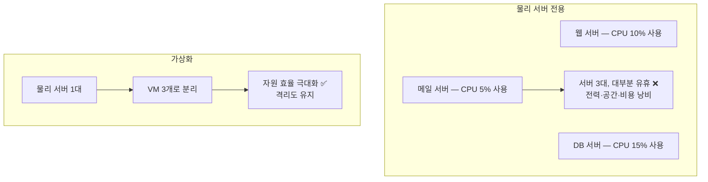
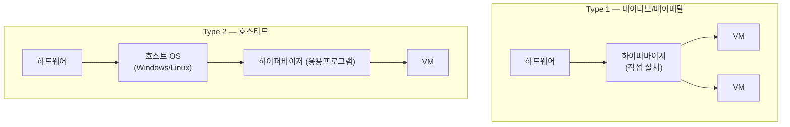
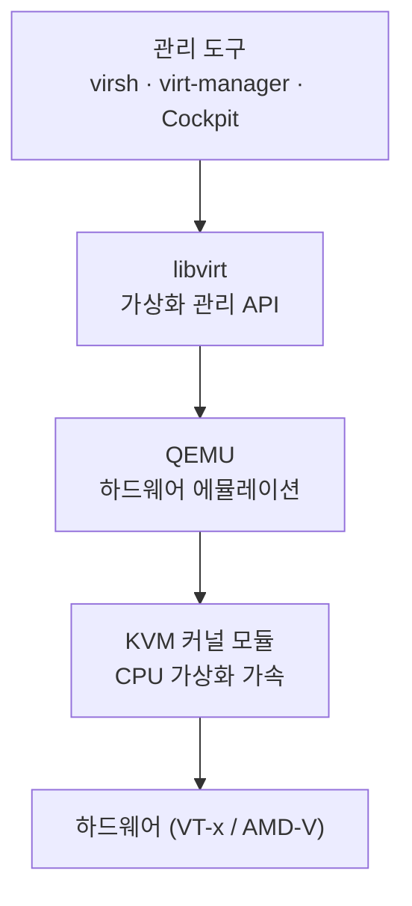
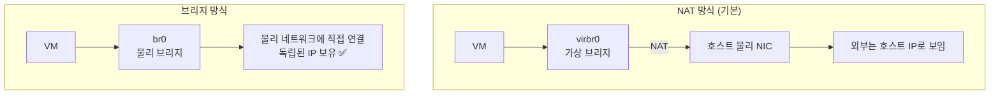
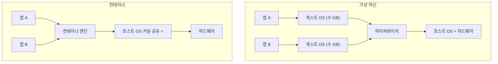
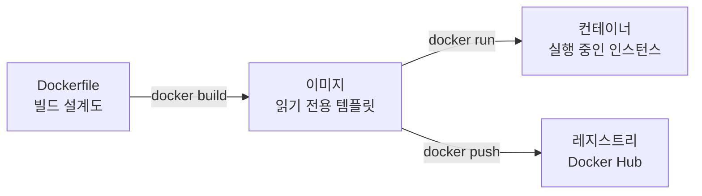
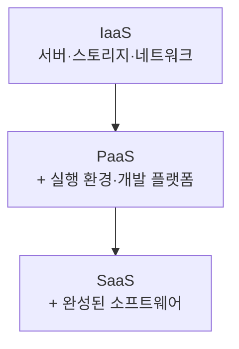
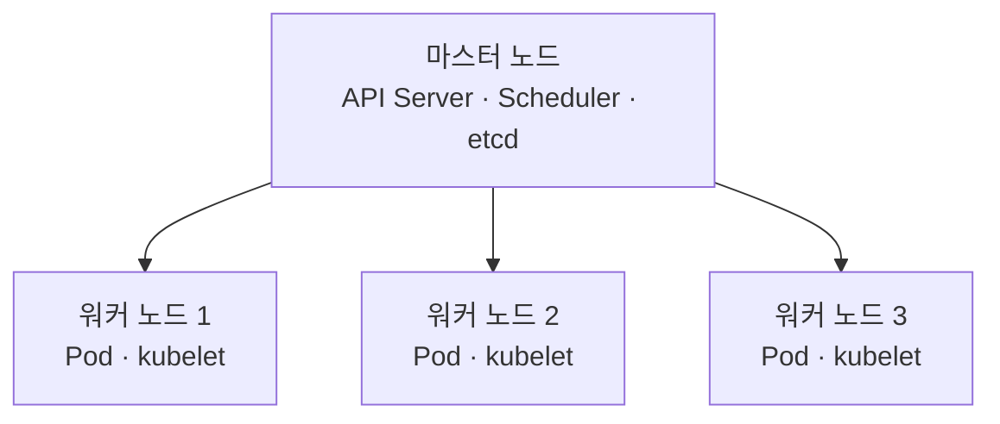

## 044. 가상화와 컨테이너

### 1. 가상화가 필요한 이유

물리 서버 한 대에 서비스 하나만 올리면 **자원이 크게 낭비**됩니다.



| 이점 | 설명 |
| --- | --- |
| **자원 효율** | 유휴 자원을 다른 VM이 사용 |
| **격리** | VM 하나가 죽어도 다른 VM은 정상 |
| **이식성** | VM 이미지를 그대로 다른 서버로 이동 |
| **신속한 구축** | 템플릿에서 몇 분 만에 서버 생성 |
| **스냅샷** | 변경 전 상태로 즉시 롤백 |

---

### 2. 가상화의 종류

#### 하이퍼바이저 방식



| 구분 | **Type 1 (네이티브/베어메탈)** | **Type 2 (호스티드)** |
| --- | --- | --- |
| 위치 | **하드웨어 위에 직접** | **호스트 OS 위에** |
| 성능 | **높음** ⭐ | 낮음 (OS를 한 번 더 거침) |
| 용도 | **서버·데이터센터** | 개인 PC·테스트 |
| 예 | **KVM, Xen, VMware ESXi, Hyper-V** | **VirtualBox, VMware Workstation** |

> **시험 포인트** : **KVM·Xen·ESXi는 Type 1**, **VirtualBox·VMware Workstation은 Type 2** 입니다.

#### 전가상화 vs 반가상화

| 구분 | **전가상화 (Full Virtualization)** | **반가상화 (Para Virtualization)** |
| --- | --- | --- |
| 게스트 OS 수정 | **불필요** ⭐ | **필요** |
| 하드웨어 지원 | **필요** (Intel VT-x, AMD-V) | 불필요 |
| 성능 | 하드웨어 지원 시 우수 | 우수 |
| 예 | **KVM, VMware** | **Xen (초기)** |

```bash
# CPU 가상화 지원 확인 ⭐
$ grep -E "vmx|svm" /proc/cpuinfo | head -1
flags : ... vmx ...          # Intel VT-x

$ lscpu | grep Virtualization
Virtualization:      VT-x
```

> **`vmx`(Intel) 또는 `svm`(AMD)** 플래그가 없으면 **KVM을 사용할 수 없습니다.**  
> BIOS/UEFI에서 가상화 기능이 꺼져 있는 경우가 많으므로 확인이 필요합니다.

---

### 3. KVM — 리눅스 표준 가상화

**KVM(Kernel-based Virtual Machine)** 은 **리눅스 커널에 내장된 하이퍼바이저**입니다.



| 구성 요소 | 역할 |
| --- | --- |
| **KVM** | **커널 모듈** — CPU·메모리 가상화 가속 |
| **QEMU** | **하드웨어 에뮬레이션** (디스크·네트워크·그래픽) |
| **libvirt** | **가상화 관리 API·데몬(`libvirtd`)** ⭐ |
| **virsh** | **명령줄 관리 도구** ⭐ |
| virt-manager | GUI 관리 도구 |

> **KVM은 커널의 일부이므로 별도 하이퍼바이저 설치가 필요 없습니다.**  
> 리눅스 자체가 하이퍼바이저가 되는 구조라 **Type 1**로 분류합니다.

#### 설치

```bash
$ sudo dnf install qemu-kvm libvirt virt-install virt-manager libvirt-client

$ sudo systemctl enable --now libvirtd
$ systemctl status libvirtd

# 확인
$ lsmod | grep kvm
kvm_intel             372736  0
kvm                  1032192  1 kvm_intel

$ virsh version
$ virt-host-validate                      # 가상화 환경 점검 ⭐

# 일반 사용자에게 권한 부여
$ sudo usermod -aG libvirt $USER
```

---

### 4. `virsh` — VM 관리 (실기 핵심)

```bash
# ────────── 목록 조회 ──────────
$ sudo virsh list                     # 실행 중인 VM ⭐
 Id   Name       State
----------------------------
 1    webserver  running

$ sudo virsh list --all               # 정지된 것까지 전부 ⭐
$ sudo virsh dominfo webserver        # VM 상세 정보

# ────────── 전원 제어 ──────────
$ sudo virsh start webserver          # 시작 ⭐
$ sudo virsh shutdown webserver       # 정상 종료 (ACPI) ⭐
$ sudo virsh destroy webserver        # 강제 종료 (전원 차단) ❗
$ sudo virsh reboot webserver         # 재시작
$ sudo virsh suspend webserver        # 일시 정지
$ sudo virsh resume webserver         # 재개

# ────────── 자동 시작 ──────────
$ sudo virsh autostart webserver          # 호스트 부팅 시 자동 시작 ⭐
$ sudo virsh autostart --disable webserver

# ────────── 콘솔 접속 ──────────
$ sudo virsh console webserver        # (Ctrl + ] 로 빠져나옴)

# ────────── 설정 ──────────
$ sudo virsh dumpxml webserver        # VM 설정을 XML로 출력
$ sudo virsh edit webserver           # XML 편집
$ sudo virsh setmem webserver 4G      # 메모리 변경
$ sudo virsh setvcpus webserver 4     # vCPU 변경

# ────────── 삭제 ──────────
$ sudo virsh undefine webserver --remove-all-storage
```

> **`shutdown`과 `destroy`의 차이 (시험 출제)**  
> **`shutdown`** : ACPI 신호를 보내 **게스트 OS가 정상 종료** (전원 버튼 누르는 것과 동일)  
> **`destroy`** : **전원 코드를 뽑는 것**과 같음 — 데이터 손상 위험 ❗

#### 스냅샷

```bash
$ sudo virsh snapshot-create-as webserver snap1 "before update"
$ sudo virsh snapshot-list webserver
$ sudo virsh snapshot-revert webserver snap1        # 되돌리기 ⭐
$ sudo virsh snapshot-delete webserver snap1
```

> **업데이트나 위험한 작업 전에 스냅샷을 만들어 두면**  
> 문제가 생겨도 **몇 초 만에 이전 상태로 복구**할 수 있습니다.

#### VM 생성

```bash
$ sudo virt-install \
    --name webserver \
    --ram 4096 \
    --vcpus 2 \
    --disk path=/var/lib/libvirt/images/web.qcow2,size=50,format=qcow2 \
    --os-variant rocky8 \
    --network bridge=br0 \
    --graphics none \
    --console pty,target_type=serial \
    --location /iso/Rocky-8-dvd.iso \
    --extra-args 'console=ttyS0'
```

| 옵션 | 의미 |
| --- | --- |
| `--name` | VM 이름 |
| `--ram` | 메모리(MB) |
| `--vcpus` | 가상 CPU 수 |
| `--disk` | 디스크 경로·크기·형식 |
| `--network` | 네트워크 연결 방식 |
| `--os-variant` | 게스트 OS 종류 (최적화) |

#### 디스크 이미지 관리

```bash
$ qemu-img create -f qcow2 /var/lib/libvirt/images/disk.qcow2 50G
$ qemu-img info /var/lib/libvirt/images/disk.qcow2
$ qemu-img resize /var/lib/libvirt/images/disk.qcow2 +20G
$ qemu-img convert -f raw -O qcow2 disk.raw disk.qcow2
```

| 형식 | 특징 |
| --- | --- |
| **`qcow2`** | **QEMU 표준. 씬 프로비저닝, 스냅샷 지원** ⭐ |
| `raw` | 단순 이미지. 성능 좋지만 기능 없음 |
| `vmdk` | VMware 형식 |
| `vdi` | VirtualBox 형식 |

> **`qcow2`의 씬 프로비저닝** : 50GB로 만들어도 **실제 사용한 만큼만 디스크를 차지**합니다.  
> 디스크 공간을 효율적으로 쓸 수 있어 기본으로 사용합니다.

---

### 5. 가상 네트워크



| 방식 | 특징 | 용도 |
| --- | --- | --- |
| **NAT** (기본) | 호스트를 통해 외부 접속, **외부에서 VM 접근 불가** | 테스트·개발 |
| **브리지(Bridge)** | **물리망에 직접 연결, 독립 IP** ⭐ | **서버 운영** |
| 격리(Isolated) | VM끼리만 통신 | 내부 테스트 |
| Host-only | 호스트-VM 간만 | 개발 |

```bash
# 가상 네트워크 목록
$ sudo virsh net-list --all
 Name      State    Autostart   Persistent
--------------------------------------------
 default   active   yes         yes

$ sudo virsh net-dumpxml default
$ sudo virsh net-start default
$ sudo virsh net-autostart default
```

#### 브리지 구성 (서버 운영 시 필수)

```bash
$ sudo nmcli connection add type bridge ifname br0 con-name br0
$ sudo nmcli connection add type bridge-slave ifname enp0s3 master br0
$ sudo nmcli connection modify br0 ipv4.method manual \
    ipv4.addresses 192.168.0.10/24 ipv4.gateway 192.168.0.1 ipv4.dns 8.8.8.8
$ sudo nmcli connection up br0

$ ip link show type bridge
$ bridge link show
```

> **VM을 서버로 운영하려면 브리지가 필요합니다.**  
> NAT 방식은 **외부에서 VM으로 직접 접속할 수 없어** 웹 서버 등으로 쓸 수 없습니다.

---

### 6. 컨테이너 — 가상화와 무엇이 다른가



| 구분 | **가상 머신 (VM)** | **컨테이너** |
| --- | --- | --- |
| 격리 수준 | **하드웨어 수준 (완전 격리)** | **프로세스 수준** |
| **OS** | **VM마다 게스트 OS 필요** | **호스트 커널 공유** ⭐ |
| 크기 | **수 GB** | **수십~수백 MB** ⭐ |
| **부팅 시간** | 수십 초~분 | **수 초 이내** ⭐ |
| 성능 | 오버헤드 있음 | **거의 네이티브** |
| 보안 격리 | **강함** ⭐ | 상대적으로 약함 |
| 다른 OS 실행 | **가능** (리눅스 위에 Windows) | **불가** (커널 공유) ❗ |

> **핵심 차이** : 컨테이너는 **커널을 공유**하므로 가볍고 빠르지만,  
> **리눅스 컨테이너는 리눅스에서만** 동작합니다.  
> 반면 VM은 **완전히 다른 OS**도 실행할 수 있습니다.

#### 컨테이너를 가능하게 하는 리눅스 기술

| 기술 | 역할 |
| --- | --- |
| **namespace** | **프로세스·네트워크·파일시스템을 격리** (각 컨테이너가 독립된 세계로 보이게) ⭐ |
| **cgroup** | **CPU·메모리·I/O 자원 제한** ⭐ |
| **UnionFS / OverlayFS** | 이미지 레이어를 겹쳐 하나로 보이게 |
| Capabilities | 세분화된 권한 제어 |
| SELinux / seccomp | 추가 보안 격리 |

```bash
# namespace 확인
$ lsns
$ ls -l /proc/$$/ns/
```

> **컨테이너는 "가벼운 VM"이 아니라 "격리된 프로세스"** 입니다.  
> `ps aux`로 보면 컨테이너 안의 프로세스가 **호스트에서도 그대로 보입니다.**

---

### 7. Docker

```bash
$ sudo dnf install docker-ce docker-ce-cli containerd.io
$ sudo systemctl enable --now docker
$ sudo usermod -aG docker $USER          # 재로그인 필요
```

#### 이미지와 컨테이너



| 개념 | 설명 |
| --- | --- |
| **이미지(Image)** | **읽기 전용 템플릿** (클래스에 해당) |
| **컨테이너(Container)** | **이미지를 실행한 인스턴스** (객체에 해당) |
| **레지스트리(Registry)** | 이미지 저장소 (Docker Hub) |
| **Dockerfile** | 이미지 빌드 명세서 |
| **볼륨(Volume)** | 데이터 영속 저장소 |

#### 주요 명령어

```bash
# ────────── 이미지 ──────────
$ docker pull nginx:latest              # 내려받기
$ docker images                         # 목록 ⭐
$ docker rmi nginx                      # 삭제
$ docker build -t myapp:1.0 .           # 빌드 ⭐
$ docker search nginx

# ────────── 컨테이너 실행 ⭐ ──────────
$ docker run -d --name web -p 8080:80 nginx
#            │  │            │
#            │  │            └── 호스트포트:컨테이너포트 ⭐
#            │  └── 컨테이너 이름
#            └── 백그라운드 실행 (detached)

$ docker run -it ubuntu bash            # 대화형 실행 ⭐
$ docker run -d -v /data:/app/data nginx    # 볼륨 마운트 ⭐
$ docker run -d -e ENV=prod nginx       # 환경 변수

# ────────── 컨테이너 관리 ──────────
$ docker ps                             # 실행 중 ⭐
$ docker ps -a                          # 정지된 것까지 ⭐
$ docker stop web                       # 정상 종료
$ docker start web
$ docker restart web
$ docker rm web                         # 삭제
$ docker rm -f web                      # 강제 삭제

# ────────── 진단 ──────────
$ docker logs web                       # 로그 ⭐
$ docker logs -f web                    # 실시간 ⭐
$ docker exec -it web bash              # 컨테이너 안으로 진입 ⭐
$ docker inspect web                    # 상세 정보
$ docker stats                          # 자원 사용 현황 ⭐

# ────────── 정리 ──────────
$ docker system prune -a                # 사용하지 않는 것 전부 삭제 ⭐
$ docker volume ls
$ docker network ls
```

| 명령어 | 기능 |
| --- | --- |
| **`docker run`** | **이미지로 컨테이너 생성·실행** ⭐ |
| **`docker ps`** | 실행 중 컨테이너 (`-a`로 전체) |
| **`docker images`** | 이미지 목록 |
| **`docker exec -it`** | **실행 중인 컨테이너에 진입** ⭐ |
| **`docker logs`** | 로그 확인 |
| `docker build` | 이미지 빌드 |
| `docker-compose` | 여러 컨테이너를 한 번에 관리 |

#### Dockerfile 예시

```dockerfile
FROM rockylinux:8
LABEL maintainer="masterway@example.com"

RUN dnf install -y httpd && dnf clean all
COPY ./html /var/www/html
EXPOSE 80
CMD ["httpd", "-DFOREGROUND"]
```

```bash
$ docker build -t mywebserver:1.0 .
$ docker run -d -p 8080:80 mywebserver:1.0
```

| 지시어 | 의미 |
| --- | --- |
| **`FROM`** | **베이스 이미지** |
| `RUN` | 빌드 시 실행할 명령 |
| `COPY` / `ADD` | 파일 복사 |
| `EXPOSE` | 사용할 포트 명시 |
| **`CMD`** | **컨테이너 시작 시 실행할 명령** |
| `ENTRYPOINT` | 진입점 (CMD보다 강제적) |
| `ENV` | 환경 변수 |
| `WORKDIR` | 작업 디렉터리 |
| `VOLUME` | 볼륨 지정 |

#### 데이터 영속성 — 볼륨


```bash
$ docker volume create mydata
$ docker run -d -v mydata:/var/lib/mysql mysql
$ docker run -d -v /host/path:/container/path nginx      # 바인드 마운트
```

> **컨테이너는 일회용(Ephemeral)** 입니다.  
> 삭제하면 내부 데이터도 사라지므로, **DB 등 영속 데이터는 반드시 볼륨**을 써야 합니다.

---

### 8. Podman — RHEL/Rocky의 기본

RHEL 8부터는 Docker 대신 **Podman**을 제공합니다.

```bash
$ sudo dnf install podman buildah skopeo
$ podman run -d -p 8080:80 nginx
$ podman ps
```

| 구분 | **Docker** | **Podman** |
| --- | --- | --- |
| 아키텍처 | **데몬 필요** (`dockerd`) | **데몬 없음 (Daemonless)** ⭐ |
| 권한 | 데몬이 **root로 실행** ❗ | **Rootless 컨테이너 지원** ⭐ |
| 명령어 | `docker` | `podman` (**명령 호환**) |
| systemd 연동 | 제한적 | **유닛 파일 생성 지원** ⭐ |
| RHEL 기본 | ✕ | **○** |

```bash
# Docker 명령을 그대로 사용 가능
$ alias docker=podman

# systemd 서비스로 등록 ⭐
$ podman generate systemd --name web --files
$ sudo cp container-web.service /etc/systemd/system/
$ sudo systemctl enable --now container-web
```

> **Podman이 더 안전한 이유**  
> Docker는 **root 권한의 데몬**이 모든 컨테이너를 관리합니다.  
> 데몬이 뚫리면 **호스트 전체가 위험**해집니다.  
> Podman은 데몬 없이 **사용자 권한으로 컨테이너를 실행(rootless)** 할 수 있어  
> 컨테이너가 탈출해도 **일반 사용자 권한만** 얻습니다.

---

### 9. 클라우드와 오케스트레이션

#### 클라우드 서비스 모델 (시험 출제)



| 모델 | 제공 범위 | 예 |
| --- | --- | --- |
| **IaaS** (Infrastructure) | **인프라** (가상 서버, 스토리지) | AWS EC2, GCP Compute |
| **PaaS** (Platform) | **개발·실행 플랫폼** | Heroku, App Engine |
| **SaaS** (Software) | **완성된 소프트웨어** | Gmail, Office 365 |

| 배포 모델 | 설명 |
| --- | --- |
| **퍼블릭 클라우드** | 공용 (AWS, Azure, GCP) |
| **프라이빗 클라우드** | 조직 전용 (OpenStack) |
| **하이브리드** | 퍼블릭 + 프라이빗 조합 |

#### Kubernetes



| 용어 | 의미 |
| --- | --- |
| **Pod** | **컨테이너의 최소 배포 단위** (1개 이상의 컨테이너) |
| **Node** | 워커 서버 |
| **Deployment** | Pod의 배포·업데이트 관리 |
| **Service** | Pod에 접근하기 위한 고정 엔드포인트 |
| **etcd** | 클러스터 상태 저장소 |

```bash
$ kubectl get nodes
$ kubectl get pods
$ kubectl apply -f deployment.yaml
$ kubectl logs pod-name
$ kubectl exec -it pod-name -- bash
```

> **왜 오케스트레이션이 필요할까?**  
> 컨테이너가 수백 개가 되면 **수동 관리가 불가능**합니다.  
> Kubernetes는 **자동 배포·확장·복구·로드밸런싱**을 담당합니다.  
> 컨테이너가 죽으면 **자동으로 다시 띄웁니다.**

---

### 10. 가상화 관련 명령어 정리

```bash
# ────────── 가상화 환경 확인 ──────────
$ systemd-detect-virt                    # 현재 시스템이 VM인지 ⭐
kvm                                       # (none = 물리 서버)

$ virt-what
$ dmidecode -s system-product-name

# ────────── KVM ──────────
$ virsh list --all
$ virsh start/shutdown/destroy VM명
$ virsh console VM명
$ virt-host-validate

# ────────── 컨테이너 ──────────
$ docker ps -a  /  podman ps -a
$ docker images /  podman images
$ docker logs -f 컨테이너
$ docker exec -it 컨테이너 bash
$ docker stats
```

> **`systemd-detect-virt`** 는 **현재 시스템이 가상 머신인지 물리 서버인지** 즉시 알려 줍니다.  
> 결과가 `none`이면 물리 서버, `kvm`·`vmware`·`oracle` 등이면 가상 머신입니다.

---

### 11. 선택 기준

| 상황 | 권장 |
| --- | --- |
| **다른 OS가 필요** (Windows 등) | **VM** |
| **강한 보안 격리 필요** | **VM** |
| **레거시 애플리케이션** | VM |
| **빠른 배포·확장** | **컨테이너** ⭐ |
| **마이크로서비스** | **컨테이너** |
| **CI/CD 파이프라인** | 컨테이너 |
| 개발 환경 통일 | 컨테이너 |
| 대규모 컨테이너 운영 | **Kubernetes** |

> **실무에서는 두 가지를 함께 씁니다.**  
> **VM 위에 컨테이너를 올리는 구성**이 일반적입니다.  
> VM으로 **테넌트 간 강한 격리**를 확보하고, 그 안에서 컨테이너로 **빠른 배포**를 합니다.

---

### 시험 포인트 정리

| 항목 | 핵심 |
| --- | --- |
| **Type 1 하이퍼바이저** | **하드웨어 위 직접 — KVM, Xen, ESXi** ⭐ |
| **Type 2 하이퍼바이저** | **호스트 OS 위 — VirtualBox, VMware Workstation** |
| 전가상화 | 게스트 OS **수정 불필요**, 하드웨어 지원 필요 |
| 반가상화 | 게스트 OS **수정 필요** (Xen) |
| CPU 가상화 플래그 | **Intel `vmx` / AMD `svm`** ⭐ |
| **KVM** | **리눅스 커널 내장 하이퍼바이저** |
| QEMU | 하드웨어 에뮬레이션 |
| **libvirt** | 가상화 관리 API (**`libvirtd`**) |
| **VM 관리 명령** | **`virsh`** ⭐ |
| VM 목록 | **`virsh list --all`** |
| **`shutdown` vs `destroy`** | **정상 종료 / 강제 전원 차단** ⭐ |
| 자동 시작 | **`virsh autostart`** |
| 디스크 형식 | **`qcow2`** (스냅샷·씬 프로비저닝) |
| 서버용 네트워크 | **브리지(Bridge)** |
| **컨테이너 격리 기술** | **namespace(격리) + cgroup(자원 제한)** ⭐ |
| VM vs 컨테이너 | **게스트 OS 필요 / 커널 공유** ⭐ |
| 컨테이너의 제약 | **다른 OS 실행 불가** |
| 컨테이너 실행 | **`docker run -d -p 호스트:컨테이너`** ⭐ |
| 컨테이너 진입 | **`docker exec -it 이름 bash`** ⭐ |
| 데이터 영속성 | **볼륨(`-v`)** |
| **Podman** | **데몬 없음, Rootless — RHEL 기본** ⭐ |
| 클라우드 모델 | **IaaS < PaaS < SaaS** |
| K8s 최소 단위 | **Pod** |
| 가상화 여부 확인 | **`systemd-detect-virt`** |

---

### 한 줄 정리

가상화는 **Type 1(KVM·Xen·ESXi, 하드웨어 직접)과 Type 2(VirtualBox, 호스트 OS 위)** 로 나뉘고,  
리눅스는 **KVM(커널) + QEMU(에뮬레이션) + libvirt(관리)** 구조로 **`virsh`** 로 제어하며,  
**컨테이너는 namespace·cgroup으로 커널을 공유하며 격리**되어 VM보다 훨씬 가볍지만 **다른 OS는 실행할 수 없고**,  
RHEL 계열은 **데몬 없이 Rootless로 동작하는 Podman**을 기본으로 제공합니다.
