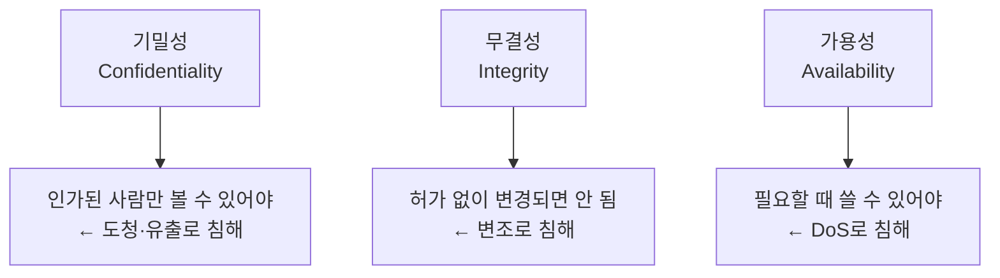
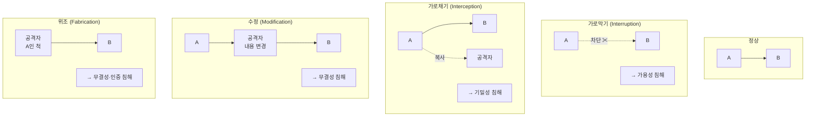
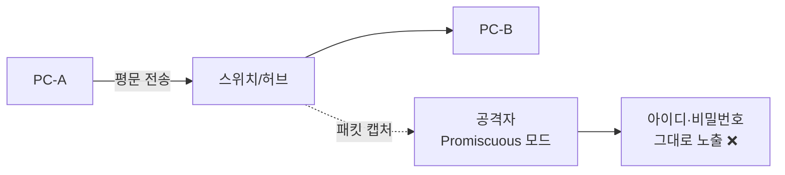
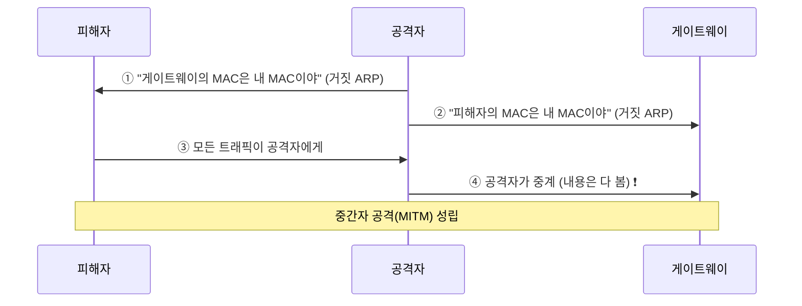
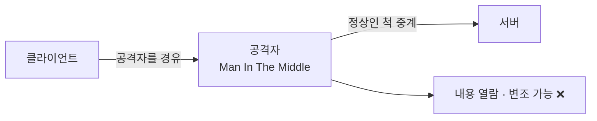
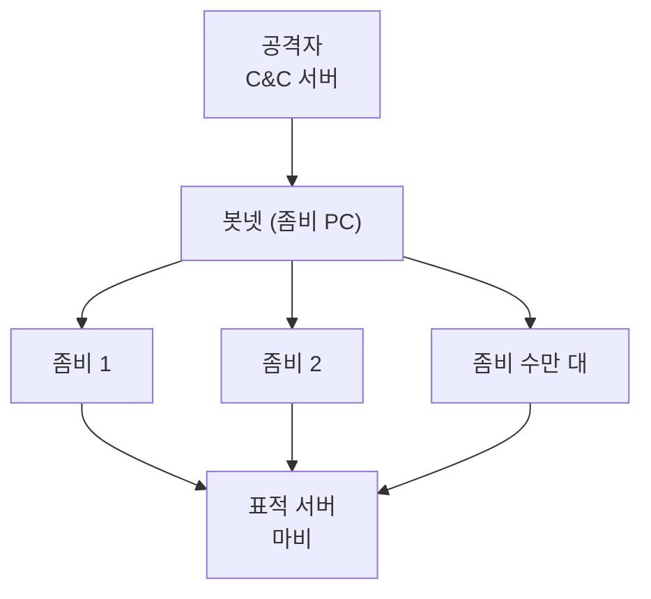
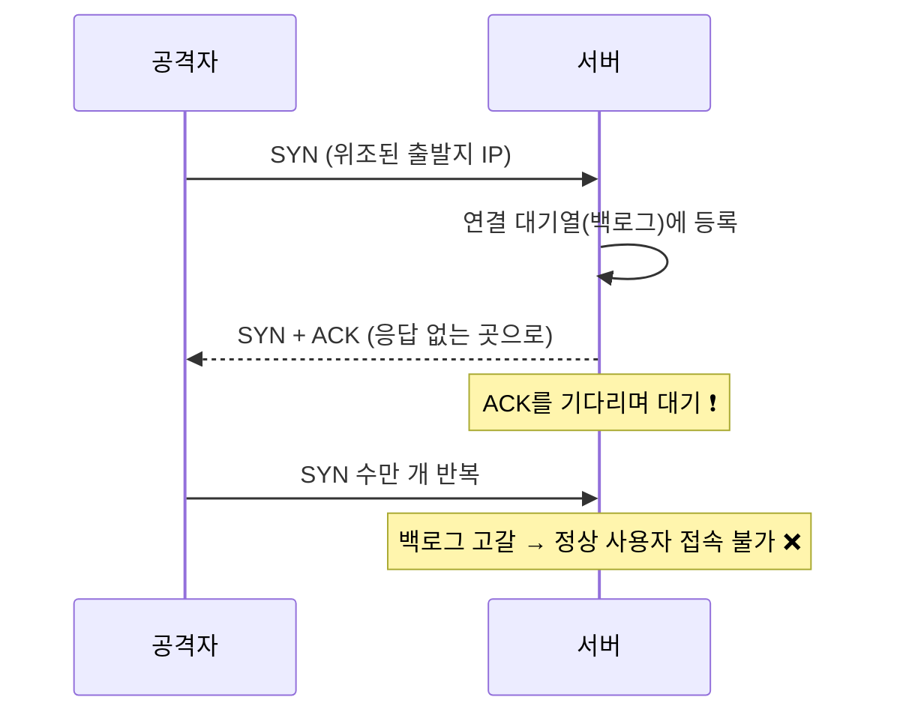
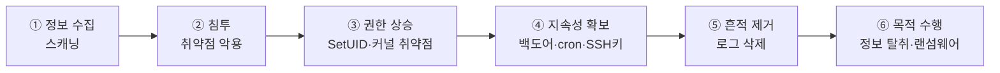

## 045. 네트워크 침해 유형과 특징

### 1. 정보보안의 3대 요소 (CIA)

모든 보안 위협은 결국 **이 셋 중 하나를 침해**합니다.



| 요소 | 의미 | 대표 위협 |
| --- | --- | --- |
| **기밀성 (Confidentiality)** | **인가된 사용자만 접근** | 스니핑, 정보 유출 |
| **무결성 (Integrity)** | **허가 없이 변경 불가** | 데이터 변조, 웹 변조 |
| **가용성 (Availability)** | **필요할 때 사용 가능** | **DoS / DDoS** |

여기에 다음을 더하기도 합니다.

| 요소 | 의미 |
| --- | --- |
| **인증 (Authentication)** | 상대가 **본인이 맞는지** 확인 |
| **부인 방지 (Non-repudiation)** | 행위를 **나중에 부인할 수 없게** |

---

### 2. 보안 위협의 4가지 형태 (시험 출제)

데이터가 A에서 B로 가는 흐름으로 이해하면 명확합니다.



| 유형 | 동작 | 침해 요소 |
| --- | --- | --- |
| **가로막기 (Interruption)** | 전달을 **차단** | **가용성** |
| **가로채기 (Interception)** | 몰래 **훔쳐봄** | **기밀성** |
| **수정 (Modification)** | 내용을 **변경** | **무결성** |
| **위조 (Fabrication)** | **가짜 데이터** 생성 | **무결성 / 인증** |

---

### 3. 공격 방식의 분류

| 구분 | **수동적 공격 (Passive)** | **능동적 공격 (Active)** |
| --- | --- | --- |
| 특징 | **관찰만 함** | **데이터를 변경·생성** |
| **탐지** | **어려움** ❗ | 상대적으로 쉬움 |
| **예방** | **암호화** ⭐ | 인증·무결성 검증 |
| 예 | **스니핑, 트래픽 분석** | **스푸핑, 변조, DoS, 세션 하이재킹** |

> **수동적 공격이 더 위험한 이유**  
> 아무 흔적도 남기지 않아 **공격당하고 있다는 사실조차 모릅니다.**  
> 그래서 **탐지보다 예방(암호화)** 이 핵심 대응책입니다.

---

### 4. 스니핑 (Sniffing) — 도청

**네트워크를 오가는 패킷을 몰래 훔쳐보는** 공격입니다.



#### 동작 원리

랜카드는 보통 **자신에게 온 패킷만** 받아들입니다.  
공격자는 랜카드를 **무차별 모드(Promiscuous Mode)** 로 바꿔 **모든 패킷을 수집**합니다.

```bash
# 무차별 모드 확인
$ ip link show eth0 | grep PROMISC
$ sudo ip link set eth0 promisc on
```

#### 취약한 프로토콜 (평문 전송)

| 프로토콜 | 포트 | 대안 |
| --- | --- | --- |
| **Telnet** | 23 | **SSH (22)** ⭐ |
| **FTP** | 21 | **SFTP / FTPS** |
| **HTTP** | 80 | **HTTPS (443)** ⭐ |
| **POP3 / IMAP** | 110 / 143 | **POP3S(995) / IMAPS(993)** |
| SMTP | 25 | SMTPS / STARTTLS |
| SNMP v1/v2 | 161 | SNMPv3 |

```bash
# 실제로 얼마나 위험한지 확인 (본인 시스템에서만)
$ sudo tcpdump -i eth0 -A port 23
...USER admin...PASS Secret123...        ← 비밀번호가 그대로 ❗
```

#### 스위치 환경에서의 스니핑

스위치는 목적지 포트로만 전달하므로 원래는 스니핑이 어렵습니다.  
공격자는 이를 우회합니다.

| 기법 | 방법 |
| --- | --- |
| **ARP 스푸핑** | 게이트웨이인 척하여 트래픽을 자신에게 유도 ⭐ |
| **MAC 플러딩** | 위조 MAC을 대량 발생시켜 **스위치를 허브처럼 동작하게** 만듦 |
| 포트 미러링 악용 | 관리 기능을 악용 |

**대응**

- **암호화 사용** (HTTPS, SSH, VPN) ⭐ — 가장 근본적
- 스위치의 **Port Security** (포트당 MAC 수 제한)
- **정적 ARP** 설정, ARP 감시 도구
- 네트워크 분리(VLAN)

---

### 5. 스푸핑 (Spoofing) — 위장

**신원을 속여** 접근하거나 트래픽을 가로채는 공격입니다.

#### ARP 스푸핑 (가장 대표적)



> **ARP에는 인증 절차가 없습니다.**  
> 누구나 "내가 게이트웨이다"라고 응답할 수 있고, 받은 쪽은 **검증 없이 캐시에 저장**합니다.  
> 이것이 ARP 스푸핑이 가능한 근본 원인입니다.

```bash
# 탐지 — 같은 MAC이 여러 IP에 매핑되면 의심 ⭐
$ ip neigh
192.168.0.1   dev eth0 lladdr aa:bb:cc:dd:ee:ff REACHABLE
192.168.0.100 dev eth0 lladdr aa:bb:cc:dd:ee:ff REACHABLE
                                └── 동일 MAC ❗ ARP 스푸핑 의심

$ arp -a
$ sudo arpwatch -i eth0            # ARP 변화 감시 도구
```

**대응**

```bash
# 정적 ARP 등록 (게이트웨이 고정) ⭐
$ sudo ip neigh add 192.168.0.1 lladdr aa:bb:cc:dd:ee:ff dev eth0 nud permanent
$ sudo arp -s 192.168.0.1 aa:bb:cc:dd:ee:ff
```

- **정적 ARP 설정** ⭐
- 스위치의 **DAI(Dynamic ARP Inspection)**
- **암호화 통신** (가로채도 내용을 못 봄)

#### 그 밖의 스푸핑

| 유형 | 설명 | 대응 |
| --- | --- | --- |
| **IP 스푸핑** | **출발지 IP를 위조** | 라우터에서 **인그레스 필터링** |
| **DNS 스푸핑 / 캐시 포이즈닝** | **가짜 DNS 응답**으로 악성 사이트 유도 ⭐ | **DNSSEC** |
| **MAC 스푸핑** | MAC 주소 위조 | 포트 보안 |
| 이메일 스푸핑 | 발신자 위조 | **SPF·DKIM·DMARC** ⭐ |
| 웹 스푸핑 | 가짜 사이트 | HTTPS 인증서 확인 |

---

### 6. 중간자 공격 (MITM)



**양쪽 모두 정상 통신 중이라고 믿게** 만들면서 중간에서 모든 것을 보는 공격입니다.

| 성립 경로 | 설명 |
| --- | --- |
| ARP 스푸핑 | 같은 네트워크에서 |
| DNS 스푸핑 | 가짜 서버로 유도 |
| 악성 Wi-Fi AP | 공용 와이파이 위장 |
| SSL 스트리핑 | HTTPS를 HTTP로 다운그레이드 |

**대응**

- **HTTPS + 인증서 검증** ⭐ (인증서 경고를 무시하지 않기)
- **HSTS** (HTTP를 아예 허용하지 않음)
- 공용 와이파이에서 **VPN 사용**
- 인증서 고정(Certificate Pinning)

---

### 7. DoS와 DDoS — 가용성 공격

#### DoS vs DDoS

| 구분 | **DoS** | **DDoS** |
| --- | --- | --- |
| 공격자 | **1대** | **다수 (좀비 PC)** ⭐ |
| 차단 | IP 하나 차단하면 됨 | **정상 IP와 구분 곤란** ❗ |
| 규모 | 제한적 | **수십 Gbps 이상** |



#### 주요 DoS 공격 유형 (시험 출제)

| 공격 | 원리 |
| --- | --- |
| **SYN Flooding** | **SYN만 보내고 ACK를 안 보내** 서버의 연결 대기열을 고갈 ⭐ |
| **Smurf** | **출발지를 피해자로 위조**한 ICMP를 브로드캐스트 → 응답이 피해자에게 폭주 ⭐ |
| **Ping of Death** | 규격을 넘는 **거대한 ICMP 패킷**으로 시스템 오류 유발 |
| **Land Attack** | **출발지와 목적지를 동일**하게 만들어 무한 응답 유발 |
| **Teardrop** | 조각화된 패킷의 **오프셋을 조작**해 재조립 시 오류 |
| **UDP Flooding** | 대량의 UDP 패킷 전송 |
| **HTTP Flooding** | 정상적인 HTTP 요청을 대량 발생 (탐지 어려움) |
| **Slowloris** | **연결을 열어 두고 아주 천천히** 데이터를 보내 자원 점유 |
| **DNS 증폭** | 작은 질의로 **큰 응답**을 피해자에게 유도 (증폭률 수십 배) ⭐ |

#### SYN Flooding 상세



**대응**

```bash
# SYN Cookie 활성화 ⭐
$ sudo sysctl -w net.ipv4.tcp_syncookies=1
$ echo "net.ipv4.tcp_syncookies = 1" | sudo tee -a /etc/sysctl.conf

# 백로그 큐 확대
$ sudo sysctl -w net.ipv4.tcp_max_syn_backlog=4096

# SYN 재전송 횟수 감소
$ sudo sysctl -w net.ipv4.tcp_synack_retries=2
```

> **SYN Cookie의 원리**  
> 연결 정보를 **메모리에 저장하지 않고**, 시퀀스 번호에 인코딩해서 보냅니다.  
> ACK가 돌아왔을 때 그 값으로 검증하므로 **백로그를 소모하지 않습니다.**

#### 증폭 공격 (Amplification)


| 프로토콜 | 증폭률 |
| --- | --- |
| **DNS** | 약 28~54배 |
| **NTP** | 약 556배 ❗ |
| **memcached** | 약 51,000배 ❗❗ |

**대응**

- **오픈 리졸버 차단** (`recursion no`) ⭐
- NTP `monlist` 비활성화
- 불필요한 UDP 서비스를 외부에 노출하지 않기
- **인그레스 필터링** (출발지 IP 위조 차단)

#### DDoS 종합 대응

| 계층 | 대응 |
| --- | --- |
| 네트워크 | ISP 협조, **Anti-DDoS 장비**, 블랙홀 라우팅 |
| 애플리케이션 | **Rate Limiting** (`limit_req`), CAPTCHA |
| 아키텍처 | **CDN**, 로드밸런서, Auto Scaling |
| 시스템 | 커널 튜닝, 방화벽 연결 수 제한 |

```bash
# 연결 수 제한 (iptables)
$ sudo iptables -A INPUT -p tcp --dport 80 -m connlimit --connlimit-above 50 -j DROP

# 초당 연결 제한
$ sudo iptables -A INPUT -p tcp --dport 80 -m limit --limit 100/s -j ACCEPT
```

---

### 8. 세션 하이재킹과 재전송 공격

| 공격 | 원리 | 대응 |
| --- | --- | --- |
| **세션 하이재킹** | **인증된 세션(쿠키·토큰)을 탈취**하여 그 사용자인 척 | HTTPS, **`HttpOnly`·`Secure` 쿠키**, 세션 타임아웃 ⭐ |
| **재전송 공격 (Replay)** | 가로챈 인증 패킷을 **그대로 다시 전송** | **타임스탬프·Nonce·OTP** ⭐ |

> **세션 하이재킹이 무서운 이유**  
> 비밀번호를 몰라도 **세션 쿠키만 있으면 로그인된 상태**가 됩니다.  
> XSS로 쿠키를 탈취하는 것이 대표적인 경로이므로,  
> **`HttpOnly` 속성**으로 자바스크립트의 쿠키 접근을 막아야 합니다.

---

### 9. 웹 애플리케이션 공격

| 공격 | 원리 | 대응 |
| --- | --- | --- |
| **SQL Injection** | **입력값에 SQL을 삽입**하여 DB 조작 ⭐ | **Prepared Statement**, 입력 검증, **최소 권한** |
| **XSS** (Cross Site Scripting) | **악성 스크립트를 삽입**하여 다른 사용자 브라우저에서 실행 ⭐ | **출력 이스케이프**, CSP, `HttpOnly` |
| **CSRF** | 사용자가 **의도하지 않은 요청**을 하게 유도 | **CSRF 토큰**, SameSite 쿠키 |
| **디렉터리 트래버설** | `../` 로 상위 경로 접근 | 경로 정규화, 입력 검증 |
| 파일 업로드 취약점 | 웹셸 업로드 | 확장자·MIME 검증, **`noexec` 마운트** ⭐ |
| 명령어 삽입 | 시스템 명령 삽입 | 입력 검증, 쉘 호출 회피 |

```sql
-- SQL Injection 예시
-- 입력: admin' OR '1'='1
SELECT * FROM users WHERE id = 'admin' OR '1'='1';    -- 항상 참 → 인증 우회 ❗
```

```php
// 대응 — Prepared Statement ⭐
$stmt = $pdo->prepare("SELECT * FROM users WHERE id = ?");
$stmt->execute([$userId]);
```

> **왜 Prepared Statement가 근본 해결책일까?**  
> 쿼리의 **구조와 데이터를 분리**하기 때문입니다.  
> 사용자 입력은 **항상 데이터로만 취급**되어 SQL 문법으로 해석되지 않습니다.  
> 문자열 필터링은 우회 기법이 계속 나오지만, 이 방식은 원천적으로 막습니다.

---

### 10. 악성코드

| 종류 | 특징 |
| --- | --- |
| **바이러스** | **다른 파일에 기생**하여 복제 |
| **웜(Worm)** | **숙주 없이 스스로 네트워크로 전파** ⭐ |
| **트로이 목마** | 정상 프로그램으로 **위장**, 자기 복제 없음 |
| **랜섬웨어** | **파일 암호화 후 금전 요구** ⭐ |
| **루트킷** | **침입 흔적을 은폐**하고 지속 접근 유지 |
| **백도어** | 인증을 우회하는 비밀 통로 |
| **스파이웨어 / 키로거** | 정보 수집·키 입력 기록 |
| **봇넷** | 감염 PC를 원격 조종해 **DDoS 등에 동원** |

```bash
# 루트킷 탐지 ⭐
$ sudo dnf install rkhunter chkrootkit
$ sudo rkhunter --update && sudo rkhunter --check
$ sudo chkrootkit

# 바이러스 검사
$ sudo dnf install clamav clamav-update
$ sudo freshclam
$ sudo clamscan -r /home

# 패키지 무결성 검증 (변조 탐지) ⭐
$ sudo rpm -Va | grep "^..5"
```

> **루트킷에 감염되면 `ps`·`ls`·`netstat` 같은 명령 자체가 변조**되어  
> 공격자의 프로세스와 파일이 **보이지 않게** 됩니다.  
> 이 경우 시스템의 어떤 출력도 신뢰할 수 없으므로,  
> **외부 매체로 부팅하여 조사하거나 재설치**하는 것이 원칙입니다.

---

### 11. 스캐닝과 정보 수집

공격의 **첫 단계**는 정보 수집입니다.

| 단계 | 활동 |
| --- | --- |
| **Footprinting** | 공개 정보 수집 (whois, DNS, 검색엔진) |
| **Scanning** | **포트·서비스·취약점 스캔** ⭐ |
| **Enumeration** | 계정·공유 자원 목록화 |

```bash
# 포트 스캔 (❗허가된 시스템에만)
$ nmap -sS 192.168.0.50              # SYN 스캔 (스텔스)
$ nmap -sV 192.168.0.50              # 서비스 버전
$ nmap -O 192.168.0.50               # OS 추정
$ nmap -A 192.168.0.0/24             # 종합

# 내 서버의 노출 확인 ⭐
$ sudo ss -tulnp
$ sudo nmap -sT localhost
```

> **⚠️ 무단 포트 스캔은 법적 문제가 될 수 있습니다.**  
> **본인 소유이거나 명시적으로 허가받은 시스템**에만 수행해야 합니다.  
> 정보통신망법상 무단 접근 시도로 해석될 수 있습니다.

**대응**

- 불필요한 포트·서비스 **폐쇄** ⭐
- **`ServerTokens Prod`** 등으로 **버전 정보 숨김**
- 방화벽으로 **필요한 IP만** 허용
- **IDS/IPS**로 스캔 탐지

---

### 12. 사회 공학 (Social Engineering)

**기술이 아니라 사람의 심리를 공략**하는 공격입니다.

| 기법 | 설명 |
| --- | --- |
| **피싱(Phishing)** | 가짜 사이트·메일로 정보 입력 유도 |
| **스피어 피싱** | **특정 개인·조직을 표적**으로 정교하게 |
| **파밍(Pharming)** | **DNS를 조작**해 정확한 주소를 입력해도 가짜 사이트로 ⭐ |
| **스미싱** | 문자 메시지 이용 |
| 비싱 | 음성 통화 이용 |
| 숄더 서핑 | 어깨너머로 훔쳐봄 |
| 테일게이팅 | 출입자를 따라 들어감 |

#### 피싱 vs 파밍 (시험 출제)

| 구분 | **피싱** | **파밍** |
| --- | --- | --- |
| 방식 | **가짜 링크 클릭 유도** | **DNS 조작** |
| 사용자 행동 | 잘못된 링크를 클릭 | **정확한 주소를 직접 입력** |
| 탐지 | 주소를 확인하면 알 수 있음 | **주소가 정상으로 보여 알아채기 어려움** ❗ |

> **파밍이 훨씬 위험합니다.**  
> 사용자가 아무 잘못을 하지 않고 **북마크로 접속해도** 가짜 사이트로 연결됩니다.  
> **HTTPS 인증서 확인**이 유일한 방어선입니다.

> **"가장 약한 고리는 사람"**  
> 아무리 강한 기술적 보안도 **정당한 권한자가 스스로 알려 주면** 무력화됩니다.  
> **정기적인 보안 교육과 모의 훈련**이 기술적 대책만큼 중요합니다.

---

### 13. 침해 사고의 일반적 흐름



**각 단계별 탐지 포인트**

| 단계 | 확인 방법 |
| --- | --- |
| ① 스캐닝 | 방화벽 로그, IDS |
| ② 침투 | 웹 로그의 이상 요청, **`lastb`** |
| ③ 권한 상승 | **`find / -perm -4000`**, `/var/log/secure` |
| ④ 지속성 | **`crontab -l`**, `~/.ssh/authorized_keys`, `systemctl list-unit-files` ⭐ |
| ⑤ 흔적 제거 | **로그 파일 크기 급감**, 원격 로그와 대조 |
| ⑥ 목적 수행 | 비정상 아웃바운드 트래픽 (`lsof -i`) |

```bash
# 침해 흔적 종합 점검 ⭐
$ sudo lastb | head -20                              # 로그인 실패
$ sudo find / -perm -4000 -type f 2>/dev/null        # SetUID
$ sudo crontab -l; ls -la /etc/cron.*/               # 예약 작업
$ cat ~/.ssh/authorized_keys                          # SSH 키
$ sudo lsof -i -n -P | grep ESTABLISHED              # 외부 연결
$ sudo rpm -Va | grep "^..5"                          # 파일 변조
$ sudo netstat -tulnp                                 # 미확인 리스닝 포트
```

---

### 시험 포인트 정리

| 항목 | 핵심 |
| --- | --- |
| 보안 3대 요소 | **기밀성 · 무결성 · 가용성** |
| **가로막기** | **가용성** 침해 |
| **가로채기** | **기밀성** 침해 |
| **수정 / 위조** | **무결성** 침해 |
| **수동적 공격** | **스니핑** — 탐지 어려움, **암호화로 예방** ⭐ |
| **능동적 공격** | 스푸핑·변조·DoS |
| **스니핑** | 랜카드를 **무차별 모드**로 |
| **ARP 스푸핑** | **인증 없는 ARP를 악용**한 MITM ⭐ |
| ARP 스푸핑 탐지 | **같은 MAC이 여러 IP에** |
| ARP 스푸핑 대응 | **정적 ARP** |
| **DNS 스푸핑** | 가짜 DNS 응답 → **DNSSEC** |
| **DoS vs DDoS** | 1대 / **다수(봇넷)** |
| **SYN Flooding** | **SYN만 보내 백로그 고갈** → **SYN Cookie** ⭐ |
| **Smurf** | **출발지 위조 ICMP 브로드캐스트** |
| Land Attack | **출발지 = 목적지** |
| Ping of Death | 거대 ICMP 패킷 |
| Slowloris | 연결을 열고 **천천히** 전송 |
| **증폭 공격** | 오픈 리졸버 악용 → **`recursion no`** |
| 세션 하이재킹 | 세션 탈취 → **`HttpOnly`** |
| 재전송 공격 | → **타임스탬프·Nonce** |
| **SQL Injection** | → **Prepared Statement** ⭐ |
| **XSS** | → **출력 이스케이프** |
| CSRF | → **CSRF 토큰** |
| **웜** | **숙주 없이 스스로 전파** |
| 트로이 목마 | 위장, **복제 안 함** |
| 루트킷 | **흔적 은폐** → `rkhunter` |
| **피싱 vs 파밍** | **가짜 링크 / DNS 조작** ⭐ |

---

### 한 줄 정리

보안 위협은 **기밀성(가로채기)·무결성(수정·위조)·가용성(가로막기)** 을 침해하며,  
**수동적 공격(스니핑)은 탐지가 어려워 암호화로 예방**하고 **능동적 공격(스푸핑·DoS)은 인증과 필터링**으로 대응하며,  
**ARP 스푸핑은 인증 없는 ARP**를, **SYN Flooding은 백로그 고갈**을, **증폭 공격은 오픈 리졸버**를 악용하고,  
**가장 약한 고리는 사람**이므로 기술적 대책과 함께 **보안 교육**이 필요합니다.
