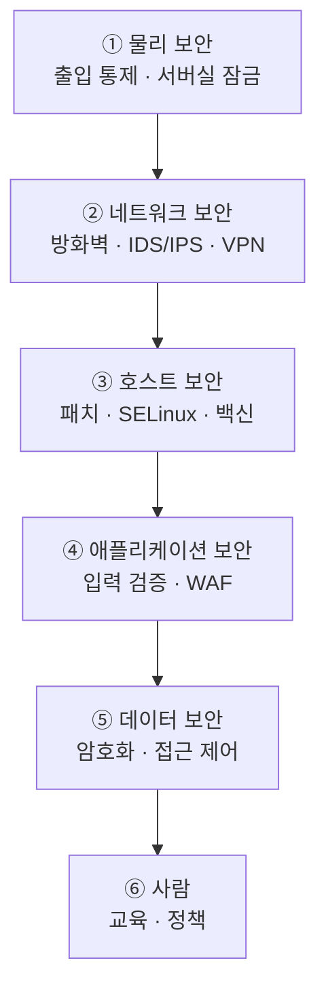
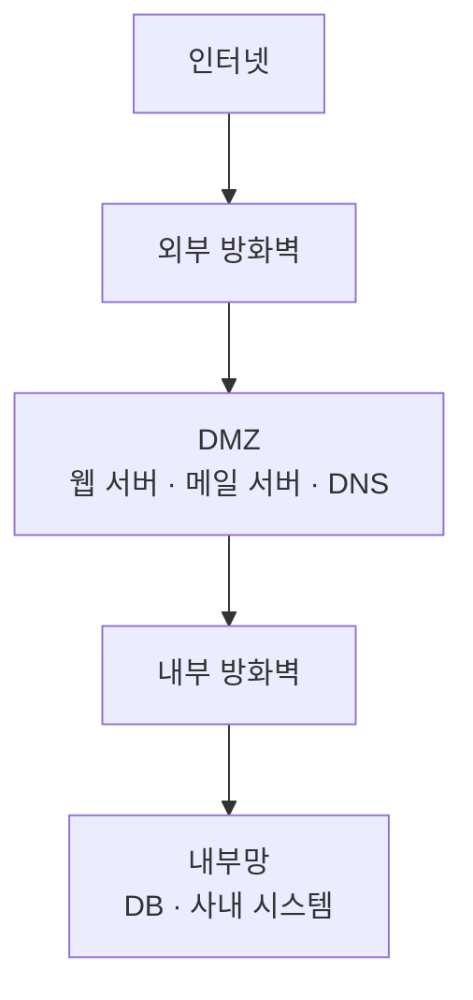
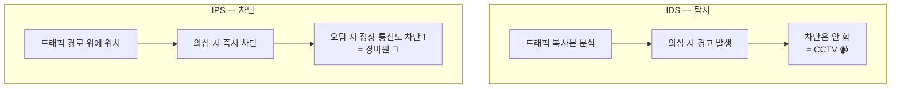
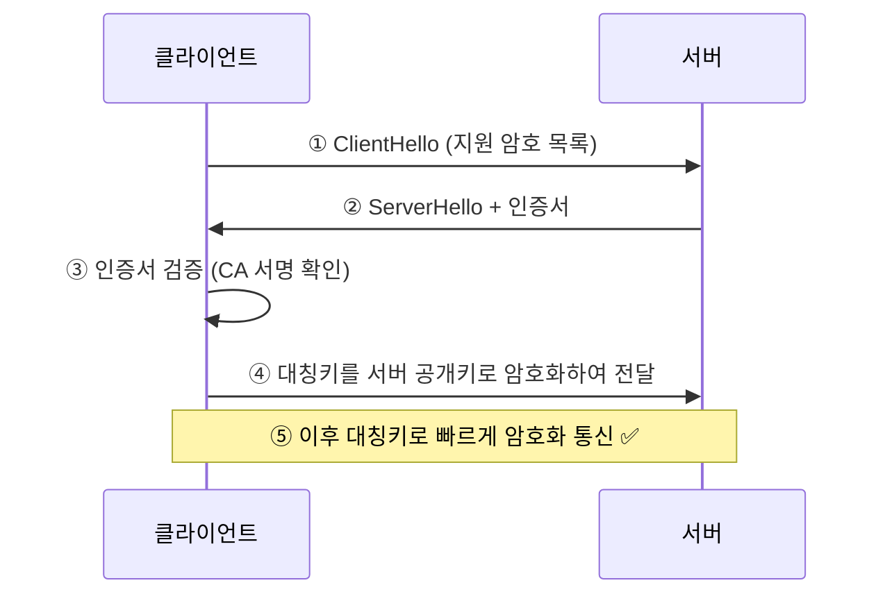
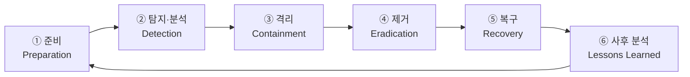
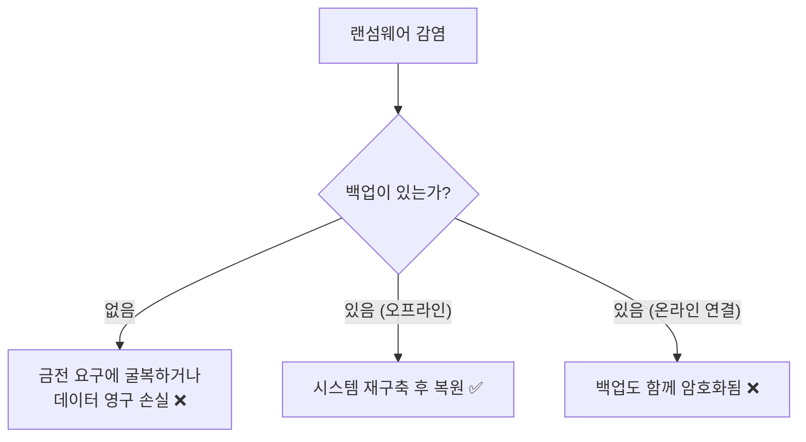

## 046. 침해 대비 및 대처 방안

### 1. 심층 방어 (Defense in Depth)

**하나의 방어선에 의존하면 그것이 뚫리는 순간 끝**입니다.  
여러 겹으로 쌓아 **하나가 뚫려도 다음 층이 막도록** 설계합니다.



| 계층 | 대책 |
| --- | --- |
| **물리** | 서버실 출입 통제, 잠금 장치, CCTV |
| **네트워크** | 방화벽, IDS/IPS, VPN, 네트워크 분리 |
| **호스트** | 보안 패치, SELinux, 백신, 불필요 서비스 제거 |
| **애플리케이션** | 입력 검증, WAF, 시큐어 코딩 |
| **데이터** | 암호화, 접근 제어, 백업 |
| **관리** | 정책, 교육, 감사 |

---

### 2. 방화벽

**허용된 통신만 통과**시키는 관문입니다.

#### 방화벽의 종류

| 유형 | 동작 계층 | 특징 |
| --- | --- | --- |
| **패킷 필터링** | **3~4계층** | IP·포트 기준. 빠르지만 단순 |
| **스테이트풀 인스펙션** | 3~4계층 | **연결 상태를 추적** — 현재 표준 ⭐ |
| **애플리케이션 게이트웨이 (프록시)** | **7계층** | 내용까지 검사. 느리지만 정밀 |
| **WAF** (Web Application Firewall) | **7계층** | **SQL Injection·XSS 등 웹 공격 차단** ⭐ |
| 차세대 방화벽(NGFW) | 통합 | IPS·안티바이러스·앱 제어 통합 |

> **스테이트풀 인스펙션이 중요한 이유**  
> 단순 패킷 필터링은 **"내가 보낸 요청의 응답"인지 구분하지 못합니다.**  
> 응답을 받으려면 인바운드 포트를 열어야 하는데, 그러면 공격에도 노출됩니다.  
> 스테이트풀 방화벽은 **연결 상태를 기억**하여 **응답만 자동 허용**합니다.
>
> ```bash
> # 이 규칙이 스테이트풀의 핵심 ⭐
> $ sudo iptables -A INPUT -m state --state ESTABLISHED,RELATED -j ACCEPT
> ```

#### DMZ 구성



**DMZ(비무장지대)** 는 **외부에 공개해야 하는 서버**를 두는 구간입니다.

> **왜 DMZ를 둘까?**  
> 웹 서버는 외부에 열려 있어야 하므로 **뚫릴 가능성이 상대적으로 높습니다.**  
> 웹 서버를 내부망에 두면, 뚫렸을 때 **DB와 사내 시스템까지 바로 노출**됩니다.  
> DMZ에 격리하면 **웹 서버가 뚫려도 내부망 진입에 또 한 번의 방화벽**을 넘어야 합니다.

```bash
# firewalld의 dmz 존 활용
$ sudo firewall-cmd --zone=dmz --add-interface=enp0s8 --permanent
$ sudo firewall-cmd --zone=dmz --add-service=http --permanent
$ sudo firewall-cmd --reload
```

---

### 3. IDS와 IPS



| 구분 | **IDS** (Intrusion Detection System) | **IPS** (Intrusion Prevention System) |
| --- | --- | --- |
| 역할 | **탐지 후 경고** | **탐지 후 차단** ⭐ |
| 위치 | 트래픽 **복사본** 분석 (미러링) | 트래픽 **경로 위** (인라인) |
| 영향 | 장애 시 통신 영향 없음 | **장애 시 통신 단절** |
| 오탐 시 | 경고만 | **정상 통신 차단** ❗ |
| 비유 | **CCTV** | **경비원** |

#### 탐지 방식

| 방식 | 설명 | 장단점 |
| --- | --- | --- |
| **시그니처 기반 (오용 탐지)** | **알려진 공격 패턴**과 비교 | 정확하지만 **신종 공격 못 잡음** ❗ |
| **이상 탐지 (Anomaly)** | **평소와 다른 행위** 탐지 | 신종 대응 가능하지만 **오탐 많음** |

> **시그니처 기반의 한계**  
> 백신과 같은 원리라 **처음 등장하는 공격(제로데이)** 은 탐지하지 못합니다.  
> 그래서 두 방식을 **함께 사용**하는 것이 일반적입니다.

#### Snort — 대표적인 오픈소스 IDS/IPS

```bash
$ sudo dnf install snort

# 룰 예시
alert tcp any any -> $HOME_NET 22 (msg:"SSH Brute Force"; \
    flow:to_server; threshold:type both, track by_src, count 5, seconds 60; \
    sid:1000001;)

$ sudo snort -A console -q -c /etc/snort/snort.conf -i eth0
```

| 구성 | 의미 |
| --- | --- |
| `alert` | 동작 (alert / log / pass / drop) |
| `tcp any any -> $HOME_NET 22` | 프로토콜·출발지·목적지 |
| `msg` | 경고 메시지 |
| `threshold` | 임계값 (5회/60초) |
| `sid` | 룰 고유 번호 |

#### 호스트 기반 도구

| 도구 | 역할 |
| --- | --- |
| **AIDE / Tripwire** | **파일 무결성 검사 (HIDS)** ⭐ |
| **fail2ban** | 로그 분석 후 **자동 IP 차단** ⭐ |
| OSSEC | 통합 HIDS |
| auditd | 시스템 호출 감사 |

```bash
# fail2ban — 가장 실용적인 자동 방어 ⭐
$ sudo dnf install epel-release && sudo dnf install fail2ban
$ sudo vi /etc/fail2ban/jail.local
```
```ini
[DEFAULT]
bantime  = 3600
findtime = 600
maxretry = 5

[sshd]
enabled = true
port    = 22

[nginx-http-auth]
enabled = true
```
```bash
$ sudo systemctl enable --now fail2ban
$ sudo fail2ban-client status sshd
$ sudo fail2ban-client set sshd unbanip 203.0.113.55
```

---

### 4. 암호화

#### 대칭키 vs 공개키 (시험 출제)


| 구분 | **대칭키 (비밀키)** | **공개키 (비대칭키)** |
| --- | --- | --- |
| 키 | **동일한 키** | **공개키 + 개인키 쌍** |
| **속도** | **빠름** ⭐ | 느림 |
| 키 개수 (n명) | **n(n-1)/2** ⭐ | **2n** ⭐ |
| **키 분배** | **어려움** ❗ | **쉬움** ✅ |
| 전자 서명 | 불가 | **가능** ⭐ |
| 알고리즘 | **AES, DES, 3DES, SEED, ARIA** | **RSA, ECC, DSA, ElGamal** |

> **실제로는 두 방식을 함께 씁니다 (하이브리드).**  
> HTTPS를 예로 들면,  
> ① **공개키로 대칭키를 안전하게 전달**하고  
> ② 이후 실제 데이터는 **빠른 대칭키로 암호화**합니다.  
> 두 방식의 장점만 취한 구조입니다.

#### 해시 함수

| 특성 | 설명 |
| --- | --- |
| **단방향** | **복호화 불가** ⭐ |
| **고정 길이** | 입력 크기와 무관하게 같은 길이 |
| **눈사태 효과** | 입력이 조금만 달라도 결과가 완전히 달라짐 |
| **충돌 저항성** | 같은 해시를 만드는 다른 입력을 찾기 어려움 |

| 알고리즘 | 상태 |
| --- | --- |
| MD5 | **취약 — 사용 금지** ❗ |
| SHA-1 | **취약** ❗ |
| **SHA-256 / SHA-512** | **안전 (현재 표준)** ⭐ |
| bcrypt / scrypt / Argon2 | **비밀번호 저장 전용** (의도적으로 느림) ⭐ |

```bash
$ sha256sum file.txt
$ md5sum file.txt              # 무결성 확인용으로만 (보안 X)

# 다운로드 파일 검증 ⭐
$ sha256sum -c checksums.txt
```

> **비밀번호에 SHA-256을 쓰면 안 되는 이유**  
> SHA-256은 **너무 빠릅니다.** GPU로 초당 수십억 번 시도할 수 있습니다.  
> **bcrypt·Argon2는 의도적으로 느리게** 설계되어 무차별 대입을 어렵게 만듭니다.

#### 전자 서명


> **암호화와 서명의 키 사용이 반대입니다 (시험 출제)**  
> **비밀 전송** : 상대의 **공개키**로 암호화 → 상대만 열어 봄  
> **전자 서명** : 자신의 **개인키**로 서명 → 누구나 검증 가능, **나만 만들 수 있음**

#### 디스크 암호화

```bash
# LUKS 디스크 암호화 ⭐
$ sudo cryptsetup luksFormat /dev/sdb1
$ sudo cryptsetup luksOpen /dev/sdb1 secure_disk
$ sudo mkfs.xfs /dev/mapper/secure_disk
$ sudo mount /dev/mapper/secure_disk /secure

$ sudo cryptsetup luksClose secure_disk
$ sudo cryptsetup luksDump /dev/sdb1
```

> **노트북이나 이동식 디스크는 물리적으로 도난당할 수 있습니다.**  
> 디스크 암호화가 없으면 **다른 시스템에 연결해 그대로 읽을 수 있습니다.**

---

### 5. 보안 프로토콜

| 프로토콜 | 계층 | 용도 |
| --- | --- | --- |
| **SSL / TLS** | 전송~응용 | **HTTPS, 메일 암호화** ⭐ |
| **IPSec** | **네트워크(3계층)** | **VPN** ⭐ |
| **SSH** | 응용 | 원격 접속 |
| **Kerberos** | 응용 | 티켓 기반 인증 |
| S/MIME, PGP | 응용 | 메일 암호화·서명 |

#### TLS 핸드셰이크



```bash
# 인증서 확인
$ openssl s_client -connect example.com:443 -servername example.com
$ openssl x509 -in cert.crt -text -noout
$ openssl x509 -in cert.crt -noout -dates      # 만료일 확인 ⭐
```

> **인증서 만료는 흔한 장애 원인**입니다.  
> 자동 갱신(`certbot renew`)을 설정하고 **만료일 모니터링**을 해야 합니다.

#### VPN

| 방식 | 특징 |
| --- | --- |
| **IPSec VPN** | 3계층, **네트워크 전체 터널** |
| **SSL VPN** | 웹 브라우저만으로 접속 가능 |
| **OpenVPN** | 오픈소스, 유연 |
| **WireGuard** | **최신, 빠르고 단순** ⭐ |

---

### 6. 로그 관리와 감사


#### 로그가 침해 대응의 핵심인 이유

> 공격자가 **가장 먼저 하는 일이 로그 삭제**입니다.  
> 로컬 로그만 있으면 **침해 사실조차 알 수 없습니다.**  
> **원격 전송**해 두면 로컬이 지워져도 증거가 남습니다.

```bash
# ① 중앙 로그 서버로 전송 ⭐
$ sudo vi /etc/rsyslog.conf
*.* @@logserver.example.com:514        # TCP 전송

# ② 로그 변조 방지
$ sudo chattr +a /var/log/audit/audit.log     # 추가만 가능 ⭐

# ③ 감사 로그 (auditd)
$ sudo systemctl enable --now auditd
$ sudo auditctl -w /etc/passwd -p wa -k passwd_changes
$ sudo auditctl -w /etc/shadow -p wa -k shadow_changes
$ sudo ausearch -k passwd_changes
```

| 점검 대상 | 명령 |
| --- | --- |
| 로그인 성공 | `last` |
| **로그인 실패** | **`lastb`** ⭐ |
| sudo 사용 | `grep sudo /var/log/secure` |
| 파일 변경 감사 | `ausearch -k 키워드` |

---

### 7. 취약점 관리

```bash
# ① 보안 업데이트 확인·적용 ⭐
$ sudo dnf updateinfo list security
$ sudo dnf update --security

# ② 자동 업데이트
$ sudo dnf install dnf-automatic
$ sudo vi /etc/dnf/automatic.conf
upgrade_type = security
apply_updates = yes
$ sudo systemctl enable --now dnf-automatic.timer

# ③ 취약점 스캔
$ sudo dnf install openscap-scanner scap-security-guide
$ sudo oscap xccdf eval --profile cis \
    --results /tmp/results.xml \
    /usr/share/xml/scap/ssg/content/ssg-rl8-ds.xml
```

> **취약점 공개 = 공격 시작**입니다.  
> CVE가 발표되면 **공격 코드(PoC)도 함께 공개**되는 경우가 많습니다.  
> **패치 적용까지의 시간이 곧 노출 시간**입니다.

| 활동 | 주기 |
| --- | --- |
| **보안 패치 적용** | **즉시~주 1회** |
| 취약점 스캔 | 월 1회 |
| 계정·권한 점검 | 분기 1회 |
| 모의 침투 테스트 | 연 1~2회 |
| 백업 복구 훈련 | **반기 1회** ⭐ |

---

### 8. 침해 사고 대응 절차 (시험 출제)



| 단계 | 활동 |
| --- | --- |
| **① 준비** | 대응 절차 수립, 연락 체계, 도구 준비, **백업 확보** |
| **② 탐지·분석** | 이상 징후 확인, **증거 수집**, 침해 범위 파악 |
| **③ 격리** | **네트워크 분리**, 계정 차단, 확산 방지 ⭐ |
| **④ 제거** | 악성코드·백도어 제거, **취약점 패치** |
| **⑤ 복구** | 백업에서 복원, 정상 동작 확인, 모니터링 강화 |
| **⑥ 사후 분석** | 원인 분석, 재발 방지 대책, 절차 개선 |

#### 격리 단계에서 반드시 지켜야 할 것

```bash
# ⭐ 전원을 끄지 마세요 (증거 소실)
# 메모리에만 존재하는 악성코드·세션 정보가 사라집니다

# ① 네트워크만 분리
$ sudo ip link set eth0 down
# 또는 방화벽으로 격리
$ sudo firewall-cmd --panic-on

# ② 휘발성 증거부터 수집 ⭐
$ date > /evidence/date.txt
$ w > /evidence/who.txt
$ ps auxf > /evidence/ps.txt
$ netstat -antup > /evidence/netstat.txt
$ lsof -i > /evidence/lsof.txt
$ last > /evidence/last.txt
$ lastb > /evidence/lastb.txt

# ③ 디스크 이미지 확보 (원본 보존)
$ sudo dd if=/dev/sda of=/external/image.dd bs=4M conv=noerror,sync
$ sha256sum /external/image.dd > /external/image.dd.sha256
```

> **증거 수집의 원칙 — 휘발성이 높은 것부터**  
> 레지스터 → **메모리 → 네트워크 상태 → 프로세스** → 디스크 → 백업  
>
> **전원을 끄면 메모리 증거가 모두 사라집니다.**  
> 실제 침해 사고 조사에서 가장 흔한 실수입니다.

#### 무결성 확보

```bash
# 이미지 해시로 원본 무결성 증명 ⭐
$ sha256sum image.dd
# 조사는 반드시 사본으로 수행
```

---

### 9. 백업과 복구 — 마지막 방어선

**랜섬웨어에 대한 유일하게 확실한 대책은 백업**입니다.



| 원칙 | 설명 |
| --- | --- |
| **3-2-1 규칙** | 복사본 3, 매체 2종, **원격 1** |
| **오프라인 백업** | **평소 연결을 끊어 둠** ⭐ (랜섬웨어 방어의 핵심) |
| 불변 저장소 | WORM, 오브젝트 락 |
| **복구 테스트** | **정기적으로 실제 복원 확인** ⭐ |

> **네트워크에 연결된 백업은 랜섬웨어에 함께 암호화됩니다.**  
> NAS나 공유 폴더 백업만 믿으면 안 되고,  
> **테이프나 분리된 외장 디스크** 같은 오프라인 사본이 반드시 필요합니다.

---

### 10. 보안 정책과 관리

| 영역 | 내용 |
| --- | --- |
| **계정 정책** | 비밀번호 복잡도·주기, 퇴사자 즉시 삭제 |
| **접근 통제** | **최소 권한**, 직무 분리, 정기 권한 검토 |
| **변경 관리** | 변경 승인 절차, 기록 |
| **자산 관리** | 서버·소프트웨어 목록, 담당자 |
| **교육** | 정기 보안 교육, **모의 피싱 훈련** ⭐ |
| **감사** | 로그 검토, 정기 점검 |

#### 관련 법·기준

| 항목 | 내용 |
| --- | --- |
| **개인정보 보호법** | 개인정보 수집·이용·파기 기준 |
| **정보통신망법** | 정보통신망 이용 촉진 및 정보보호 |
| **ISMS-P** | 정보보호 및 개인정보보호 관리체계 인증 |
| ISO 27001 | 국제 정보보안 관리 표준 |
| CVE / CVSS | 취약점 식별자 / 심각도 점수 |

---

### 11. 리눅스 서버 보안 체크리스트 (실무 종합)

```bash
# ────────── 계정 ──────────
$ awk -F: '$3==0 {print $1}' /etc/passwd              # UID 0은 root뿐? ⭐
$ sudo awk -F: '$2=="" {print $1}' /etc/shadow        # 빈 비밀번호?
$ grep -vE "nologin|false" /etc/passwd                # 로그인 가능 계정
$ sudo lastlog -b 90                                   # 90일 미사용 계정

# ────────── 서비스·포트 ──────────
$ sudo ss -tulnp                                       # 열린 포트 ⭐
$ systemctl list-units --type=service --state=running
$ systemctl list-unit-files --state=enabled

# ────────── 파일 권한 ──────────
$ sudo find / -perm -4000 -type f 2>/dev/null          # SetUID ⭐
$ sudo find / -type f -perm -o+w 2>/dev/null           # 누구나 쓰기 가능
$ sudo find / -nouser -o -nogroup 2>/dev/null          # 소유자 없는 파일

# ────────── 보안 기능 ──────────
$ getenforce                                           # SELinux ⭐
$ sudo firewall-cmd --state                            # 방화벽 ⭐
$ grep PermitRootLogin /etc/ssh/sshd_config            # SSH root 차단 ⭐

# ────────── 무결성·로그 ──────────
$ sudo rpm -Va | grep "^..5"                           # 파일 변조 ⭐
$ sudo lastb | head -20                                # 로그인 실패 ⭐
$ sudo aide --check                                    # 무결성 검사

# ────────── 업데이트 ──────────
$ sudo dnf updateinfo list security                    # 보안 패치 ⭐
```

#### 우선순위별 조치

| 순위 | 조치 |
| --- | --- |
| **1** | **보안 패치 적용** |
| **2** | **불필요한 서비스·포트 폐쇄** |
| **3** | **SSH 강화** (root 차단, 공개키 인증) |
| **4** | **방화벽 + SELinux 활성화** |
| **5** | **강력한 비밀번호 + 실패 잠금** |
| **6** | **로그 원격 전송 + 정기 점검** |
| **7** | **정기 백업 + 복구 테스트** |

---

### 12. 자동화 스크립트 예시

```bash
#!/bin/bash
# /usr/local/bin/security_check.sh
LOG="/var/log/security_check.log"
exec >> "$LOG" 2>&1
echo "===== $(date '+%F %T') 보안 점검 ====="

# UID 0 계정 점검
ROOTS=$(awk -F: '$3==0 {print $1}' /etc/passwd | grep -v '^root$')
[ -n "$ROOTS" ] && logger -p auth.crit "UID 0 계정 발견: $ROOTS"

# 빈 비밀번호 점검
EMPTY=$(awk -F: '$2=="" {print $1}' /etc/shadow)
[ -n "$EMPTY" ] && logger -p auth.crit "빈 비밀번호 계정: $EMPTY"

# SetUID 변화 감지 ⭐
find / -perm -4000 -type f 2>/dev/null | sort > /tmp/setuid.now
if [ -f /root/setuid.baseline ]; then
    DIFF=$(diff /root/setuid.baseline /tmp/setuid.now)
    [ -n "$DIFF" ] && logger -p auth.crit "SetUID 파일 변경 감지: $DIFF"
else
    cp /tmp/setuid.now /root/setuid.baseline
fi

# 로그인 실패 급증 감지
FAILS=$(lastb -s "$(date -d '1 hour ago' '+%Y%m%d%H%M%S')" 2>/dev/null | wc -l)
[ "$FAILS" -gt 50 ] && logger -p auth.crit "로그인 실패 급증: ${FAILS}건/1시간"

# 보안 업데이트 확인
UPD=$(dnf updateinfo list security 2>/dev/null | grep -c "^RHSA\|^RLSA")
[ "$UPD" -gt 0 ] && logger -p auth.warning "미적용 보안 업데이트 ${UPD}건"

echo "점검 완료"
```

```bash
$ sudo chmod +x /usr/local/bin/security_check.sh
$ echo "0 6 * * * root /usr/local/bin/security_check.sh" | sudo tee /etc/cron.d/seccheck
```

---

### 시험 포인트 정리

| 항목 | 핵심 |
| --- | --- |
| 보안 설계 원칙 | **심층 방어 (Defense in Depth)** |
| **DMZ** | **외부 공개 서버를 격리하는 구간** ⭐ |
| 스테이트풀 인스펙션 | **연결 상태 추적** (`ESTABLISHED,RELATED`) |
| **WAF** | **7계층 — SQL Injection·XSS 차단** |
| **IDS vs IPS** | **탐지·경고 / 탐지·차단** ⭐ |
| IDS 위치 | 트래픽 **복사본** (미러링) |
| IPS 위치 | 트래픽 **경로 위** (인라인) |
| 시그니처 기반 | 알려진 공격만 탐지 (**제로데이 취약**) |
| 이상 탐지 | 신종 대응 가능, **오탐 많음** |
| 대표 IDS | **Snort** |
| 파일 무결성 | **AIDE, Tripwire** |
| 자동 IP 차단 | **fail2ban** ⭐ |
| **대칭키** | **빠름, 키 분배 어려움, n(n-1)/2** |
| **공개키** | **느림, 키 분배 쉬움, 2n, 전자 서명 가능** ⭐ |
| 대칭키 알고리즘 | **AES, DES, SEED, ARIA** |
| 공개키 알고리즘 | **RSA, ECC, DSA** |
| 해시 특성 | **단방향, 복호화 불가** |
| 안전한 해시 | **SHA-256 이상** (MD5·SHA-1 취약) |
| 비밀번호 저장 | **bcrypt, Argon2** |
| **전자 서명** | **개인키로 서명, 공개키로 검증** ⭐ |
| VPN 프로토콜 | **IPSec (3계층)** |
| 디스크 암호화 | **LUKS** |
| **침해 대응 절차** | **준비 → 탐지 → 격리 → 제거 → 복구 → 사후분석** ⭐ |
| 증거 수집 순서 | **휘발성 높은 것부터 (메모리 → 디스크)** ⭐ |
| 침해 시 금기 | **전원 차단 (증거 소실)** ❗ |
| 랜섬웨어 대책 | **오프라인 백업** ⭐ |

---

### 한 줄 정리

보안은 **심층 방어(물리·네트워크·호스트·앱·데이터·사람)** 로 여러 겹을 쌓아야 하며,  
**IDS는 탐지·경고, IPS는 차단**이고 **대칭키(빠름)와 공개키(키 분배 쉬움·전자 서명)** 를 조합해 사용하며,  
침해 사고는 **준비 → 탐지 → 격리 → 제거 → 복구 → 사후 분석** 순으로 대응하되  
**전원을 끄지 말고 휘발성 증거부터 수집**해야 하고, **랜섬웨어의 유일한 대책은 오프라인 백업**입니다.
