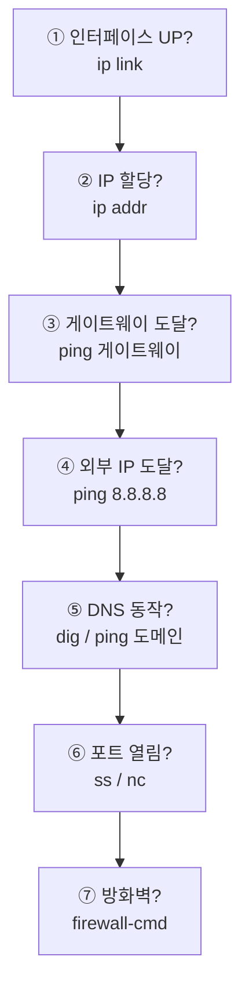

## A4. 네트워크 명령어

> 이론은 [012~015], [032. 방화벽과 SELinux], [042. DNS 서비스]를 참고하세요.

---

### 1. 신구 명령어 대응표 (반드시 알아야 함)

`net-tools` 패키지의 명령어는 **더 이상 유지보수되지 않습니다.**  
현재는 `iproute2` 패키지의 명령을 사용합니다.

| 기능 | **구 명령 (net-tools)** | **현 명령 (iproute2)** ⭐ |
| --- | --- | --- |
| IP 조회·설정 | `ifconfig` | **`ip addr`**, `ip link` |
| 라우팅 | `route` | **`ip route`** |
| ARP 캐시 | `arp` | **`ip neigh`** |
| 소켓·포트 | `netstat` | **`ss`** |
| 멀티캐스트 | `ipmaddr` | `ip maddr` |
| 터널 | `iptunnel` | `ip tunnel` |

> **시험에서는 둘 다 출제**되므로 양쪽을 알아 두어야 합니다.  
> 실무에서는 **`ip`와 `ss`** 를 쓰는 것이 원칙입니다.

---

### 2. 인터페이스와 IP — `ip`

```bash
# ────────── 조회 ──────────
$ ip addr show                   # ⭐ 전체
$ ip a                           # 축약
$ ip addr show enp0s3            # 특정 인터페이스
$ ip -4 addr                     # IPv4만
$ ip -br addr                    # ⭐ 간결하게 (brief)
lo     UNKNOWN  127.0.0.1/8
enp0s3 UP       192.168.0.10/24

$ ip link show                   # ⭐ 링크 상태 (MAC, MTU)
$ ip -s link show enp0s3         # ⭐ 통계 (에러·드롭 확인)
    RX: bytes packets errors dropped
    123456789  987654      0      12

# ────────── 설정 (임시 — 재부팅 시 사라짐) ⭐ ──────────
$ sudo ip addr add 192.168.0.50/24 dev enp0s3
$ sudo ip addr del 192.168.0.50/24 dev enp0s3
$ sudo ip link set enp0s3 up
$ sudo ip link set enp0s3 down
$ sudo ip link set enp0s3 mtu 9000
$ sudo ip link set enp0s3 address 00:11:22:33:44:55
```

```bash
# 구 명령 (참고)
$ ifconfig
$ ifconfig enp0s3 192.168.0.50 netmask 255.255.255.0
$ ifconfig enp0s3 up / down
$ ifup enp0s3 / ifdown enp0s3
```

> **`ip` 명령으로 한 설정은 모두 임시**입니다. ⭐  
> 영구 설정은 **`nmcli`(RHEL)** 또는 **Netplan(Ubuntu)** 을 써야 합니다.

---

### 3. 라우팅

```bash
$ ip route                       # ⭐ 라우팅 테이블
default via 192.168.0.1 dev enp0s3 proto dhcp metric 100
192.168.0.0/24 dev enp0s3 proto kernel scope link src 192.168.0.10

$ ip route show
$ ip -6 route                    # IPv6

# ⭐ 특정 목적지로 갈 때 쓸 경로 확인 (진단에 매우 유용)
$ ip route get 8.8.8.8
8.8.8.8 via 192.168.0.1 dev enp0s3 src 192.168.0.10

# 설정 (임시)
$ sudo ip route add default via 192.168.0.1
$ sudo ip route add 10.0.0.0/24 via 192.168.0.254        # 정적 경로
$ sudo ip route del 10.0.0.0/24
$ sudo ip route replace default via 192.168.0.1

# 구 명령
$ route -n                       # ⭐ 숫자로 표시
$ sudo route add default gw 192.168.0.1
$ sudo route add -net 10.0.0.0/24 gw 192.168.0.254
$ netstat -rn                    # 라우팅 테이블
```

---

### 4. ARP

```bash
$ ip neigh                       # ⭐ ARP 캐시
192.168.0.1 dev enp0s3 lladdr aa:bb:cc:dd:ee:ff REACHABLE

$ ip neigh show dev enp0s3
$ sudo ip neigh del 192.168.0.1 dev enp0s3
$ sudo ip neigh flush all
$ sudo ip neigh add 192.168.0.1 lladdr aa:bb:cc:dd:ee:ff dev enp0s3 nud permanent   # 정적 ⭐

# 구 명령
$ arp -a
$ arp -n
$ sudo arp -d 192.168.0.1
$ sudo arp -s 192.168.0.1 aa:bb:cc:dd:ee:ff      # 정적 등록
```

> **ARP 스푸핑 탐지** ⭐  
> **같은 MAC 주소가 여러 IP에 매핑**되어 있으면 의심해야 합니다.
> ```bash
> $ ip neigh | awk '{print $5}' | sort | uniq -c | sort -rn | head
> ```

---

### 5. 포트와 소켓 — `ss`

```bash
$ ss -tulnp                      # ⭐⭐ 가장 자주 쓰는 조합
Netid State  Local Address:Port  Peer Address:Port Process
tcp   LISTEN 0.0.0.0:22          0.0.0.0:*         users:(("sshd",pid=856))
tcp   LISTEN 0.0.0.0:80          0.0.0.0:*         users:(("httpd",pid=1203))
```

| 옵션 | 의미 |
| --- | --- |
| **`-t`** | TCP |
| **`-u`** | UDP |
| **`-l`** | **LISTEN 상태만** |
| **`-n`** | 숫자로 (이름 변환 안 함 → 빠름) |
| **`-p`** | **프로세스 정보** (root 필요) |
| `-a` | 모든 소켓 |
| `-s` | 요약 통계 |
| `-4` / `-6` | IPv4 / IPv6 |
| `-x` | UNIX 소켓 |

```bash
$ ss -tan                        # 모든 TCP 소켓
$ ss -s                          # ⭐ 요약 통계
Total: 512
TCP:   380 (estab 120, closed 200, timewait 195)

$ ss -tan state established      # 연결된 것만
$ ss -tan '( dport = :443 )'     # 특정 포트
$ ss -tp                          # 프로세스와 함께

# ⭐ 상태별 연결 수 집계
$ ss -tan | awk '{print $1}' | sort | uniq -c | sort -rn

# 구 명령
$ netstat -tulnp                 # ⭐
$ netstat -an
$ netstat -rn                    # 라우팅
$ netstat -i                     # 인터페이스 통계
$ netstat -s                     # 프로토콜 통계
```

#### 포트를 쓰는 프로세스 찾기 (실무 필수)

```bash
$ sudo ss -tulnp | grep :80      # ⭐
$ sudo lsof -i :80               # ⭐
$ sudo fuser 80/tcp
$ sudo netstat -tulnp | grep :80
```

> **`0.0.0.0`으로 LISTEN 중이면 모든 인터페이스에서 수신**한다는 뜻입니다.  
> 내부 전용 서비스는 **`127.0.0.1`에 바인딩**해야 안전합니다. ⭐

#### TCP 연결 상태

| 상태 | 의미 |
| --- | --- |
| **LISTEN** | 서버가 연결 대기 중 |
| **ESTABLISHED** | 연결 완료, 통신 중 |
| SYN-SENT | 연결 요청 후 대기 |
| **TIME-WAIT** | 종료 후 잔여 패킷 대기 (**정상**) |
| CLOSE-WAIT | 상대가 종료 요청 |

---

### 6. 연결 테스트

#### `ping`

```bash
$ ping 8.8.8.8
$ ping -c 4 8.8.8.8              # ⭐ 4번만
$ ping -i 0.2 192.168.0.1        # 간격 0.2초
$ ping -s 1000 8.8.8.8           # 패킷 크기
$ ping -W 2 -c 1 192.168.0.50    # ⭐ 타임아웃 2초 (스크립트용)
$ ping -I enp0s3 8.8.8.8         # 인터페이스 지정
$ ping6 ::1                       # IPv6
```

> **`ping`이 안 된다고 서버가 죽은 것은 아닙니다.**  
> 많은 서버가 보안상 **ICMP를 차단**합니다.  
> 서비스 확인은 **포트로** 해야 합니다. (`nc -zv`)

#### 경로 추적

```bash
$ traceroute 8.8.8.8             # ⭐
 1  192.168.0.1    0.512 ms
 2  10.20.30.1     5.123 ms
 3  * * *                        ← ICMP 차단 (반드시 장애는 아님)

$ traceroute -n 8.8.8.8          # 숫자로 (빠름)
$ traceroute -T -p 443 host      # TCP로 추적 (ICMP 차단 우회)
$ tracepath 8.8.8.8              # root 불필요
$ mtr 8.8.8.8                    # ⭐ ping + traceroute 실시간
$ mtr -r -c 10 8.8.8.8           # 리포트 형식
```

#### 포트 연결 확인

```bash
$ nc -zv example.com 443         # ⭐ 포트 열림 확인
Connection to example.com 443 port [tcp/https] succeeded!

$ nc -zv 192.168.0.20 3306
$ nc -zv -w 3 host 80            # 타임아웃 3초
$ nc -zvu host 53                # UDP
$ nc -zv host 20-80              # 포트 범위 스캔

$ telnet host 80                 # 연결되면 열린 것
$ timeout 3 bash -c "</dev/tcp/192.168.0.50/80" && echo OPEN     # ⭐ 도구 없이
```

> **`nc -zv`가 가장 빠른 포트 확인 방법**입니다. ⭐  
> `-z`(스캔만), `-v`(결과 표시) 조합입니다.

---

### 7. DNS 조회

```bash
# ────────── dig (가장 상세, 권장) ⭐ ──────────
$ dig www.example.com
;; ANSWER SECTION:
www.example.com.  86400  IN  A  93.184.216.34

$ dig +short www.example.com     # ⭐ 결과만
$ dig example.com MX             # ⭐ 메일 서버
$ dig example.com NS             # 네임 서버
$ dig example.com SOA
$ dig example.com TXT            # ⭐ SPF 등
$ dig example.com ANY
$ dig @8.8.8.8 example.com       # ⭐ 특정 DNS 서버에 질의
$ dig -x 8.8.8.8                 # ⭐ 역방향 조회 (PTR)
$ dig +trace www.example.com     # ⭐ 루트부터 전 과정 추적
$ dig +noall +answer example.com # 답변만

# ────────── 간단 조회 ──────────
$ host example.com
$ host -t MX example.com
$ host 192.168.0.50              # 역방향

$ nslookup example.com
$ nslookup
> server 8.8.8.8
> set type=MX
> example.com
> exit

# ────────── 이름 조회 순서 확인 ──────────
$ getent hosts example.com       # ⭐ /etc/hosts + DNS
$ cat /etc/nsswitch.conf | grep hosts
hosts: files dns                 # ⭐ /etc/hosts 먼저, 그다음 DNS
```

> **`ping 8.8.8.8`은 되는데 `ping google.com`이 안 된다면** ⭐  
> 네트워크는 정상이고 **DNS만 문제**입니다.  
> `/etc/resolv.conf`를 확인하세요.

---

### 8. 영구 네트워크 설정

#### RHEL/Rocky — `nmcli`

```bash
# 조회
$ nmcli connection show                  # ⭐ 연결 목록
$ nmcli device status                    # ⭐ 장치 상태
$ nmcli connection show enp0s3           # 상세
$ nmcli -f ipv4 connection show enp0s3

# 고정 IP 설정 ⭐
$ sudo nmcli connection modify enp0s3 \
    ipv4.method manual \
    ipv4.addresses 192.168.0.10/24 \
    ipv4.gateway 192.168.0.1 \
    ipv4.dns "8.8.8.8 1.1.1.1"

# DHCP로 변경
$ sudo nmcli connection modify enp0s3 ipv4.method auto

# 자동 연결
$ sudo nmcli connection modify enp0s3 connection.autoconnect yes

# 적용 ⭐
$ sudo nmcli connection up enp0s3
$ sudo nmcli device reapply enp0s3

# 새 연결 생성
$ sudo nmcli connection add type ethernet ifname enp0s8 con-name eth1 \
    ip4 192.168.1.10/24 gw4 192.168.1.1

# 삭제
$ sudo nmcli connection delete eth1
```

#### 설정 파일 직접 편집

```bash
$ sudo vi /etc/sysconfig/network-scripts/ifcfg-enp0s3
```
```ini
TYPE=Ethernet
BOOTPROTO=static          # static | dhcp | none ⭐
NAME=enp0s3
DEVICE=enp0s3
ONBOOT=yes                # ⭐ 부팅 시 활성화 (가장 자주 빠뜨림)
IPADDR=192.168.0.10
PREFIX=24
GATEWAY=192.168.0.1
DNS1=8.8.8.8
DNS2=1.1.1.1
```
```bash
$ sudo nmcli connection reload
$ sudo nmcli connection up enp0s3
```

#### Ubuntu — Netplan

```bash
$ sudo vi /etc/netplan/01-netcfg.yaml
```
```yaml
network:
  version: 2
  renderer: networkd
  ethernets:
    enp0s3:
      dhcp4: no
      addresses: [192.168.0.10/24]
      routes:
        - to: default
          via: 192.168.0.1
      nameservers:
        addresses: [8.8.8.8, 1.1.1.1]
```
```bash
$ sudo netplan try            # ⭐ 안전 적용 (120초 내 확인 없으면 롤백)
$ sudo netplan apply
```

> **원격 서버에서는 `netplan try`를 쓰세요.** ⭐  
> 설정이 잘못되어 접속이 끊겨도 **자동으로 롤백**됩니다.

---

### 9. 주요 설정 파일

| 파일 | 역할 |
| --- | --- |
| **`/etc/hostname`** | 호스트 이름 |
| **`/etc/hosts`** | **IP ↔ 이름 정적 매핑 (DNS보다 우선)** ⭐ |
| **`/etc/resolv.conf`** | **DNS 서버 주소** |
| **`/etc/nsswitch.conf`** | 이름 조회 순서 |
| `/etc/services` | 서비스명 ↔ 포트 |
| `/etc/protocols` | 프로토콜 번호 |
| `/etc/sysconfig/network-scripts/ifcfg-*` | RHEL 인터페이스 설정 |
| `/etc/netplan/*.yaml` | Ubuntu 설정 |

```bash
# 호스트명
$ hostname
$ hostnamectl set-hostname server01.example.com    # ⭐ 영구 변경

# /etc/hosts
$ cat /etc/hosts
127.0.0.1   localhost
192.168.0.20  db-server

# DNS
$ cat /etc/resolv.conf
nameserver 8.8.8.8
search example.com
```

> **`/etc/resolv.conf`는 NetworkManager가 덮어씁니다.** ⭐  
> 직접 수정해도 재부팅하면 사라지므로 **`nmcli ipv4.dns`** 로 설정해야 합니다.

> **`/etc/hosts`가 DNS보다 우선**입니다.  
> 개발 중 특정 도메인을 테스트 서버로 강제 연결할 때 유용합니다.

---

### 10. 방화벽

#### `firewalld` (RHEL/Rocky)

```bash
$ sudo firewall-cmd --state                    # 상태
$ sudo firewall-cmd --list-all                 # ⭐ 현재 설정 전체
$ sudo firewall-cmd --get-default-zone
$ sudo firewall-cmd --get-active-zones
$ sudo firewall-cmd --get-services             # 사용 가능한 서비스

# 서비스 단위 (권장) ⭐
$ sudo firewall-cmd --add-service=http --permanent
$ sudo firewall-cmd --remove-service=ssh --permanent

# 포트 단위
$ sudo firewall-cmd --add-port=8080/tcp --permanent
$ sudo firewall-cmd --add-port=5000-5100/tcp --permanent

# ⭐⭐ 반드시 reload 해야 적용
$ sudo firewall-cmd --reload

# 확인
$ sudo firewall-cmd --list-services
$ sudo firewall-cmd --list-ports

# Rich Rule
$ sudo firewall-cmd --permanent --add-rich-rule=\
'rule family="ipv4" source address="192.168.0.0/24" service name="ssh" accept'

# 침해 시 전체 차단
$ sudo firewall-cmd --panic-on
$ sudo firewall-cmd --panic-off
```

> **`--permanent` + `--reload` 조합이 핵심**입니다. ⭐  
> `--permanent` 없이 추가 → 재부팅 시 사라짐  
> `--permanent`만 → 지금은 적용 안 됨  
> **둘 다** → 지금도 적용되고 유지됨 ✅

#### `iptables`

```bash
$ sudo iptables -L -n -v --line-numbers        # ⭐ 규칙 조회
$ sudo iptables -t nat -L -n

$ sudo iptables -A INPUT -p tcp --dport 22 -j ACCEPT      # 뒤에 추가
$ sudo iptables -I INPUT 1 -p tcp --dport 80 -j ACCEPT    # ⭐ 앞에 삽입
$ sudo iptables -D INPUT 3                                 # 3번 규칙 삭제
$ sudo iptables -P INPUT DROP                              # 기본 정책
$ sudo iptables -F                                          # 전체 삭제

# ⭐ 필수 규칙 (맨 앞에)
$ sudo iptables -A INPUT -m state --state ESTABLISHED,RELATED -j ACCEPT
$ sudo iptables -A INPUT -i lo -j ACCEPT

# 저장
$ sudo iptables-save > /etc/iptables.rules
$ sudo iptables-restore < /etc/iptables.rules
```

| Target | 동작 |
| --- | --- |
| **`ACCEPT`** | 허용 |
| **`DROP`** | **버림 (응답 없음)** |
| **`REJECT`** | 거부 + 메시지 전송 |

#### `ufw` (Ubuntu)

```bash
$ sudo ufw status verbose
$ sudo ufw allow 22/tcp          # ⭐ enable 전에 먼저!
$ sudo ufw enable
$ sudo ufw allow from 192.168.0.0/24 to any port 22
$ sudo ufw deny 23
$ sudo ufw delete 3
```

---

### 11. 패킷 캡처 — `tcpdump`

```bash
$ sudo tcpdump -i enp0s3                       # 인터페이스 감시
$ sudo tcpdump -i any                          # 모든 인터페이스
$ sudo tcpdump -i enp0s3 -nn                   # ⭐ 이름 변환 안 함 (빠름)
$ sudo tcpdump -i enp0s3 port 80               # ⭐ 포트 필터
$ sudo tcpdump -i enp0s3 host 192.168.0.20     # ⭐ 호스트 필터
$ sudo tcpdump -i enp0s3 src 192.168.0.20
$ sudo tcpdump -i enp0s3 net 192.168.0.0/24
$ sudo tcpdump -i enp0s3 tcp port 443 and host example.com
$ sudo tcpdump -i enp0s3 -A port 80            # ⭐ 내용을 ASCII로
$ sudo tcpdump -i enp0s3 -X                    # 16진수 + ASCII
$ sudo tcpdump -i enp0s3 -c 100                # 100개만
$ sudo tcpdump -i enp0s3 -w capture.pcap       # ⭐ 파일 저장 (Wireshark 분석)
$ sudo tcpdump -r capture.pcap                 # 파일 읽기

# ⭐ DHCP 문제 진단
$ sudo tcpdump -i enp0s3 -n port 67 or port 68

# ⭐ 평문 프로토콜의 위험성 확인 (본인 시스템에서만)
$ sudo tcpdump -i enp0s3 -A port 23
```

| 필터 | 의미 |
| --- | --- |
| `host` | 특정 호스트 |
| `src` / `dst` | 출발지 / 목적지 |
| `port` | 포트 |
| `net` | 네트워크 대역 |
| `tcp` / `udp` / `icmp` | 프로토콜 |
| `and` / `or` / `not` | 논리 연산 |

---

### 12. 파일 전송·다운로드

```bash
# ────────── SSH 계열 ⭐ ──────────
$ ssh user@host
$ ssh -p 2222 user@host              # ⭐ 소문자 -p
$ ssh -i ~/.ssh/id_ed25519 user@host
$ ssh -X user@host                   # GUI 포워딩
$ ssh -L 8080:localhost:3306 user@host   # ⭐ 로컬 포워딩
$ ssh -fN -L 8080:db:3306 user@bastion   # 백그라운드 터널

$ scp file.txt user@host:/path/
$ scp -r dir/ user@host:/path/
$ scp -P 2222 file.txt user@host:/   # ⭐ 대문자 -P
$ scp user@host:/path/file.txt ./

$ sftp user@host
sftp> put local.txt
sftp> get remote.txt
sftp> bye

# ────────── rsync ⭐ ──────────
$ rsync -avz /src/ /dst/
$ rsync -avz -e ssh /src/ user@host:/dst/
$ rsync -avzn --delete /src/ /dst/   # ⭐ dry-run으로 먼저 확인
$ rsync -avz --progress /src/ /dst/

# ────────── 다운로드 ──────────
$ curl -O https://example.com/file.zip
$ curl -o out.zip https://example.com/file.zip
$ curl -I https://example.com        # ⭐ 헤더만
$ curl -v https://example.com        # 상세 (TLS 과정 포함)
$ curl -s https://api.example.com | jq
$ curl -X POST -d "a=1" https://api.example.com
$ curl -H "Authorization: Bearer TOKEN" https://api.example.com

$ wget https://example.com/file.zip
$ wget -c https://example.com/big.iso    # ⭐ 이어받기
$ wget -r -np https://example.com/docs/  # 재귀 다운로드
$ wget -q -O - https://example.com       # 표준 출력으로
```

> **포트 옵션 주의** ⭐  
> **`ssh -p`** (소문자) / **`scp -P`** (대문자)

---

### 13. 네트워크 문제 진단 순서 (실무 필수)



```bash
# ① 인터페이스
$ ip -br link
$ ip -br addr

# ② IP 확인 (169.254.x.x면 DHCP 실패 ⭐)
$ ip addr show

# ③ 게이트웨이
$ ip route | grep default
$ ping -c 2 $(ip route | awk '/default/{print $3}')

# ④ 외부
$ ping -c 2 8.8.8.8

# ⑤ DNS
$ cat /etc/resolv.conf
$ dig +short google.com
$ ping -c 2 google.com

# ⑥ 포트
$ sudo ss -tulnp | grep :80
$ nc -zv localhost 80

# ⑦ 방화벽·SELinux
$ sudo firewall-cmd --list-all
$ sudo ausearch -m avc -ts recent
```

| 증상 | 원인 |
| --- | --- |
| 인터페이스 DOWN | 케이블, `ONBOOT=no`, 드라이버 |
| **IP가 169.254.x.x** | **DHCP 서버 무응답** ⭐ |
| 게이트웨이 ping 실패 | 같은 네트워크 문제 (스위치·VLAN·마스크) |
| 외부 ping 실패 | 게이트웨이·라우팅 |
| **IP는 되는데 도메인 안 됨** | **DNS 문제** ⭐ |
| LISTEN 안 됨 | 서비스 미실행 |
| 로컬만 되고 외부 안 됨 | **방화벽** 또는 바인딩 주소 |
| 서비스 정상인데 접속 거부 | **SELinux** |

---

### 14. 실무 관용구

```bash
# ⭐ 내 공인 IP
$ curl -s ifconfig.me
$ curl -s ipinfo.io/ip

# ⭐ 열린 포트 요약
$ sudo ss -tulnp | awk 'NR>1 {print $5, $7}' | sort -u

# ⭐ 연결 상태별 개수
$ ss -tan | awk 'NR>1 {print $1}' | sort | uniq -c | sort -rn

# ⭐ 특정 포트 연결 수
$ ss -tan state established '( sport = :443 )' | wc -l

# ⭐ 접속 상위 IP (웹 로그)
$ awk '{print $1}' /var/log/nginx/access.log | sort | uniq -c | sort -rn | head

# ⭐ 패킷 드롭·에러 확인
$ ip -s link show enp0s3 | grep -A1 -E "RX|TX"

# ⭐ 대역폭 실시간 (설치 필요)
$ sudo iftop -i enp0s3
$ nload enp0s3
$ sudo nethogs                      # 프로세스별 트래픽

# ⭐ 여러 호스트 응답 확인
$ for ip in 192.168.0.{1..10}; do
    ping -c1 -W1 $ip &>/dev/null && echo "$ip UP"
  done

# ⭐ 포트 열림 일괄 확인
$ for p in 22 80 443 3306; do
    nc -zv -w2 192.168.0.50 $p 2>&1 | grep -q succeeded && echo "$p OPEN"
  done

# ⭐ SSH 접속 실패 IP 집계 (보안)
$ sudo grep "Failed password" /var/log/secure | \
    awk '{print $(NF-3)}' | sort | uniq -c | sort -rn | head
```

---

### 15. 명령어 요약

| 목적 | **현 명령** | 구 명령 |
| --- | --- | --- |
| **IP 조회·설정** | **`ip addr`, `ip link`** | `ifconfig` |
| **라우팅** | **`ip route`** | `route -n` |
| **ARP** | **`ip neigh`** | `arp -a` |
| **포트·소켓** | **`ss -tulnp`** ⭐ | `netstat -tulnp` |
| **연결 테스트** | **`ping`**, **`nc -zv`** | — |
| **경로 추적** | **`traceroute`**, `mtr` | — |
| **DNS 조회** | **`dig`**, `host`, `nslookup` | — |
| **영구 설정 (RHEL)** | **`nmcli`** | `ifcfg-*` |
| **영구 설정 (Ubuntu)** | **Netplan** | `interfaces` |
| **방화벽 (RHEL)** | **`firewall-cmd`** | `iptables` |
| **방화벽 (Ubuntu)** | **`ufw`** | `iptables` |
| **패킷 캡처** | **`tcpdump`** | — |
| **파일 전송** | **`scp`, `rsync`, `sftp`** | `ftp` |
| **다운로드** | **`curl`, `wget`** | — |
| **포트 사용 프로세스** | **`lsof -i :포트`** | `fuser` |

---

### 한 줄 정리

네트워크 명령은 **`ifconfig`/`netstat`에서 `ip`/`ss`로 전환**되었으며,  
**`ip addr`(주소) · `ip route`(경로) · `ss -tulnp`(포트) · `dig`(DNS)** 가 핵심 4종이고,  
`ip` 명령 설정은 **임시**이므로 영구 설정은 **`nmcli`나 Netplan**을 써야 하며,  
진단은 **인터페이스 → IP → 게이트웨이 → 외부 → DNS → 포트 → 방화벽** 순으로 좁혀 갑니다.
