## 2022년 04월 24일 - 60점
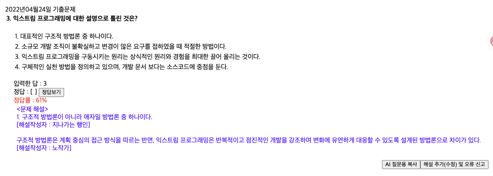

익스트림 프로그래밍은 구조적이 아닌 애자일 방법론

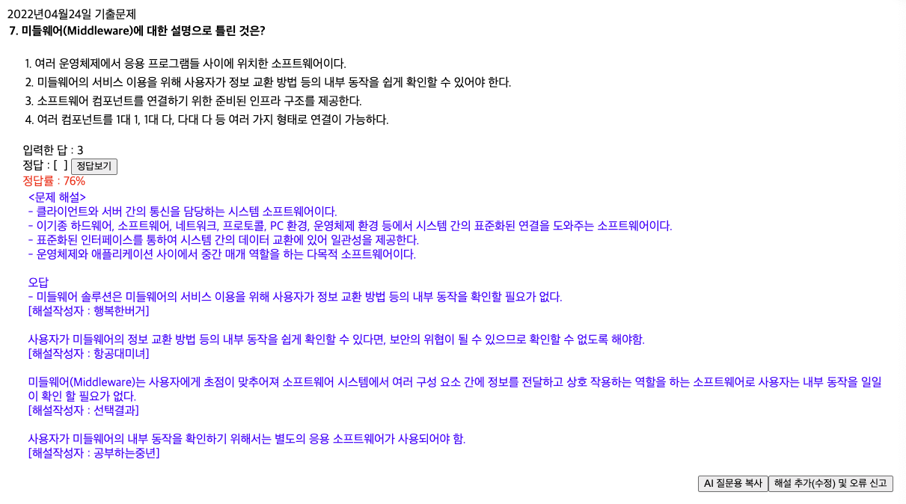

미들웨어 솔루션은 미들웨어의 서비스 이용을 위해 사용자가 정보 교환 방법 등의 내부 동작을 확인할 필요가 없다.

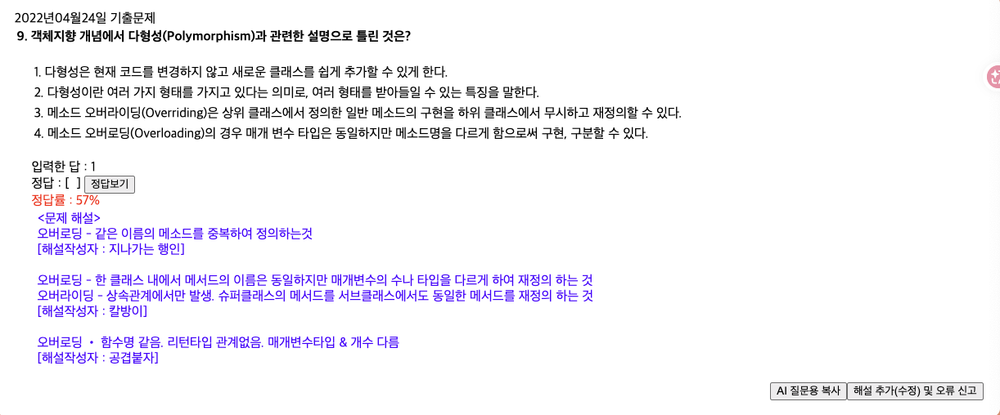

오버로딩 = 이름은 같은데 받는 게 다르다.
오버라이딩 = 부모가 만든 걸 자식이 다시 만든다.

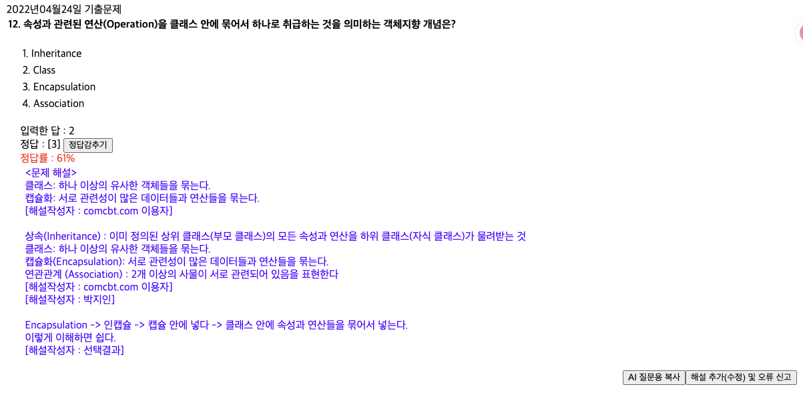

| 번호    | 개념                      | 의미                                      | 쉽게 말하면                  |
| ----- | ----------------------- | --------------------------------------- | ----------------------- |
| **1** | **Inheritance (상속)**    | 부모 클래스의 속성과 메소드를 자식 클래스가 물려받는 것         | **부모가 가진 것을 자식이 이어받음**  |
| **2** | **Class (클래스)**         | 객체를 만들기 위한 속성과 기능을 정의한 틀                | **객체를 만드는 설계도**         |
| **3** | **Encapsulation (캡슐화)** | 서로 관련된 **속성과 연산(메소드)을 하나의 클래스 안에 묶는 것** | **데이터와 기능을 하나의 상자에 넣음** |
| **4** | **Association (연관관계)**  | 서로 다른 객체나 클래스가 서로 관련되어 있는 관계            | **객체끼리 서로 연결되어 있음**     |

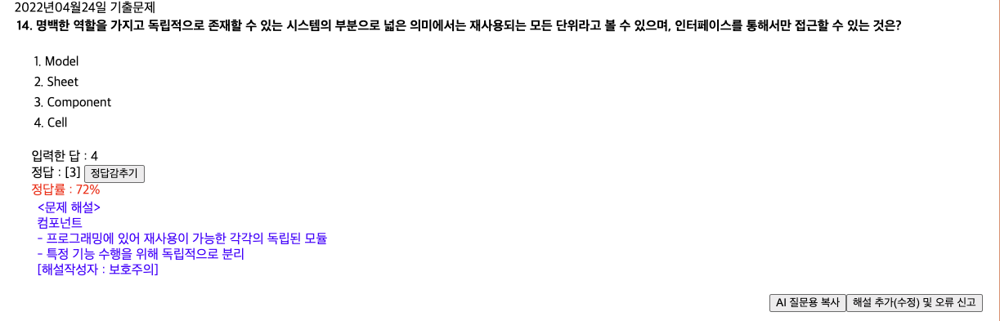

| 번호    | 개념                   | 의미                                                       | 쉽게 말하면               |
| ----- | -------------------- | -------------------------------------------------------- | -------------------- |
| **1** | **Model (모델)**       | 시스템의 데이터나 상태, 업무 로직 등을 표현하는 부분                           | **데이터와 처리 규칙을 담당**   |
| **2** | **Sheet (시트)**       | 표나 문서처럼 정보를 행·열 또는 일정한 형식으로 표현하는 단위                      | **데이터를 정리해서 보여주는 판** |
| **3** | **Component (컴포넌트)** | 독립적인 기능을 수행하며, 인터페이스를 통해 다른 부분과 연결되는 재사용 가능한 소프트웨어 구성 요소 | **하나의 기능을 맡는 독립 부품** |
| **4** | **Cell (셀)**         | 표나 스프레드시트에서 데이터를 입력하는 가장 작은 칸                            | **표 안의 한 칸**         |

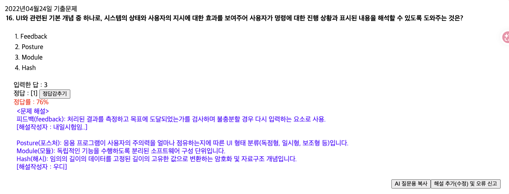

피드백(feedback): 처리된 결과를 측정하고 목표에 도달되었는가를 검사하며 불충분할 경우 다시 입력하는 요소로 사용.

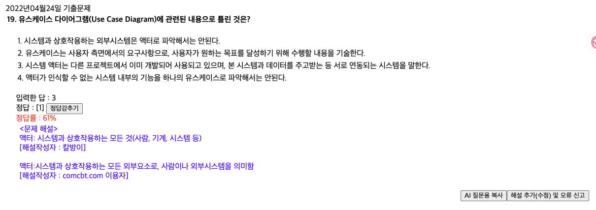

① 틀림 — 시스템과 상호작용하는 외부 시스템도 액터가 될 수 있다.
② 맞음 — 유스케이스는 사용자가 목표를 달성하기 위해 수행하는 기능을 나타낸다.
③ 맞음 — 다른 시스템과 데이터를 주고받는 외부 시스템도 시스템 액터로 볼 수 있다.
④ 맞음 — 액터가 인식할 수 없는 시스템 내부 기능은 유스케이스로 표현하지 않는다.

## 2022년 03월 05일 기출문제 - 70점

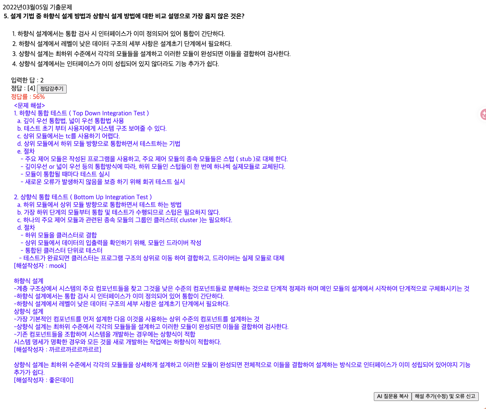

1. **① 맞음** — 하향식 설계는 상위 모듈부터 내려가므로 인터페이스가 미리 정의되어 통합이 비교적 쉽다.
2. **② 맞음** — 하향식 설계에서는 하위 데이터 구조의 세부 사항도 설계 과정에서 정의된다.
3. **③ 맞음** — 상향식 설계는 하위 모듈부터 만들고 완성된 모듈을 차례로 결합한다.
4. **④ 틀림** — 상향식 설계는 **인터페이스가 미리 성립되어 있어야** 새로운 기능을 추가하기 쉽다.

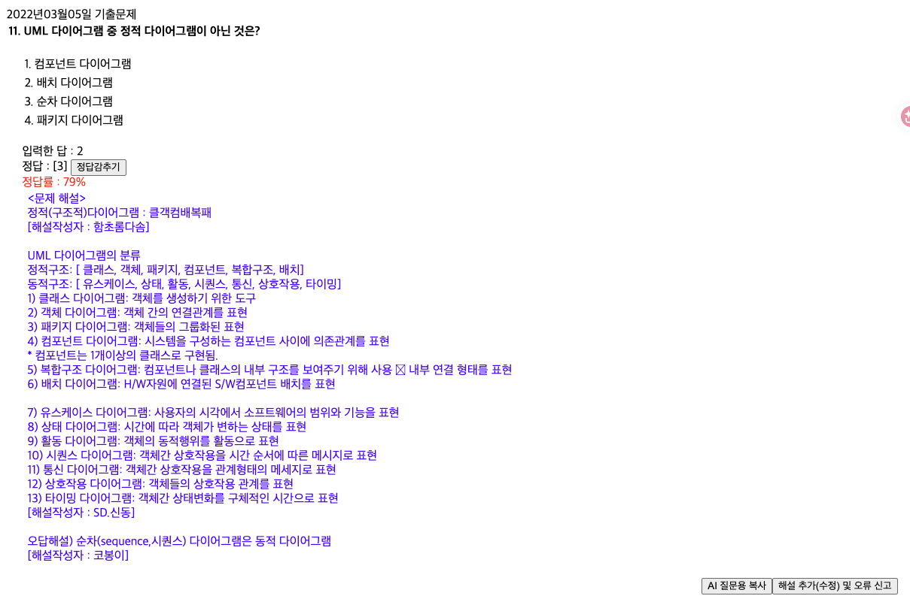

1. **① 정적** — 컴포넌트 다이어그램은 시스템을 구성하는 컴포넌트와 그 관계를 표현한다.
2. **② 정적** — 배치 다이어그램은 하드웨어와 소프트웨어의 배치 구조를 표현한다.
3. **③ 동적 → 정답** — 순차 다이어그램은 객체들이 **시간 순서에 따라 주고받는 메시지**를 표현한다.
4. **④ 정적** — 패키지 다이어그램은 관련 요소들을 패키지로 묶고 그 관계를 표현한다.

정적 클개패컴복배
동적 유상활시통상

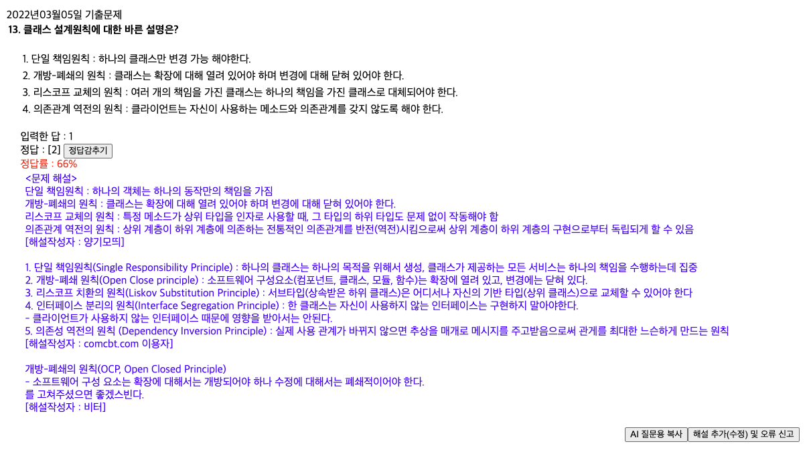

1. **① 틀림** — 단일 책임 원칙은 하나의 클래스가 **하나의 책임만 가져야 한다**는 원칙이다.
2. **② 맞음 → 정답** — 개방-폐쇄 원칙은 **확장에는 열려 있고, 변경에는 닫혀 있어야 한다**는 원칙이다.
3. **③ 틀림** — 리스코프 치환 원칙은 **하위 타입이 상위 타입을 문제없이 대체할 수 있어야 한다**는 원칙이다.
4. **④ 틀림** — 의존관계 역전 원칙은 구체적인 구현보다 **추상화에 의존해야 한다**는 원칙이다.

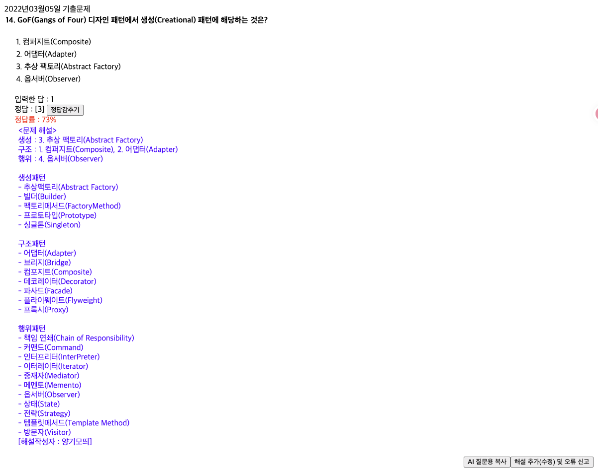

1. **① 구조 패턴** — 컴포지트는 객체들을 트리 구조로 묶어 부분과 전체를 동일하게 다룬다.
2. **② 구조 패턴** — 어댑터는 서로 호환되지 않는 인터페이스를 연결해 사용할 수 있게 한다.
3. **③ 생성 패턴 → 정답** — 추상 팩토리는 관련된 객체들을 생성하기 위한 인터페이스를 제공한다.
4. **④ 행위 패턴** — 옵서버는 객체의 상태가 바뀌면 관련 객체들에게 자동으로 알려준다.

생성패턴
- 추상팩토리(Abstract Factory)
- 빌더(Builder)
- 팩토리메서드(FactoryMethod)
- 프로토타입(Prototype)
- 싱글톤(Singleton)

구조패턴
- 어댑터(Adapter)
- 브리지(Bridge)
- 컴포지트(Composite)
- 데코레이터(Decorator)
- 파사드(Facade)
- 플라이웨이트(Flyweight)
- 프록시(Proxy)

행위패턴
- 책임 연쇄(Chain of Responsibility)
- 커맨드(Command)
- 인터프리터(InterPreter)
- 이터레이터(Iterator)
- 중재자(Mediator)
- 메멘토(Memento)
- 옵서버(Observer)
- 상태(State)
- 전략(Strategy)
- 템플릿메서드(Template Method)
- 방문자(Visitor)

1. **① 모듈 분해** — 큰 시스템을 여러 개의 작은 모듈로 나누는 설계 방법이다.
2. **② 디자인 패턴 → 정답** — 자주 발생하는 설계 문제에 대해 검증된 **일반적이고 반복 가능한 해결 방법**이다.
3. **③ 연관 관계** — 객체나 클래스가 서로 관련되어 있음을 나타내는 관계이다.
4. **④ 클래스 도출** — 요구사항을 분석하여 시스템에 필요한 클래스를 찾아내는 과정이다.

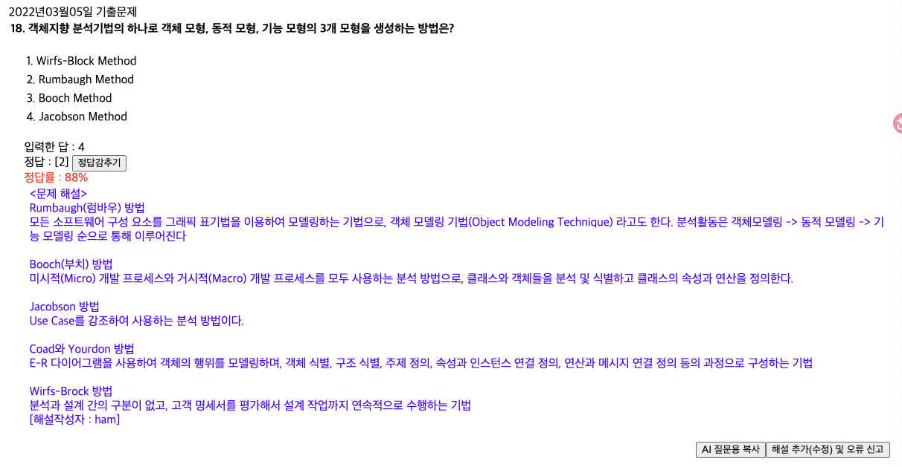
1. **① Wirfs-Brock Method** — 책임과 협력 관계를 중심으로 객체와 클래스를 분석하는 방법이다.
2. **② Rumbaugh Method → 정답** — **객체 모델, 동적 모델, 기능 모델**의 3가지 모델로 시스템을 분석한다.
3. **③ Booch Method** — 클래스와 객체를 식별하고 속성과 연산을 정의하는 객체지향 분석·설계 방법이다.
4. **④ Jacobson Method** — **Use Case를 중심으로** 사용자의 요구사항과 시스템 기능을 분석하는 방법이다.

## 2021년 08월 14일 기출문제 - 60점

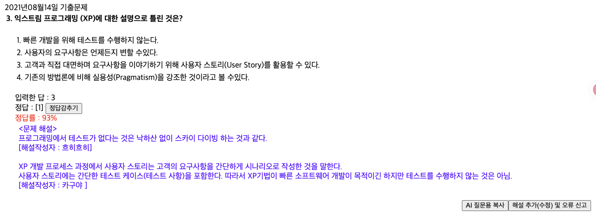

1. **① 틀림 → 정답** — XP는 빠른 개발을 추구하지만 **테스트를 매우 중요하게 여기며 지속적으로 수행한다.**
2. **② 맞음** — XP는 사용자의 요구사항이 개발 중 언제든지 변경될 수 있음을 받아들인다.
3. **③ 맞음** — XP는 고객의 요구사항을 표현하기 위해 **사용자 스토리(User Story)**를 활용한다.
4. **④ 맞음** — XP는 복잡한 절차보다 실제 개발에 도움이 되는 **실용성(Pragmatism)**을 중요하게 생각한다.

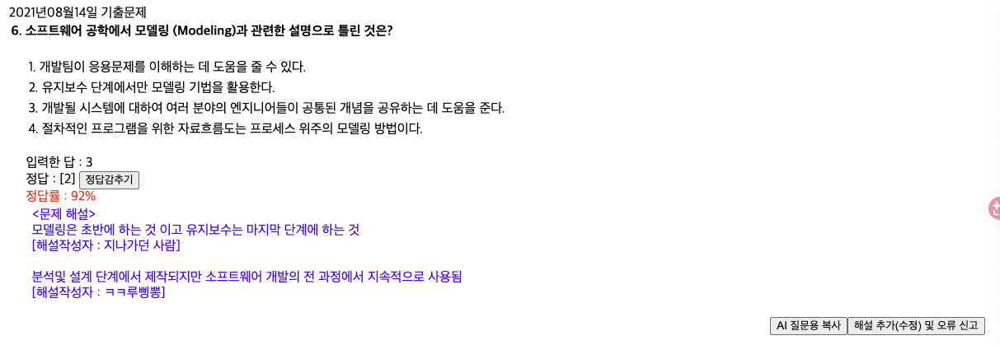

1. **① 맞음** — 모델링은 개발팀이 시스템과 문제를 이해하는 데 도움을 준다.
2. **② 틀림 → 정답** — 모델링은 유지보수 단계만이 아니라 **분석·설계 등 개발 전 과정에서 활용**된다.
3. **③ 맞음** — 모델링은 여러 분야의 개발자들이 시스템 개념을 공통으로 이해하는 데 도움을 준다.
4. **④ 맞음** — 자료흐름도(DFD)는 데이터의 흐름과 처리 과정을 표현하는 **프로세스 중심 모델링 방법**이다.

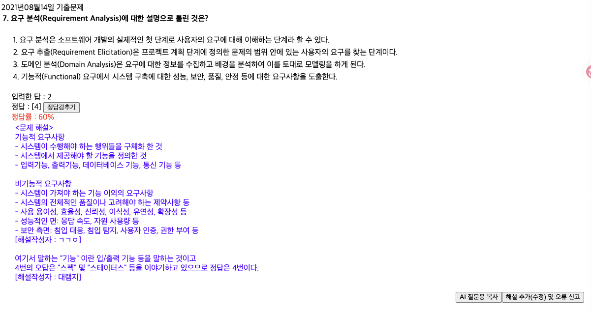

1. **① 맞음** — 요구 분석은 소프트웨어 개발 초기에 사용자의 요구사항을 이해하고 정리하는 단계이다.
2. **② 맞음** — 요구 추출은 프로젝트 범위 안에서 사용자가 원하는 요구사항을 찾아내는 과정이다.
3. **③ 맞음** — 도메인 분석은 관련 정보와 배경을 분석하여 시스템을 모델링하는 과정이다.
4. **④ 틀림 → 정답** — 성능·보안·품질·안정성은 **기능 요구사항이 아니라 비기능 요구사항**이다.

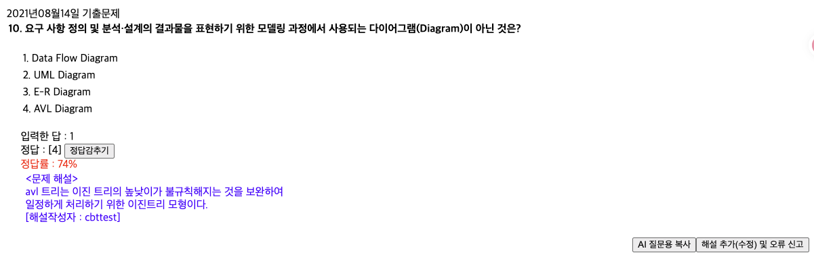

1. **① 사용됨** — DFD는 시스템의 **데이터 흐름과 처리 과정**을 표현하는 다이어그램이다.
2. **② 사용됨** — UML은 시스템의 **구조와 동작을 모델링**하기 위한 표준 다이어그램이다.
3. **③ 사용됨** — E-R 다이어그램은 **개체와 개체 사이의 관계**를 표현한다.
4. **④ 사용 안 됨 → 정답** — AVL은 **균형 이진 탐색 트리 자료구조**로, 요구사항 분석·설계 모델링 다이어그램이 아니다.

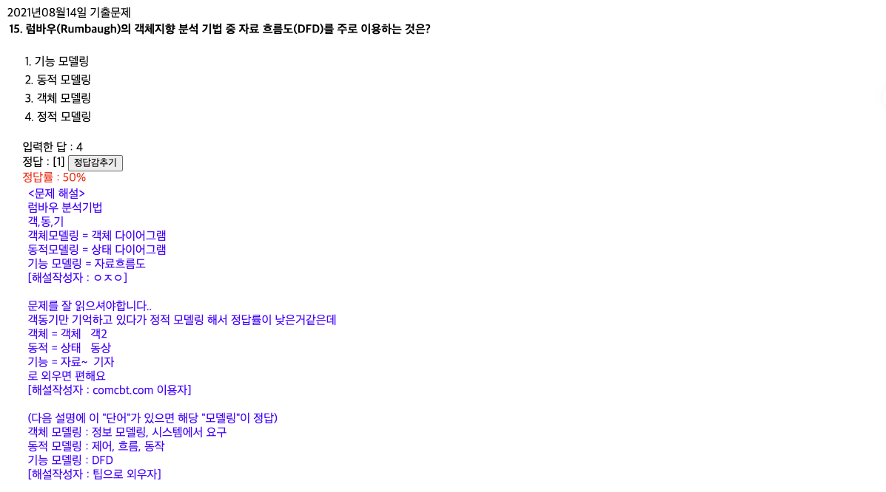
1. **① 기능 모델링 → 정답** — 기능 모델링은 **자료 흐름도(DFD)**를 이용해 데이터가 어떻게 입력·처리·출력되는지 표현한다.
2. **② 동적 모델링** — 동적 모델링은 **상태 다이어그램**을 이용해 시간에 따른 객체의 상태 변화를 표현한다.
3. **③ 객체 모델링** — 객체 모델링은 **객체 다이어그램**을 이용해 객체의 구조와 관계를 표현한다.
4. **④ 정적 모델링** — 럼바우의 대표 3가지 모델은 **객체·동적·기능 모델링**이며, 정적 모델링은 해당 분류가 아니다.

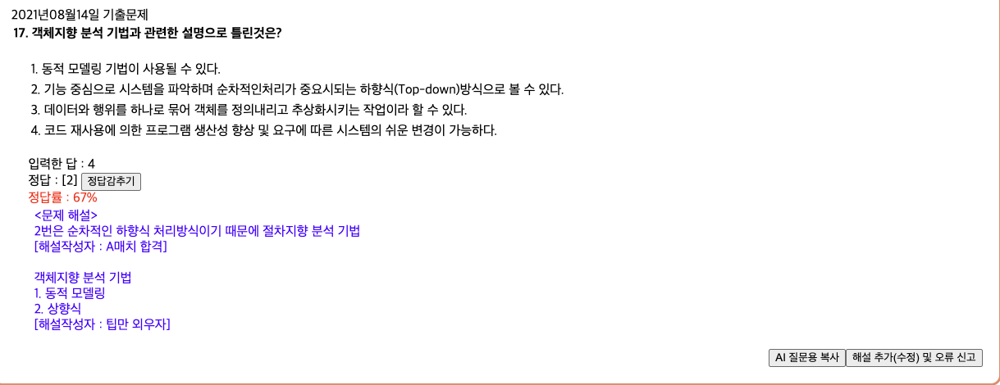

1. **① 맞음** — 객체지향 분석에서는 객체의 상태 변화를 표현하기 위해 **동적 모델링**을 사용할 수 있다.
2. **② 틀림 → 정답** — 기능 중심·순차 처리·하향식 방식은 **객체지향 분석이 아니라 구조적 분석의 특징**이다.
3. **③ 맞음** — 객체지향은 **데이터와 행위를 하나로 묶어 객체로 정의하고 추상화**한다.
4. **④ 맞음** — 객체지향은 **코드 재사용성이 높아 생산성 향상과 시스템 변경이 비교적 쉽다.**

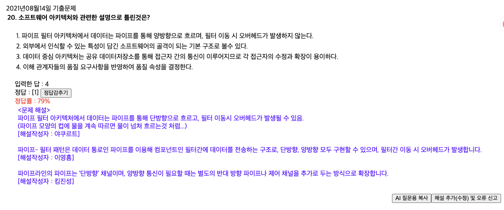

1. **① 맞음** — 객체지향 분석에서는 객체의 상태 변화를 표현하기 위해 **동적 모델링**을 사용할 수 있다.
2. **② 틀림 → 정답** — 기능 중심·순차 처리·하향식 방식은 **객체지향 분석이 아니라 구조적 분석의 특징**이다.
3. **③ 맞음** — 객체지향은 **데이터와 행위를 하나의 객체로 묶어 추상화**한다.
4. **④ 맞음** — 객체지향은 **코드 재사용성이 높아 생산성이 향상되고 시스템 변경이 쉽다.**

## 2021년 05월 15일 기출문제 - 55점

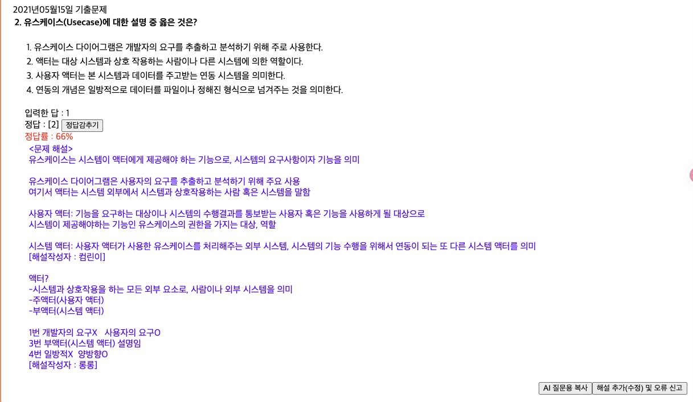
1. **① 틀림** — 유스케이스 다이어그램은 **개발자가 아니라 사용자의 요구사항**을 분석하기 위해 사용한다.
2. **② 맞음 → 정답** — 액터는 시스템과 상호작용하는 **사람이나 외부 시스템의 역할**을 의미한다.
3. **③ 틀림** — 사용자 액터는 **사람**을 의미하며, 연동 시스템은 **시스템 액터**에 해당한다.
4. **④ 틀림** — 연동은 단순히 파일을 넘기는 것이 아니라 **서로 다른 시스템이 데이터를 주고받는 것**을 의미한다.

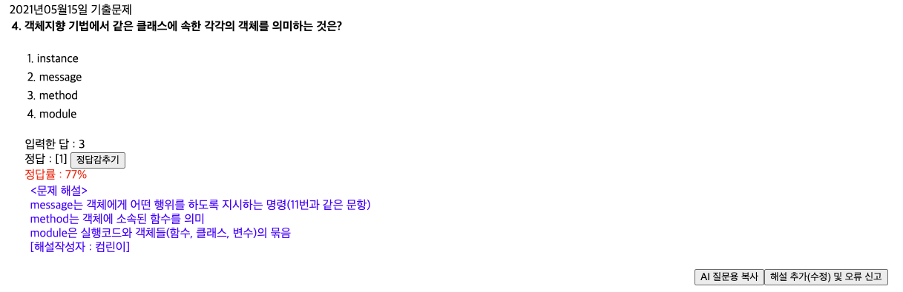

1. **① instance → 정답** — 같은 클래스에서 만들어진 각각의 객체를 **인스턴스**라고 한다.
2. **② message** — 객체에게 특정 동작을 요청하기 위해 보내는 **명령이나 요청**이다.
3. **③ method** — 객체가 수행할 수 있는 **기능이나 동작**을 의미한다.
4. **④ module** — 프로그램을 기능별로 나눈 **독립적인 구성 단위**를 의미한다.

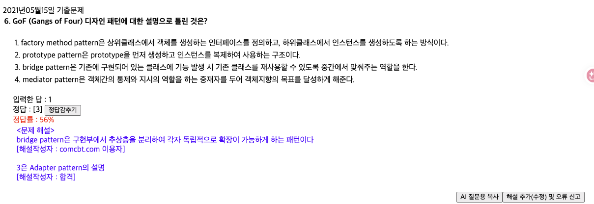

1. **① 맞음** — Factory Method는 객체 생성 방식을 상위 클래스에서 정의하고 실제 생성은 하위 클래스가 결정하게 한다.
2. **② 맞음** — Prototype은 기존 객체를 **복제해서 새로운 객체를 생성**하는 패턴이다.
3. **③ 틀림 → 정답** — 설명은 **Adapter 패턴**에 가깝고, Bridge는 **추상화와 구현을 분리해 각각 독립적으로 확장**할 수 있게 한다.
4. **④ 맞음** — Mediator는 객체들 사이에 **중재자**를 두어 직접적인 의존성을 줄이고 상호작용을 관리한다.

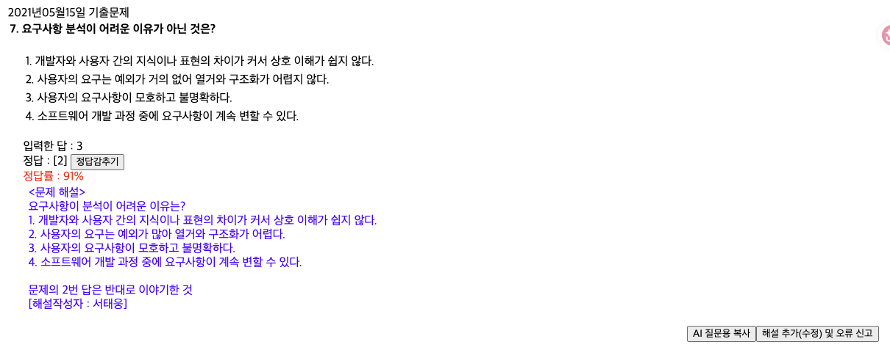
1. **① 맞음** — 개발자와 사용자의 지식과 표현 방식이 달라 서로의 요구를 정확히 이해하기 어렵다.
2. **② 틀림 → 정답** — 사용자 요구에는 **예외가 많고 요구사항을 빠짐없이 정리·구조화하기 어렵다.**
3. **③ 맞음** — 사용자의 요구사항은 모호하거나 명확하지 않은 경우가 많다.
4. **④ 맞음** — 소프트웨어 개발 도중에도 요구사항이 계속 변경될 수 있다.

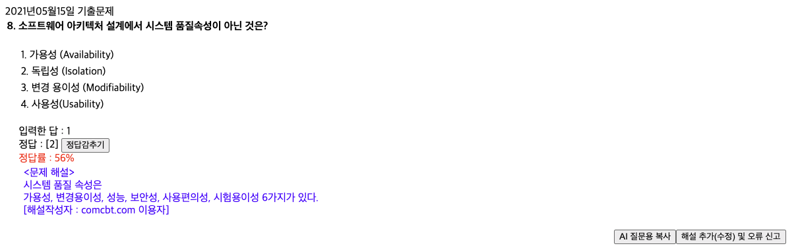

1. **① 맞음** — 가용성은 시스템이 필요할 때 **정상적으로 사용할 수 있는 정도**를 의미한다.
2. **② 틀림 → 정답** — 독립성은 일반적인 **소프트웨어 아키텍처 품질속성에 포함되지 않는다.**
3. **③ 맞음** — 변경 용이성은 시스템을 **쉽게 수정하거나 확장할 수 있는 정도**를 의미한다.
4. **④ 맞음** — 사용성은 사용자가 시스템을 **쉽게 배우고 편리하게 사용할 수 있는 정도**를 의미한다.

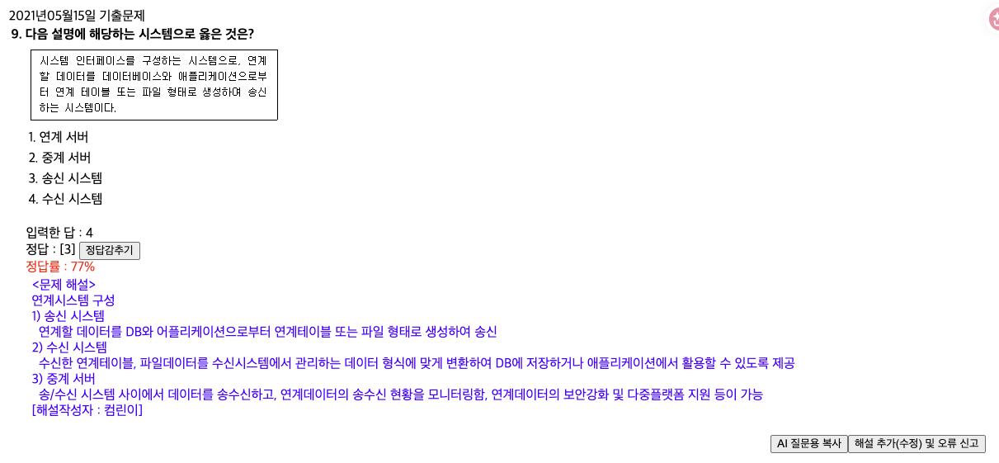

1. **① 연계 서버** — 서로 다른 시스템 간의 데이터 연계를 지원하는 서버이다.
2. **② 중계 서버** — 송신 시스템과 수신 시스템 사이에서 데이터를 전달하고 중계하는 서버이다.
3. **③ 송신 시스템 → 정답** — DB나 애플리케이션의 데이터를 연계 테이블 또는 파일 형태로 만들어 **전송하는 시스템**이다.
4. **④ 수신 시스템** — 전달받은 데이터를 변환·저장하거나 애플리케이션에서 사용할 수 있도록 처리하는 시스템이다.

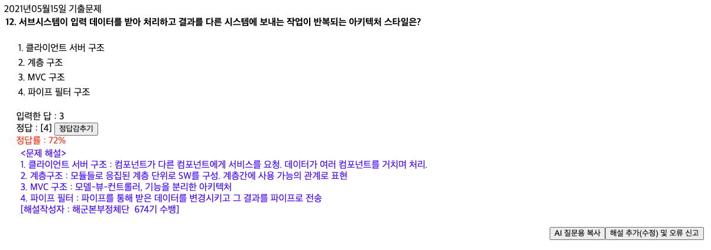

1. **① 클라이언트-서버 구조** — 클라이언트가 서버에 서비스를 요청하고 서버가 처리 결과를 반환하는 구조이다.
2. **② 계층 구조** — 시스템을 여러 계층으로 나누고 각 계층이 정해진 역할을 수행하는 구조이다.
3. **③ MVC 구조** — Model, View, Controller로 역할을 분리하여 구성하는 구조이다.
4. **④ 파이프 필터 구조 → 정답** — 한 서브시스템의 **출력 결과가 다음 서브시스템의 입력이 되어 반복적으로 처리**되는 구조이다.

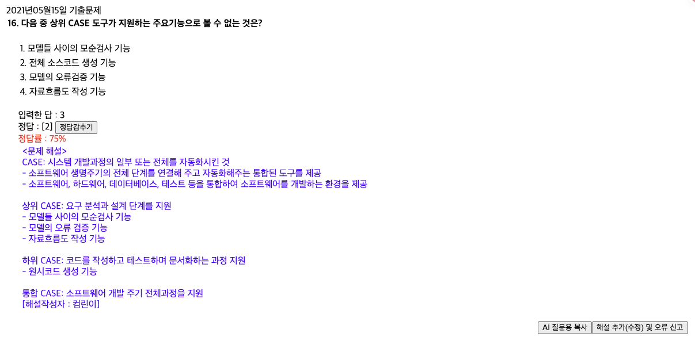

1. **① 지원함** — 상위 CASE는 모델들 사이의 **모순이나 불일치를 검사**할 수 있다.
2. **② 지원하지 않음 → 정답** — **전체 소스코드 생성**은 주로 하위 CASE가 담당한다.
3. **③ 지원함** — 상위 CASE는 설계 모델의 **오류를 검증**할 수 있다.
4. **④ 지원함** — 상위 CASE는 분석·설계 단계에서 **자료흐름도(DFD)를 작성**할 수 있다.

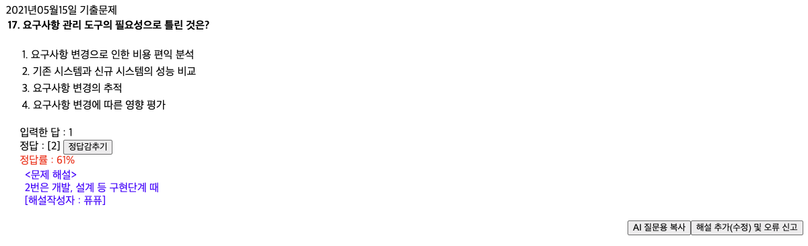

1. **① 맞음** — 요구사항 변경에 따른 **비용과 효과를 분석**하는 데 필요하다.
2. **② 틀림 → 정답** — 기존 시스템과 신규 시스템의 **성능 비교는 요구사항 관리 도구의 주요 목적이 아니다.**
3. **③ 맞음** — 요구사항이 언제, 어떻게 변경되었는지 **추적**할 수 있다.
4. **④ 맞음** — 요구사항 변경이 다른 기능이나 시스템에 미치는 **영향을 평가**할 수 있다.
