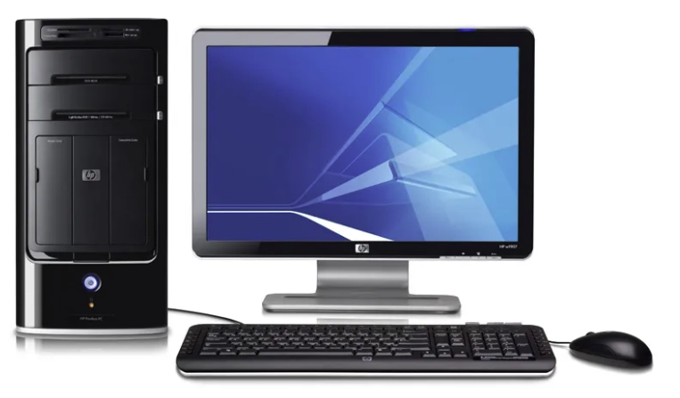

## 035. 컴퓨터의 개념

### 1. 컴퓨터의 정의

컴퓨터(EDPS, Electronic Data Processing System)는 입력된 자료(Data)를 프로그램이라는 명령 순서에  
따라 처리하여 그 결과를 사람이 알아볼 수 있도록 출력하는 전자(Electronic) 자료 처리(Data Processing) 시스템입니다.

- 컴퓨터는 프로그램에 의해 자동(Automatic)으로 처리되므로, ADPS(Automatic Data Processing System)라고도 합니다.
- 컴퓨터의 5대 특징은 정확성, 신속성, 대용량성, 범용성, 호환성입니다.

**자료와 정보 / GIGO(Garbage In Garbage Out)**

- 자료(Data) : 관찰이나 측정을 통해 수집한 단순한 사실이나 결과값을 말합니다.
- 정보(Information) : 의사결정에 도움을 줄 수 있는 유용한 형태로 자룔를 가공(처리)한 것을 말합니다.
- GIGO(Garbage In Garbage Out) : 쓰레기(Garbage)가 들어가면 쓰레기가 나온다는 의미입니다.  
아무리 정확한 컴퓨터라도 ‘사람이 잘못된 자료를 입력하면 컴퓨터도 잘못된 결과를 출력한다’라는 컴퓨터의 수동성을 뜻하는 말입니다.

 

> 컴퓨터를 왜 컴퓨터라고 부를까?  
>
> 컴퓨터는 Compute 즉 ‘계산하다라’는 영어의 어원에서 유래하였습니다.  
> 컴퓨터는 계산이 많은 작업에서 전문적으로 계산하는 사람을 일컫는 말이었으나   
>
> 그 작업을 컴퓨터가 대신하게 되면서 계산기를 컴퓨터라고 부르게 되었습니다.

### 2. 컴퓨터의 기원

컴퓨터에는 애니악, 애드삭, 애드박, 유니박이 있으며 각각의 특징은 다음과 같습니다.

- 애니악 (ENIAC) : 세계 최초의 전자계산기로 외장 방식을 이용한 컴퓨터 ([RAM](https://namu.wiki/w/RAM) 이 없음)
- 애드삭 (EDSAC) : 세계 최초의 프로그램 내장 방식으 ㄹ이용한 컴퓨터 ([RAM](https://namu.wiki/w/RAM)이 있음)
- 애드박 (EDVAC) : 프로그램 내장 방식과 2진법 채택한 컴퓨터 (폰 노이만)
- 유니박 (UNIVAC) : 최초의 상업용 컴퓨터

 

**프로그램 내장 방식**

- 프로그램 내장 방식(Stored Program)이란 프로그램과 데이터를 [주기억장치에](https://namu.wiki/w/%EA%B8%B0%EC%96%B5%EC%9E%A5%EC%B9%98) 저장해두고,  
주기억장치에 있는 프로그램 명령어를 하나씩 차례대로 수행하는 방식으로, 미국의 수학자 폰 노이만이 제안했습니다.

- 프로그램 내장 방식은 외부 프로그램 방식에 비해 수정하기 쉽고, 프로그램 공동으로 사용할 수 있다는 장점이 있습니다.

### 3. 컴퓨터의 세대별 특징

| 세대 | 주요 소자 | 주기억장치 | 주요 특징 |
| --- | --- | --- | --- |
| 1세대 | 진공관 | 자기 드럼 | 기계어 사용, 하드웨어 중심, 일괄처리 시스템 |
| 2세대 | 트랜지스터(TR) | 자기 코어 | 고급언어 개발, 운영체제 도입, 온라인 실시간 처리, 다중 프로그래밍 |
| 3세대 | 집적 회로(IC) | 집적 회로(IC) | 시분할 처리, 다중 처리, OCR·OMR·MICR, MIS 도입 |
| 4세대 | 고밀도 집적 회로(LSI) | 고밀도 집적 회로(LSI) | 개인용 컴퓨터(PC) 개발, 마이크로프로세서 개발, 네트워크 발달 |
| 5세대 | 초고밀도 집적 회로(VLSI) | 초고밀도 집적 회로(VLSI) | 인터넷, 인공지능(AI), 퍼지 이론, 패턴 인식, 전문가 시스템 등 신기술 개발 |

### 4. 컴퓨터의 구성

컴퓨터는 크게 **하드웨어**와 **소프트웨어**로 구성됩니다.

#### 4-1. 하드웨어

하드웨어는 컴퓨터 시스템을 구성하는 물리적인 장치, 즉 기계적인 부품을 의미합니다.

- **중앙처리장치(CPU)**
  - 레지스터
  - 제어장치
  - 연산장치

- **주변장치**
  - 입력장치
  - 출력장치
  - 보조기억장치

#### 4-2. 소프트웨어

소프트웨어는 하드웨어를 동작시키기 위한 명령어의 집합으로, 일반적으로 프로그램이라고 합니다.

- **시스템 소프트웨어**
  - 하드웨어 전체를 제어하고 운영하는 소프트웨어

- **응용 소프트웨어**
  - 특정 업무를 처리하기 위한 소프트웨어