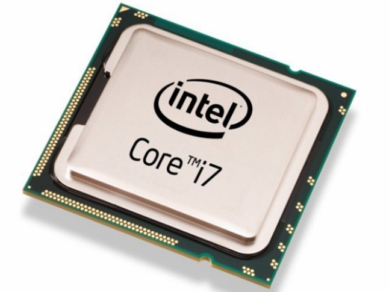
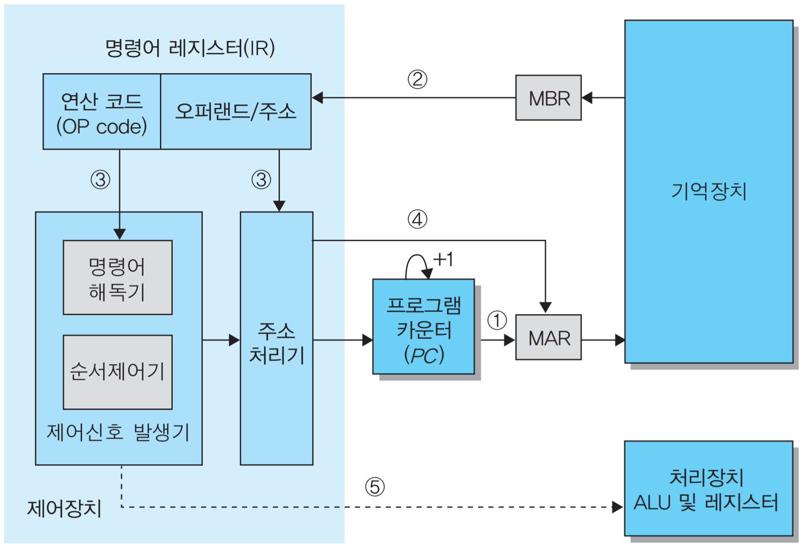
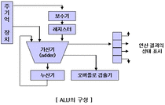
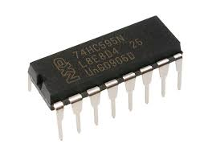

## 040. 중앙처리장치

### 1. 중앙처리장치의 정의와 구성
중앙처리장치(CPU Central Processing Unit)는 컴퓨터에서 명령어를 해석하고고 실행하며,  
전체 시스템의 동작을 제어하는 핵심 장치입니다.

사람의 몸에서 두뇌 역할을 하는 부분이라고 볼 수 있습니다.

- 중앙처리장치는 크게 **제어장치(Control Unit)**, **연산장치(ALU)**, 레지스터(Register)로 구성됩니다.

#### 왜 CPU를 이렇게 나누어 놓았을까?

CPU는 단순히 계산만 하는 장치가 아닙니다.  
어떤 명령을 읽고, 그것이 무엇을 의미하는지 해석하고, 필요한 데이터를 가져오고, 실제 계산을 하고,  
결과를 잠시 저장한 뒤 다시 다음 작업으로 넘어가야 합니다.

이 과정을 한 부분이 전부 담당하면 구조가 복잡해지고 비효율적이기 때문에 역할을 나누어 둔 것입니다.
- 제어장치 : 무엇을 해야 하는지 판단
- 연산장치 : 실제 계산 수행
- 레지스터 : 처리 도중 필요한 값들을 잠깐 저장

죽, CPU는 하나의 덩어리처럼 보이지만 내부적으로는  
**판단하는 부분, 계산하는 부분, 임시 저장하는 부분**이 나뉘어 협럭합니다.

#### 중앙처리장치의 성능을 나타내는 단위
- MIPS : 1초 동안 처리할 수 있는 명령어 수를 백만 단위로 나타낸 것
- FLOPS : 1초 동안 수행할 수 있는 부동소수점 연산 횟수
- 클럭 속도(Hz) : CPU의 동작 주기를 나타내는 값

##### 왜 클럭 속도가 중요한가?

CPU 내부의 각 동작은 제멋대로 일어나는 것이 아니라,
클럭(clock) 이라는 일정한 박자에 맞춰 진행됩니다.

즉, 명령어를 읽고, 해석하고, 실행하고, 결과를 저장하는 모든 과정은
이 클럭의 흐름에 맞춰 순서대로 진행됩니다.

그래서 클럭 속도가 높으면 기본적으로 더 많은 작업을 빠르게 처리할 수 있습니다.
다만 실제 성능은 단순히 클럭 속도만이 아니라 구조, 코어 수, 캐시, 명령 처리 방식 등의 영향을 함께 받습니다.

### 2. 제어장치

제어장치(Control Unit)는 컴퓨터 내의 각 장치들이 올바른 순서로 동작하도록 지시하고 제어하는 장치입니다.  
- 주기억장치에서 명령어를 읽어 들임
- 명령어의 의미를 해석함
- 필요한 장치에 제어 신호를 보냄
- 전체 실행 흐름을 관리함

즉, 제어장치는 직접 계산을 하는 장치가 아니라  
**"지금 무엇을 해야 하는지 결정하고, 다른 장치들에게 시키는 역할"**을 담당합니다.

#### 제어장치에서 사용되는 레지스터와 회로

| 구성 요소                                     | 기능                                |
| ----------------------------------------- | --------------------------------- |
| 프로그램 카운터(PC, Program Counter)             | 다음에 실행할 명령어의 주소를 기억하는 레지스터        |
| 명령 레지스터(IR, Instruction Register)         | 현재 실행 중인 명령어를 기억하는 레지스터           |
| 명령 해독기(Decoder)                           | 명령어의 의미를 해석하는 회로                  |
| 부호기(Encoder)                              | 해독된 명령에 따라 각 장치로 보낼 제어 신호를 만드는 회로 |
| 메모리 주소 레지스터(MAR, Memory Address Register) | 접근할 기억장치의 주소를 기억하는 레지스터           |
| 메모리 버퍼 레지스터(MBR, Memory Buffer Register)  | 기억장치와 주고받는 데이터를 잠시 저장하는 레지스터      |

#### 왜 프로그램 카운터(PC)는 다음 번지를 기억할까?

컴퓨터는 프로그램을 실행할 때 명령어를 순새대로 하나씩 처리해야 합니다.  
그런데 주기억장치 안에는 명령어가 여러 주소에 저장되어 있으므로,  
CPU는 "다음에 어디 있는 명령어를 가져와야 하는지" 알고 있어야 합니다.

그 역할을 하는 것이 바로 프로그램 카운터(PC)입니다.

즉, PC는 현재 명령어 자체를 기억하는 것이 아니라,  
다음에 읽을 명령어가 저장된 위치(주소)를 기억합니다.

##### 왜 꼭 주소를 기억해야 할까?

명령어는 메모리에 저장되어 있고, CPU는 메모리에서 명령어를 하나씩 꺼내 와서 실행합니다.  
이때 주소를 모르면 어떤 명령어를 가져와야 하는지 알 수가 업습니다.

간단하게 말하자면, 
- 책을 읽을 때 다음에 읽을 페이지 번호를 알고 있어야 하고
- 유튜브 재생목록에서 다음 곡 순서를 알고 있어야 하듯이
- CPU도 다음에 실행할 명령어 위치를 알아야 합니다.

그래서 PC는 프로그램의 실행 흐름을 이어 주는 역할을 합니다.

##### PC가 없으면 어떻게 될까?
- 다음 명령어 위치를 알 수 없음
- 프로그램을 순서대로 실행할 수 없음
- 분기, 반복, 함수 호출 같은 흐름 제어도 불가능해짐

즉, PC는 단순한 보조 정보가 아니라
프로그램 실행 자체를 가능하게 하는 핵심 레지스터다.

##### 왜 "현재 명령어"와 "다음 명령어 주소"를 따로 관리할까?

이것도 중요한 포인트입니다.

- **PC** : 다음에 가져올 명령어의 위치
- **IR** : 현재 실행 중인 명령어의 내용

이 둘을 나누는 이유는, CPU가 명령어를 처리하는 과정이 단계적으로 이루어지기 때문입니다.

예를 들어 CPU는 어떤 명령어를 이미 IR에 넣고 해석 중일 수 있고,  
동시에 다음 단계에서는 다음 명령어의 위치를 PC로 관리해야 합니다.

즉, **현재 실행 중인 것**과 **다음에 실행할 것**은 역할이 다르기 때문에 따로 둡니다.

#### 왜 명령어를 해독해야 할까?

메모리에서 가져온 명령어는 CPU 입장에서 단순한 비트 조합일 뿐입니다.  
예를 들어 어떤 비트 패턴은 덧셈일 수도 있고, 이동일 수도 있고, 저장일 수도 있습니다.

그래서 CPU는 그 비트가
- 덧셈인지
- 메모리 읽기인지
- 분기인지
- 비교인지

먼저 해석해야 합니다.

이 역할을 하는 것이 **명령 해독기(Decoder)** 입니다.

즉, 명령어를 읽어왔다고 해서 바로 실행할 수 있는 것이 아니라,  
**그 명령어가 무엇을 뜻하는지 먼저 이해해야 한다**는 뜻입니다.

#### 왜 부호기(Encoder)가 필요할까?

명령어를 해독한 뒤에는 실제로 관련 장치들을 움직여야 합니다.

예를 들어 덧셈 명령이라면
- ALU에게 덧셈을 하라고 지시해야 하고
- 필요한 데이터를 레지스터로 가져오게 해야 하고
- 결과를 저장하게 해야 합니다.

이처럼 실제 동작을 일으키는 제어 신호를 만들어 각 장치로 보내는 역할이 **부호기(Encoder)** 입니다.

즉,

- **Decoder** : 이 명령은 무엇인가?
- **Encoder** : 그러면 어떤 장치에 어떤 신호를 보낼 것인가?

이렇게 이해하면 됩니다.

#### 왜 MAR과 MBR은 따로 필요할까?

이 부분도 자주 헷갈리는 부분입니다.

- **MAR** : 어디에 접근할지 기억
- **MBR** : 무엇을 주고받을지 기억

즉,

- 주소용
- 데이터용

으로 역할이 나뉩니다.

##### 왜 주소와 데이터를 분리할까?

기억장치와 통신할 때는 항상 두 가지 정보가 필요합니다.

1. **어느 위치에 접근할지**
2. **그 위치에서 읽거나 쓸 실제 데이터가 무엇인지**

예를 들어 책장에서 책을 꺼낸다고 생각하면

- 몇 번째 칸인지 = 주소
- 실제 책의 내용 = 데이터

이 둘은 서로 다르기 때문에 CPU도 별도로 관리합니다.

##### 데이터를 읽을 때
- MAR에 읽고 싶은 주소를 넣습니다.
- 제어장치가 기억장치에 Read 신호를 보냅니다.
- 해당 주소의 데이터가 MBR로 들어옵니다.

##### 데이터를 저장할 때
- MAR에 저장할 주소를 넣습니다.
- MBR에 저장할 데이터를 넣습니다.
- 제어장치가 기억장치에 Write 신호를 보냅니다.
- MBR의 값이 MAR이 가리키는 주소에 기록됩니다.

즉,  
**MAR은 위치 담당**, **MBR은 내용 담당**입니다.

#### 제어장치의 명령 실행 순서

1. 프로그램 카운터(PC)에 저장된 다음 명령어 주소를 MAR로 보냅니다.
2. 해당 주소의 명령어를 기억장치에서 읽어 MBR로 가져옵니다.
3. MBR의 명령어를 IR로 이동시킵니다.
4. Decoder가 IR의 내용을 해석합니다.
5. Encoder가 필요한 제어 신호를 발생시켜 해당 장치가 동작하도록 합니다.

##### 왜 이런 순서를 거쳐야 할까?

CPU는 명령어를 무작정 실행하는 것이 아니라 다음과 같은 절차를 거칩니다.

- **가져오기(Fetch)** : 기억장치에서 명령어를 읽음
- **해독(Decode)** : 무슨 명령인지 해석
- **실행(Execute)** : 실제 동작 수행

이 순서를 거쳐야만 CPU가 안정적으로 명령어를 처리할 수 있습니다.

즉, CPU의 동작은 결국  
**Fetch → Decode → Execute**  
사이클의 반복이라고 볼 수 있습니다.

### 3. 연산장치

연산장치(ALU, Arithmetic Logic Unit)는 제어장치의 지시에 따라 실제 연산을 수행하는 장치입니다.

- 산술 연산
- 논리 연산
- 관계 연산
- 이동(Shift) 연산

등을 처리합니다.

즉, 제어장치가 **무엇을 할지 결정**한다면,  
연산장치는 **실제로 계산하는 역할**을 맡습니다.

#### 왜 연산장치를 따로 두는가?

명령 해석과 실제 계산은 성격이 다른 작업입니다.

- 명령 해석 : 어떤 작업인지 판단
- 연산 수행 : 값을 실제로 계산

이 둘을 분리하면 구조가 단순해지고, 각 역할에 맞게 설계할 수 있습니다.

쉽게 말하면 제어장치는 감독자이고,  
연산장치는 실무 담당자라고 볼 수 있습니다.

#### 연산장치에서 사용하는 레지스터와 회로

| 구성 요소 | 기능 |
| --- | --- |
| 가산기(Adder) | 2진수의 덧셈을 수행하는 회로 |
| 보수기(Complementor) | 뺄셈을 위해 입력값을 보수로 변환하는 회로 |
| 누산기(AC, Accumulator) | 연산 결과를 일시적으로 저장하는 레지스터 |
| 데이터 레지스터(Data Register) | 연산에 사용할 데이터를 기억하는 레지스터 |
| 상태 레지스터(Status Register) | 연산 중 발생하는 여러 상태값을 기억하는 레지스터 |

#### 왜 뺄셈을 보수기로 처리할까?

컴퓨터는 회로를 가능한 한 단순하게 만드는 것이 중요합니다.

뺄셈 전용 회로를 따로 복잡하게 만들기보다,  
뺄셈을 **보수를 이용한 덧셈 형태**로 바꾸면 같은 연산 구조를 더 효율적으로 활용할 수 있습니다.

즉, 컴퓨터 내부에서는  
"빼기"를 그대로 처리하기보다  
**보수로 바꿔서 더하는 방식**으로 처리하는 경우가 많습니다.

#### 왜 누산기(AC)가 필요할까?

연산 결과는 어디엔가 잠시 저장되어야 합니다.  
한 번의 연산으로 끝나는 것이 아니라, 이전 결과를 바탕으로 다음 연산이 이어지는 경우가 많기 때문입니다.

예를 들어

- A + B 계산
- 그 결과에 C를 더함
- 다시 비교 수행

이처럼 흐름이 이어지므로, 중간 결과를 임시로 보관할 장소가 필요합니다.

그 역할을 하는 것이 **누산기(AC)** 입니다.

#### 왜 상태 레지스터가 필요할까?

연산에서는 단순히 결과값만 중요한 것이 아닙니다.  
그 연산 과정에서 어떤 상태가 발생했는지도 중요합니다.

예를 들어

- 결과가 0인지
- 음수인지
- 자리올림이 발생했는지
- 오버플로가 발생했는지

이런 정보는 이후의 분기문이나 비교문 판단에 사용됩니다.

즉, 상태 레지스터는  
**연산 결과의 부가 정보**를 기억하는 장소입니다.

### 4. 레지스터

레지스터(Register)는 CPU 내부에서 명령어, 주소, 데이터, 연산 결과 등을 일시적으로 저장하는 임시 기억장치입니다.

- 플립플롭(Flip-Flop)이나 래치(Latch)로 구성됩니다.
- 메모리 중에서 가장 속도가 빠릅니다.
- CPU 내부에서 즉시 접근할 수 있습니다.
- 레지스터의 크기는 컴퓨터가 한 번에 처리할 수 있는 데이터의 크기와 관련이 있습니다.

#### 왜 레지스터가 필요할까?

CPU가 작업을 할 때마다 매번 주기억장치(RAM)로 가서 값을 가져온다면 너무 느립니다.  
그래서 CPU 내부에 아주 빠른 저장공간을 두고, 현재 처리에 필요한 값들을 잠깐 올려두는 것입니다.

즉, 레지스터는  
**CPU가 바로 꺼내 쓸 수 있는 초고속 작업 공간**입니다.

##### 레지스터가 필요한 이유
- 명령어 실행 속도를 높이기 위해
- 중간 결과를 잠시 저장하기 위해
- 주소와 데이터를 빠르게 주고받기 위해
- CPU 내부 처리 흐름이 끊기지 않게 하기 위해

#### 왜 레지스터가 메모리보다 빠를까?

레지스터는 CPU 내부에 직접 존재하며,  
용량은 매우 작지만 접근 속도가 매우 빠릅니다.

반면 메모리는 CPU 외부와의 버스 통신이 필요하고,  
용량은 크지만 상대적으로 느립니다.

그래서 CPU는 자주 쓰는 값을 레지스터에 두고 처리합니다.

#### 왜 레지스터 크기가 중요할까?

레지스터의 크기는 CPU가 한 번에 처리할 수 있는 데이터 단위와 밀접한 관련이 있습니다.

예를 들어 32비트 CPU와 64비트 CPU는  
한 번에 처리할 수 있는 데이터의 크기와 주소 표현 범위 등에 차이가 있습니다.

즉, 레지스터 크기는 CPU의 성능과 구조를 이해할 때 중요한 기준 중 하나입니다.

### 핵심 흐름 정리

이 단원을 전체 흐름으로 정리하면 다음과 같습니다.

1. **PC**가 다음 명령어의 주소를 기억합니다.
2. **MAR**이 그 주소를 전달합니다.
3. 기억장치에서 명령어를 읽어 **MBR**로 가져옵니다.
4. **IR**에 현재 명령어를 저장합니다.
5. **Decoder**가 명령어를 해석합니다.
6. **Encoder**가 제어 신호를 생성합니다.
7. **ALU**가 실제 연산을 수행합니다.
8. 결과는 **AC**나 다른 레지스터에 임시 저장됩니다.
9. 필요하면 다시 기억장치에 저장됩니다.
10. 다음 명령어로 이동합니다.

### 한 줄 정리

CPU는 명령어를 순서대로 가져오고, 해석하고, 실행하기 위해  
**제어장치, 연산장치, 레지스터가 역할을 나누어 협력하는 구조**입니다.